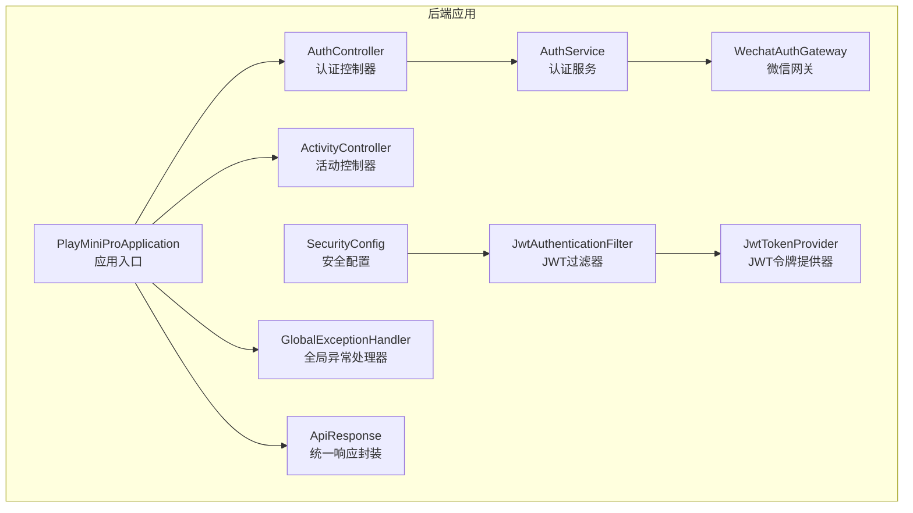
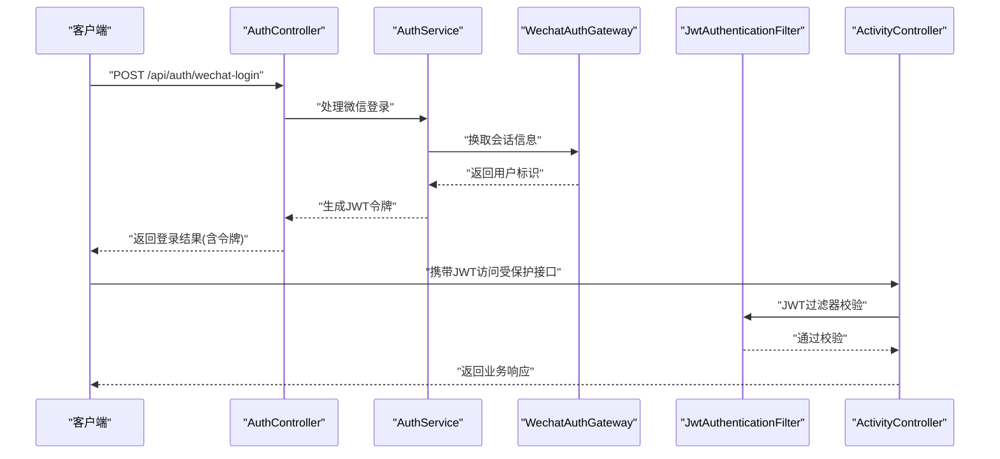
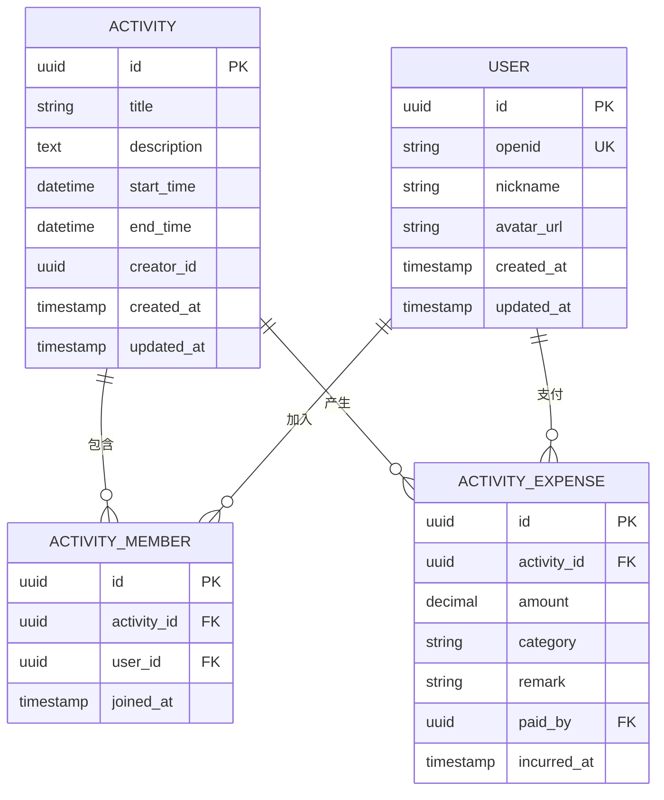
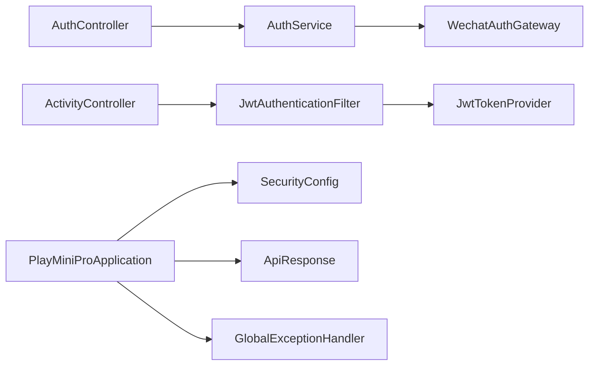

# API接口文档

<cite>
**本文档引用的文件**
- [PlayMiniProApplication.java](file://backend/src/main/java/com/playminipro/PlayMiniProApplication.java)
- [AuthController.java](file://backend/src/main/java/com/playminipro/auth/controller/AuthController.java)
- [ActivityController.java](file://backend/src/main/java/com/playminipro/activity/controller/ActivityController.java)
- [AuthService.java](file://backend/src/main/java/com/playminipro/auth/service/AuthService.java)
- [WechatAuthGateway.java](file://backend/src/main/java/com/playminipro/auth/service/WechatAuthGateway.java)
- [JwtAuthenticationFilter.java](file://backend/src/main/java/com/playminipro/common/security/JwtAuthenticationFilter.java)
- [JwtTokenProvider.java](file://backend/src/main/java/com/playminipro/common/security/JwtTokenProvider.java)
- [SecurityConfig.java](file://backend/src/main/java/com/playminipro/common/config/SecurityConfig.java)
- [JwtProperties.java](file://backend/src/main/java/com/playminipro/common/config/JwtProperties.java)
- [WechatProperties.java](file://backend/src/main/java/com/playminipro/common/config/WechatProperties.java)
- [GlobalExceptionHandler.java](file://backend/src/main/java/com/playminipro/common/exception/GlobalExceptionHandler.java)
- [ApiResponse.java](file://backend/src/main/java/com/playminipro/common/response/ApiResponse.java)
- [WechatLoginRequest.java](file://backend/src/main/java/com/playminipro/auth/dto/WechatLoginRequest.java)
- [WechatLoginResponse.java](file://backend/src/main/java/com/playminipro/auth/dto/WechatLoginResponse.java)
- [AuthUserResponse.java](file://backend/src/main/java/com/playminipro/auth/dto/AuthUserResponse.java)
- [CreateActivityRequest.java](file://backend/src/main/java/com/playminipro/activity/dto/CreateActivityRequest.java)
- [CreateActivityResponse.java](file://backend/src/main/java/com/playminipro/activity/dto/CreateActivityResponse.java)
- [ActivityDetailResponse.java](file://backend/src/main/java/com/playminipro/activity/dto/ActivityDetailResponse.java)
- [ActivitySummaryResponse.java](file://backend/src/main/java/com/playminipro/activity/dto/ActivitySummaryResponse.java)
- [ActivityMemberResponse.java](file://backend/src/main/java/com/playminipro/activity/dto/ActivityMemberResponse.java)
- [ActivityExpenseItemResponse.java](file://backend/src/main/java/com/playminipro/activity/dto/ActivityExpenseItemResponse.java)
- [ActivityExpenseSummaryResponse.java](file://backend/src/main/java/com/playminipro/activity/dto/ActivityExpenseSummaryResponse.java)
- [ActivitySettlementItemResponse.java](file://backend/src/main/java/com/playminipro/activity/dto/ActivitySettlementItemResponse.java)
- [AddActivityExpenseRequest.java](file://backend/src/main/java/com/playminipro/activity/dto/AddActivityExpenseRequest.java)
- [application.yml](file://backend/src/main/resources/application.yml)
- [V1__init_core_tables.sql](file://backend/src/main/resources/db/migration/V1__init_core_tables.sql)
- [V2__add_user_phone_number.sql](file://backend/src/main/resources/db/migration/V2__add_user_phone_number.sql)
- [V3__add_activity_expenses.sql](file://backend/src/main/resources/db/migration/V3__add_activity_expenses.sql)
- [V4__add_activity_notification_events.sql](file://backend/src/main/resources/db/migration/V4__add_activity_notification_events.sql)
</cite>

## 目录
1. [简介](#简介)
2. [项目结构](#项目结构)
3. [核心组件](#核心组件)
4. [架构总览](#架构总览)
5. [详细组件分析](#详细组件分析)
6. [依赖关系分析](#依赖关系分析)
7. [性能考虑](#性能考虑)
8. [故障排除指南](#故障排除指南)
9. [结论](#结论)
10. [附录](#附录)

## 简介
本API接口文档面向前端开发者与第三方集成者，系统性梳理PlayMiniPro后端服务的所有RESTful接口，覆盖认证（微信登录、用户信息）、活动管理（创建、查询、更新、删除）、成员管理、费用管理等模块。文档提供HTTP方法、URL路径、请求参数、响应格式、状态码说明、错误处理策略，并给出请求/响应示例与参数验证规则。同时说明JWT认证机制、权限控制、API版本管理策略、速率限制与安全考虑，以及常见使用场景的最佳实践。

## 项目结构
后端采用Spring Boot应用，按功能域分层组织：auth（认证）、activity（活动）、common（通用配置/异常/安全/响应封装）、db/migration（数据库迁移脚本）。核心入口类负责启动应用，配置类定义安全过滤链、JWT与微信参数，控制器暴露REST接口，DTO用于请求/响应数据传输，服务层实现业务逻辑，异常处理器统一返回标准响应格式。

**图表来源**
- [PlayMiniProApplication.java](file://backend/src/main/java/com/playminipro/PlayMiniProApplication.java)
- [AuthController.java](file://backend/src/main/java/com/playminipro/auth/controller/AuthController.java)
- [ActivityController.java](file://backend/src/main/java/com/playminipro/activity/controller/ActivityController.java)
- [AuthService.java](file://backend/src/main/java/com/playminipro/auth/service/AuthService.java)
- [WechatAuthGateway.java](file://backend/src/main/java/com/playminipro/auth/service/WechatAuthGateway.java)
- [SecurityConfig.java](file://backend/src/main/java/com/playminipro/common/config/SecurityConfig.java)
- [JwtAuthenticationFilter.java](file://backend/src/main/java/com/playminipro/common/security/JwtAuthenticationFilter.java)
- [JwtTokenProvider.java](file://backend/src/main/java/com/playminipro/common/security/JwtTokenProvider.java)
- [GlobalExceptionHandler.java](file://backend/src/main/java/com/playminipro/common/exception/GlobalExceptionHandler.java)
- [ApiResponse.java](file://backend/src/main/java/com/playminipro/common/response/ApiResponse.java)

**章节来源**
- [PlayMiniProApplication.java](file://backend/src/main/java/com/playminipro/PlayMiniProApplication.java)
- [application.yml](file://backend/src/main/resources/application.yml)

## 核心组件
- 认证控制器：提供微信登录、获取用户信息等接口，负责接收前端传入的微信code，调用认证服务完成登录并发放JWT。
- 活动控制器：提供活动的创建、详情查询、列表查询、成员管理、费用录入与汇总、结算项等接口。
- 安全配置：定义JWT过滤器链、放行路径、跨域策略等。
- JWT令牌：基于JWT实现无状态认证，支持权限校验与过期处理。
- 统一响应：所有接口返回统一的响应包装结构，便于前端解析与错误处理。
- 全局异常：集中处理业务异常与运行时异常，返回标准化错误信息。

**章节来源**
- [AuthController.java](file://backend/src/main/java/com/playminipro/auth/controller/AuthController.java)
- [ActivityController.java](file://backend/src/main/java/com/playminipro/activity/controller/ActivityController.java)
- [SecurityConfig.java](file://backend/src/main/java/com/playminipro/common/config/SecurityConfig.java)
- [JwtAuthenticationFilter.java](file://backend/src/main/java/com/playminipro/common/security/JwtAuthenticationFilter.java)
- [JwtTokenProvider.java](file://backend/src/main/java/com/playminipro/common/security/JwtTokenProvider.java)
- [ApiResponse.java](file://backend/src/main/java/com/playminipro/common/response/ApiResponse.java)
- [GlobalExceptionHandler.java](file://backend/src/main/java/com/playminipro/common/exception/GlobalExceptionHandler.java)

## 架构总览
下图展示从客户端到后端的关键交互流程，包括认证、请求拦截、业务处理与统一响应。

**图表来源**
- [AuthController.java](file://backend/src/main/java/com/playminipro/auth/controller/AuthController.java)
- [AuthService.java](file://backend/src/main/java/com/playminipro/auth/service/AuthService.java)
- [WechatAuthGateway.java](file://backend/src/main/java/com/playminipro/auth/service/WechatAuthGateway.java)
- [JwtAuthenticationFilter.java](file://backend/src/main/java/com/playminipro/common/security/JwtAuthenticationFilter.java)
- [ActivityController.java](file://backend/src/main/java/com/playminipro/activity/controller/ActivityController.java)

## 详细组件分析

### 认证接口
- 接口目标：通过微信code换取用户身份，返回JWT令牌；获取当前登录用户信息。
- 认证方式：JWT Bearer Token，需在请求头Authorization中携带。
- 权限控制：部分接口需要已登录用户，部分接口可匿名访问（如登录）。

#### 微信登录
- 方法与路径：POST /api/auth/wechat-login
- 请求体：包含微信登录所需的code等参数
- 响应体：包含用户标识、JWT令牌等
- 状态码：200 成功；400 参数错误；401 未授权；500 内部错误
- 错误处理：参数缺失或无效、微信接口异常、生成令牌失败均通过统一异常处理器返回标准错误

**章节来源**
- [AuthController.java](file://backend/src/main/java/com/playminipro/auth/controller/AuthController.java)
- [WechatLoginRequest.java](file://backend/src/main/java/com/playminipro/auth/dto/WechatLoginRequest.java)
- [WechatLoginResponse.java](file://backend/src/main/java/com/playminipro/auth/dto/WechatLoginResponse.java)
- [AuthService.java](file://backend/src/main/java/com/playminipro/auth/service/AuthService.java)
- [WechatAuthGateway.java](file://backend/src/main/java/com/playminipro/auth/service/WechatAuthGateway.java)
- [GlobalExceptionHandler.java](file://backend/src/main/java/com/playminipro/common/exception/GlobalExceptionHandler.java)

#### 获取当前用户信息
- 方法与路径：GET /api/auth/me
- 请求头：Authorization: Bearer <JWT_TOKEN>
- 响应体：当前用户信息
- 状态码：200 成功；401 未授权；404 用户不存在；500 内部错误
- 错误处理：令牌无效、过期或用户被删除时返回相应错误

**章节来源**
- [AuthController.java](file://backend/src/main/java/com/playminipro/auth/controller/AuthController.java)
- [AuthUserResponse.java](file://backend/src/main/java/com/playminipro/auth/dto/AuthUserResponse.java)
- [JwtAuthenticationFilter.java](file://backend/src/main/java/com/playminipro/common/security/JwtAuthenticationFilter.java)
- [GlobalExceptionHandler.java](file://backend/src/main/java/com/playminipro/common/exception/GlobalExceptionHandler.java)

### 活动接口
- 接口目标：活动的创建、详情查询、列表查询、成员管理、费用录入与汇总、结算项等。
- 权限控制：除公开列表外，多数接口需登录用户访问。

#### 创建活动
- 方法与路径：POST /api/activities
- 请求头：Authorization: Bearer <JWT_TOKEN>
- 请求体：活动基本信息
- 响应体：创建后的活动标识与基础信息
- 状态码：201 创建成功；400 参数错误；401 未授权；500 内部错误

**章节来源**
- [ActivityController.java](file://backend/src/main/java/com/playminipro/activity/controller/ActivityController.java)
- [CreateActivityRequest.java](file://backend/src/main/java/com/playminipro/activity/dto/CreateActivityRequest.java)
- [CreateActivityResponse.java](file://backend/src/main/java/com/playminipro/activity/dto/CreateActivityResponse.java)
- [JwtAuthenticationFilter.java](file://backend/src/main/java/com/playminipro/common/security/JwtAuthenticationFilter.java)

#### 查询活动详情
- 方法与路径：GET /api/activities/{id}
- 路径参数：id 活动标识
- 响应体：活动详情（含成员、费用等）
- 状态码：200 成功；404 未找到；401 未授权；500 内部错误

**章节来源**
- [ActivityController.java](file://backend/src/main/java/com/playminipro/activity/controller/ActivityController.java)
- [ActivityDetailResponse.java](file://backend/src/main/java/com/playminipro/activity/dto/ActivityDetailResponse.java)

#### 查询活动列表
- 方法与路径：GET /api/activities
- 查询参数：分页、筛选条件（如状态、时间范围）
- 响应体：活动摘要列表
- 状态码：200 成功；400 参数错误；401 未授权；500 内部错误

**章节来源**
- [ActivityController.java](file://backend/src/main/java/com/playminipro/activity/controller/ActivityController.java)
- [ActivitySummaryResponse.java](file://backend/src/main/java/com/playminipro/activity/dto/ActivitySummaryResponse.java)

#### 添加活动费用
- 方法与路径：POST /api/activities/{id}/expenses
- 路径参数：id 活动标识
- 请求头：Authorization: Bearer <JWT_TOKEN>
- 请求体：费用明细
- 响应体：费用汇总
- 状态码：201 创建成功；400 参数错误；401 未授权；404 未找到；500 内部错误

**章节来源**
- [ActivityController.java](file://backend/src/main/java/com/playminipro/activity/controller/ActivityController.java)
- [AddActivityExpenseRequest.java](file://backend/src/main/java/com/playminipro/activity/dto/AddActivityExpenseRequest.java)
- [ActivityExpenseItemResponse.java](file://backend/src/main/java/com/playminipro/activity/dto/ActivityExpenseItemResponse.java)
- [ActivityExpenseSummaryResponse.java](file://backend/src/main/java/com/playminipro/activity/dto/ActivityExpenseSummaryResponse.java)

#### 查询活动费用汇总
- 方法与路径：GET /api/activities/{id}/expenses-summary
- 路径参数：id 活动标识
- 响应体：费用汇总统计
- 状态码：200 成功；404 未找到；500 内部错误

**章节来源**
- [ActivityController.java](file://backend/src/main/java/com/playminipro/activity/controller/ActivityController.java)
- [ActivityExpenseSummaryResponse.java](file://backend/src/main/java/com/playminipro/activity/dto/ActivityExpenseSummaryResponse.java)

#### 查询活动结算项
- 方法与路径：GET /api/activities/{id}/settlement
- 路径参数：id 活动标识
- 响应体：结算明细
- 状态码：200 成功；404 未找到；500 内部错误

**章节来源**
- [ActivityController.java](file://backend/src/main/java/com/playminipro/activity/controller/ActivityController.java)
- [ActivitySettlementItemResponse.java](file://backend/src/main/java/com/playminipro/activity/dto/ActivitySettlementItemResponse.java)

#### 查询活动成员
- 方法与路径：GET /api/activities/{id}/members
- 路径参数：id 活动标识
- 响应体：成员列表
- 状态码：200 成功；404 未找到；500 内部错误

**章节来源**
- [ActivityController.java](file://backend/src/main/java/com/playminipro/activity/controller/ActivityController.java)
- [ActivityMemberResponse.java](file://backend/src/main/java/com/playminipro/activity/dto/ActivityMemberResponse.java)

### 数据模型与复杂度分析
以下为活动相关核心数据模型的关系图，展示实体间的一对多关系与典型查询复杂度。

**图表来源**
- [V1__init_core_tables.sql](file://backend/src/main/resources/db/migration/V1__init_core_tables.sql)
- [V2__add_user_phone_number.sql](file://backend/src/main/resources/db/migration/V2__add_user_phone_number.sql)
- [V3__add_activity_expenses.sql](file://backend/src/main/resources/db/migration/V3__add_activity_expenses.sql)
- [V4__add_activity_notification_events.sql](file://backend/src/main/resources/db/migration/V4__add_activity_notification_events.sql)

## 依赖关系分析
- 控制器依赖服务层进行业务处理，服务层依赖数据访问组件与外部网关（微信）。
- 安全配置通过过滤器链拦截请求，校验JWT令牌有效性。
- 统一响应封装与全局异常处理器贯穿整个请求生命周期，保证错误与响应格式一致。

**图表来源**
- [AuthController.java](file://backend/src/main/java/com/playminipro/auth/controller/AuthController.java)
- [AuthService.java](file://backend/src/main/java/com/playminipro/auth/service/AuthService.java)
- [WechatAuthGateway.java](file://backend/src/main/java/com/playminipro/auth/service/WechatAuthGateway.java)
- [ActivityController.java](file://backend/src/main/java/com/playminipro/activity/controller/ActivityController.java)
- [JwtAuthenticationFilter.java](file://backend/src/main/java/com/playminipro/common/security/JwtAuthenticationFilter.java)
- [JwtTokenProvider.java](file://backend/src/main/java/com/playminipro/common/security/JwtTokenProvider.java)
- [SecurityConfig.java](file://backend/src/main/java/com/playminipro/common/config/SecurityConfig.java)
- [PlayMiniProApplication.java](file://backend/src/main/java/com/playminipro/PlayMiniProApplication.java)
- [ApiResponse.java](file://backend/src/main/java/com/playminipro/common/response/ApiResponse.java)
- [GlobalExceptionHandler.java](file://backend/src/main/java/com/playminipro/common/exception/GlobalExceptionHandler.java)

**章节来源**
- [PlayMiniProApplication.java](file://backend/src/main/java/com/playminipro/PlayMiniProApplication.java)
- [SecurityConfig.java](file://backend/src/main/java/com/playminipro/common/config/SecurityConfig.java)

## 性能考虑
- 连接池与超时：合理配置数据库连接池大小与SQL执行超时，避免慢查询拖垮服务。
- 缓存策略：对高频查询（如活动列表、成员列表）引入缓存，降低数据库压力。
- 分页与索引：列表查询必须分页，确保对常用查询字段建立索引。
- 并发控制：对写操作（创建活动、添加费用）使用乐观锁或唯一约束，避免并发冲突。
- 日志与监控：开启关键接口的访问日志与指标埋点，便于定位性能瓶颈。

## 故障排除指南
- 401 未授权：检查Authorization头是否正确携带Bearer Token，确认令牌未过期。
- 403 禁止访问：检查用户权限与资源归属，确保操作者具备相应权限。
- 404 未找到：核对资源ID是否存在，路径参数是否正确。
- 500 内部错误：查看全局异常处理器返回的具体错误信息，结合后端日志定位问题。
- 参数校验失败：根据DTO定义检查请求参数类型与必填项，确保符合约束。

**章节来源**
- [GlobalExceptionHandler.java](file://backend/src/main/java/com/playminipro/common/exception/GlobalExceptionHandler.java)
- [ApiResponse.java](file://backend/src/main/java/com/playminipro/common/response/ApiResponse.java)

## 结论
本文档提供了PlayMiniPro后端API的完整接口规范与实现参考，涵盖认证、活动管理、成员与费用管理等核心能力。通过统一的JWT认证与安全配置，配合标准化的响应与异常处理，确保前后端协作顺畅、可维护性强。建议在生产环境中结合缓存、分页与索引优化，持续监控与迭代。

## 附录

### 认证机制与权限控制
- JWT令牌：登录成功后返回JWT，后续请求在Authorization头中以Bearer形式携带。
- 过滤器链：SecurityConfig定义了放行路径与拦截规则，确保受保护接口仅允许有效令牌访问。
- 权限模型：基于用户身份与资源归属进行权限判断，未授权访问返回401/403。

**章节来源**
- [SecurityConfig.java](file://backend/src/main/java/com/playminipro/common/config/SecurityConfig.java)
- [JwtAuthenticationFilter.java](file://backend/src/main/java/com/playminipro/common/security/JwtAuthenticationFilter.java)
- [JwtTokenProvider.java](file://backend/src/main/java/com/playminipro/common/security/JwtTokenProvider.java)

### API版本管理策略
- 版本号：建议在URL中体现版本（如/api/v1/...），便于平滑演进与向后兼容。
- 变更策略：新增接口优先在新版本暴露，旧版本保持稳定；废弃接口预留过渡期。

### 速率限制与安全考虑
- 速率限制：建议对登录、创建活动等高频接口实施限流，防止恶意刷量。
- 安全措施：启用HTTPS、CORS白名单、输入参数严格校验、敏感信息脱敏输出。

### 常见使用场景与最佳实践
- 场景一：用户首次登录
  - 步骤：前端获取微信code -> 调用登录接口 -> 保存JWT -> 后续请求携带令牌
  - 注意：妥善存储与刷新令牌，避免泄露
- 场景二：创建活动并邀请成员
  - 步骤：创建活动 -> 添加成员 -> 录入费用 -> 查看汇总与结算
  - 注意：费用录入需明确支付人与分类，确保账目清晰
- 场景三：查询与导出
  - 步骤：分页查询活动列表 -> 按需导出费用明细
  - 注意：大数据量导出需异步处理，避免阻塞线程