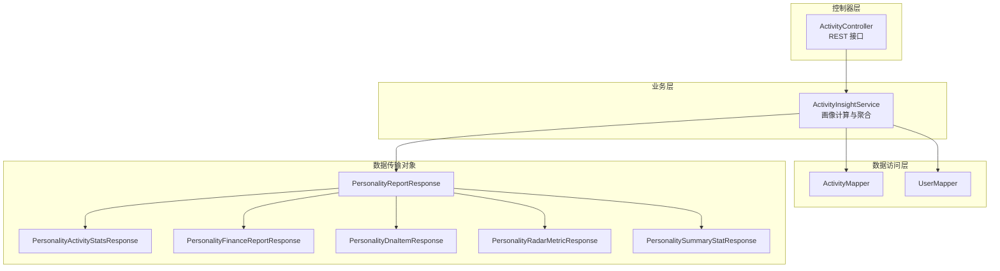
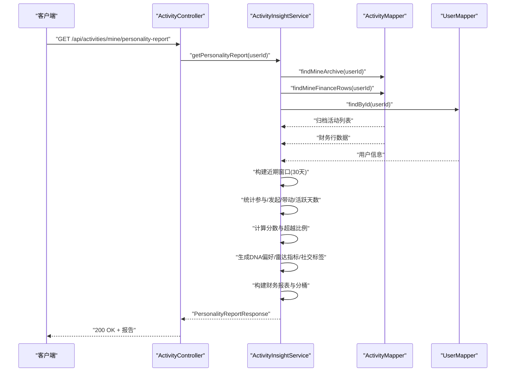
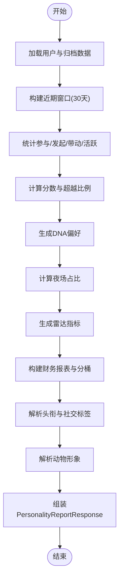
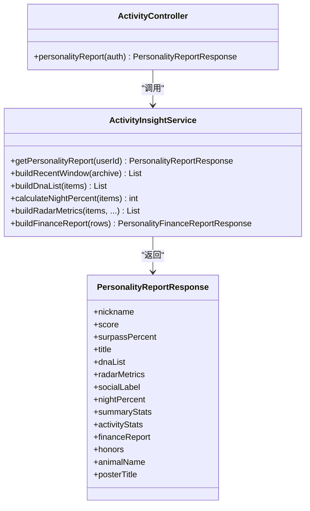

# 个人画像接口

<cite>
**本文引用的文件**
- [ActivityController.java](file://backend/src/main/java/com/playminipro/activity/controller/ActivityController.java)
- [ActivityInsightService.java](file://backend/src/main/java/com/playminipro/activity/service/ActivityInsightService.java)
- [PersonalityReportResponse.java](file://backend/src/main/java/com/playminipro/activity/dto/PersonalityReportResponse.java)
- [PersonalityActivityStatsResponse.java](file://backend/src/main/java/com/playminipro/activity/dto/PersonalityActivityStatsResponse.java)
- [PersonalityFinanceReportResponse.java](file://backend/src/main/java/com/playminipro/activity/dto/PersonalityFinanceReportResponse.java)
- [PersonalityDnaItemResponse.java](file://backend/src/main/java/com/playminipro/activity/dto/PersonalityDnaItemResponse.java)
- [PersonalityRadarMetricResponse.java](file://backend/src/main/java/com/playminipro/activity/dto/PersonalityRadarMetricResponse.java)
- [PersonalitySummaryStatResponse.java](file://backend/src/main/java/com/playminipro/activity/dto/PersonalitySummaryStatResponse.java)
</cite>

## 目录
1. [简介](#简介)
2. [项目结构](#项目结构)
3. [核心组件](#核心组件)
4. [架构概览](#架构概览)
5. [详细组件分析](#详细组件分析)
6. [依赖分析](#依赖分析)
7. [性能考虑](#性能考虑)
8. [故障排除指南](#故障排除指南)
9. [结论](#结论)
10. [附录](#附录)

## 简介
本文件为 PlayMiniPro 项目的个人画像接口专门API文档，聚焦于以下接口：
- 个人活动参与统计：GET /api/activities/mine/personality-report
- 个人财务画像：GET /api/activities/mine/personality-report（返回字段中包含财务报表）
- 个人社交关系分析：GET /api/activities/mine/personality-report（返回字段中包含社交标签与雷达指标）

同时，文档详细说明个人活动偏好分析（活动类型偏好、参与频率统计、消费能力分析）、个人成就与荣誉系统（活动完成度、贡献度统计、排名查询）、个人画像报告生成与可视化数据输出格式，并给出隐私保护与数据脱敏策略、统计数据计算逻辑与更新频率说明。

## 项目结构
个人画像相关代码位于后端模块的 activity 包中，采用分层架构：
- 控制器层：ActivityController 提供 REST 接口
- 业务层：ActivityInsightService 实现画像计算与聚合
- 数据传输对象层：Personality*Response 系列 DTO 定义输出结构
- 持久层：通过 ActivityMapper/UserMapper 访问数据库

**图表来源**
- [ActivityController.java:74-77](file://backend/src/main/java/com/playminipro/activity/controller/ActivityController.java#L74-L77)
- [ActivityInsightService.java:47-111](file://backend/src/main/java/com/playminipro/activity/service/ActivityInsightService.java#L47-L111)
- [PersonalityReportResponse.java:5-29](file://backend/src/main/java/com/playminipro/activity/dto/PersonalityReportResponse.java#L5-L29)

**章节来源**
- [ActivityController.java:27-43](file://backend/src/main/java/com/playminipro/activity/controller/ActivityController.java#L27-L43)
- [ActivityInsightService.java:26-39](file://backend/src/main/java/com/playminipro/activity/service/ActivityInsightService.java#L26-L39)

## 核心组件
- 个人画像报告接口：GET /api/activities/mine/personality-report
  - 功能：返回完整的个人画像报告，包含昵称、评分、超越比例、头衔与理由、封面文案、DNA偏好、雷达指标、社交标签、夜间占比、摘要统计、活动统计、财务报表、锐评、荣誉、动物形象、海报标题与文案等。
  - 返回体：PersonalityReportResponse
  - 权限：需登录态（Spring Security Authentication）

- 个人活动参与统计：GET /api/activities/mine/personality-report（字段说明）
  - 字段：total（参与/发起次数）、latestTime（最近一次活动时间）、favoriteCategory（偏好类别）、favoriteCategoryPercent（偏好占比）
  - 来源：PersonalityActivityStatsResponse

- 个人财务画像：GET /api/activities/mine/personality-report（字段说明）
  - 字段：treatCount（请客次数）、totalSpentFen/totalSpentText（总消费金额）、aaSpentFen/aaSpentText（AA消费）、treatSpentFen/treatSpentText（请客消费）
  - 时间粒度分桶：daily、weekly、monthly、quarterly、yearly（PersonalityFinanceBucketResponse 列表）
  - 来源：PersonalityFinanceReportResponse

- 个人社交关系分析：GET /api/activities/mine/personality-report（字段说明）
  - 字段：socialLabel（社交标签）、socialDescription（描述）、nightPercent（夜间占比）、radarMetrics（雷达指标）
  - 雷达指标：organize（组局力）、participate（参与度）、reach（带动力）、finish（落地率）、night（夜场热度）、streak（连续性）
  - 来源：PersonalityRadarMetricResponse、社交标签解析

**章节来源**
- [ActivityController.java:74-77](file://backend/src/main/java/com/playminipro/activity/controller/ActivityController.java#L74-L77)
- [PersonalityReportResponse.java:5-29](file://backend/src/main/java/com/playminipro/activity/dto/PersonalityReportResponse.java#L5-L29)
- [PersonalityActivityStatsResponse.java:3-8](file://backend/src/main/java/com/playminipro/activity/dto/PersonalityActivityStatsResponse.java#L3-L8)
- [PersonalityFinanceReportResponse.java:5-18](file://backend/src/main/java/com/playminipro/activity/dto/PersonalityFinanceReportResponse.java#L5-L18)
- [PersonalityRadarMetricResponse.java:3-8](file://backend/src/main/java/com/playminipro/activity/dto/PersonalityRadarMetricResponse.java#L3-L8)

## 架构概览
个人画像接口的调用链路如下：

**图表来源**
- [ActivityController.java:74-77](file://backend/src/main/java/com/playminipro/activity/controller/ActivityController.java#L74-L77)
- [ActivityInsightService.java:47-111](file://backend/src/main/java/com/playminipro/activity/service/ActivityInsightService.java#L47-L111)

## 详细组件分析

### 个人画像报告生成（PersonalityReportResponse）
- 结构组成
  - 基础信息：nickname、periodLabel、score、surpassPercent
  - 头衔体系：title、titleReason
  - 封面文案：coverHeadline、coverCaption
  - 生物学特征：dnaList（PersonalityDnaItemResponse 列表）
  - 雷达指标：radarMetrics（PersonalityRadarMetricResponse 列表）
  - 社交标签：socialLabel、socialDescription
  - 行为特征：nightPercent
  - 摘要统计：summaryStats（PersonalitySummaryStatResponse 列表）
  - 活动统计：activityStats（PersonalityActivityStatsResponse）
  - 财务报表：financeReport（PersonalityFinanceReportResponse）
  - 锐评与荣誉：sharpComments、honors
  - 形象化标签：animalName、animalDescription
  - 海报文案：posterTitle、posterText、shareCallout

- 计算逻辑要点
  - 近期窗口：默认最近 30 天，若无活动则取最近若干条
  - 参与统计：按角色统计发起/参与次数，带动人数=Σ(max(0, joinedCount-1))
  - 连续活跃：基于角色时间去重排序，计算连续日期
  - 分数与超越比例：综合多项指标并进行范围钳制
  - DNA 偏好：按活动类型计数并换算百分比
  - 夜场占比：统计 22:00-次日 05:00 的活动占比
  - 雷达指标：按权重换算百分比并钳制至 0-100
  - 财务报表：按 expenseMode 与 role 计算用户实际消费，再按日/周/月/季/年分桶

- 输出格式
  - 金额统一以“元”文本展示，保留两位小数
  - 时间统一格式化为“yyyy-MM-dd HH:mm”
  - 百分比统一为整数百分比字符串

**章节来源**
- [PersonalityReportResponse.java:5-29](file://backend/src/main/java/com/playminipro/activity/dto/PersonalityReportResponse.java#L5-L29)
- [ActivityInsightService.java:47-111](file://backend/src/main/java/com/playminipro/activity/service/ActivityInsightService.java#L47-L111)
- [ActivityInsightService.java:134-140](file://backend/src/main/java/com/playminipro/activity/service/ActivityInsightService.java#L134-L140)
- [ActivityInsightService.java:146-162](file://backend/src/main/java/com/playminipro/activity/service/ActivityInsightService.java#L146-L162)
- [ActivityInsightService.java:164-196](file://backend/src/main/java/com/playminipro/activity/service/ActivityInsightService.java#L164-L196)
- [ActivityInsightService.java:212-260](file://backend/src/main/java/com/playminipro/activity/service/ActivityInsightService.java#L212-L260)
- [ActivityInsightService.java:262-271](file://backend/src/main/java/com/playminipro/activity/service/ActivityInsightService.java#L262-L271)
- [ActivityInsightService.java:273-295](file://backend/src/main/java/com/playminipro/activity/service/ActivityInsightService.java#L273-L295)
- [ActivityInsightService.java:297-315](file://backend/src/main/java/com/playminipro/activity/service/ActivityInsightService.java#L297-L315)
- [ActivityInsightService.java:447-453](file://backend/src/main/java/com/playminipro/activity/service/ActivityInsightService.java#L447-L453)

### 个人活动偏好分析
- 活动类型偏好
  - 计算方式：统计活动类型计数，按参与次数降序，换算百分比并保留最低阈值
  - 输出：PersonalityDnaItemResponse(name, count, percent, width)
- 参与频率统计
  - 统计维度：发起次数、参与次数、带动人数、连续活跃天数
  - 输出：PersonalitySummaryStatResponse(label, value)
- 消费能力分析
  - 用户实际消费：AA 按人均均摊；发起人请客/指定请客按整单计入
  - 输出：PersonalityFinanceReportResponse 中的 treatCount、totalSpentFen/text、aaSpentFen/text、treatSpentFen/text

**章节来源**
- [ActivityInsightService.java:142-144](file://backend/src/main/java/com/playminipro/activity/service/ActivityInsightService.java#L142-L144)
- [ActivityInsightService.java:262-271](file://backend/src/main/java/com/playminipro/activity/service/ActivityInsightService.java#L262-L271)
- [ActivityInsightService.java:273-295](file://backend/src/main/java/com/playminipro/activity/service/ActivityInsightService.java#L273-L295)
- [ActivityInsightService.java:297-315](file://backend/src/main/java/com/playminipro/activity/service/ActivityInsightService.java#L297-L315)
- [ActivityInsightService.java:198-210](file://backend/src/main/java/com/playminipro/activity/service/ActivityInsightService.java#L198-L210)
- [ActivityInsightService.java:164-196](file://backend/src/main/java/com/playminipro/activity/service/ActivityInsightService.java#L164-L196)

### 个人成就与荣誉系统
- 成就与荣誉
  - 奖项条件：夜场出勤奖（夜场占比≥60%）、组局发电机（发起≥3）、补位救场王（参与≥3）、大桌控场选手（单场到场≥6）、稳定整活选手（兜底）
  - 输出：PersonalityReportResponse.honors（字符串列表）
- 排名查询
  - 超越比例：surpassPercent，基于分数进行范围钳制与映射

**章节来源**
- [ActivityInsightService.java:384-405](file://backend/src/main/java/com/playminipro/activity/service/ActivityInsightService.java#L384-L405)
- [ActivityInsightService.java:60-62](file://backend/src/main/java/com/playminipro/activity/service/ActivityInsightService.java#L60-L62)

### 个人画像报告生成流程

**图表来源**
- [ActivityInsightService.java:47-111](file://backend/src/main/java/com/playminipro/activity/service/ActivityInsightService.java#L47-L111)
- [ActivityInsightService.java:134-140](file://backend/src/main/java/com/playminipro/activity/service/ActivityInsightService.java#L134-L140)
- [ActivityInsightService.java:146-162](file://backend/src/main/java/com/playminipro/activity/service/ActivityInsightService.java#L146-L162)
- [ActivityInsightService.java:164-196](file://backend/src/main/java/com/playminipro/activity/service/ActivityInsightService.java#L164-L196)
- [ActivityInsightService.java:317-366](file://backend/src/main/java/com/playminipro/activity/service/ActivityInsightService.java#L317-L366)

## 依赖分析
- 控制器依赖业务服务：ActivityController 仅负责参数校验与鉴权，具体画像计算由 ActivityInsightService 执行
- 业务服务依赖数据访问：ActivityInsightService 通过 ActivityMapper/UserMapper 获取数据
- DTO 依赖关系：PersonalityReportResponse 组合多个子 DTO，形成完整输出模型

**图表来源**
- [ActivityController.java:74-77](file://backend/src/main/java/com/playminipro/activity/controller/ActivityController.java#L74-L77)
- [ActivityInsightService.java:47-111](file://backend/src/main/java/com/playminipro/activity/service/ActivityInsightService.java#L47-L111)
- [PersonalityReportResponse.java:5-29](file://backend/src/main/java/com/playminipro/activity/dto/PersonalityReportResponse.java#L5-L29)

**章节来源**
- [ActivityController.java:37-43](file://backend/src/main/java/com/playminipro/activity/controller/ActivityController.java#L37-L43)
- [ActivityInsightService.java:31-39](file://backend/src/main/java/com/playminipro/activity/service/ActivityInsightService.java#L31-L39)

## 性能考虑
- 数据访问优化
  - 财务报表一次性拉取用户财务行数据，避免按日/周/月/季/年多次查询
  - 近期窗口默认 30 天，若无活动则限制返回数量，降低前端渲染压力
- 内存计算
  - 财务分桶在内存中聚合，减少数据库复杂查询
  - 雷达指标与百分比计算为纯内存运算，避免额外 IO
- 响应体积控制
  - 金额与时间格式化为文本，便于前端直接展示
  - 分桶列表限制长度（如 weekly 12 个周期），避免超大数据包

**章节来源**
- [ActivityInsightService.java:164-196](file://backend/src/main/java/com/playminipro/activity/service/ActivityInsightService.java#L164-L196)
- [ActivityInsightService.java:212-233](file://backend/src/main/java/com/playminipro/activity/service/ActivityInsightService.java#L212-L233)
- [ActivityInsightService.java:134-140](file://backend/src/main/java/com/playminipro/activity/service/ActivityInsightService.java#L134-L140)

## 故障排除指南
- 无数据或空结果
  - 检查用户是否参与过活动；若无活动，近期窗口将回退为少量历史数据
  - 确认用户存在且昵称非空，否则显示默认昵称
- 金额与百分比异常
  - 确认 expenseMode 与 role 是否符合预期（AA、host_treat、designated_treat）
  - 百分比已进行 0-100 钳制，避免超出范围
- 时间格式问题
  - 统一使用“yyyy-MM-dd HH:mm”格式化时间字段
- 雷达指标异常
  - 确认参与总数不为 0，落地率按总参与数计算
- 头衔与社交标签不符预期
  - 检查夜场占比、活动类型偏好、发起/参与次数、带动人数等阈值条件

**章节来源**
- [ActivityInsightService.java:50-52](file://backend/src/main/java/com/playminipro/activity/service/ActivityInsightService.java#L50-L52)
- [ActivityInsightService.java:134-140](file://backend/src/main/java/com/playminipro/activity/service/ActivityInsightService.java#L134-L140)
- [ActivityInsightService.java:198-210](file://backend/src/main/java/com/playminipro/activity/service/ActivityInsightService.java#L198-L210)
- [ActivityInsightService.java:455-457](file://backend/src/main/java/com/playminipro/activity/service/ActivityInsightService.java#L455-L457)
- [ActivityInsightService.java:317-366](file://backend/src/main/java/com/playminipro/activity/service/ActivityInsightService.java#L317-L366)

## 结论
个人画像接口通过单一报告接口整合了活动参与、财务消费、社交关系与行为特征等多维数据，采用近期窗口与内存聚合策略提升性能，同时提供头衔、荣誉与可视化指标帮助用户全面认知自身在平台中的表现。接口设计清晰、职责分离明确，便于扩展与维护。

## 附录

### 接口定义与示例
- 接口名称：获取个人画像报告
- 请求方法：GET
- 请求路径：/api/activities/mine/personality-report
- 认证方式：Bearer Token（Spring Security）
- 响应体：PersonalityReportResponse

- 示例字段说明
  - nickname：用户昵称或默认“你”
  - score/surpassPercent：综合评分与超越比例
  - title/titleReason：头衔与原因
  - dnaList：活动类型偏好列表（name/count/percent/width）
  - radarMetrics：雷达指标列表（key/label/value/percent）
  - socialLabel/socialDescription：社交标签与描述
  - nightPercent：夜场占比
  - summaryStats：摘要统计（label/value）
  - activityStats：活动统计（total/latestTime/favoriteCategory/favoriteCategoryPercent）
  - financeReport：财务报表（treatCount/总消费/AA消费/请客消费/分桶列表）
  - honors：荣誉列表
  - animalName/animalDescription：动物形象与描述
  - posterTitle/posterText/shareCallout：海报标题、文案与分享语

**章节来源**
- [ActivityController.java:74-77](file://backend/src/main/java/com/playminipro/activity/controller/ActivityController.java#L74-L77)
- [PersonalityReportResponse.java:5-29](file://backend/src/main/java/com/playminipro/activity/dto/PersonalityReportResponse.java#L5-L29)

### 统计数据计算逻辑与更新频率
- 计算逻辑
  - 近期窗口：默认 30 天，若无活动则取最近若干条
  - 参与统计：按角色统计发起/参与次数，带动人数=Σ(max(0, joinedCount-1))
  - 连续活跃：基于角色时间去重排序，计算连续日期
  - 分数与超越比例：综合多项指标并进行范围钳制
  - DNA 偏好：按活动类型计数并换算百分比
  - 夜场占比：统计 22:00-次日 05:00 的活动占比
  - 雷达指标：按权重换算百分比并钳制至 0-100
  - 财务报表：按 expenseMode 与 role 计算用户实际消费，再按日/周/月/季/年分桶
- 更新频率
  - 该接口为实时计算，每次请求都会重新聚合数据，确保最新状态

**章节来源**
- [ActivityInsightService.java:134-140](file://backend/src/main/java/com/playminipro/activity/service/ActivityInsightService.java#L134-L140)
- [ActivityInsightService.java:142-144](file://backend/src/main/java/com/playminipro/activity/service/ActivityInsightService.java#L142-L144)
- [ActivityInsightService.java:262-271](file://backend/src/main/java/com/playminipro/activity/service/ActivityInsightService.java#L262-L271)
- [ActivityInsightService.java:273-295](file://backend/src/main/java/com/playminipro/activity/service/ActivityInsightService.java#L273-L295)
- [ActivityInsightService.java:297-315](file://backend/src/main/java/com/playminipro/activity/service/ActivityInsightService.java#L297-L315)
- [ActivityInsightService.java:198-210](file://backend/src/main/java/com/playminipro/activity/service/ActivityInsightService.java#L198-L210)
- [ActivityInsightService.java:164-196](file://backend/src/main/java/com/playminipro/activity/service/ActivityInsightService.java#L164-L196)

### 隐私保护与数据脱敏
- 昵称脱敏：若用户昵称为空或缺失，显示默认昵称“你”，避免暴露真实身份
- 金额脱敏：统一以“元”文本展示，不直接暴露分值细节
- 时间脱敏：统一格式化时间，避免泄露精确时刻
- 标签与描述：头衔、社交标签、动物形象等均为系统判定结果，不涉及第三方敏感信息

**章节来源**
- [ActivityInsightService.java:50-52](file://backend/src/main/java/com/playminipro/activity/service/ActivityInsightService.java#L50-L52)
- [ActivityInsightService.java:447-453](file://backend/src/main/java/com/playminipro/activity/service/ActivityInsightService.java#L447-L453)