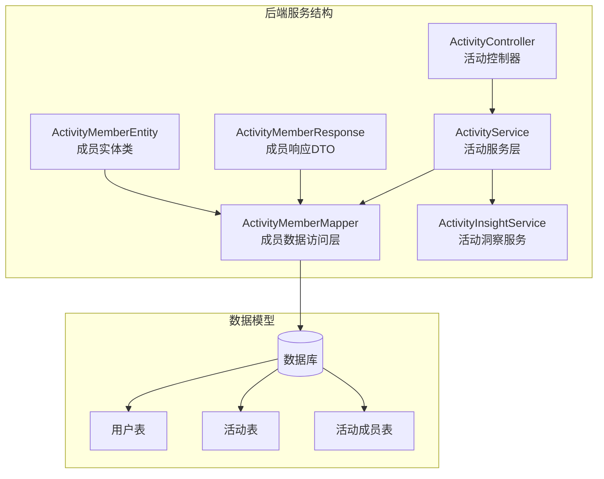
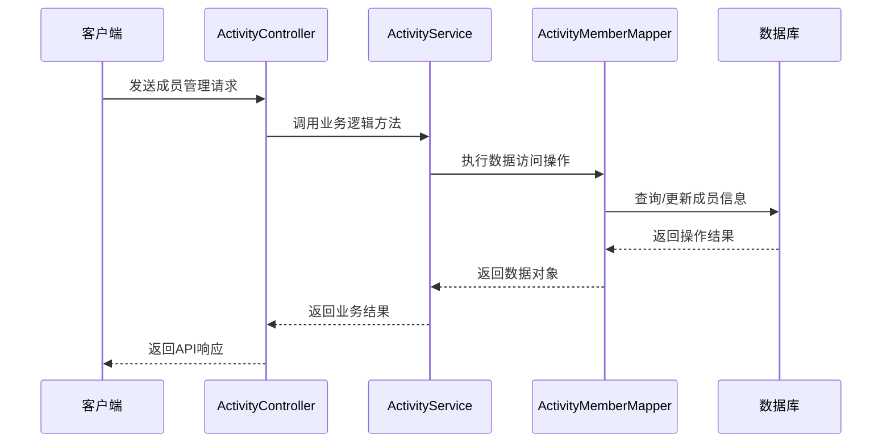
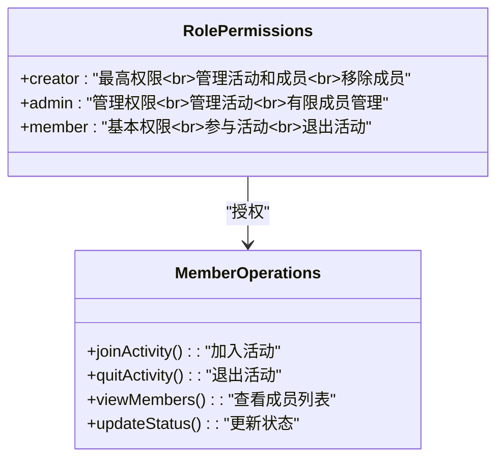
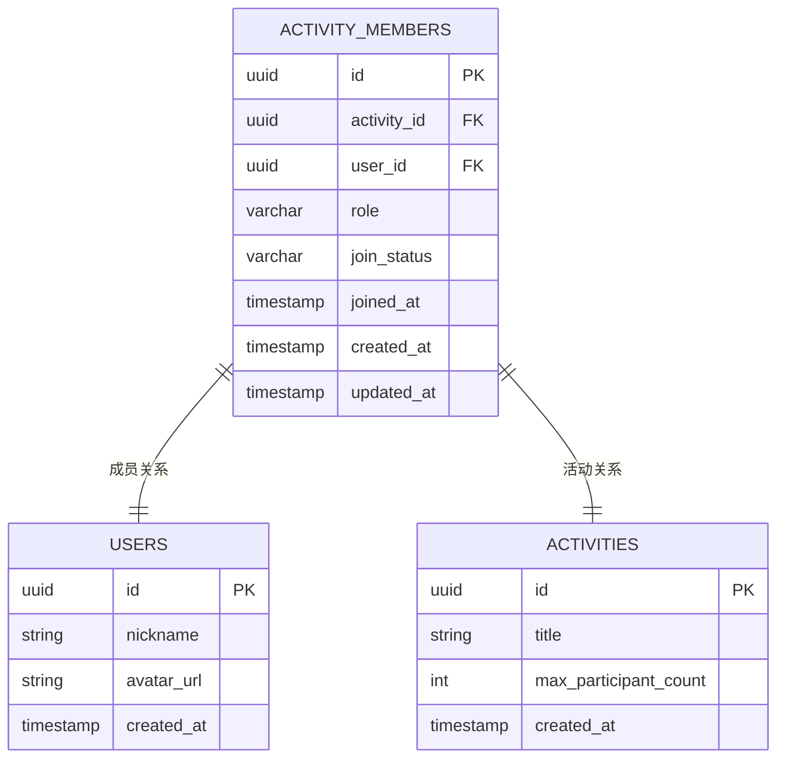
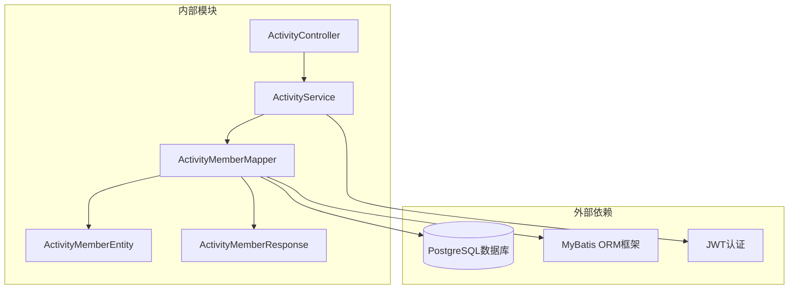

# 成员管理接口

<cite>
**本文档引用的文件**
- [ActivityController.java](file://backend/src/main/java/com/playminipro/activity/controller/ActivityController.java)
- [ActivityService.java](file://backend/src/main/java/com/playminipro/activity/service/ActivityService.java)
- [ActivityMemberMapper.java](file://backend/src/main/java/com/playminipro/activity/mapper/ActivityMemberMapper.java)
- [ActivityMemberResponse.java](file://backend/src/main/java/com/playminipro/activity/dto/ActivityMemberResponse.java)
- [ActivityMemberEntity.java](file://backend/src/main/java/com/playminipro/activity/entity/ActivityMemberEntity.java)
- [ActivityInsightService.java](file://backend/src/main/java/com/playminipro/activity/service/ActivityInsightService.java)
- [ApiResponse.java](file://backend/src/main/java/com/playminipro/common/response/ApiResponse.java)
- [GlobalExceptionHandler.java](file://backend/src/main/java/com/playminipro/common/exception/GlobalExceptionHandler.java)
</cite>

## 目录
1. [简介](#简介)
2. [项目结构](#项目结构)
3. [核心组件](#核心组件)
4. [架构概览](#架构概览)
5. [详细组件分析](#详细组件分析)
6. [依赖关系分析](#依赖关系分析)
7. [性能考虑](#性能考虑)
8. [故障排除指南](#故障排除指南)
9. [结论](#结论)
10. [附录](#附录)

## 简介

PlayMiniPro项目的成员管理接口是活动管理系统的重要组成部分，负责处理用户与活动之间的成员关系管理。该系统提供了完整的成员生命周期管理功能，包括成员加入、退出、状态查询和权限管理等核心功能。

系统采用基于角色的权限控制模型，定义了三种成员角色：发起人（creator）、管理员（admin）和普通成员（member）。每种角色拥有不同的操作权限和责任范围，确保活动管理的安全性和有序性。

## 项目结构

成员管理功能在PlayMiniPro项目中的组织结构如下：

**图表来源**
- [ActivityController.java:27-43](file://backend/src/main/java/com/playminipro/activity/controller/ActivityController.java#L27-L43)
- [ActivityService.java:1-50](file://backend/src/main/java/com/playminipro/activity/service/ActivityService.java#L1-L50)
- [ActivityMemberMapper.java:11-32](file://backend/src/main/java/com/playminipro/activity/mapper/ActivityMemberMapper.java#L11-L32)

**章节来源**
- [ActivityController.java:27-43](file://backend/src/main/java/com/playminipro/activity/controller/ActivityController.java#L27-L43)
- [ActivityService.java:1-50](file://backend/src/main/java/com/playminipro/activity/service/ActivityService.java#L1-L50)

## 核心组件

成员管理接口围绕以下核心组件构建：

### 控制器层
- **ActivityController**: 提供RESTful API接口，处理HTTP请求和响应
- **ActivityInsightService**: 提供成员统计和洞察分析功能

### 服务层
- **ActivityService**: 实现业务逻辑，协调成员管理操作
- **ActivityMemberMapper**: 数据访问接口，处理数据库操作

### 数据传输对象
- **ActivityMemberResponse**: 成员信息响应模型
- **ActivityMemberEntity**: 成员实体模型

### 权限模型
系统定义了三种成员角色权限级别：
- **发起人（creator）**: 拥有最高权限，可管理活动和成员
- **管理员（admin）**: 拥有活动管理权限，但受发起人限制
- **普通成员（member）**: 基本参与权限

**章节来源**
- [ActivityMemberResponse.java:3-10](file://backend/src/main/java/com/playminipro/activity/dto/ActivityMemberResponse.java#L3-L10)
- [ActivityMemberEntity.java:3-25](file://backend/src/main/java/com/playminipro/activity/entity/ActivityMemberEntity.java#L3-L25)

## 架构概览

成员管理系统的整体架构采用分层设计模式，确保关注点分离和代码的可维护性。

**图表来源**
- [ActivityController.java:78-92](file://backend/src/main/java/com/playminipro/activity/controller/ActivityController.java#L78-L92)
- [ActivityService.java:200-216](file://backend/src/main/java/com/playminipro/activity/service/ActivityService.java#L200-L216)
- [ActivityMemberMapper.java:14-29](file://backend/src/main/java/com/playminipro/activity/mapper/ActivityMemberMapper.java#L14-L29)

## 详细组件分析

### API接口规范

#### 成员加入活动
**请求方法**: POST  
**路径**: `/api/activities/{id}/members`  
**功能**: 用户加入指定活动

**请求参数**:
- 路径参数: `id` (活动ID)
- 请求体: 包含用户身份信息

**响应数据**:
- `activityId`: 活动ID
- `success`: 加入是否成功
- `joinedCount`: 当前已加入人数
- `maxParticipantCount`: 活动最大参与人数

**权限要求**: 需要用户认证

**章节来源**
- [ActivityController.java:84-87](file://backend/src/main/java/com/playminipro/activity/controller/ActivityController.java#L84-L87)
- [ActivityService.java:200-206](file://backend/src/main/java/com/playminipro/activity/service/ActivityService.java#L200-L206)

#### 成员退出活动
**请求方法**: DELETE  
**路径**: `/api/activities/{id}/members/{userId}`  
**功能**: 指定用户退出活动

**请求参数**:
- 路径参数: `id` (活动ID), `userId` (用户ID)
- 请求体: 无

**响应数据**:
- `activityId`: 活动ID
- `success`: 退出是否成功

**权限要求**: 
- 普通成员：只能退出自己的活动
- 发起人/管理员：可以移除其他成员

**章节来源**
- [ActivityMemberMapper.java:50-58](file://backend/src/main/java/com/playminipro/activity/mapper/ActivityMemberMapper.java#L50-L58)

#### 查询活动成员列表
**请求方法**: GET  
**路径**: `/api/activities/{id}/members`  
**功能**: 获取活动的所有已加入成员列表

**请求参数**:
- 路径参数: `id` (活动ID)

**响应数据**:
- `userId`: 用户ID
- `nickname`: 用户昵称
- `avatarUrl`: 用户头像URL
- `role`: 成员角色
- `joinStatus`: 加入状态

**权限要求**: 需要用户认证

**章节来源**
- [ActivityController.java:79-82](file://backend/src/main/java/com/playminipro/activity/controller/ActivityController.java#L79-L82)
- [ActivityMemberMapper.java:60-73](file://backend/src/main/java/com/playminipro/activity/mapper/ActivityMemberMapper.java#L60-L73)

#### 成员状态更新
**请求方法**: PATCH  
**路径**: `/api/activities/{id}/members/{userId}`  
**功能**: 更新指定成员的状态或角色

**请求参数**:
- 路径参数: `id` (活动ID), `userId` (用户ID)
- 请求体: 包含状态更新信息

**响应数据**:
- 更新后的成员信息

**权限要求**: 发起人/管理员

**章节来源**
- [ActivityMemberMapper.java:50-58](file://backend/src/main/java/com/playminipro/activity/mapper/ActivityMemberMapper.java#L50-L58)

### 角色权限管理

系统实现了基于角色的权限控制模型，不同角色拥有不同的操作权限：

**图表来源**
- [ActivityMemberMapper.java:40-58](file://backend/src/main/java/com/playminipro/activity/mapper/ActivityMemberMapper.java#L40-L58)

### 数据模型设计

成员管理涉及的核心数据模型包括：

**图表来源**
- [ActivityMemberEntity.java:3-25](file://backend/src/main/java/com/playminipro/activity/entity/ActivityMemberEntity.java#L3-L25)
- [ActivityMemberMapper.java:14-17](file://backend/src/main/java/com/playminipro/activity/mapper/ActivityMemberMapper.java#L14-L17)

**章节来源**
- [ActivityMemberEntity.java:3-25](file://backend/src/main/java/com/playminipro/activity/entity/ActivityMemberEntity.java#L3-L25)

### 成员统计信息接口

系统提供了丰富的成员统计和洞察分析功能：

#### 参与次数统计
- 统计用户的活动参与总次数
- 分析用户的活动偏好类型
- 计算用户最近参与时间

#### 活跃度分析
- 周期性活动参与频率
- 活动类型分布统计
- 用户贡献度评估

**章节来源**
- [ActivityInsightService.java:26-34](file://backend/src/main/java/com/playminipro/activity/service/ActivityInsightService.java#L26-L34)

## 依赖关系分析

成员管理模块的依赖关系体现了清晰的关注点分离：

**图表来源**
- [ActivityController.java:31-43](file://backend/src/main/java/com/playminipro/activity/controller/ActivityController.java#L31-L43)
- [ActivityService.java:1-50](file://backend/src/main/java/com/playminipro/activity/service/ActivityService.java#L1-L50)

**章节来源**
- [ActivityController.java:31-43](file://backend/src/main/java/com/playminipro/activity/controller/ActivityController.java#L31-L43)

## 性能考虑

### 数据库优化
- 使用UUID作为主键，支持分布式环境下的唯一性
- 在`(activity_id, user_id)`上建立复合索引，优化查询性能
- 使用ON CONFLICT处理并发加入场景，避免重复插入

### 缓存策略
- 成员列表查询结果可考虑短期缓存
- 活动统计信息可定期刷新缓存
- 避免频繁的数据库查询操作

### 并发控制
- 使用数据库事务确保数据一致性
- ON CONFLICT机制处理并发加入冲突
- 合理的锁机制避免竞态条件

## 故障排除指南

### 常见错误及解决方案

#### 成员不存在错误
**错误码**: 404  
**原因**: 活动或用户不存在  
**解决方案**: 验证活动ID和用户ID的有效性

#### 权限不足错误
**错误码**: 403  
**原因**: 当前用户无权执行操作  
**解决方案**: 检查用户角色和权限级别

#### 数据库约束冲突
**错误码**: 409  
**原因**: 违反数据库约束条件  
**解决方案**: 检查重复记录和外键关系

**章节来源**
- [GlobalExceptionHandler.java:1-50](file://backend/src/main/java/com/playminipro/common/exception/GlobalExceptionHandler.java#L1-L50)

### 调试建议
- 启用详细的日志记录
- 使用API测试工具验证接口行为
- 监控数据库查询性能
- 实施适当的错误处理机制

## 结论

PlayMiniPro项目的成员管理接口设计合理，实现了完整的成员生命周期管理功能。系统采用清晰的分层架构，基于角色的权限控制模型确保了安全性，同时提供了丰富的统计分析功能。

通过标准化的API接口和完善的错误处理机制，该系统能够满足各种成员管理场景的需求，为用户提供良好的使用体验。

## 附录

### 最佳实践建议

#### 接口使用建议
- 始终进行用户身份验证
- 合理处理并发操作
- 实施适当的错误恢复机制
- 使用分页处理大量成员数据

#### 开发注意事项
- 遵循RESTful API设计原则
- 保持接口版本兼容性
- 实施适当的输入验证
- 考虑国际化和本地化需求