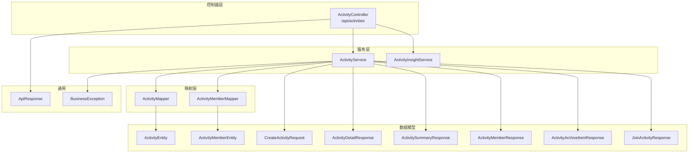
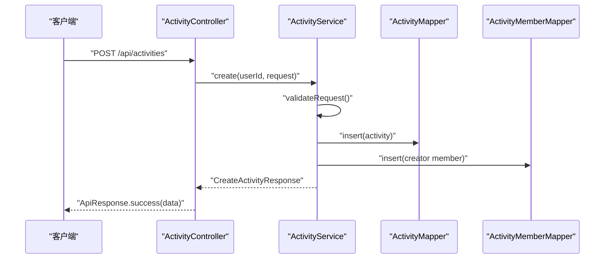
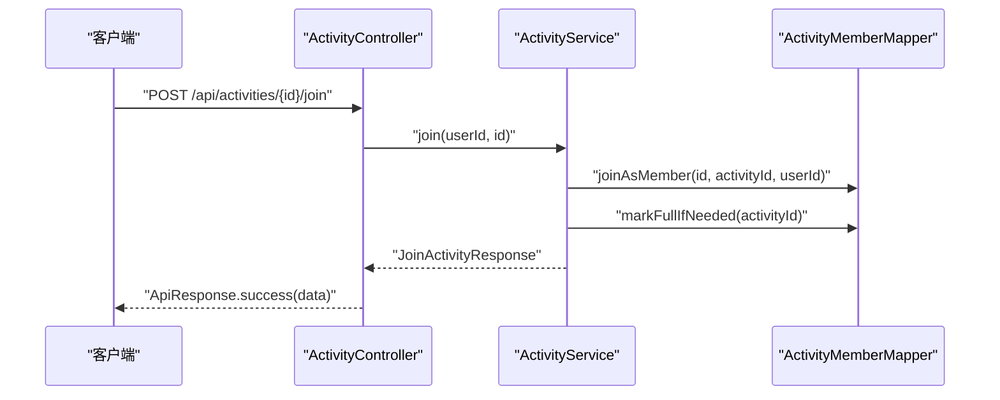
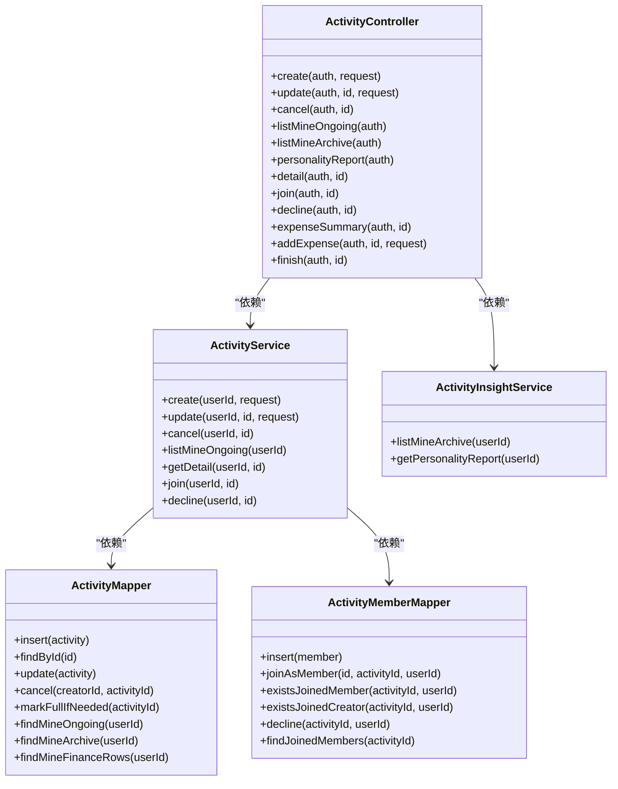

# 活动管理接口

<cite>
**本文引用的文件**
- [ActivityController.java](file://backend/src/main/java/com/playminipro/activity/controller/ActivityController.java)
- [ActivityService.java](file://backend/src/main/java/com/playminipro/activity/service/ActivityService.java)
- [ActivityMapper.java](file://backend/src/main/java/com/playminipro/activity/mapper/ActivityMapper.java)
- [ActivityMemberMapper.java](file://backend/src/main/java/com/playminipro/activity/mapper/ActivityMemberMapper.java)
- [CreateActivityRequest.java](file://backend/src/main/java/com/playminipro/activity/dto/CreateActivityRequest.java)
- [CreateActivityResponse.java](file://backend/src/main/java/com/playminipro/activity/dto/CreateActivityResponse.java)
- [ActivityDetailResponse.java](file://backend/src/main/java/com/playminipro/activity/dto/ActivityDetailResponse.java)
- [ActivitySummaryResponse.java](file://backend/src/main/java/com/playminipro/activity/dto/ActivitySummaryResponse.java)
- [ActivityMemberResponse.java](file://backend/src/main/java/com/playminipro/activity/dto/ActivityMemberResponse.java)
- [ActivityArchiveItemResponse.java](file://backend/src/main/java/com/playminipro/activity/dto/ActivityArchiveItemResponse.java)
- [JoinActivityResponse.java](file://backend/src/main/java/com/playminipro/activity/dto/JoinActivityResponse.java)
- [ActivityInsightService.java](file://backend/src/main/java/com/playminipro/activity/service/ActivityInsightService.java)
- [ApiResponse.java](file://backend/src/main/java/com/playminipro/common/response/ApiResponse.java)
- [BusinessException.java](file://backend/src/main/java/com/playminipro/common/exception/BusinessException.java)
- [application.yml](file://backend/src/main/resources/application.yml)
</cite>

## 目录
1. [简介](#简介)
2. [项目结构](#项目结构)
3. [核心组件](#核心组件)
4. [架构概览](#架构概览)
5. [详细组件分析](#详细组件分析)
6. [依赖关系分析](#依赖关系分析)
7. [性能考虑](#性能考虑)
8. [故障排查指南](#故障排查指南)
9. [结论](#结论)
10. [附录](#附录)

## 简介
本文件为 PlayMiniPro 项目的活动管理接口完整 API 文档，覆盖活动 CRUD、状态管理、取消与归档、成员管理、费用统计等能力。接口统一通过 REST 风格访问，返回统一的响应包装对象，错误通过业务异常抛出并映射为标准响应。

## 项目结构
活动模块位于后端 Java 工程中，采用分层架构：
- 控制器层：对外暴露 REST 接口
- 服务层：编排业务逻辑、事务控制与校验
- 映射层：MyBatis Mapper，封装 SQL 查询与更新
- DTO/实体：数据传输与持久化模型
- 响应与异常：统一响应包装与业务异常

图表来源
- [ActivityController.java:27-112](file://backend/src/main/java/com/playminipro/activity/controller/ActivityController.java#L27-L112)
- [ActivityService.java:20-232](file://backend/src/main/java/com/playminipro/activity/service/ActivityService.java#L20-L232)
- [ActivityMapper.java:13-222](file://backend/src/main/java/com/playminipro/activity/mapper/ActivityMapper.java#L13-L222)
- [ActivityMemberMapper.java:11-73](file://backend/src/main/java/com/playminipro/activity/mapper/ActivityMemberMapper.java#L11-L73)

章节来源
- [ActivityController.java:27-112](file://backend/src/main/java/com/playminipro/activity/controller/ActivityController.java#L27-L112)
- [ActivityService.java:20-232](file://backend/src/main/java/com/playminipro/activity/service/ActivityService.java#L20-L232)
- [ActivityMapper.java:13-222](file://backend/src/main/java/com/playminipro/activity/mapper/ActivityMapper.java#L13-L222)
- [ActivityMemberMapper.java:11-73](file://backend/src/main/java/com/playminipro/activity/mapper/ActivityMemberMapper.java#L11-L73)

## 核心组件
- 统一响应包装：所有接口返回 ApiResponse，包含 code、message、data 字段
- 业务异常：BusinessException 抛出时由全局异常处理器转换为 ApiResponse.fail
- 安全上下文：接口使用 Spring Security Authentication 获取当前用户 ID

章节来源
- [ApiResponse.java:3-51](file://backend/src/main/java/com/playminipro/common/response/ApiResponse.java#L3-L51)
- [BusinessException.java:3-15](file://backend/src/main/java/com/playminipro/common/exception/BusinessException.java#L3-L15)
- [ActivityController.java:45-112](file://backend/src/main/java/com/playminipro/activity/controller/ActivityController.java#L45-L112)

## 架构概览
活动管理接口遵循典型的 MVC 分层：
- 控制器接收请求，进行参数校验
- 服务层执行业务规则与事务控制
- 映射层执行数据库读写
- DTO 用于请求/响应的数据结构定义

图表来源
- [ActivityController.java:45-49](file://backend/src/main/java/com/playminipro/activity/controller/ActivityController.java#L45-L49)
- [ActivityService.java:41-58](file://backend/src/main/java/com/playminipro/activity/service/ActivityService.java#L41-L58)
- [ActivityMapper.java:16-29](file://backend/src/main/java/com/playminipro/activity/mapper/ActivityMapper.java#L16-L29)
- [ActivityMemberMapper.java:14-18](file://backend/src/main/java/com/playminipro/activity/mapper/ActivityMemberMapper.java#L14-L18)

## 详细组件分析

### 活动 CRUD 与状态管理

- 创建活动
  - 方法与路径：POST /api/activities
  - 认证：需要登录，从 Authentication 中取 userId
  - 请求体：CreateActivityRequest
  - 成功响应：CreateActivityResponse(activityId)
  - 校验规则：
    - 目标人数不能超过最大人数
    - 类型规则校验（如 offlineOnly 类型必须为线下）
    - 线下或 offline 模式必须填写地点（meetupAddress 或 venueAddress 至少一个）
    - onlineJoinInfo 必须为合法 JSON
  - 数据库写入：插入 activities 表，初始状态为 recruiting；同时插入一条创建者成员记录

- 更新活动
  - 方法与路径：PUT /api/activities/{id}
  - 权限：仅活动创建者可更新
  - 请求体：CreateActivityRequest（同创建）
  - 成功响应：CreateActivityResponse(activityId)

- 删除/取消活动
  - 方法与路径：POST /api/activities/{id}/cancel
  - 权限：仅活动创建者可取消
  - 状态变更：将状态置为 cancelled（支持的状态包括 draft、recruiting、full、pending_start）

- 查询活动详情
  - 方法与路径：GET /api/activities/{id}
  - 返回：ActivityDetailResponse，包含标题、描述、类型、模式、状态、时间、地址、费用模式、是否允许成员记账、已报名人数、最大人数、当前用户是否已加入/是否创建者、是否可加入、成员列表等

- 查询我的进行中活动
  - 方法与路径：GET /api/activities/mine/ongoing
  - 返回：ActivitySummaryResponse 列表，按开始时间升序

- 查询我的活动归档
  - 方法与路径：GET /api/activities/mine/archive
  - 返回：ActivityArchiveItemResponse 列表，包含角色、状态、时间、地点、人数、费用汇总等

- 个人画像报告
  - 方法与路径：GET /api/activities/mine/personality-report
  - 返回：综合统计与画像报告（由 ActivityInsightService 生成）

章节来源
- [ActivityController.java:45-77](file://backend/src/main/java/com/playminipro/activity/controller/ActivityController.java#L45-L77)
- [ActivityService.java:41-98](file://backend/src/main/java/com/playminipro/activity/service/ActivityService.java#L41-L98)
- [ActivityService.java:140-181](file://backend/src/main/java/com/playminipro/activity/service/ActivityService.java#L140-L181)
- [ActivityMapper.java:106-122](file://backend/src/main/java/com/playminipro/activity/mapper/ActivityMapper.java#L106-L122)
- [ActivityMapper.java:124-158](file://backend/src/main/java/com/playminipro/activity/mapper/ActivityMapper.java#L124-L158)
- [ActivityInsightService.java:41-45](file://backend/src/main/java/com/playminipro/activity/service/ActivityInsightService.java#L41-L45)

### 活动成员管理

- 加入活动
  - 方法与路径：POST /api/activities/{id}/join
  - 规则：
    - 活动状态必须为 recruiting 或 full
    - 若非已加入且当前已报名人数已达上限，则拒绝
  - 成功响应：JoinActivityResponse(activityId, joined, joinedCount, maxParticipantCount)
  - 后续通知：成功加入后触发成员加入通知记录

- 退出/拒绝参加
  - 方法与路径：POST /api/activities/{id}/decline
  - 规则：仅非创建者的成员可调用，将 join_status 置为 quit

- 成员列表查询
  - 方法与路径：GET /api/activities/{id}（详情接口内含 members 字段）
  - 返回：ActivityMemberResponse 列表（头像、昵称、角色、加入状态）

图表来源
- [ActivityController.java:84-87](file://backend/src/main/java/com/playminipro/activity/controller/ActivityController.java#L84-L87)
- [ActivityService.java:183-206](file://backend/src/main/java/com/playminipro/activity/service/ActivityService.java#L183-L206)
- [ActivityMemberMapper.java:20-29](file://backend/src/main/java/com/playminipro/activity/mapper/ActivityMemberMapper.java#L20-L29)

章节来源
- [ActivityController.java:84-92](file://backend/src/main/java/com/playminipro/activity/controller/ActivityController.java#L84-L92)
- [ActivityService.java:183-216](file://backend/src/main/java/com/playminipro/activity/service/ActivityService.java#L183-L216)
- [ActivityMemberMapper.java:20-73](file://backend/src/main/java/com/playminipro/activity/mapper/ActivityMemberMapper.java#L20-L73)

### 活动费用与结算

- 费用汇总
  - 方法与路径：GET /api/activities/{id}/expenses/summary
  - 返回：ActivityExpenseSummaryResponse（由费用服务提供）

- 新增费用
  - 方法与路径：POST /api/activities/{id}/expenses
  - 请求体：AddActivityExpenseRequest
  - 返回：ActivityExpenseSummaryResponse

- 结束活动
  - 方法与路径：POST /api/activities/{id}/finish
  - 权限：仅活动创建者
  - 状态变更：将状态置为 finished，并设置结束时间

章节来源
- [ActivityController.java:94-111](file://backend/src/main/java/com/playminipro/activity/controller/ActivityController.java#L94-L111)
- [ActivityService.java:100-115](file://backend/src/main/java/com/playminipro/activity/service/ActivityService.java#L100-L115)

### 请求参数与响应格式

- CreateActivityRequest（创建/更新）
  - 关键字段与约束：
    - typeCode/typeName：必填，长度限制
    - title：必填，长度限制
    - description：可选
    - mode：online/offline，必填
    - targetParticipantCount/maxParticipantCount：必填，均为正数，且 max ≥ target
    - startTime：必填，endTime 可选
    - meetupTime/meetupAddress/venueAddress：线下或 offline 模式时至少一个必填
    - onlineJoinInfo：JSON 对象，需合法
    - expenseMode：none/aa/host_treat/designated_treat，必填
    - expenseFlag：0/1，必填
    - allowMemberAddExpense：布尔，必填

- CreateActivityResponse
  - activityId：字符串

- ActivityDetailResponse
  - 包含活动基础信息、费用配置、成员统计、权限标记、成员列表等

- ActivitySummaryResponse
  - 摘要信息：id、title、mode、status、startTime、venueAddress、joinedCount、maxParticipantCount

- ActivityMemberResponse
  - 用户标识与角色：userId、nickname、avatarUrl、role、joinStatus

- ActivityArchiveItemResponse
  - 归档条目：id、title、typeName、role、status、mode、startTime、roleTime、place、joinedCount、maxParticipantCount、totalAmountFen、expenseMode、多维展示字段

- JoinActivityResponse
  - 加入结果：activityId、joined、joinedCount、maxParticipantCount

章节来源
- [CreateActivityRequest.java:12-30](file://backend/src/main/java/com/playminipro/activity/dto/CreateActivityRequest.java#L12-L30)
- [CreateActivityResponse.java:3-4](file://backend/src/main/java/com/playminipro/activity/dto/CreateActivityResponse.java#L3-L4)
- [ActivityDetailResponse.java:6-30](file://backend/src/main/java/com/playminipro/activity/dto/ActivityDetailResponse.java#L6-L30)
- [ActivitySummaryResponse.java:5-15](file://backend/src/main/java/com/playminipro/activity/dto/ActivitySummaryResponse.java#L5-L15)
- [ActivityMemberResponse.java:3-10](file://backend/src/main/java/com/playminipro/activity/dto/ActivityMemberResponse.java#L3-L10)
- [ActivityArchiveItemResponse.java:5-23](file://backend/src/main/java/com/playminipro/activity/dto/ActivityArchiveItemResponse.java#L5-L23)
- [JoinActivityResponse.java:3-9](file://backend/src/main/java/com/playminipro/activity/dto/JoinActivityResponse.java#L3-L9)

### 错误处理策略
- 业务异常 BusinessException：携带 code 与 message
- 统一响应包装：ApiResponse.fail(code, message)
- 常见错误码（示例）
  - 4001：参数校验失败/活动不可加入/人数已满
  - 4003：无权限（非创建者）
  - 4004：资源不存在（活动不存在）

章节来源
- [BusinessException.java:3-15](file://backend/src/main/java/com/playminipro/common/exception/BusinessException.java#L3-L15)
- [ActivityService.java:65-77](file://backend/src/main/java/com/playminipro/activity/service/ActivityService.java#L65-L77)
- [ActivityService.java:186-195](file://backend/src/main/java/com/playminipro/activity/service/ActivityService.java#L186-L195)
- [ActivityService.java:85-95](file://backend/src/main/java/com/playminipro/activity/service/ActivityService.java#L85-L95)

### 搜索、筛选与排序
- 我的进行中活动：按 startTime 升序
- 我的归档活动：按角色时间（创建者按创建时间，成员按加入时间）降序，再按开始时间降序
- 成员列表：按加入时间升序

章节来源
- [ActivityMapper.java:120-122](file://backend/src/main/java/com/playminipro/activity/mapper/ActivityMapper.java#L120-L122)
- [ActivityMapper.java:156-158](file://backend/src/main/java/com/playminipro/activity/mapper/ActivityMapper.java#L156-L158)
- [ActivityMemberMapper.java:60-72](file://backend/src/main/java/com/playminipro/activity/mapper/ActivityMemberMapper.java#L60-L72)

## 依赖关系分析

图表来源
- [ActivityController.java:27-112](file://backend/src/main/java/com/playminipro/activity/controller/ActivityController.java#L27-L112)
- [ActivityService.java:20-232](file://backend/src/main/java/com/playminipro/activity/service/ActivityService.java#L20-L232)
- [ActivityInsightService.java:26-489](file://backend/src/main/java/com/playminipro/activity/service/ActivityInsightService.java#L26-L489)
- [ActivityMapper.java:13-222](file://backend/src/main/java/com/playminipro/activity/mapper/ActivityMapper.java#L13-L222)
- [ActivityMemberMapper.java:11-73](file://backend/src/main/java/com/playminipro/activity/mapper/ActivityMemberMapper.java#L11-L73)

## 性能考虑
- 数据库索引与查询优化：归档与统计查询涉及多表连接与聚合，建议在 activity_id、user_id、join_status、状态、时间等字段建立合适索引
- 缓存策略：可对热门活动详情、成员列表等进行缓存，降低数据库压力
- 批量操作：批量查询与更新时注意分页与批大小，避免长事务
- JSON 存储：onlineJoinInfo 以 JSONB 存储，查询时尽量避免全表扫描

## 故障排查指南
- 参数校验失败
  - 现象：返回 4001，message 描述具体原因
  - 排查：检查 typeCode/typeName/title/mode/人数/时间/地点/费用配置等
- 无权限
  - 现象：返回 4003，message 提示 forbidden
  - 排查：确认当前用户是否为活动创建者
- 资源不存在
  - 现象：返回 4004，message 提示 activity not found
  - 排查：确认活动 ID 是否正确
- 活动不可加入/已满
  - 现象：返回 4001
  - 排查：确认活动状态是否为 recruiting/full，已报名人数是否达到上限

章节来源
- [ActivityService.java:65-77](file://backend/src/main/java/com/playminipro/activity/service/ActivityService.java#L65-L77)
- [ActivityService.java:186-195](file://backend/src/main/java/com/playminipro/activity/service/ActivityService.java#L186-L195)
- [ActivityService.java:85-95](file://backend/src/main/java/com/playminipro/activity/service/ActivityService.java#L85-L95)

## 结论
活动管理接口提供了完整的生命周期管理能力，涵盖创建、更新、取消、详情查询、成员管理与费用结算，并通过统一响应与异常机制保证接口一致性。建议在生产环境中配合缓存、索引与监控体系，确保高并发下的稳定性与性能。

## 附录

### 接口清单与规范

- 创建活动
  - 方法：POST
  - 路径：/api/activities
  - 认证：是
  - 请求体：CreateActivityRequest
  - 成功响应：CreateActivityResponse
  - 错误码：4001、4003、4004

- 更新活动
  - 方法：PUT
  - 路径：/api/activities/{id}
  - 认证：是
  - 请求体：CreateActivityRequest
  - 成功响应：CreateActivityResponse
  - 权限：仅创建者
  - 错误码：4001、4003、4004

- 取消活动
  - 方法：POST
  - 路径：/api/activities/{id}/cancel
  - 认证：是
  - 成功响应：CreateActivityResponse
  - 权限：仅创建者
  - 错误码：4003、4004

- 查询我的进行中活动
  - 方法：GET
  - 路径：/api/activities/mine/ongoing
  - 认证：是
  - 成功响应：ActivitySummaryResponse[]
  - 排序：按 startTime 升序

- 查询我的活动归档
  - 方法：GET
  - 路径：/api/activities/mine/archive
  - 认证：是
  - 成功响应：ActivityArchiveItemResponse[]
  - 排序：角色时间降序，再按开始时间降序

- 个人画像报告
  - 方法：GET
  - 路径：/api/activities/mine/personality-report
  - 认证：是
  - 成功响应：PersonalityReportResponse

- 获取活动详情
  - 方法：GET
  - 路径：/api/activities/{id}
  - 认证：是
  - 成功响应：ActivityDetailResponse

- 加入活动
  - 方法：POST
  - 路径：/api/activities/{id}/join
  - 认证：是
  - 成功响应：JoinActivityResponse
  - 错误码：4001、4004

- 退出/拒绝参加
  - 方法：POST
  - 路径：/api/activities/{id}/decline
  - 认证：是
  - 成功响应：CreateActivityResponse

- 费用汇总
  - 方法：GET
  - 路径：/api/activities/{id}/expenses/summary
  - 认证：是
  - 成功响应：ActivityExpenseSummaryResponse

- 新增费用
  - 方法：POST
  - 路径：/api/activities/{id}/expenses
  - 认证：是
  - 请求体：AddActivityExpenseRequest
  - 成功响应：ActivityExpenseSummaryResponse

- 结束活动
  - 方法：POST
  - 路径：/api/activities/{id}/finish
  - 认证：是
  - 成功响应：ActivityExpenseSummaryResponse
  - 权限：仅创建者

章节来源
- [ActivityController.java:45-111](file://backend/src/main/java/com/playminipro/activity/controller/ActivityController.java#L45-L111)
- [ActivityMapper.java:120-158](file://backend/src/main/java/com/playminipro/activity/mapper/ActivityMapper.java#L120-L158)