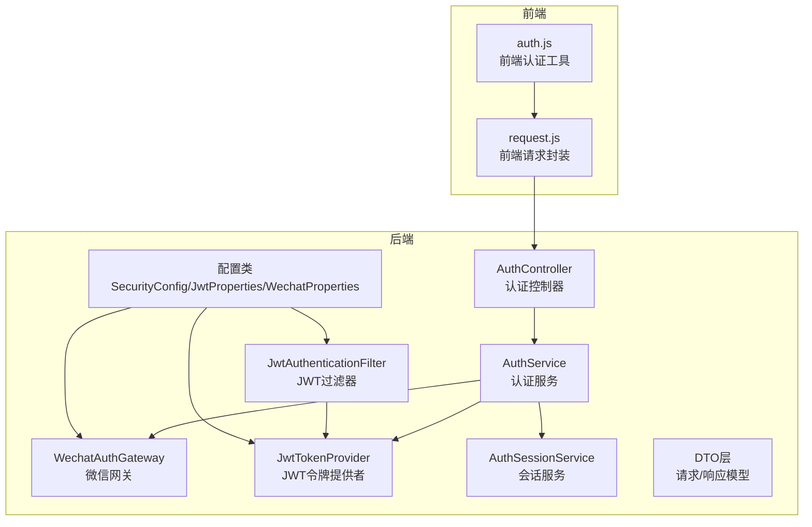
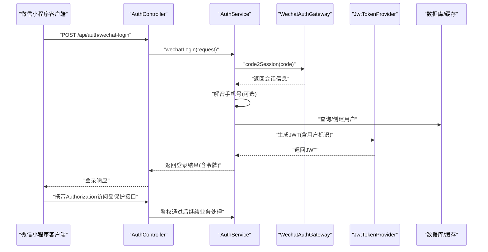
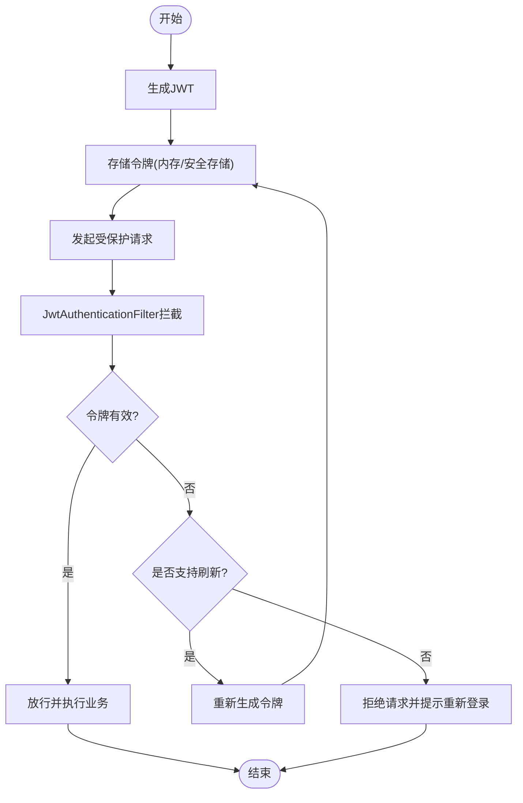

# 认证接口

<cite>
**本文引用的文件**
- [AuthController.java](file://backend/src/main/java/com/playminipro/auth/controller/AuthController.java)
- [AuthService.java](file://backend/src/main/java/com/playminipro/auth/service/AuthService.java)
- [WechatAuthGateway.java](file://backend/src/main/java/com/playminipro/auth/service/WechatAuthGateway.java)
- [JwtAuthenticationFilter.java](file://backend/src/main/java/com/playminipro/common/security/JwtAuthenticationFilter.java)
- [JwtTokenProvider.java](file://backend/src/main/java/com/playminipro/common/security/JwtTokenProvider.java)
- [AuthSessionService.java](file://backend/src/main/java/com/playminipro/common/security/AuthSessionService.java)
- [WechatLoginRequest.java](file://backend/src/main/java/com/playminipro/auth/dto/WechatLoginRequest.java)
- [WechatLoginResponse.java](file://backend/src/main/java/com/playminipro/auth/dto/WechatLoginResponse.java)
- [AuthUserResponse.java](file://backend/src/main/java/com/playminipro/auth/dto/AuthUserResponse.java)
- [WechatCode2SessionResponse.java](file://backend/src/main/java/com/playminipro/auth/dto/WechatCode2SessionResponse.java)
- [WechatPhoneNumberResponse.java](file://backend/src/main/java/com/playminipro/auth/dto/WechatPhoneNumberResponse.java)
- [WechatAccessTokenResponse.java](file://backend/src/main/java/com/playminipro/auth/dto/WechatAccessTokenResponse.java)
- [SecurityConfig.java](file://backend/src/main/java/com/playminipro/common/config/SecurityConfig.java)
- [JwtProperties.java](file://backend/src/main/java/com/playminipro/common/config/JwtProperties.java)
- [WechatProperties.java](file://backend/src/main/java/com/playminipro/common/config/WechatProperties.java)
- [application.yml](file://backend/src/main/resources/application.yml)
- [auth.js](file://frontend/utils/auth.js)
- [request.js](file://frontend/utils/request.js)
</cite>

## 目录
1. [简介](#简介)
2. [项目结构](#项目结构)
3. [核心组件](#核心组件)
4. [架构总览](#架构总览)
5. [详细组件分析](#详细组件分析)
6. [依赖关系分析](#依赖关系分析)
7. [性能考量](#性能考量)
8. [故障排查指南](#故障排查指南)
9. [结论](#结论)
10. [附录](#附录)

## 简介
本文件为 PlayMiniPro 项目的认证接口详细API文档，聚焦以下内容：
- 微信登录接口 /api/auth/wechat-login 的完整规范：请求参数、响应格式、错误处理与状态码
- JWT 令牌的生成、验证与刷新机制
- 用户信息获取接口的使用方法与权限要求
- 完整的请求与响应示例（含成功与失败场景）
- 认证中间件工作原理与安全考虑
- 前端集成指南与常见问题解决方案

## 项目结构
认证相关模块主要分布在后端的 auth 与 common/security 包中，并在前端 utils 中提供认证与网络请求工具。

图表来源
- [AuthController.java](file://backend/src/main/java/com/playminipro/auth/controller/AuthController.java)
- [AuthService.java](file://backend/src/main/java/com/playminipro/auth/service/AuthService.java)
- [WechatAuthGateway.java](file://backend/src/main/java/com/playminipro/auth/service/WechatAuthGateway.java)
- [JwtAuthenticationFilter.java](file://backend/src/main/java/com/playminipro/common/security/JwtAuthenticationFilter.java)
- [JwtTokenProvider.java](file://backend/src/main/java/com/playminipro/common/security/JwtTokenProvider.java)
- [AuthSessionService.java](file://backend/src/main/java/com/playminipro/common/security/AuthSessionService.java)
- [SecurityConfig.java](file://backend/src/main/java/com/playminipro/common/config/SecurityConfig.java)
- [JwtProperties.java](file://backend/src/main/java/com/playminipro/common/config/JwtProperties.java)
- [WechatProperties.java](file://backend/src/main/java/com/playminipro/common/config/WechatProperties.java)
- [auth.js](file://frontend/utils/auth.js)
- [request.js](file://frontend/utils/request.js)

章节来源
- [AuthController.java](file://backend/src/main/java/com/playminipro/auth/controller/AuthController.java)
- [SecurityConfig.java](file://backend/src/main/java/com/playminipro/common/config/SecurityConfig.java)

## 核心组件
- 认证控制器：对外暴露 /api/auth/* 接口，负责接收请求、调用服务层并返回响应
- 认证服务：实现业务逻辑，协调微信授权、用户管理与JWT令牌发放
- 微信网关：对接微信开放平台，完成 code2session、手机号解密等操作
- 安全配置与过滤器：基于Spring Security配置JWT过滤器，拦截受保护路由
- JWT提供者：生成、解析与校验JWT令牌
- 会话服务：维护用户会话状态与令牌刷新策略
- DTO层：定义请求与响应的数据结构
- 配置类：加载JWT与微信小程序相关配置

章节来源
- [AuthService.java](file://backend/src/main/java/com/playminipro/auth/service/AuthService.java)
- [WechatAuthGateway.java](file://backend/src/main/java/com/playminipro/auth/service/WechatAuthGateway.java)
- [JwtTokenProvider.java](file://backend/src/main/java/com/playminipro/common/security/JwtTokenProvider.java)
- [JwtAuthenticationFilter.java](file://backend/src/main/java/com/playminipro/common/security/JwtAuthenticationFilter.java)
- [AuthSessionService.java](file://backend/src/main/java/com/playminipro/common/security/AuthSessionService.java)
- [WechatLoginRequest.java](file://backend/src/main/java/com/playminipro/auth/dto/WechatLoginRequest.java)
- [WechatLoginResponse.java](file://backend/src/main/java/com/playminipro/auth/dto/WechatLoginResponse.java)
- [AuthUserResponse.java](file://backend/src/main/java/com/playminipro/auth/dto/AuthUserResponse.java)
- [WechatCode2SessionResponse.java](file://backend/src/main/java/com/playminipro/auth/dto/WechatCode2SessionResponse.java)
- [WechatPhoneNumberResponse.java](file://backend/src/main/java/com/playminipro/auth/dto/WechatPhoneNumberResponse.java)
- [WechatAccessTokenResponse.java](file://backend/src/main/java/com/playminipro/auth/dto/WechatAccessTokenResponse.java)
- [JwtProperties.java](file://backend/src/main/java/com/playminipro/common/config/JwtProperties.java)
- [WechatProperties.java](file://backend/src/main/java/com/playminipro/common/config/WechatProperties.java)

## 架构总览
下图展示了从客户端到后端的认证流程概览，包括微信登录、令牌签发与后续请求的JWT验证。

图表来源
- [AuthController.java](file://backend/src/main/java/com/playminipro/auth/controller/AuthController.java)
- [AuthService.java](file://backend/src/main/java/com/playminipro/auth/service/AuthService.java)
- [WechatAuthGateway.java](file://backend/src/main/java/com/playminipro/auth/service/WechatAuthGateway.java)
- [JwtTokenProvider.java](file://backend/src/main/java/com/playminipro/common/security/JwtTokenProvider.java)

## 详细组件分析

### 微信登录接口 /api/auth/wechat-login
- 方法与路径
  - POST /api/auth/wechat-login
- 请求体字段
  - code: 小程序登录时获取的临时登录凭证
  - encryptedData: 用户信息加密数据
  - iv: 加密算法初始向量
- 成功响应字段
  - token: JWT访问令牌
  - expires_in: 过期时间（秒）
  - user: 当前用户信息对象
- 失败响应字段
  - code: 业务状态码
  - message: 错误描述
  - data: 可选扩展数据
- 状态码
  - 200: 登录成功
  - 400: 参数缺失或格式错误
  - 401: 微信授权失败或会话无效
  - 500: 服务器内部错误
- 典型错误场景
  - code 已过期或无效
  - encryptedData/iv 不匹配或解密失败
  - 用户信息缺失导致无法建立账户

章节来源
- [AuthController.java](file://backend/src/main/java/com/playminipro/auth/controller/AuthController.java)
- [WechatLoginRequest.java](file://backend/src/main/java/com/playminipro/auth/dto/WechatLoginRequest.java)
- [WechatLoginResponse.java](file://backend/src/main/java/com/playminipro/auth/dto/WechatLoginResponse.java)
- [WechatCode2SessionResponse.java](file://backend/src/main/java/com/playminipro/auth/dto/WechatCode2SessionResponse.java)
- [WechatPhoneNumberResponse.java](file://backend/src/main/java/com/playminipro/auth/dto/WechatPhoneNumberResponse.java)

### JWT 令牌生成、验证与刷新机制
- 生成
  - AuthService 在登录成功后调用 JwtTokenProvider 生成JWT
  - 令牌包含用户标识等必要声明
- 验证
  - JwtAuthenticationFilter 拦截请求，从请求头提取 Authorization
  - 使用 JwtTokenProvider 校验令牌有效性与签名
- 刷新
  - AuthSessionService 提供会话与令牌刷新策略
  - 建议在接近过期时进行静默刷新，避免频繁登录
- 安全要点
  - 令牌应仅通过 HTTPS 传输
  - 合理设置过期时间，避免长期有效令牌
  - 前端仅保存在内存或安全存储，不写入明文日志

图表来源
- [JwtAuthenticationFilter.java](file://backend/src/main/java/com/playminipro/common/security/JwtAuthenticationFilter.java)
- [JwtTokenProvider.java](file://backend/src/main/java/com/playminipro/common/security/JwtTokenProvider.java)
- [AuthSessionService.java](file://backend/src/main/java/com/playminipro/common/security/AuthSessionService.java)

章节来源
- [JwtTokenProvider.java](file://backend/src/main/java/com/playminipro/common/security/JwtTokenProvider.java)
- [JwtAuthenticationFilter.java](file://backend/src/main/java/com/playminipro/common/security/JwtAuthenticationFilter.java)
- [AuthSessionService.java](file://backend/src/main/java/com/playminipro/common/security/AuthSessionService.java)

### 用户信息获取接口
- 方法与路径
  - GET /api/auth/user-info（示例，具体以后端实现为准）
- 权限要求
  - 需携带有效的 Authorization: Bearer <token>
- 成功响应字段
  - user: 用户基本信息（如昵称、头像、openId等）
- 失败响应字段
  - code: 业务状态码
  - message: 错误描述
- 注意
  - 若令牌过期或无效，将返回 401 未授权

章节来源
- [AuthController.java](file://backend/src/main/java/com/playminipro/auth/controller/AuthController.java)
- [AuthUserResponse.java](file://backend/src/main/java/com/playminipro/auth/dto/AuthUserResponse.java)

### 认证中间件工作原理与安全考虑
- 工作原理
  - SecurityConfig 配置全局安全策略，注册 JwtAuthenticationFilter
  - 过滤器从请求头解析 Bearer 令牌，委托 JwtTokenProvider 校验
  - 校验通过后将用户上下文注入到当前线程，供后续控制器使用
- 安全考虑
  - 严格限制允许访问的路径与方法
  - 对敏感接口启用CSRF防护（如适用）
  - 令牌不应持久化到本地存储，避免XSS风险
  - 服务端应定期轮换密钥并更新客户端

章节来源
- [SecurityConfig.java](file://backend/src/main/java/com/playminipro/common/config/SecurityConfig.java)
- [JwtAuthenticationFilter.java](file://backend/src/main/java/com/playminipro/common/security/JwtAuthenticationFilter.java)
- [JwtTokenProvider.java](file://backend/src/main/java/com/playminipro/common/security/JwtTokenProvider.java)

### 前端集成指南
- 获取登录凭证
  - 小程序端调用 wx.login 获取 code
- 发起登录请求
  - 使用 request.js 封装的请求方法，携带 code、encryptedData、iv
  - 将返回的 token 存储在安全位置（如内存或受控存储）
- 访问受保护接口
  - 在请求头添加 Authorization: Bearer <token>
  - 处理 401 未授权：引导用户重新登录
- 刷新令牌
  - 在接近过期时触发静默刷新，避免中断用户体验

章节来源
- [auth.js](file://frontend/utils/auth.js)
- [request.js](file://frontend/utils/request.js)

## 依赖关系分析
认证模块的关键依赖关系如下：

```mermaid
classDiagram
class AuthController {
+wechatLogin(request)
+getUserInfo()
}
class AuthService {
+wechatLogin(request)
+getUserById(id)
}
class WechatAuthGateway {
+code2Session(code)
+decryptPhoneNumber(encryptedData, iv)
}
class JwtTokenProvider {
+generateToken(user)
+validateToken(token)
}
class JwtAuthenticationFilter {
+doFilterInternal()
}
class AuthSessionService {
+refreshToken()
}
AuthController --> AuthService : "依赖"
AuthService --> WechatAuthGateway : "依赖"
AuthService --> JwtTokenProvider : "依赖"
JwtAuthenticationFilter --> JwtTokenProvider : "依赖"
AuthSessionService --> JwtTokenProvider : "依赖"
```

图表来源
- [AuthController.java](file://backend/src/main/java/com/playminipro/auth/controller/AuthController.java)
- [AuthService.java](file://backend/src/main/java/com/playminipro/auth/service/AuthService.java)
- [WechatAuthGateway.java](file://backend/src/main/java/com/playminipro/auth/service/WechatAuthGateway.java)
- [JwtTokenProvider.java](file://backend/src/main/java/com/playminipro/common/security/JwtTokenProvider.java)
- [JwtAuthenticationFilter.java](file://backend/src/main/java/com/playminipro/common/security/JwtAuthenticationFilter.java)
- [AuthSessionService.java](file://backend/src/main/java/com/playminipro/common/security/AuthSessionService.java)

章节来源
- [AuthController.java](file://backend/src/main/java/com/playminipro/auth/controller/AuthController.java)
- [AuthService.java](file://backend/src/main/java/com/playminipro/auth/service/AuthService.java)
- [WechatAuthGateway.java](file://backend/src/main/java/com/playminipro/auth/service/WechatAuthGateway.java)
- [JwtTokenProvider.java](file://backend/src/main/java/com/playminipro/common/security/JwtTokenProvider.java)
- [JwtAuthenticationFilter.java](file://backend/src/main/java/com/playminipro/common/security/JwtAuthenticationFilter.java)
- [AuthSessionService.java](file://backend/src/main/java/com/playminipro/common/security/AuthSessionService.java)

## 性能考量
- JWT 令牌体积小、解析快速，适合高并发场景
- 建议对频繁访问的公开接口减少不必要的鉴权开销
- 对微信授权接口增加合理的超时与重试策略
- 前端应避免重复登录与无谓的令牌刷新

## 故障排查指南
- 常见错误与处理
  - 400 参数错误：检查请求体字段是否齐全且格式正确
  - 401 未授权：确认 Authorization 头是否携带、令牌是否过期
  - 500 服务器错误：查看后端日志定位异常，关注微信授权与数据库操作
- 常见问题
  - code 过期：小程序端需重新调用 wx.login 获取最新 code
  - 解密失败：确保 encryptedData 与 iv 正确传递，且与 code 对应
  - 令牌泄露：立即撤销相关会话并引导用户重新登录

章节来源
- [GlobalExceptionHandler.java](file://backend/src/main/java/com/playminipro/common/exception/GlobalExceptionHandler.java)
- [WechatAuthGateway.java](file://backend/src/main/java/com/playminipro/auth/service/WechatAuthGateway.java)
- [JwtAuthenticationFilter.java](file://backend/src/main/java/com/playminipro/common/security/JwtAuthenticationFilter.java)

## 结论
本文档系统性地梳理了 PlayMiniPro 的认证接口与安全机制，覆盖微信登录、JWT 生命周期与前端集成要点。建议在生产环境中结合配置类参数与安全策略，持续优化令牌有效期与刷新策略，保障用户体验与系统安全。

## 附录
- 配置项参考
  - JWT 相关：令牌过期时间、密钥等
  - 微信小程序：AppId、AppSecret、域名白名单等
- 前端工具
  - auth.js：封装登录态管理
  - request.js：统一请求与拦截器

章节来源
- [JwtProperties.java](file://backend/src/main/java/com/playminipro/common/config/JwtProperties.java)
- [WechatProperties.java](file://backend/src/main/java/com/playminipro/common/config/WechatProperties.java)
- [application.yml](file://backend/src/main/resources/application.yml)
- [auth.js](file://frontend/utils/auth.js)
- [request.js](file://frontend/utils/request.js)