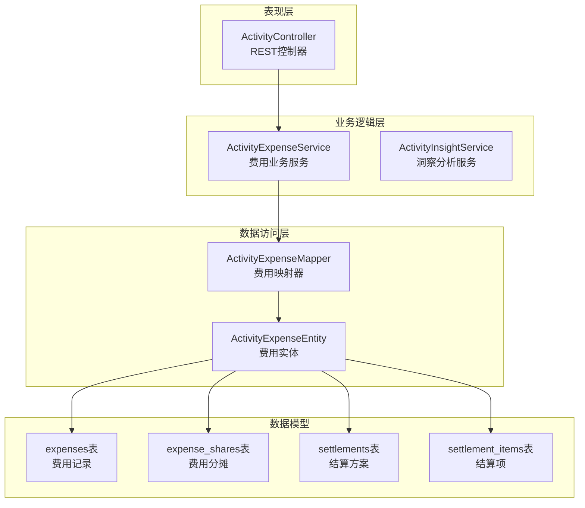
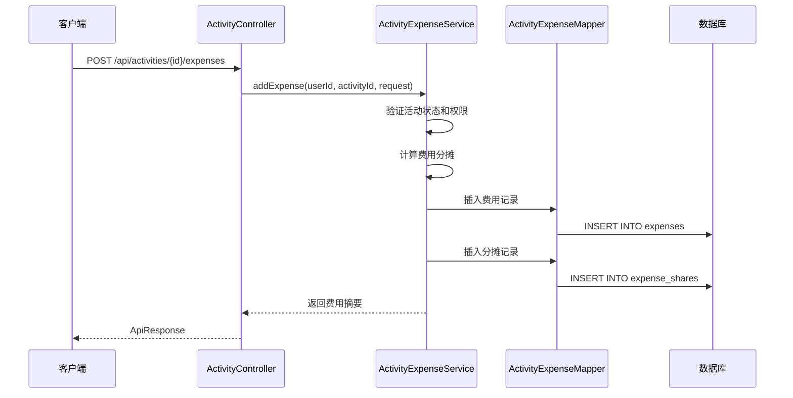
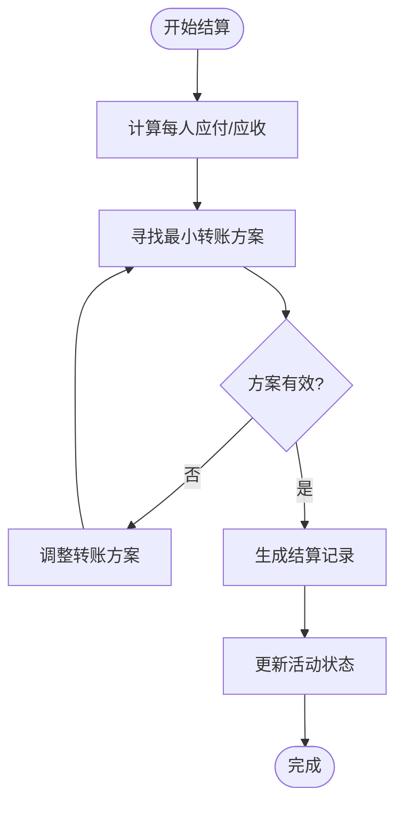
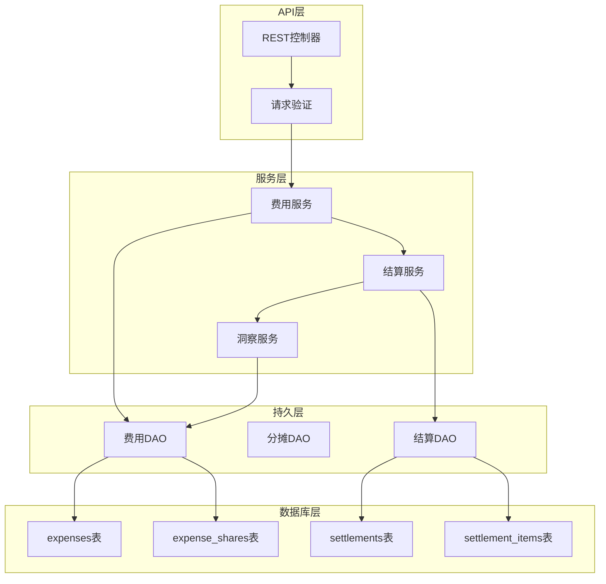
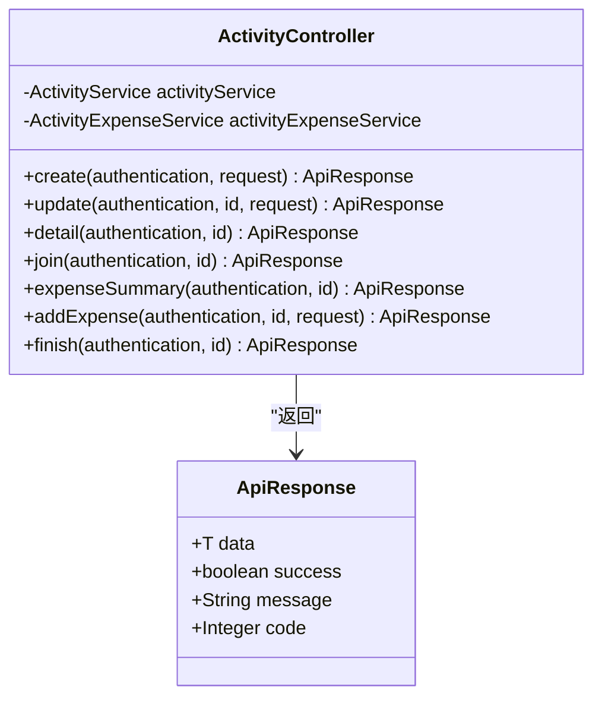
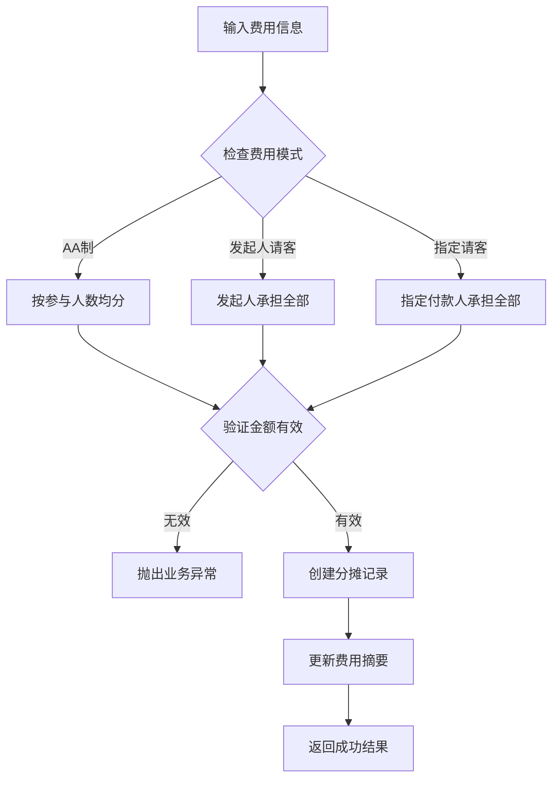
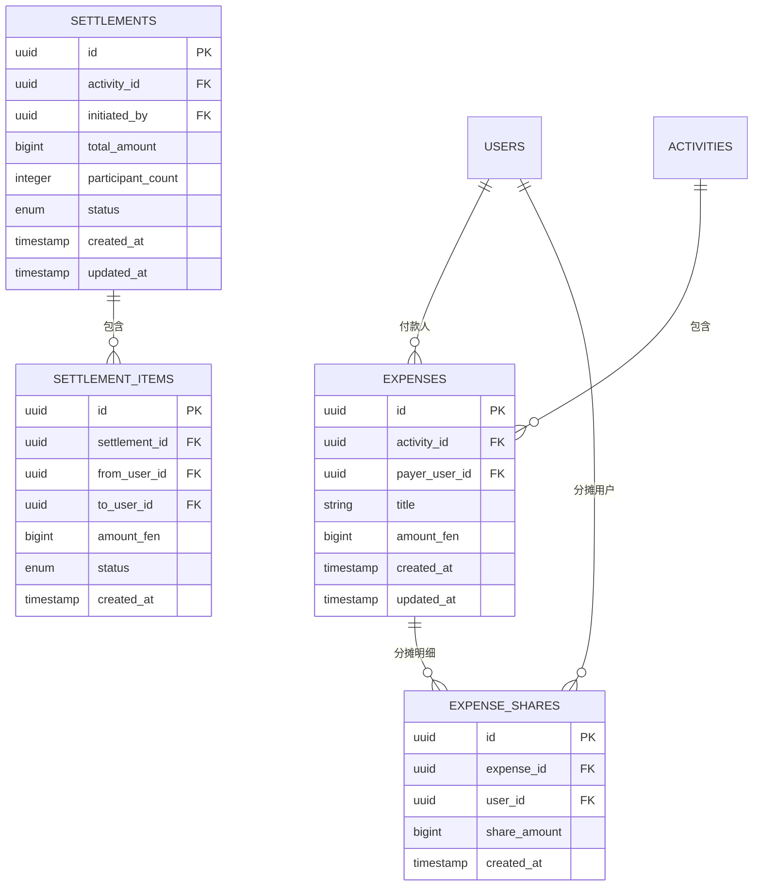
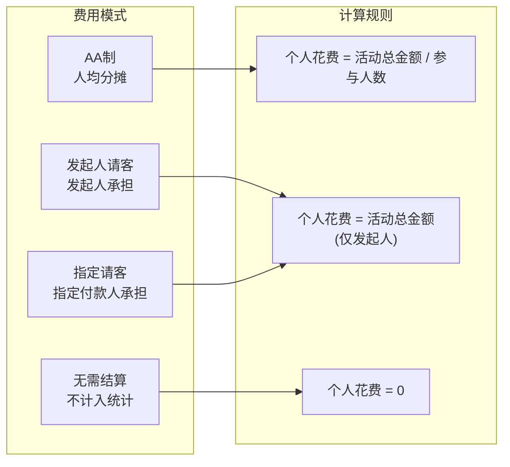
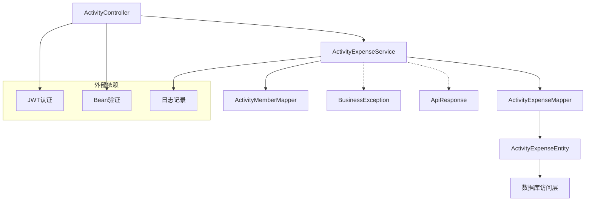

# 费用管理接口

<cite>
**本文档引用的文件**
- [ActivityController.java](file://backend/src/main/java/com/playminipro/activity/controller/ActivityController.java)
- [ActivityExpenseService.java](file://backend/src/main/java/com/playminipro/activity/service/ActivityExpenseService.java)
- [ActivityExpenseMapper.java](file://backend/src/main/java/com/playminipro/activity/mapper/ActivityExpenseMapper.java)
- [ActivityExpenseEntity.java](file://backend/src/main/java/com/playminipro/activity/entity/ActivityExpenseEntity.java)
- [AddActivityExpenseRequest.java](file://backend/src/main/java/com/playminipro/activity/dto/AddActivityExpenseRequest.java)
- [ActivityExpenseItemResponse.java](file://backend/src/main/java/com/playminipro/activity/dto/ActivityExpenseItemResponse.java)
- [ActivityExpenseSummaryResponse.java](file://backend/src/main/java/com/playminipro/activity/dto/ActivityExpenseSummaryResponse.java)
- [ActivitySettlementItemResponse.java](file://backend/src/main/java/com/playminipro/activity/dto/ActivitySettlementItemResponse.java)
- [ActivityInsightService.java](file://backend/src/main/java/com/playminipro/activity/service/ActivityInsightService.java)
- [PersonalityFinanceReportResponse.java](file://backend/src/main/java/com/playminipro/activity/dto/PersonalityFinanceReportResponse.java)
- [05-PostgreSQL建表.sql](file://doc/05-PostgreSQL建表.sql)
- [202606012206工程改进设计.md](file://doc/改进文档/202606012206工程改进设计.md)
</cite>

## 目录
1. [简介](#简介)
2. [项目结构](#项目结构)
3. [核心组件](#核心组件)
4. [架构概览](#架构概览)
5. [详细组件分析](#详细组件分析)
6. [依赖关系分析](#依赖关系分析)
7. [性能考虑](#性能考虑)
8. [故障排除指南](#故障排除指南)
9. [结论](#结论)

## 简介

PlayMiniPro项目的费用管理接口为线下活动提供了完整的费用记录、分摊、结算和统计分析功能。系统支持多种费用模式（AA制、发起人请客、指定请客），提供实时的费用分摊计算和最小转账算法，帮助用户轻松管理团队活动的财务往来。

## 项目结构

费用管理模块采用典型的三层架构设计：

**图表来源**
- [ActivityController.java:28-84](file://backend/src/main/java/com/playminipro/activity/controller/ActivityController.java#L28-L84)
- [ActivityExpenseService.java:91-120](file://backend/src/main/java/com/playminipro/activity/service/ActivityExpenseService.java#L91-L120)
- [ActivityExpenseMapper.java](file://backend/src/main/java/com/playminipro/activity/mapper/ActivityExpenseMapper.java)

**章节来源**
- [ActivityController.java:28-84](file://backend/src/main/java/com/playminipro/activity/controller/ActivityController.java#L28-L84)
- [ActivityExpenseService.java:91-120](file://backend/src/main/java/com/playminipro/activity/service/ActivityExpenseService.java#L91-L120)

## 核心组件

### 费用记录管理接口

系统提供完整的费用生命周期管理接口：

| 接口 | 方法 | 路径 | 功能描述 |
|------|------|------|----------|
| 创建费用 | POST | `/api/activities/{id}/expenses` | 创建新的活动费用记录 |
| 费用详情 | GET | `/api/activities/{id}/expenses/{expenseId}` | 获取指定费用详情 |
| 费用列表 | GET | `/api/activities/{id}/expenses` | 获取活动费用列表 |
| 更新费用 | PUT | `/api/activities/{id}/expenses/{expenseId}` | 更新费用信息 |
| 删除费用 | DELETE | `/api/activities/{id}/expenses/{expenseId}` | 删除费用记录 |

### 费用分摊计算接口

**图表来源**
- [ActivityController.java:100-105](file://backend/src/main/java/com/playminipro/activity/controller/ActivityController.java#L100-L105)
- [ActivityExpenseService.java:91-120](file://backend/src/main/java/com/playminipro/activity/service/ActivityExpenseService.java#L91-L120)

### 结算方案生成接口

系统支持自动化的结算方案生成，基于最小转账算法优化：

**图表来源**
- [ActivityExpenseService.java:91-120](file://backend/src/main/java/com/playminipro/activity/service/ActivityExpenseService.java#L91-L120)
- [ActivityInsightService.java:198-210](file://backend/src/main/java/com/playminipro/activity/service/ActivityInsightService.java#L198-L210)

### 费用统计分析接口

提供多维度的费用统计分析：

| 统计类型 | 接口 | 功能描述 |
|----------|------|----------|
| 个人消费统计 | GET `/api/personality/report` | 统计用户的AA花费、请客花费等 |
| 活动总支出 | GET `/api/activities/{id}/expenses/summary` | 获取活动总费用和参与人数 |
| 人均费用 | 自动计算 | 基于总费用和参与人数计算 |
| 时间分桶分析 | 多维度 | 日/周/月/季/年消费趋势分析 |

**章节来源**
- [ActivityController.java:94-98](file://backend/src/main/java/com/playminipro/activity/controller/ActivityController.java#L94-L98)
- [ActivityInsightService.java:164-196](file://backend/src/main/java/com/playminipro/activity/service/ActivityInsightService.java#L164-L196)

## 架构概览

费用管理系统采用分层架构，确保职责分离和代码可维护性：

**图表来源**
- [ActivityController.java:28-84](file://backend/src/main/java/com/playminipro/activity/controller/ActivityController.java#L28-L84)
- [ActivityExpenseService.java:91-120](file://backend/src/main/java/com/playminipro/activity/service/ActivityExpenseService.java#L91-L120)
- [ActivityInsightService.java:150-196](file://backend/src/main/java/com/playminipro/activity/service/ActivityInsightService.java#L150-L196)

## 详细组件分析

### ActivityController - 控制器层

控制器负责处理HTTP请求和响应，提供RESTful API接口：

**图表来源**
- [ActivityController.java:28-84](file://backend/src/main/java/com/playminipro/activity/controller/ActivityController.java#L28-L84)

### ActivityExpenseService - 业务服务层

业务服务层实现核心的费用管理逻辑：

#### 核心业务规则

| 规则类型 | 规则内容 | 错误码 |
|----------|----------|--------|
| 活动模式限制 | 仅线下活动支持费用记录 | 4001 |
| 活动状态限制 | 已结束或已取消的活动不允许编辑费用 | 4001 |
| 权限控制 | 仅活动发起人可以编辑费用 | 4003 |
| 费用模式 | 支持AA制、发起人请客、指定请客 | 4001 |

#### 费用分摊算法

**图表来源**
- [ActivityExpenseService.java:91-120](file://backend/src/main/java/com/playminipro/activity/service/ActivityExpenseService.java#L91-L120)

### 数据模型设计

#### 费用记录实体

**图表来源**
- [05-PostgreSQL建表.sql:259-286](file://doc/05-PostgreSQL建表.sql#L259-L286)

### API接口规范

#### 创建费用记录

**请求路径**: `POST /api/activities/{id}/expenses`

**请求体**:
- `title`: 费用标题，必填，字符串，长度限制
- `amount`: 金额（分），必填，整数
- `payerUserId`: 付款人用户ID，必填，UUID格式
- `sharedUsers`: 分摊用户列表，必填，数组格式

**响应体**:
- `activityId`: 活动ID
- `totalAmountFen`: 总金额（分）
- `joinedCount`: 参与人数
- `expenseItems`: 费用项目列表
- `settlementItems`: 结算项列表

#### 费用详情查询

**请求路径**: `GET /api/activities/{id}/expenses/{expenseId}`

**响应体**: 包含费用详情和分摊明细

#### 费用列表查询

**请求路径**: `GET /api/activities/{id}/expenses`

**查询参数**:
- `page`: 页码，默认1
- `size`: 每页大小，默认20
- `sort`: 排序字段，如created_at

**响应体**: 分页的费用列表

#### 费用更新

**请求路径**: `PUT /api/activities/{id}/expenses/{expenseId}`

**请求体**: 与创建费用相同的字段

#### 费用删除

**请求路径**: `DELETE /api/activities/{id}/expenses/{expenseId}`

**响应体**: 成功删除确认

### 费用统计分析

#### 个人财务报表

系统提供详细的个人财务分析：

| 指标名称 | 计算方式 | 说明 |
|----------|----------|------|
| 总花费 | 所有活动费用之和 | 以分为单位存储，前端格式化显示 |
| AA花费 | AA制活动个人分摊总和 | 按参与人数均摊计算 |
| 请客花费 | 发起人请客活动总花费 | 发起人承担整单费用 |
| 日/周/月/季/年桶 | 时间维度分桶统计 | 最近N个周期的消费趋势 |

#### 财务口径定义

**图表来源**
- [202606012206工程改进设计.md:138-144](file://doc/改进文档/202606012206工程改进设计.md#L138-L144)

**章节来源**
- [ActivityExpenseService.java:91-120](file://backend/src/main/java/com/playminipro/activity/service/ActivityExpenseService.java#L91-L120)
- [ActivityInsightService.java:164-210](file://backend/src/main/java/com/playminipro/activity/service/ActivityInsightService.java#L164-L210)
- [PersonalityFinanceReportResponse.java:1-19](file://backend/src/main/java/com/playminipro/activity/dto/PersonalityFinanceReportResponse.java#L1-L19)

## 依赖关系分析

费用管理模块的依赖关系清晰，遵循单一职责原则：

**图表来源**
- [ActivityController.java:28-84](file://backend/src/main/java/com/playminipro/activity/controller/ActivityController.java#L28-L84)
- [ActivityExpenseService.java:91-120](file://backend/src/main/java/com/playminipro/activity/service/ActivityExpenseService.java#L91-L120)

**章节来源**
- [ActivityController.java:28-84](file://backend/src/main/java/com/playminipro/activity/controller/ActivityController.java#L28-L84)
- [ActivityExpenseService.java:91-120](file://backend/src/main/java/com/playminipro/activity/service/ActivityExpenseService.java#L91-L120)

## 性能考虑

### 数据库优化

1. **索引设计**：
   - `idx_expenses_activity_id`: 提高按活动查询效率
   - `idx_expenses_payer_user_id`: 加快按付款人查询
   - `idx_settlements_activity_id`: 优化结算查询

2. **查询优化**：
   - 使用JOIN查询减少数据库往返
   - 分页查询避免大数据集加载
   - 缓存常用统计数据

### 业务逻辑优化

1. **内存分桶**：在Java内存中进行时间维度分桶，避免多次数据库查询
2. **批量操作**：支持批量费用导入和导出
3. **异步处理**：复杂的结算计算采用异步方式处理

## 故障排除指南

### 常见错误及解决方案

| 错误码 | 错误类型 | 可能原因 | 解决方案 |
|--------|----------|----------|----------|
| 4001 | 业务逻辑错误 | 活动状态不允许、费用模式不支持 | 检查活动状态和费用模式 |
| 4003 | 权限错误 | 非活动发起人尝试编辑 | 确保操作用户为活动发起人 |
| 404 | 资源不存在 | 活动或费用不存在 | 验证ID有效性 |
| 500 | 服务器错误 | 数据库连接或业务逻辑异常 | 查看服务器日志 |

### 调试建议

1. **启用详细日志**：在开发环境中启用SQL日志和业务日志
2. **单元测试**：为关键业务逻辑编写单元测试
3. **集成测试**：测试完整的费用管理流程
4. **性能监控**：监控数据库查询时间和API响应时间

**章节来源**
- [ActivityExpenseService.java:91-120](file://backend/src/main/java/com/playminipro/activity/service/ActivityExpenseService.java#L91-L120)

## 结论

PlayMiniPro项目的费用管理接口提供了完整、可靠的活动费用管理解决方案。系统采用清晰的分层架构，严格的业务规则验证，以及高效的数据库设计，能够满足团队活动的多样化费用管理需求。

主要优势包括：
- 完整的费用生命周期管理
- 灵活的费用分摊计算
- 智能的结算方案生成
- 丰富的统计分析功能
- 良好的性能和扩展性

未来可以考虑的功能增强：
- 移动端费用导入功能
- 更精细的费用分类管理
- 实时费用提醒通知
- 多币种支持