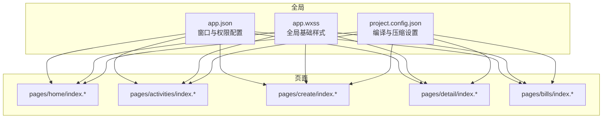
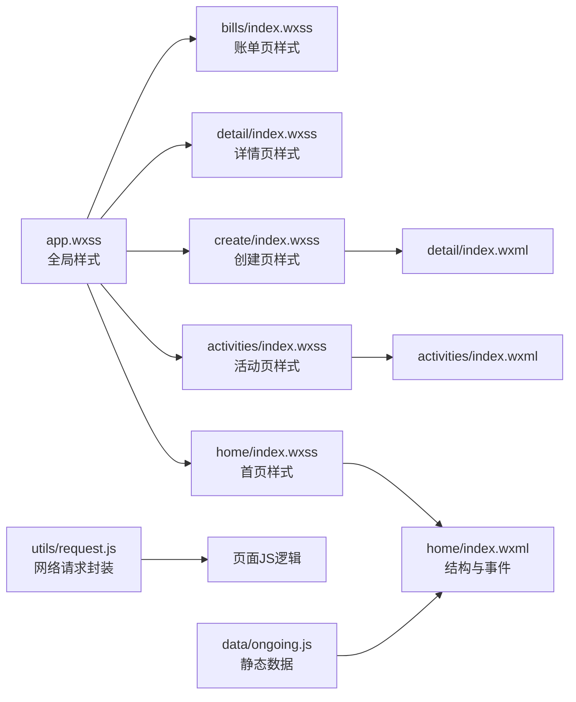
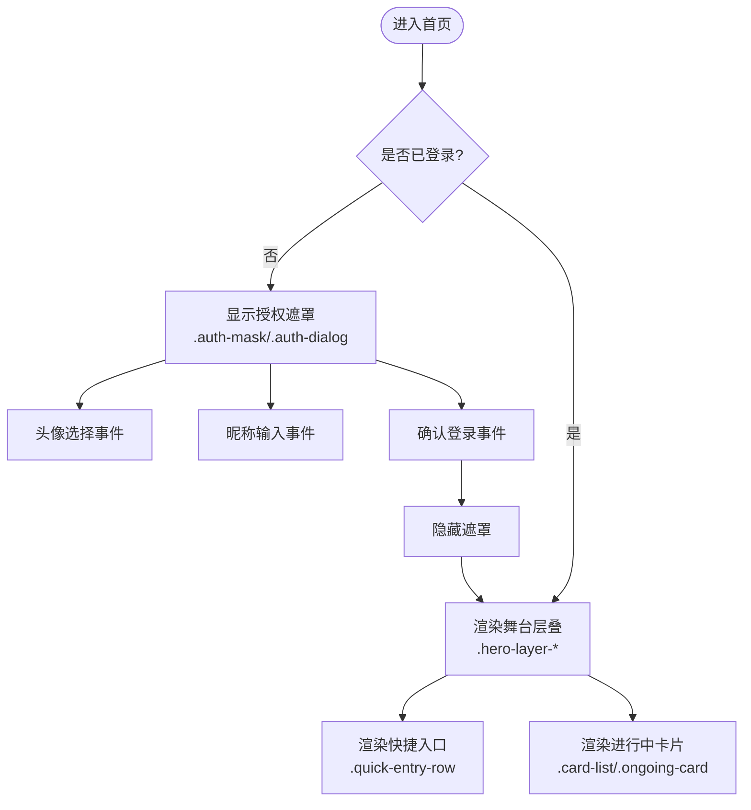
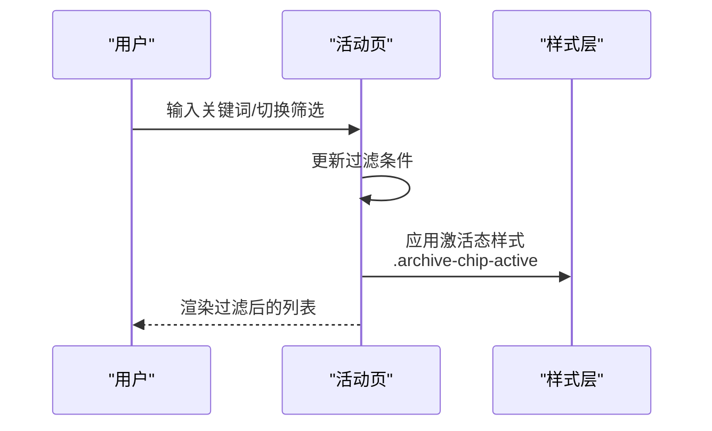
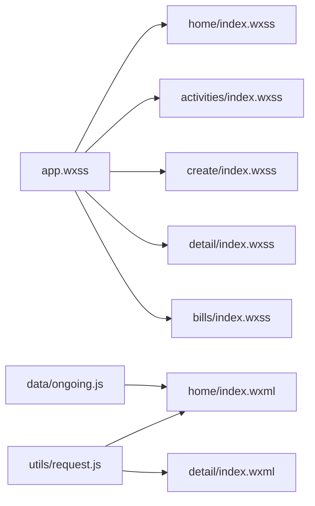

# UI设计与样式

<cite>
**本文引用的文件**
- [frontend/app.wxss](file://frontend/app.wxss)
- [frontend/app.json](file://frontend/app.json)
- [frontend/pages/home/index.wxss](file://frontend/pages/home/index.wxss)
- [frontend/pages/home/index.wxml](file://frontend/pages/home/index.wxml)
- [frontend/pages/home/index.json](file://frontend/pages/home/index.json)
- [frontend/pages/activities/index.wxss](file://frontend/pages/activities/index.wxss)
- [frontend/pages/activities/index.wxml](file://frontend/pages/activities/index.wxml)
- [frontend/pages/create/index.wxss](file://frontend/pages/create/index.wxss)
- [frontend/pages/detail/index.wxss](file://frontend/pages/detail/index.wxss)
- [frontend/pages/detail/index.wxml](file://frontend/pages/detail/index.wxml)
- [frontend/pages/bills/index.wxss](file://frontend/pages/bills/index.wxss)
- [frontend/utils/request.js](file://frontend/utils/request.js)
- [frontend/data/ongoing.js](file://frontend/data/ongoing.js)
- [frontend/project.config.json](file://frontend/project.config.json)
</cite>

## 目录
1. [简介](#简介)
2. [项目结构](#项目结构)
3. [核心组件](#核心组件)
4. [架构总览](#架构总览)
5. [详细组件分析](#详细组件分析)
6. [依赖分析](#依赖分析)
7. [性能考虑](#性能考虑)
8. [故障排查指南](#故障排查指南)
9. [结论](#结论)
10. [附录](#附录)

## 简介
本指南面向PlayMiniPro前端UI设计与样式，系统梳理小程序的样式体系（WXSS语法、选择器、继承与优先级）、响应式与屏幕适配、组件化样式组织、图片资源管理、UI设计原则、动画与交互反馈，以及第三方UI框架与自定义组件的集成思路。文档以仓库现有样式与页面为依据，结合实际文件路径与片段位置，帮助开发者快速理解并高效扩展UI。

## 项目结构
前端采用页面级组织：每个页面由 WXML 结构、WXSS 样式、JS 逻辑与 JSON 配置组成；全局样式通过 app.wxss 统一注入，页面样式按需覆盖。项目配置文件 project.config.json 控制编译与压缩策略。

**图表来源**
- [frontend/app.json:1-30](file://frontend/app.json#L1-L30)
- [frontend/app.wxss:1-125](file://frontend/app.wxss#L1-L125)
- [frontend/project.config.json:1-25](file://frontend/project.config.json#L1-L25)

**章节来源**
- [frontend/app.json:1-30](file://frontend/app.json#L1-L30)
- [frontend/app.wxss:1-125](file://frontend/app.wxss#L1-L125)
- [frontend/project.config.json:1-25](file://frontend/project.config.json#L1-L25)

## 核心组件
- 全局样式与主题
  - 页面根元素与字体、颜色、渐变背景在全局样式中统一设定，确保品牌视觉一致。
  - 常用卡片容器类（如 .hero-card、.panel、.activity-card）集中定义圆角、阴影、边框等外观特征，便于复用。
- 页面级样式
  - 各页面独立 WXSS 文件承载页面特有布局与视觉细节，如首页的舞台层叠、活动页的筛选与列表、创建页的输入卡片等。
- 结构与数据
  - 页面 WXML 定义结构与交互事件，数据通过 JS 注入（如首页的进行中活动列表），部分静态数据可在 data 目录维护。

**章节来源**
- [frontend/app.wxss:1-125](file://frontend/app.wxss#L1-L125)
- [frontend/pages/home/index.wxss:1-504](file://frontend/pages/home/index.wxss#L1-L504)
- [frontend/pages/activities/index.wxss:1-296](file://frontend/pages/activities/index.wxss#L1-L296)
- [frontend/pages/create/index.wxss:1-324](file://frontend/pages/create/index.wxss#L1-L324)
- [frontend/pages/detail/index.wxss:1-461](file://frontend/pages/detail/index.wxss#L1-L461)
- [frontend/pages/bills/index.wxss:1-189](file://frontend/pages/bills/index.wxss#L1-L189)
- [frontend/pages/home/index.wxml:1-122](file://frontend/pages/home/index.wxml#L1-L122)
- [frontend/data/ongoing.js:1-37](file://frontend/data/ongoing.js#L1-L37)

## 架构总览
小程序UI架构遵循"全局样式 + 页面样式 + 结构模板"的分层设计。全局样式负责品牌与通用组件外观，页面样式负责场景化布局与细节，WXML 提供语义化结构与交互绑定。

**图表来源**
- [frontend/app.wxss:1-125](file://frontend/app.wxss#L1-L125)
- [frontend/pages/home/index.wxss:1-504](file://frontend/pages/home/index.wxss#L1-L504)
- [frontend/pages/activities/index.wxss:1-296](file://frontend/pages/activities/index.wxss#L1-L296)
- [frontend/pages/create/index.wxss:1-324](file://frontend/pages/create/index.wxss#L1-L324)
- [frontend/pages/detail/index.wxss:1-461](file://frontend/pages/detail/index.wxss#L1-L461)
- [frontend/pages/bills/index.wxss:1-189](file://frontend/pages/bills/index.wxss#L1-L189)
- [frontend/pages/home/index.wxml:1-122](file://frontend/pages/home/index.wxml#L1-L122)
- [frontend/pages/activities/index.wxml:1-83](file://frontend/pages/activities/index.wxml#L1-L83)
- [frontend/pages/detail/index.wxml:1-461](file://frontend/pages/detail/index.wxml#L1-L461)
- [frontend/utils/request.js:1-107](file://frontend/utils/request.js#L1-L107)
- [frontend/data/ongoing.js:1-37](file://frontend/data/ongoing.js#L1-L37)

## 详细组件分析

### 全局样式与主题系统
- 品牌色彩与字体
  - 页面背景使用线性渐变，文字主色与字体族在全局设定，保证跨页面一致性。
- 卡片与容器
  - 多类卡片容器（如 .hero-card、.panel、.activity-card、.bill-card 等）统一圆角、阴影与边框，形成品牌化的"手绘风"卡片外观。
- 按钮与网格
  - 主按钮与幽灵按钮类提供统一的高亮与轻量按钮风格；网格类（.grid-two、.chip-row）支撑两列与标签行布局。

**章节来源**
- [frontend/app.wxss:1-125](file://frontend/app.wxss#L1-L125)

### 首页（home）
- 视觉层次
  - 使用多层背景板（.hero-layer-*）与装饰光晕（.stage-orb-*）、飘带（.stage-ribbon-*）、星点（.stage-spark-*）构建舞台感。
- 登录授权遮罩
  - 通过 .auth-mask 与 .auth-dialog 实现弹窗式授权流程，包含头像选择、昵称输入与确认按钮。
- 快速入口与进行中卡片
  - .quick-entry-row 与 .card-list 展示快捷功能与活动卡片，卡片内含标签组、成员头像堆叠等。

**图表来源**
- [frontend/pages/home/index.wxml:1-122](file://frontend/pages/home/index.wxml#L1-L122)
- [frontend/pages/home/index.wxss:1-504](file://frontend/pages/home/index.wxss#L1-L504)

**章节来源**
- [frontend/pages/home/index.wxml:1-122](file://frontend/pages/home/index.wxml#L1-L122)
- [frontend/pages/home/index.wxss:1-504](file://frontend/pages/home/index.wxss#L1-L504)
- [frontend/pages/home/index.json:1-3](file://frontend/pages/home/index.json#L1-L3)
- [frontend/data/ongoing.js:1-37](file://frontend/data/ongoing.js#L1-L37)

### 活动页（activities）
- 筛选与搜索
  - 身份筛选、状态筛选、时间范围选择与关键词搜索构成完整的检索链路。
- 列表与卡片
  - 活动卡片展示类型、角色、状态、时间地点、金额与亮点摘要，支持打开详情。

**图表来源**
- [frontend/pages/activities/index.wxml:1-83](file://frontend/pages/activities/index.wxml#L1-L83)
- [frontend/pages/activities/index.wxss:1-296](file://frontend/pages/activities/index.wxss#L1-L296)

**章节来源**
- [frontend/pages/activities/index.wxml:1-83](file://frontend/pages/activities/index.wxml#L1-L83)
- [frontend/pages/activities/index.wxss:1-296](file://frontend/pages/activities/index.wxss#L1-L296)

### 创建页（create）
- 输入卡片与字段
  - 头部徽章、摘要条、字段网格与输入框卡片统一风格，配合强弱标签突出关键信息。
- 类型选择与费用标签
  - 类型芯片与费用芯片行提供直观的选择与提示。

**章节来源**
- [frontend/pages/create/index.wxss:1-324](file://frontend/pages/create/index.wxss#L1-L324)

### 详情页（detail）
- 卡片主题与强调
  - 多种卡片主题（sunrise/sand/clay-soft/sand-deep/plain）通过类名切换，强调不同信息层级。
- 成员与清单
  - 成员头像堆叠与清单点阵提升信息密度与可读性。
- 背景系统优化
  - 新增城市背景图片（city-bg.png）作为详情页背景，采用 aspectFill 模式填充整个页面，增强视觉层次与沉浸感。

**更新** 新增城市背景图片集成，优化背景系统架构，提升详情页视觉体验

**章节来源**
- [frontend/pages/detail/index.wxss:1-461](file://frontend/pages/detail/index.wxss#L1-L461)
- [frontend/pages/detail/index.wxml:1-461](file://frontend/pages/detail/index.wxml#L1-L461)

### 账单页（bills）
- 摘要与记录
  - 总额、指标卡与记录行构成清晰的账单视图，支持空状态与操作按钮。

**章节来源**
- [frontend/pages/bills/index.wxss:1-189](file://frontend/pages/bills/index.wxss#L1-L189)

### 图片资源与CDN策略
- 资源位置
  - 图片资源位于 img 目录，页面通过相对路径引用（如首页品牌Logo、详情页城市背景）。
- 格式优化
  - 品牌Logo已从JPEG格式迁移到PNG格式，提升透明度与清晰度表现。
- 压缩与懒加载
  - 项目配置开启 WXML/WXSS 压缩与 minified，有助于减小包体；图片建议在构建前进行压缩与格式优化（如WebP）。
- CDN接入
  - 可将静态资源迁移至CDN，结合域名与缓存策略提升首屏与二次加载性能。

**更新** 新增PNG格式Logo处理，优化背景图片系统架构

**章节来源**
- [frontend/project.config.json:1-25](file://frontend/project.config.json#L1-L25)
- [frontend/pages/home/index.wxml:1-122](file://frontend/pages/home/index.wxml#L1-L122)
- [frontend/pages/detail/index.wxml:1-461](file://frontend/pages/detail/index.wxml#L1-L461)

## 依赖分析
- 样式依赖
  - 页面样式依赖全局 app.wxss 的基础变量与通用组件类，避免重复定义。
- 数据与逻辑
  - 页面通过 JS 逻辑与数据模块（如 ongoing.js）驱动视图更新，网络请求通过 utils/request.js 封装。
- 配置影响
  - project.config.json 中的压缩与编译选项直接影响打包体积与运行性能。

**图表来源**
- [frontend/app.wxss:1-125](file://frontend/app.wxss#L1-L125)
- [frontend/pages/home/index.wxss:1-504](file://frontend/pages/home/index.wxss#L1-L504)
- [frontend/pages/activities/index.wxss:1-296](file://frontend/pages/activities/index.wxss#L1-L296)
- [frontend/pages/create/index.wxss:1-324](file://frontend/pages/create/index.wxss#L1-L324)
- [frontend/pages/detail/index.wxss:1-461](file://frontend/pages/detail/index.wxss#L1-L461)
- [frontend/pages/bills/index.wxss:1-189](file://frontend/pages/bills/index.wxss#L1-L189)
- [frontend/data/ongoing.js:1-37](file://frontend/data/ongoing.js#L1-L37)
- [frontend/utils/request.js:1-107](file://frontend/utils/request.js#L1-L107)
- [frontend/pages/home/index.wxml:1-122](file://frontend/pages/home/index.wxml#L1-L122)
- [frontend/pages/detail/index.wxml:1-461](file://frontend/pages/detail/index.wxml#L1-L461)

**章节来源**
- [frontend/app.wxss:1-125](file://frontend/app.wxss#L1-L125)
- [frontend/utils/request.js:1-107](file://frontend/utils/request.js#L1-L107)
- [frontend/data/ongoing.js:1-37](file://frontend/data/ongoing.js#L1-L37)

## 性能考虑
- 样式体积
  - 合理拆分通用类与页面特有样式，减少重复定义；利用项目配置中的压缩选项降低包体。
- 图片优化
  - 在构建阶段进行压缩与格式优化；对首屏关键图片采用懒加载策略，非关键图片延迟加载。
- 交互反馈
  - 按钮与交互元素提供明确的高亮与禁用状态，避免无效点击带来的重渲染成本。

## 故障排查指南
- 授权失败或过期
  - 当网络请求返回401/403时，清理本地认证状态并引导重新登录。
- 请求异常
  - 对错误响应统一处理，提取服务端 message 并提示用户；必要时记录状态码与响应体以便定位问题。

**章节来源**
- [frontend/utils/request.js:50-107](file://frontend/utils/request.js#L50-L107)

## 结论
PlayMiniPro的UI以全局样式为基础、页面样式为扩展、结构模板为载体，形成了统一且可扩展的前端样式体系。通过卡片化组件、网格与Flex布局，以及清晰的筛选与交互流程，实现了良好的可用性与一致性。建议在后续迭代中进一步沉淀公共样式模块、完善主题变量与暗色模式支持，并引入更完善的图片与CDN优化策略。

## 附录

### WXSS语法与选择器要点
- 选择器
  - 类选择器、属性选择器、伪元素（如 ::after）常用于按钮与装饰元素的微调。
- 继承与优先级
  - 全局样式优先级低于页面样式；页面内局部样式优先于通用类；!important应谨慎使用。
- 单位与适配
  - rpx 作为移动端适配单位；vw/vh 可用于极少数全屏/百分比布局场景。

**章节来源**
- [frontend/app.wxss:1-125](file://frontend/app.wxss#L1-L125)
- [frontend/pages/home/index.wxss:1-504](file://frontend/pages/home/index.wxss#L1-L504)
- [frontend/pages/activities/index.wxss:1-296](file://frontend/pages/activities/index.wxss#L1-L296)
- [frontend/pages/create/index.wxss:1-324](file://frontend/pages/create/index.wxss#L1-L324)
- [frontend/pages/detail/index.wxss:1-461](file://frontend/pages/detail/index.wxss#L1-L461)
- [frontend/pages/bills/index.wxss:1-189](file://frontend/pages/bills/index.wxss#L1-L189)

### 响应式与屏幕适配
- 适配策略
  - 使用 rpx 作为主要布局单位；在需要精确控制的场景下，结合媒体查询或条件渲染进行差异化布局。
- 尺寸换算
  - 设计稿以 750rpx 为基准宽度，按比例换算各元素尺寸。

**章节来源**
- [frontend/app.json:12-18](file://frontend/app.json#L12-L18)

### 组件化样式组织
- 抽离公共样式
  - 将通用卡片、按钮、标签、网格等抽象为公共类，页面仅引入所需类名。
- 主题定制
  - 通过主题类（如 .sunrise/.sand）切换卡片外观，保持风格一致性。
- 模块化
  - 页面样式独立维护，避免跨页面耦合；必要时抽取混入或变量（如颜色、圆角、阴影）到全局样式。

**章节来源**
- [frontend/app.wxss:1-125](file://frontend/app.wxss#L1-L125)
- [frontend/pages/home/index.wxss:247-260](file://frontend/pages/home/index.wxss#L247-L260)
- [frontend/pages/detail/index.wxss:73-101](file://frontend/pages/detail/index.wxss#L73-L101)

### 动画与交互反馈
- 动画
  - 使用 transform 与滤镜（如 blur）营造舞台氛围；过渡动画建议通过页面切换与显隐控制实现。
- 交互反馈
  - 按钮与筛选项的激活态通过类名切换呈现；输入框与选择器提供占位与提示文本。

**章节来源**
- [frontend/pages/home/index.wxss:181-202](file://frontend/pages/home/index.wxss#L181-L202)
- [frontend/pages/activities/index.wxss:78-82](file://frontend/pages/activities/index.wxss#L78-L82)

### 第三方UI框架与自定义组件
- 集成建议
  - 若引入第三方UI库，建议将其样式隔离在独立命名空间，避免与现有类名冲突。
- 自定义组件
  - 可将高频使用的卡片、按钮、输入框封装为自定义组件，统一行为与样式，提升复用性。

### 背景系统架构优化
- 城市背景图片集成
  - 详情页新增 city-bg.png 作为背景图片，采用 aspectFill 模式填充整个页面，提供沉浸式视觉体验。
- Logo格式优化
  - 品牌Logo从 JPEG 迁移到 PNG 格式，提升透明度处理与边缘清晰度，改善整体视觉质量。
- 背景系统架构
  - 通过全局 .page-bg-img 类统一管理页面背景，支持不同页面的背景图片差异化配置。

**更新** 新增背景系统架构优化，包含城市背景图片集成与Logo格式改进

**章节来源**
- [frontend/pages/detail/index.wxml:1-461](file://frontend/pages/detail/index.wxml#L1-L461)
- [frontend/app.wxss:14-14](file://frontend/app.wxss#L14-L14)