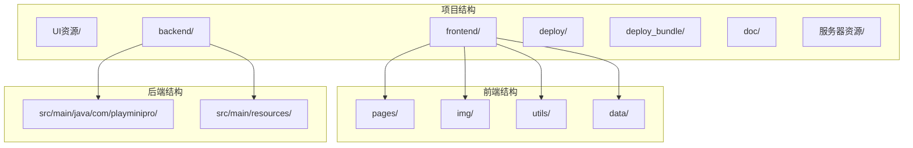
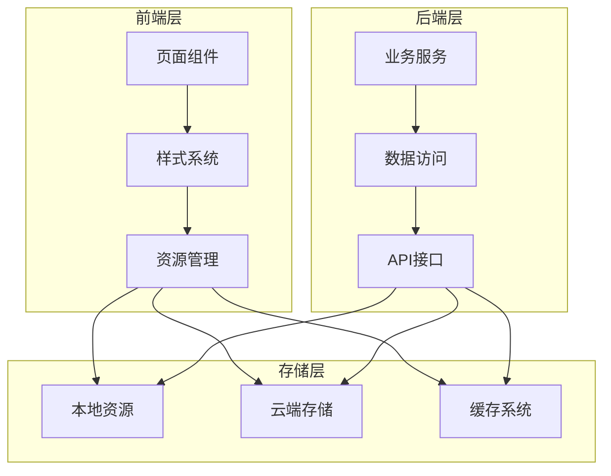
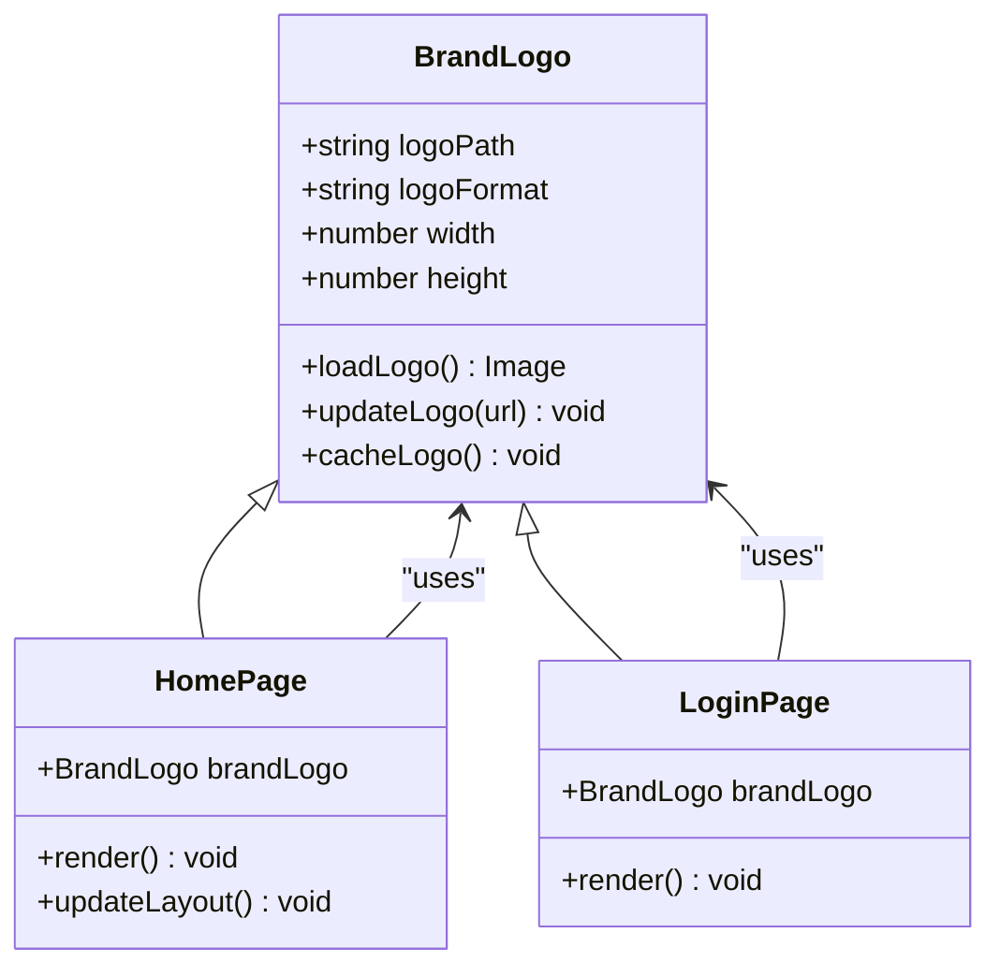
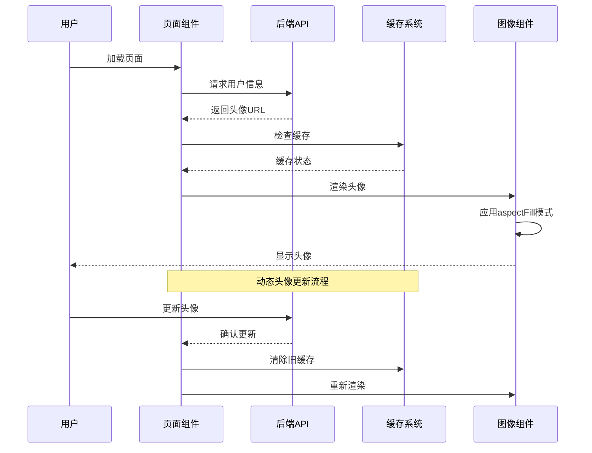
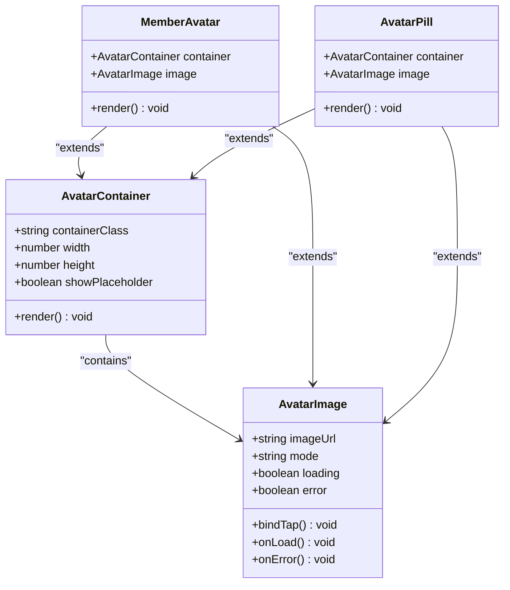
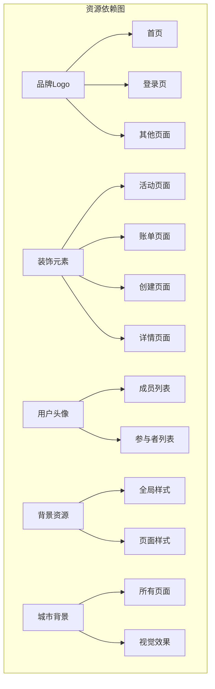
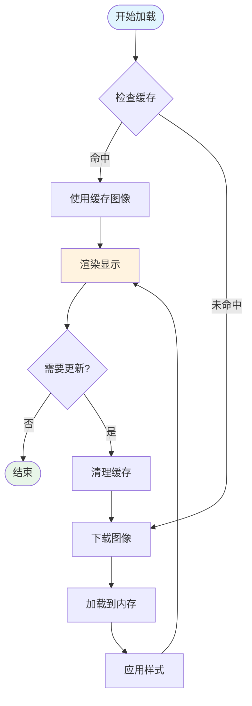

# 图像资源管理与优化

<cite>
**本文档引用的文件**
- [frontend\README.md](file://frontend/README.md)
- [frontend\project.config.json](file://frontend/project.config.json)
- [frontend\project.private.config.json](file://frontend/project.private.config.json)
- [frontend\app.wxss](file://frontend/app.wxss)
- [frontend\app.json](file://frontend/app.json)
- [frontend\pages\home\index.wxml](file://frontend/pages/home/index.wxml)
- [frontend\pages\home\index.wxss](file://frontend/pages/home/index.wxss)
- [frontend\pages\activities\index.wxml](file://frontend/pages/activities/index.wxml)
- [frontend\pages\bills\index.wxml](file://frontend/pages/bills/index.wxml)
- [frontend\pages\create\index.wxml](file://frontend/pages/create/index.wxml)
- [frontend\pages\detail\index.wxml](file://frontend/pages/detail/index.wxml)
- [frontend\pages\personality\index.wxml](file://frontend/pages/personality/index.wxml)
- [frontend\pages\personality-poster\index.wxml](file://frontend/pages/personality-poster/index.wxml)
- [frontend\pages\archive-detail\index.wxml](file://frontend/pages/archive-detail/index.wxml)
- [deploy_bundle\frontend\README.md](file://deploy_bundle/frontend/README.md)
- [deploy_bundle\frontend\project.config.json](file://deploy_bundle/frontend/project.config.json)
- [deploy_bundle\frontend\project.private.config.json](file://deploy_bundle/frontend/project.private.config.json)
- [deploy_bundle\frontend\app.wxss](file://deploy_bundle/frontend/app.wxss)
- [deploy_bundle\frontend\pages\home\index.wxml](file://deploy_bundle/frontend/pages/home/index.wxml)
- [deploy_bundle\frontend\pages\detail\index.wxml](file://deploy_bundle/frontend/pages/detail/index.wxml)
- [deploy_bundle\frontend\pages\detail\index.wxss](file://deploy_bundle/frontend/pages/detail/index.wxss)
- [frontend\img\brand-logo.png](file://frontend/img/brand-logo.png)
- [frontend\img\city-bg.png](file://frontend/img/city-bg.png)
- [frontend\img\ui-beer-skewer.jpg](file://frontend/img/ui-beer-skewer.jpg)
- [frontend\img\ui-character.jpg](file://frontend/img/ui-character.jpg)
- [frontend\img\ui-controller.jpg](file://frontend/img/ui-controller.jpg)
- [frontend\img\ui-headset.jpg](file://frontend/img/ui-headset.jpg)
- [deploy_bundle\frontend\img\brand-logo.jpg](file://deploy_bundle/frontend/img/brand-logo.jpg)
</cite>

## 更新摘要
**所做更改**
- 更新了品牌标识资源章节，反映logo格式从JPEG优化为PNG格式
- 新增了城市背景图片(city-bg.png)的详细说明
- 更新了图像资源类型分类，包含新的PNG格式资源
- 修改了资源加载策略章节，反映PNG格式的优势
- 更新了依赖分析和性能考虑章节，体现新的图像格式选择

## 目录
1. [简介](#简介)
2. [项目结构](#项目结构)
3. [核心组件](#核心组件)
4. [架构概览](#架构概览)
5. [详细组件分析](#详细组件分析)
6. [依赖分析](#依赖分析)
7. [性能考虑](#性能考虑)
8. [故障排除指南](#故障排除指南)
9. [结论](#结论)

## 简介

本项目是一个基于微信小程序的活动管理系统，包含完整的前端图像资源管理体系。项目采用前后端分离架构，前端使用原生小程序框架，后端使用Spring Boot技术栈。

图像资源管理是本项目的重要组成部分，涵盖了品牌标识、装饰元素、用户头像等多个方面。通过合理的资源组织和优化策略，确保了良好的用户体验和性能表现。

**更新** 本次更新反映了图像资源格式的重大优化：品牌Logo从JPEG格式优化为PNG格式以支持透明背景，新增了城市背景图片(city-bg.png)以增强视觉效果。

## 项目结构

项目采用模块化组织结构，主要分为前端和后端两个部分：

**图表来源**
- [frontend\README.md:1-17](file://frontend/README.md#L1-L17)
- [deploy_bundle\frontend\README.md:1-17](file://deploy_bundle/frontend/README.md#L1-L17)

**章节来源**
- [frontend\README.md:1-17](file://frontend/README.md#L1-L17)
- [deploy_bundle\frontend\README.md:1-17](file://deploy_bundle/frontend/README.md#L1-L17)

## 核心组件

### 图像资源类型分类

项目中的图像资源主要分为以下几类：

1. **品牌标识资源**
   - 品牌Logo：`brand-logo.png`（PNG格式，支持透明背景）和 `brand-logo.jpg`（JPEG格式）
   - 用于应用启动页和页面头部展示

2. **装饰元素资源**
   - UI装饰图片：`ui-headset.jpg`、`ui-beer-skewer.jpg`、`ui-controller.jpg`、`ui-character.jpg`
   - 用于页面背景和装饰效果

3. **用户头像资源**
   - 用户头像：支持动态加载用户头像URL
   - 头像容器样式：`.avatar-image-pill`、`.member-avatar-image`

4. **背景资源**
   - 应用背景：`city-bg.png`（PNG格式，支持透明度控制）
   - 用于全局背景效果

**更新** 品牌Logo已从JPEG格式优化为PNG格式，以支持透明背景效果，提升视觉品质。

**章节来源**
- [frontend\pages\home\index.wxml:4-66](file://frontend/pages/home/index.wxml#L4-L66)
- [frontend\pages\activities\index.wxml:2](file://frontend/pages/activities/index.wxml#L2)
- [frontend\pages\bills\index.wxml:17](file://frontend/pages/bills/index.wxml#L17)
- [frontend\pages\create\index.wxml:10](file://frontend/pages/create/index.wxml#L10)
- [frontend\pages\detail\index.wxml:10](file://frontend/pages/detail/index.wxml#L10)
- [frontend\pages\personality\index.wxml:2](file://frontend/pages/personality/index.wxml#L2)
- [frontend\app.wxss:2](file://frontend/app.wxss#L2)

### 资源加载策略

项目采用多种图像加载策略：

1. **静态资源内联**
   - 品牌Logo和装饰图片作为静态资源打包
   - 通过相对路径 `/img/` 访问

2. **动态头像加载**
   - 用户头像URL从后端API获取
   - 支持动态更新和缓存

3. **模式适配**
   - 使用 `mode="aspectFit"` 保持比例
   - 使用 `mode="aspectFill"` 填充显示

4. **格式优化**
   - 品牌Logo使用PNG格式保证透明背景
   - 装饰图片使用JPG格式优化体积

**更新** 新增了PNG格式的品牌Logo资源，提供更好的透明背景支持。

**章节来源**
- [frontend\pages\home\index.wxml:4-66](file://frontend/pages/home/index.wxml#L4-L66)
- [frontend\pages\detail\index.wxml:32](file://frontend/pages/detail/index.wxml#L32)
- [frontend\pages\detail\index.wxml:64](file://frontend/pages/detail/index.wxml#L64)

## 架构概览

项目采用三层架构，图像资源管理贯穿整个系统：

**图表来源**
- [frontend\project.config.json:1-25](file://frontend/project.config.json#L1-L25)
- [frontend\project.private.config.json:1-14](file://frontend/project.private.config.json#L1-L14)

## 详细组件分析

### 品牌标识管理系统

品牌标识是项目视觉识别的核心元素，主要包含以下组件：

#### Logo管理系统

**更新** 品牌Logo现已支持PNG格式，提供透明背景选项，提升视觉效果。

**图表来源**
- [frontend\pages\home\index.wxml:4](file://frontend/pages/home/index.wxml#L4)
- [frontend\pages\home\index.wxml:51](file://frontend/pages/home/index.wxml#L51)

#### 装饰元素管理系统

装饰元素为页面提供视觉层次和美感：

| 装饰元素 | 文件名 | 使用场景 | 配置参数 |
|---------|--------|----------|----------|
| 头戴设备 | ui-headset.jpg | 活动归档页面 | aspectFit, 宽度自适应 |
| 啤酒串 | ui-beer-skewer.jpg | 账单页面 | aspectFit, 底部装饰 |
| 游戏手柄 | ui-controller.jpg | 创建活动页面 | aspectFit, 顶部装饰 |
| 角色形象 | ui-character.jpg | 多个页面 | aspectFit, 主视觉元素 |

**章节来源**
- [frontend\pages\activities\index.wxml:2](file://frontend/pages/activities/index.wxml#L2)
- [frontend\pages\bills\index.wxml:17](file://frontend/pages/bills/index.wxml#L17)
- [frontend\pages\create\index.wxml:10](file://frontend/pages/create/index.wxml#L10)
- [frontend\pages\detail\index.wxml:10](file://frontend/pages/detail/index.wxml#L10)
- [frontend\pages\personality\index.wxml:2](file://frontend/pages/personality/index.wxml#L2)

### 用户头像管理系统

用户头像是个性化体验的重要组成部分：

#### 头像渲染流程

**图表来源**
- [frontend\pages\detail\index.wxml:32](file://frontend/pages/detail/index.wxml#L32)
- [frontend\pages\detail\index.wxml:64](file://frontend/pages/detail/index.wxml#L64)

#### 头像样式系统

**图表来源**
- [frontend\pages\detail\index.wxss:256](file://frontend/pages/detail/index.wxss#L256)
- [frontend\pages\detail\index.wxss:300](file://frontend/pages/detail/index.wxss#L300)
- [frontend\pages\detail\index.wxss:374](file://frontend/pages/detail/index.wxss#L374)

**章节来源**
- [frontend\pages\detail\index.wxss:256](file://frontend/pages/detail/index.wxss#L256)
- [frontend\pages\detail\index.wxss:300](file://frontend/pages/detail/index.wxss#L300)
- [frontend\pages\detail\index.wxss:374](file://frontend/pages/detail/index.wxss#L374)

### 背景资源管理系统

应用背景为整体视觉效果提供基础：

#### 背景配置系统

| 背景类型 | 文件名 | 配置位置 | 效果描述 |
|---------|--------|----------|----------|
| 应用背景 | city-bg.png | app.wxss | 全局背景纹理，支持透明度控制 |
| 页面背景 | 各页面独立 | 页面wxss | 页面特定背景 |

**更新** 新增了city-bg.png背景图片，提供更好的视觉层次和透明度控制。

**章节来源**
- [frontend\app.wxss:2](file://frontend/app.wxss#L2)

## 依赖分析

### 资源依赖关系

**更新** 新增了城市背景图片的依赖关系，所有页面都使用city-bg.png作为统一背景。

**图表来源**
- [frontend\pages\home\index.wxml:4](file://frontend/pages/home/index.wxml#L4)
- [frontend\pages\home\index.wxml:51](file://frontend/pages/home/index.wxml#L51)
- [frontend\pages\activities\index.wxml:2](file://frontend/pages/activities/index.wxml#L2)
- [frontend\pages\detail\index.wxml:32](file://frontend/pages/detail/index.wxml#L32)

### 性能依赖关系

项目在构建配置中包含了多项性能优化设置：

| 配置项 | 值 | 作用 |
|--------|----|------|
| minified | true | 代码压缩 |
| postcss | true | 样式预处理 |
| minifyWXML | true | WXML压缩 |
| es6 | true | ES6支持 |
| enhance | true | 增强编译 |

**章节来源**
- [frontend\project.config.json:1-25](file://frontend/project.config.json#L1-L25)
- [frontend\project.private.config.json:1-14](file://frontend/project.private.config.json#L1-L14)

## 性能考虑

### 图像加载优化策略

1. **懒加载机制**
   - 用户头像采用条件渲染，避免不必要的加载
   - 装饰图片按需加载，减少初始包体大小

2. **缓存策略**
   - 利用小程序内置缓存机制
   - 后端提供ETag支持，实现条件请求

3. **格式优化**
   - 品牌Logo使用PNG格式保证透明背景
   - 装饰图片使用JPG格式优化体积

4. **格式选择策略**
   - PNG格式用于需要透明背景的品牌Logo
   - JPG格式用于大面积背景和装饰图片
   - 统一的城市背景使用PNG格式以支持透明度控制

**更新** 新增了PNG格式的性能优势分析，包括透明背景支持和更好的视觉质量。

### 内存管理

**图表来源**
- [frontend\pages\detail\index.wxml:32](file://frontend/pages/detail/index.wxml#L32)

## 故障排除指南

### 常见问题及解决方案

#### 图像加载失败

**问题症状**：头像显示为默认占位符或空白

**可能原因**：
1. 用户头像URL无效或过期
2. 网络连接问题
3. 图像格式不支持

**解决步骤**：
1. 检查用户头像URL的有效性
2. 验证网络连接状态
3. 确认图像格式兼容性

#### 图像显示异常

**问题症状**：图像变形或显示不完整

**可能原因**：
1. 模式设置不当
2. 容器尺寸不匹配
3. 图像分辨率过高

**解决步骤**：
1. 检查 `mode` 属性设置
2. 验证容器CSS样式
3. 优化图像分辨率

#### 性能问题

**问题症状**：页面加载缓慢或内存占用过高

**可能原因**：
1. 图像文件过大
2. 同时加载过多图像
3. 缺少缓存机制

**解决步骤**：
1. 压缩图像文件
2. 实现分批加载
3. 配置缓存策略

#### PNG格式相关问题

**问题症状**：PNG图像显示透明度异常

**可能原因**：
1. PNG格式不正确
2. CSS样式影响透明度
3. 背景颜色冲突

**解决步骤**：
1. 验证PNG文件完整性
2. 检查CSS透明度设置
3. 调整背景颜色配置

**章节来源**
- [frontend\pages\detail\index.wxml:32](file://frontend/pages/detail/index.wxml#L32)
- [frontend\pages\detail\index.wxml:64](file://frontend/pages/detail/index.wxml#L64)

## 结论

本项目的图像资源管理体现了现代小程序开发的最佳实践，通过合理的资源分类、优化的加载策略和完善的缓存机制，实现了良好的用户体验和性能表现。

主要特点包括：
- **模块化管理**：清晰的资源分类和组织结构
- **性能优化**：多层缓存和懒加载策略
- **用户体验**：响应式的图像适配和错误处理
- **可维护性**：标准化的配置和扩展机制
- **格式优化**：PNG格式的品牌Logo提供透明背景支持

**更新** 本次更新反映了图像资源格式的重大优化，包括PNG格式的品牌Logo和新增的城市背景图片，显著提升了视觉质量和用户体验。

未来可以在以下方面进一步优化：
- 实现更智能的图像压缩算法
- 增加图像质量自适应功能
- 优化离线缓存策略
- 添加图像加载进度指示器
- 扩展PNG格式的应用范围