# 前端开发

<cite>
**本文引用的文件**
- [frontend/app.js](file://frontend/app.js)
- [frontend/app.json](file://frontend/app.json)
- [frontend/utils/request.js](file://frontend/utils/request.js)
- [frontend/utils/auth.js](file://frontend/utils/auth.js)
- [frontend/utils/subscribe.js](file://frontend/utils/subscribe.js)
- [frontend/pages/home/index.js](file://frontend/pages/home/index.js)
- [frontend/pages/activities/index.js](file://frontend/pages/activities/index.js)
- [frontend/pages/create/index.js](file://frontend/pages/create/index.js)
- [frontend/pages/detail/index.js](file://frontend/pages/detail/index.js)
- [frontend/pages/bills/index.js](file://frontend/pages/bills/index.js)
- [frontend/pages/personality/index.js](file://frontend/pages/personality/index.js)
- [frontend/utils/activity-insights.js](file://frontend/utils/activity-insights.js)
- [frontend/data/ongoing.js](file://frontend/data/ongoing.js)
- [frontend/app.wxss](file://frontend/app.wxss)
- [frontend/project.config.json](file://frontend/project.config.json)
</cite>

## 目录
1. [简介](#简介)
2. [项目结构](#项目结构)
3. [核心组件](#核心组件)
4. [架构总览](#架构总览)
5. [详细组件分析](#详细组件分析)
6. [依赖分析](#依赖分析)
7. [性能考虑](#性能考虑)
8. [故障排查指南](#故障排查指南)
9. [结论](#结论)
10. [附录](#附录)

## 简介
本指南面向微信小程序前端开发者，系统讲解 PlayMiniPro 的前端架构与实现，涵盖页面组件化设计、工具模块化组织、资源文件管理策略；深入解析首页活动列表、活动详情、创建页面、账单管理、个人画像等页面的交互逻辑与数据绑定；详解工具模块（HTTP 请求封装、用户认证、微信消息订阅、本地存储）；阐述小程序生命周期管理、事件处理机制与路由导航策略；给出 UI 组件设计原则、样式规范与响应式布局实践；并提供性能优化技巧、调试方法与常见问题解决方案。

## 项目结构
前端采用分层组织：应用入口与全局配置、页面目录、工具模块与静态资源。页面按功能域划分，工具模块独立封装，样式通过全局样式与页面样式协同，构建清晰的职责边界与可维护性。

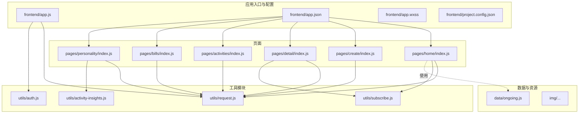

图表来源
- [frontend/app.js:1-46](file://frontend/app.js#L1-L46)
- [frontend/app.json:1-30](file://frontend/app.json#L1-L30)
- [frontend/utils/request.js:1-107](file://frontend/utils/request.js#L1-L107)
- [frontend/utils/auth.js:1-56](file://frontend/utils/auth.js#L1-L56)
- [frontend/utils/subscribe.js:1-31](file://frontend/utils/subscribe.js#L1-L31)
- [frontend/pages/home/index.js:1-219](file://frontend/pages/home/index.js#L1-L219)
- [frontend/pages/create/index.js:1-370](file://frontend/pages/create/index.js#L1-L370)
- [frontend/pages/detail/index.js:1-291](file://frontend/pages/detail/index.js#L1-L291)
- [frontend/pages/activities/index.js:1-206](file://frontend/pages/activities/index.js#L1-L206)
- [frontend/pages/bills/index.js:1-184](file://frontend/pages/bills/index.js#L1-L184)
- [frontend/pages/personality/index.js:1-128](file://frontend/pages/personality/index.js#L1-L128)
- [frontend/utils/activity-insights.js:1-418](file://frontend/utils/activity-insights.js#L1-L418)
- [frontend/data/ongoing.js:1-37](file://frontend/data/ongoing.js#L1-L37)

章节来源
- [frontend/app.json:1-30](file://frontend/app.json#L1-L30)
- [frontend/project.config.json:1-25](file://frontend/project.config.json#L1-L25)

## 核心组件
- 应用级状态与生命周期
  - 全局数据：品牌名、用户信息、令牌
  - 生命周期：onLaunch 同步登录态；hasLoginState 判定；loginWithConfirm 登录；logout 清理
- 工具模块
  - HTTP 请求封装：环境切换、基础 URL、鉴权头、错误处理与自动登出
  - 用户认证：微信登录、用户资料合并、本地缓存
  - 订阅消息：首次引导授权、权限记录与结果缓存
- 页面组件
  - 首页：静默登录、活动列表、导航
  - 活动档案：筛选、排序、摘要统计
  - 创建/编辑：类型规则、模式限制、位置必填、提交校验
  - 活动详情：成员刷新定时器、邀请入局、取消活动
  - 账单：记一笔、结束活动、汇总展示
  - 个人画像：雷达图、热力周期、分享

章节来源
- [frontend/app.js:1-46](file://frontend/app.js#L1-L46)
- [frontend/utils/request.js:1-107](file://frontend/utils/request.js#L1-L107)
- [frontend/utils/auth.js:1-56](file://frontend/utils/auth.js#L1-L56)
- [frontend/utils/subscribe.js:1-31](file://frontend/utils/subscribe.js#L1-L31)

## 架构总览
小程序前端以“页面 + 工具模块 + 应用级状态”三层协作：页面负责视图与交互，工具模块抽象网络与业务通用能力，应用级状态统一登录态与全局 UI 配置。

```mermaid
graph TB
APP["App 全局状态<br/>登录态同步/清理"] --> PAGES["页面层<br/>Home/Activities/Create/Detail/Bills/Personality"]
UTILS["工具层<br/>request/auth/subscribe"] --> PAGES
BACKEND["后端 API<br/>/api/..."] <- --> UTILS
WX["微信平台 API<br/>wx.login/wx.request/..."] --> UTILS
```

图表来源
- [frontend/app.js:1-46](file://frontend/app.js#L1-L46)
- [frontend/utils/request.js:1-107](file://frontend/utils/request.js#L1-L107)
- [frontend/utils/auth.js:1-56](file://frontend/utils/auth.js#L1-L56)
- [frontend/utils/subscribe.js:1-31](file://frontend/utils/subscribe.js#L1-L31)

## 详细组件分析

### 应用级状态与生命周期（App）
- 职责
  - 初始化全局数据
  - onLaunch 同步登录态（读取本地缓存 token/user）
  - 提供 hasLoginState、loginWithConfirm、logout
- 关键点
  - 登录态变更后同步更新 globalData
  - 登录成功后写入 storage 并合并用户资料
  - 鉴权失败时统一清理本地与全局状态

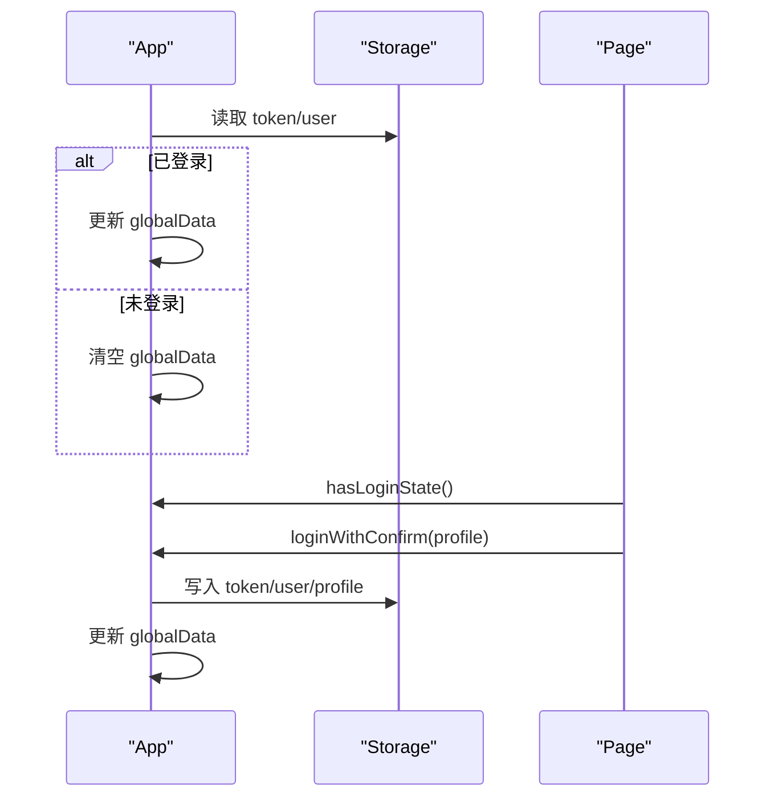

图表来源
- [frontend/app.js:14-45](file://frontend/app.js#L14-L45)

章节来源
- [frontend/app.js:1-46](file://frontend/app.js#L1-L46)

### HTTP 请求封装（request）
- 环境与基础 URL
  - 支持 local/prod 两套基地址，支持自定义覆盖
  - 通过 storage 键控制环境与自定义基地址
- 鉴权与错误处理
  - 自动附加 Authorization 头（Bearer token）
  - 对 401/403 触发 clearAuthState（清理 storage 并调用 App.logout）
  - 统一返回 data.data 或抛出带 statusCode/body 的错误
- 使用建议
  - 仅在需要鉴权的场景传 auth: true
  - 在拦截到鉴权错误时提示用户并引导重新登录

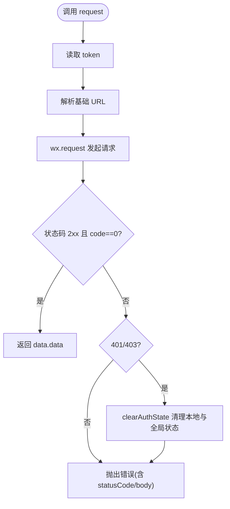

图表来源
- [frontend/utils/request.js:50-95](file://frontend/utils/request.js#L50-L95)

章节来源
- [frontend/utils/request.js:1-107](file://frontend/utils/request.js#L1-L107)

### 用户认证（auth）
- 流程
  - wx.login 获取临时 code
  - 调用后端 /api/auth/wechat-login，携带 code、昵称、头像、phoneCode
  - 成功后写入 token、user、profile，并返回合并后的用户对象
- 辅助
  - isRemoteAvatarUrl 判断头像是否远程链接
- 注意
  - 若后端返回失败或网络异常，向上抛错由调用方处理

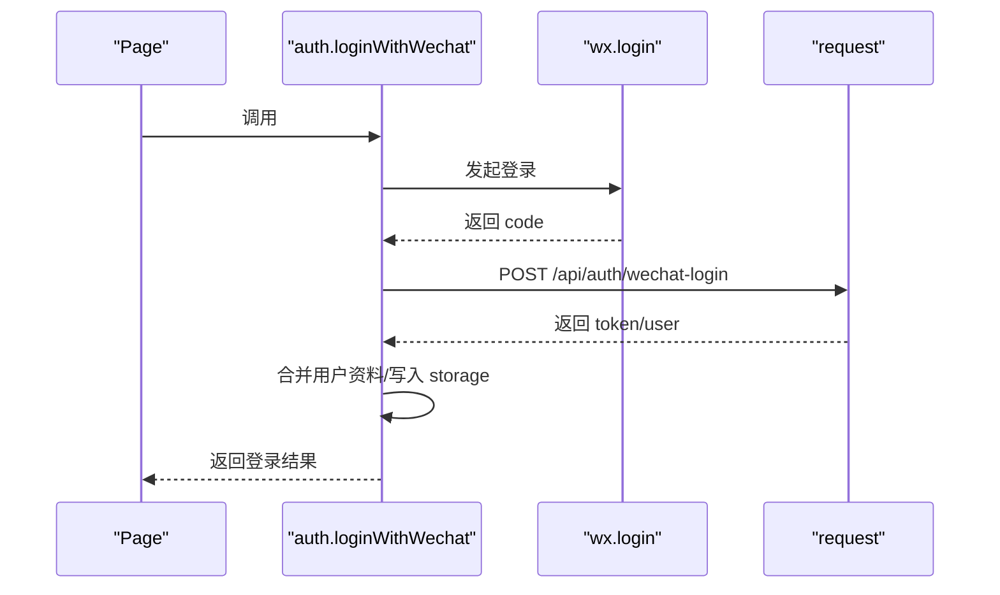

图表来源
- [frontend/utils/auth.js:3-48](file://frontend/utils/auth.js#L3-L48)

章节来源
- [frontend/utils/auth.js:1-56](file://frontend/utils/auth.js#L1-L56)

### 微信消息订阅（subscribe）
- 功能
  - 首次引导用户授权订阅模板消息
  - 缓存模板 ID、授权提示标记、授权结果或错误
- 行为
  - 若无模板 ID 或已提示过则跳过
  - 授权成功/失败均写入 storage 并返回结果
- 使用
  - 在登录确认与接受邀请前调用，提升后续通知体验

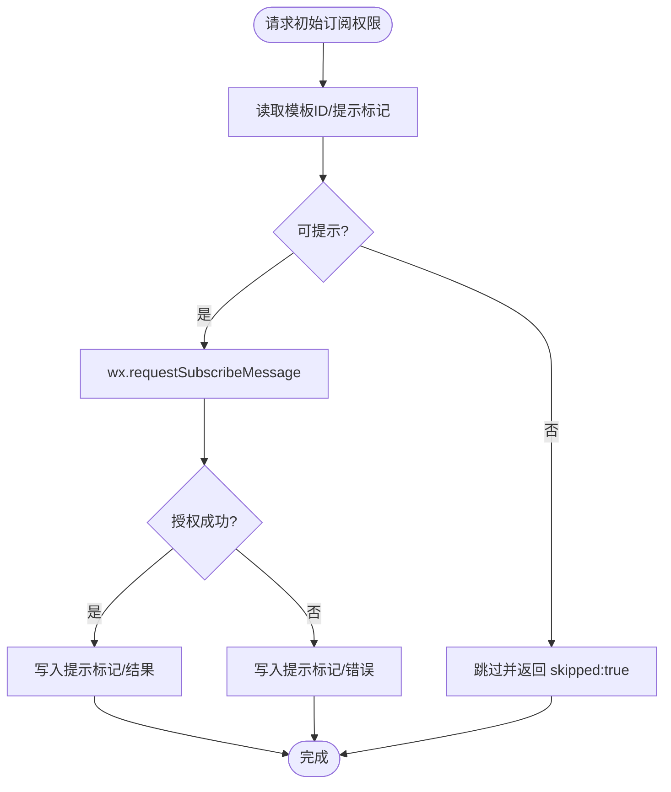

图表来源
- [frontend/utils/subscribe.js:3-27](file://frontend/utils/subscribe.js#L3-L27)

章节来源
- [frontend/utils/subscribe.js:1-31](file://frontend/utils/subscribe.js#L1-L31)

### 首页（home）
- 能力
  - 静默登录：若本地存在 profile 且未尝试过静默登录，则自动登录并加载活动
  - 展示进行中的活动卡片，支持跳转详情、创建、活动档案、个人画像、账单
  - 登录态过期时弹窗提示并引导重新确认
- 数据绑定
  - ongoingItems 映射后端列表字段，包含标签、标题、模式、时间、地点、人数、成员
- 交互
  - confirmLogin 调用订阅授权与登录确认，随后加载活动并消费待处理邀请路径

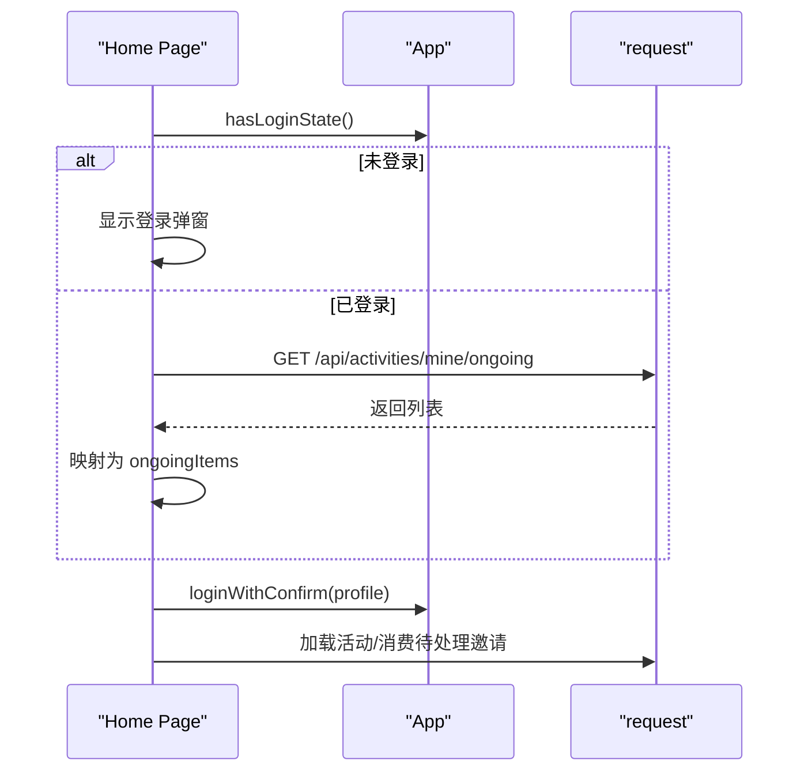

图表来源
- [frontend/pages/home/index.js:14-85](file://frontend/pages/home/index.js#L14-L85)

章节来源
- [frontend/pages/home/index.js:1-219](file://frontend/pages/home/index.js#L1-L219)

### 活动档案（activities）
- 能力
  - 加载个人活动归档列表，映射角色、状态、模式、时间等字段
  - 多维筛选：角色（全部/我发起/我参加）、时间顺序（最近/最早）、状态（全部/已结束/已取消/进行中）、日期范围、关键词
  - 排序与摘要统计
- 交互
  - 打开详情、清除日期范围、输入关键词、选择过滤项

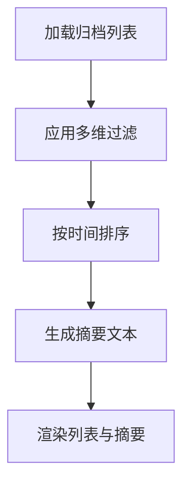

图表来源
- [frontend/pages/activities/index.js:41-159](file://frontend/pages/activities/index.js#L41-L159)

章节来源
- [frontend/pages/activities/index.js:1-206](file://frontend/pages/activities/index.js#L1-L206)

### 创建/编辑活动（create）
- 能力
  - 类型规则：不同活动类型强制线下、要求地点、预设标题
  - 模式限制：线上/线下切换时根据类型规则约束
  - 位置选择：wx.chooseLocation 回填名称与地址
  - 提交校验：时间必填、标题必填、线下必填地点、类型规则校验
- 生命周期
  - onLoad：判断登录态；编辑模式加载详情并回填
  - submit：构造 payload 调用后端创建/更新，成功后跳转详情
- 错误处理
  - 解析后端错误与网络错误，提示友好信息

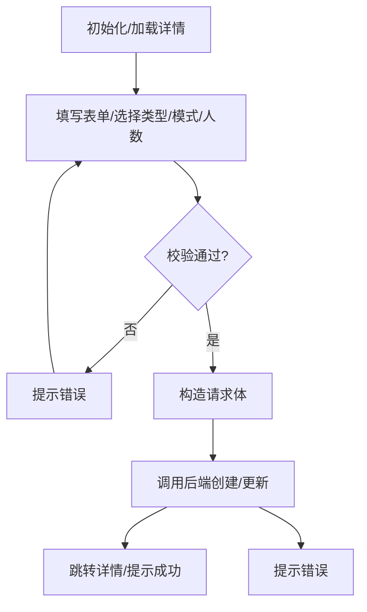

图表来源
- [frontend/pages/create/index.js:39-109](file://frontend/pages/create/index.js#L39-L109)
- [frontend/pages/create/index.js:206-282](file://frontend/pages/create/index.js#L206-L282)

章节来源
- [frontend/pages/create/index.js:1-370](file://frontend/pages/create/index.js#L1-L370)

### 活动详情（detail）
- 能力
  - 加载详情，识别是否发起人、能否入局、是否已入局
  - 成员列表定时刷新（10 秒），避免频繁请求
  - 邀请入局/婉拒、分享、编辑、跳转账单、取消活动
- 生命周期
  - onShow/onHide/onUnload 管理定时器启停
  - onLoad 读取邀请来源，必要时缓存待处理路径
- 安全
  - 登录态过期时重定向首页

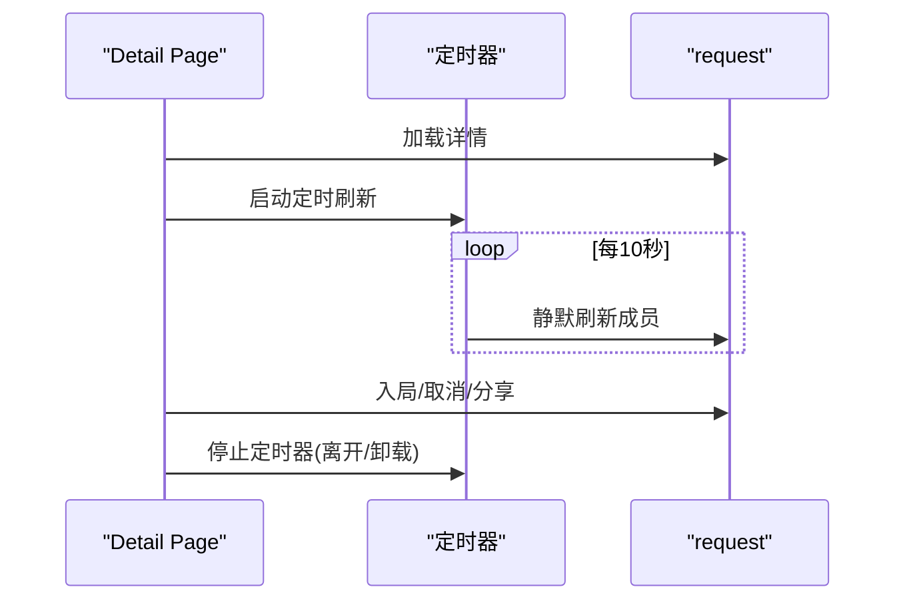

图表来源
- [frontend/pages/detail/index.js:30-131](file://frontend/pages/detail/index.js#L30-L131)
- [frontend/pages/detail/index.js:190-205](file://frontend/pages/detail/index.js#L190-L205)

章节来源
- [frontend/pages/detail/index.js:1-291](file://frontend/pages/detail/index.js#L1-L291)

### 账单管理（bills）
- 能力
  - 加载活动账单汇总：总金额、人均、记录数、结算项
  - 记一笔：校验事项与金额，提交后刷新汇总
  - 结束活动：弹窗确认后调用后端结束并刷新
- 交互
  - 输入框绑定、按钮禁用态、成功提示
- 数据映射
  - 将后端金额（分）转换为元字符串，结算项标注“不用转”

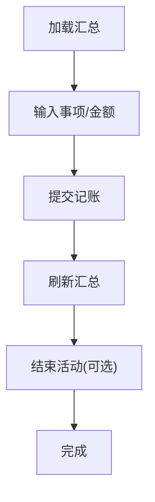

图表来源
- [frontend/pages/bills/index.js:12-49](file://frontend/pages/bills/index.js#L12-L49)
- [frontend/pages/bills/index.js:59-96](file://frontend/pages/bills/index.js#L59-L96)

章节来源
- [frontend/pages/bills/index.js:1-184](file://frontend/pages/bills/index.js#L1-L184)

### 个人画像（personality）
- 能力
  - 加载个人活动洞察报告：雷达图、财务周期热力、荣誉与评语
  - 切换财务周期（日/周/月/季/年）动态更新热力桶
  - 分享卡片、海报页导航
- 数据映射
  - 构建雷达多边形坐标、填充指标轴类名、生成热力桶
- 示例数据
  - 可使用内置种子数据生成报告，便于演示与测试

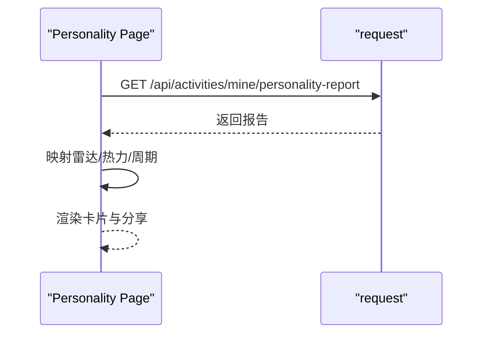

图表来源
- [frontend/pages/personality/index.js:20-50](file://frontend/pages/personality/index.js#L20-L50)

章节来源
- [frontend/pages/personality/index.js:1-128](file://frontend/pages/personality/index.js#L1-L128)
- [frontend/utils/activity-insights.js:130-184](file://frontend/utils/activity-insights.js#L130-L184)

## 依赖分析
- 页面到工具模块
  - 首页/详情/活动档案/账单/个人画像均依赖 request
  - 首页/详情依赖 subscribe
  - 个人画像依赖 activity-insights
- 页面到应用级状态
  - 所有页面通过 getApp() 访问全局登录态与登录流程
- 配置与资源
  - app.json 控制页面注册、导航栏与权限
  - app.wxss 定义全局样式与卡片样式
  - project.config.json 控制编译与打包设置

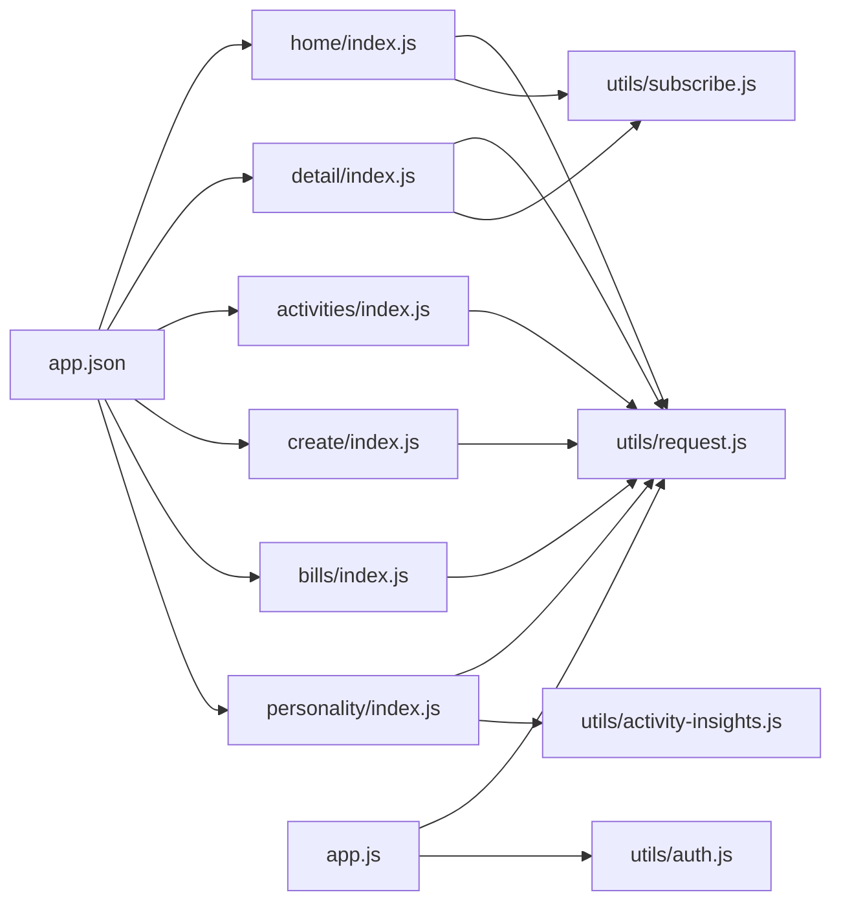

图表来源
- [frontend/pages/home/index.js:1-219](file://frontend/pages/home/index.js#L1-L219)
- [frontend/pages/detail/index.js:1-291](file://frontend/pages/detail/index.js#L1-L291)
- [frontend/pages/activities/index.js:1-206](file://frontend/pages/activities/index.js#L1-L206)
- [frontend/pages/create/index.js:1-370](file://frontend/pages/create/index.js#L1-L370)
- [frontend/pages/bills/index.js:1-184](file://frontend/pages/bills/index.js#L1-L184)
- [frontend/pages/personality/index.js:1-128](file://frontend/pages/personality/index.js#L1-L128)
- [frontend/utils/request.js:1-107](file://frontend/utils/request.js#L1-L107)
- [frontend/utils/subscribe.js:1-31](file://frontend/utils/subscribe.js#L1-L31)
- [frontend/utils/auth.js:1-56](file://frontend/utils/auth.js#L1-L56)
- [frontend/utils/activity-insights.js:1-418](file://frontend/utils/activity-insights.js#L1-L418)
- [frontend/app.js:1-46](file://frontend/app.js#L1-L46)
- [frontend/app.json:1-30](file://frontend/app.json#L1-L30)

章节来源
- [frontend/app.json:1-30](file://frontend/app.json#L1-L30)
- [frontend/project.config.json:1-25](file://frontend/project.config.json#L1-L25)

## 性能考虑
- 请求与缓存
  - 合理使用本地存储（storage）缓存 token、user、profile，减少重复登录
  - 在首页与详情页使用静默登录与条件加载，避免不必要的网络请求
- 定时刷新
  - 成员列表定时器（10 秒）需在页面隐藏/卸载时及时清理，防止后台持续请求
- UI 渲染
  - 使用全局样式与卡片样式统一视觉，减少重复定义
  - 列表渲染时尽量扁平化数据结构，减少嵌套层级
- 编译与打包
  - 开启压缩与 WXML 最小化，减少包体积
  - 合理拆分页面，利用懒加载策略

## 故障排查指南
- 登录态失效
  - 现象：接口返回 401/403
  - 处理：调用 clearAuthState 清理本地与全局状态，提示用户重新登录
- 网络异常
  - 现象：请求失败或后端未启动
  - 处理：捕获错误并提示“后端没启动，先开服务”
- 订阅授权失败
  - 现象：首次订阅授权弹窗失败或被拒绝
  - 处理：记录错误并允许用户稍后手动触发
- 位置选择失败
  - 现象：wx.chooseLocation 返回 cancel 或失败
  - 处理：区分取消与错误，分别提示或忽略
- 账单金额格式
  - 现象：输入非数字或负数
  - 处理：解析为分时校验有效性，提示“金额填对一点”

章节来源
- [frontend/utils/request.js:82-95](file://frontend/utils/request.js#L82-L95)
- [frontend/pages/create/index.js:319-336](file://frontend/pages/create/index.js#L319-L336)
- [frontend/pages/detail/index.js:141-166](file://frontend/pages/detail/index.js#L141-L166)
- [frontend/pages/bills/index.js:168-174](file://frontend/pages/bills/index.js#L168-L174)

## 结论
PlayMiniPro 前端以清晰的分层与模块化设计实现了从登录态管理、网络请求、订阅授权到页面交互的完整闭环。通过统一的工具模块与全局状态管理，页面职责明确、可维护性强。建议在后续迭代中进一步完善错误上报、埋点与国际化支持，持续优化用户体验与性能表现。

## 附录
- 样式规范
  - 全局背景渐变与字体族统一
  - 卡片圆角与阴影统一风格
  - 主按钮与幽灵按钮的尺寸与配色
- 响应式布局
  - 使用 rpx 单位与栅格系统适配多设备
  - 图片与图标采用高清资源，注意尺寸与比例
- 调试与发布
  - 使用开发者工具断点与网络面板定位问题
  - 通过 project.config.json 控制编译选项与打包策略

章节来源
- [frontend/app.wxss:1-125](file://frontend/app.wxss#L1-L125)
- [frontend/project.config.json:1-25](file://frontend/project.config.json#L1-L25)