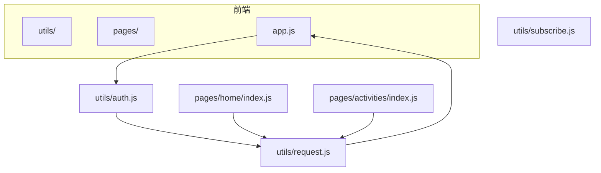
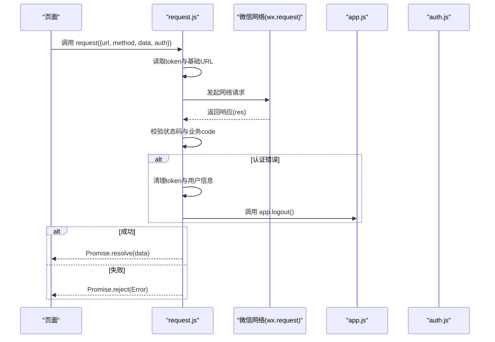
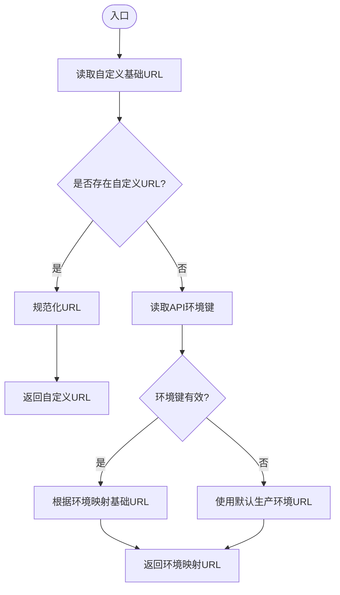
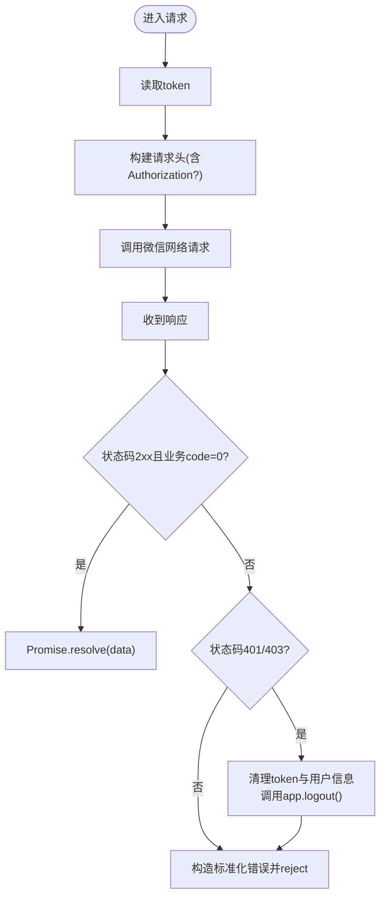
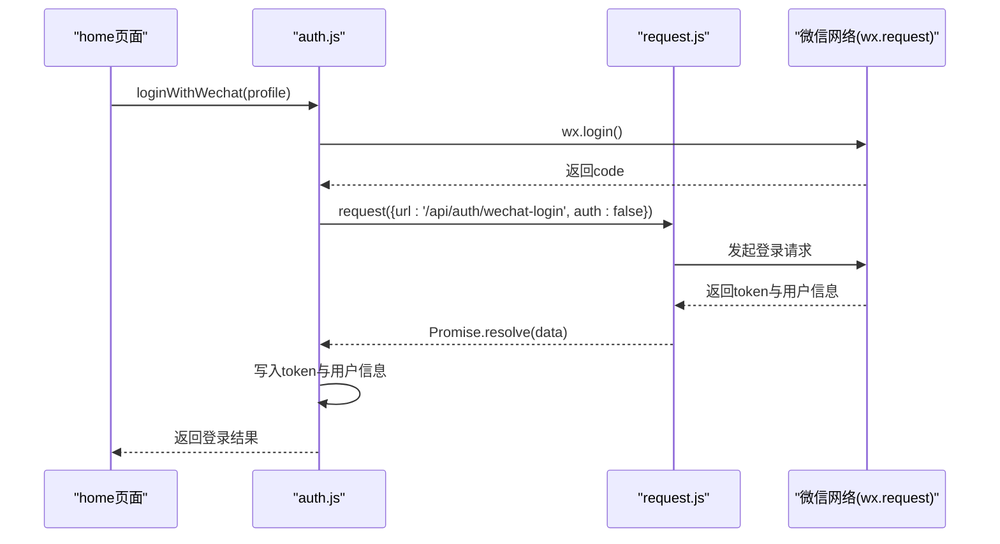
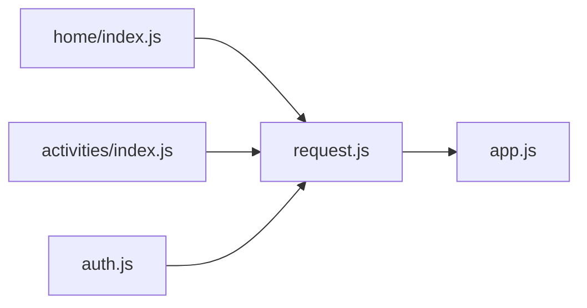

# HTTP请求封装模块

<cite>
**本文引用的文件**
- [request.js](file://frontend/utils/request.js)
- [auth.js](file://frontend/utils/auth.js)
- [home/index.js](file://frontend/pages/home/index.js)
- [activities/index.js](file://frontend/pages/activities/index.js)
- [app.js](file://frontend/app.js)
- [subscribe.js](file://frontend/utils/subscribe.js)
</cite>

## 目录
1. [简介](#简介)
2. [项目结构](#项目结构)
3. [核心组件](#核心组件)
4. [架构总览](#架构总览)
5. [详细组件分析](#详细组件分析)
6. [依赖关系分析](#依赖关系分析)
7. [性能考虑](#性能考虑)
8. [故障排查指南](#故障排查指南)
9. [结论](#结论)
10. [附录](#附录)

## 简介
本文件为前端HTTP请求封装模块request.js的详细开发文档，聚焦以下主题：
- 基础URL配置管理与环境切换机制
- 请求头处理（含token自动添加）
- 响应数据格式化与错误标准化
- 请求拦截器工作原理（认证失效清理）
- 开发与生产环境URL切换逻辑
- 自定义基础URL设置与清除功能
- 请求失败处理策略与Promise封装模式
- 实际使用示例、最佳实践与常见问题解决方案

## 项目结构
该模块位于前端utils目录下，作为统一的网络层封装，供页面与业务模块调用；同时配合认证模块auth.js完成登录态同步与token持久化。

图表来源
- [request.js:1-107](file://frontend/utils/request.js#L1-L107)
- [auth.js:1-56](file://frontend/utils/auth.js#L1-L56)
- [home/index.js:1-219](file://frontend/pages/home/index.js#L1-L219)
- [activities/index.js:1-206](file://frontend/pages/activities/index.js#L1-L206)
- [app.js:1-46](file://frontend/app.js#L1-L46)

章节来源
- [request.js:1-107](file://frontend/utils/request.js#L1-L107)
- [auth.js:1-56](file://frontend/utils/auth.js#L1-L56)
- [home/index.js:1-219](file://frontend/pages/home/index.js#L1-L219)
- [activities/index.js:1-206](file://frontend/pages/activities/index.js#L1-L206)
- [app.js:1-46](file://frontend/app.js#L1-L46)

## 核心组件
- 基础URL映射与环境键值：通过常量定义本地与生产环境的基础URL，并使用存储键维护当前API环境。
- URL解析与优先级：支持自定义基础URL优先于环境映射，且对输入进行规范化处理。
- 请求封装：基于微信原生wx.request，统一封装Promise返回、响应体校验、错误对象构造与认证失效清理。
- 认证拦截：当响应状态码为401或403时，自动清理本地token与用户信息并触发应用logout回调。
- 工具函数：提供获取/设置/清除自定义基础URL、获取当前环境、判断认证过期错误等能力。

章节来源
- [request.js:1-107](file://frontend/utils/request.js#L1-L107)

## 架构总览
请求流程从页面调用开始，经由request.js封装，最终落到微信原生网络API。认证态与登录流程由auth.js与app.js协同完成。

图表来源
- [request.js:50-95](file://frontend/utils/request.js#L50-L95)
- [auth.js:3-48](file://frontend/utils/auth.js#L3-L48)
- [app.js:40-45](file://frontend/app.js#L40-L45)

## 详细组件分析

### 基础URL配置与环境切换
- 环境键与默认值：通过存储键维护当前API环境，若未设置则默认使用生产环境。
- 自定义基础URL优先级：若设置了自定义基础URL，则优先使用该URL；否则回退到环境映射。
- URL规范化：去除末尾斜杠、空白字符，确保拼接稳定。

图表来源
- [request.js:15-27](file://frontend/utils/request.js#L15-L27)

章节来源
- [request.js:1-48](file://frontend/utils/request.js#L1-L48)

### 请求头处理与认证拦截
- token自动添加：当auth参数为真且存在token时，在请求头中附加Authorization: Bearer <token>。
- 错误状态处理：对非2xx且业务code不为0的情况，构造标准化错误对象，包含状态码与原始响应体。
- 认证失效清理：当响应状态码为401或403时，清理token与用户信息，并调用app.logout()。

图表来源
- [request.js:50-95](file://frontend/utils/request.js#L50-L95)

章节来源
- [request.js:50-95](file://frontend/utils/request.js#L50-L95)

### 响应数据格式化与错误标准化
- 成功路径：仅返回业务数据主体，隐藏HTTP细节与冗余字段。
- 失败路径：构造标准错误对象，携带状态码与原始响应体，便于上层统一处理。
- 认证过期：通过工具函数isAuthExpiredError识别，便于页面弹窗提示与引导重新登录。

章节来源
- [request.js:60-95](file://frontend/utils/request.js#L60-L95)

### 登录与认证集成
- 微信登录：auth.js通过wx.login获取临时code，再调用后端接口换取token与用户信息。
- 本地存储：将token与用户信息写入本地缓存，并同步到全局数据。
- 页面联动：home页在加载数据时捕获认证过期错误，引导用户重新确认登录。

图表来源
- [auth.js:3-48](file://frontend/utils/auth.js#L3-L48)
- [request.js:50-80](file://frontend/utils/request.js#L50-L80)
- [home/index.js:29-40](file://frontend/pages/home/index.js#L29-L40)

章节来源
- [auth.js:1-56](file://frontend/utils/auth.js#L1-L56)
- [home/index.js:1-219](file://frontend/pages/home/index.js#L1-L219)

### 页面使用示例与最佳实践
- 基本请求：直接传入相对路径URL，自动拼接基础URL与Authorization头。
- 认证过期处理：在catch中判断isAuthExpiredError，弹窗提示并引导重新登录。
- 非认证场景：如登录接口，需将auth设为false，避免附加Authorization头。

章节来源
- [home/index.js:57-85](file://frontend/pages/home/index.js#L57-L85)
- [activities/index.js:49-66](file://frontend/pages/activities/index.js#L49-L66)
- [auth.js:13-23](file://frontend/utils/auth.js#L13-L23)

## 依赖关系分析
- request.js对外部依赖较少，主要依赖微信小程序API与本地存储。
- 与auth.js形成协作：登录成功后写入token，后续请求自动带上Authorization。
- 与app.js形成状态同步：app.js负责全局登录态同步与logout清理。

图表来源
- [home/index.js](file://frontend/pages/home/index.js#L1)
- [activities/index.js](file://frontend/pages/activities/index.js#L1)
- [auth.js](file://frontend/utils/auth.js#L1)
- [request.js:1-107](file://frontend/utils/request.js#L1-L107)
- [app.js:1-46](file://frontend/app.js#L1-L46)

章节来源
- [request.js:1-107](file://frontend/utils/request.js#L1-L107)
- [auth.js:1-56](file://frontend/utils/auth.js#L1-L56)
- [home/index.js:1-219](file://frontend/pages/home/index.js#L1-L219)
- [activities/index.js:1-206](file://frontend/pages/activities/index.js#L1-L206)
- [app.js:1-46](file://frontend/app.js#L1-L46)

## 性能考虑
- 请求头最小化：仅在需要认证时附加Authorization，减少不必要的头部开销。
- URL规范化：避免重复拼接导致的字符串处理成本。
- 统一错误处理：减少上层重复判断逻辑，降低分支复杂度。
- 建议优化点：
  - 对频繁请求可引入轻量缓存（按URL与查询参数组合），避免重复请求。
  - 在高并发场景下，考虑统一超时与重试策略（需结合业务特性）。
  - 对大响应体可做分页或懒加载，减少首屏压力。

## 故障排查指南
- 无法连接后端
  - 检查是否正确设置API环境键或自定义基础URL。
  - 确认URL末尾无多余斜杠，避免拼接异常。
- 认证失败或频繁掉线
  - 检查token是否被清理（401/403会触发清理）。
  - 确认页面是否正确捕获isAuthExpiredError并引导重新登录。
- 登录接口报错
  - 确保登录请求auth=false，避免附加Authorization导致鉴权失败。
- 网络错误
  - 使用fail回调与错误对象中的状态码与响应体定位问题。

章节来源
- [request.js:15-48](file://frontend/utils/request.js#L15-L48)
- [request.js:50-95](file://frontend/utils/request.js#L50-L95)
- [home/index.js:74-84](file://frontend/pages/home/index.js#L74-L84)
- [activities/index.js:57-66](file://frontend/pages/activities/index.js#L57-L66)

## 结论
该请求封装模块以简洁的API与清晰的职责划分，实现了基础URL管理、环境切换、认证拦截与错误标准化。配合auth.js与app.js，形成了完整的登录态生命周期管理。建议在现有基础上增加缓存与重试策略，进一步提升稳定性与性能。

## 附录

### API参考
- request(options)
  - 参数
    - url: 相对路径
    - method: HTTP方法，默认GET
    - data: 请求体
    - auth: 是否自动附加Authorization，默认true
  - 返回: Promise，成功解析为业务数据主体，失败抛出标准化错误
- getBaseUrl(): 获取当前基础URL
- getApiEnv(): 获取当前API环境键
- setApiEnv(env): 设置API环境键
- setCustomBaseUrl(url): 设置自定义基础URL
- clearCustomBaseUrl(): 清除自定义基础URL
- isAuthExpiredError(error): 判断是否为认证过期错误

章节来源
- [request.js:50-107](file://frontend/utils/request.js#L50-L107)