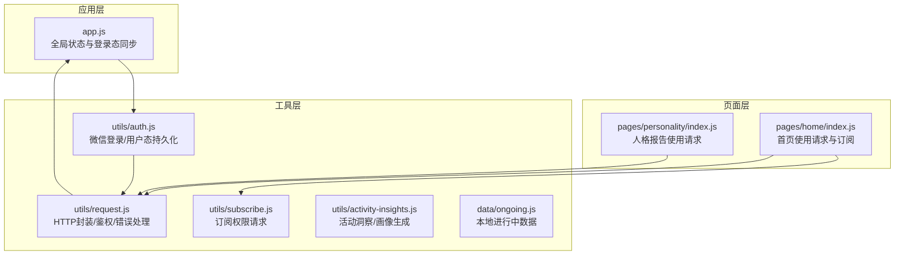
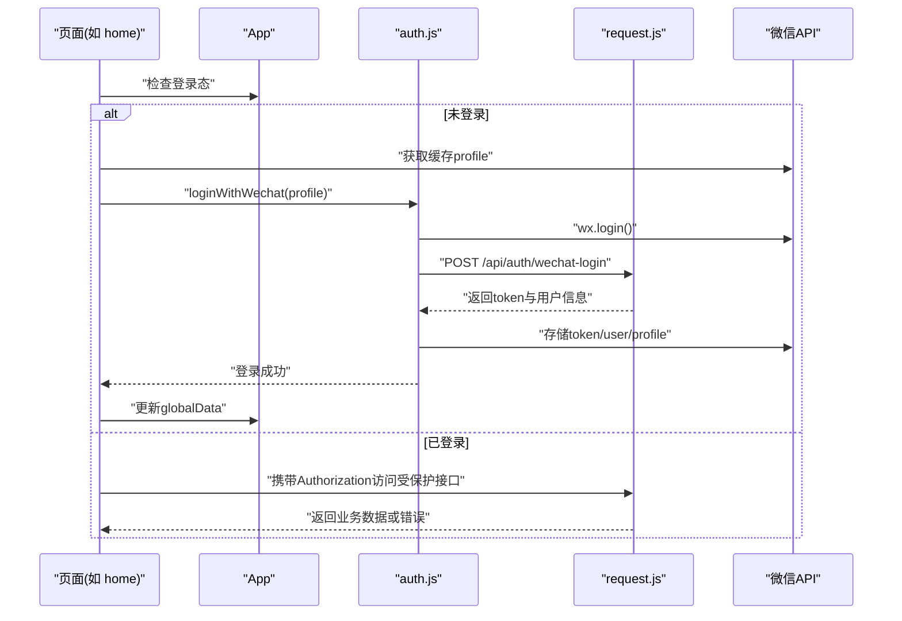
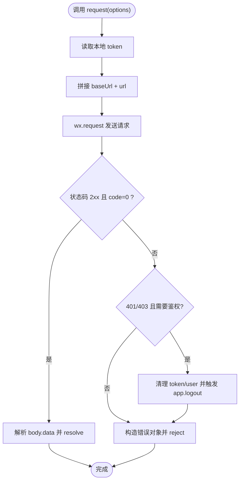
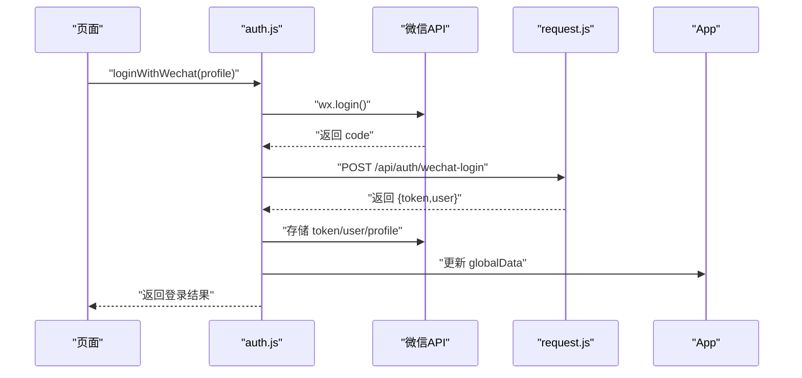
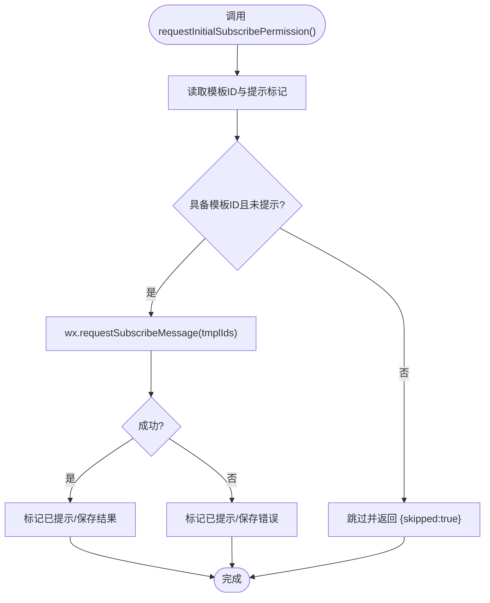
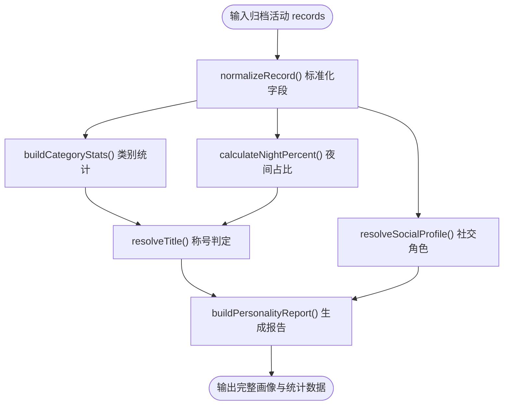
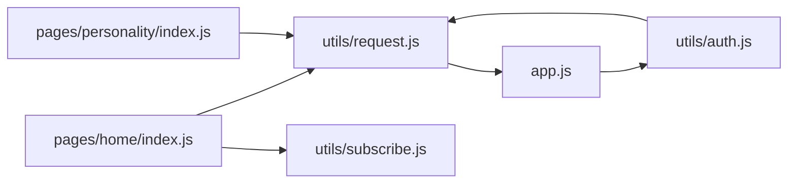

# 工具模块开发

<cite>
**本文引用的文件**
- [frontend/utils/request.js](file://frontend/utils/request.js)
- [frontend/utils/auth.js](file://frontend/utils/auth.js)
- [frontend/utils/subscribe.js](file://frontend/utils/subscribe.js)
- [frontend/utils/activity-insights.js](file://frontend/utils/activity-insights.js)
- [frontend/data/ongoing.js](file://frontend/data/ongoing.js)
- [frontend/app.js](file://frontend/app.js)
- [frontend/pages/home/index.js](file://frontend/pages/home/index.js)
- [frontend/pages/personality/index.js](file://frontend/pages/personality/index.js)
</cite>

## 目录
1. [简介](#简介)
2. [项目结构](#项目结构)
3. [核心组件](#核心组件)
4. [架构概览](#架构概览)
5. [详细组件分析](#详细组件分析)
6. [依赖分析](#依赖分析)
7. [性能考虑](#性能考虑)
8. [故障排查指南](#故障排查指南)
9. [结论](#结论)
10. [附录](#附录)

## 简介
本文件面向PlayMiniPro前端工具模块开发，系统性梳理以下模块的设计与实现要点：
- HTTP请求封装模块：request.js（请求拦截、响应处理、错误统一、鉴权清理）
- 用户认证模块：auth.js（微信登录、token与用户态持久化）
- 微信消息订阅模块：subscribe.js（模板消息订阅、权限提示与结果存储）
- 活动洞察模块：activity-insights.js（统计计算、画像生成、趋势与可视化辅助）
- 本地数据模块：ongoing.js（进行中活动的本地数据管理）

同时给出模块化开发最佳实践、代码复用策略与测试方法建议。

## 项目结构
前端工具模块位于frontend/utils与frontend/data目录，配合全局应用入口app.js以及页面级使用示例pages/home/index.js、pages/personality/index.js，形成“工具层-页面层-应用层”的清晰分层。

图示来源
- [frontend/app.js:1-46](file://frontend/app.js#L1-L46)
- [frontend/pages/home/index.js:1-219](file://frontend/pages/home/index.js#L1-L219)
- [frontend/pages/personality/index.js:1-128](file://frontend/pages/personality/index.js#L1-L128)
- [frontend/utils/request.js:1-107](file://frontend/utils/request.js#L1-L107)
- [frontend/utils/auth.js:1-56](file://frontend/utils/auth.js#L1-L56)
- [frontend/utils/subscribe.js:1-31](file://frontend/utils/subscribe.js#L1-L31)
- [frontend/utils/activity-insights.js:1-418](file://frontend/utils/activity-insights.js#L1-L418)
- [frontend/data/ongoing.js:1-37](file://frontend/data/ongoing.js#L1-L37)

章节来源
- [frontend/app.js:1-46](file://frontend/app.js#L1-L46)
- [frontend/pages/home/index.js:1-219](file://frontend/pages/home/index.js#L1-L219)
- [frontend/pages/personality/index.js:1-128](file://frontend/pages/personality/index.js#L1-L128)

## 核心组件
- request.js：统一HTTP请求封装，支持环境切换、自动注入Authorization头、统一错误处理与鉴权失效清理。
- auth.js：基于微信登录流程的用户认证，负责token与用户信息的存储与更新。
- subscribe.js：微信订阅消息权限请求，记录权限提示与结果。
- activity-insights.js：活动归档数据的统计与画像生成，包含分类统计、夜间偏好、社交角色、动物形象等维度。
- ongoing.js：本地进行中活动数据，提供按id查询的简单API。

章节来源
- [frontend/utils/request.js:1-107](file://frontend/utils/request.js#L1-L107)
- [frontend/utils/auth.js:1-56](file://frontend/utils/auth.js#L1-L56)
- [frontend/utils/subscribe.js:1-31](file://frontend/utils/subscribe.js#L1-L31)
- [frontend/utils/activity-insights.js:1-418](file://frontend/utils/activity-insights.js#L1-L418)
- [frontend/data/ongoing.js:1-37](file://frontend/data/ongoing.js#L1-L37)

## 架构概览
工具模块通过模块化导出供页面与应用层调用，遵循“单一职责、可复用、可测试”的原则。请求模块承担网络层抽象，认证模块负责登录态管理，订阅模块处理微信权限，洞察模块提供数据分析与可视化辅助数据，本地数据模块提供轻量级静态数据。

图示来源
- [frontend/pages/home/index.js:1-219](file://frontend/pages/home/index.js#L1-L219)
- [frontend/app.js:1-46](file://frontend/app.js#L1-L46)
- [frontend/utils/auth.js:1-56](file://frontend/utils/auth.js#L1-L56)
- [frontend/utils/request.js:1-107](file://frontend/utils/request.js#L1-L107)

## 详细组件分析

### HTTP请求封装模块 request.js
- 基础URL与环境管理
  - 支持本地与生产两套基础地址映射，可通过存储键切换或自定义基础URL。
  - 提供获取/设置环境与自定义基础URL的API。
- 请求拦截与鉴权
  - 自动从本地存储读取token并在请求头注入Authorization。
  - 对于需要鉴权的请求，若响应状态码为401/403，触发鉴权状态清理。
- 统一响应与错误处理
  - 成功条件：状态码2xx且业务code为0；否则构造包含状态码与业务体的错误对象。
  - 失败回调直接透传给Promise reject。
- 导出能力
  - request、BASE_URL_MAP、DEFAULT_API_ENV、getBaseUrl/getApiEnv/setApiEnv/setCustomBaseUrl/clearCustomBaseUrl/isAuthExpiredError。

图示来源
- [frontend/utils/request.js:50-95](file://frontend/utils/request.js#L50-L95)

章节来源
- [frontend/utils/request.js:1-107](file://frontend/utils/request.js#L1-L107)

### 用户认证模块 auth.js
- 登录流程
  - 调用微信登录获取code，随后向后端发起微信登录请求，携带昵称、头像与手机号码code。
  - 后端返回token与用户信息后，写入本地存储，并同步到App全局状态。
- 头像策略
  - 仅当头像URL为远程链接时才保存，避免本地图片路径污染。
- 导出能力
  - loginWithWechat(profile)。

图示来源
- [frontend/utils/auth.js:1-56](file://frontend/utils/auth.js#L1-L56)
- [frontend/utils/request.js:50-80](file://frontend/utils/request.js#L50-L80)
- [frontend/app.js:14-45](file://frontend/app.js#L14-L45)

章节来源
- [frontend/utils/auth.js:1-56](file://frontend/utils/auth.js#L1-L56)
- [frontend/app.js:1-46](file://frontend/app.js#L1-L46)

### 微信消息订阅模块 subscribe.js
- 权限请求逻辑
  - 从本地存储读取模板ID列表与是否已提示标记；若满足条件则调用requestSubscribeMessage发起权限请求。
  - 成功与失败均会记录提示标记与结果/错误信息，避免重复弹窗。
- 导出能力
  - requestInitialSubscribePermission()。

图示来源
- [frontend/utils/subscribe.js:1-31](file://frontend/utils/subscribe.js#L1-L31)

章节来源
- [frontend/utils/subscribe.js:1-31](file://frontend/utils/subscribe.js#L1-L31)

### 活动洞察模块 activity-insights.js
- 数据来源与归一化
  - 提供种子归档活动数据，统一字段格式（含角色、状态、模式、金额等），便于后续统计。
- 统计与画像
  - 分类统计：按活动类型计数与占比。
  - 夜间偏好：统计夜间（22:00-05:00）活动占比。
  - 社交角色：根据发起/参与/拉人次数判定组织者、跟车党、社交之星等。
  - 动物形象：结合称号与社交角色、夜间占比、拉人次数生成拟人化标签。
  - 评分与排名：综合多项指标计算得分与超越百分比。
- 可视化辅助
  - 提供雷达图指标映射、多周期财务桶（日/周/月/季/年）等数据结构，供页面渲染使用。
- 导出能力
  - getActivityArchiveRecords()、buildPersonalityReport(records, nickname)。

图示来源
- [frontend/utils/activity-insights.js:130-184](file://frontend/utils/activity-insights.js#L130-L184)
- [frontend/utils/activity-insights.js:221-250](file://frontend/utils/activity-insights.js#L221-L250)
- [frontend/utils/activity-insights.js:252-292](file://frontend/utils/activity-insights.js#L252-L292)
- [frontend/utils/activity-insights.js:294-322](file://frontend/utils/activity-insights.js#L294-L322)
- [frontend/utils/activity-insights.js:324-348](file://frontend/utils/activity-insights.js#L324-L348)

章节来源
- [frontend/utils/activity-insights.js:1-418](file://frontend/utils/activity-insights.js#L1-L418)

### 本地数据模块 ongoing.js
- 数据结构
  - 提供进行中活动数组与按id查询的简单API，用于首页快速展示。
- 使用场景
  - 页面在未登录或加载期间展示本地示例数据，提升用户体验。
- 导出能力
  - ongoingItems、getOngoingItem(id)。

章节来源
- [frontend/data/ongoing.js:1-37](file://frontend/data/ongoing.js#L1-L37)

## 依赖分析
- request.js被多个页面直接依赖，作为统一网络层。
- auth.js依赖request.js以完成登录请求。
- app.js在全局层面维护登录态，并与auth.js协作。
- subscribe.js独立运行，不依赖其他工具模块。
- activity-insights.js为纯函数模块，无外部依赖。
- ongoing.js为纯数据模块，无外部依赖。

图示来源
- [frontend/pages/home/index.js:1-219](file://frontend/pages/home/index.js#L1-L219)
- [frontend/pages/personality/index.js:1-128](file://frontend/pages/personality/index.js#L1-L128)
- [frontend/utils/request.js:1-107](file://frontend/utils/request.js#L1-L107)
- [frontend/utils/auth.js:1-56](file://frontend/utils/auth.js#L1-L56)
- [frontend/app.js:1-46](file://frontend/app.js#L1-L46)
- [frontend/utils/subscribe.js:1-31](file://frontend/utils/subscribe.js#L1-L31)

章节来源
- [frontend/pages/home/index.js:1-219](file://frontend/pages/home/index.js#L1-L219)
- [frontend/pages/personality/index.js:1-128](file://frontend/pages/personality/index.js#L1-L128)
- [frontend/utils/request.js:1-107](file://frontend/utils/request.js#L1-L107)
- [frontend/utils/auth.js:1-56](file://frontend/utils/auth.js#L1-L56)
- [frontend/app.js:1-46](file://frontend/app.js#L1-L46)
- [frontend/utils/subscribe.js:1-31](file://frontend/utils/subscribe.js#L1-L31)

## 性能考虑
- 请求缓存与幂等
  - 对于只读接口，可在页面层引入轻量缓存，减少重复请求。
- 鉴权失效快速反馈
  - 通过isAuthExpiredError快速分支，避免无效重试。
- 订阅权限去抖
  - 通过本地存储标记避免重复弹窗，降低交互成本。
- 数据计算优化
  - activity-insights.js中的统计逻辑为线性复杂度，适合批量数据；如需更大规模数据，可考虑分页或服务端聚合。

## 故障排查指南
- 登录失败
  - 检查微信登录返回code是否存在，确认后端登录接口可用性。
  - 关注auth.js中对头像URL的远程校验逻辑。
- 鉴权失效
  - request.js在收到401/403时会清理本地token与user，并调用app.logout；页面应提示重新登录。
  - 在页面中捕获isAuthExpiredError并引导用户重新确认登录。
- 订阅权限异常
  - 检查本地模板ID列表与提示标记；失败时记录错误信息，避免重复弹窗。
- 数据为空或异常
  - 检查本地数据模块的id匹配逻辑与页面数据映射。

章节来源
- [frontend/utils/request.js:68-95](file://frontend/utils/request.js#L68-L95)
- [frontend/pages/home/index.js:74-84](file://frontend/pages/home/index.js#L74-L84)
- [frontend/utils/subscribe.js:13-26](file://frontend/utils/subscribe.js#L13-L26)
- [frontend/data/ongoing.js:30-32](file://frontend/data/ongoing.js#L30-L32)

## 结论
本工具模块以简洁、可复用为核心目标，通过request.js统一网络层、auth.js管理登录态、subscribe.js处理微信权限、activity-insights.js提供数据分析与可视化辅助、ongoing.js承载轻量本地数据，形成完整的前端工具链。建议在后续迭代中引入单元测试与集成测试，完善错误监控与埋点，持续优化性能与用户体验。

## 附录
- 模块化开发最佳实践
  - 单一职责：每个模块聚焦一个领域，避免交叉耦合。
  - 明确边界：通过导出稳定的API与清晰的错误语义，降低调用方心智负担。
  - 可测试性：优先使用纯函数与可注入依赖，便于编写单元测试。
- 代码复用策略
  - 将通用逻辑下沉至工具模块，页面仅做数据映射与UI交互。
  - 对重复的错误处理与鉴权分支，统一收敛到request.js。
- 测试方法
  - 单元测试：针对纯函数（如normalizeRecord、buildCategoryStats）编写用例，覆盖边界与异常。
  - 集成测试：模拟页面调用链路，验证登录、请求、鉴权清理与订阅权限的整体流程。
  - 端到端测试：在真实设备或模拟器中验证微信登录、订阅权限弹窗与页面导航。