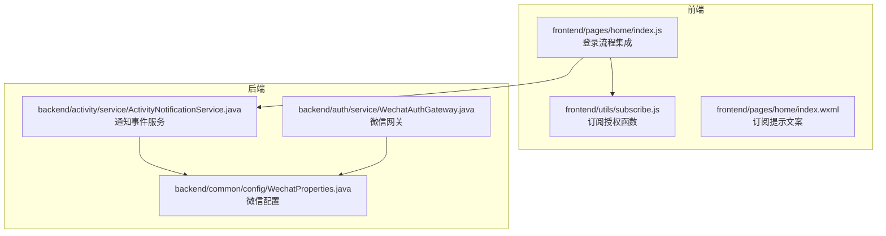
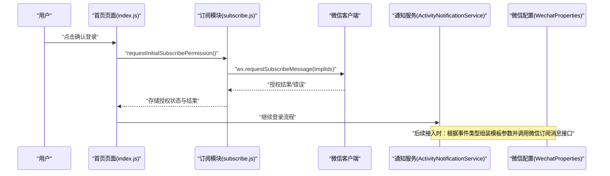
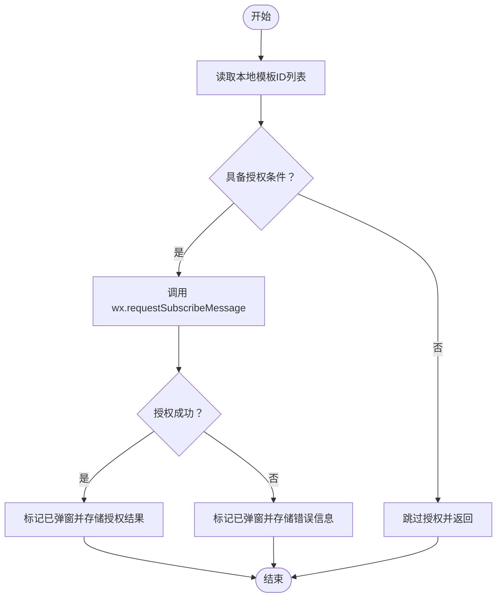
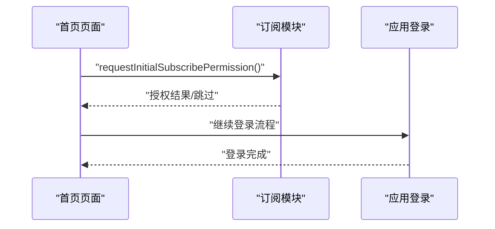
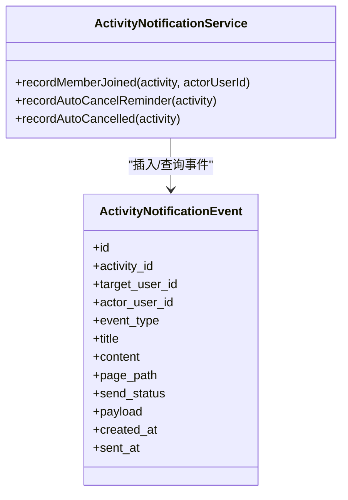
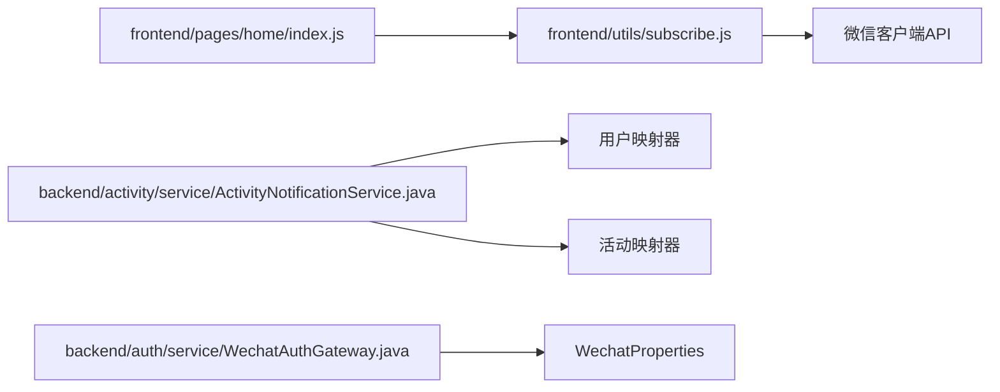

# 微信消息订阅模块

<cite>
**本文档引用的文件**
- [frontend/utils/subscribe.js](file://frontend/utils/subscribe.js)
- [frontend/pages/home/index.js](file://frontend/pages/home/index.js)
- [frontend/pages/home/index.wxml](file://frontend/pages/home/index.wxml)
- [backend/activity/service/ActivityNotificationService.java](file://backend/activity/service/ActivityNotificationService.java)
- [backend/common/config/WechatProperties.java](file://backend/common/config/WechatProperties.java)
- [backend/auth/service/WechatAuthGateway.java](file://backend/auth/service/WechatAuthGateway.java)
- [doc/改进文档/202606021041工程改进设计与调试说明.md](file://doc/改进文档/202606021041工程改进设计与调试说明.md)
</cite>

## 目录
1. [简介](#简介)
2. [项目结构](#项目结构)
3. [核心组件](#核心组件)
4. [架构概览](#架构概览)
5. [详细组件分析](#详细组件分析)
6. [依赖分析](#依赖分析)
7. [性能考虑](#性能考虑)
8. [故障排除指南](#故障排除指南)
9. [结论](#结论)
10. [附录](#附录)

## 简介
本文件面向微信消息订阅模块的开发与维护，围绕前端订阅授权与后端通知事件管理展开，重点阐述以下方面：
- 微信订阅消息模板的配置与使用
- 模板消息的数据绑定与发送流程
- 用户订阅状态检查与授权处理
- 消息类型分类与触发条件（活动状态变更、成员邀请、费用结算）
- 公众号消息与小程序消息的区别及转换机制
- 模板设计规范、发送频率控制、错误处理策略与用户体验优化建议

当前仓库已实现前端订阅授权入口与后端通知事件落库，后续接入微信订阅消息的关键步骤已在改进文档中明确。

## 项目结构
订阅模块涉及前后端协作：
- 前端：订阅授权入口、权限提示文案、登录流程集成
- 后端：通知事件记录、事件类型定义、微信配置加载

**图表来源**
- [frontend/utils/subscribe.js:1-31](file://frontend/utils/subscribe.js#L1-L31)
- [frontend/pages/home/index.js:101-122](file://frontend/pages/home/index.js#L101-L122)
- [frontend/pages/home/index.wxml:34-34](file://frontend/pages/home/index.wxml#L34-L34)
- [backend/activity/service/ActivityNotificationService.java:1-70](file://backend/activity/service/ActivityNotificationService.java#L1-L70)
- [backend/common/config/WechatProperties.java:1-37](file://backend/common/config/WechatProperties.java#L1-L37)
- [backend/auth/service/WechatAuthGateway.java:1-140](file://backend/auth/service/WechatAuthGateway.java#L1-L140)

**章节来源**
- [frontend/utils/subscribe.js:1-31](file://frontend/utils/subscribe.js#L1-L31)
- [frontend/pages/home/index.js:101-122](file://frontend/pages/home/index.js#L101-L122)
- [frontend/pages/home/index.wxml:34-34](file://frontend/pages/home/index.wxml#L34-L34)
- [backend/activity/service/ActivityNotificationService.java:1-70](file://backend/activity/service/ActivityNotificationService.java#L1-L70)
- [backend/common/config/WechatProperties.java:1-37](file://backend/common/config/WechatProperties.java#L1-L37)
- [backend/auth/service/WechatAuthGateway.java:1-140](file://backend/auth/service/WechatAuthGateway.java#L1-L140)

## 核心组件
- 前端订阅授权模块：负责在用户登录确认时弹出订阅消息授权窗口，并持久化授权结果与错误信息。
- 登录流程集成：在用户确认登录前触发订阅授权，确保授权与登录流程一体化。
- 通知事件服务：记录各类活动相关通知事件，为后续接入微信订阅消息提供事件数据基础。
- 微信配置：提供微信应用ID与密钥等配置项，支撑后续微信接口调用。

**章节来源**
- [frontend/utils/subscribe.js:3-27](file://frontend/utils/subscribe.js#L3-L27)
- [frontend/pages/home/index.js:101-122](file://frontend/pages/home/index.js#L101-L122)
- [backend/activity/service/ActivityNotificationService.java:21-70](file://backend/activity/service/ActivityNotificationService.java#L21-L70)
- [backend/common/config/WechatProperties.java:8-28](file://backend/common/config/WechatProperties.java#L8-L28)

## 架构概览
订阅消息从触发到发送的整体流程如下：

**图表来源**
- [frontend/pages/home/index.js:101-122](file://frontend/pages/home/index.js#L101-L122)
- [frontend/utils/subscribe.js:3-27](file://frontend/utils/subscribe.js#L3-L27)
- [backend/activity/service/ActivityNotificationService.java:21-70](file://backend/activity/service/ActivityNotificationService.java#L21-L70)
- [backend/common/config/WechatProperties.java:8-28](file://backend/common/config/WechatProperties.java#L8-L28)

## 详细组件分析

### 前端订阅授权模块
- 功能职责
  - 从本地存储读取订阅模板ID列表
  - 判断是否已弹窗授权或缺少必要能力
  - 调用微信API发起订阅授权请求
  - 成功/失败分别持久化授权结果与错误信息
- 关键行为
  - 条件判断：若无微信订阅能力、模板ID为空或已弹窗，则跳过授权
  - 授权成功：标记已弹窗并存储授权结果
  - 授权失败：标记已弹窗并存储错误信息
- 与登录流程集成
  - 在用户确认登录前调用授权函数，确保授权与登录一体化

**图表来源**
- [frontend/utils/subscribe.js:3-27](file://frontend/utils/subscribe.js#L3-L27)

**章节来源**
- [frontend/utils/subscribe.js:3-27](file://frontend/utils/subscribe.js#L3-L27)
- [frontend/pages/home/index.js:101-122](file://frontend/pages/home/index.js#L101-L122)
- [frontend/pages/home/index.wxml:34-34](file://frontend/pages/home/index.wxml#L34-L34)

### 登录流程中的订阅授权集成
- 触发时机：用户点击确认登录时
- 执行顺序：先执行订阅授权，再继续登录流程
- 异常处理：捕获授权异常并提示用户

**图表来源**
- [frontend/pages/home/index.js:101-122](file://frontend/pages/home/index.js#L101-L122)
- [frontend/utils/subscribe.js:3-27](file://frontend/utils/subscribe.js#L3-L27)

**章节来源**
- [frontend/pages/home/index.js:101-122](file://frontend/pages/home/index.js#L101-L122)

### 通知事件服务与消息类型
- 事件类型
  - 新成员加入：记录活动内除触发者外其他成员的通知事件
  - 自动取消提醒：仅对发起人发送一次提醒，避免重复
  - 自动取消：记录取消后的通知事件
- 数据落库
  - 事件包含活动ID、目标用户、触发用户、事件类型、标题、内容、页面路径、发送状态等
  - 为后续接入微信订阅消息提供事件数据基础

**图表来源**
- [backend/activity/service/ActivityNotificationService.java:21-70](file://backend/activity/service/ActivityNotificationService.java#L21-L70)

**章节来源**
- [backend/activity/service/ActivityNotificationService.java:21-70](file://backend/activity/service/ActivityNotificationService.java#L21-L70)
- [doc/改进文档/202606021041工程改进设计与调试说明.md:100-124](file://doc/改进文档/202606021041工程改进设计与调试说明.md#L100-L124)

### 微信配置与网关
- 配置项
  - 应用ID、应用密钥、模拟登录开关
- 网关作用
  - 通过配置项加载微信相关参数，为后续订阅消息接口调用提供基础

**章节来源**
- [backend/common/config/WechatProperties.java:8-28](file://backend/common/config/WechatProperties.java#L8-L28)
- [backend/auth/service/WechatAuthGateway.java:20-40](file://backend/auth/service/WechatAuthGateway.java#L20-L40)

## 依赖分析
- 前端依赖
  - 订阅模块依赖微信客户端提供的订阅消息API
  - 登录流程依赖订阅模块的授权结果
- 后端依赖
  - 通知事件服务依赖用户与活动实体映射器
  - 微信配置由Spring Boot加载，供认证网关与后续订阅消息调用使用

**图表来源**
- [frontend/utils/subscribe.js:1-31](file://frontend/utils/subscribe.js#L1-L31)
- [frontend/pages/home/index.js:101-122](file://frontend/pages/home/index.js#L101-L122)
- [backend/activity/service/ActivityNotificationService.java:1-70](file://backend/activity/service/ActivityNotificationService.java#L1-L70)
- [backend/auth/service/WechatAuthGateway.java:1-140](file://backend/auth/service/WechatAuthGateway.java#L1-L140)
- [backend/common/config/WechatProperties.java:1-37](file://backend/common/config/WechatProperties.java#L1-L37)

**章节来源**
- [frontend/utils/subscribe.js:1-31](file://frontend/utils/subscribe.js#L1-L31)
- [frontend/pages/home/index.js:101-122](file://frontend/pages/home/index.js#L101-L122)
- [backend/activity/service/ActivityNotificationService.java:1-70](file://backend/activity/service/ActivityNotificationService.java#L1-L70)
- [backend/auth/service/WechatAuthGateway.java:1-140](file://backend/auth/service/WechatAuthGateway.java#L1-L140)
- [backend/common/config/WechatProperties.java:1-37](file://backend/common/config/WechatProperties.java#L1-L37)

## 性能考虑
- 授权弹窗频率控制
  - 通过本地存储标记已弹窗，避免重复弹窗
- 事件去重
  - 对自动取消提醒进行去重，仅对发起人发送一次
- 数据库查询优化
  - 为通知事件表建立索引，支持按用户、发送状态、创建时间快速查询

**章节来源**
- [frontend/utils/subscribe.js:5-11](file://frontend/utils/subscribe.js#L5-L11)
- [backend/activity/service/ActivityNotificationService.java:40-56](file://backend/activity/service/ActivityNotificationService.java#L40-L56)
- [doc/改进文档/202606021041工程改进设计与调试说明.md:121-124](file://doc/改进文档/202606021041工程改进设计与调试说明.md#L121-L124)

## 故障排除指南
- 授权失败
  - 检查本地存储的错误信息，确认是否因用户拒绝或网络异常导致
  - 确认模板ID列表是否正确配置
- 授权跳过
  - 若缺少微信订阅能力、模板ID为空或已弹窗，将直接跳过授权
- 登录异常
  - 在登录流程中捕获异常并提示用户重新登录

**章节来源**
- [frontend/utils/subscribe.js:13-26](file://frontend/utils/subscribe.js#L13-L26)
- [frontend/pages/home/index.js:112-119](file://frontend/pages/home/index.js#L112-L119)

## 结论
本订阅模块已完成前端授权入口与后端事件落库的基础建设，后续接入微信订阅消息的关键在于：
- 在微信公众平台申请订阅模板并配置模板ID
- 在后端按事件类型组装模板参数并调用微信订阅消息接口
- 完善发送状态回写与错误处理，确保可追溯性与可观测性

## 附录

### 模板消息设计规范
- 标题与内容简洁明确，突出关键信息（如活动名称、时间、状态）
- 页面路径指向用户期望到达的页面，提升转化率
- 避免过度频繁推送，遵循用户偏好与业务场景

### 发送频率控制
- 对同一事件类型在同一用户上设置去重策略
- 控制定时任务触发频率，避免重复通知

### 错误处理策略
- 授权阶段：记录错误原因并允许用户继续使用应用
- 发送阶段：区分微信接口失败与用户未授权两类情况，分别处理

### 用户体验优化建议
- 在登录确认按钮旁提示订阅授权，降低认知负担
- 提供清晰的订阅管理入口，方便用户自主管理偏好

**章节来源**
- [frontend/pages/home/index.wxml:34-34](file://frontend/pages/home/index.wxml#L34-L34)
- [doc/改进文档/202606021041工程改进设计与调试说明.md:246-254](file://doc/改进文档/202606021041工程改进设计与调试说明.md#L246-L254)