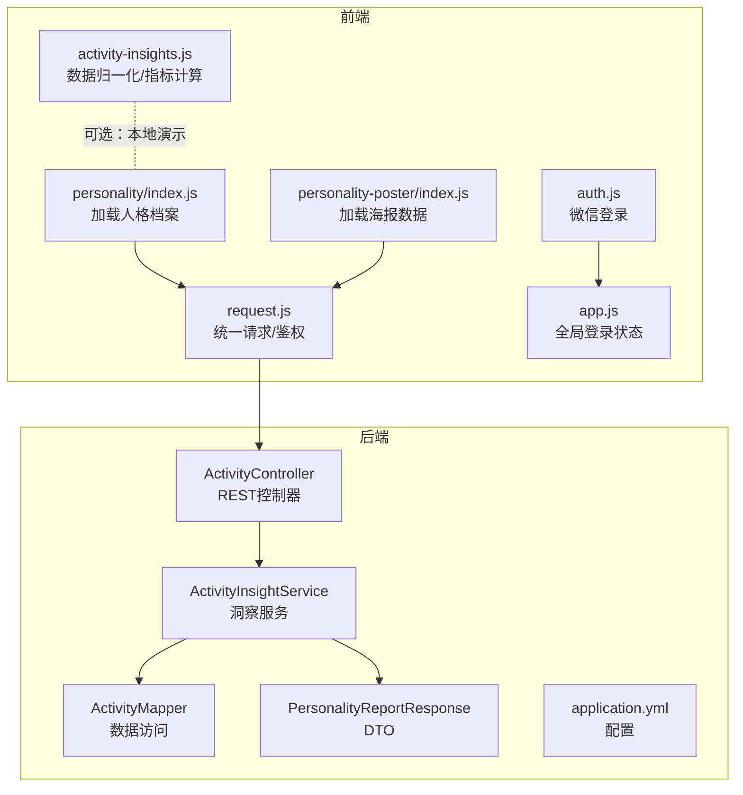
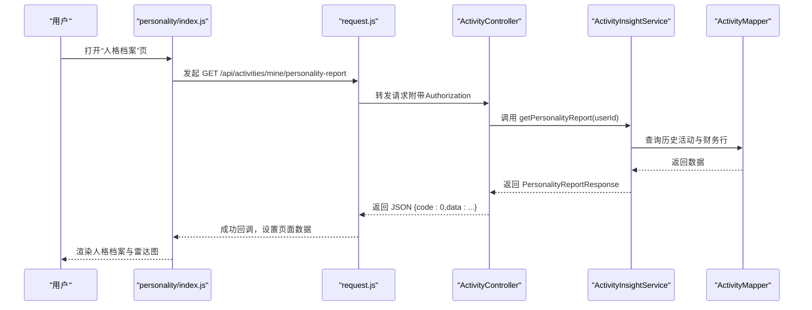
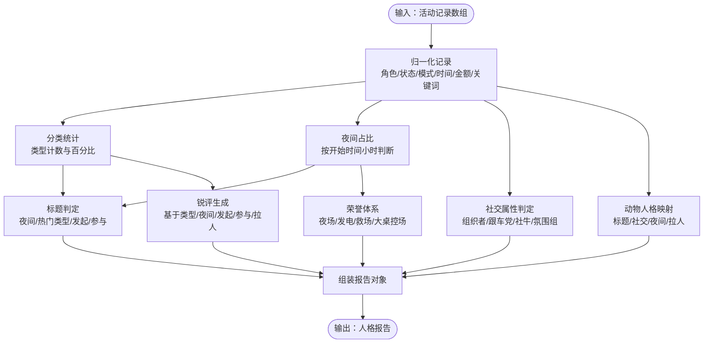
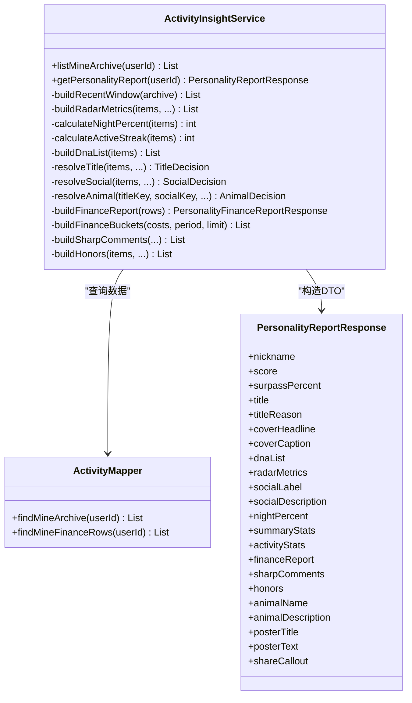
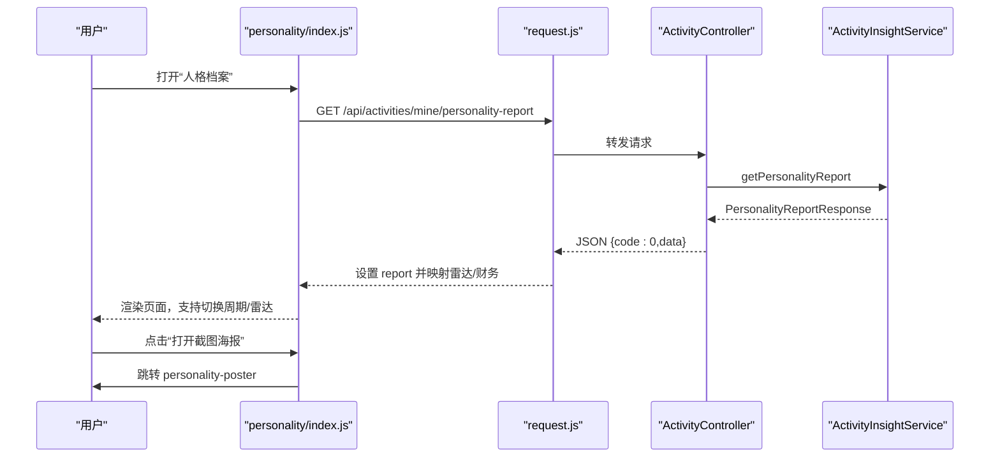
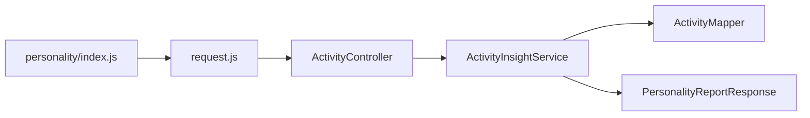

# 活动洞察分析模块

<cite>
**本文引用的文件**
- [activity-insights.js](file://frontend/utils/activity-insights.js)
- [index.js（人格档案页）](file://frontend/pages/personality/index.js)
- [index.wxml（人格档案页）](file://frontend/pages/personality/index.wxml)
- [index.wxss（人格档案页）](file://frontend/pages/personality/index.wxss)
- [index.js（人格海报页）](file://frontend/pages/personality-poster/index.js)
- [index.wxml（人格海报页）](file://frontend/pages/personality-poster/index.wxml)
- [request.js](file://frontend/utils/request.js)
- [app.js](file://frontend/app.js)
- [auth.js](file://frontend/utils/auth.js)
- [ActivityInsightService.java](file://backend/src/main/java/com/playminipro/activity/service/ActivityInsightService.java)
- [ActivityController.java](file://backend/src/main/java/com/playminipro/activity/controller/ActivityController.java)
- [ActivityMapper.java](file://backend/src/main/java/com/playminipro/activity/mapper/ActivityMapper.java)
- [PersonalityReportResponse.java](file://backend/src/main/java/com/playminipro/activity/dto/PersonalityReportResponse.java)
- [application.yml](file://backend/src/main/resources/application.yml)
</cite>

## 目录
1. [简介](#简介)
2. [项目结构](#项目结构)
3. [核心组件](#核心组件)
4. [架构总览](#架构总览)
5. [详细组件分析](#详细组件分析)
6. [依赖分析](#依赖分析)
7. [性能考量](#性能考量)
8. [故障排查指南](#故障排查指南)
9. [结论](#结论)
10. [附录](#附录)

## 简介
本模块围绕“活动洞察分析”展开，目标是基于用户的历史活动数据，生成可读性强、可视化友好的个人活动画像与报告。前端通过工具函数对种子数据或后端返回的结构化数据进行归一化与指标计算，后端则负责聚合与评分，最终由小程序页面渲染并支持海报分享。

## 项目结构
- 前端
  - 工具：activity-insights.js 提供数据归一化、指标计算与报告组装
  - 页面：personality（人格档案）、personality-poster（人格海报）
  - 请求封装：request.js 统一请求与鉴权头处理
  - 登录与全局状态：auth.js、app.js
- 后端
  - 控制器：ActivityController 提供 /api/activities/mine/personality-report 接口
  - 服务：ActivityInsightService 负责指标计算、雷达图、财务报表与荣誉体系
  - 映射：ActivityMapper 提供历史活动与财务行数据查询
  - DTO：PersonalityReportResponse 定义返回结构
  - 配置：application.yml 提供数据库与Redis配置

**图表来源**
- [index.js（人格档案页）:1-128](file://frontend/pages/personality/index.js#L1-L128)
- [index.js（人格海报页）:1-44](file://frontend/pages/personality-poster/index.js#L1-L44)
- [activity-insights.js:130-184](file://frontend/utils/activity-insights.js#L130-L184)
- [request.js:50-80](file://frontend/utils/request.js#L50-L80)
- [app.js:1-46](file://frontend/app.js#L1-L46)
- [auth.js:1-56](file://frontend/utils/auth.js#L1-L56)
- [ActivityController.java:74-77](file://backend/src/main/java/com/playminipro/activity/controller/ActivityController.java#L74-L77)
- [ActivityInsightService.java:47-111](file://backend/src/main/java/com/playminipro/activity/service/ActivityInsightService.java#L47-L111)
- [ActivityMapper.java:124-186](file://backend/src/main/java/com/playminipro/activity/mapper/ActivityMapper.java#L124-L186)
- [PersonalityReportResponse.java:1-30](file://backend/src/main/java/com/playminipro/activity/dto/PersonalityReportResponse.java#L1-L30)
- [application.yml:9-19](file://backend/src/main/resources/application.yml#L9-L19)

**章节来源**
- [index.js（人格档案页）:1-128](file://frontend/pages/personality/index.js#L1-L128)
- [index.js（人格海报页）:1-44](file://frontend/pages/personality-poster/index.js#L1-L44)
- [activity-insights.js:130-184](file://frontend/utils/activity-insights.js#L130-L184)
- [request.js:50-80](file://frontend/utils/request.js#L50-L80)
- [app.js:1-46](file://frontend/app.js#L1-L46)
- [auth.js:1-56](file://frontend/utils/auth.js#L1-L56)
- [ActivityController.java:74-77](file://backend/src/main/java/com/playminipro/activity/controller/ActivityController.java#L74-L77)
- [ActivityInsightService.java:47-111](file://backend/src/main/java/com/playminipro/activity/service/ActivityInsightService.java#L47-L111)
- [ActivityMapper.java:124-186](file://backend/src/main/java/com/playminipro/activity/mapper/ActivityMapper.java#L124-L186)
- [PersonalityReportResponse.java:1-30](file://backend/src/main/java/com/playminipro/activity/dto/PersonalityReportResponse.java#L1-L30)
- [application.yml:9-19](file://backend/src/main/resources/application.yml#L9-L19)

## 核心组件
- 数据归一化与指标计算（前端）
  - 归一化：将原始活动记录标准化为统一字段，如角色标签、状态标签、时间文本、金额格式化等
  - 指标：分类统计、夜间占比、标题与社交属性判定、动物人格映射、锐评与荣誉体系
- 报告组装（前端）
  - 将指标与UI所需字段组合为完整人格报告对象
- 后端洞察服务
  - 最近窗口筛选、雷达指标、夜间占比、活跃天数、DNA列表、标题/社交/动物决策、财务报表与分桶、荣誉体系
- 前端页面渲染
  - 人格档案页：封面、整活指数、雷达图、兴趣DNA、社交属性、活动统计、财务报表、荣誉、动物人格、海报文案
  - 海报页：用于生成分享海报的卡片式展示

**章节来源**
- [activity-insights.js:134-184](file://frontend/utils/activity-insights.js#L134-L184)
- [ActivityInsightService.java:47-111](file://backend/src/main/java/com/playminipro/activity/service/ActivityInsightService.java#L47-L111)
- [index.wxml（人格档案页）:1-166](file://frontend/pages/personality/index.wxml#L1-L166)
- [index.wxml（人格海报页）:1-55](file://frontend/pages/personality-poster/index.wxml#L1-L55)

## 架构总览
前后端通过REST接口交互，前端负责UI与轻量计算，后端负责复杂聚合与评分，确保数据一致性与性能。

**图表来源**
- [index.js（人格档案页）:32-50](file://frontend/pages/personality/index.js#L32-L50)
- [request.js:50-80](file://frontend/utils/request.js#L50-L80)
- [ActivityController.java:74-77](file://backend/src/main/java/com/playminipro/activity/controller/ActivityController.java#L74-L77)
- [ActivityInsightService.java:47-111](file://backend/src/main/java/com/playminipro/activity/service/ActivityInsightService.java#L47-L111)
- [ActivityMapper.java:124-186](file://backend/src/main/java/com/playminipro/activity/mapper/ActivityMapper.java#L124-L186)

## 详细组件分析

### 前端数据归一化与指标计算（activity-insights.js）
- 归一化函数
  - 角色标签、状态标签、模式标签、时间格式化、金额格式化、关键词拼接
- 指标计算
  - 分类统计：按活动类型计数与百分比
  - 夜间占比：根据开始时间小时判断
  - 标题判定：综合夜间占比、热门类型、发起/参与数量
  - 社交属性：组织者/跟车党/社牛/氛围组
  - 动物人格：标题与社交属性、夜间占比、拉人次数的组合映射
  - 锐评与荣誉：基于统计结果生成个性化文案与徽章
  - 报告组装：将上述指标整合为完整报告对象

**图表来源**
- [activity-insights.js:186-219](file://frontend/utils/activity-insights.js#L186-L219)
- [activity-insights.js:221-237](file://frontend/utils/activity-insights.js#L221-L237)
- [activity-insights.js:239-250](file://frontend/utils/activity-insights.js#L239-L250)
- [activity-insights.js:252-292](file://frontend/utils/activity-insights.js#L252-L292)
- [activity-insights.js:294-322](file://frontend/utils/activity-insights.js#L294-L322)
- [activity-insights.js:324-348](file://frontend/utils/activity-insights.js#L324-L348)
- [activity-insights.js:350-377](file://frontend/utils/activity-insights.js#L350-L377)
- [activity-insights.js:134-184](file://frontend/utils/activity-insights.js#L134-L184)

**章节来源**
- [activity-insights.js:134-184](file://frontend/utils/activity-insights.js#L134-L184)
- [activity-insights.js:186-219](file://frontend/utils/activity-insights.js#L186-L219)
- [activity-insights.js:221-237](file://frontend/utils/activity-insights.js#L221-L237)
- [activity-insights.js:239-250](file://frontend/utils/activity-insights.js#L239-L250)
- [activity-insights.js:252-292](file://frontend/utils/activity-insights.js#L252-L292)
- [activity-insights.js:294-322](file://frontend/utils/activity-insights.js#L294-L322)
- [activity-insights.js:324-348](file://frontend/utils/activity-insights.js#L324-L348)
- [activity-insights.js:350-377](file://frontend/utils/activity-insights.js#L350-L377)

### 后端洞察服务（ActivityInsightService）
- 最近窗口：默认取最近30天，若无则取最新若干条
- 雷达指标：组局力、参与度、带动力、落地率、夜场热度、连续性
- 夜间占比：按开始时间小时统计
- 活跃天数：按角色时间去重后计算连续天数
- DNA列表：活动类型计数与百分比
- 标题/社交/动物决策：综合夜间占比、发起/参与、带动人数
- 财务报表：总支出、AA支出、请客次数与支出，按日/周/月/季/年分桶
- 锐评与荣誉：个性化文案与徽章集合

**图表来源**
- [ActivityInsightService.java:47-111](file://backend/src/main/java/com/playminipro/activity/service/ActivityInsightService.java#L47-L111)
- [ActivityInsightService.java:134-140](file://backend/src/main/java/com/playminipro/activity/service/ActivityInsightService.java#L134-L140)
- [ActivityInsightService.java:146-162](file://backend/src/main/java/com/playminipro/activity/service/ActivityInsightService.java#L146-L162)
- [ActivityInsightService.java:262-271](file://backend/src/main/java/com/playminipro/activity/service/ActivityInsightService.java#L262-L271)
- [ActivityInsightService.java:273-295](file://backend/src/main/java/com/playminipro/activity/service/ActivityInsightService.java#L273-L295)
- [ActivityInsightService.java:297-315](file://backend/src/main/java/com/playminipro/activity/service/ActivityInsightService.java#L297-L315)
- [ActivityInsightService.java:317-337](file://backend/src/main/java/com/playminipro/activity/service/ActivityInsightService.java#L317-L337)
- [ActivityInsightService.java:339-353](file://backend/src/main/java/com/playminipro/activity/service/ActivityInsightService.java#L339-L353)
- [ActivityInsightService.java:355-366](file://backend/src/main/java/com/playminipro/activity/service/ActivityInsightService.java#L355-L366)
- [ActivityInsightService.java:164-196](file://backend/src/main/java/com/playminipro/activity/service/ActivityInsightService.java#L164-L196)
- [ActivityInsightService.java:212-233](file://backend/src/main/java/com/playminipro/activity/service/ActivityInsightService.java#L212-L233)
- [ActivityInsightService.java:368-405](file://backend/src/main/java/com/playminipro/activity/service/ActivityInsightService.java#L368-L405)
- [ActivityMapper.java:124-186](file://backend/src/main/java/com/playminipro/activity/mapper/ActivityMapper.java#L124-L186)
- [PersonalityReportResponse.java:1-30](file://backend/src/main/java/com/playminipro/activity/dto/PersonalityReportResponse.java#L1-L30)

**章节来源**
- [ActivityInsightService.java:47-111](file://backend/src/main/java/com/playminipro/activity/service/ActivityInsightService.java#L47-L111)
- [ActivityInsightService.java:134-140](file://backend/src/main/java/com/playminipro/activity/service/ActivityInsightService.java#L134-L140)
- [ActivityInsightService.java:146-162](file://backend/src/main/java/com/playminipro/activity/service/ActivityInsightService.java#L146-L162)
- [ActivityInsightService.java:262-271](file://backend/src/main/java/com/playminipro/activity/service/ActivityInsightService.java#L262-L271)
- [ActivityInsightService.java:273-295](file://backend/src/main/java/com/playminipro/activity/service/ActivityInsightService.java#L273-L295)
- [ActivityInsightService.java:297-315](file://backend/src/main/java/com/playminipro/activity/service/ActivityInsightService.java#L297-L315)
- [ActivityInsightService.java:317-337](file://backend/src/main/java/com/playminipro/activity/service/ActivityInsightService.java#L317-L337)
- [ActivityInsightService.java:339-353](file://backend/src/main/java/com/playminipro/activity/service/ActivityInsightService.java#L339-L353)
- [ActivityInsightService.java:355-366](file://backend/src/main/java/com/playminipro/activity/service/ActivityInsightService.java#L355-L366)
- [ActivityInsightService.java:164-196](file://backend/src/main/java/com/playminipro/activity/service/ActivityInsightService.java#L164-L196)
- [ActivityInsightService.java:212-233](file://backend/src/main/java/com/playminipro/activity/service/ActivityInsightService.java#L212-L233)
- [ActivityInsightService.java:368-405](file://backend/src/main/java/com/playminipro/activity/service/ActivityInsightService.java#L368-L405)
- [ActivityMapper.java:124-186](file://backend/src/main/java/com/playminipro/activity/mapper/ActivityMapper.java#L124-L186)
- [PersonalityReportResponse.java:1-30](file://backend/src/main/java/com/playminipro/activity/dto/PersonalityReportResponse.java#L1-L30)

### 前端页面与可视化（personality/index.js 与 personality-poster/index.js）
- 人格档案页
  - 加载与映射：调用后端接口，映射雷达多边形与财务分桶
  - 展示内容：封面、整活指数、雷达图、兴趣DNA、社交属性、活动统计、财务报表、锐评、荣誉、动物人格、海报文案
  - 交互：切换财务周期、展开/收起雷达图、跳转海报页
- 海报页
  - 展示：姓名、称号、封面语、整活指数、锐评、统计卡片、兴趣DNA、动物人格与备注

**图表来源**
- [index.js（人格档案页）:20-78](file://frontend/pages/personality/index.js#L20-L78)
- [index.js（人格海报页）:8-34](file://frontend/pages/personality-poster/index.js#L8-L34)
- [request.js:50-80](file://frontend/utils/request.js#L50-L80)
- [ActivityController.java:74-77](file://backend/src/main/java/com/playminipro/activity/controller/ActivityController.java#L74-L77)
- [ActivityInsightService.java:47-111](file://backend/src/main/java/com/playminipro/activity/service/ActivityInsightService.java#L47-L111)

**章节来源**
- [index.js（人格档案页）:1-128](file://frontend/pages/personality/index.js#L1-L128)
- [index.wxml（人格档案页）:1-166](file://frontend/pages/personality/index.wxml#L1-L166)
- [index.wxss（人格档案页）:1-367](file://frontend/pages/personality/index.wxss#L1-L367)
- [index.js（人格海报页）:1-44](file://frontend/pages/personality-poster/index.js#L1-L44)
- [index.wxml（人格海报页）:1-55](file://frontend/pages/personality-poster/index.wxml#L1-L55)

## 依赖分析
- 前端
  - personality/index.js 依赖 request.js 发起接口请求，并将后端返回映射为页面可用数据
  - activity-insights.js 可作为本地演示或轻量计算的备选方案
- 后端
  - ActivityController 将请求委派给 ActivityInsightService
  - ActivityInsightService 使用 ActivityMapper 查询历史活动与财务行
  - PersonalityReportResponse 作为统一返回结构

**图表来源**
- [index.js（人格档案页）:32-50](file://frontend/pages/personality/index.js#L32-L50)
- [request.js:50-80](file://frontend/utils/request.js#L50-L80)
- [ActivityController.java:74-77](file://backend/src/main/java/com/playminipro/activity/controller/ActivityController.java#L74-L77)
- [ActivityInsightService.java:47-111](file://backend/src/main/java/com/playminipro/activity/service/ActivityInsightService.java#L47-L111)
- [ActivityMapper.java:124-186](file://backend/src/main/java/com/playminipro/activity/mapper/ActivityMapper.java#L124-L186)
- [PersonalityReportResponse.java:1-30](file://backend/src/main/java/com/playminipro/activity/dto/PersonalityReportResponse.java#L1-L30)

**章节来源**
- [index.js（人格档案页）:1-128](file://frontend/pages/personality/index.js#L1-L128)
- [request.js:50-80](file://frontend/utils/request.js#L50-L80)
- [ActivityController.java:74-77](file://backend/src/main/java/com/playminipro/activity/controller/ActivityController.java#L74-L77)
- [ActivityInsightService.java:47-111](file://backend/src/main/java/com/playminipro/activity/service/ActivityInsightService.java#L47-L111)
- [ActivityMapper.java:124-186](file://backend/src/main/java/com/playminipro/activity/mapper/ActivityMapper.java#L124-L186)
- [PersonalityReportResponse.java:1-30](file://backend/src/main/java/com/playminipro/activity/dto/PersonalityReportResponse.java#L1-L30)

## 性能考量
- 后端聚合优化
  - 财务报表仅做一次内存级分桶，避免多次数据库扫描
  - 最近窗口优先使用数据库过滤，不足时回退到最近N条
- 前端渲染优化
  - 雷达图通过CSS clip-path 实现，减少Canvas/第三方库依赖
  - 财务分桶按需切换周期，避免一次性渲染过多数据
- 缓存与实时性
  - Redis配置存在但未在洞察服务中直接使用，可考虑引入短期缓存以降低重复计算压力
  - 前端可在页面级缓存最近一次报告，减少重复请求
- 数据准确性
  - 夜间占比与活跃天数均基于开始时间与角色时间，确保口径一致
  - 财务分桶键值采用日期/周/季度/年等标准格式，便于跨周期对比

[本节为通用性能建议，不直接分析具体文件，故无“章节来源”]

## 故障排查指南
- 登录态失效
  - 前端请求拦截到401/403时清理本地鉴权状态并跳转首页
- 接口异常
  - 统一错误处理：显示提示并区分认证过期与其他错误
- 数据为空
  - 若后端返回空集，前端页面提供占位文案与空状态提示
- 配置问题
  - 确认后端数据库URL、用户名、密码与Redis连接参数正确

**章节来源**
- [request.js:68-95](file://frontend/utils/request.js#L68-L95)
- [index.js（人格档案页）:41-49](file://frontend/pages/personality/index.js#L41-L49)
- [application.yml:9-19](file://backend/src/main/resources/application.yml#L9-L19)

## 结论
该模块通过前后端协同，实现了从数据采集、指标计算到可视化呈现的完整闭环。后端负责复杂聚合与评分，前端负责轻量化处理与交互体验，整体具备良好的扩展性与可维护性。后续可在缓存与实时性方面进一步优化，以提升用户体验与系统吞吐。

## 附录
- 关键流程路径
  - 前端：personality/index.js → request.js → ActivityController → ActivityInsightService → ActivityMapper
  - 后端：ActivityController → ActivityInsightService → ActivityMapper → PersonalityReportResponse
- 数据流要点
  - 最近窗口：前端可替换为后端实现，确保一致的时间范围
  - 财务分桶：后端一次性聚合，前端按周期选择展示
  - 标题/社交/动物：双端逻辑保持一致，避免展示偏差