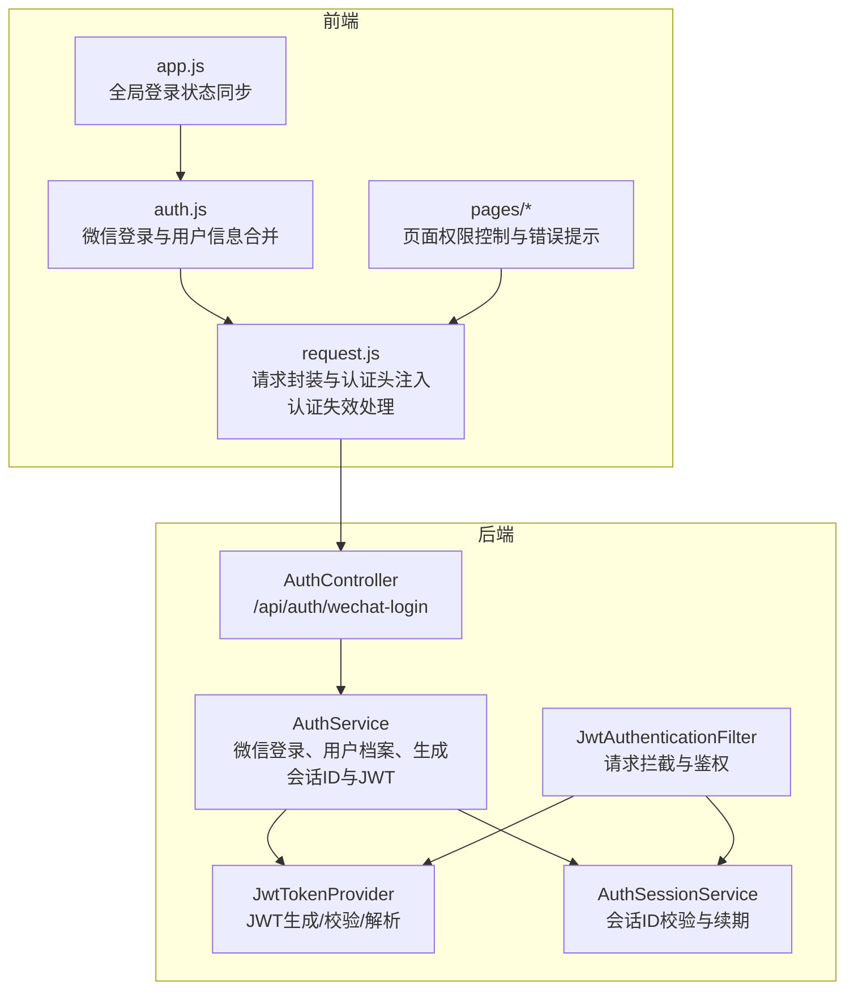
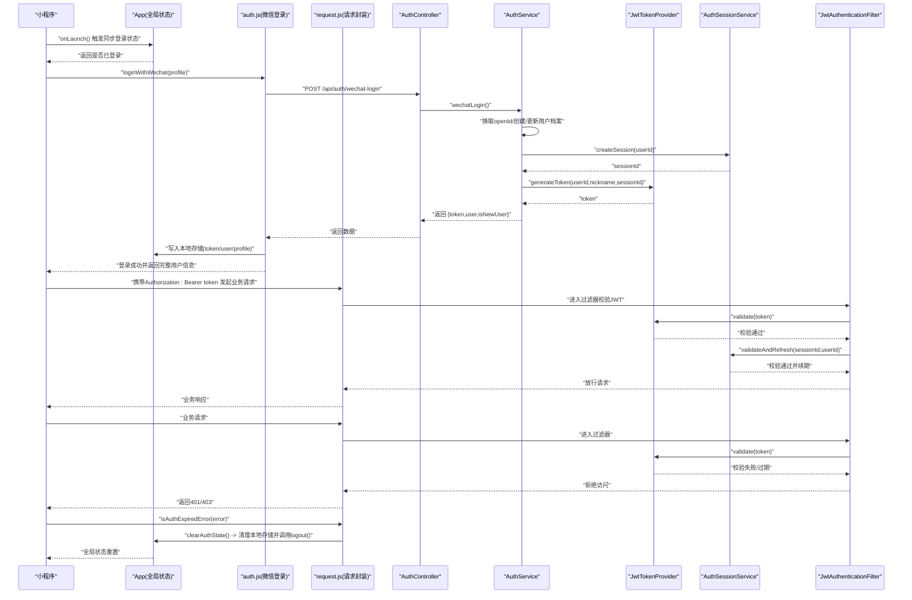
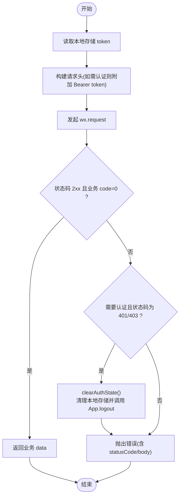
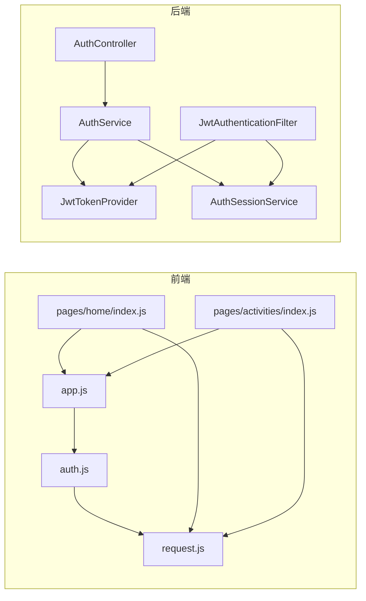

# 用户认证模块

<cite>
**本文引用的文件**
- [frontend/utils/auth.js](file://frontend/utils/auth.js)
- [frontend/app.js](file://frontend/app.js)
- [frontend/utils/request.js](file://frontend/utils/request.js)
- [frontend/pages/home/index.js](file://frontend/pages/home/index.js)
- [frontend/pages/activities/index.js](file://frontend/pages/activities/index.js)
- [backend/src/main/java/com/playminipro/auth/controller/AuthController.java](file://backend/src/main/java/com/playminipro/auth/controller/AuthController.java)
- [backend/src/main/java/com/playminipro/auth/service/AuthService.java](file://backend/src/main/java/com/playminipro/auth/service/AuthService.java)
- [backend/src/main/java/com/playminipro/common/security/JwtAuthenticationFilter.java](file://backend/src/main/java/com/playminipro/common/security/JwtAuthenticationFilter.java)
- [backend/src/main/java/com/playminipro/common/security/JwtTokenProvider.java](file://backend/src/main/java/com/playminipro/common/security/JwtTokenProvider.java)
- [backend/src/main/java/com/playminipro/common/security/AuthSessionService.java](file://backend/src/main/java/com/playminipro/common/security/AuthSessionService.java)
- [backend/src/main/java/com/playminipro/auth/dto/WechatLoginRequest.java](file://backend/src/main/java/com/playminipro/auth/dto/WechatLoginRequest.java)
- [backend/src/main/resources/application.yml](file://backend/src/main/resources/application.yml)
</cite>

## 目录
1. [简介](#简介)
2. [项目结构](#项目结构)
3. [核心组件](#核心组件)
4. [架构总览](#架构总览)
5. [详细组件分析](#详细组件分析)
6. [依赖关系分析](#依赖关系分析)
7. [性能考量](#性能考量)
8. [故障排除指南](#故障排除指南)
9. [结论](#结论)
10. [附录](#附录)

## 简介
本文件为用户认证模块的详细开发文档，聚焦于前端 auth.js 与 request.js 的登录状态管理、token 存储与验证、用户信息持久化、会话保持策略；同时覆盖认证状态检查、权限验证、自动登出处理、认证失效检测与处理流程（401/403）、与页面权限控制、API 请求认证、路由守卫的集成方式，并给出安全考虑、最佳实践与故障排除建议。

## 项目结构
认证模块由前后端协同完成：
- 前端负责：小程序登录态同步、token 与用户信息本地持久化、API 请求时自动附加认证头、认证失效时的自动清理与提示。
- 后端负责：基于 JWT 的令牌签发与校验、会话状态校验与续期、拦截器统一鉴权。

图表来源
- [frontend/app.js:1-46](file://frontend/app.js#L1-L46)
- [frontend/utils/auth.js:1-56](file://frontend/utils/auth.js#L1-L56)
- [frontend/utils/request.js:1-107](file://frontend/utils/request.js#L1-L107)
- [frontend/pages/home/index.js:1-219](file://frontend/pages/home/index.js#L1-L219)
- [frontend/pages/activities/index.js:1-206](file://frontend/pages/activities/index.js#L1-L206)
- [backend/src/main/java/com/playminipro/auth/controller/AuthController.java:1-27](file://backend/src/main/java/com/playminipro/auth/controller/AuthController.java#L1-L27)
- [backend/src/main/java/com/playminipro/auth/service/AuthService.java:1-101](file://backend/src/main/java/com/playminipro/auth/service/AuthService.java#L1-L101)
- [backend/src/main/java/com/playminipro/common/security/JwtTokenProvider.java:1-60](file://backend/src/main/java/com/playminipro/common/security/JwtTokenProvider.java#L1-L60)
- [backend/src/main/java/com/playminipro/common/security/AuthSessionService.java:1-53](file://backend/src/main/java/com/playminipro/common/security/AuthSessionService.java#L1-L53)
- [backend/src/main/java/com/playminipro/common/security/JwtAuthenticationFilter.java:1-56](file://backend/src/main/java/com/playminipro/common/security/JwtAuthenticationFilter.java#L1-L56)

章节来源
- [frontend/utils/auth.js:1-56](file://frontend/utils/auth.js#L1-L56)
- [frontend/app.js:1-46](file://frontend/app.js#L1-L46)
- [frontend/utils/request.js:1-107](file://frontend/utils/request.js#L1-L107)
- [backend/src/main/java/com/playminipro/auth/controller/AuthController.java:1-27](file://backend/src/main/java/com/playminipro/auth/controller/AuthController.java#L1-L27)
- [backend/src/main/java/com/playminipro/auth/service/AuthService.java:1-101](file://backend/src/main/java/com/playminipro/auth/service/AuthService.java#L1-L101)
- [backend/src/main/java/com/playminipro/common/security/JwtAuthenticationFilter.java:1-56](file://backend/src/main/java/com/playminipro/common/security/JwtAuthenticationFilter.java#L1-L56)
- [backend/src/main/java/com/playminipro/common/security/JwtTokenProvider.java:1-60](file://backend/src/main/java/com/playminipro/common/security/JwtTokenProvider.java#L1-L60)
- [backend/src/main/java/com/playminipro/common/security/AuthSessionService.java:1-53](file://backend/src/main/java/com/playminipro/common/security/AuthSessionService.java#L1-L53)

## 核心组件
- 前端登录与状态管理
  - 微信登录：通过 auth.js 发起登录，将后端返回的 token 与用户信息持久化至本地存储，并更新全局状态。
  - 登录状态同步：app.js 在应用启动时从本地存储恢复 token 与用户信息，作为全局登录态。
  - 页面权限控制：各页面在展示或操作前检查全局登录态，未登录则引导登录或跳转首页。
- 前端请求与认证
  - request.js 自动从本地存储读取 token 并在请求头中附加 Authorization: Bearer token。
  - 当收到 401/403 时，自动清理本地 token 与用户信息，并调用 app.logout 清理全局状态。
  - 提供 isAuthExpiredError 辅助函数用于识别认证失效错误。
- 后端鉴权与会话
  - AuthController 暴露 /api/auth/wechat-login 接口。
  - AuthService 完成微信 code 换取 openId、用户档案创建/更新、生成会话 ID、签发 JWT。
  - JwtTokenProvider 负责 JWT 的生成、校验与 claims 解析。
  - AuthSessionService 负责会话 ID 的校验与续期。
  - JwtAuthenticationFilter 在每个请求进入时校验 JWT 并联动会话服务校验 session 是否有效。

章节来源
- [frontend/utils/auth.js:1-56](file://frontend/utils/auth.js#L1-L56)
- [frontend/app.js:1-46](file://frontend/app.js#L1-L46)
- [frontend/utils/request.js:1-107](file://frontend/utils/request.js#L1-L107)
- [backend/src/main/java/com/playminipro/auth/controller/AuthController.java:1-27](file://backend/src/main/java/com/playminipro/auth/controller/AuthController.java#L1-L27)
- [backend/src/main/java/com/playminipro/auth/service/AuthService.java:1-101](file://backend/src/main/java/com/playminipro/auth/service/AuthService.java#L1-L101)
- [backend/src/main/java/com/playminipro/common/security/JwtTokenProvider.java:1-60](file://backend/src/main/java/com/playminipro/common/security/JwtTokenProvider.java#L1-L60)
- [backend/src/main/java/com/playminipro/common/security/AuthSessionService.java:1-53](file://backend/src/main/java/com/playminipro/common/security/AuthSessionService.java#L1-L53)
- [backend/src/main/java/com/playminipro/common/security/JwtAuthenticationFilter.java:1-56](file://backend/src/main/java/com/playminipro/common/security/JwtAuthenticationFilter.java#L1-L56)

## 架构总览
下图展示了从前端登录到后端鉴权的整体流程，以及认证失效时的自动处理路径。

图表来源
- [frontend/utils/auth.js:1-56](file://frontend/utils/auth.js#L1-L56)
- [frontend/app.js:1-46](file://frontend/app.js#L1-L46)
- [frontend/utils/request.js:1-107](file://frontend/utils/request.js#L1-L107)
- [frontend/pages/home/index.js:1-219](file://frontend/pages/home/index.js#L1-L219)
- [backend/src/main/java/com/playminipro/auth/controller/AuthController.java:1-27](file://backend/src/main/java/com/playminipro/auth/controller/AuthController.java#L1-L27)
- [backend/src/main/java/com/playminipro/auth/service/AuthService.java:1-101](file://backend/src/main/java/com/playminipro/auth/service/AuthService.java#L1-L101)
- [backend/src/main/java/com/playminipro/common/security/JwtAuthenticationFilter.java:1-56](file://backend/src/main/java/com/playminipro/common/security/JwtAuthenticationFilter.java#L1-L56)
- [backend/src/main/java/com/playminipro/common/security/JwtTokenProvider.java:1-60](file://backend/src/main/java/com/playminipro/common/security/JwtTokenProvider.java#L1-L60)
- [backend/src/main/java/com/playminipro/common/security/AuthSessionService.java:1-53](file://backend/src/main/java/com/playminipro/common/security/AuthSessionService.java#L1-L53)

## 详细组件分析

### 前端：登录与状态管理（auth.js）
- 功能要点
  - 使用微信登录获取临时 code，调用后端 /api/auth/wechat-login。
  - 合并传入 profile 与后端返回用户信息，确保昵称、头像等字段优先级合理。
  - 将 token、user、profile 写入本地存储，供后续请求使用。
- 关键行为
  - 登录成功后，调用 App.loginWithConfirm 更新全局状态。
  - 失败时抛出错误，交由调用方处理。
- 复杂度与性能
  - 异步流程仅涉及一次网络请求与本地存储写入，开销极低。
- 错误处理
  - wx.login 失败或后端返回非成功状态时，reject 对应错误。
- 安全注意
  - 远程头像 URL 需要校验来源，避免恶意链接。

章节来源
- [frontend/utils/auth.js:1-56](file://frontend/utils/auth.js#L1-L56)
- [frontend/app.js:1-46](file://frontend/app.js#L1-L46)

### 前端：全局登录状态同步（app.js）
- 功能要点
  - onLaunch 时执行 syncLoginState，从本地存储读取 token 与 user，恢复全局状态。
  - hasLoginState 返回当前登录状态。
  - loginWithConfirm 在登录成功后更新全局状态。
  - logout 清空本地存储并重置全局状态。
- 复杂度与性能
  - 仅做本地存储读写与对象赋值，性能开销可忽略。
- 错误处理
  - 无显式异常处理，依赖上层调用方保证数据完整性。

章节来源
- [frontend/app.js:1-46](file://frontend/app.js#L1-L46)

### 前端：请求封装与认证（request.js）
- 功能要点
  - 统一构造基础 URL，支持环境切换与自定义基地址。
  - 默认对需要认证的请求自动附加 Authorization: Bearer token。
  - 成功响应需满足状态码 2xx 且业务 code=0 才视为成功。
  - 当响应为 401/403 且请求需要认证时，触发 clearAuthState 清理本地存储并调用 App.logout。
  - 提供 isAuthExpiredError 判断是否为认证失效错误。
- 处理逻辑流程图

图表来源
- [frontend/utils/request.js:50-107](file://frontend/utils/request.js#L50-L107)

章节来源
- [frontend/utils/request.js:1-107](file://frontend/utils/request.js#L1-L107)

### 前端：页面权限控制与自动重登（pages/home/index.js）
- 功能要点
  - onShow 中检查全局登录状态，未登录则显示登录弹窗。
  - 若存在缓存的 profile，则尝试静默登录（silent login），成功后加载数据并消费可能的邀请路径。
  - 业务请求失败时若为认证失效，弹出提示并重置登录态。
- 集成点
  - 与 request.js 的 isAuthExpiredError 协作识别认证失效。
  - 与 app.js 的 hasLoginState 与 loginWithConfirm 协作完成登录态同步与更新。

章节来源
- [frontend/pages/home/index.js:1-219](file://frontend/pages/home/index.js#L1-L219)

### 前端：页面权限控制与自动重登（pages/activities/index.js）
- 功能要点
  - onShow 中直接检查登录状态，未登录则提示并跳转首页。
  - 业务请求失败时若为认证失效，提示并跳转首页。
- 集成点
  - 与 app.js 的 hasLoginState 协作。
  - 与 request.js 的 isAuthExpiredError 协作。

章节来源
- [frontend/pages/activities/index.js:1-206](file://frontend/pages/activities/index.js#L1-L206)

### 后端：认证控制器（AuthController）
- 功能要点
  - 暴露 /api/auth/wechat-login 接口，接收 WechatLoginRequest，返回 WechatLoginResponse。
- 处理流程
  - 调用 AuthService 完成微信登录与用户档案处理。

章节来源
- [backend/src/main/java/com/playminipro/auth/controller/AuthController.java:1-27](file://backend/src/main/java/com/playminipro/auth/controller/AuthController.java#L1-L27)

### 后端：认证服务（AuthService）
- 功能要点
  - 通过微信网关换取 openId，若失败则回退生成模拟 openId。
  - 创建或更新用户档案（昵称、头像、手机号）。
  - 生成会话 ID 并签发 JWT。
- 关键点
  - 会话 ID 与用户 ID 绑定，用于后续请求校验与续期。
  - 令牌包含用户 ID 与会话 ID，便于鉴权与会话校验。

章节来源
- [backend/src/main/java/com/playminipro/auth/service/AuthService.java:1-101](file://backend/src/main/java/com/playminipro/auth/service/AuthService.java#L1-L101)

### 后端：JWT 提供者（JwtTokenProvider）
- 功能要点
  - 基于密钥生成与校验 JWT，设置签发时间与过期时间。
  - 提供解析用户 ID 与会话 ID 的方法。
- 配置
  - 密钥与过期时间来自 application.yml 的 app.jwt.* 配置。

章节来源
- [backend/src/main/java/com/playminipro/common/security/JwtTokenProvider.java:1-60](file://backend/src/main/java/com/playminipro/common/security/JwtTokenProvider.java#L1-L60)
- [backend/src/main/resources/application.yml:42-49](file://backend/src/main/resources/application.yml#L42-L49)

### 后端：会话服务（AuthSessionService）
- 功能要点
  - 为用户创建会话 ID 并存入 Redis，设置过期时间。
  - 校验会话 ID 与用户 ID 的一致性，并在通过时刷新过期时间。
- 集成点
  - 与 JwtAuthenticationFilter 协作，在请求中校验会话有效性。

章节来源
- [backend/src/main/java/com/playminipro/common/security/AuthSessionService.java:1-53](file://backend/src/main/java/com/playminipro/common/security/AuthSessionService.java#L1-L53)

### 后端：JWT 认证过滤器（JwtAuthenticationFilter）
- 功能要点
  - 从 Authorization 头提取 Bearer token。
  - 使用 JwtTokenProvider 校验 token。
  - 从 token 中解析用户 ID 与会话 ID，调用 AuthSessionService 校验并续期。
  - 校验通过则将认证信息写入 Spring Security 上下文，否则清空上下文。
- 集成点
  - 作为全局过滤器，对所有受保护请求生效。

章节来源
- [backend/src/main/java/com/playminipro/common/security/JwtAuthenticationFilter.java:1-56](file://backend/src/main/java/com/playminipro/common/security/JwtAuthenticationFilter.java#L1-L56)

### 后端：微信登录请求 DTO（WechatLoginRequest）
- 功能要点
  - 定义微信登录所需的 code、phoneCode、nickname、avatarUrl 字段及长度约束。
- 集成点
  - 作为 AuthController 的请求体参数。

章节来源
- [backend/src/main/java/com/playminipro/auth/dto/WechatLoginRequest.java:1-12](file://backend/src/main/java/com/playminipro/auth/dto/WechatLoginRequest.java#L1-L12)

## 依赖关系分析
- 前端
  - auth.js 依赖 request.js 发起登录请求并写入本地存储。
  - app.js 依赖 auth.js 与本地存储，维护全局登录状态。
  - pages/* 依赖 app.js 的登录状态检查与 request.js 的 isAuthExpiredError。
- 后端
  - AuthController 依赖 AuthService。
  - AuthService 依赖 JwtTokenProvider、AuthSessionService、微信网关。
  - JwtAuthenticationFilter 依赖 JwtTokenProvider、AuthSessionService。

图表来源
- [frontend/utils/auth.js:1-56](file://frontend/utils/auth.js#L1-L56)
- [frontend/utils/request.js:1-107](file://frontend/utils/request.js#L1-L107)
- [frontend/app.js:1-46](file://frontend/app.js#L1-L46)
- [frontend/pages/home/index.js:1-219](file://frontend/pages/home/index.js#L1-L219)
- [frontend/pages/activities/index.js:1-206](file://frontend/pages/activities/index.js#L1-L206)
- [backend/src/main/java/com/playminipro/auth/controller/AuthController.java:1-27](file://backend/src/main/java/com/playminipro/auth/controller/AuthController.java#L1-L27)
- [backend/src/main/java/com/playminipro/auth/service/AuthService.java:1-101](file://backend/src/main/java/com/playminipro/auth/service/AuthService.java#L1-L101)
- [backend/src/main/java/com/playminipro/common/security/JwtTokenProvider.java:1-60](file://backend/src/main/java/com/playminipro/common/security/JwtTokenProvider.java#L1-L60)
- [backend/src/main/java/com/playminipro/common/security/AuthSessionService.java:1-53](file://backend/src/main/java/com/playminipro/common/security/AuthSessionService.java#L1-L53)
- [backend/src/main/java/com/playminipro/common/security/JwtAuthenticationFilter.java:1-56](file://backend/src/main/java/com/playminipro/common/security/JwtAuthenticationFilter.java#L1-L56)

章节来源
- [frontend/utils/auth.js:1-56](file://frontend/utils/auth.js#L1-L56)
- [frontend/utils/request.js:1-107](file://frontend/utils/request.js#L1-L107)
- [frontend/app.js:1-46](file://frontend/app.js#L1-L46)
- [frontend/pages/home/index.js:1-219](file://frontend/pages/home/index.js#L1-L219)
- [frontend/pages/activities/index.js:1-206](file://frontend/pages/activities/index.js#L1-L206)
- [backend/src/main/java/com/playminipro/auth/controller/AuthController.java:1-27](file://backend/src/main/java/com/playminipro/auth/controller/AuthController.java#L1-L27)
- [backend/src/main/java/com/playminipro/auth/service/AuthService.java:1-101](file://backend/src/main/java/com/playminipro/auth/service/AuthService.java#L1-L101)
- [backend/src/main/java/com/playminipro/common/security/JwtTokenProvider.java:1-60](file://backend/src/main/java/com/playminipro/common/security/JwtTokenProvider.java#L1-L60)
- [backend/src/main/java/com/playminipro/common/security/AuthSessionService.java:1-53](file://backend/src/main/java/com/playminipro/common/security/AuthSessionService.java#L1-L53)
- [backend/src/main/java/com/playminipro/common/security/JwtAuthenticationFilter.java:1-56](file://backend/src/main/java/com/playminipro/common/security/JwtAuthenticationFilter.java#L1-L56)

## 性能考量
- 前端
  - 登录与请求均为异步 IO，主要开销在网络往返与本地存储读写，整体延迟可控。
  - 401/403 自动清理避免了重复无效请求，减少不必要的网络消耗。
- 后端
  - JWT 校验为内存计算，成本较低；会话校验依赖 Redis，需关注 Redis 延迟与可用性。
  - 令牌过期时间较长（默认一周），在保证安全的前提下降低频繁登录成本。

## 故障排除指南
- 常见问题与定位
  - 登录后仍提示未登录
    - 检查 app.js 的 syncLoginState 是否正确读取本地存储并更新全局状态。
    - 确认 auth.js 是否成功写入 token 与 user。
  - 请求返回 401/403
    - 检查 request.js 的 isAuthExpiredError 判断逻辑是否被正确调用。
    - 确认 clearAuthState 是否被触发并调用 app.logout。
  - 静默登录失败
    - 检查 pages/home/index.js 的静默登录流程与 profile 缓存。
    - 确认 AuthService 的微信 code 换取 openId 逻辑与用户档案创建/更新。
  - 会话失效
    - 检查 JwtAuthenticationFilter 是否正确校验 JWT 与会话 ID。
    - 确认 AuthSessionService 的会话续期逻辑与 Redis 可用性。
- 建议排查步骤
  - 打印关键变量：token、user、profile、statusCode、body。
  - 分别在前端 request.js 与后端 JwtAuthenticationFilter 设置断点或日志。
  - 核对 application.yml 中 app.jwt.* 配置与后端密钥一致性。

章节来源
- [frontend/app.js:1-46](file://frontend/app.js#L1-L46)
- [frontend/utils/request.js:1-107](file://frontend/utils/request.js#L1-L107)
- [frontend/pages/home/index.js:1-219](file://frontend/pages/home/index.js#L1-L219)
- [backend/src/main/java/com/playminipro/common/security/JwtAuthenticationFilter.java:1-56](file://backend/src/main/java/com/playminipro/common/security/JwtAuthenticationFilter.java#L1-L56)
- [backend/src/main/java/com/playminipro/common/security/AuthSessionService.java:1-53](file://backend/src/main/java/com/playminipro/common/security/AuthSessionService.java#L1-L53)
- [backend/src/main/resources/application.yml:42-49](file://backend/src/main/resources/application.yml#L42-L49)

## 结论
该认证模块采用“前端本地存储 + 后端 JWT + 会话服务”的组合方案，实现了简洁可靠的登录状态管理与权限控制。前端负责登录态同步与自动清理，后端负责统一鉴权与会话续期。通过 clearAuthState 与 isAuthExpiredError 的配合，能够稳定地处理认证失效场景，保障用户体验与系统安全。

## 附录
- 安全最佳实践
  - 严格校验 Authorization 头格式，避免明文传输 token。
  - 后端使用强密钥与合理过期时间，定期轮换密钥。
  - 会话 ID 与用户 ID 强绑定，防止会话劫持。
  - 前端仅存储必要信息，避免敏感数据泄露。
  - 对远程头像 URL 进行白名单或来源校验。
- 集成建议
  - 页面权限控制：在页面 onShow 或 onLoad 中统一调用 app.hasLoginState()。
  - API 请求认证：使用 request.js，默认自动附加 token；仅对匿名接口设置 auth=false。
  - 路由守卫：可在小程序框架层面扩展，拦截未登录用户的导航请求并重定向至登录页。