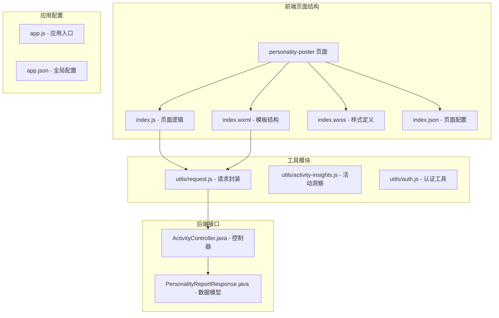
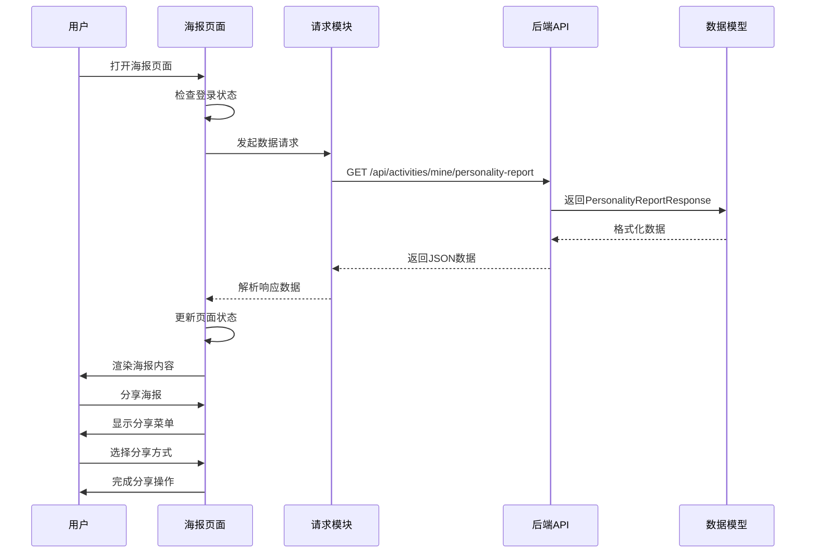
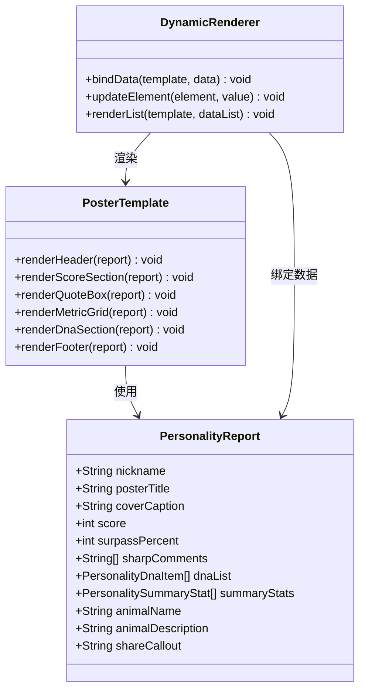
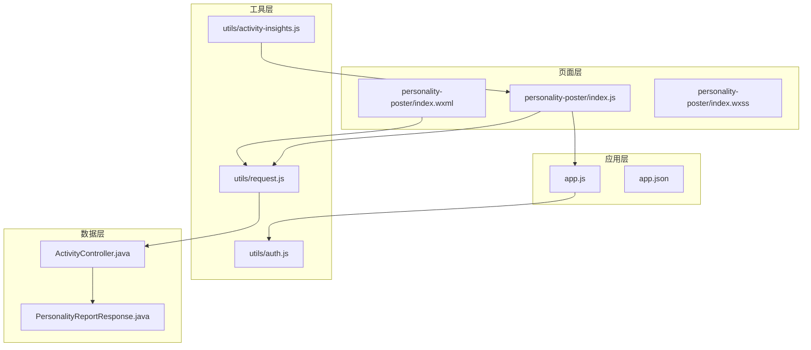
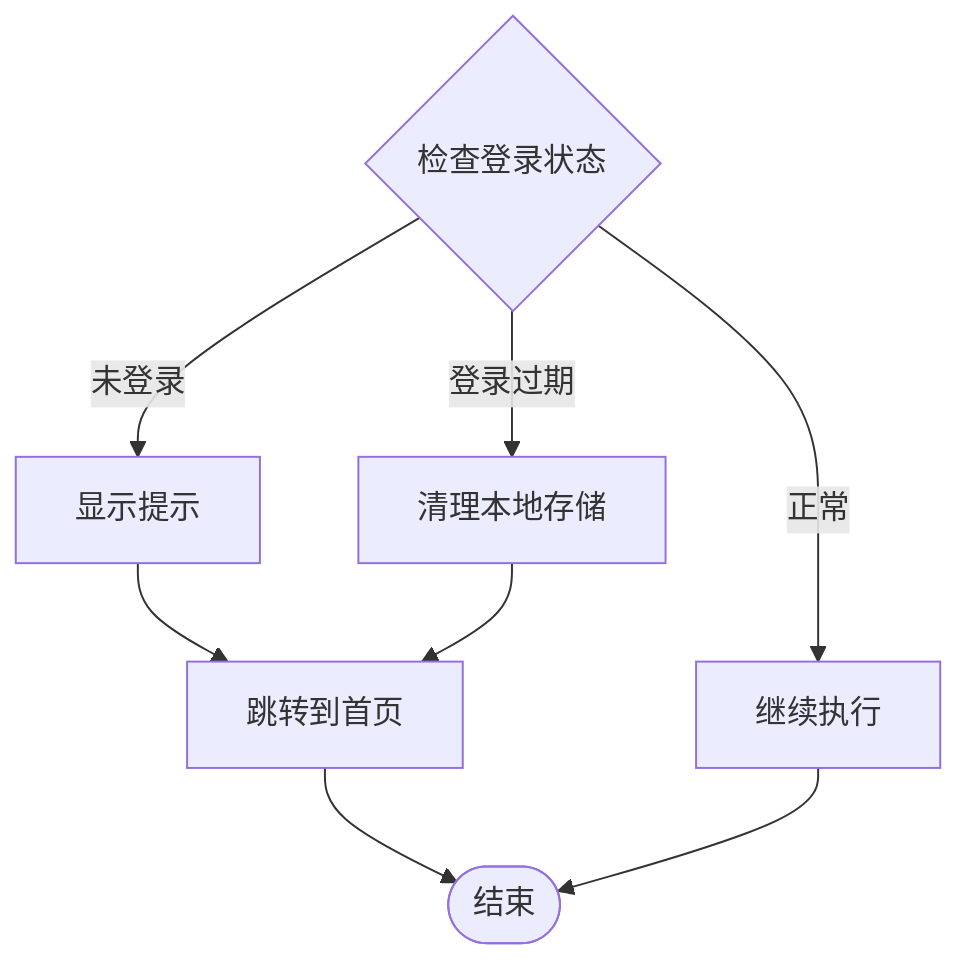

# 个人画像海报页面开发

<cite>
**本文档引用的文件**
- [frontend/pages/personality-poster/index.js](file://frontend/pages/personality-poster/index.js)
- [frontend/pages/personality-poster/index.wxml](file://frontend/pages/personality-poster/index.wxml)
- [frontend/pages/personality-poster/index.wxss](file://frontend/pages/personality-poster/index.wxss)
- [frontend/utils/request.js](file://frontend/utils/request.js)
- [frontend/app.js](file://frontend/app.js)
- [backend/activity/dto/PersonalityReportResponse.java](file://backend/src/main/java/com/playminipro/activity/dto/PersonalityReportResponse.java)
- [frontend/pages/personality/index.js](file://frontend/pages/personality/index.js)
- [frontend/utils/activity-insights.js](file://frontend/utils/activity-insights.js)
</cite>

## 目录
1. [简介](#简介)
2. [项目结构](#项目结构)
3. [核心组件](#核心组件)
4. [架构概览](#架构概览)
5. [详细组件分析](#详细组件分析)
6. [依赖关系分析](#依赖关系分析)
7. [性能考虑](#性能考虑)
8. [故障排除指南](#故障排除指南)
9. [结论](#结论)

## 简介

PlayMiniPro个人画像海报页面是一个基于微信小程序框架开发的AI人格分析展示功能。该页面实现了完整的个人画像海报生成功能，包括数据获取、动态渲染、样式适配和分享机制。本文档将详细介绍海报模板设计、数据填充、图片生成、下载分享等完整流程，并提供性能优化和用户体验提升的具体实现指导。

## 项目结构

个人画像海报页面位于前端项目的pages目录下，采用标准的小程序页面结构：



**图表来源**
- [frontend/pages/personality-poster/index.js:1-44](file://frontend/pages/personality-poster/index.js#L1-L44)
- [frontend/utils/request.js:1-107](file://frontend/utils/request.js#L1-L107)
- [backend/activity/dto/PersonalityReportResponse.java:1-30](file://backend/src/main/java/com/playminipro/activity/dto/PersonalityReportResponse.java#L1-L30)

**章节来源**
- [frontend/pages/personality-poster/index.js:1-44](file://frontend/pages/personality-poster/index.js#L1-L44)
- [frontend/pages/personality-poster/index.wxml:1-55](file://frontend/pages/personality-poster/index.wxml#L1-L55)
- [frontend/pages/personality-poster/index.wxss:1-204](file://frontend/pages/personality-poster/index.wxss#L1-L204)

## 核心组件

个人画像海报页面由以下核心组件构成：

### 页面逻辑组件
- **数据状态管理**：使用小程序Page对象管理海报数据状态
- **生命周期处理**：onShow钩子负责数据加载和页面初始化
- **分享功能**：onShareAppMessage方法实现微信分享

### 模板渲染组件
- **动态数据绑定**：通过WXML模板实现数据的动态渲染
- **条件渲染**：使用wx:if指令实现条件显示
- **列表渲染**：通过block指令渲染DNA列表和统计数据

### 样式组件
- **响应式布局**：使用rpx单位实现多设备适配
- **渐变背景**：实现深色主题的视觉效果
- **阴影效果**：增强立体感和层次感

**章节来源**
- [frontend/pages/personality-poster/index.js:3-44](file://frontend/pages/personality-poster/index.js#L3-L44)
- [frontend/pages/personality-poster/index.wxml:1-55](file://frontend/pages/personality-poster/index.wxml#L1-L55)
- [frontend/pages/personality-poster/index.wxss:1-204](file://frontend/pages/personality-poster/index.wxss#L1-L204)

## 架构概览

个人画像海报页面采用前后端分离的架构模式，实现了完整的数据流处理：



**图表来源**
- [frontend/pages/personality-poster/index.js:8-34](file://frontend/pages/personality-poster/index.js#L8-L34)
- [frontend/utils/request.js:50-80](file://frontend/utils/request.js#L50-L80)
- [backend/activity/dto/PersonalityReportResponse.java:5-29](file://backend/src/main/java/com/playminipro/activity/dto/PersonalityReportResponse.java#L5-L29)

## 详细组件分析

### 页面逻辑组件分析

#### 数据加载与状态管理
页面通过onShow生命周期函数实现数据的异步加载，确保用户每次进入页面时都能获取最新的个人画像数据。

```mermaid
flowchart TD
Start([页面显示]) --> CheckLogin{检查登录状态}
CheckLogin --> |未登录| ShowToast[显示提示信息]
CheckLogin --> |已登录| ShowShareMenu[显示分享菜单]
ShowToast --> Redirect[跳转到首页]
ShowShareMenu --> LoadData[加载个人画像数据]
LoadData --> RequestAPI[调用API接口]
RequestAPI --> Success{请求成功?}
Success --> |是| SetData[设置页面数据]
Success --> |否| CheckAuth{认证过期?}
CheckAuth --> |是| HandleAuthError[处理认证错误]
CheckAuth --> |否| ShowLoadError[显示加载失败]
HandleAuthError --> Redirect
SetData --> RenderPage[渲染页面内容]
ShowLoadError --> End([结束])
RenderPage --> End
```



**图表来源**
- [frontend/pages/personality-poster/index.js:8-34](file://frontend/pages/personality-poster/index.js#L8-L34)

#### 分享功能实现
页面实现了微信分享功能，支持分享到聊天和朋友圈，提供个性化的分享文案。

**章节来源**
- [frontend/pages/personality-poster/index.js:15-18](file://frontend/pages/personality-poster/index.js#L15-L18)
- [frontend/pages/personality-poster/index.js:36-43](file://frontend/pages/personality-poster/index.js#L36-L43)

### 模板渲染组件分析

#### 动态数据绑定机制
海报模板采用了多层次的数据绑定机制，实现了丰富的动态内容展示：



**图表来源**
- [frontend/pages/personality-poster/index.wxml:6-54](file://frontend/pages/personality-poster/index.wxml#L6-L54)
- [backend/activity/dto/PersonalityReportResponse.java:5-29](file://backend/src/main/java/com/playminipro/activity/dto/PersonalityReportResponse.java#L5-L29)

#### 响应式布局设计
海报采用响应式设计，通过rpx单位实现不同屏幕尺寸的适配：

**章节来源**
- [frontend/pages/personality-poster/index.wxml:1-55](file://frontend/pages/personality-poster/index.wxml#L1-L55)
- [frontend/pages/personality-poster/index.wxss:1-204](file://frontend/pages/personality-poster/index.wxss#L1-L204)

### 样式组件分析

#### 视觉设计系统
海报采用了深色主题设计，通过渐变背景和发光效果营造科技感：

```mermaid
graph LR
subgraph "视觉元素"
A[渐变背景<br/>radial-gradient]
B[发光效果<br/>box-shadow blur]
C[卡片容器<br/>border-radius]
D[文本样式<br/>rgba透明度]
end
subgraph "颜色方案"
E[深蓝背景<br/>#17334f]
F[橙色强调<br/>#FF8B33]
G[白色文字<br/>#FFF8F1]
H[透明遮罩<br/>rgba(255,248,241,0.1)]
end
A --> E
B --> F
C --> G
D --> H
```

**图表来源**
- [frontend/pages/personality-poster/index.wxss:1-49](file://frontend/pages/personality-poster/index.wxss#L1-L49)

**章节来源**
- [frontend/pages/personality-poster/index.wxss:1-204](file://frontend/pages/personality-poster/index.wxss#L1-L204)

## 依赖关系分析

个人画像海报页面的依赖关系体现了清晰的分层架构：



**图表来源**
- [frontend/pages/personality-poster/index.js](file://frontend/pages/personality-poster/index.js#L1)
- [frontend/utils/request.js:1-107](file://frontend/utils/request.js#L1-L107)
- [frontend/app.js:1-46](file://frontend/app.js#L1-L46)

**章节来源**
- [frontend/pages/personality-poster/index.js:1-44](file://frontend/pages/personality-poster/index.js#L1-L44)
- [frontend/utils/request.js:1-107](file://frontend/utils/request.js#L1-L107)
- [frontend/app.js:1-46](file://frontend/app.js#L1-L46)

## 性能考虑

### 数据加载优化
- **懒加载策略**：仅在页面显示时加载数据，避免不必要的网络请求
- **缓存机制**：利用小程序的本地存储机制缓存用户数据
- **错误处理**：实现完善的错误处理机制，提升用户体验

### 渲染性能优化
- **虚拟DOM优化**：合理使用wx:for和wx:key减少DOM节点重排
- **样式优化**：使用CSS3硬件加速属性提升渲染性能
- **图片优化**：通过rpx单位实现响应式图片适配

### 网络请求优化
- **请求合并**：将多个小请求合并为批量请求
- **超时控制**：设置合理的请求超时时间
- **重试机制**：实现网络异常时的自动重试

## 故障排除指南

### 常见问题及解决方案

#### 登录状态异常
当检测到用户未登录或登录过期时，页面会自动跳转到登录页面：



**图表来源**
- [frontend/pages/personality-poster/index.js:9-13](file://frontend/pages/personality-poster/index.js#L9-L13)

#### 网络请求失败
实现多重错误处理机制，包括认证错误、网络错误等：

**章节来源**
- [frontend/pages/personality-poster/index.js:25-33](file://frontend/pages/personality-poster/index.js#L25-L33)
- [frontend/utils/request.js:68-75](file://frontend/utils/request.js#L68-L75)

### 调试技巧
- **日志输出**：使用console.log输出关键数据和状态
- **断点调试**：利用微信开发者工具的调试功能
- **性能监控**：监控页面加载时间和渲染性能

## 结论

PlayMiniPro个人画像海报页面是一个功能完整、设计精良的微信小程序页面。通过合理的架构设计和优化策略，实现了流畅的用户体验和良好的性能表现。

### 主要优势
- **完整的功能实现**：从数据加载到分享的全流程覆盖
- **优秀的用户体验**：响应式设计和流畅的交互体验
- **健壮的错误处理**：完善的异常处理和用户提示机制
- **可维护的代码结构**：清晰的分层架构和模块化设计

### 技术亮点
- **动态渲染机制**：灵活的数据绑定和模板渲染
- **响应式布局**：适配多种设备和屏幕尺寸
- **性能优化策略**：从数据加载到渲染的全方位优化
- **分享集成**：深度集成微信生态的分享功能

该页面为类似的功能开发提供了优秀的参考模板，其设计理念和实现方案值得在其他项目中借鉴和应用。