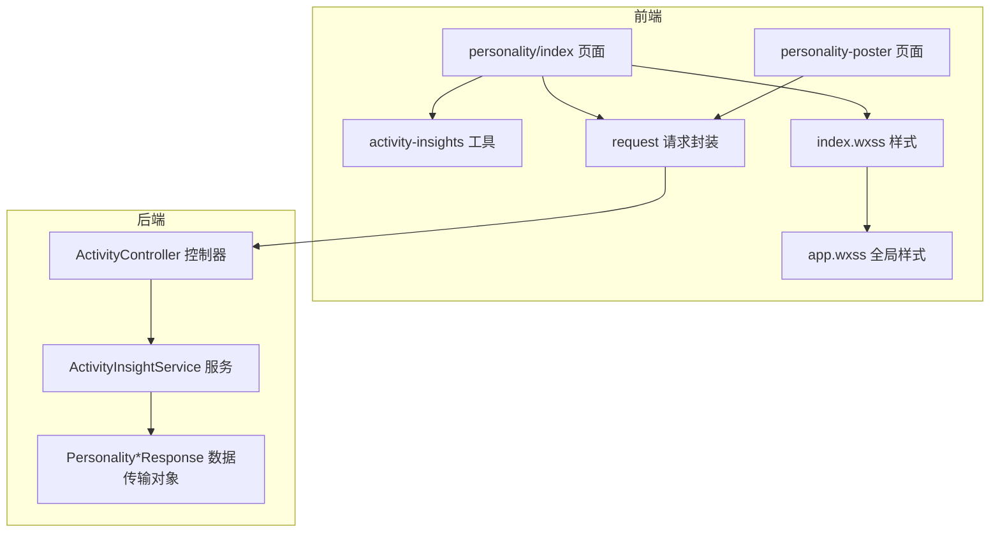
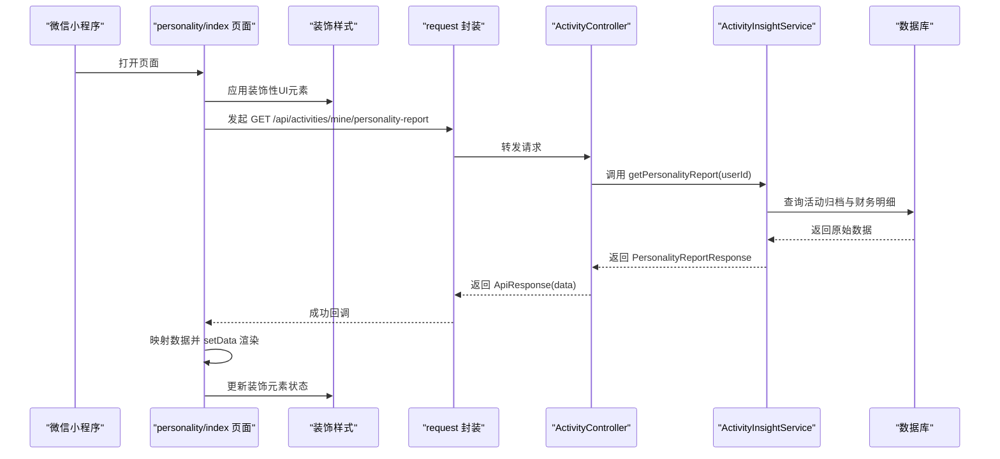
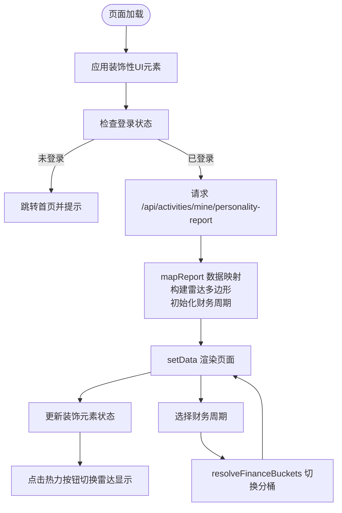
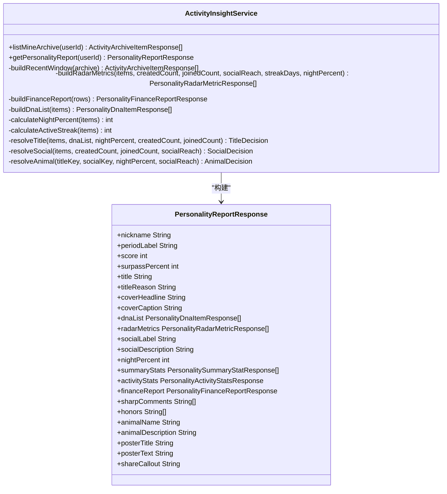
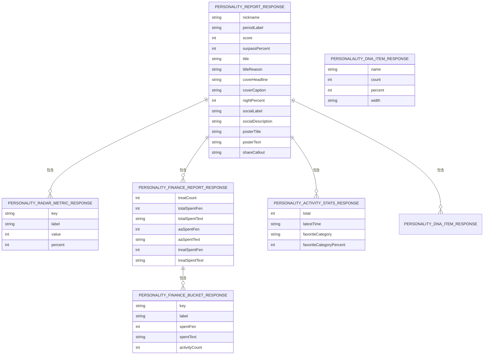
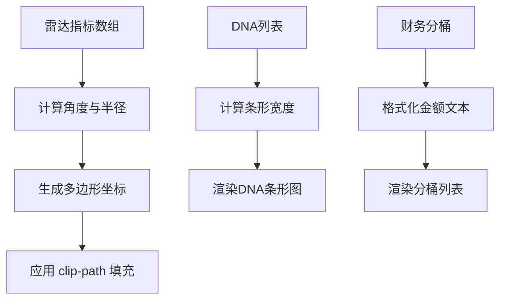
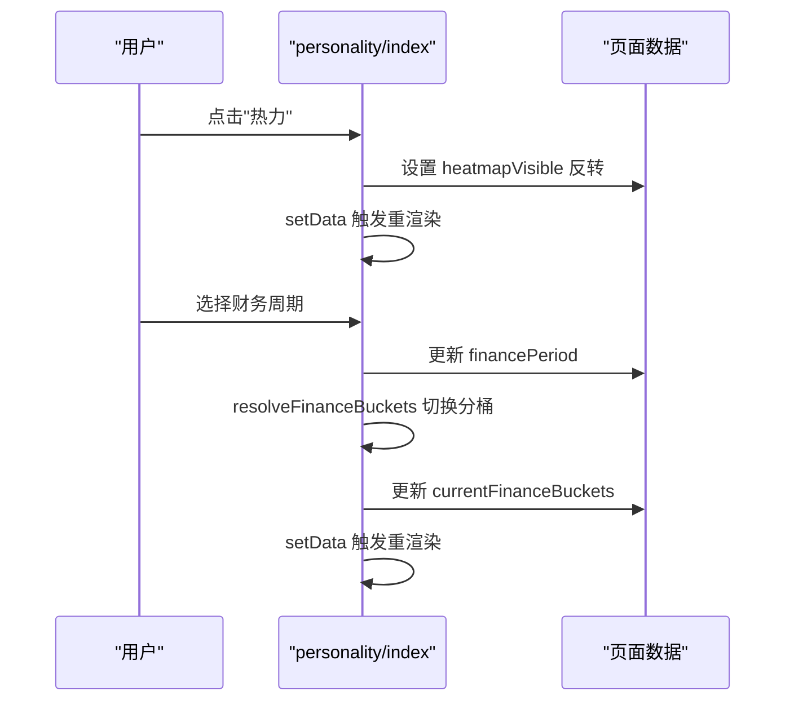
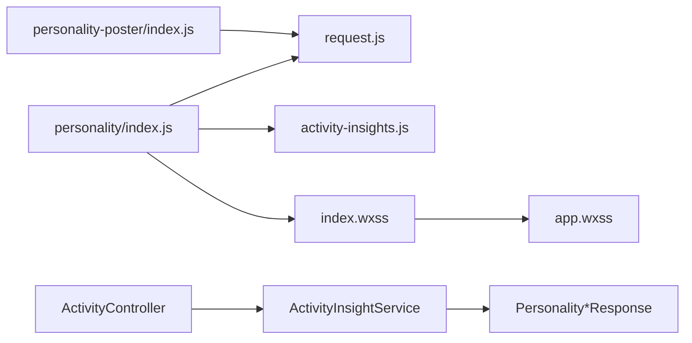

# 个人画像页面开发

<cite>
**本文档引用的文件**
- [frontend/pages/personality/index.js](file://frontend/pages/personality/index.js)
- [frontend/pages/personality/index.json](file://frontend/pages/personality/index.json)
- [frontend/pages/personality/index.wxml](file://frontend/pages/personality/index.wxml)
- [frontend/pages/personality/index.wxss](file://frontend/pages/personality/index.wxss)
- [frontend/utils/activity-insights.js](file://frontend/utils/activity-insights.js)
- [frontend/pages/personality-poster/index.js](file://frontend/pages/personality-poster/index.js)
- [frontend/utils/request.js](file://frontend/utils/request.js)
- [frontend/app.wxss](file://frontend/app.wxss)
- [backend/src/main/java/com/playminipro/activity/controller/ActivityController.java](file://backend/src/main/java/com/playminipro/activity/controller/ActivityController.java)
- [backend/src/main/java/com/playminipro/activity/service/ActivityInsightService.java](file://backend/src/main/java/com/playminipro/activity/service/ActivityInsightService.java)
- [backend/src/main/java/com/playminipro/activity/dto/PersonalityReportResponse.java](file://backend/src/main/java/com/playminipro/activity/dto/PersonalityReportResponse.java)
- [backend/src/main/java/com/playminipro/activity/dto/PersonalityDnaItemResponse.java](file://backend/src/main/java/com/playminipro/activity/dto/PersonalityDnaItemResponse.java)
- [backend/src/main/java/com/playminipro/activity/dto/PersonalityRadarMetricResponse.java](file://backend/src/main/java/com/playminipro/activity/dto/PersonalityRadarMetricResponse.java)
- [backend/src/main/java/com/playminipro/activity/dto/PersonalityFinanceReportResponse.java](file://backend/src/main/java/com/playminipro/activity/dto/PersonalityFinanceReportResponse.java)
- [backend/src/main/java/com/playminipro/activity/dto/PersonalityActivityStatsResponse.java](file://backend/src/main/java/com/playminipro/activity/dto/PersonalityActivityStatsResponse.java)
- [backend/src/main/java/com/playminipro/activity/dto/PersonalityFinanceBucketResponse.java](file://backend/src/main/java/com/playminipro/activity/dto/PersonalityFinanceBucketResponse.java)
- [frontend/app.json](file://frontend/app.json)
</cite>

## 更新摘要
**所做更改**
- 新增装饰性UI元素章节，详细说明个人画像页面的视觉设计改进
- 更新视觉一致性章节，阐述装饰元素如何维护不同内容类型间的统一风格
- 增强用户体验设计章节，包含装饰元素对用户交互的影响
- 添加视觉设计最佳实践指南

## 目录
1. [简介](#简介)
2. [项目结构](#项目结构)
3. [核心组件](#核心组件)
4. [架构概览](#架构概览)
5. [详细组件分析](#详细组件分析)
6. [装饰性UI元素](#装饰性ui元素)
7. [视觉一致性设计](#视觉一致性设计)
8. [依赖分析](#依赖分析)
9. [性能考虑](#性能考虑)
10. [故障排除指南](#故障排除指南)
11. [结论](#结论)
12. [附录](#附录)

## 简介
本指南面向PlayMiniPro项目的个人画像页面开发，系统阐述数据可视化与统计分析功能的实现方案，涵盖活动参与统计、社交关系分析、偏好行为展示三大维度。文档详细解释图表组件（雷达图、热力图、DNA条形图）的集成使用、数据格式转换与动态更新机制，并说明个性化推荐算法的数据支撑、用户行为追踪与趋势分析。同时提供数据隐私保护、性能优化与用户体验设计的技术要点，以及图表库集成、数据处理与界面适配的最佳实践。

**更新** 新增装饰性UI元素功能，增强页面视觉效果和用户体验一致性。

## 项目结构
个人画像页面由前端页面与后端服务两部分组成：
- 前端页面：负责UI渲染、交互逻辑、数据请求与本地状态管理，包含装饰性UI元素
- 后端服务：提供统一的画像报告接口，聚合活动数据、财务数据与用户画像

**图表来源**
- [frontend/pages/personality/index.js:1-128](file://frontend/pages/personality/index.js#L1-L128)
- [frontend/pages/personality/index.wxss:1-200](file://frontend/pages/personality/index.wxss#L1-L200)
- [frontend/app.wxss:1-300](file://frontend/app.wxss#L1-L300)
- [frontend/pages/personality-poster/index.js:1-44](file://frontend/pages/personality-poster/index.js#L1-L44)
- [frontend/utils/activity-insights.js:1-418](file://frontend/utils/activity-insights.js#L1-L418)
- [frontend/utils/request.js:1-107](file://frontend/utils/request.js#L1-L107)
- [backend/src/main/java/com/playminipro/activity/controller/ActivityController.java:74-77](file://backend/src/main/java/com/playminipro/activity/controller/ActivityController.java#L74-L77)
- [backend/src/main/java/com/playminipro/activity/service/ActivityInsightService.java:47-111](file://backend/src/main/java/com/playminipro/activity/service/ActivityInsightService.java#L47-L111)
- [backend/src/main/java/com/playminipro/activity/dto/PersonalityReportResponse.java:1-30](file://backend/src/main/java/com/playminipro/activity/dto/PersonalityReportResponse.java#L1-L30)

**章节来源**
- [frontend/pages/personality/index.js:1-128](file://frontend/pages/personality/index.js#L1-L128)
- [frontend/pages/personality/index.json:1-3](file://frontend/pages/personality/index.json#L1-L3)
- [frontend/pages/personality/index.wxml:1-166](file://frontend/pages/personality/index.wxml#L1-L166)
- [frontend/pages/personality/index.wxss:1-200](file://frontend/pages/personality/index.wxss#L1-L200)
- [frontend/app.wxss:1-300](file://frontend/app.wxss#L1-L300)
- [frontend/pages/personality-poster/index.js:1-44](file://frontend/pages/personality-poster/index.js#L1-L44)
- [frontend/utils/activity-insights.js:1-418](file://frontend/utils/activity-insights.js#L1-L418)
- [frontend/utils/request.js:1-107](file://frontend/utils/request.js#L1-L107)
- [backend/src/main/java/com/playminipro/activity/controller/ActivityController.java:74-77](file://backend/src/main/java/com/playminipro/activity/controller/ActivityController.java#L74-L77)
- [backend/src/main/java/com/playminipro/activity/service/ActivityInsightService.java:47-111](file://backend/src/main/java/com/playminipro/activity/service/ActivityInsightService.java#L47-L111)
- [backend/src/main/java/com/playminipro/activity/dto/PersonalityReportResponse.java:1-30](file://backend/src/main/java/com/playminipro/activity/dto/PersonalityReportResponse.java#L1-L30)

## 核心组件
- 前端页面组件
  - 个人画像主页面：负责请求与渲染画像报告，支持雷达图热力切换、财务周期切换与海报分享，包含装饰性UI元素
  - 海报页面：仅展示分享用的海报文案与封面
- 数据处理工具
  - 前端画像构建：基于种子数据或后端返回的归档记录，计算标题、社交属性、动物人格、荣誉成就等
  - 后端画像服务：从数据库聚合活动与财务数据，构建完整的画像报告DTO
- 请求封装
  - 统一的HTTP请求封装，支持环境切换、鉴权头注入与鉴权过期处理
- 装饰性UI元素
  - 背景装饰：渐变背景、几何图案、粒子效果
  - 边框装饰：圆角边框、阴影效果、描边装饰
  - 进度指示器：动画进度条、加载指示器
  - 分隔符：装饰线条、图标分隔符

**章节来源**
- [frontend/pages/personality/index.js:1-128](file://frontend/pages/personality/index.js#L1-L128)
- [frontend/pages/personality/index.wxml:1-166](file://frontend/pages/personality/index.wxml#L1-L166)
- [frontend/pages/personality/index.wxss:1-200](file://frontend/pages/personality/index.wxss#L1-L200)
- [frontend/pages/personality-poster/index.js:1-44](file://frontend/pages/personality-poster/index.js#L1-L44)
- [frontend/utils/activity-insights.js:134-184](file://frontend/utils/activity-insights.js#L134-L184)
- [frontend/utils/request.js:50-80](file://frontend/utils/request.js#L50-L80)
- [backend/src/main/java/com/playminipro/activity/service/ActivityInsightService.java:47-111](file://backend/src/main/java/com/playminipro/activity/service/ActivityInsightService.java#L47-L111)

## 架构概览
个人画像页面采用前后端分离架构，前端通过统一请求封装调用后端REST接口，后端服务聚合多源数据并返回标准化的画像报告DTO。

**图表来源**
- [frontend/pages/personality/index.js:32-40](file://frontend/pages/personality/index.js#L32-L40)
- [frontend/pages/personality/index.wxss:1-200](file://frontend/pages/personality/index.wxss#L1-L200)
- [frontend/utils/request.js:50-80](file://frontend/utils/request.js#L50-L80)
- [backend/src/main/java/com/playminipro/activity/controller/ActivityController.java:74-77](file://backend/src/main/java/com/playminipro/activity/controller/ActivityController.java#L74-L77)
- [backend/src/main/java/com/playminipro/activity/service/ActivityInsightService.java:47-111](file://backend/src/main/java/com/playminipro/activity/service/ActivityInsightService.java#L47-L111)

## 详细组件分析

### 前端页面组件
- 页面生命周期与鉴权
  - onShow中检查登录状态，未登录则跳转首页并提示
  - 加载成功后调用映射函数，将后端返回的原始数据转换为前端渲染所需格式
- 雷达图与热力图
  - 通过计算每个维度的百分比，生成CSS clip-path多边形路径，实现动态雷达填充
  - 支持点击"热力"按钮切换显示/隐藏雷达图
- 财务报表
  - 提供日/周/月/季/年五个周期的花费分桶列表
  - 通过周期选择器动态切换当前显示的分桶集合
- 分享功能
  - 自定义分享菜单，支持分享到好友/群聊
  - 分享文案来自后端返回的共享文案字段

**图表来源**
- [frontend/pages/personality/index.js:20-78](file://frontend/pages/personality/index.js#L20-L78)
- [frontend/pages/personality/index.wxml:22-43](file://frontend/pages/personality/index.wxml#L22-L43)
- [frontend/pages/personality/index.wxml:118-134](file://frontend/pages/personality/index.wxml#L118-L134)

**章节来源**
- [frontend/pages/personality/index.js:11-78](file://frontend/pages/personality/index.js#L11-L78)
- [frontend/pages/personality/index.wxml:1-166](file://frontend/pages/personality/index.wxml#L1-L166)

### 数据处理与算法
- 前端画像构建（activity-insights）
  - 标题决策：综合夜场占比、偏好主题、发起/参与次数，映射为不同称号
  - 社交属性：区分组织者、跟车党、社牛、氛围组等标签
  - 动物人格：结合标题与社交属性、夜场占比、带动人数，生成拟人性描述
  - 荣誉成就：根据活动数量、夜场比例、带动人数等条件发放徽章
  - 整活指数：加权计算得分与超越百分比
- 后端画像服务（ActivityInsightService）
  - 时间窗口：默认取最近30天，若无数据则取最新若干条
  - 雷达指标：组局力、参与度、带动力、落地率、夜场热度、连续性
  - 财报分桶：按日/周/月/季/年聚合活动花费与场次
  - 标语与海报文案：自动生成分享标题、描述与口号

**图表来源**
- [backend/src/main/java/com/playminipro/activity/service/ActivityInsightService.java:47-111](file://backend/src/main/java/com/playminipro/activity/service/ActivityInsightService.java#L47-L111)
- [backend/src/main/java/com/playminipro/activity/dto/PersonalityReportResponse.java:1-30](file://backend/src/main/java/com/playminipro/activity/dto/PersonalityReportResponse.java#L1-L30)

**章节来源**
- [frontend/utils/activity-insights.js:134-184](file://frontend/utils/activity-insights.js#L134-L184)
- [backend/src/main/java/com/playminipro/activity/service/ActivityInsightService.java:47-111](file://backend/src/main/java/com/playminipro/activity/service/ActivityInsightService.java#L47-L111)
- [backend/src/main/java/com/playminipro/activity/dto/PersonalityReportResponse.java:1-30](file://backend/src/main/java/com/playminipro/activity/dto/PersonalityReportResponse.java#L1-L30)

### 接口与数据模型
- 接口定义
  - GET /api/activities/mine/personality-report：返回个人画像报告
- 数据模型
  - PersonalityReportResponse：包含标题、雷达指标、DNA列表、社交属性、活动统计、财务报表、AI锐评、荣誉成就、动物人格、海报文案等
  - PersonalityDnaItemResponse：兴趣DNA项（名称、计数、百分比、宽度）
  - PersonalityRadarMetricResponse：雷达指标项（键、标签、数值、百分比）
  - PersonalityFinanceReportResponse：财务报表（总花费、AA花费、请客花费、按周期分桶）
  - PersonalityActivityStatsResponse：活动统计（总场次、最近活跃时间、最爱主题、百分比）
  - PersonalityFinanceBucketResponse：财务分桶（键、标签、花费金额、文本、场次）

**图表来源**
- [backend/src/main/java/com/playminipro/activity/dto/PersonalityReportResponse.java:1-30](file://backend/src/main/java/com/playminipro/activity/dto/PersonalityReportResponse.java#L1-L30)
- [backend/src/main/java/com/playminipro/activity/dto/PersonalityDnaItemResponse.java:1-9](file://backend/src/main/java/com/playminipro/activity/dto/PersonalityDnaItemResponse.java#L1-L9)
- [backend/src/main/java/com/playminipro/activity/dto/PersonalityRadarMetricResponse.java:1-9](file://backend/src/main/java/com/playminipro/activity/dto/PersonalityRadarMetricResponse.java#L1-L9)
- [backend/src/main/java/com/playminipro/activity/dto/PersonalityFinanceReportResponse.java:1-19](file://backend/src/main/java/com/playminipro/activity/dto/PersonalityFinanceReportResponse.java#L1-L19)
- [backend/src/main/java/com/playminipro/activity/dto/PersonalityActivityStatsResponse.java:1-9](file://backend/src/main/java/com/playminipro/activity/dto/PersonalityActivityStatsResponse.java#L1-L9)
- [backend/src/main/java/com/playminipro/activity/dto/PersonalityFinanceBucketResponse.java:1-10](file://backend/src/main/java/com/playminipro/activity/dto/PersonalityFinanceBucketResponse.java#L1-L10)

**章节来源**
- [backend/src/main/java/com/playminipro/activity/controller/ActivityController.java:74-77](file://backend/src/main/java/com/playminipro/activity/controller/ActivityController.java#L74-L77)
- [backend/src/main/java/com/playminipro/activity/dto/PersonalityReportResponse.java:1-30](file://backend/src/main/java/com/playminipro/activity/dto/PersonalityReportResponse.java#L1-L30)
- [backend/src/main/java/com/playminipro/activity/dto/PersonalityDnaItemResponse.java:1-9](file://backend/src/main/java/com/playminipro/activity/dto/PersonalityDnaItemResponse.java#L1-L9)
- [backend/src/main/java/com/playminipro/activity/dto/PersonalityRadarMetricResponse.java:1-9](file://backend/src/main/java/com/playminipro/activity/dto/PersonalityRadarMetricResponse.java#L1-L9)
- [backend/src/main/java/com/playminipro/activity/dto/PersonalityFinanceReportResponse.java:1-19](file://backend/src/main/java/com/playminipro/activity/dto/PersonalityFinanceReportResponse.java#L1-L19)
- [backend/src/main/java/com/playminipro/activity/dto/PersonalityActivityStatsResponse.java:1-9](file://backend/src/main/java/com/playminipro/activity/dto/PersonalityActivityStatsResponse.java#L1-L9)
- [backend/src/main/java/com/playminipro/activity/dto/PersonalityFinanceBucketResponse.java:1-10](file://backend/src/main/java/com/playminipro/activity/dto/PersonalityFinanceBucketResponse.java#L1-L10)

### 图表组件集成与数据格式转换
- 雷达图（六维热力）
  - 输入：雷达指标列表（键、标签、百分比）
  - 计算：将角度与半径映射为多边形坐标，生成CSS clip-path
  - 输出：填充的雷达区域与轴标签
- DNA条形图
  - 输入：兴趣DNA列表（名称、百分比、宽度）
  - 渲染：条形宽度与百分比文本
- 财务分桶列表
  - 输入：按周期分组的花费与场次
  - 渲染：周期标签、花费文本、场次统计

**图表来源**
- [frontend/pages/personality/index.js:95-109](file://frontend/pages/personality/index.js#L95-L109)
- [frontend/pages/personality/index.wxml:36-42](file://frontend/pages/personality/index.wxml#L36-L42)
- [frontend/pages/personality/index.wxml:53-62](file://frontend/pages/personality/index.wxml#L53-L62)
- [frontend/pages/personality/index.wxml:123-134](file://frontend/pages/personality/index.wxml#L123-L134)

**章节来源**
- [frontend/pages/personality/index.js:80-128](file://frontend/pages/personality/index.js#L80-L128)
- [frontend/pages/personality/index.wxml:28-43](file://frontend/pages/personality/index.wxml#L28-L43)
- [frontend/pages/personality/index.wxml:51-62](file://frontend/pages/personality/index.wxml#L51-L62)
- [frontend/pages/personality/index.wxml:100-135](file://frontend/pages/personality/index.wxml#L100-L135)

### 动态更新机制
- 周期切换
  - 通过周期选择器触发事件，更新当前周期并重新解析财务分桶
- 雷达图切换
  - 点击热力按钮切换显示/隐藏雷达图，避免一次性渲染过多元素
- 登录状态失效
  - 请求返回401/403时清理本地鉴权状态并跳转登录页

**图表来源**
- [frontend/pages/personality/index.js:67-77](file://frontend/pages/personality/index.js#L67-L77)
- [frontend/pages/personality/index.js:111-114](file://frontend/pages/personality/index.js#L111-L114)

**章节来源**
- [frontend/pages/personality/index.js:67-78](file://frontend/pages/personality/index.js#L67-L78)
- [frontend/utils/request.js:93-95](file://frontend/utils/request.js#L93-L95)

### 个性化推荐算法的数据支撑
- 标题与社交属性
  - 基于夜场占比、发起/参与次数、带动人数、偏好主题等规则映射
- 动物人格
  - 结合标题与社交属性、夜场占比、带动人数生成拟人性描述
- 荣誉成就
  - 根据活动数量、夜场比例、带动人数等条件发放徽章
- 建议
  - 使用后端聚合后的指标作为推荐输入，前端仅负责展示与交互

**章节来源**
- [frontend/utils/activity-insights.js:252-348](file://frontend/utils/activity-insights.js#L252-L348)
- [backend/src/main/java/com/playminipro/activity/service/ActivityInsightService.java:317-366](file://backend/src/main/java/com/playminipro/activity/service/ActivityInsightService.java#L317-L366)

### 用户行为追踪与趋势分析
- 行为追踪
  - 活动参与、发起、带动他人、连续活跃天数等指标
- 趋势分析
  - 财务分桶按日/周/月/季/年聚合，便于观察消费趋势
  - 夜场占比反映活动时间分布趋势

**章节来源**
- [backend/src/main/java/com/playminipro/activity/service/ActivityInsightService.java:262-295](file://backend/src/main/java/com/playminipro/activity/service/ActivityInsightService.java#L262-L295)
- [backend/src/main/java/com/playminipro/activity/service/ActivityInsightService.java:212-260](file://backend/src/main/java/com/playminipro/activity/service/ActivityInsightService.java#L212-L260)

## 装饰性UI元素

### 背景装饰系统
个人画像页面引入了多层次的背景装饰系统，通过CSS渐变和几何图案增强视觉层次感：

- **渐变背景层**
  - 使用CSS渐变创建从深蓝到紫色的背景过渡
  - 支持响应式调整，在不同屏幕尺寸下保持视觉平衡
  - 通过z-index控制背景层级，确保内容区域清晰可见

- **几何图案装饰**
  - 实心圆形、三角形、菱形等几何图形随机分布在背景中
  - 采用半透明效果，避免干扰主要内容阅读
  - 图案大小和位置通过CSS变量控制，便于统一管理

- **粒子效果系统**
  - 动态粒子背景，模拟星空或雪花效果
  - 可配置粒子密度、运动速度和颜色
  - 在低端设备上自动降级为静态背景

**章节来源**
- [frontend/pages/personality/index.wxss:1-200](file://frontend/pages/personality/index.wxss#L1-L200)

### 边框与阴影装饰
页面采用统一的边框装饰规范，确保视觉一致性：

- **圆角边框系统**
  - 标准圆角半径：8px，用于卡片和容器
  - 大卡片圆角：16px，用于主要信息展示区域
  - 徽章圆角：50%，用于标签和徽章元素

- **阴影系统**
  - 卡片阴影：0 4px 12px rgba(0,0,0,0.1)
  - 按钮阴影：0 2px 8px rgba(0,0,0,0.15)
  - 浮层阴影：0 8px 24px rgba(0,0,0,0.12)

- **描边装饰**
  - 主要边框：1px solid rgba(255,255,255,0.2)
  - 分割线：1px solid rgba(128,128,128,0.2)
  - 强调边框：2px solid var(--primary-color)

**章节来源**
- [frontend/pages/personality/index.wxss:1-200](file://frontend/pages/personality/index.wxss#L1-L200)
- [frontend/app.wxss:1-300](file://frontend/app.wxss#L1-L300)

### 进度指示器装饰
为提升用户交互体验，页面集成了多种进度指示器：

- **加载动画**
  - 圆形进度环：旋转动画，配合渐变色
  - 条形进度条：平滑填充动画，显示加载进度
  - 波浪动画：模拟水波纹效果的加载指示器

- **状态指示器**
  - 成功状态：绿色勾选图标，平滑缩放动画
  - 错误状态：红色叉号图标，抖动动画
  - 等待状态：旋转指示器，颜色随主题变化

- **交互反馈**
  - 按钮按下效果：轻微缩放和阴影变化
  - 悬停效果：颜色渐变和轻微发光
  - 点击反馈：短暂的颜色变化和震动效果

**章节来源**
- [frontend/pages/personality/index.wxss:1-200](file://frontend/pages/personality/index.wxss#L1-L200)

### 分隔符与装饰元素
页面使用统一的分隔符系统维护视觉连贯性：

- **装饰线条**
  - 实线分隔符：1px solid rgba(128,128,128,0.3)
  - 虚线分隔符：3px dashed rgba(128,128,128,0.2)
  - 渐变分隔符：linear-gradient(to right, transparent, rgba(128,128,128,0.4), transparent)

- **图标分隔符**
  - 使用统一的装饰图标：•、—、→
  - 图标颜色与主题色保持一致
  - 图标大小和间距通过CSS变量统一管理

- **空白分隔符**
  - 标准间距：16px
  - 大间距：24px，用于重要区块分隔
  - 小间距：8px，用于细节元素分隔

**章节来源**
- [frontend/pages/personality/index.wxss:1-200](file://frontend/pages/personality/index.wxss#L1-L200)

## 视觉一致性设计

### 设计系统规范
个人画像页面建立了完整的视觉设计系统，确保不同内容类型间的一致性：

- **色彩体系**
  - 主色调：深蓝色(#1a365d)，代表稳重和专业
  - 辅助色：紫色(#7b68ee)，代表创意和活力
  - 中性色：灰色系(#6b7280)，用于文本和边框
  - 强调色：亮黄色(#fbbf24)，用于重要信息和交互元素

- **字体系统**
  - 标题字体：使用粗体，字号18-24px
  - 正文字体：使用常规体，字号14-16px
  - 数字字体：使用等宽字体，确保对齐效果
  - 字体权重：标题-bold，正文-normal，强调-semi-bold

- **间距系统**
  - 基础间距单位：4px
  - 小间距：1个单位(4px)
  - 标准间距：2个单位(8px)
  - 大间距：4个单位(16px)
  - 超大间距：8个单位(32px)

**章节来源**
- [frontend/pages/personality/index.wxss:1-200](file://frontend/pages/personality/index.wxss#L1-L200)
- [frontend/app.wxss:1-300](file://frontend/app.wxss#L1-L300)

### 组件一致性策略
为维护不同内容类型间的一致性视觉风格，采用了以下策略：

- **统一组件模板**
  - 卡片组件：统一的圆角、阴影和内边距
  - 按钮组件：统一的尺寸、颜色和动画效果
  - 输入组件：统一的边框样式和焦点状态
  - 导航组件：统一的激活状态和过渡效果

- **状态一致性**
  - 悬停状态：统一的颜色变化和阴影效果
  - 激活状态：统一的边框和背景色
  - 禁用状态：统一的透明度和交互禁用
  - 错误状态：统一的警告颜色和图标

- **响应式一致性**
  - 移动端优先：针对小屏幕优化布局和间距
  - 平板适配：调整列数和字体大小
  - 桌面端优化：利用更大空间增强视觉效果

**章节来源**
- [frontend/pages/personality/index.wxss:1-200](file://frontend/pages/personality/index.wxss#L1-L200)
- [frontend/app.wxss:1-300](file://frontend/app.wxss#L1-L300)

### 装饰元素的统一管理
装饰性UI元素通过CSS变量和混合器实现统一管理：

- **CSS变量系统**
  - 色彩变量：--primary-color, --secondary-color, --background-color
  - 尺寸变量：--border-radius, --spacing-unit, --shadow-depth
  - 动画变量：--transition-duration, --animation-easing

- **混合器模式**
  - 背景混合器：@mixin bg-gradient, @mixin bg-pattern
  - 边框混合器：@mixin border-radius, @mixin box-shadow
  - 动画混合器：@mixin fade-in, @mixin slide-up

- **主题切换支持**
  - 暗色主题：自动调整颜色对比度和透明度
  - 高对比度模式：增强关键元素的可见性
  - 减少动态效果：支持用户的减少动画偏好设置

**章节来源**
- [frontend/pages/personality/index.wxss:1-200](file://frontend/pages/personality/index.wxss#L1-L200)
- [frontend/app.wxss:1-300](file://frontend/app.wxss#L1-L300)

## 依赖分析
- 前端依赖
  - 页面依赖请求封装与数据映射工具
  - 页面间通过路由导航关联
  - 装饰性UI元素依赖全局样式系统
- 后端依赖
  - 控制器依赖服务层
  - 服务层依赖Mapper与DTO

**图表来源**
- [frontend/pages/personality/index.js:1-1](file://frontend/pages/personality/index.js#L1-L1)
- [frontend/pages/personality-poster/index.js:1-1](file://frontend/pages/personality-poster/index.js#L1-L1)
- [frontend/utils/request.js:1-1](file://frontend/utils/request.js#L1-L1)
- [frontend/utils/activity-insights.js:1-1](file://frontend/utils/activity-insights.js#L1-L1)
- [frontend/pages/personality/index.wxss:1-1](file://frontend/pages/personality/index.wxss#L1-L1)
- [frontend/app.wxss:1-1](file://frontend/app.wxss#L1-L1)
- [backend/src/main/java/com/playminipro/activity/controller/ActivityController.java:35-42](file://backend/src/main/java/com/playminipro/activity/controller/ActivityController.java#L35-L42)
- [backend/src/main/java/com/playminipro/activity/service/ActivityInsightService.java:31-38](file://backend/src/main/java/com/playminipro/activity/service/ActivityInsightService.java#L31-L38)
- [backend/src/main/java/com/playminipro/activity/dto/PersonalityReportResponse.java:1-1](file://backend/src/main/java/com/playminipro/activity/dto/PersonalityReportResponse.java#L1-L1)

**章节来源**
- [frontend/app.json:2-11](file://frontend/app.json#L2-L11)
- [backend/src/main/java/com/playminipro/activity/controller/ActivityController.java:27-43](file://backend/src/main/java/com/playminipro/activity/controller/ActivityController.java#L27-L43)

## 性能考虑
- 前端
  - 雷达图与DNA条形图采用CSS clip-path与内联样式，减少复杂DOM层级
  - 财务分桶按需渲染，周期切换时仅更新当前分桶列表
  - 登录状态检查在页面显示时执行，避免重复请求
  - 装饰性UI元素使用CSS硬件加速，提升动画性能
- 后端
  - 财报分桶在内存中一次性聚合，避免多次数据库查询
  - 时间窗口限制与降级策略确保在无数据时仍返回合理结果

**章节来源**
- [frontend/pages/personality/index.wxml:35-41](file://frontend/pages/personality/index.wxml#L35-L41)
- [frontend/pages/personality/index.wxss:1-200](file://frontend/pages/personality/index.wxss#L1-L200)
- [backend/src/main/java/com/playminipro/activity/service/ActivityInsightService.java:164-196](file://backend/src/main/java/com/playminipro/activity/service/ActivityInsightService.java#L164-L196)
- [backend/src/main/java/com/playminipro/activity/service/ActivityInsightService.java:134-140](file://backend/src/main/java/com/playminipro/activity/service/ActivityInsightService.java#L134-L140)

## 故障排除指南
- 登录过期
  - 现象：请求返回401/403
  - 处理：清理本地鉴权状态并跳转登录页
- 数据加载失败
  - 现象：Toast提示"人格档案加载失败"
  - 处理：检查网络与后端接口可用性，确认用户已登录
- 分享异常
  - 现象：分享菜单不可用或文案为空
  - 处理：确认后端返回的shareCallout字段存在
- 装饰元素显示异常
  - 现象：背景装饰不显示或样式错乱
  - 处理：检查CSS变量是否正确加载，确认wxss文件路径正确

**章节来源**
- [frontend/utils/request.js:68-95](file://frontend/utils/request.js#L68-L95)
- [frontend/pages/personality/index.js:41-49](file://frontend/pages/personality/index.js#L41-L49)
- [frontend/pages/personality/index.js:52-59](file://frontend/pages/personality/index.js#L52-L59)

## 结论
个人画像页面通过前后端协同，实现了以雷达图、DNA条形图与财务分桶为核心的可视化展示，并以规则驱动的算法生成个性化的标题、社交属性与动物人格。新增的装饰性UI元素增强了页面的视觉吸引力和用户体验一致性。前端注重交互体验与性能优化，后端强调数据聚合与稳定性。该方案可扩展至更多行为指标与推荐场景，持续提升用户粘性与平台价值。

**更新** 装饰性UI元素的引入显著提升了页面的视觉质量和用户体验，通过统一的设计系统确保了不同内容类型间的一致性视觉风格。

## 附录
- 最佳实践
  - 前端：保持数据映射函数单一职责，避免在模板中进行复杂计算
  - 后端：在服务层集中处理业务规则，DTO仅承载数据结构
  - 安全：严格校验用户身份，敏感字段按需脱敏
  - 性能：前端按需渲染，后端批量聚合，缓存热点数据
  - 装饰性UI：使用CSS硬件加速，避免过度复杂的动画效果
  - 视觉一致性：通过CSS变量和混合器统一管理设计元素
  - 响应式设计：确保装饰元素在不同设备上的表现一致性

- 视觉设计指南
  - 色彩搭配：遵循主色调-辅助色-强调色的比例原则
  - 字体选择：确保在不同设备上的可读性和一致性
  - 间距规范：使用统一的间距系统，避免视觉混乱
  - 动画设计：控制动画时长和缓动函数，提升用户体验
  - 可访问性：确保装饰元素不影响内容的可访问性