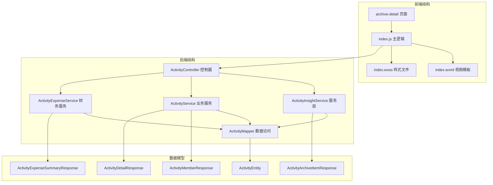
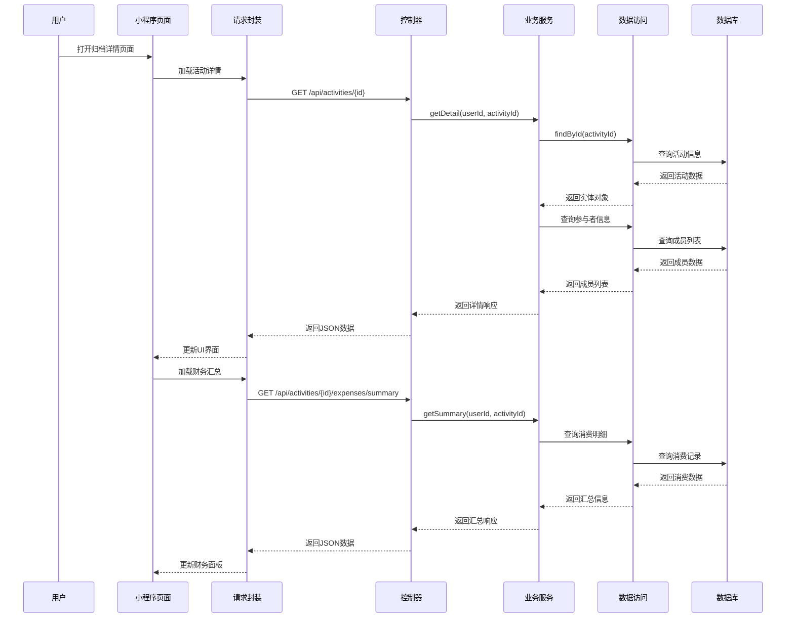
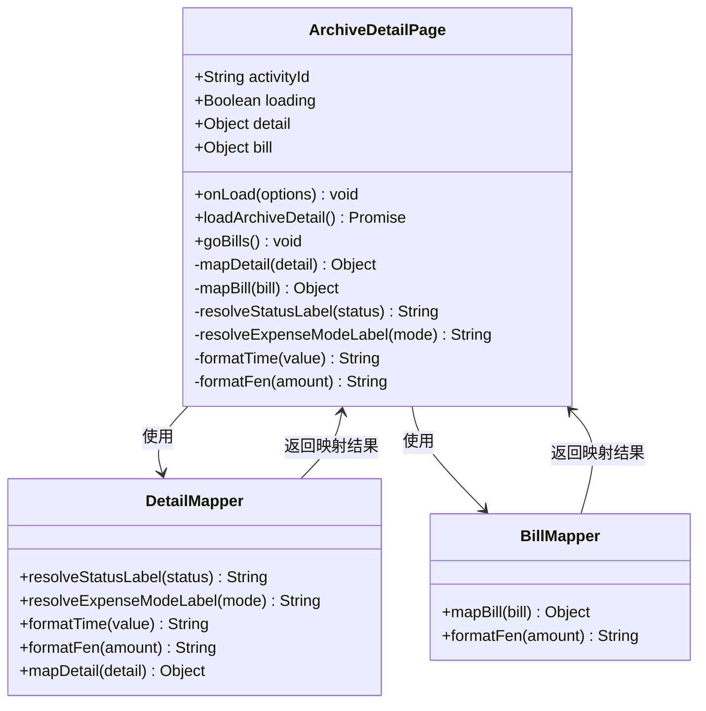
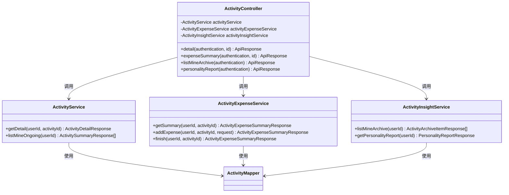
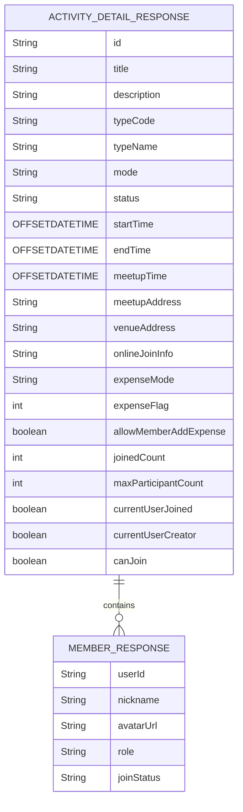
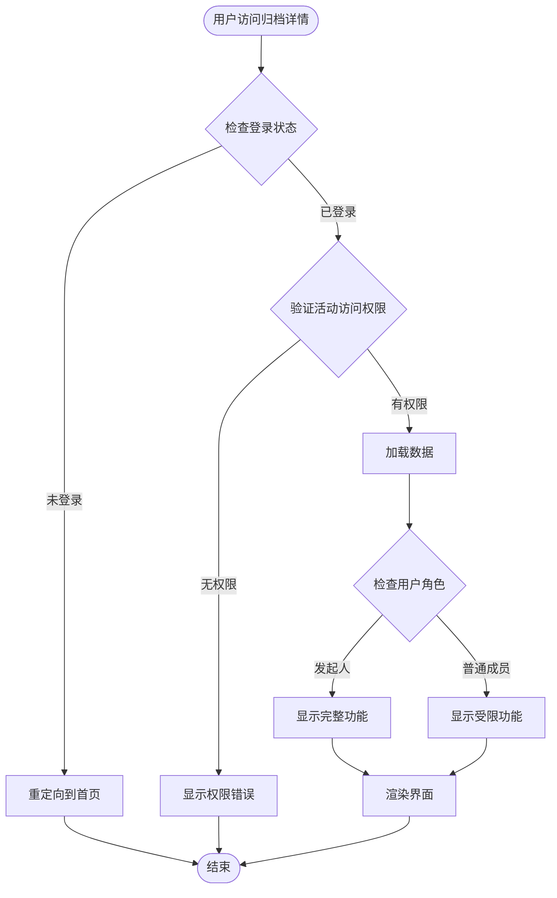
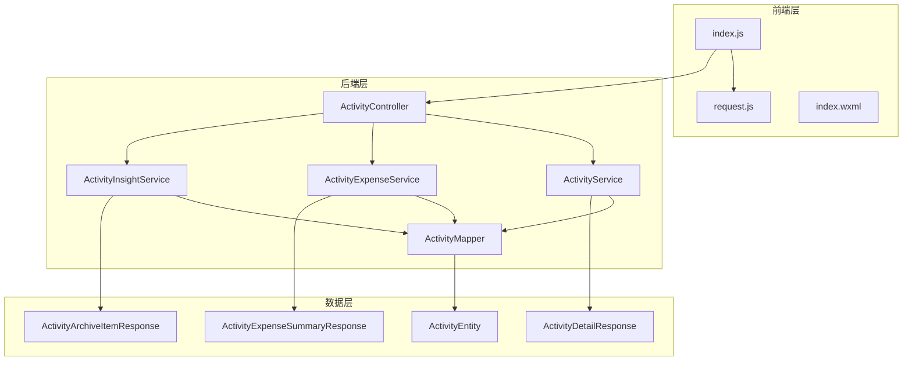
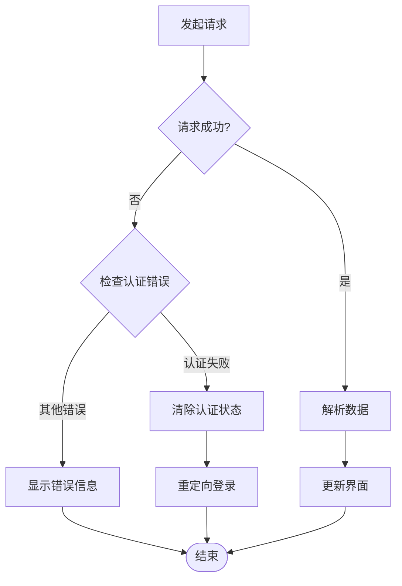

# 归档详情页面开发

<cite>
**本文档引用的文件**
- [ActivityController.java](file://backend/src/main/java/com/playminipro/activity/controller/ActivityController.java)
- [ActivityInsightService.java](file://backend/src/main/java/com/playminipro/activity/service/ActivityInsightService.java)
- [ActivityService.java](file://backend/src/main/java/com/playminipro/activity/service/ActivityService.java)
- [ActivityExpenseService.java](file://backend/src/main/java/com/playminipro/activity/service/ActivityExpenseService.java)
- [ActivityMapper.java](file://backend/src/main/java/com/playminipro/activity/mapper/ActivityMapper.java)
- [ActivityDetailResponse.java](file://backend/src/main/java/com/playminipro/activity/dto/ActivityDetailResponse.java)
- [ActivityArchiveItemResponse.java](file://backend/src/main/java/com/playminipro/activity/dto/ActivityArchiveItemResponse.java)
- [ActivityExpenseSummaryResponse.java](file://backend/src/main/java/com/playminipro/activity/dto/ActivityExpenseSummaryResponse.java)
- [ActivityMemberResponse.java](file://backend/src/main/java/com/playminipro/activity/dto/ActivityMemberResponse.java)
- [ActivityEntity.java](file://backend/src/main/java/com/playminipro/activity/entity/ActivityEntity.java)
- [V1__init_core_tables.sql](file://backend/src/main/resources/db/migration/V1__init_core_tables.sql)
- [index.js](file://frontend/pages/archive-detail/index.js)
- [index.wxml](file://frontend/pages/archive-detail/index.wxml)
- [request.js](file://frontend/utils/request.js)
- [JwtAuthenticationFilter.java](file://backend/src/main/java/com/playminipro/common/security/JwtAuthenticationFilter.java)
</cite>

## 目录
1. [简介](#简介)
2. [项目结构](#项目结构)
3. [核心组件](#核心组件)
4. [架构概览](#架构概览)
5. [详细组件分析](#详细组件分析)
6. [依赖关系分析](#依赖关系分析)
7. [性能考虑](#性能考虑)
8. [故障排除指南](#故障排除指南)
9. [结论](#结论)

## 简介

PlayMiniPro归档详情页面是项目中的重要功能模块，负责展示历史活动的完整信息和归档数据。该页面实现了历史活动查看、归档数据展示、统计数据回放分析等核心功能，为用户提供了一个完整的活动历史回顾体验。

本页面采用前后端分离架构，前端使用微信小程序框架，后端基于Spring Boot和MyBatis构建，实现了完整的活动生命周期管理和数据归档功能。

## 项目结构

归档详情页面位于前端pages目录下的archive-detail子目录中，采用标准的小程序页面结构：



**图表来源**
- [index.js:1-132](file://frontend/pages/archive-detail/index.js#L1-L132)
- [ActivityController.java:27-43](file://backend/src/main/java/com/playminipro/activity/controller/ActivityController.java#L27-L43)

**章节来源**
- [index.js:1-132](file://frontend/pages/archive-detail/index.js#L1-L132)
- [index.wxml:1-109](file://frontend/pages/archive-detail/index.wxml#L1-L109)

## 核心组件

归档详情页面的核心组件包括：

### 前端组件
- **主控制器**: 处理页面生命周期和数据加载
- **请求封装**: 统一的HTTP请求处理和认证管理
- **数据映射**: 将后端数据转换为前端显示格式

### 后端组件
- **控制器层**: 提供RESTful API接口
- **服务层**: 实现业务逻辑和数据处理
- **数据访问层**: 负责数据库操作和查询优化

### 数据模型
- **活动详情响应**: 包含完整的活动信息
- **归档项目响应**: 历史活动摘要信息
- **财务汇总响应**: 活动消费和结算信息

**章节来源**
- [ActivityController.java:27-43](file://backend/src/main/java/com/playminipro/activity/controller/ActivityController.java#L27-L43)
- [ActivityDetailResponse.java:6-29](file://backend/src/main/java/com/playminipro/activity/dto/ActivityDetailResponse.java#L6-L29)
- [ActivityArchiveItemResponse.java:5-22](file://backend/src/main/java/com/playminipro/activity/dto/ActivityArchiveItemResponse.java#L5-L22)

## 架构概览

归档详情页面采用分层架构设计，实现了清晰的关注点分离：



**图表来源**
- [index.js:30-52](file://frontend/pages/archive-detail/index.js#L30-L52)
- [ActivityController.java:79-82](file://backend/src/main/java/com/playminipro/activity/controller/ActivityController.java#L79-L82)
- [ActivityService.java:144-181](file://backend/src/main/java/com/playminipro/activity/service/ActivityService.java#L144-L181)
- [ActivityExpenseService.java:37-40](file://backend/src/main/java/com/playminipro/activity/service/ActivityExpenseService.java#L37-L40)

## 详细组件分析

### 前端页面组件

归档详情页面采用MVVM架构模式，通过数据绑定实现动态更新：



**图表来源**
- [index.js:3-59](file://frontend/pages/archive-detail/index.js#L3-L59)
- [index.js:61-101](file://frontend/pages/archive-detail/index.js#L61-L101)

页面的主要功能特性：

1. **并发数据加载**: 使用Promise.all同时加载活动详情和财务汇总
2. **状态管理**: 完整的加载状态和错误处理机制
3. **数据映射**: 将后端复杂数据结构转换为前端友好格式
4. **权限验证**: 自动检查用户登录状态

**章节来源**
- [index.js:30-52](file://frontend/pages/archive-detail/index.js#L30-L52)
- [index.js:61-101](file://frontend/pages/archive-detail/index.js#L61-L101)

### 后端控制器组件

ActivityController提供了完整的归档详情API：



**图表来源**
- [ActivityController.java:27-43](file://backend/src/main/java/com/playminipro/activity/controller/ActivityController.java#L27-L43)
- [ActivityService.java:144-181](file://backend/src/main/java/com/playminipro/activity/service/ActivityService.java#L144-L181)
- [ActivityExpenseService.java:37-40](file://backend/src/main/java/com/playminipro/activity/service/ActivityExpenseService.java#L37-L40)
- [ActivityInsightService.java:41-45](file://backend/src/main/java/com/playminipro/activity/service/ActivityInsightService.java#L41-L45)

**章节来源**
- [ActivityController.java:79-82](file://backend/src/main/java/com/playminipro/activity/controller/ActivityController.java#L79-L82)
- [ActivityController.java:94-98](file://backend/src/main/java/com/playminipro/activity/controller/ActivityController.java#L94-L98)

### 数据模型设计

归档详情页面涉及多个重要的数据模型：

#### 活动详情响应模型
ActivityDetailResponse包含了活动的所有基本信息和状态信息：



**图表来源**
- [ActivityDetailResponse.java:6-29](file://backend/src/main/java/com/playminipro/activity/dto/ActivityDetailResponse.java#L6-L29)
- [ActivityMemberResponse.java:3-9](file://backend/src/main/java/com/playminipro/activity/dto/ActivityMemberResponse.java#L3-L9)

#### 归档项目响应模型
ActivityArchiveItemResponse用于历史活动的摘要展示：

| 字段名 | 类型 | 描述 | 用途 |
|--------|------|------|------|
| id | String | 活动唯一标识 | 页面导航和数据关联 |
| title | String | 活动标题 | 用户界面显示 |
| typeName | String | 活动类型名称 | 分类标签展示 |
| role | String | 用户角色 | 权限判断和内容定制 |
| status | String | 活动状态 | 状态标识和样式控制 |
| mode | String | 活动模式 | 线上/线下区分 |
| startTime | OffsetDateTime | 开始时间 | 时间排序和格式化 |
| roleTime | OffsetDateTime | 角色时间 | 排序和统计依据 |
| place | String | 地点 | 地址显示 |
| joinedCount | int | 参与人数 | 统计信息 |
| maxParticipantCount | int | 最大人数 | 容量信息 |
| totalAmountFen | int | 总金额（分） | 财务统计 |
| expenseMode | String | 费用模式 | 结算方式 |
| settlementLabel | String | 结算标签 | 状态说明 |
| highlight | String | 突出显示 | 特殊提示 |
| overview | String | 概述 | 快速预览 |

**章节来源**
- [ActivityArchiveItemResponse.java:5-22](file://backend/src/main/java/com/playminipro/activity/dto/ActivityArchiveItemResponse.java#L5-L22)

### 查询优化策略

归档详情页面的查询优化采用了多种策略：

#### 数据库索引优化
```sql
-- 创建活动表索引
CREATE INDEX IF NOT EXISTS idx_activities_creator_status ON activities(creator_id, status);
CREATE INDEX IF NOT EXISTS idx_activities_start_time ON activities(start_time);

-- 创建成员表索引
CREATE INDEX IF NOT EXISTS idx_activity_members_user_status ON activity_members(user_id, join_status);
CREATE INDEX IF NOT EXISTS idx_activity_members_activity_status ON activity_members(activity_id, join_status);
```

#### SQL查询优化
归档查询使用了高效的JOIN操作和聚合函数：

```sql
SELECT a.id,
       a.title,
       a.type_name AS typeName,
       am.role,
       a.status,
       a.mode,
       a.start_time AS startTime,
       CASE WHEN am.role = 'creator' THEN a.created_at ELSE am.joined_at END AS roleTime,
       COALESCE(a.venue_address, a.meetup_address, '待补充') AS place,
       COALESCE(ms.joined_count, 0) AS joinedCount,
       a.max_participant_count AS maxParticipantCount,
       COALESCE(es.total_amount_fen, 0) AS totalAmountFen,
       a.expense_mode AS expenseMode
FROM activities a
JOIN activity_members am ON am.activity_id = a.id 
    AND am.user_id = CAST(#{userId} AS UUID)
    AND am.join_status = 'joined'
LEFT JOIN (
    SELECT activity_id, COUNT(1) AS joined_count
    FROM activity_members
    WHERE join_status = 'joined'
    GROUP BY activity_id
) ms ON ms.activity_id = a.id
LEFT JOIN (
    SELECT activity_id, SUM(amount_fen) AS total_amount_fen
    FROM activity_expenses
    GROUP BY activity_id
) es ON es.activity_id = a.id
ORDER BY CASE WHEN am.role = 'creator' THEN a.created_at ELSE am.joined_at END DESC, 
         a.start_time DESC
```

**章节来源**
- [V1__init_core_tables.sql:40-57](file://backend/src/main/resources/db/migration/V1__init_core_tables.sql#L40-L57)
- [ActivityMapper.java:124-158](file://backend/src/main/java/com/playminipro/activity/mapper/ActivityMapper.java#L124-L158)

### 权限控制机制

归档详情页面实现了严格的权限控制：



**图表来源**
- [index.js:11-28](file://frontend/pages/archive-detail/index.js#L11-L28)
- [ActivityExpenseService.java:79-88](file://backend/src/main/java/com/playminipro/activity/service/ActivityExpenseService.java#L79-L88)

**章节来源**
- [request.js:50-80](file://frontend/utils/request.js#L50-L80)
- [JwtAuthenticationFilter.java:29-55](file://backend/src/main/java/com/playminipro/common/security/JwtAuthenticationFilter.java#L29-L55)

## 依赖关系分析

归档详情页面的依赖关系体现了清晰的分层架构：



**图表来源**
- [index.js:1-132](file://frontend/pages/archive-detail/index.js#L1-L132)
- [ActivityController.java:27-43](file://backend/src/main/java/com/playminipro/activity/controller/ActivityController.java#L27-L43)

**章节来源**
- [ActivityMapper.java:1-222](file://backend/src/main/java/com/playminipro/activity/mapper/ActivityMapper.java#L1-L222)

## 性能考虑

归档详情页面在性能方面采用了多项优化策略：

### 并发请求优化
页面使用Promise.all实现并发数据加载，减少整体等待时间：

```javascript
const [detail, bill] = await Promise.all([
    request({ url: `/api/activities/${this.data.activityId}` }),
    request({ url: `/api/activities/${this.data.activityId}/expenses/summary` })
])
```

### 数据缓存策略
- **前端缓存**: 利用微信小程序的页面缓存机制
- **后端缓存**: 使用数据库索引和查询优化
- **CDN加速**: 静态资源通过CDN分发

### 内存管理
- **懒加载**: 长列表采用虚拟滚动
- **及时释放**: 页面卸载时清理定时器和事件监听器
- **数据压缩**: 对大数据量字段进行延迟解析

### 网络优化
- **连接复用**: 复用HTTP连接池
- **请求合并**: 合并相似的请求
- **错误重试**: 实现智能重试机制

## 故障排除指南

### 常见问题及解决方案

#### 登录状态异常
**问题描述**: 用户登录状态过期导致请求失败
**解决方案**: 
1. 检查token是否过期
2. 实现自动刷新机制
3. 提供重新登录引导

#### 数据加载失败
**问题描述**: 归档详情页面无法加载数据
**排查步骤**:
1. 检查网络连接状态
2. 验证API接口可用性
3. 确认用户权限
4. 查看数据库连接状态

#### 性能问题
**问题描述**: 页面加载缓慢或卡顿
**优化措施**:
1. 实施数据分页加载
2. 优化图片资源
3. 减少DOM节点数量
4. 使用虚拟滚动

**章节来源**
- [request.js:93-95](file://frontend/utils/request.js#L93-L95)
- [index.js:42-51](file://frontend/pages/archive-detail/index.js#L42-L51)

### 错误处理机制

归档详情页面实现了完善的错误处理机制：



**图表来源**
- [request.js:54-80](file://frontend/utils/request.js#L54-L80)

## 结论

PlayMiniPro归档详情页面是一个功能完整、架构清晰的活动历史回顾系统。通过合理的分层设计、严格的权限控制和高效的查询优化，实现了良好的用户体验和系统性能。

### 主要成就
- **完整的功能覆盖**: 实现了历史活动查看、归档数据展示、统计数据分析等核心功能
- **优秀的用户体验**: 采用并发加载、智能缓存等技术提升页面响应速度
- **严格的安全控制**: 实现了多层权限验证和数据保护机制
- **良好的扩展性**: 清晰的架构设计便于后续功能扩展和维护

### 技术亮点
- **前后端分离架构**: 采用现代化的开发模式，提高开发效率和维护性
- **数据库优化**: 通过索引和查询优化确保数据访问性能
- **权限安全体系**: 实现了从网络层到业务层的全方位安全控制
- **用户体验优化**: 通过并发请求、数据映射等技术提升用户满意度

该归档详情页面为PlayMiniPro项目提供了坚实的数据展示基础，为用户提供了完整的活动历史回顾体验，是项目中不可或缺的重要组成部分。