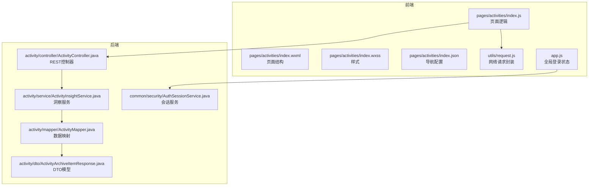
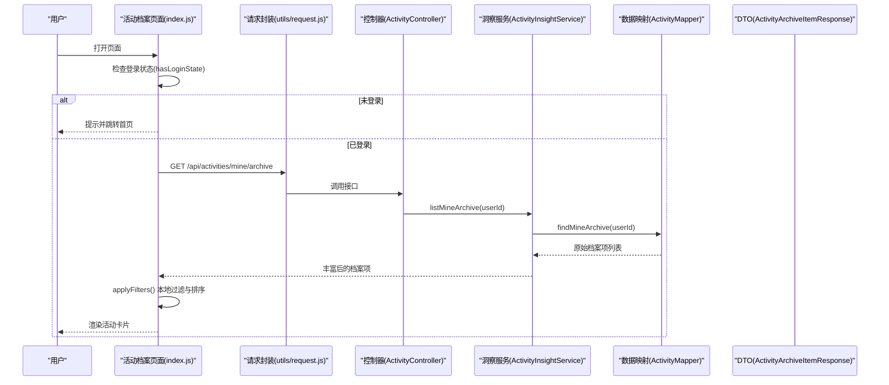
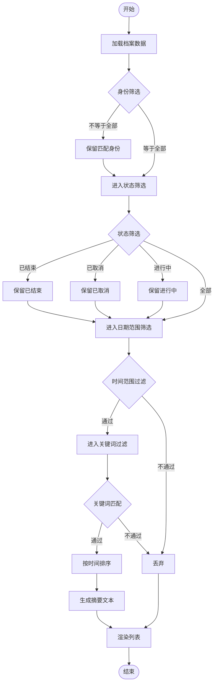
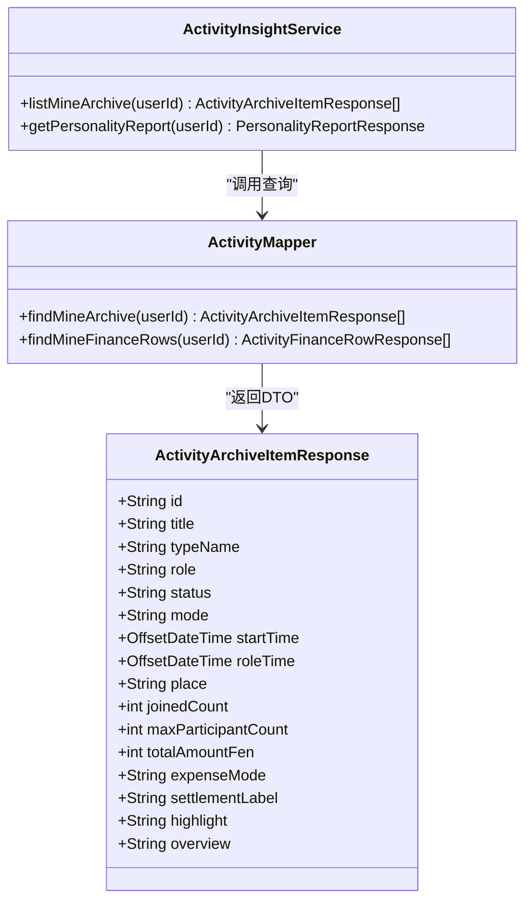
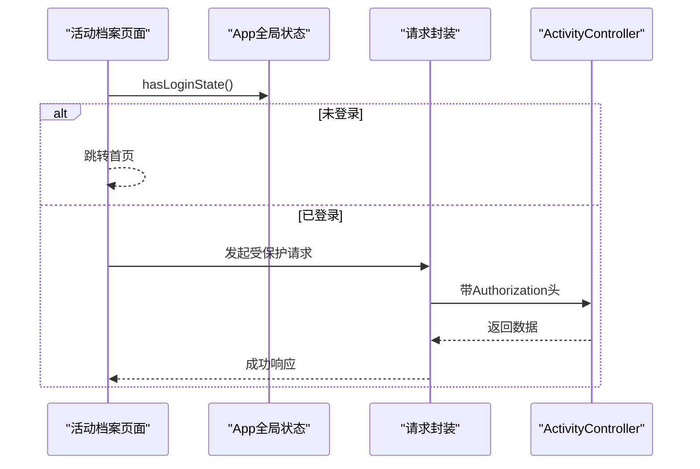
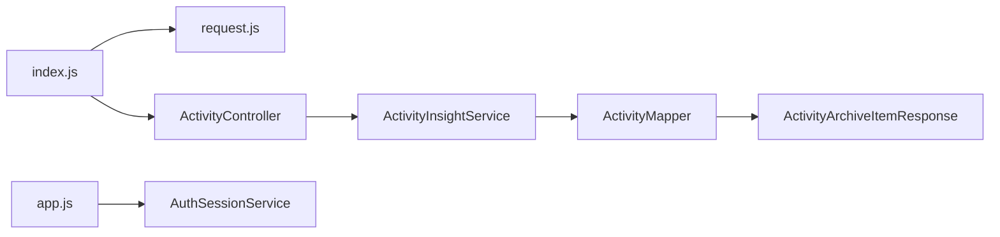

# 活动列表页面开发

<cite>
**本文档引用的文件**
- [frontend/pages/activities/index.js](file://frontend/pages/activities/index.js)
- [frontend/pages/activities/index.json](file://frontend/pages/activities/index.json)
- [frontend/pages/activities/index.wxml](file://frontend/pages/activities/index.wxml)
- [frontend/pages/activities/index.wxss](file://frontend/pages/activities/index.wxss)
- [backend/src/main/java/com/playminipro/activity/controller/ActivityController.java](file://backend/src/main/java/com/playminipro/activity/controller/ActivityController.java)
- [backend/src/main/java/com/playminipro/activity/service/ActivityInsightService.java](file://backend/src/main/java/com/playminipro/activity/service/ActivityInsightService.java)
- [backend/src/main/java/com/playminipro/activity/dto/ActivityArchiveItemResponse.java](file://backend/src/main/java/com/playminipro/activity/dto/ActivityArchiveItemResponse.java)
- [backend/src/main/java/com/playminipro/activity/mapper/ActivityMapper.java](file://backend/src/main/java/com/playminipro/activity/mapper/ActivityMapper.java)
- [frontend/utils/request.js](file://frontend/utils/request.js)
- [frontend/app.js](file://frontend/app.js)
- [frontend/data/ongoing.js](file://frontend/data/ongoing.js)
- [frontend/pages/detail/index.js](file://frontend/pages/detail/index.js)
- [backend/src/main/java/com/playminipro/common/security/AuthSessionService.java](file://backend/src/main/java/com/playminipro/common/security/AuthSessionService.java)
</cite>

## 目录
1. [简介](#简介)
2. [项目结构](#项目结构)
3. [核心组件](#核心组件)
4. [架构概览](#架构概览)
5. [详细组件分析](#详细组件分析)
6. [依赖分析](#依赖分析)
7. [性能考虑](#性能考虑)
8. [故障排除指南](#故障排除指南)
9. [结论](#结论)
10. [附录](#附录)

## 简介
本指南面向PlayMiniPro活动列表页面（活动档案）的开发与优化，系统阐述前端展示逻辑、筛选功能实现、后端数据支撑以及整体架构协作方式。内容涵盖：
- 展示逻辑：活动状态分类、时间排序、搜索过滤
- 性能优化：分页加载、无限滚动、懒加载策略
- 视觉设计：活动卡片统一样式、状态标识、操作按钮
- 权限控制：用户认证、角色判断、敏感操作限制
- 扩展能力：活动状态管理、批量操作思路
- 最佳实践：列表渲染优化、内存管理、用户体验设计

## 项目结构
活动列表页面位于小程序前端pages目录下的activities子目录，采用标准的WXML + WXSS + JS + JSON组合模式，并通过后端REST API提供数据支撑。

**图表来源**
- [frontend/pages/activities/index.js:1-206](file://frontend/pages/activities/index.js#L1-L206)
- [backend/src/main/java/com/playminipro/activity/controller/ActivityController.java:1-112](file://backend/src/main/java/com/playminipro/activity/controller/ActivityController.java#L1-L112)
- [backend/src/main/java/com/playminipro/activity/service/ActivityInsightService.java:1-489](file://backend/src/main/java/com/playminipro/activity/service/ActivityInsightService.java#L1-L489)
- [backend/src/main/java/com/playminipro/activity/mapper/ActivityMapper.java:139-222](file://backend/src/main/java/com/playminipro/activity/mapper/ActivityMapper.java#L139-L222)
- [backend/src/main/java/com/playminipro/activity/dto/ActivityArchiveItemResponse.java:1-23](file://backend/src/main/java/com/playminipro/activity/dto/ActivityArchiveItemResponse.java#L1-L23)
- [frontend/utils/request.js:1-107](file://frontend/utils/request.js#L1-L107)
- [frontend/app.js:1-46](file://frontend/app.js#L1-L46)
- [backend/src/main/java/com/playminipro/common/security/AuthSessionService.java:1-53](file://backend/src/main/java/com/playminipro/common/security/AuthSessionService.java#L1-L53)

**章节来源**
- [frontend/pages/activities/index.js:1-206](file://frontend/pages/activities/index.js#L1-L206)
- [frontend/pages/activities/index.json:1-3](file://frontend/pages/activities/index.json#L1-L3)
- [frontend/pages/activities/index.wxml:1-83](file://frontend/pages/activities/index.wxml#L1-L83)
- [frontend/pages/activities/index.wxss:1-296](file://frontend/pages/activities/index.wxss#L1-L296)

## 核心组件
- 页面逻辑层（index.js）
  - 定义筛选选项（身份、状态、时间排序、关键词）
  - 加载用户活动档案数据并本地过滤与排序
  - 提供打开详情页、清空日期范围等交互
- 结构层（index.wxml）
  - 展示英雄区、筛选区、活动列表、空状态提示
  - 使用循环渲染活动卡片
- 样式层（index.wxss）
  - 统一卡片样式、标签、状态标识、金额与链接样式
- 导航配置（index.json）
  - 设置页面标题为“活动档案”
- 请求封装（utils/request.js）
  - 统一处理基础URL、鉴权头、错误处理与自动登出
- 登录状态（app.js）
  - 提供hasLoginState检查与全局登录状态同步
- 后端控制器（ActivityController）
  - 提供“我的活动档案”接口
- 洞察服务（ActivityInsightService）
  - 构建档案项的高亮描述、结算说明、概览文本
- 数据映射（ActivityMapper）
  - 查询用户参与的活动并按角色时间排序
- DTO模型（ActivityArchiveItemResponse）
  - 定义档案项字段结构

**章节来源**
- [frontend/pages/activities/index.js:1-206](file://frontend/pages/activities/index.js#L1-L206)
- [frontend/pages/activities/index.wxml:1-83](file://frontend/pages/activities/index.wxml#L1-L83)
- [frontend/pages/activities/index.wxss:1-296](file://frontend/pages/activities/index.wxss#L1-L296)
- [frontend/pages/activities/index.json:1-3](file://frontend/pages/activities/index.json#L1-L3)
- [frontend/utils/request.js:1-107](file://frontend/utils/request.js#L1-L107)
- [frontend/app.js:1-46](file://frontend/app.js#L1-L46)
- [backend/src/main/java/com/playminipro/activity/controller/ActivityController.java:69-72](file://backend/src/main/java/com/playminipro/activity/controller/ActivityController.java#L69-L72)
- [backend/src/main/java/com/playminipro/activity/service/ActivityInsightService.java:41-45](file://backend/src/main/java/com/playminipro/activity/service/ActivityInsightService.java#L41-L45)
- [backend/src/main/java/com/playminipro/activity/mapper/ActivityMapper.java:139-158](file://backend/src/main/java/com/playminipro/activity/mapper/ActivityMapper.java#L139-L158)
- [backend/src/main/java/com/playminipro/activity/dto/ActivityArchiveItemResponse.java:1-23](file://backend/src/main/java/com/playminipro/activity/dto/ActivityArchiveItemResponse.java#L1-L23)

## 架构概览
活动列表页面的数据流从后端接口返回，前端进行本地过滤与排序，最终渲染到WXML模板中。权限控制由前端登录状态与后端鉴权共同保障。

**图表来源**
- [frontend/pages/activities/index.js:37-66](file://frontend/pages/activities/index.js#L37-L66)
- [frontend/utils/request.js:50-80](file://frontend/utils/request.js#L50-L80)
- [backend/src/main/java/com/playminipro/activity/controller/ActivityController.java:69-72](file://backend/src/main/java/com/playminipro/activity/controller/ActivityController.java#L69-L72)
- [backend/src/main/java/com/playminipro/activity/service/ActivityInsightService.java:41-45](file://backend/src/main/java/com/playminipro/activity/service/ActivityInsightService.java#L41-L45)
- [backend/src/main/java/com/playminipro/activity/mapper/ActivityMapper.java:139-158](file://backend/src/main/java/com/playminipro/activity/mapper/ActivityMapper.java#L139-L158)

## 详细组件分析

### 页面逻辑与筛选机制
- 筛选维度
  - 身份：全部活动、我发起的、我参加的
  - 状态：全部状态、已结束、已取消、进行中
  - 时间：最近在前、最早在前
  - 日期范围：起止日期
  - 关键词：标题、类型、地点、高亮、身份标签、状态标签
- 过滤流程
  - 先按身份与状态过滤，再按时间范围过滤，最后按关键词过滤
  - 排序依据角色时间（根据身份选择创建时间或参与时间），支持升序/降序
  - 生成摘要统计文本（总数、发起数、参与数、结束数、取消数）

**图表来源**
- [frontend/pages/activities/index.js:110-159](file://frontend/pages/activities/index.js#L110-L159)

**章节来源**
- [frontend/pages/activities/index.js:3-35](file://frontend/pages/activities/index.js#L3-L35)
- [frontend/pages/activities/index.js:110-159](file://frontend/pages/activities/index.js#L110-L159)

### 模板与样式设计
- 模板结构
  - 英雄区：展示“活动档案”标题、摘要与说明
  - 筛选区：身份、状态、日期、排序、搜索框
  - 列表区：活动卡片循环渲染
  - 空状态：无结果时提示
- 卡片元素
  - 标签组：类型标签 + 身份标签
  - 状态标签：已结束、已取消、进行中
  - 标题、日期与时间、模式与地点
  - 底部：高亮说明、金额与“详情”链接
- 样式要点
  - 统一圆角、阴影、渐变背景
  - 标签与状态使用明确色彩区分
  - 金额与操作链接突出显示

**章节来源**
- [frontend/pages/activities/index.wxml:1-83](file://frontend/pages/activities/index.wxml#L1-L83)
- [frontend/pages/activities/index.wxss:1-296](file://frontend/pages/activities/index.wxss#L1-L296)

### 数据模型与后端支撑
- 档案项DTO
  - 字段：id、title、typeName、role、status、mode、startTime、roleTime、place、joinedCount、maxParticipantCount、totalAmountFen、expenseMode、settlementLabel、highlight、overview
- 查询与排序
  - 使用JOIN与LEFT JOIN聚合参与人数与总支出
  - 按角色时间排序（创建者按创建时间，参与者按参与时间）
- 洞察增强
  - 补充结算说明、高亮描述、概览文本

**图表来源**
- [backend/src/main/java/com/playminipro/activity/dto/ActivityArchiveItemResponse.java:1-23](file://backend/src/main/java/com/playminipro/activity/dto/ActivityArchiveItemResponse.java#L1-L23)
- [backend/src/main/java/com/playminipro/activity/mapper/ActivityMapper.java:139-158](file://backend/src/main/java/com/playminipro/activity/mapper/ActivityMapper.java#L139-L158)
- [backend/src/main/java/com/playminipro/activity/service/ActivityInsightService.java:41-45](file://backend/src/main/java/com/playminipro/activity/service/ActivityInsightService.java#L41-L45)

**章节来源**
- [backend/src/main/java/com/playminipro/activity/dto/ActivityArchiveItemResponse.java:1-23](file://backend/src/main/java/com/playminipro/activity/dto/ActivityArchiveItemResponse.java#L1-L23)
- [backend/src/main/java/com/playminipro/activity/mapper/ActivityMapper.java:139-158](file://backend/src/main/java/com/playminipro/activity/mapper/ActivityMapper.java#L139-L158)
- [backend/src/main/java/com/playminipro/activity/service/ActivityInsightService.java:113-132](file://backend/src/main/java/com/playminipro/activity/service/ActivityInsightService.java#L113-L132)

### 权限控制与安全
- 前端
  - 页面加载时检查登录状态，未登录则提示并跳转首页
  - 请求封装自动附加Authorization头，401/403时清理本地鉴权状态
- 后端
  - 控制器基于Spring Security的Authentication参数获取当前用户ID
  - 会话服务通过Redis维护会话有效期与刷新

**图表来源**
- [frontend/pages/activities/index.js:42-46](file://frontend/pages/activities/index.js#L42-L46)
- [frontend/app.js:29-31](file://frontend/app.js#L29-L31)
- [frontend/utils/request.js:50-95](file://frontend/utils/request.js#L50-L95)
- [backend/src/main/java/com/playminipro/activity/controller/ActivityController.java:69-72](file://backend/src/main/java/com/playminipro/activity/controller/ActivityController.java#L69-L72)
- [backend/src/main/java/com/playminipro/common/security/AuthSessionService.java:31-44](file://backend/src/main/java/com/playminipro/common/security/AuthSessionService.java#L31-L44)

**章节来源**
- [frontend/pages/activities/index.js:42-46](file://frontend/pages/activities/index.js#L42-L46)
- [frontend/app.js:29-31](file://frontend/app.js#L29-L31)
- [frontend/utils/request.js:50-95](file://frontend/utils/request.js#L50-L95)
- [backend/src/main/java/com/playminipro/activity/controller/ActivityController.java:69-72](file://backend/src/main/java/com/playminipro/activity/controller/ActivityController.java#L69-L72)
- [backend/src/main/java/com/playminipro/common/security/AuthSessionService.java:31-44](file://backend/src/main/java/com/playminipro/common/security/AuthSessionService.java#L31-L44)

### 与详情页的联动
- 从活动档案卡片点击可进入活动详情页，详情页同样具备登录校验与成员刷新机制
- 详情页支持加入/拒绝、编辑、账单查看、取消活动等操作

**章节来源**
- [frontend/pages/activities/index.js:103-108](file://frontend/pages/activities/index.js#L103-L108)
- [frontend/pages/detail/index.js:30-51](file://frontend/pages/detail/index.js#L30-L51)

## 依赖分析
- 前端依赖
  - 页面逻辑依赖请求封装与全局登录状态
  - 模板依赖样式定义
- 后端依赖
  - 控制器依赖服务层
  - 服务层依赖数据映射与用户信息
  - 数据映射依赖数据库查询与聚合

**图表来源**
- [frontend/pages/activities/index.js:1-206](file://frontend/pages/activities/index.js#L1-L206)
- [frontend/utils/request.js:1-107](file://frontend/utils/request.js#L1-L107)
- [backend/src/main/java/com/playminipro/activity/controller/ActivityController.java:1-112](file://backend/src/main/java/com/playminipro/activity/controller/ActivityController.java#L1-L112)
- [backend/src/main/java/com/playminipro/activity/service/ActivityInsightService.java:1-489](file://backend/src/main/java/com/playminipro/activity/service/ActivityInsightService.java#L1-L489)
- [backend/src/main/java/com/playminipro/activity/mapper/ActivityMapper.java:139-222](file://backend/src/main/java/com/playminipro/activity/mapper/ActivityMapper.java#L139-L222)
- [backend/src/main/java/com/playminipro/activity/dto/ActivityArchiveItemResponse.java:1-23](file://backend/src/main/java/com/playminipro/activity/dto/ActivityArchiveItemResponse.java#L1-L23)
- [frontend/app.js:1-46](file://frontend/app.js#L1-L46)
- [backend/src/main/java/com/playminipro/common/security/AuthSessionService.java:1-53](file://backend/src/main/java/com/playminipro/common/security/AuthSessionService.java#L1-L53)

**章节来源**
- [frontend/pages/activities/index.js:1-206](file://frontend/pages/activities/index.js#L1-L206)
- [backend/src/main/java/com/playminipro/activity/controller/ActivityController.java:1-112](file://backend/src/main/java/com/playminipro/activity/controller/ActivityController.java#L1-L112)

## 性能考虑
- 列表渲染优化
  - 使用wx:for循环渲染，设置wx:key提升重排效率
  - 将复杂格式化逻辑集中在数据映射阶段，减少模板内计算
- 本地过滤与排序
  - 在前端完成过滤与排序，避免重复网络请求
  - 对关键词匹配采用预构建关键字字符串，降低匹配成本
- 内存管理
  - 避免在data中存储过大对象，必要时拆分字段
  - 及时清理定时器与事件监听（页面生命周期内）
- 用户体验
  - 提供空状态提示与清晰的筛选反馈
  - 保持界面响应流畅，避免长任务阻塞UI线程

[本节为通用指导，无需具体文件分析]

## 故障排除指南
- 登录态异常
  - 现象：接口返回401/403或页面提示登录过期
  - 处理：请求封装会自动清理本地鉴权状态并跳转首页
- 数据加载失败
  - 现象：Toast提示“活动档案加载失败”
  - 处理：检查网络环境与后端接口可用性
- 筛选无结果
  - 现象：显示“没筛到结果”
  - 处理：尝试清空日期范围或切换到“全部活动”

**章节来源**
- [frontend/pages/activities/index.js:48-66](file://frontend/pages/activities/index.js#L48-L66)
- [frontend/utils/request.js:93-95](file://frontend/utils/request.js#L93-L95)

## 结论
活动列表页面通过前后端协同实现了完整的活动档案展示与筛选功能。前端负责本地过滤与排序、统一样式与交互，后端提供结构化数据与洞察增强。结合权限控制与错误处理机制，能够为用户提供稳定、直观的活动回顾体验。后续可在现有基础上扩展分页/无限滚动、批量操作等高级能力。

[本节为总结，无需具体文件分析]

## 附录
- 开发建议
  - 保持数据模型与接口契约稳定，避免频繁变更
  - 对高频筛选条件建立索引或缓存策略（后端层面）
  - 在模板中尽量减少计算表达式，将格式化逻辑下沉到数据层
  - 为关键交互添加加载状态与防抖处理，提升用户体验

[本节为通用建议，无需具体文件分析]