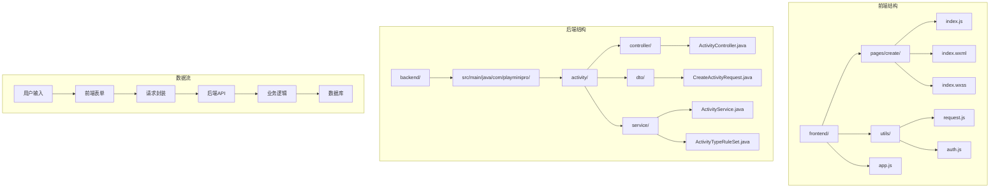
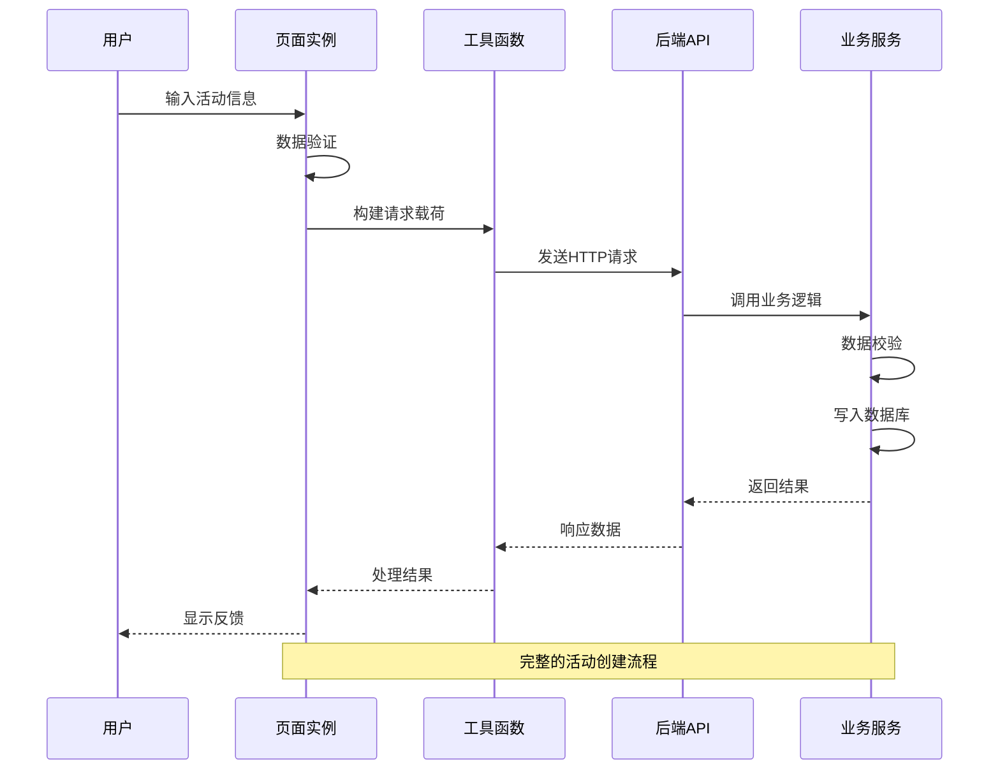
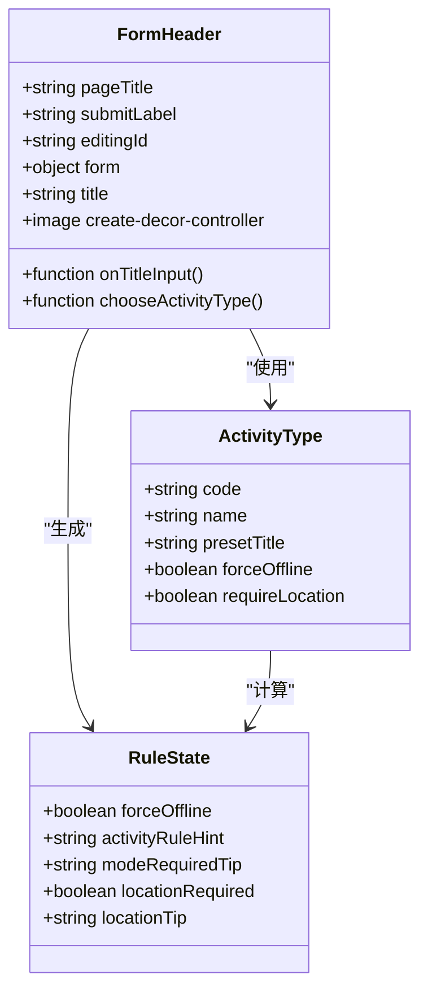
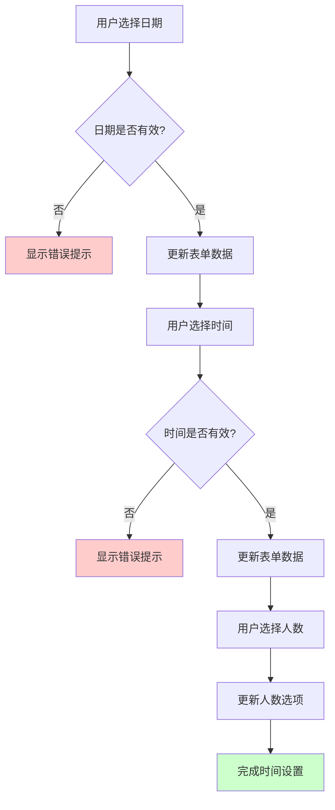
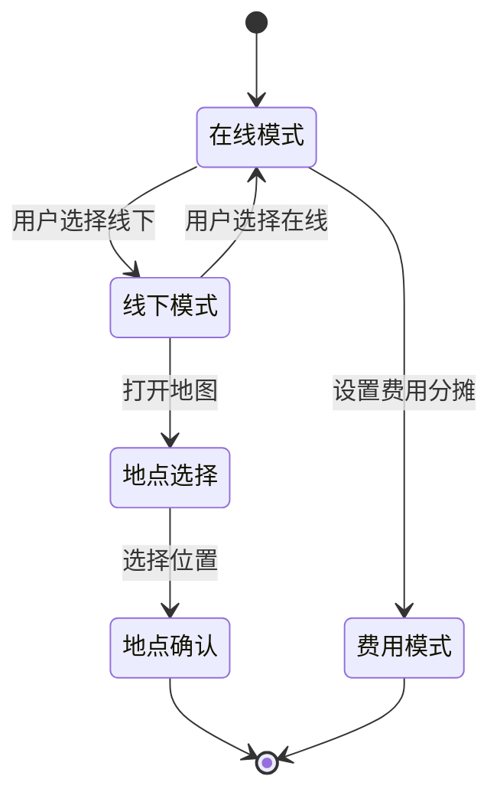
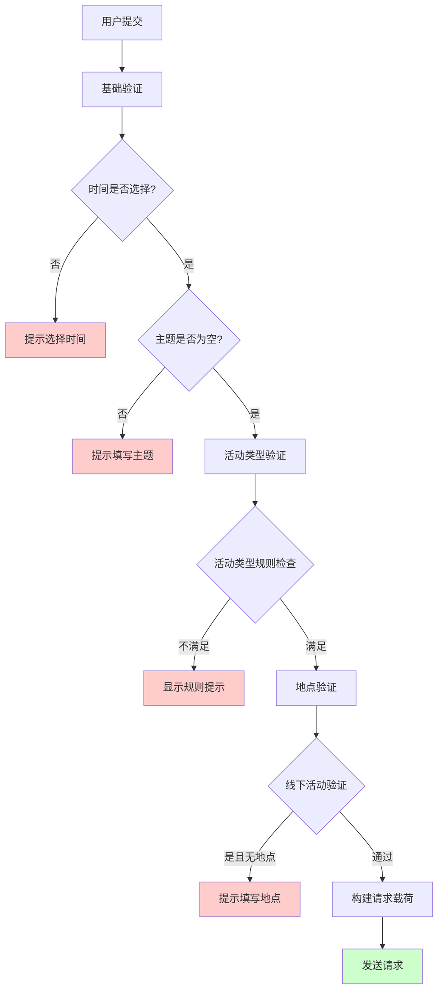
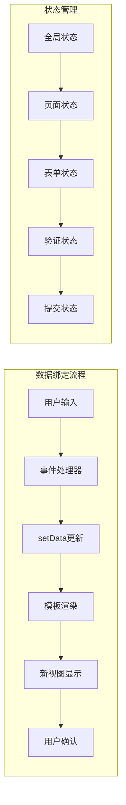
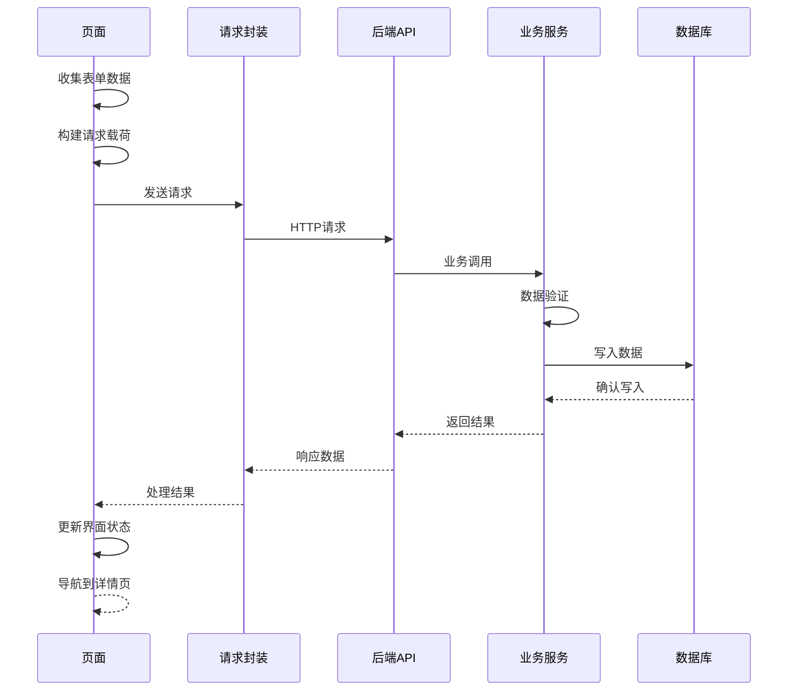
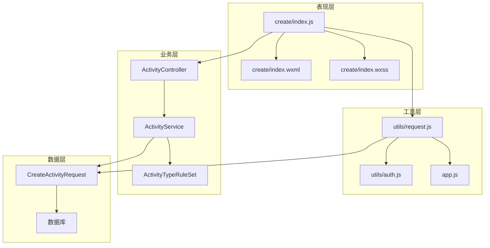

# 活动创建页面开发

<cite>
**本文档引用的文件**
- [frontend/pages/create/index.js](file://frontend/pages/create/index.js)
- [frontend/pages/create/index.wxml](file://frontend/pages/create/index.wxml)
- [frontend/pages/create/index.wxss](file://frontend/pages/create/index.wxss)
- [frontend/utils/request.js](file://frontend/utils/request.js)
- [frontend/app.js](file://frontend/app.js)
- [frontend/utils/auth.js](file://frontend/utils/auth.js)
- [backend/src/main/java/com/playminipro/activity/controller/ActivityController.java](file://backend/src/main/java/com/playminipro/activity/controller/ActivityController.java)
- [backend/src/main/java/com/playminipro/activity/dto/CreateActivityRequest.java](file://backend/src/main/java/com/playminipro/activity/dto/CreateActivityRequest.java)
- [backend/src/main/java/com/playminipro/activity/service/ActivityService.java](file://backend/src/main/java/com/playminipro/activity/service/ActivityService.java)
- [backend/src/main/java/com/playminipro/activity/service/ActivityTypeRuleSet.java](file://backend/src/main/java/com/playminipro/activity/service/ActivityTypeRuleSet.java)
</cite>

## 更新摘要
**变更内容**
- 新增游戏控制器装饰元素，提供主题一致性的视觉体验
- 更新UI装饰元素以增强游戏化主题氛围
- 优化页面视觉层次和品牌一致性

## 目录
1. [简介](#简介)
2. [项目结构](#项目结构)
3. [核心组件](#核心组件)
4. [架构概览](#架构概览)
5. [详细组件分析](#详细组件分析)
6. [依赖关系分析](#依赖关系分析)
7. [性能考虑](#性能考虑)
8. [故障排除指南](#故障排除指南)
9. [结论](#结论)

## 简介

PlayMiniPro活动创建页面是一个基于微信小程序框架开发的移动端应用，允许用户创建各种类型的社交活动。该页面提供了完整的活动创建流程，包括活动类型选择、时间地点设置、参与人数限制、费用分摊模式等核心功能。

**更新** 本版本新增了游戏控制器装饰元素，通过视觉设计强化了游戏化主题体验，为用户提供更加沉浸式的活动创建界面。

本指南将深入分析活动创建页面的表单设计和数据处理逻辑，涵盖表单字段验证、用户输入处理、数据提交机制等关键技术点，并提供详细的实现指导和最佳实践建议。

## 项目结构

PlayMiniPro项目采用前后端分离架构，前端使用微信小程序框架，后端使用Spring Boot框架。活动创建页面位于前端目录结构中的`pages/create`目录下。



**图表来源**
- [frontend/pages/create/index.js:1-370](file://frontend/pages/create/index.js#L1-L370)
- [backend/src/main/java/com/playminipro/activity/controller/ActivityController.java:1-114](file://backend/src/main/java/com/playminipro/activity/controller/ActivityController.java#L1-L114)

**章节来源**
- [frontend/pages/create/index.js:1-370](file://frontend/pages/create/index.js#L1-L370)
- [frontend/pages/create/index.wxml:1-146](file://frontend/pages/create/index.wxml#L1-L146)
- [frontend/pages/create/index.wxss:1-336](file://frontend/pages/create/index.wxss#L1-L336)

## 核心组件

活动创建页面由多个核心组件构成，每个组件负责特定的功能模块：

### 表单数据模型
页面使用响应式数据绑定机制，通过`data`对象管理所有表单状态：

```javascript
data: {
  pageTitle: '开始整',
  submitLabel: '下一步',
  editingId: '',
  participantCountOptions: [2, 3, 4, 5, 6, 8, 10, 12],
  participantCountIndex: 2,
  modes: ['线上', '线下'],
  modeIndex: 0,
  expenseOptions: [
    { code: 'host_treat', label: '我请客' },
    { code: 'aa', label: 'AA' }
  ],
  expenseOptionIndex: 1,
  activityTypes: [
    { code: 'custom', name: '自定义', presetTitle: '' },
    { code: 'dinner', name: '吃饭', presetTitle: '一起吃个饭' },
    { code: 'game', name: '开黑', presetTitle: '一起开黑' },
    { code: 'sports', name: '运动', presetTitle: '一起动一动' },
    { code: 'coffee', name: '咖啡', presetTitle: '一起喝杯咖啡' }
  ],
  activityTypeIndex: 0,
  activityRuleHint: '',
  modeRequiredTip: '',
  locationRequired: false,
  locationTip: '',
  form: {
    title: '',
    date: '',
    time: '',
    location: '',
    locationAddress: '',
    note: ''
  }
}
```

### 活动类型规则系统
系统内置了活动类型规则集，用于控制不同活动类型的特殊行为：

| 活动类型 | 强制线下 | 需要地点 | 规则摘要 |
|---------|---------|---------|---------|
| 自定义 | 否 | 否 | 可自由选择 |
| 吃饭 | 是 | 是 | 默认线下，地点必填 |
| 开黑 | 否 | 否 | 可线上或线下 |
| 运动 | 否 | 否 | 可线上或线下 |
| 咖啡 | 是 | 是 | 默认线下，地点必填 |

### 视觉装饰元素
**更新** 页面新增了游戏控制器装饰元素，增强了主题一致性：

```css
.create-decor-controller {
  position: absolute;
  top: -10rpx;
  right: -10rpx;
  width: 160rpx;
  height: 160rpx;
  opacity: 0.4;
  transform: rotate(12deg);
  pointer-events: none;
  z-index: 1;
}
```

**章节来源**
- [frontend/pages/create/index.js:4-37](file://frontend/pages/create/index.js#L4-L37)
- [frontend/pages/create/index.js:359-370](file://frontend/pages/create/index.js#L359-L370)
- [frontend/pages/create/index.wxss:125-135](file://frontend/pages/create/index.wxss#L125-L135)

## 架构概览

活动创建页面采用MVVM架构模式，通过数据绑定实现视图与逻辑层的解耦。



**图表来源**
- [frontend/pages/create/index.js:206-282](file://frontend/pages/create/index.js#L206-L282)
- [frontend/utils/request.js:50-80](file://frontend/utils/request.js#L50-L80)
- [backend/src/main/java/com/playminipro/activity/controller/ActivityController.java:45-56](file://backend/src/main/java/com/playminipro/activity/controller/ActivityController.java#L45-L56)

## 详细组件分析

### 表单组件分析

活动创建页面的表单组件采用模块化设计，分为头部信息、时间设置、方式地点、补充信息四个主要区域。

#### 头部信息面板
**更新** 头部面板新增了游戏控制器装饰元素，提供主题一致性的视觉体验：



**图表来源**
- [frontend/pages/create/index.js:17-25](file://frontend/pages/create/index.js#L17-L25)
- [frontend/pages/create/index.js:159-171](file://frontend/pages/create/index.js#L159-L171)
- [frontend/pages/create/index.js:302-313](file://frontend/pages/create/index.js#L302-L313)

#### 时间设置组件
时间设置组件提供日期、时间和参与人数的选择功能：



**图表来源**
- [frontend/pages/create/index.js:111-121](file://frontend/pages/create/index.js#L111-L121)
- [frontend/pages/create/index.js:147-151](file://frontend/pages/create/index.js#L147-L151)

#### 方式地点组件
方式地点组件处理活动进行方式和地点选择：



**图表来源**
- [frontend/pages/create/index.js:123-145](file://frontend/pages/create/index.js#L123-L145)
- [frontend/pages/create/index.js:179-198](file://frontend/pages/create/index.js#L179-L198)

**章节来源**
- [frontend/pages/create/index.wxml:26-54](file://frontend/pages/create/index.wxml#L26-L54)
- [frontend/pages/create/index.js:111-198](file://frontend/pages/create/index.js#L111-L198)

### 数据处理逻辑

#### 表单验证机制
活动创建页面实现了多层次的数据验证机制：



**图表来源**
- [frontend/pages/create/index.js:206-282](file://frontend/pages/create/index.js#L206-L282)

#### 数据绑定与状态管理
页面使用双向数据绑定机制，确保视图与数据的实时同步：



**图表来源**
- [frontend/pages/create/index.js:173-177](file://frontend/pages/create/index.js#L173-L177)
- [frontend/pages/create/index.js:206-282](file://frontend/pages/create/index.js#L206-L282)

**章节来源**
- [frontend/pages/create/index.js:206-282](file://frontend/pages/create/index.js#L206-L282)

### 提交机制分析

#### 请求构建与发送
活动创建页面的提交机制采用了统一的请求封装：



**图表来源**
- [frontend/pages/create/index.js:247-282](file://frontend/pages/create/index.js#L247-L282)
- [frontend/utils/request.js:50-80](file://frontend/utils/request.js#L50-L80)

#### 错误处理策略
页面实现了完善的错误处理机制：

| 错误类型 | 处理方式 | 用户反馈 |
|---------|---------|---------|
| 网络错误 | 显示"后端没启动"提示 | Toast提示 |
| 认证过期 | 清除认证状态并跳转登录 | 登录提示 |
| 业务错误 | 解析具体错误消息 | 明确错误提示 |
| 参数错误 | 显示相应字段提示 | 字段高亮 |

**章节来源**
- [frontend/pages/create/index.js:319-336](file://frontend/pages/create/index.js#L319-L336)
- [frontend/utils/request.js:68-75](file://frontend/utils/request.js#L68-L75)

## 依赖关系分析

活动创建页面的依赖关系体现了清晰的分层架构：



**图表来源**
- [frontend/pages/create/index.js:1-3](file://frontend/pages/create/index.js#L1-L3)
- [backend/src/main/java/com/playminipro/activity/controller/ActivityController.java:27-43](file://backend/src/main/java/com/playminipro/activity/controller/ActivityController.java#L27-L43)

**章节来源**
- [frontend/pages/create/index.js:1-3](file://frontend/pages/create/index.js#L1-L3)
- [backend/src/main/java/com/playminipro/activity/controller/ActivityController.java:1-114](file://backend/src/main/java/com/playminipro/activity/controller/ActivityController.java#L1-L114)

## 性能考虑

### 前端性能优化

1. **数据懒加载**: 活动编辑模式下按需加载数据，避免不必要的网络请求
2. **事件节流**: 对频繁触发的输入事件进行防抖处理
3. **内存管理**: 及时清理不再使用的数据引用，防止内存泄漏
4. **渲染优化**: 使用条件渲染减少DOM节点数量
5. **装饰元素优化**: 控制器装饰元素采用透明度和z-index优化，不影响交互性能

### 后端性能优化

1. **数据库索引**: 为常用查询字段建立适当索引
2. **缓存策略**: 对静态配置和规则数据进行缓存
3. **事务管理**: 合理使用事务边界，避免长时间锁定
4. **并发控制**: 实现适当的并发访问控制

## 故障排除指南

### 常见问题及解决方案

#### 登录状态问题
**症状**: 页面重定向到登录页
**原因**: Token过期或未登录
**解决**: 
1. 检查本地存储的token状态
2. 重新执行微信登录流程
3. 验证用户信息完整性

#### 表单验证错误
**症状**: 提交时出现各种验证提示
**原因**: 数据格式不符合要求
**解决**:
1. 检查必填字段是否完整
2. 验证数据类型和范围
3. 确认活动类型规则约束

#### 网络请求失败
**症状**: 显示"后端没启动"提示
**原因**: 后端服务未运行或网络连接问题
**解决**:
1. 确认后端服务状态
2. 检查API环境配置
3. 验证网络连接

#### 装饰元素显示问题
**症状**: 控制器装饰元素不显示或显示异常
**原因**: 图片资源路径错误或样式冲突
**解决**:
1. 检查`/img/ui-controller.png`资源是否存在
2. 验证CSS样式类名正确性
3. 确认z-index层级设置合理

**章节来源**
- [frontend/pages/create/index.js:38-109](file://frontend/pages/create/index.js#L38-L109)
- [frontend/utils/request.js:93-95](file://frontend/utils/request.js#L93-L95)

## 结论

PlayMiniPro活动创建页面展现了现代移动应用开发的最佳实践，通过合理的架构设计和完善的错误处理机制，为用户提供了流畅的活动创建体验。

**更新** 新增的游戏控制器装饰元素进一步强化了应用的主题一致性，通过视觉设计提升了用户的沉浸感和品牌识别度。

### 主要优势

1. **清晰的架构分层**: 前后端职责明确，便于维护和扩展
2. **完整的数据验证**: 多层次验证确保数据质量
3. **良好的用户体验**: 实时反馈和直观的操作流程
4. **健壮的错误处理**: 全面的异常情况处理机制
5. **主题一致性**: 装饰元素增强了视觉统一性和品牌特色

### 技术亮点

1. **响应式数据绑定**: 实现了高效的视图更新机制
2. **模块化组件设计**: 代码复用性和可维护性良好
3. **统一的请求封装**: 标准化的API调用方式
4. **灵活的配置系统**: 支持动态的活动类型规则
5. **游戏化视觉设计**: 装饰元素提升用户体验和品牌识别

该页面为类似社交活动应用的开发提供了优秀的参考模板，其设计理念和实现方案值得在其他项目中借鉴和应用。