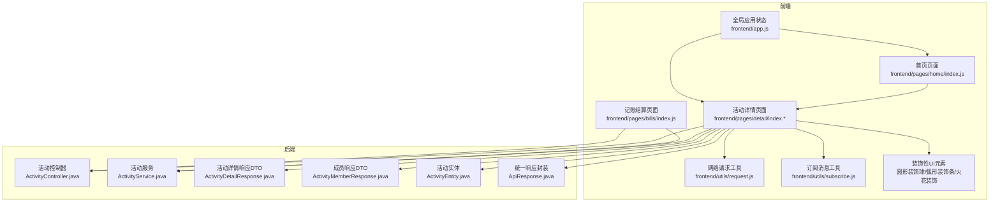
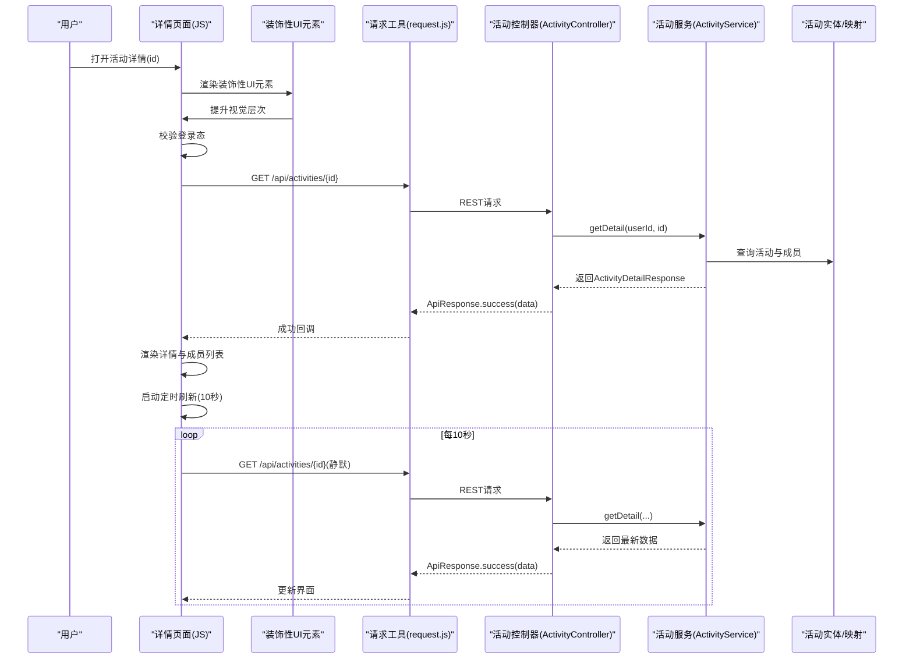
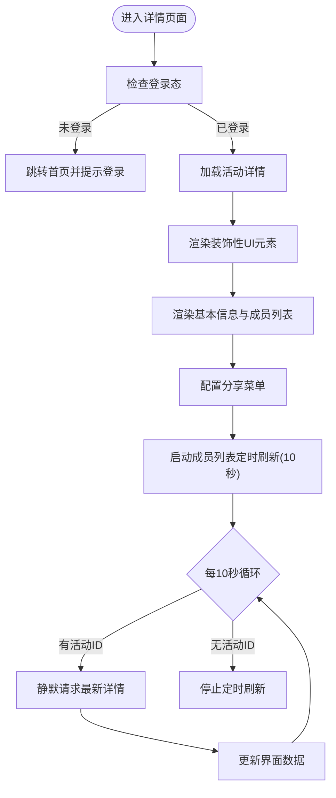
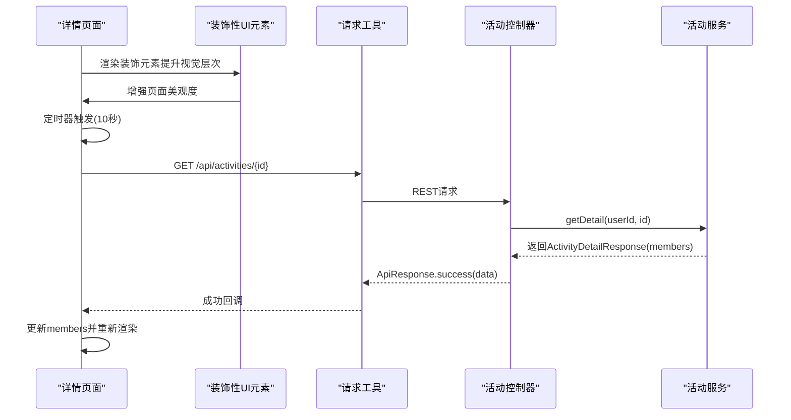
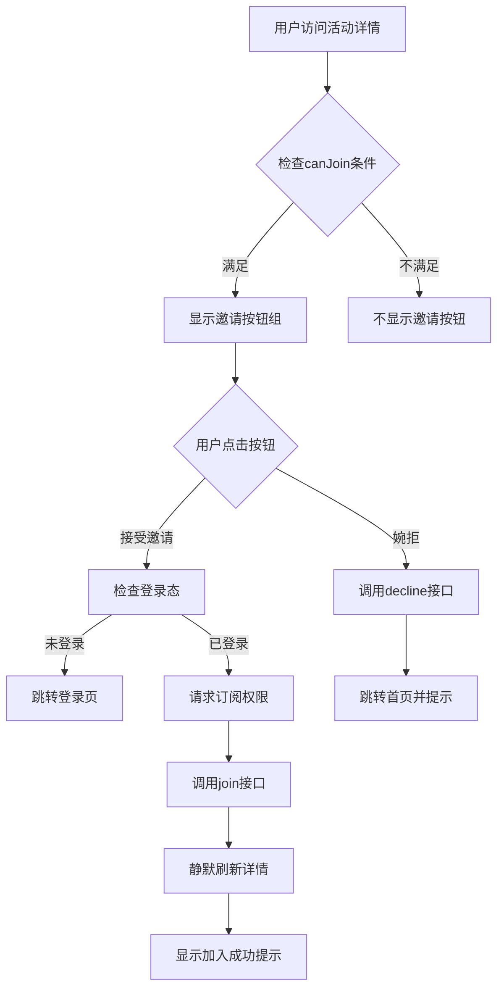
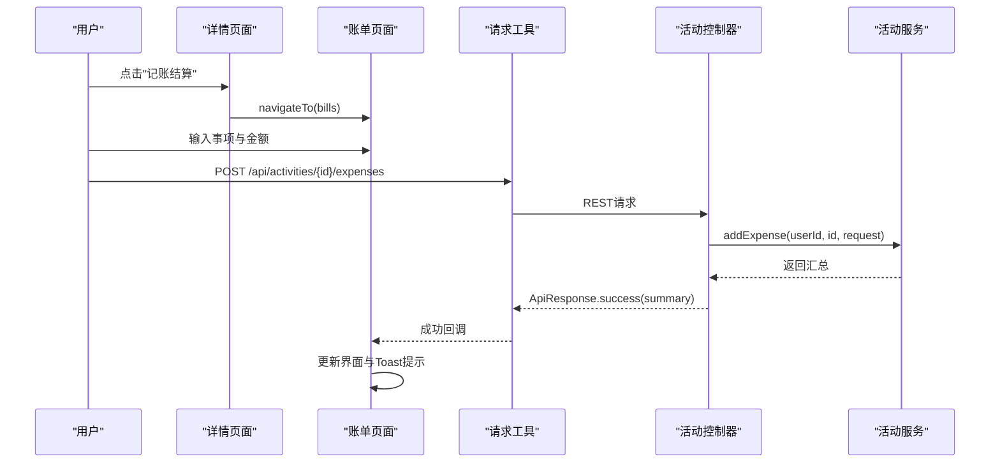
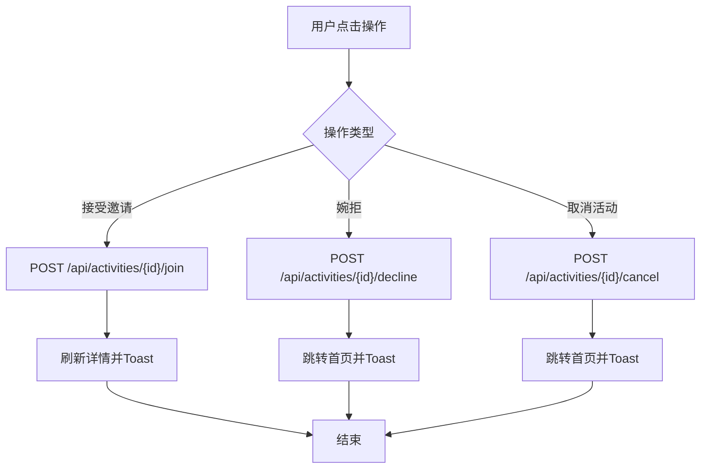
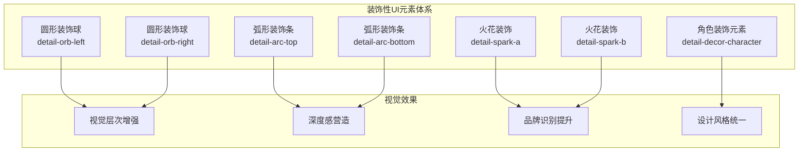
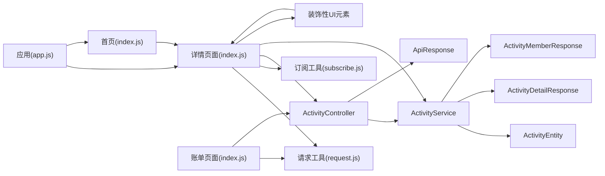

# 活动详情页面开发

<cite>
**本文档引用的文件**
- [frontend/pages/detail/index.js](file://frontend/pages/detail/index.js)
- [frontend/pages/detail/index.json](file://frontend/pages/detail/index.json)
- [frontend/pages/detail/index.wxml](file://frontend/pages/detail/index.wxml)
- [frontend/pages/detail/index.wxss](file://frontend/pages/detail/index.wxss)
- [frontend/pages/bills/index.js](file://frontend/pages/bills/index.js)
- [frontend/utils/request.js](file://frontend/utils/request.js)
- [frontend/utils/subscribe.js](file://frontend/utils/subscribe.js)
- [frontend/app.js](file://frontend/app.js)
- [frontend/pages/home/index.js](file://frontend/pages/home/index.js)
- [backend/src/main/java/com/playminipro/activity/controller/ActivityController.java](file://backend/src/main/java/com/playminipro/activity/controller/ActivityController.java)
- [backend/src/main/java/com/playminipro/activity/service/ActivityService.java](file://backend/src/main/java/com/playminipro/activity/service/ActivityService.java)
- [backend/src/main/java/com/playminipro/activity/dto/ActivityDetailResponse.java](file://backend/src/main/java/com/playminipro/activity/dto/ActivityDetailResponse.java)
- [backend/src/main/java/com/playminipro/activity/dto/ActivityMemberResponse.java](file://backend/src/main/java/com/playminipro/activity/dto/ActivityMemberResponse.java)
- [backend/src/main/java/com/playminipro/activity/entity/ActivityEntity.java](file://backend/src/main/java/com/playminipro/activity/entity/ActivityEntity.java)
- [backend/src/main/java/com/playminipro/common/response/ApiResponse.java](file://backend/src/main/java/com/playminipro/common/response/ApiResponse.java)
</cite>

## 更新摘要
**变更内容**
- 新增装饰性UI元素：活动详情页面引入了完整的装饰性UI元素体系，包括圆形装饰球、弧形装饰条、火花装饰和角色装饰元素
- 保持设计一致性：装饰元素与页面整体设计风格保持一致，提升视觉层次感和用户体验
- 增强页面美观度：通过多层次装饰元素营造丰富的视觉效果，使活动详情页面更具吸引力

## 目录
1. [简介](#简介)
2. [项目结构](#项目结构)
3. [核心组件](#核心组件)
4. [架构概览](#架构概览)
5. [详细组件分析](#详细组件分析)
6. [装饰性UI元素系统](#装饰性ui元素系统)
7. [依赖分析](#依赖分析)
8. [性能考虑](#性能考虑)
9. [故障排除指南](#故障排除指南)
10. [结论](#结论)
11. [附录](#附录)

## 简介
本文件面向PlayMiniPro活动详情页面的开发与维护，系统性阐述页面的信息展示与交互实现，涵盖活动基本信息呈现、成员列表管理、费用明细查看三大核心模块。文档同时解释页面数据获取与更新机制、实时状态同步策略、用户操作反馈流程，并给出成员邀请、参与确认、费用分摊等交互逻辑的实现要点。此外，文档包含页面导航、分享功能、消息提醒等增强功能的开发方法，以及页面性能优化、数据缓存策略和用户体验提升的具体实施方案。

**更新** 本次更新重点反映了活动详情页面装饰性UI元素的完整实现，包括圆形装饰球、弧形装饰条、火花装饰和角色装饰元素，这些元素显著提升了页面的视觉美观度和设计一致性。

## 项目结构
活动详情页面位于前端目录的detail页面，配合后端ActivityController提供的REST接口，形成完整的前后端协作体系。页面采用WXML模板、WXSS样式与JS逻辑分离的组织方式，结合全局应用状态管理与工具函数，实现登录态校验、网络请求封装、订阅消息权限申请等功能。装饰性UI元素通过独立的样式类和结构元素实现，与主要内容区域形成良好的视觉层次。

**图表来源**
- [frontend/pages/detail/index.js:1-299](file://frontend/pages/detail/index.js#L1-L299)
- [frontend/pages/bills/index.js:1-184](file://frontend/pages/bills/index.js#L1-L184)
- [frontend/utils/request.js:1-107](file://frontend/utils/request.js#L1-L107)
- [frontend/utils/subscribe.js:1-31](file://frontend/utils/subscribe.js#L1-L31)
- [frontend/pages/home/index.js:1-219](file://frontend/pages/home/index.js#L1-L219)
- [frontend/app.js:1-46](file://frontend/app.js#L1-L46)
- [backend/src/main/java/com/playminipro/activity/controller/ActivityController.java:1-114](file://backend/src/main/java/com/playminipro/activity/controller/ActivityController.java#L1-L114)
- [backend/src/main/java/com/playminipro/activity/service/ActivityService.java:1-233](file://backend/src/main/java/com/playminipro/activity/service/ActivityService.java#L1-L233)
- [backend/src/main/java/com/playminipro/activity/dto/ActivityDetailResponse.java:1-30](file://backend/src/main/java/com/playminipro/activity/dto/ActivityDetailResponse.java#L1-L30)
- [backend/src/main/java/com/playminipro/activity/dto/ActivityMemberResponse.java:1-10](file://backend/src/main/java/com/playminipro/activity/dto/ActivityMemberResponse.java#L1-L10)
- [backend/src/main/java/com/playminipro/activity/entity/ActivityEntity.java:1-91](file://backend/src/main/java/com/playminipro/activity/entity/ActivityEntity.java#L1-L91)
- [backend/src/main/java/com/playminipro/common/response/ApiResponse.java:1-51](file://backend/src/main/java/com/playminipro/common/response/ApiResponse.java#L1-L51)

## 核心组件
- 页面控制器（JS）：负责生命周期管理、数据加载、定时刷新、用户交互处理、导航跳转与分享配置。
- 视图模板（WXML）：定义活动卡片、成员网格、邀请按钮、装饰性UI元素、工具栏等UI结构。
- 样式（WXSS）：提供卡片、头像堆叠、标签、按钮、装饰性UI元素等视觉样式与动画效果。
- 请求工具（request.js）：封装HTTP请求、认证头注入、错误处理与鉴权过期清理。
- 订阅工具（subscribe.js）：处理首次订阅消息权限申请，支持模板ID与提示状态管理。
- 应用状态（app.js）：维护全局登录态、用户信息与退出登录逻辑。
- 后端控制器（ActivityController）：提供活动详情、参与、拒绝、取消、费用汇总等REST接口。
- 业务服务（ActivityService）：实现活动详情组装、成员加入/拒绝、状态判断与通知记录。
- 数据传输对象（DTO/Entity）：标准化前后端数据结构，确保字段一致性与可读性。
- 装饰性UI元素：包括圆形装饰球、弧形装饰条、火花装饰和角色装饰元素，提升页面美观度。

**更新** 新增装饰性UI元素系统作为核心组件的重要组成部分，显著提升了页面的视觉表现力。

**章节来源**
- [frontend/pages/detail/index.js:6-28](file://frontend/pages/detail/index.js#L6-L28)
- [frontend/pages/detail/index.wxml:10-75](file://frontend/pages/detail/index.wxml#L10-L75)
- [frontend/pages/detail/index.wxss:73-461](file://frontend/pages/detail/index.wxss#L73-L461)
- [frontend/utils/request.js:50-95](file://frontend/utils/request.js#L50-L95)
- [frontend/utils/subscribe.js:3-27](file://frontend/utils/subscribe.js#L3-L27)
- [frontend/app.js:14-45](file://frontend/app.js#L14-L45)
- [backend/src/main/java/com/playminipro/activity/controller/ActivityController.java:79-92](file://backend/src/main/java/com/playminipro/activity/controller/ActivityController.java#L79-L92)
- [backend/src/main/java/com/playminipro/activity/service/ActivityService.java:144-181](file://backend/src/main/java/com/playminipro/activity/service/ActivityService.java#L144-L181)

## 架构概览
活动详情页面的前后端交互遵循REST风格，前端通过封装的请求工具调用后端接口，后端控制器将请求委派给服务层，服务层查询数据库并返回DTO结构的数据。页面在onLoad时拉取详情，在onShow时启动成员列表定时刷新，在 onHide/onUnload时停止刷新以节省资源。装饰性UI元素通过独立的WXML结构和WXSS样式实现，与主要内容区域形成良好的视觉层次。

**更新** 新增了装饰性UI元素的渲染流程和视觉提升效果。

**图表来源**
- [frontend/pages/detail/index.js:30-131](file://frontend/pages/detail/index.js#L30-L131)
- [frontend/pages/detail/index.wxml:1-26](file://frontend/pages/detail/index.wxml#L1-L26)
- [frontend/utils/request.js:50-80](file://frontend/utils/request.js#L50-L80)
- [backend/src/main/java/com/playminipro/activity/controller/ActivityController.java:79-82](file://backend/src/main/java/com/playminipro/activity/controller/ActivityController.java#L79-L82)
- [backend/src/main/java/com/playminipro/activity/service/ActivityService.java:144-181](file://backend/src/main/java/com/playminipro/activity/service/ActivityService.java#L144-L181)

**章节来源**
- [frontend/pages/detail/index.js:30-131](file://frontend/pages/detail/index.js#L30-L131)
- [frontend/pages/detail/index.wxml:1-26](file://frontend/pages/detail/index.wxml#L1-L26)
- [frontend/utils/request.js:50-80](file://frontend/utils/request.js#L50-L80)
- [backend/src/main/java/com/playminipro/activity/controller/ActivityController.java:79-82](file://backend/src/main/java/com/playminipro/activity/controller/ActivityController.java#L79-L82)
- [backend/src/main/java/com/playminipro/activity/service/ActivityService.java:144-181](file://backend/src/main/java/com/playminipro/activity/service/ActivityService.java#L144-L181)

## 详细组件分析

### 活动详情信息展示
- 基本信息：标题、标签、状态文本、时间、模式（线下/线上）、地点、费用模式（我请客/AA）。
- 参与统计：已参与人数/最大人数，动态文案"还差X人/人已到齐"。
- 成员列表：头像堆叠展示，支持占位昵称首字缩略；底部分享按钮。
- 编辑与取消：仅活动创建者可见且未结束时显示；点击后弹窗确认并调用后端接口。
- 记账结算入口：线下活动显示"记账结算"，跳转至账单页面。
- 装饰性UI元素：圆形装饰球、弧形装饰条、火花装饰和角色装饰元素提升视觉层次。

**更新** 新增了装饰性UI元素的渲染流程和视觉提升效果。

**图表来源**
- [frontend/pages/detail/index.js:30-131](file://frontend/pages/detail/index.js#L30-L131)
- [frontend/pages/detail/index.wxml:1-26](file://frontend/pages/detail/index.wxml#L1-L26)
- [frontend/pages/detail/index.js:190-205](file://frontend/pages/detail/index.js#L190-L205)

**章节来源**
- [frontend/pages/detail/index.js:67-131](file://frontend/pages/detail/index.js#L67-L131)
- [frontend/pages/detail/index.wxml:10-46](file://frontend/pages/detail/index.wxml#L10-L46)
- [frontend/pages/detail/index.wxss:162-323](file://frontend/pages/detail/index.wxss#L162-L323)

### 成员列表管理
- 数据来源：后端返回的成员列表，包含用户ID、昵称、头像URL与角色。
- 展示策略：头像优先，缺省时使用昵称首字缩略；支持分享入口。
- 实时同步：每10秒自动刷新一次详情，从而带动成员列表更新。
- 权限控制：仅创建者可编辑/取消；根据状态动态显示按钮。

**更新** 新增了装饰性UI元素对成员列表展示的视觉增强效果。

**图表来源**
- [frontend/pages/detail/index.js:190-205](file://frontend/pages/detail/index.js#L190-L205)
- [frontend/pages/detail/index.wxml:1-26](file://frontend/pages/detail/index.wxml#L1-L26)
- [backend/src/main/java/com/playminipro/activity/service/ActivityService.java:144-181](file://backend/src/main/java/com/playminipro/activity/service/ActivityService.java#L144-L181)
- [backend/src/main/java/com/playminipro/activity/dto/ActivityDetailResponse.java:6-29](file://backend/src/main/java/com/playminipro/activity/dto/ActivityDetailResponse.java#L6-L29)

**章节来源**
- [frontend/pages/detail/index.js:107-113](file://frontend/pages/detail/index.js#L107-L113)
- [frontend/pages/detail/index.wxml:1-26](file://frontend/pages/detail/index.wxml#L1-L26)
- [backend/src/main/java/com/playminipro/activity/service/ActivityService.java:144-181](file://backend/src/main/java/com/playminipro/activity/service/ActivityService.java#L144-L181)
- [backend/src/main/java/com/playminipro/activity/dto/ActivityMemberResponse.java:3-9](file://backend/src/main/java/com/playminipro/activity/dto/ActivityMemberResponse.java#L3-L9)

### 邀请按钮UI元素与交互逻辑
- 邀请按钮显示条件：当用户已登录且活动处于招募状态、未满员且当前用户未加入时显示。
- 接受邀请：点击后检查登录态，如未登录则跳转登录页，登录后调用join接口并静默刷新详情。
- 婉拒邀请：点击后调用decline接口，成功后跳转首页并显示提示。
- 订阅消息：接受邀请前会请求初始订阅权限，确保后续消息推送。

**更新** 邀请按钮UI元素与装饰性UI元素协同工作，提升整体视觉效果。

**图表来源**
- [frontend/pages/detail/index.js:85-87](file://frontend/pages/detail/index.js#L85-L87)
- [frontend/pages/detail/index.js:140-196](file://frontend/pages/detail/index.js#L140-L196)
- [frontend/pages/detail/index.wxml:39-42](file://frontend/pages/detail/index.wxml#L39-L42)

**章节来源**
- [frontend/pages/detail/index.js:85-87](file://frontend/pages/detail/index.js#L85-L87)
- [frontend/pages/detail/index.js:140-196](file://frontend/pages/detail/index.js#L140-L196)
- [frontend/pages/detail/index.wxml:39-42](file://frontend/pages/detail/index.wxml#L39-L42)

### 费用明细查看与分摊
- 账单页面：提供费用汇总、明细列表、结算项与人均分摊金额。
- 交互流程：输入消费事项与金额，提交后更新汇总；支持结束活动并生成结算。
- 与详情联动：线下活动在详情页显示"记账结算"入口，直接跳转至账单页面。

**图表来源**
- [frontend/pages/detail/index.js:221-225](file://frontend/pages/detail/index.js#L221-L225)
- [frontend/pages/bills/index.js:59-96](file://frontend/pages/bills/index.js#L59-L96)
- [backend/src/main/java/com/playminipro/activity/controller/ActivityController.java:100-105](file://backend/src/main/java/com/playminipro/activity/controller/ActivityController.java#L100-L105)

**章节来源**
- [frontend/pages/bills/index.js:30-96](file://frontend/pages/bills/index.js#L30-L96)
- [backend/src/main/java/com/playminipro/activity/controller/ActivityController.java:94-105](file://backend/src/main/java/com/playminipro/activity/controller/ActivityController.java#L94-L105)

### 用户操作与反馈
- 邀请接受/婉拒：调用后端join/decline接口，成功后静默刷新详情并Toast提示。
- 取消活动：仅创建者可用，弹窗确认后调用cancel接口。
- 分享：设置分享菜单与路径参数，支持带来源标识的邀请链路。
- 登录态与鉴权：请求工具拦截401/403并清理本地状态，页面在必要时引导重新登录。

**更新** 用户操作与装饰性UI元素共同提升整体用户体验。

**图表来源**
- [frontend/pages/detail/index.js:141-188](file://frontend/pages/detail/index.js#L141-L188)
- [frontend/pages/detail/index.js:219-252](file://frontend/pages/detail/index.js#L219-L252)
- [frontend/utils/request.js:68-75](file://frontend/utils/request.js#L68-L75)

**章节来源**
- [frontend/pages/detail/index.js:141-188](file://frontend/pages/detail/index.js#L141-L188)
- [frontend/pages/detail/index.js:219-252](file://frontend/pages/detail/index.js#L219-L252)
- [frontend/utils/request.js:68-95](file://frontend/utils/request.js#L68-L95)

### 页面导航与分享
- 导航：详情页内跳转至编辑、记账结算；首页与详情页间通过路由传递id与source参数。
- 分享：配置withShareTicket与shareAppMessage，分享路径携带source=invite，便于后续邀请链路追踪。
- 首页待办：首页在登录后自动拉取进行中的活动列表，并支持一键跳转详情。

**章节来源**
- [frontend/pages/detail/index.js:133-139](file://frontend/pages/detail/index.js#L133-L139)
- [frontend/pages/detail/index.js:207-217](file://frontend/pages/detail/index.js#L207-L217)
- [frontend/pages/home/index.js:135-146](file://frontend/pages/home/index.js#L135-L146)

## 装饰性UI元素系统

### 圆形装饰球（Detail Orb）
- 位置：页面左右两侧，作为视觉焦点元素
- 类型：左圆球和右圆球，分别对应页面左右边界
- 动画：通过CSS动画实现轻微的浮动效果，增强页面活力
- 颜色：采用与主题色协调的渐变色彩，提升视觉层次

### 弧形装饰条（Detail Arc）
- 位置：页面上下边缘，形成自然的边界装饰
- 类型：顶部弧形和底部弧形，营造柔和的视觉过渡
- 形状：流畅的曲线设计，与卡片元素形成和谐统一
- 效果：通过透明度和阴影实现深度感，不干扰主要内容

### 火花装饰（Detail Spark）
- 位置：页面中央区域，作为动态视觉元素
- 类型：A型和B型火花，分布在不同位置
- 动画：随机出现的闪烁效果，增加页面的生动性
- 效果：短暂的高亮显示，营造节日般的氛围

### 角色装饰元素（Detail Decor Character）
- 位置：详情卡片内部，作为品牌识别元素
- 形式：角色装饰图片，提升品牌辨识度
- 适配：使用aspectFit模式确保图片完整显示
- 作用：强化品牌形象，与整体设计风格保持一致

**图表来源**
- [frontend/pages/detail/index.wxml:1-26](file://frontend/pages/detail/index.wxml#L1-L26)
- [frontend/pages/detail/index.wxss:73-461](file://frontend/pages/detail/index.wxss#L73-L461)

**章节来源**
- [frontend/pages/detail/index.wxml:1-26](file://frontend/pages/detail/index.wxml#L1-L26)
- [frontend/pages/detail/index.wxss:73-461](file://frontend/pages/detail/index.wxss#L73-L461)

## 依赖分析
- 前端依赖：详情页面依赖请求工具与订阅工具；装饰性UI元素依赖独立的样式类；账单页面依赖请求工具；应用状态提供全局登录态；首页负责路由与待办。
- 后端依赖：控制器聚合服务层与统一响应封装；服务层依赖实体与映射，组合查询结果为DTO。

**图表来源**
- [frontend/pages/detail/index.js:1-4](file://frontend/pages/detail/index.js#L1-L4)
- [frontend/pages/bills/index.js](file://frontend/pages/bills/index.js#L1)
- [frontend/utils/request.js:1-107](file://frontend/utils/request.js#L1-L107)
- [frontend/utils/subscribe.js:1-31](file://frontend/utils/subscribe.js#L1-L31)
- [frontend/pages/home/index.js:1-219](file://frontend/pages/home/index.js#L1-L219)
- [frontend/app.js:1-46](file://frontend/app.js#L1-L46)
- [backend/src/main/java/com/playminipro/activity/controller/ActivityController.java:1-114](file://backend/src/main/java/com/playminipro/activity/controller/ActivityController.java#L1-L114)
- [backend/src/main/java/com/playminipro/activity/service/ActivityService.java:1-233](file://backend/src/main/java/com/playminipro/activity/service/ActivityService.java#L1-L233)
- [backend/src/main/java/com/playminipro/activity/entity/ActivityEntity.java:1-91](file://backend/src/main/java/com/playminipro/activity/entity/ActivityEntity.java#L1-L91)
- [backend/src/main/java/com/playminipro/activity/dto/ActivityDetailResponse.java:1-30](file://backend/src/main/java/com/playminipro/activity/dto/ActivityDetailResponse.java#L1-L30)
- [backend/src/main/java/com/playminipro/activity/dto/ActivityMemberResponse.java:1-10](file://backend/src/main/java/com/playminipro/activity/dto/ActivityMemberResponse.java#L1-L10)
- [backend/src/main/java/com/playminipro/common/response/ApiResponse.java:1-51](file://backend/src/main/java/com/playminipro/common/response/ApiResponse.java#L1-L51)

**章节来源**
- [frontend/pages/detail/index.js:1-4](file://frontend/pages/detail/index.js#L1-L4)
- [frontend/pages/bills/index.js](file://frontend/pages/bills/index.js#L1)
- [frontend/utils/request.js:1-107](file://frontend/utils/request.js#L1-L107)
- [frontend/utils/subscribe.js:1-31](file://frontend/utils/subscribe.js#L1-L31)
- [frontend/pages/home/index.js:1-219](file://frontend/pages/home/index.js#L1-L219)
- [frontend/app.js:1-46](file://frontend/app.js#L1-L46)
- [backend/src/main/java/com/playminipro/activity/controller/ActivityController.java:1-114](file://backend/src/main/java/com/playminipro/activity/controller/ActivityController.java#L1-L114)
- [backend/src/main/java/com/playminipro/activity/service/ActivityService.java:1-233](file://backend/src/main/java/com/playminipro/activity/service/ActivityService.java#L1-L233)
- [backend/src/main/java/com/playminipro/activity/entity/ActivityEntity.java:1-91](file://backend/src/main/java/com/playminipro/activity/entity/ActivityEntity.java#L1-L91)
- [backend/src/main/java/com/playminipro/activity/dto/ActivityDetailResponse.java:1-30](file://backend/src/main/java/com/playminipro/activity/dto/ActivityDetailResponse.java#L1-L30)
- [backend/src/main/java/com/playminipro/activity/dto/ActivityMemberResponse.java:1-10](file://backend/src/main/java/com/playminipro/activity/dto/ActivityMemberResponse.java#L1-L10)
- [backend/src/main/java/com/playminipro/common/response/ApiResponse.java:1-51](file://backend/src/main/java/com/playminipro/common/response/ApiResponse.java#L1-L51)

## 性能考虑
- 定时刷新策略：成员列表每10秒刷新一次，避免频繁网络请求导致卡顿；在页面隐藏或卸载时停止定时器，降低后台消耗。
- 静默刷新：详情刷新采用静默模式，减少UI闪烁与不必要的加载指示。
- 数据最小化：后端返回的成员列表仅包含必要字段，前端按需渲染，避免冗余计算。
- 缓存与离线：登录态与用户信息存储于本地缓存，减少重复登录流程；分享路径与来源参数用于邀请链路追踪，避免重复请求。
- 样式优化：使用WXSS的backdrop-filter与渐变背景，提升视觉体验的同时保持较低的渲染成本。
- 装饰性UI元素优化：装饰元素采用轻量级动画和透明度效果，避免对页面性能造成显著影响；通过CSS硬件加速优化动画性能。

**更新** 新增了装饰性UI元素的性能优化策略和视觉效果平衡。

**章节来源**
- [frontend/pages/detail/index.js:4-28](file://frontend/pages/detail/index.js#L4-L28)
- [frontend/pages/detail/index.js:190-205](file://frontend/pages/detail/index.js#L190-L205)
- [frontend/utils/request.js:50-80](file://frontend/utils/request.js#L50-L80)
- [frontend/pages/detail/index.wxml:1-26](file://frontend/pages/detail/index.wxml#L1-L26)
- [frontend/pages/detail/index.wxss:73-461](file://frontend/pages/detail/index.wxss#L73-L461)

## 故障排除指南
- 登录过期：请求工具拦截401/403后清理本地token与用户信息，并引导重新登录；页面在关键操作前再次校验登录态。
- 加载失败：详情与账单页面在异常时显示Toast提示，并保持loading状态直至用户确认。
- 邀请操作失败：接受/婉拒邀请失败时，页面Toast提示错误信息，避免误导用户。
- 取消活动失败：弹窗确认后若失败，Toast提示并保留原状态，保证用户可控。
- 装饰性UI元素异常：装饰元素加载失败时，页面自动降级显示，不影响核心功能；检查网络连接和资源路径。

**更新** 新增了装饰性UI元素的故障排除指南。

**章节来源**
- [frontend/utils/request.js:68-95](file://frontend/utils/request.js#L68-L95)
- [frontend/pages/detail/index.js:115-131](file://frontend/pages/detail/index.js#L115-L131)
- [frontend/pages/detail/index.js:155-166](file://frontend/pages/detail/index.js#L155-L166)
- [frontend/pages/detail/index.js:178-187](file://frontend/pages/detail/index.js#L178-L187)
- [frontend/pages/detail/index.js:239-251](file://frontend/pages/detail/index.js#L239-L251)
- [frontend/pages/detail/index.wxml:1-26](file://frontend/pages/detail/index.wxml#L1-L26)

## 结论
活动详情页面通过清晰的前后端职责划分与稳定的交互流程，实现了活动信息的高效展示与实时同步。页面在登录态校验、定时刷新、分享与消息提醒等方面具备完善的用户体验保障。配合账单页面的费用明细与分摊功能，整体形成了从"邀请—参与—记账—结算"的完整闭环。

**更新** 本次更新重点体现了装饰性UI元素系统的完整实现，包括圆形装饰球、弧形装饰条、火花装饰和角色装饰元素，这些元素显著提升了页面的视觉美观度和设计一致性，为用户提供更加丰富和愉悦的视觉体验。

建议持续关注登录态与网络异常处理的健壮性，进一步优化定时刷新策略与缓存策略，以提升在弱网与低性能设备上的表现。同时，装饰性UI元素的设计应保持简洁优雅，避免过度装饰影响页面性能和用户体验。

## 附录
- 开发建议
  - 在详情页增加下拉刷新手势，提升用户主动更新体验。
  - 对成员头像加载失败进行兜底处理，避免空缺影响视觉。
  - 将费用模式与状态文案统一抽离为常量，便于国际化与多语言扩展。
  - 在定时刷新中引入指数退避策略，避免高并发下的抖动。
  - 考虑在邀请按钮区域添加加载状态指示，提升用户反馈体验。
  - 优化10秒轮询机制，可根据活动活跃度动态调整刷新频率。
  - 装饰性UI元素应支持深色模式适配，提升不同主题下的视觉效果。
  - 考虑为装饰元素添加可配置开关，允许用户自定义视觉效果。
  - 优化装饰元素的响应式设计，确保在不同屏幕尺寸下的最佳显示效果。