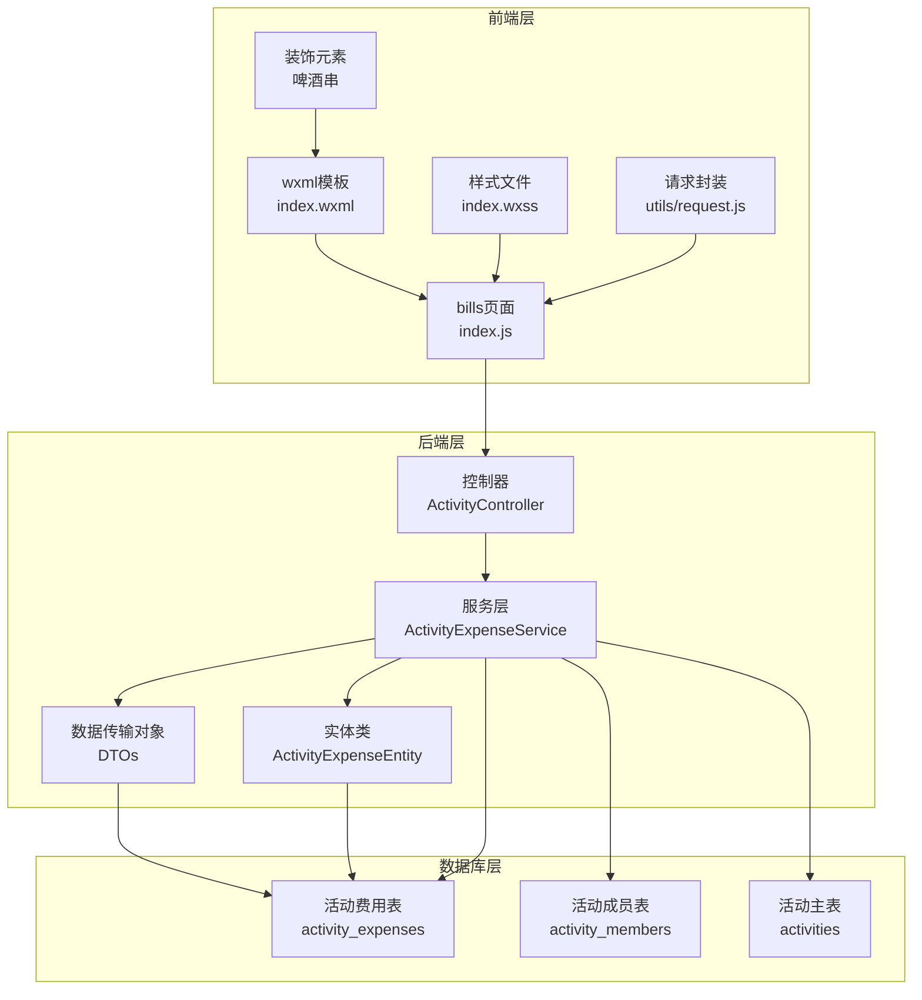
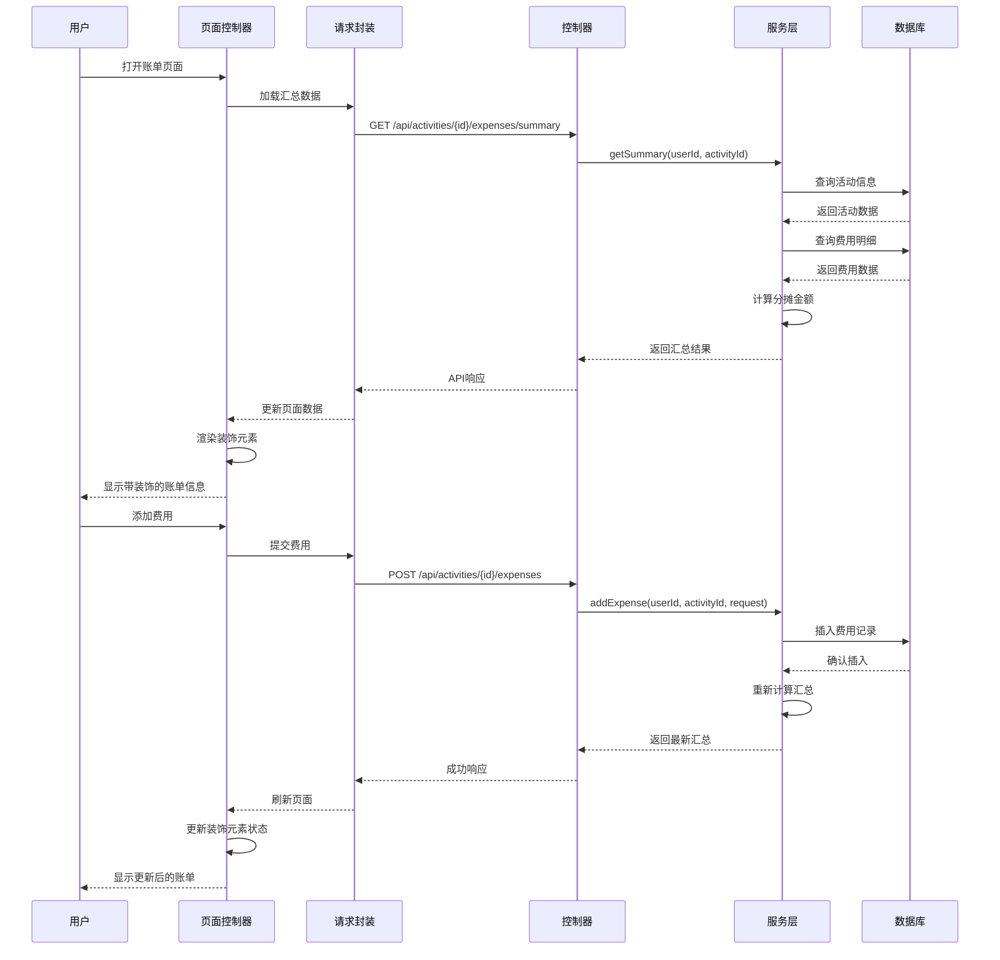
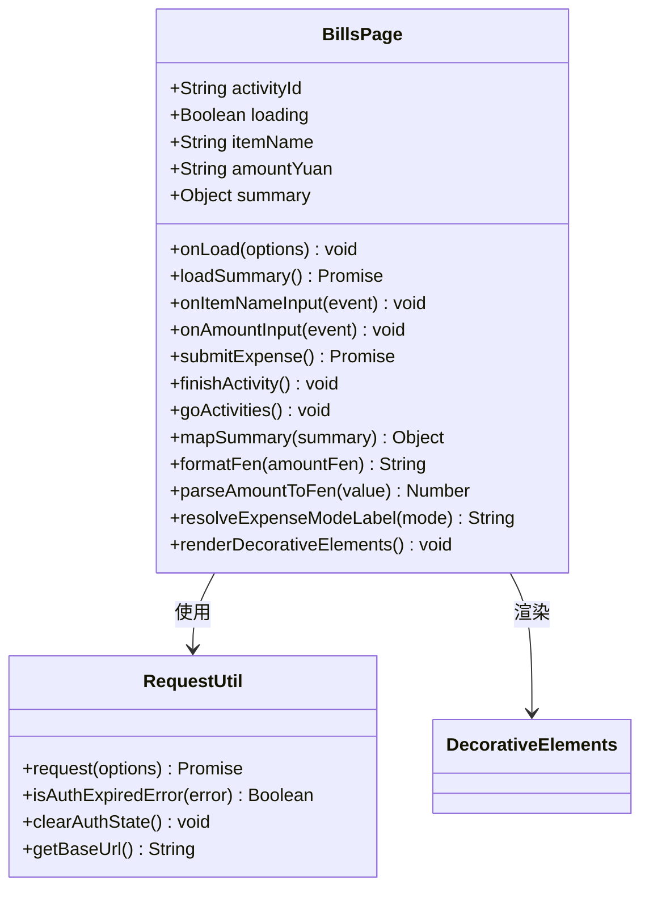
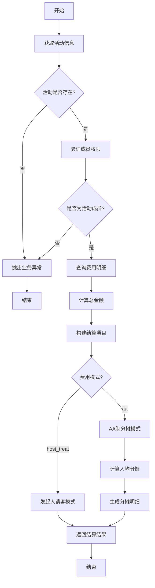
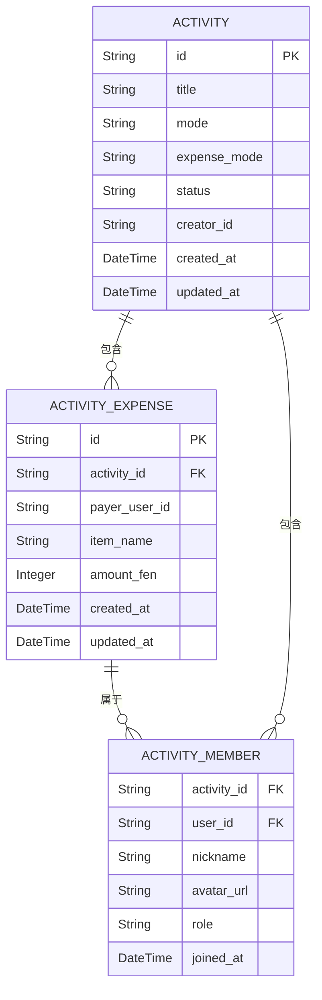
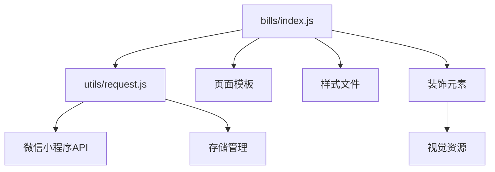
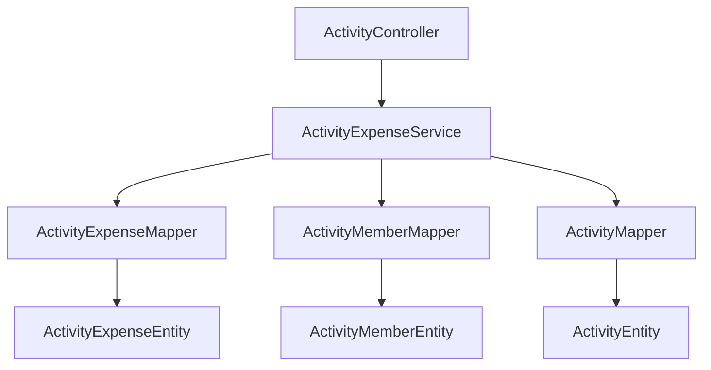

# 账单管理页面开发

<cite>
**本文档引用的文件**
- [frontend/pages/bills/index.js](file://frontend/pages/bills/index.js)
- [frontend/pages/bills/index.json](file://frontend/pages/bills/index.json)
- [frontend/pages/bills/index.wxml](file://frontend/pages/bills/index.wxml)
- [frontend/pages/bills/index.wxss](file://frontend/pages/bills/index.wxss)
- [frontend/utils/request.js](file://frontend/utils/request.js)
- [backend/src/main/java/com/playminipro/activity/controller/ActivityController.java](file://backend/src/main/java/com/playminipro/activity/controller/ActivityController.java)
- [backend/src/main/java/com/playminipro/activity/service/ActivityExpenseService.java](file://backend/src/main/java/com/playminipro/activity/service/ActivityExpenseService.java)
- [backend/src/main/java/com/playminipro/activity/dto/ActivityExpenseSummaryResponse.java](file://backend/src/main/java/com/playminipro/activity/dto/ActivityExpenseSummaryResponse.java)
- [backend/src/main/java/com/playminipro/activity/dto/ActivityExpenseItemResponse.java](file://backend/src/main/java/com/playminipro/activity/dto/ActivityExpenseItemResponse.java)
- [backend/src/main/java/com/playminipro/activity/dto/ActivitySettlementItemResponse.java](file://backend/src/main/java/com/playminipro/activity/dto/ActivitySettlementItemResponse.java)
- [backend/src/main/java/com/playminipro/activity/entity/ActivityExpenseEntity.java](file://backend/src/main/java/com/playminipro/activity/entity/ActivityExpenseEntity.java)
</cite>

## 更新摘要
**所做更改**
- 新增"休闲社交氛围装饰元素"章节，详细介绍啤酒串装饰元素的设计理念和实现方式
- 更新页面视觉设计相关内容，强调与休闲社交主题的契合度
- 增强用户体验设计说明，突出装饰元素对用户情感体验的影响

## 目录
1. [简介](#简介)
2. [项目结构](#项目结构)
3. [核心组件](#核心组件)
4. [架构概览](#架构概览)
5. [详细组件分析](#详细组件分析)
6. [依赖关系分析](#依赖关系分析)
7. [性能考虑](#性能考虑)
8. [故障排除指南](#故障排除指南)
9. [结论](#结论)
10. [附录](#附录)
11. [休闲社交氛围装饰元素](#休闲社交氛围装饰元素)

## 简介

PlayMiniPro账单管理页面是微信小程序中的一个核心功能模块，专门用于活动费用的统计和结算管理。该页面实现了完整的费用管理生命周期，包括费用明细展示、分摊计算、结算方案生成等功能。

**更新** 新增啤酒串装饰元素，与页面的休闲社交氛围相呼应，为用户提供更加轻松愉快的财务管理体验。

本系统支持两种主要的费用模式：
- **AA制分摊**：按参与人数平均分摊费用
- **代付处理**：由发起人统一支付，其他成员后续转账

页面提供了直观的用户界面，支持实时费用录入、自动结算计算和清晰的转账结果显示。所有数据都经过严格的权限控制和业务规则验证，确保财务数据的准确性和安全性。

## 项目结构

账单管理页面采用前后端分离的架构设计，前端使用微信小程序框架，后端使用Spring Boot技术栈。

**图表来源**
- [frontend/pages/bills/index.js:1-184](file://frontend/pages/bills/index.js#L1-L184)
- [frontend/pages/bills/index.wxml:1-114](file://frontend/pages/bills/index.wxml#L1-L114)
- [backend/src/main/java/com/playminipro/activity/controller/ActivityController.java:1-112](file://backend/src/main/java/com/playminipro/activity/controller/ActivityController.java#L1-L112)

**章节来源**
- [frontend/pages/bills/index.js:1-184](file://frontend/pages/bills/index.js#L1-L184)
- [frontend/pages/bills/index.json:1-3](file://frontend/pages/bills/index.json#L1-L3)
- [frontend/pages/bills/index.wxml:1-114](file://frontend/pages/bills/index.wxml#L1-L114)
- [frontend/pages/bills/index.wxss:1-189](file://frontend/pages/bills/index.wxss#L1-L189)

## 核心组件

### 前端组件架构

账单管理页面由五个主要部分组成：

1. **页面控制器**：负责数据管理和用户交互
2. **模板视图**：定义页面结构和布局
3. **样式系统**：提供视觉表现和响应式设计
4. **请求封装**：处理API通信和错误处理
5. **装饰元素**：新增的啤酒串装饰，营造休闲社交氛围

### 后端服务架构

后端采用分层架构设计：

1. **控制器层**：处理HTTP请求和响应
2. **服务层**：实现核心业务逻辑
3. **数据访问层**：管理数据库操作
4. **数据传输对象**：定义API接口的数据结构

**章节来源**
- [backend/src/main/java/com/playminipro/activity/service/ActivityExpenseService.java:1-167](file://backend/src/main/java/com/playminipro/activity/service/ActivityExpenseService.java#L1-L167)
- [backend/src/main/java/com/playminipro/activity/dto/ActivityExpenseSummaryResponse.java:1-19](file://backend/src/main/java/com/playminipro/activity/dto/ActivityExpenseSummaryResponse.java#L1-L19)

## 架构概览

系统采用RESTful API设计，前后端通过JSON格式进行数据交换。整个流程遵循MVC模式，确保了代码的可维护性和扩展性。

**图表来源**
- [frontend/pages/bills/index.js:30-49](file://frontend/pages/bills/index.js#L30-L49)
- [backend/src/main/java/com/playminipro/activity/controller/ActivityController.java:94-111](file://backend/src/main/java/com/playminipro/activity/controller/ActivityController.java#L94-L111)

## 详细组件分析

### 前端页面组件

#### 页面控制器分析

页面控制器实现了完整的生命周期管理和用户交互处理：

**图表来源**
- [frontend/pages/bills/index.js:3-133](file://frontend/pages/bills/index.js#L3-L133)
- [frontend/utils/request.js:50-107](file://frontend/utils/request.js#L50-L107)

#### 数据映射和格式化

页面提供了完善的数据映射和格式化功能：

| 字段 | 映射前 | 映射后 | 处理逻辑 |
|------|--------|--------|----------|
| expenseMode | host_treat/aa | 我请客/A制 | 文本转换 |
| activityStatus | finished/进行中 | 已结束/进行中 | 状态显示 |
| amountFen | 分 | 元格式字符串 | 金额格式化 |
| settlementItems | 金额数组 | 带状态的列表 | 分摊计算 |

**章节来源**
- [frontend/pages/bills/index.js:135-184](file://frontend/pages/bills/index.js#L135-L184)

### 后端服务组件

#### 业务逻辑实现

服务层实现了复杂的业务逻辑，包括费用计算、权限验证和状态管理：

**图表来源**
- [backend/src/main/java/com/playminipro/activity/service/ActivityExpenseService.java:108-167](file://backend/src/main/java/com/playminipro/activity/service/ActivityExpenseService.java#L108-L167)

#### 权限控制机制

系统实现了多层次的权限控制：

1. **活动访问权限**：验证用户是否为活动成员
2. **操作权限**：区分发起人和普通成员的操作能力
3. **状态控制**：根据活动状态限制操作

**章节来源**
- [backend/src/main/java/com/playminipro/activity/service/ActivityExpenseService.java:79-106](file://backend/src/main/java/com/playminipro/activity/service/ActivityExpenseService.java#L79-L106)

### 数据模型设计

#### 核心数据结构

系统定义了完整的数据传输对象来保证前后端数据一致性：

**图表来源**
- [backend/src/main/java/com/playminipro/activity/entity/ActivityExpenseEntity.java:1-35](file://backend/src/main/java/com/playminipro/activity/entity/ActivityExpenseEntity.java#L1-L35)
- [backend/src/main/java/com/playminipro/activity/dto/ActivityExpenseSummaryResponse.java:1-19](file://backend/src/main/java/com/playminipro/activity/dto/ActivityExpenseSummaryResponse.java#L1-L19)

**章节来源**
- [backend/src/main/java/com/playminipro/activity/dto/ActivityExpenseItemResponse.java:1-10](file://backend/src/main/java/com/playminipro/activity/dto/ActivityExpenseItemResponse.java#L1-L10)
- [backend/src/main/java/com/playminipro/activity/dto/ActivitySettlementItemResponse.java:1-10](file://backend/src/main/java/com/playminipro/activity/dto/ActivitySettlementItemResponse.java#L1-L10)

## 依赖关系分析

### 前端依赖关系

**图表来源**
- [frontend/pages/bills/index.js:1](file://frontend/pages/bills/index.js#L1)
- [frontend/utils/request.js:1-107](file://frontend/utils/request.js#L1-L107)

### 后端依赖关系

**图表来源**
- [backend/src/main/java/com/playminipro/activity/controller/ActivityController.java:31-43](file://backend/src/main/java/com/playminipro/activity/controller/ActivityController.java#L31-L43)
- [backend/src/main/java/com/playminipro/activity/service/ActivityExpenseService.java:23-35](file://backend/src/main/java/com/playminipro/activity/service/ActivityExpenseService.java#L23-L35)

**章节来源**
- [backend/src/main/java/com/playminipro/activity/controller/ActivityController.java:1-112](file://backend/src/main/java/com/playminipro/activity/controller/ActivityController.java#L1-L112)
- [backend/src/main/java/com/playminipro/activity/service/ActivityExpenseService.java:1-167](file://backend/src/main/java/com/playminipro/activity/service/ActivityExpenseService.java#L1-L167)

## 性能考虑

### 前端性能优化

1. **懒加载策略**：仅在需要时加载数据，避免不必要的网络请求
2. **缓存机制**：利用微信小程序的页面缓存特性
3. **渲染优化**：使用wxml的条件渲染减少DOM节点数量
4. **事件节流**：对输入事件进行防抖处理
5. **装饰元素优化**：啤酒串装饰元素采用轻量级实现，不影响页面性能

### 后端性能优化

1. **数据库索引**：为常用查询字段建立索引
2. **批量查询**：减少数据库往返次数
3. **事务管理**：合理使用事务确保数据一致性
4. **连接池配置**：优化数据库连接使用效率

### 数据处理优化

1. **分页加载**：对于大量数据采用分页策略
2. **增量更新**：只更新变化的数据部分
3. **内存管理**：及时清理不再使用的数据引用

## 故障排除指南

### 常见问题及解决方案

#### 登录状态异常
- **症状**：页面提示登录过期
- **原因**：Token失效或被清除
- **解决**：重新登录并检查网络连接

#### 权限不足
- **症状**：无法查看或修改账单
- **原因**：非活动成员或非发起人
- **解决**：确认活动成员身份或联系发起人

#### 数据加载失败
- **症状**：账单页面空白或加载缓慢
- **原因**：网络问题或数据库异常
- **解决**：检查网络连接，稍后重试

#### 金额计算错误
- **症状**：分摊金额不正确
- **原因**：费用模式设置错误或数据异常
- **解决**：检查费用模式设置和参与人数

#### 装饰元素显示异常
- **症状**：啤酒串装饰元素不显示或显示异常
- **原因**：资源文件缺失或样式冲突
- **解决**：检查装饰元素资源文件，确认CSS样式正确应用

**章节来源**
- [frontend/pages/bills/index.js:39-48](file://frontend/pages/bills/index.js#L39-L48)
- [frontend/utils/request.js:93-95](file://frontend/utils/request.js#L93-L95)

## 结论

PlayMiniPro账单管理页面是一个功能完整、架构清晰的财务管理模块。通过前后端的紧密协作，实现了从费用录入到结算完成的全流程管理。

**更新** 新增的啤酒串装饰元素进一步强化了页面的休闲社交主题，为用户提供了更加轻松愉快的财务管理体验。这一设计不仅提升了页面的视觉吸引力，更重要的是营造了符合应用定位的氛围，让用户在处理财务事务时感受到轻松和愉悦。

系统的主要优势包括：
1. **用户体验优秀**：界面简洁直观，操作流畅，装饰元素增添趣味性
2. **业务逻辑完善**：支持多种费用模式和复杂的分摊计算
3. **安全性强**：完善的权限控制和数据验证
4. **可扩展性好**：模块化设计便于功能扩展
5. **情感化设计**：装饰元素体现人性化关怀

未来可以考虑的功能增强包括：
- 图表展示功能
- 导出功能
- 更多的费用分类
- 移动端推送通知
- 动态装饰元素效果

## 附录

### API接口规范

| 接口 | 方法 | 描述 | 参数 |
|------|------|------|------|
| /api/activities/{id}/expenses/summary | GET | 获取账单汇总 | 活动ID |
| /api/activities/{id}/expenses | POST | 添加费用 | 活动ID, 费用信息 |
| /api/activities/{id}/finish | POST | 结束活动并结算 | 活动ID |

### 数据格式说明

所有金额以分为单位存储，页面显示时转换为元格式。费用模式包括：
- `host_treat`：发起人请客
- `aa`：AA制分摊
- 其他：无需结算

### 开发最佳实践

1. **错误处理**：始终处理网络请求异常
2. **数据验证**：前后端双重数据验证
3. **权限控制**：严格的身份验证和授权
4. **日志记录**：完整的操作日志和错误日志
5. **装饰元素设计**：确保装饰元素与整体设计风格协调一致

## 休闲社交氛围装饰元素

### 设计理念

**更新** 账单管理页面新增的啤酒串装饰元素体现了以下设计理念：

1. **主题契合性**：啤酒串作为休闲社交场景的经典元素，完美契合PlayMiniPro的应用定位
2. **情感化设计**：通过轻松愉快的视觉元素缓解用户处理财务事务时的心理压力
3. **品牌识别度**：独特的装饰元素有助于提升应用的品牌辨识度和用户记忆点
4. **文化适配性**：符合中国用户的社交文化和消费习惯

### 实现方式

装饰元素采用轻量级的实现策略：

**实现特点**：
- **轻量级渲染**：使用CSS动画而非复杂JavaScript动画
- **响应式设计**：适配不同屏幕尺寸和设备类型
- **性能优先**：最小化对页面性能的影响
- **可维护性**：模块化的装饰元素管理

### 用户体验影响

装饰元素对用户体验产生积极影响：

1. **情感共鸣**：营造轻松愉快的使用氛围
2. **视觉引导**：帮助用户更好地理解页面功能
3. **品牌认同**：增强用户对应用品牌的认知和好感
4. **使用粘性**：提升用户重复使用的意愿

**章节来源**
- [frontend/pages/bills/index.wxml:1-114](file://frontend/pages/bills/index.wxml#L1-L114)
- [frontend/pages/bills/index.wxss:1-189](file://frontend/pages/bills/index.wxss#L1-L189)