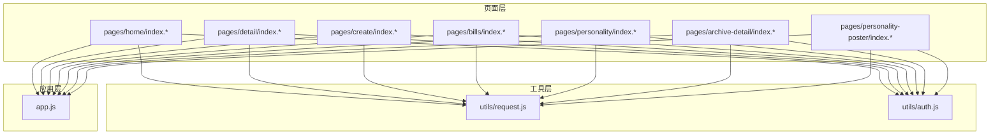
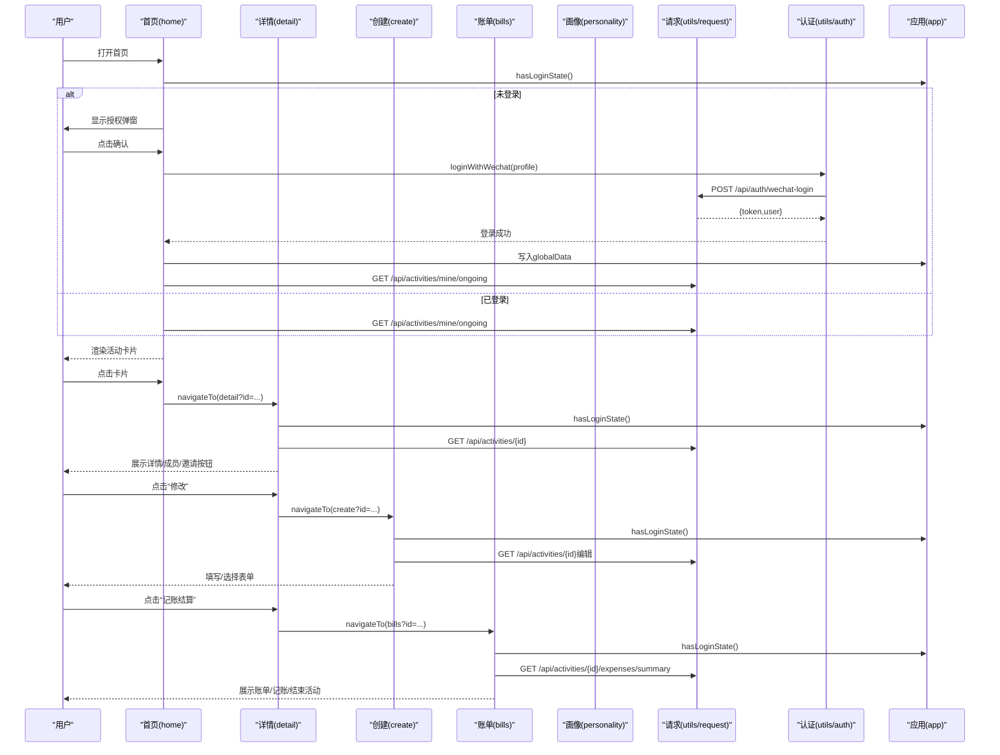
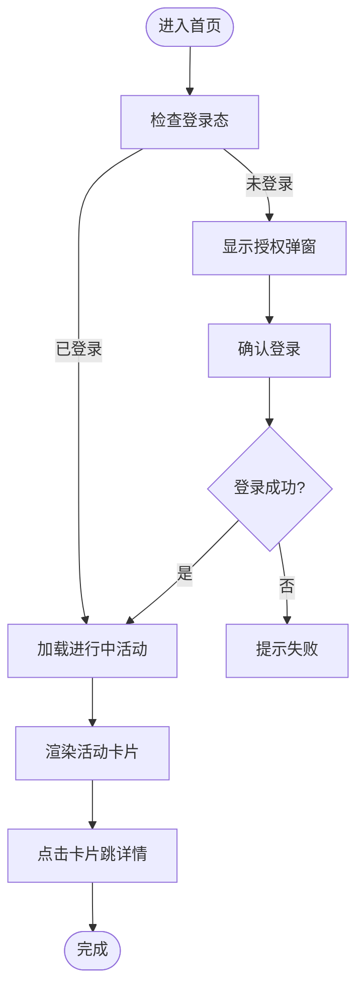
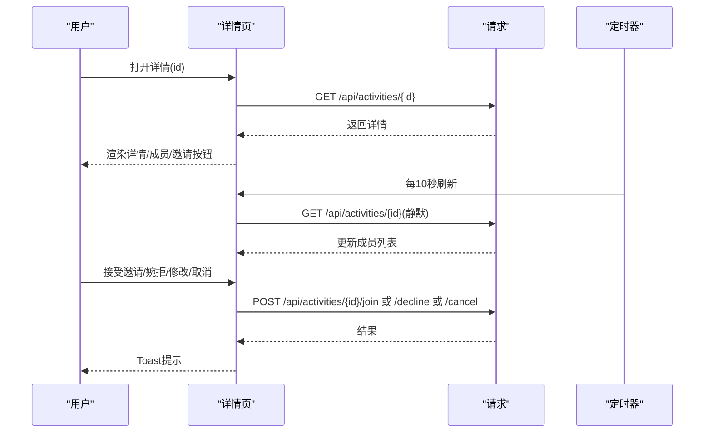
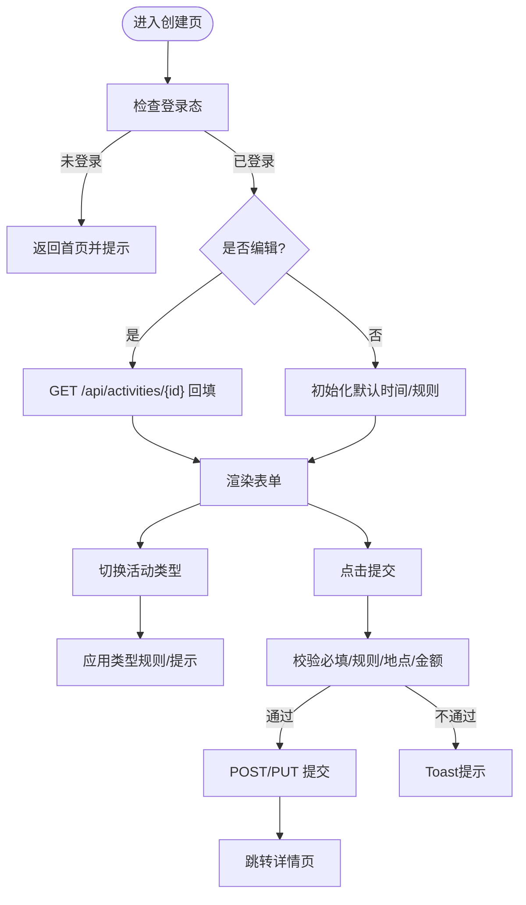
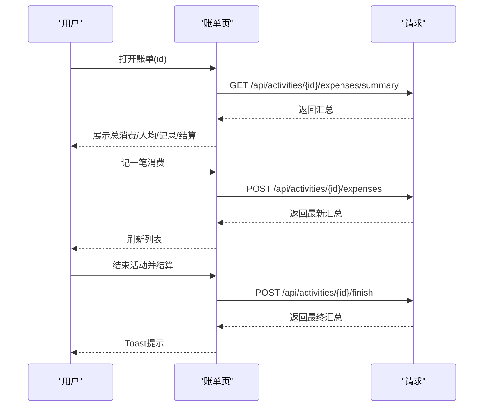
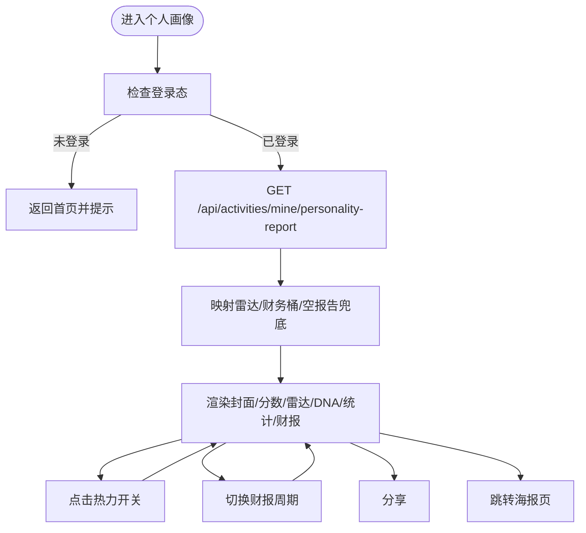
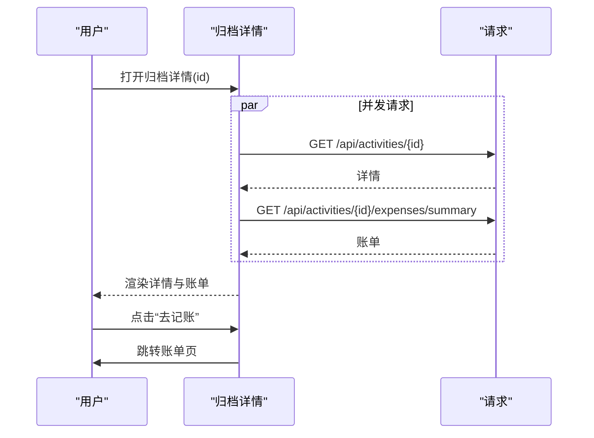
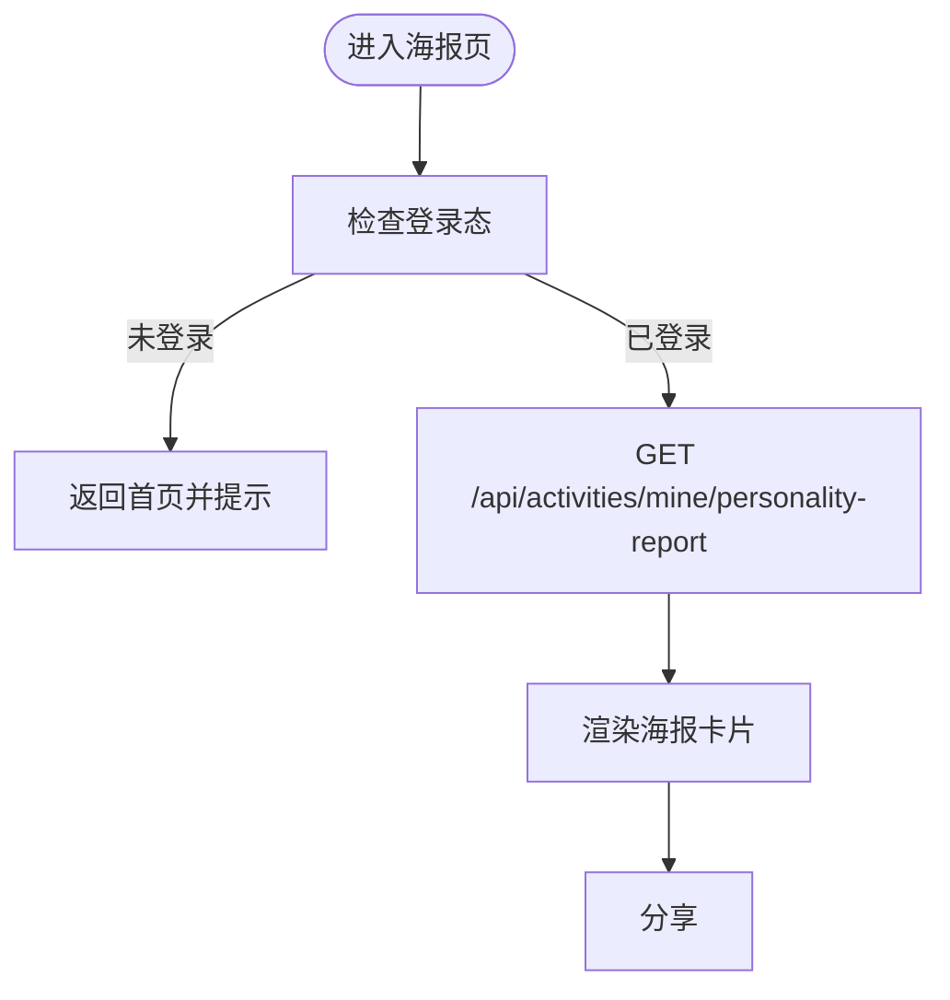
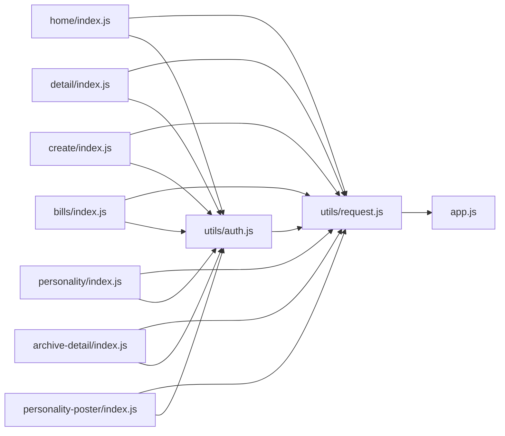

# 页面组件开发

<cite>
**本文引用的文件**
- [frontend/pages/home/index.js](file://frontend/pages/home/index.js)
- [frontend/pages/home/index.wxml](file://frontend/pages/home/index.wxml)
- [frontend/pages/detail/index.js](file://frontend/pages/detail/index.js)
- [frontend/pages/detail/index.wxml](file://frontend/pages/detail/index.wxml)
- [frontend/pages/create/index.js](file://frontend/pages/create/index.js)
- [frontend/pages/create/index.wxml](file://frontend/pages/create/index.wxml)
- [frontend/pages/bills/index.js](file://frontend/pages/bills/index.js)
- [frontend/pages/bills/index.wxml](file://frontend/pages/bills/index.wxml)
- [frontend/pages/personality/index.js](file://frontend/pages/personality/index.js)
- [frontend/pages/personality/index.wxml](file://frontend/pages/personality/index.wxml)
- [frontend/pages/archive-detail/index.js](file://frontend/pages/archive-detail/index.js)
- [frontend/pages/personality-poster/index.js](file://frontend/pages/personality-poster/index.js)
- [frontend/pages/personality-poster/index.wxml](file://frontend/pages/personality-poster/index.wxml)
- [frontend/app.js](file://frontend/app.js)
- [frontend/utils/request.js](file://frontend/utils/request.js)
- [frontend/utils/auth.js](file://frontend/utils/auth.js)
</cite>

## 目录
1. [简介](#简介)
2. [项目结构](#项目结构)
3. [核心组件](#核心组件)
4. [架构总览](#架构总览)
5. [详细组件分析](#详细组件分析)
6. [依赖关系分析](#依赖关系分析)
7. [性能考量](#性能考量)
8. [故障排查指南](#故障排查指南)
9. [结论](#结论)
10. [附录](#附录)

## 简介
本指南面向PlayMiniPro小程序前端页面组件开发，围绕首页home、活动详情detail、活动创建create、账单管理bills、个人画像personality、归档详情archive-detail、个人画像海报personality-poster等页面，系统讲解WXML模板语法、WXSS样式组织、JavaScript逻辑处理三者的协同；阐述页面间数据传递、事件处理、状态管理、生命周期钩子使用；并给出性能优化与用户体验提升策略。

## 项目结构
前端页面采用按页面分目录的组织方式，每个页面由四个文件组成：index.js（逻辑）、index.json（配置）、index.wxml（模板）、index.wxss（样式）。公共能力通过utils模块提供，应用级登录态通过app.js统一管理。

图表来源
- [frontend/pages/home/index.js:1-219](file://frontend/pages/home/index.js#L1-L219)
- [frontend/pages/detail/index.js:1-291](file://frontend/pages/detail/index.js#L1-L291)
- [frontend/pages/create/index.js:1-370](file://frontend/pages/create/index.js#L1-L370)
- [frontend/pages/bills/index.js:1-184](file://frontend/pages/bills/index.js#L1-L184)
- [frontend/pages/personality/index.js:1-128](file://frontend/pages/personality/index.js#L1-L128)
- [frontend/pages/archive-detail/index.js:1-132](file://frontend/pages/archive-detail/index.js#L1-L132)
- [frontend/pages/personality-poster/index.js:1-44](file://frontend/pages/personality-poster/index.js#L1-L44)
- [frontend/utils/request.js:1-107](file://frontend/utils/request.js#L1-L107)
- [frontend/utils/auth.js:1-56](file://frontend/utils/auth.js#L1-L56)
- [frontend/app.js:1-46](file://frontend/app.js#L1-L46)

章节来源
- [frontend/pages/home/index.js:1-219](file://frontend/pages/home/index.js#L1-L219)
- [frontend/pages/detail/index.js:1-291](file://frontend/pages/detail/index.js#L1-L291)
- [frontend/pages/create/index.js:1-370](file://frontend/pages/create/index.js#L1-L370)
- [frontend/pages/bills/index.js:1-184](file://frontend/pages/bills/index.js#L1-L184)
- [frontend/pages/personality/index.js:1-128](file://frontend/pages/personality/index.js#L1-L128)
- [frontend/pages/archive-detail/index.js:1-132](file://frontend/pages/archive-detail/index.js#L1-L132)
- [frontend/pages/personality-poster/index.js:1-44](file://frontend/pages/personality-poster/index.js#L1-L44)
- [frontend/utils/request.js:1-107](file://frontend/utils/request.js#L1-L107)
- [frontend/utils/auth.js:1-56](file://frontend/utils/auth.js#L1-L56)
- [frontend/app.js:1-46](file://frontend/app.js#L1-L46)

## 核心组件
- 应用级登录态与全局状态
  - 登录态同步：在App启动时读取本地存储的token与user，维护globalData。
  - 登录方法：封装微信登录、后端鉴权、本地持久化与全局注入。
  - 退出登录：清理本地存储与globalData。
- 请求封装
  - 自动拼接基础域名、注入Authorization头、统一封装错误处理与鉴权失效清理。
  - 提供环境切换（本地/生产）与自定义基地址能力。
- 认证流程
  - 微信登录换取后端token，合并用户资料，写入storage与globalData。

章节来源
- [frontend/app.js:1-46](file://frontend/app.js#L1-L46)
- [frontend/utils/request.js:1-107](file://frontend/utils/request.js#L1-L107)
- [frontend/utils/auth.js:1-56](file://frontend/utils/auth.js#L1-L56)

## 架构总览
页面组件遵循“页面即组件”的思想，每个页面独立管理自身状态与UI，通过utils层完成网络请求与认证，通过App层共享登录态。页面间通过路由参数传递数据，通过Storage传递跨页面上下文（如邀请路径）。

图表来源
- [frontend/pages/home/index.js:1-219](file://frontend/pages/home/index.js#L1-L219)
- [frontend/pages/detail/index.js:1-291](file://frontend/pages/detail/index.js#L1-L291)
- [frontend/pages/create/index.js:1-370](file://frontend/pages/create/index.js#L1-L370)
- [frontend/pages/bills/index.js:1-184](file://frontend/pages/bills/index.js#L1-L184)
- [frontend/utils/request.js:1-107](file://frontend/utils/request.js#L1-L107)
- [frontend/utils/auth.js:1-56](file://frontend/utils/auth.js#L1-L56)
- [frontend/app.js:1-46](file://frontend/app.js#L1-L46)

## 详细组件分析

### 首页 home 组件
- 功能要点
  - 首次进入尝试静默登录，若缓存存在则自动登录并加载“我正在整的”活动列表。
  - 未登录时弹出授权弹窗，支持选择头像与输入昵称，确认后调用登录并刷新数据。
  - 列表项点击跳转至活动详情；顶部快捷入口跳转至活动档案、个人画像、账单。
  - 若登录过期，提示重新登录并清空列表。
- 数据与事件
  - 列表渲染：通过wxml的block循环绑定数据源。
  - 事件绑定：授权弹窗、导航、列表项点击。
- 生命周期
  - onShow：检查登录态、加载活动、处理待处理邀请路径。
- 性能与体验
  - 静默登录减少重复授权；列表懒加载避免首屏阻塞。
  - 时间格式化、占位文案提升可用性。

图表来源
- [frontend/pages/home/index.js:1-219](file://frontend/pages/home/index.js#L1-L219)
- [frontend/pages/home/index.wxml:1-122](file://frontend/pages/home/index.wxml#L1-L122)

章节来源
- [frontend/pages/home/index.js:1-219](file://frontend/pages/home/index.js#L1-L219)
- [frontend/pages/home/index.wxml:1-122](file://frontend/pages/home/index.wxml#L1-L122)

### 活动详情 detail 组件
- 功能要点
  - 加载活动详情，根据是否为创建者显示“修改/取消”，根据状态显示“接受邀请/婉拒”。
  - 成员列表定时刷新，保持与后端一致。
  - 支持分享给好友/群聊。
  - 线下活动可跳转账单页。
- 数据与事件
  - 详情映射：标签、模式、费用模式、状态文案、成员头像短名等。
  - 定时器：每10秒刷新一次成员列表。
- 生命周期
  - onLoad/onShow/onHide/onUnload：管理定时器生命周期。
- 错误处理
  - 鉴权失效时跳回首页并提示。

图表来源
- [frontend/pages/detail/index.js:1-291](file://frontend/pages/detail/index.js#L1-L291)
- [frontend/pages/detail/index.wxml:1-77](file://frontend/pages/detail/index.wxml#L1-L77)

章节来源
- [frontend/pages/detail/index.js:1-291](file://frontend/pages/detail/index.js#L1-L291)
- [frontend/pages/detail/index.wxml:1-77](file://frontend/pages/detail/index.wxml#L1-L77)

### 活动创建 create 组件
- 功能要点
  - 表单驱动：主题、类型、日期/时间、人数、方式、地点、费用模式、备注。
  - 类型规则：不同活动类型强制线上/线下、是否必填地点、默认标题等。
  - 编辑模式：根据id拉取详情，回填表单。
  - 提交校验：必填项、类型规则、地点必填、金额格式等。
- 数据与事件
  - 表单字段双向绑定，选择器联动更新规则提示。
  - 地点选择：wx.chooseLocation回调设置地点与地址。
- 生命周期
  - onLoad：判断登录、编辑或新建、初始化默认时间。
- 提交流程
  - 组装payload，POST/PUT提交，成功后跳转详情页。

图表来源
- [frontend/pages/create/index.js:1-370](file://frontend/pages/create/index.js#L1-L370)
- [frontend/pages/create/index.wxml:1-145](file://frontend/pages/create/index.wxml#L1-L145)

章节来源
- [frontend/pages/create/index.js:1-370](file://frontend/pages/create/index.js#L1-L370)
- [frontend/pages/create/index.wxml:1-145](file://frontend/pages/create/index.wxml#L1-L145)

### 账单管理 bills 组件
- 功能要点
  - 从路由参数接收活动id，加载账单汇总与明细。
  - 记一笔消费：输入事项与金额，提交后实时刷新。
  - 结束活动并结算：弹窗确认后触发结束接口，更新汇总。
  - 未传id时引导前往活动档案。
- 数据与事件
  - 汇总映射：总消费、人均、结算人数、记录数、费用模式标签等。
  - 金额转换：元转分，格式化显示。
- 生命周期
  - onLoad：校验登录、解析id、加载汇总。
- 交互细节
  - 只有创建者且可添加消费时才显示记账区域；只有可结束时显示结束按钮。

图表来源
- [frontend/pages/bills/index.js:1-184](file://frontend/pages/bills/index.js#L1-L184)
- [frontend/pages/bills/index.wxml:1-114](file://frontend/pages/bills/index.wxml#L1-L114)

章节来源
- [frontend/pages/bills/index.js:1-184](file://frontend/pages/bills/index.js#L1-L184)
- [frontend/pages/bills/index.wxml:1-114](file://frontend/pages/bills/index.wxml#L1-L114)

### 个人画像 personality 组件
- 功能要点
  - 加载个人AI人格报告，渲染封面、分数、雷达图、兴趣DNA、社交属性、活动统计、财报、锐评、荣誉、动物人格等。
  - 支持切换财报统计周期（日/周/月/季/年），动态渲染对应桶。
  - 支持分享。
  - 提供跳转海报页入口。
- 数据与事件
  - 报告映射：雷达指标、多边形路径、财务桶解析、空报告兜底。
  - 周期切换：根据当前周期过滤财务桶。
- 生命周期
  - onShow：检查登录、加载报告、显示分享菜单。

图表来源
- [frontend/pages/personality/index.js:1-128](file://frontend/pages/personality/index.js#L1-L128)
- [frontend/pages/personality/index.wxml:1-166](file://frontend/pages/personality/index.wxml#L1-L166)

章节来源
- [frontend/pages/personality/index.js:1-128](file://frontend/pages/personality/index.js#L1-L128)
- [frontend/pages/personality/index.wxml:1-166](file://frontend/pages/personality/index.wxml#L1-L166)

### 归档详情 archive-detail 组件
- 功能要点
  - 并发加载活动详情与账单汇总，统一映射后渲染。
  - 支持从详情跳转账单页。
- 数据与事件
  - 并行Promise：详情与账单同时请求，提升首屏速度。
  - 映射：状态标签、模式标签、费用模式标签、时间/地点格式化、成员角色标签等。

图表来源
- [frontend/pages/archive-detail/index.js:1-132](file://frontend/pages/archive-detail/index.js#L1-L132)

章节来源
- [frontend/pages/archive-detail/index.js:1-132](file://frontend/pages/archive-detail/index.js#L1-L132)

### 个人画像海报 personality-poster 组件
- 功能要点
  - 加载与个人画像相同的报告，渲染海报式卡片，支持分享。
- 生命周期
  - onShow：检查登录、加载报告、显示分享菜单。

图表来源
- [frontend/pages/personality-poster/index.js:1-44](file://frontend/pages/personality-poster/index.js#L1-L44)
- [frontend/pages/personality-poster/index.wxml:1-55](file://frontend/pages/personality-poster/index.wxml#L1-L55)

章节来源
- [frontend/pages/personality-poster/index.js:1-44](file://frontend/pages/personality-poster/index.js#L1-L44)
- [frontend/pages/personality-poster/index.wxml:1-55](file://frontend/pages/personality-poster/index.wxml#L1-L55)

## 依赖关系分析
- 页面到工具层
  - 所有页面均依赖utils/request.js进行HTTP请求，依赖utils/auth.js进行登录认证。
- 工具层到应用层
  - utils/auth.js依赖utils/request.js；utils/request.js依赖App实例清理鉴权状态。
- 页面到页面
  - 首页跳详情、详情跳创建/账单、详情跳归档详情、个人画像跳海报等，通过navigateTo/redirectTo传递id与source参数。
- 状态与存储
  - 登录态通过App.globalData与Storage共享；邀请路径通过Storage临时缓存。

图表来源
- [frontend/pages/home/index.js:1-219](file://frontend/pages/home/index.js#L1-L219)
- [frontend/pages/detail/index.js:1-291](file://frontend/pages/detail/index.js#L1-L291)
- [frontend/pages/create/index.js:1-370](file://frontend/pages/create/index.js#L1-L370)
- [frontend/pages/bills/index.js:1-184](file://frontend/pages/bills/index.js#L1-L184)
- [frontend/pages/personality/index.js:1-128](file://frontend/pages/personality/index.js#L1-L128)
- [frontend/pages/archive-detail/index.js:1-132](file://frontend/pages/archive-detail/index.js#L1-L132)
- [frontend/pages/personality-poster/index.js:1-44](file://frontend/pages/personality-poster/index.js#L1-L44)
- [frontend/utils/request.js:1-107](file://frontend/utils/request.js#L1-L107)
- [frontend/utils/auth.js:1-56](file://frontend/utils/auth.js#L1-L56)
- [frontend/app.js:1-46](file://frontend/app.js#L1-L46)

章节来源
- [frontend/utils/request.js:1-107](file://frontend/utils/request.js#L1-L107)
- [frontend/utils/auth.js:1-56](file://frontend/utils/auth.js#L1-L56)
- [frontend/app.js:1-46](file://frontend/app.js#L1-L46)

## 性能考量
- 请求与鉴权
  - 统一注入Authorization头，避免重复鉴权；鉴权失效统一清理本地状态并跳转首页。
  - 环境切换与自定义基地址，便于联调与灰度。
- 页面渲染
  - 首页列表使用block循环渲染，减少不必要的节点；详情定时刷新控制在合理频率（10秒）。
  - 个人画像雷达图通过CSS clip-path绘制，避免额外图片资源。
- 交互与体验
  - 静默登录减少重复授权；失败Toast提示与占位文案提升可用性。
  - 并发请求详情与账单，缩短首屏等待。
- 存储与状态
  - 使用Storage缓存邀请路径，登录后一次性消费，避免重复跳转。

## 故障排查指南
- 登录态异常
  - 现象：接口返回401/403或提示“登录已过期”。
  - 处理：调用鉴权清理函数，清除本地token/user，跳转首页重新登录。
- 网络请求失败
  - 现象：提示“后端没启动，先开服务”或“请求失败”。
  - 处理：检查环境配置与自定义基地址；确认后端服务运行。
- 表单校验失败
  - 现象：提示“请先选时间/先写活动主题/线下活动要填地点/金额填对一点”等。
  - 处理：根据提示完善必填项与规则；注意金额需为正数。
- 定时刷新问题
  - 现象：成员列表不刷新或频繁刷新。
  - 处理：确保在onShow时启动，在onHide/onUnload时停止；避免重复setInterval。

章节来源
- [frontend/utils/request.js:68-95](file://frontend/utils/request.js#L68-L95)
- [frontend/pages/create/index.js:219-282](file://frontend/pages/create/index.js#L219-L282)
- [frontend/pages/bills/index.js:59-96](file://frontend/pages/bills/index.js#L59-L96)
- [frontend/pages/detail/index.js:190-205](file://frontend/pages/detail/index.js#L190-L205)

## 结论
本指南梳理了PlayMiniPro前端页面组件的开发范式：以页面为中心的状态与逻辑、以工具层为支撑的请求与认证、以应用层为纽带的登录态管理。通过规范的生命周期使用、合理的数据映射与事件处理、以及性能与体验优化策略，能够高效构建可维护的小程序页面体系。

## 附录
- WXML模板语法要点
  - 数据绑定：双花括号表达式、条件渲染、列表渲染、事件绑定。
  - 组件与开放能力：open-type="chooseAvatar"/"share"、picker/textarea等原生组件。
- WXSS样式组织
  - 页面级样式与通用样式分离；通过类名组合实现卡片、按钮、网格等布局。
- JavaScript逻辑处理
  - Page对象内data定义状态，methods处理事件，生命周期钩子控制数据加载与资源释放。
- 页面间数据传递
  - 路由参数（id/source）、Storage（邀请路径）、App全局数据（登录态）。
- 状态管理
  - 页面内局部状态为主，跨页面通过Storage/App共享；避免全局复杂状态库，降低耦合。