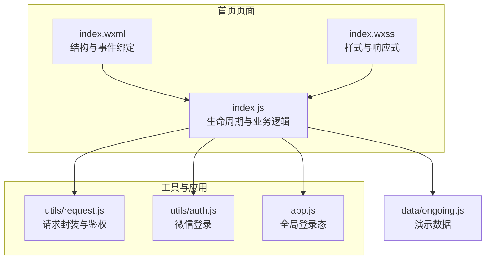
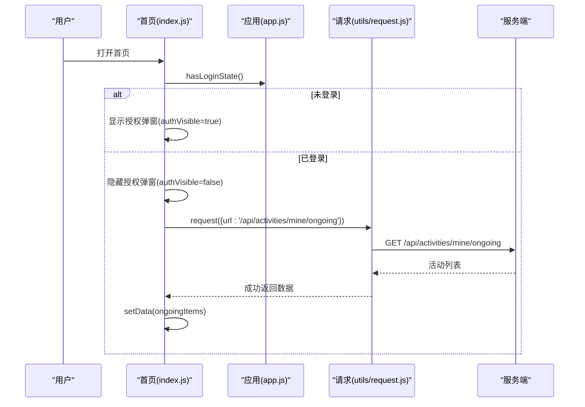
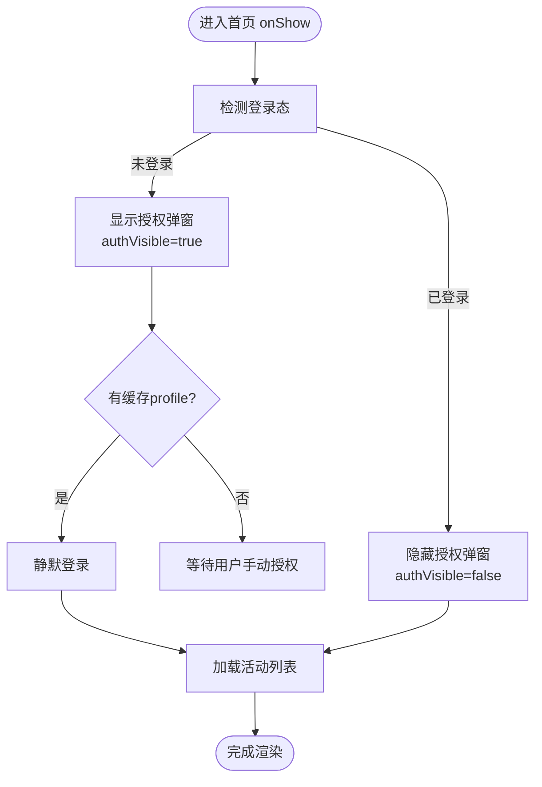
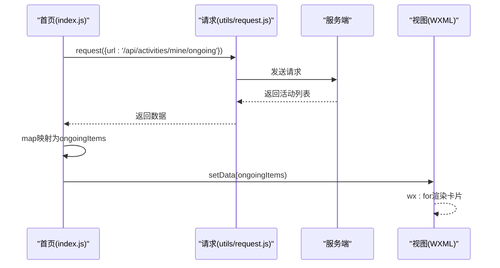
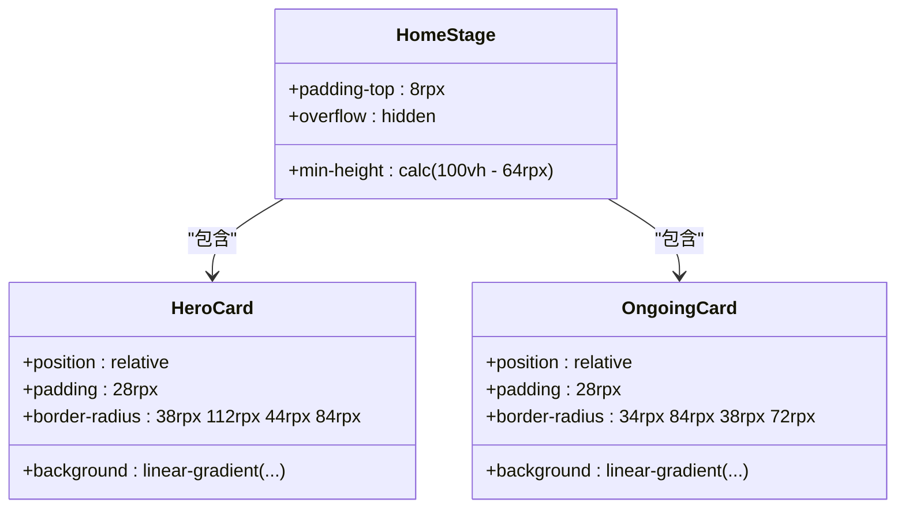
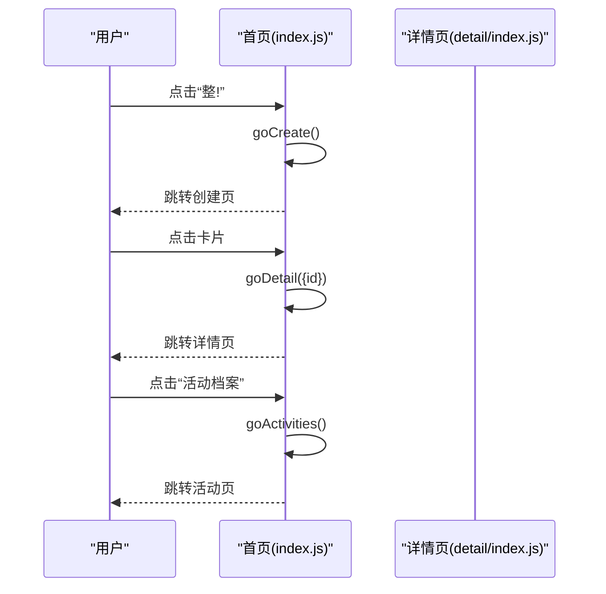
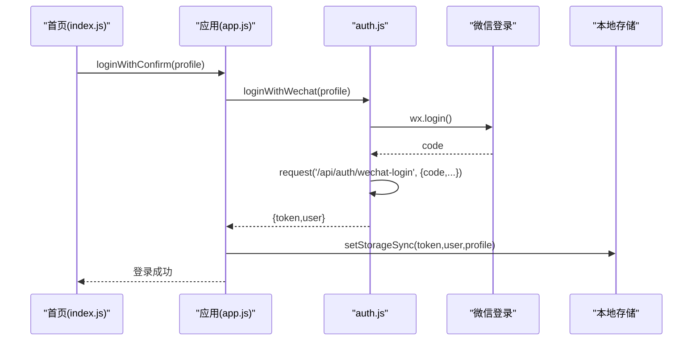
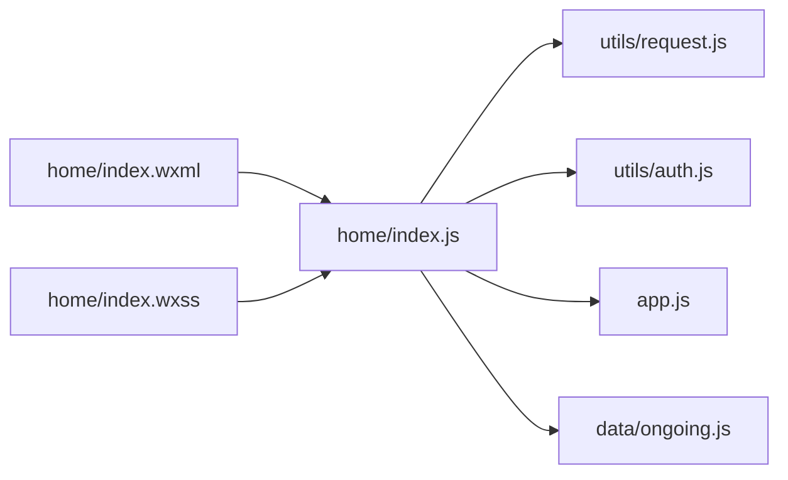

# 首页开发

<cite>
**本文引用的文件**
- [frontend/pages/home/index.js](file://frontend/pages/home/index.js)
- [frontend/pages/home/index.json](file://frontend/pages/home/index.json)
- [frontend/pages/home/index.wxml](file://frontend/pages/home/index.wxml)
- [frontend/pages/home/index.wxss](file://frontend/pages/home/index.wxss)
- [frontend/utils/request.js](file://frontend/utils/request.js)
- [frontend/app.js](file://frontend/app.js)
- [frontend/utils/auth.js](file://frontend/utils/auth.js)
- [frontend/data/ongoing.js](file://frontend/data/ongoing.js)
- [frontend/pages/detail/index.js](file://frontend/pages/detail/index.js)
</cite>

## 目录
1. [引言](#引言)
2. [项目结构](#项目结构)
3. [核心组件](#核心组件)
4. [架构总览](#架构总览)
5. [详细组件分析](#详细组件分析)
6. [依赖关系分析](#依赖关系分析)
7. [性能考虑](#性能考虑)
8. [故障排查指南](#故障排查指南)
9. [结论](#结论)
10. [附录](#附录)

## 引言
本文件面向PlayMiniPro小程序“首页（home）”页面的开发与维护，系统性阐述页面整体架构、数据获取与渲染机制、UI布局与响应式适配、生命周期与事件处理、活动卡片动态加载与导航跳转等关键实现，并给出性能优化策略、用户体验设计原则与交互效果实现建议。文档以实际源码为依据，辅以可视化图表帮助理解。

## 项目结构
首页home位于前端pages目录下，采用标准WXML + WXSS + JS三件套组织，配合全局应用逻辑与通用请求封装，形成清晰的分层结构：
- 页面层：index.wxml定义结构，index.wxss负责样式，index.js承载逻辑与生命周期
- 工具层：request.js提供统一网络请求与鉴权处理，auth.js封装微信登录流程
- 应用层：app.js管理全局登录态同步与切换
- 数据层：data/ongoing.js提供演示数据（用于开发与测试）

**图表来源**
- [frontend/pages/home/index.js:1-219](file://frontend/pages/home/index.js#L1-L219)
- [frontend/pages/home/index.wxml:1-122](file://frontend/pages/home/index.wxml#L1-L122)
- [frontend/pages/home/index.wxss:1-504](file://frontend/pages/home/index.wxss#L1-L504)
- [frontend/utils/request.js:1-107](file://frontend/utils/request.js#L1-L107)
- [frontend/utils/auth.js:1-56](file://frontend/utils/auth.js#L1-L56)
- [frontend/app.js:1-46](file://frontend/app.js#L1-L46)
- [frontend/data/ongoing.js:1-37](file://frontend/data/ongoing.js#L1-L37)

**章节来源**
- [frontend/pages/home/index.js:1-219](file://frontend/pages/home/index.js#L1-L219)
- [frontend/pages/home/index.json:1-3](file://frontend/pages/home/index.json#L1-L3)
- [frontend/pages/home/index.wxml:1-122](file://frontend/pages/home/index.wxml#L1-L122)
- [frontend/pages/home/index.wxss:1-504](file://frontend/pages/home/index.wxss#L1-L504)
- [frontend/utils/request.js:1-107](file://frontend/utils/request.js#L1-L107)
- [frontend/app.js:1-46](file://frontend/app.js#L1-L46)
- [frontend/utils/auth.js:1-56](file://frontend/utils/auth.js#L1-L56)
- [frontend/data/ongoing.js:1-37](file://frontend/data/ongoing.js#L1-L37)

## 核心组件
- 页面容器与遮罩层：通过auth-visible控制登录授权弹窗显示，内部包含头像选择、昵称输入与确认按钮
- 英雄区（Hero Card）：包含品牌信息、引导按钮与快捷入口（活动档案、AI人格档案）
- 我正在整的区域：展示正在进行的活动卡片列表，支持点击跳转详情
- 登录态与静默登录：基于本地存储的profile尝试静默登录，失败则弹出授权框
- 请求与鉴权：统一的请求封装，自动处理401/403并清理鉴权状态

**章节来源**
- [frontend/pages/home/index.js:4-208](file://frontend/pages/home/index.js#L4-L208)
- [frontend/pages/home/index.wxml:1-122](file://frontend/pages/home/index.wxml#L1-L122)
- [frontend/pages/home/index.wxss:1-504](file://frontend/pages/home/index.wxss#L1-L504)
- [frontend/utils/request.js:50-95](file://frontend/utils/request.js#L50-L95)
- [frontend/app.js:14-38](file://frontend/app.js#L14-L38)

## 架构总览
首页采用“页面逻辑 + 工具库 + 应用态”的分层架构。页面在onShow中根据登录态决定是否执行静默登录与数据加载；数据加载通过统一请求封装完成，错误时触发重登提示；UI由WXML/WXSS负责呈现，JS仅做数据与事件桥接。

**图表来源**
- [frontend/pages/home/index.js:14-53](file://frontend/pages/home/index.js#L14-L53)
- [frontend/utils/request.js:50-80](file://frontend/utils/request.js#L50-L80)
- [frontend/app.js:29-31](file://frontend/app.js#L29-L31)

## 详细组件分析

### 页面生命周期与登录态管理
- onShow：优先检测登录态；若未登录且存在缓存profile，则尝试静默登录；否则弹出授权弹窗
- 静默登录成功后立即加载活动列表，并消费可能存在的邀请路径
- 若登录态失效（401/403），统一提示并清空本地鉴权状态

**图表来源**
- [frontend/pages/home/index.js:14-53](file://frontend/pages/home/index.js#L14-L53)

**章节来源**
- [frontend/pages/home/index.js:14-53](file://frontend/pages/home/index.js#L14-L53)
- [frontend/utils/request.js:82-95](file://frontend/utils/request.js#L82-L95)
- [frontend/app.js:14-38](file://frontend/app.js#L14-L38)

### 活动列表数据获取与渲染
- 数据来源：调用后端接口获取“我参与的进行中”活动列表
- 数据映射：将后端字段映射为页面展示字段（标签、模式、时间、地点、人数、成员等）
- 渲染方式：WXML通过wx:for遍历渲染活动卡片，点击卡片跳转详情页

**图表来源**
- [frontend/pages/home/index.js:55-85](file://frontend/pages/home/index.js#L55-L85)
- [frontend/pages/home/index.wxml:94-119](file://frontend/pages/home/index.wxml#L94-L119)

**章节来源**
- [frontend/pages/home/index.js:55-85](file://frontend/pages/home/index.js#L55-L85)
- [frontend/pages/home/index.wxml:94-119](file://frontend/pages/home/index.wxml#L94-L119)

### 用户界面布局与响应式样式
- 布局结构：页面主体采用相对定位，包含多个装饰元素（光晕、彩带、火花）提升视觉层次
- 卡片主题：英雄卡与活动卡分别使用渐变背景与圆角设计，营造柔和质感
- 响应式适配：使用rpx单位，配合flex与grid布局在不同屏幕尺寸下保持良好比例

**图表来源**
- [frontend/pages/home/index.wxss:1-504](file://frontend/pages/home/index.wxss#L1-L504)

**章节来源**
- [frontend/pages/home/index.wxss:1-504](file://frontend/pages/home/index.wxss#L1-L504)

### 事件处理与导航跳转
- 授权相关：头像选择、昵称输入、确认登录
- 导航跳转：创建活动、活动档案、AI人格档案、账单、活动详情
- 交互反馈：加载态、Toast提示、路由跳转

**图表来源**
- [frontend/pages/home/index.js:124-157](file://frontend/pages/home/index.js#L124-L157)
- [frontend/pages/detail/index.js:30-51](file://frontend/pages/detail/index.js#L30-L51)

**章节来源**
- [frontend/pages/home/index.js:124-157](file://frontend/pages/home/index.js#L124-L157)
- [frontend/pages/detail/index.js:30-51](file://frontend/pages/detail/index.js#L30-L51)

### 动态加载、下拉刷新与上拉加载
- 当前实现：首页在onShow中一次性加载“我正在整的”活动列表
- 下拉刷新：页面未内置下拉刷新绑定，如需实现可在wxml添加下拉刷新组件并在js中绑定回调
- 上拉加载：页面未实现滚动触底加载更多，如需实现可在wxml添加触底监听并在js中拼接分页参数继续请求

说明：以上为基于现有代码的功能现状与扩展建议，非当前实现。

**章节来源**
- [frontend/pages/home/index.js:14-53](file://frontend/pages/home/index.js#L14-L53)

### 登录授权与静默登录流程
- 静默登录：若本地存在profile且未尝试过静默登录，则自动调用应用登录方法
- 手动授权：用户可选择头像与昵称，确认后触发微信登录并写入本地存储
- 订阅权限：首次登录时请求初始订阅权限，允许用户拒绝但仍可正常使用

**图表来源**
- [frontend/pages/home/index.js:28-34](file://frontend/pages/home/index.js#L28-L34)
- [frontend/app.js:33-38](file://frontend/app.js#L33-L38)
- [frontend/utils/auth.js:3-48](file://frontend/utils/auth.js#L3-L48)

**章节来源**
- [frontend/pages/home/index.js:19-47](file://frontend/pages/home/index.js#L19-L47)
- [frontend/app.js:33-38](file://frontend/app.js#L33-L38)
- [frontend/utils/auth.js:3-48](file://frontend/utils/auth.js#L3-L48)

## 依赖关系分析
首页与工具库、应用态之间存在明确的依赖关系，耦合度低、职责清晰：
- index.js依赖request.js进行网络请求，依赖auth.js进行登录，依赖app.js进行全局状态管理
- 样式与结构分离，便于维护与复用
- 演示数据仅用于开发阶段，生产环境由后端接口提供

**图表来源**
- [frontend/pages/home/index.js:1-2](file://frontend/pages/home/index.js#L1-L2)
- [frontend/utils/request.js:1-107](file://frontend/utils/request.js#L1-L107)
- [frontend/utils/auth.js:1-56](file://frontend/utils/auth.js#L1-L56)
- [frontend/app.js:1-46](file://frontend/app.js#L1-L46)
- [frontend/data/ongoing.js:1-37](file://frontend/data/ongoing.js#L1-L37)

**章节来源**
- [frontend/pages/home/index.js:1-2](file://frontend/pages/home/index.js#L1-L2)
- [frontend/utils/request.js:1-107](file://frontend/utils/request.js#L1-L107)
- [frontend/utils/auth.js:1-56](file://frontend/utils/auth.js#L1-L56)
- [frontend/app.js:1-46](file://frontend/app.js#L1-L46)
- [frontend/data/ongoing.js:1-37](file://frontend/data/ongoing.js#L1-L37)

## 性能考虑
- 首屏渲染：将活动列表映射为轻量对象，避免冗余字段，减少setData体积
- 网络请求：统一鉴权头与错误处理，避免重复请求；对401/403及时清理鉴权状态
- 视图更新：使用setData进行局部更新，避免全量重绘
- 资源优化：图片采用合适的尺寸与格式，必要时启用懒加载
- 交互反馈：在长耗时操作中提供loading态，提升感知速度

[本节为通用性能建议，不直接分析具体文件]

## 故障排查指南
- 登录态异常
  - 现象：出现“登录已过期，请重新确认”提示
  - 处理：调用重登流程，清理本地鉴权状态，重新获取token
- 请求失败
  - 现象：加载失败Toast提示
  - 处理：检查网络与后端接口可用性，确认鉴权头是否正确携带
- 静默登录失败
  - 现象：缓存profile存在但静默登录抛错
  - 处理：降级为手动授权流程，确保头像与昵称合法

**章节来源**
- [frontend/pages/home/index.js:74-84](file://frontend/pages/home/index.js#L74-L84)
- [frontend/pages/home/index.js:181-195](file://frontend/pages/home/index.js#L181-L195)
- [frontend/utils/request.js:82-95](file://frontend/utils/request.js#L82-L95)

## 结论
首页home页面通过清晰的分层设计与统一的工具库，实现了从登录态管理、数据加载到UI渲染的完整闭环。当前版本聚焦于“我正在整的”活动列表一次性加载与基础交互；未来可在下拉刷新与上拉加载方面进一步增强体验。遵循本文的架构与优化建议，可确保页面在复杂场景下仍保持良好的性能与可维护性。

## 附录
- 页面标题：在index.json中设置导航栏标题为“来整”
- 快捷入口：提供创建活动、活动档案、AI人格档案等快速跳转
- 演示数据：开发阶段可使用data/ongoing.js提供的样例数据进行联调

**章节来源**
- [frontend/pages/home/index.json:1-3](file://frontend/pages/home/index.json#L1-L3)
- [frontend/pages/home/index.wxml:66-76](file://frontend/pages/home/index.wxml#L66-L76)
- [frontend/data/ongoing.js:1-37](file://frontend/data/ongoing.js#L1-L37)