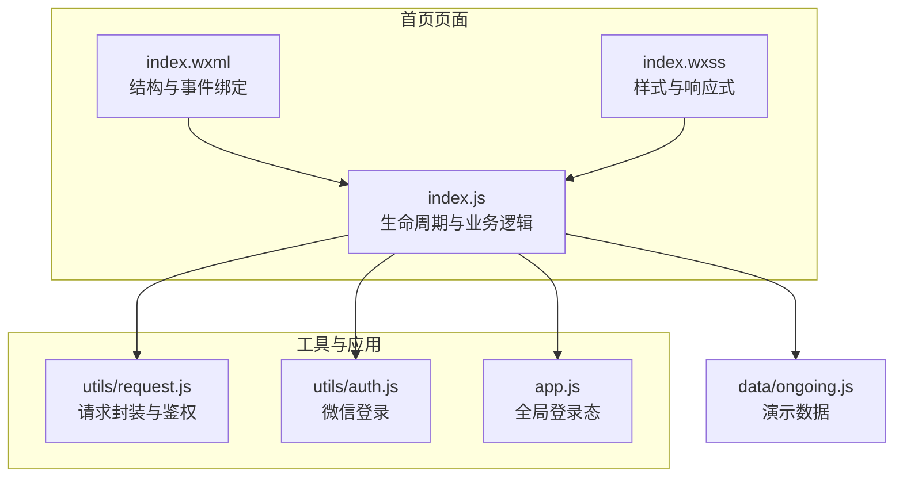
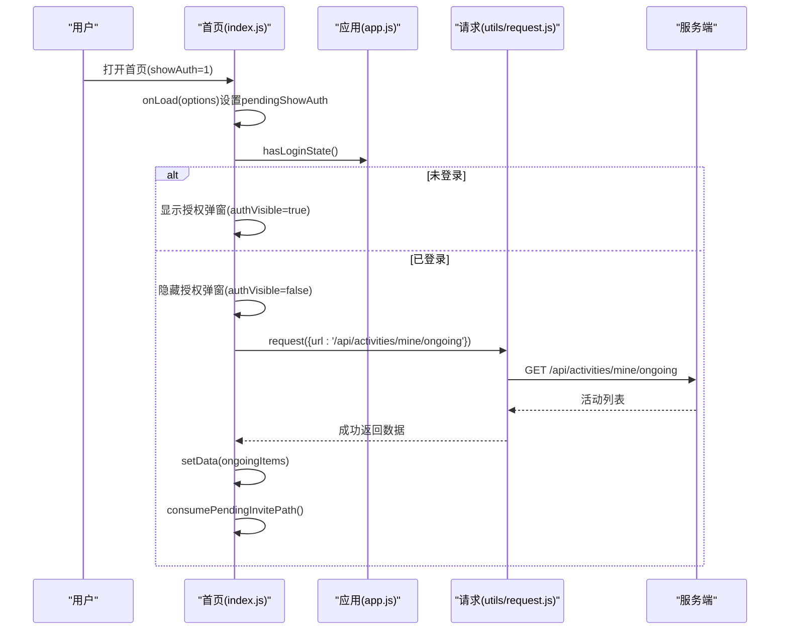
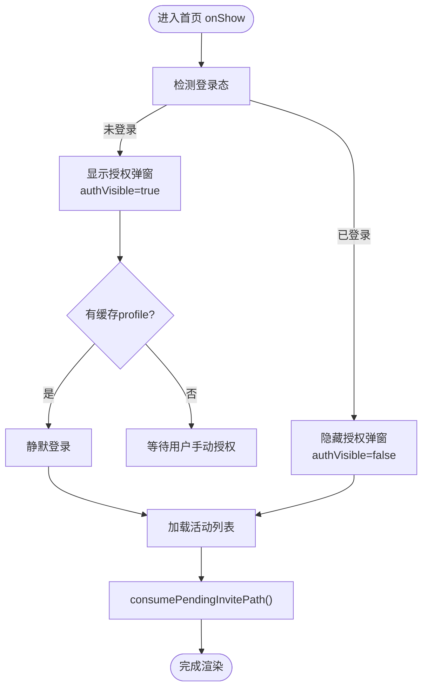
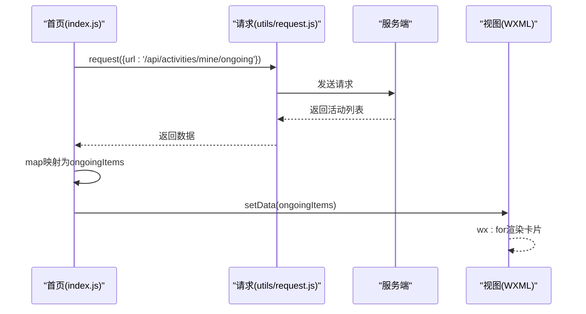
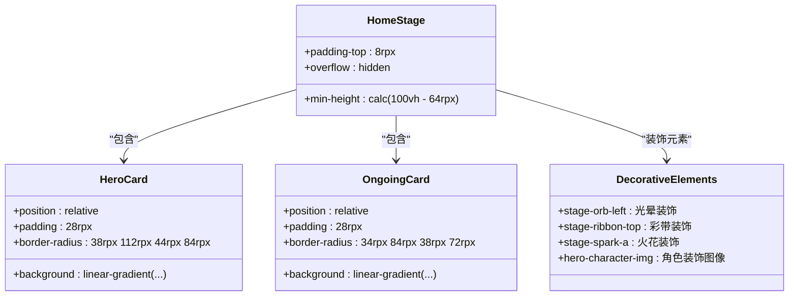
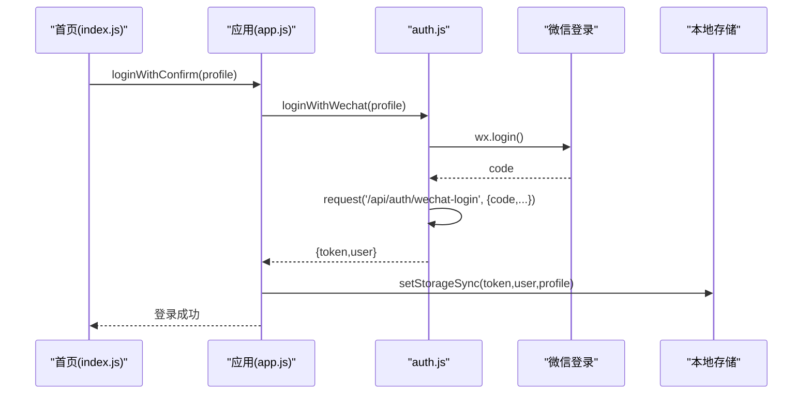
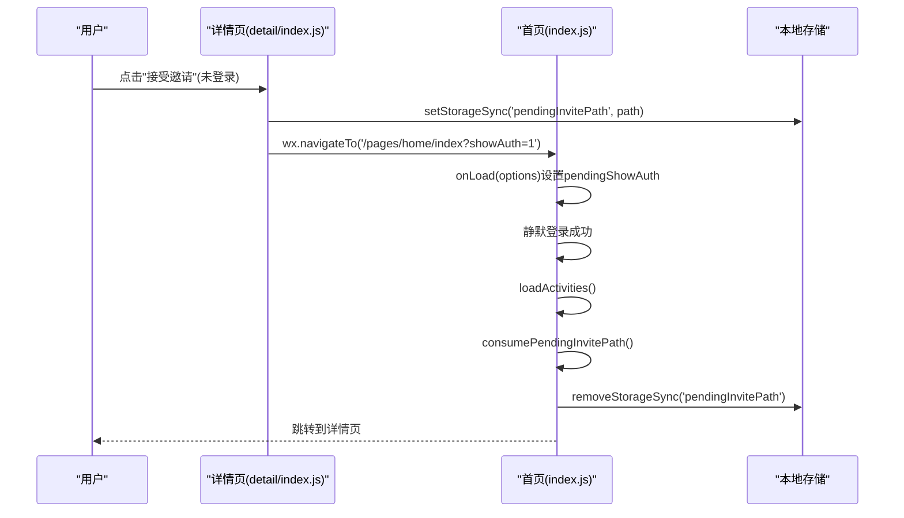
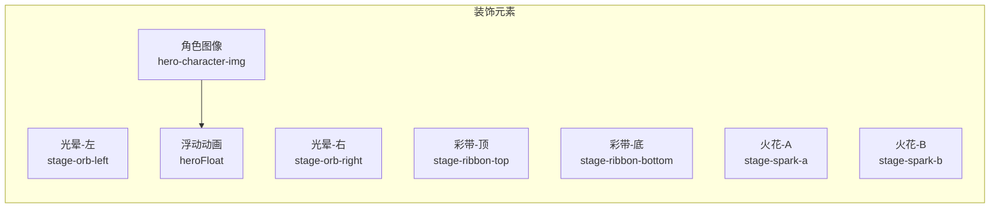
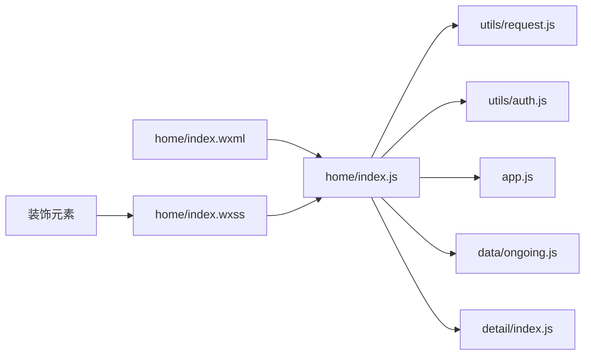

# 首页开发

<cite>
**本文引用的文件**
- [frontend/pages/home/index.js](file://frontend/pages/home/index.js)
- [frontend/pages/home/index.json](file://frontend/pages/home/index.json)
- [frontend/pages/home/index.wxml](file://frontend/pages/home/index.wxml)
- [frontend/pages/home/index.wxss](file://frontend/pages/home/index.wxss)
- [frontend/utils/request.js](file://frontend/utils/request.js)
- [frontend/app.js](file://frontend/app.js)
- [frontend/utils/auth.js](file://frontend/utils/auth.js)
- [frontend/data/ongoing.js](file://frontend/data/ongoing.js)
- [frontend/pages/detail/index.js](file://frontend/pages/detail/index.js)
</cite>

## 目录
1. [引言](#引言)
2. [项目结构](#项目结构)
3. [核心组件](#核心组件)
4. [架构总览](#架构总览)
5. [详细组件分析](#详细组件分析)
6. [装饰性UI元素与动画效果](#装饰性ui元素与动画效果)
7. [依赖关系分析](#依赖关系分析)
8. [性能考虑](#性能考虑)
9. [故障排查指南](#故障排查指南)
10. [结论](#结论)
11. [附录](#附录)

## 引言
本文件面向PlayMiniPro小程序"首页（home）"页面的开发与维护，系统性阐述页面整体架构、数据获取与渲染机制、UI布局与响应式适配、生命周期与事件处理、活动卡片动态加载与导航跳转等关键实现，并给出性能优化策略、用户体验设计原则与交互效果实现建议。文档以实际源码为依据，辅以可视化图表帮助理解。

**更新** 本次更新重点反映了新增的装饰性UI元素和浮动动画效果，包括角色装饰图像和多个装饰性图形元素，显著增强了页面的视觉吸引力和用户体验。

## 项目结构
首页home位于前端pages目录下，采用标准WXML + WXSS + JS三件套组织，配合全局应用逻辑与通用请求封装，形成清晰的分层结构：
- 页面层：index.wxml定义结构，index.wxss负责样式，index.js承载逻辑与生命周期
- 工具层：request.js提供统一网络请求与鉴权处理，auth.js封装微信登录流程
- 应用层：app.js管理全局登录态同步与切换
- 数据层：data/ongoing.js提供演示数据（用于开发与测试）

**图表来源**
- [frontend/pages/home/index.js:1-234](file://frontend/pages/home/index.js#L1-L234)
- [frontend/pages/home/index.wxml:1-133](file://frontend/pages/home/index.wxml#L1-L133)
- [frontend/pages/home/index.wxss:1-540](file://frontend/pages/home/index.wxss#L1-L540)
- [frontend/utils/request.js:1-107](file://frontend/utils/request.js#L1-L107)
- [frontend/utils/auth.js:1-56](file://frontend/utils/auth.js#L1-L56)
- [frontend/app.js:1-46](file://frontend/app.js#L1-L46)
- [frontend/data/ongoing.js:1-37](file://frontend/data/ongoing.js#L1-L37)

**章节来源**
- [frontend/pages/home/index.js:1-234](file://frontend/pages/home/index.js#L1-L234)
- [frontend/pages/home/index.json:1-3](file://frontend/pages/home/index.json#L1-L3)
- [frontend/pages/home/index.wxml:1-133](file://frontend/pages/home/index.wxml#L1-L133)
- [frontend/pages/home/index.wxss:1-540](file://frontend/pages/home/index.wxss#L1-L540)
- [frontend/utils/request.js:1-107](file://frontend/utils/request.js#L1-L107)
- [frontend/app.js:1-46](file://frontend/app.js#L1-L46)
- [frontend/utils/auth.js:1-56](file://frontend/utils/auth.js#L1-L56)
- [frontend/data/ongoing.js:1-37](file://frontend/data/ongoing.js#L1-L37)

## 核心组件
- 页面容器与遮罩层：通过auth-visible控制登录授权弹窗显示，内部包含头像选择、昵称输入与确认按钮
- 英雄区（Hero Card）：包含品牌信息、引导按钮与快捷入口（活动档案、AI人格档案），配备角色装饰图像和浮动动画效果
- 我正在整的区域：展示正在进行的活动卡片列表，支持点击跳转详情
- 登录态与静默登录：基于本地存储的profile尝试静默登录，失败则弹出授权框
- 请求与鉴权：统一的请求封装，自动处理401/403并清理鉴权状态
- **邀请路径存储与消费**：支持未登录状态下保存目标活动详情路径，并在登录成功后自动跳转
- **装饰性UI元素**：页面包含多个装饰性图形元素，包括光晕、彩带、火花等，营造丰富的视觉层次

**更新** 新增了装饰性UI元素和浮动动画效果的描述，显著增强了页面的视觉吸引力。

**章节来源**
- [frontend/pages/home/index.js:4-222](file://frontend/pages/home/index.js#L4-L222)
- [frontend/pages/home/index.wxml:1-133](file://frontend/pages/home/index.wxml#L1-L133)
- [frontend/pages/home/index.wxss:1-540](file://frontend/pages/home/index.wxss#L1-L540)
- [frontend/utils/request.js:50-95](file://frontend/utils/request.js#L50-L95)
- [frontend/app.js:14-38](file://frontend/app.js#L14-L38)

## 架构总览
首页采用"页面逻辑 + 工具库 + 应用态"的分层架构。页面在onShow中根据登录态决定是否执行静默登录与数据加载；数据加载通过统一请求封装完成，错误时触发重登提示；UI由WXML/WXSS负责呈现，JS仅做数据与事件桥接。新增的邀请路径存储机制使得用户可以在未登录状态下访问活动详情，登录后自动回到目标页面。装饰性UI元素通过CSS样式和动画效果增强页面的视觉表现力。

**更新** 架构图增加了showAuth参数处理和邀请路径消费流程。

**图表来源**
- [frontend/pages/home/index.js:16-63](file://frontend/pages/home/index.js#L16-L63)
- [frontend/utils/request.js:50-80](file://frontend/utils/request.js#L50-L80)
- [frontend/app.js:29-31](file://frontend/app.js#L29-L31)

## 详细组件分析

### 页面生命周期与登录态管理
- onShow：优先检测登录态；若未登录且存在缓存profile，则尝试静默登录；否则弹出授权弹窗
- **新增** onLoad：支持通过URL参数showAuth控制是否显示授权弹窗
- 静默登录成功后立即加载活动列表，并消费可能存在的邀请路径
- 若登录态失效（401/403），统一提示并清空本地鉴权状态

**更新** 流程图增加了onLoad参数处理和邀请路径消费步骤。

**图表来源**
- [frontend/pages/home/index.js:16-63](file://frontend/pages/home/index.js#L16-L63)

**章节来源**
- [frontend/pages/home/index.js:16-63](file://frontend/pages/home/index.js#L16-L63)
- [frontend/utils/request.js:82-95](file://frontend/utils/request.js#L82-L95)
- [frontend/app.js:14-38](file://frontend/app.js#L14-L38)

### 活动列表数据获取与渲染
- 数据来源：调用后端接口获取"我参与的进行中"活动列表
- 数据映射：将后端字段映射为页面展示字段（标签、模式、时间、地点、人数、成员等）
- 渲染方式：WXML通过wx:for遍历渲染活动卡片，点击卡片跳转详情页

**图表来源**
- [frontend/pages/home/index.js:65-95](file://frontend/pages/home/index.js#L65-L95)
- [frontend/pages/home/index.wxml:104-131](file://frontend/pages/home/index.wxml#L104-L131)

**章节来源**
- [frontend/pages/home/index.js:65-95](file://frontend/pages/home/index.js#L65-L95)
- [frontend/pages/home/index.wxml:104-131](file://frontend/pages/home/index.wxml#L104-L131)

### 用户界面布局与响应式样式
- 布局结构：页面主体采用相对定位，包含多个装饰元素（光晕、彩带、火花）提升视觉层次
- 卡片主题：英雄卡与活动卡分别使用渐变背景与圆角设计，营造柔和质感
- 响应式适配：使用rpx单位，配合flex与grid布局在不同屏幕尺寸下保持良好比例
- **装饰元素**：页面包含多个装饰性图形元素，包括左右光晕、顶部和底部彩带、左右火花等

**更新** 新增了装饰性UI元素的类图描述。

**图表来源**
- [frontend/pages/home/index.wxss:181-245](file://frontend/pages/home/index.wxss#L181-L245)
- [frontend/pages/home/index.wxml:41-47](file://frontend/pages/home/index.wxml#L41-L47)
- [frontend/pages/home/index.wxml:67](file://frontend/pages/home/index.wxml#L67)

**章节来源**
- [frontend/pages/home/index.wxss:1-540](file://frontend/pages/home/index.wxss#L1-L540)
- [frontend/pages/home/index.wxml:41-47](file://frontend/pages/home/index.wxml#L41-L47)
- [frontend/pages/home/index.wxml:67](file://frontend/pages/home/index.wxml#L67)

### 事件处理与导航跳转
- 授权相关：头像选择、昵称输入、确认登录
- 导航跳转：创建活动、活动档案、AI人格档案、账单、活动详情
- 交互反馈：加载态、Toast提示、路由跳转

**图表来源**
- [frontend/pages/home/index.js:138-193](file://frontend/pages/home/index.js#L138-L193)
- [frontend/pages/detail/index.js:30-51](file://frontend/pages/detail/index.js#L30-L51)

**章节来源**
- [frontend/pages/home/index.js:138-193](file://frontend/pages/home/index.js#L138-L193)
- [frontend/pages/detail/index.js:30-51](file://frontend/pages/detail/index.js#L30-L51)

### 动态加载、下拉刷新与上拉加载
- 当前实现：首页在onShow中一次性加载"我正在整的"活动列表
- 下拉刷新：页面未内置下拉刷新绑定，如需实现可在wxml添加下拉刷新组件并在js中绑定回调
- 上拉加载：页面未实现滚动触底加载更多，如需实现可在wxml添加触底监听并在js中拼接分页参数继续请求

说明：以上为基于现有代码的功能现状与扩展建议，非当前实现。

**章节来源**
- [frontend/pages/home/index.js:22-63](file://frontend/pages/home/index.js#L22-L63)

### 登录授权与静默登录流程
- 静默登录：若本地存在profile且未尝试过静默登录，则自动调用应用登录方法
- 手动授权：用户可选择头像与昵称，确认后触发微信登录并写入本地存储
- 订阅权限：首次登录时请求初始订阅权限，允许用户拒绝但仍可正常使用

**图表来源**
- [frontend/pages/home/index.js:28-34](file://frontend/pages/home/index.js#L28-L34)
- [frontend/app.js:33-38](file://frontend/app.js#L33-L38)
- [frontend/utils/auth.js:3-48](file://frontend/utils/auth.js#L3-L48)

**章节来源**
- [frontend/pages/home/index.js:19-47](file://frontend/pages/home/index.js#L19-L47)
- [frontend/app.js:33-38](file://frontend/app.js#L33-L38)
- [frontend/utils/auth.js:3-48](file://frontend/utils/auth.js#L3-L48)

### 邀请路径存储与自动消费机制
- **新增功能**：当用户未登录时访问活动详情，系统会将目标路径保存到本地缓存
- **自动消费**：登录成功后，首页会自动检查并消费存储的邀请路径，然后跳转到目标页面
- **参数支持**：通过URL参数showAuth控制是否显示授权弹窗，提升用户体验

**更新** 新增了完整的邀请路径存储与消费流程图。

**图表来源**
- [frontend/pages/detail/index.js:140-152](file://frontend/pages/detail/index.js#L140-L152)
- [frontend/pages/home/index.js:16-41](file://frontend/pages/home/index.js#L16-L41)
- [frontend/pages/home/index.js:212-222](file://frontend/pages/home/index.js#L212-L222)

**章节来源**
- [frontend/pages/detail/index.js:140-152](file://frontend/pages/detail/index.js#L140-L152)
- [frontend/pages/home/index.js:16-41](file://frontend/pages/home/index.js#L16-L41)
- [frontend/pages/home/index.js:212-222](file://frontend/pages/home/index.js#L212-L222)

## 装饰性UI元素与动画效果

### 装饰性图形元素
首页引入了多种装饰性UI元素，通过CSS样式和定位实现丰富的视觉层次：

- **光晕装饰（Stage Orb）**
  - 左右两个光晕元素，使用模糊滤镜和透明度创造柔和的背景光效
  - 左侧光晕位于页面左上方，右侧光晕位于页面右下方
  - 使用半径为999rpx的圆形设计，配合RGBA颜色值实现渐变效果

- **彩带装饰（Stage Ribbon）**
  - 顶部和底部各一个彩带元素，带有旋转角度和渐变背景
  - 顶部彩带从左上方向右下方倾斜，底部彩带从右下方向左上方倾斜
  - 使用线性渐变背景和透明度实现层次感

- **火花装饰（Stage Spark）**
  - 两个小火花元素，使用圆形设计和半透明背景
  - 位置分布在页面左右两侧，增加动态感和活力

### 角色装饰图像与浮动动画
- **角色图像**：英雄区右侧包含一个角色装饰图像，使用200rpx × 200rpx的尺寸
- **浮动动画**：通过CSS keyframe动画实现角色图像的上下浮动效果
- **动画特性**：3.2秒周期的缓动动画，在50%时达到最高点，营造轻盈的悬浮感

**更新** 新增了装饰性UI元素与动画效果的详细分析。

**图表来源**
- [frontend/pages/home/index.wxss:181-245](file://frontend/pages/home/index.wxss#L181-L245)
- [frontend/pages/home/index.wxml:41-47](file://frontend/pages/home/index.wxml#L41-L47)
- [frontend/pages/home/index.wxml:67](file://frontend/pages/home/index.wxml#L67)
- [frontend/pages/home/index.wxss:303-314](file://frontend/pages/home/index.wxss#L303-L314)

**章节来源**
- [frontend/pages/home/index.wxss:181-245](file://frontend/pages/home/index.wxss#L181-L245)
- [frontend/pages/home/index.wxml:41-47](file://frontend/pages/home/index.wxml#L41-L47)
- [frontend/pages/home/index.wxml:67](file://frontend/pages/home/index.wxml#L67)
- [frontend/pages/home/index.wxss:303-314](file://frontend/pages/home/index.wxss#L303-L314)

## 依赖关系分析
首页与工具库、应用态之间存在明确的依赖关系，耦合度低、职责清晰：
- index.js依赖request.js进行网络请求，依赖auth.js进行登录，依赖app.js进行全局状态管理
- 样式与结构分离，便于维护与复用
- 演示数据仅用于开发阶段，生产环境由后端接口提供
- **新增** 与详情页通过本地存储进行邀请路径传递
- **装饰元素** 通过CSS样式独立管理，不依赖JavaScript逻辑

**更新** 图中增加了与详情页的依赖关系和装饰元素的样式依赖。

**图表来源**
- [frontend/pages/home/index.js:1-2](file://frontend/pages/home/index.js#L1-L2)
- [frontend/utils/request.js:1-107](file://frontend/utils/request.js#L1-L107)
- [frontend/utils/auth.js:1-56](file://frontend/utils/auth.js#L1-L56)
- [frontend/app.js:1-46](file://frontend/app.js#L1-L46)
- [frontend/data/ongoing.js:1-37](file://frontend/data/ongoing.js#L1-L37)
- [frontend/pages/detail/index.js:140-152](file://frontend/pages/detail/index.js#L140-L152)

**章节来源**
- [frontend/pages/home/index.js:1-2](file://frontend/pages/home/index.js#L1-L2)
- [frontend/utils/request.js:1-107](file://frontend/utils/request.js#L1-L107)
- [frontend/utils/auth.js:1-56](file://frontend/utils/auth.js#L1-L56)
- [frontend/app.js:1-46](file://frontend/app.js#L1-L46)
- [frontend/data/ongoing.js:1-37](file://frontend/data/ongoing.js#L1-L37)
- [frontend/pages/detail/index.js:140-152](file://frontend/pages/detail/index.js#L140-L152)

## 性能考虑
- 首屏渲染：将活动列表映射为轻量对象，避免冗余字段，减少setData体积
- 网络请求：统一鉴权头与错误处理，避免重复请求；对401/403及时清理鉴权状态
- 视图更新：使用setData进行局部更新，避免全量重绘
- 资源优化：图片采用合适的尺寸与格式，必要时启用懒加载
- 交互反馈：在长耗时操作中提供loading态，提升感知速度
- **新增** 邀请路径存储：使用本地存储而非网络传输，避免额外请求开销
- **装饰元素优化**：使用CSS滤镜和透明度实现视觉效果，避免JavaScript动画带来的性能开销
- **浮动动画**：使用纯CSS动画而非JavaScript，确保动画流畅性和性能表现

**更新** 新增了装饰性UI元素和动画效果的性能考虑。

## 故障排查指南
- 登录态异常
  - 现象：出现"登录已过期，请重新确认"提示
  - 处理：调用重登流程，清理本地鉴权状态，重新获取token
- 请求失败
  - 现象：加载失败Toast提示
  - 处理：检查网络与后端接口可用性，确认鉴权头是否正确携带
- 静默登录失败
  - 现象：缓存profile存在但静默登录抛错
  - 处理：降级为手动授权流程，确保头像与昵称合法
- **新增** 邀请路径消费失败
  - 现象：登录成功后无法跳转到目标活动详情
  - 处理：检查本地存储中的pendingInvitePath是否存在，确认路径格式正确
- **新增** 装饰元素显示异常
  - 现象：光晕、彩带或火花元素不显示或位置异常
  - 处理：检查CSS样式是否正确加载，确认z-index层级设置，验证设备兼容性
- **新增** 角色图像动画问题
  - 现象：角色图像浮动动画不生效或卡顿
  - 处理：检查CSS keyframe动画定义，确认backdrop-filter属性兼容性，验证设备性能

**更新** 新增了装饰性UI元素和动画效果相关的故障排查指南。

**章节来源**
- [frontend/pages/home/index.js:74-95](file://frontend/pages/home/index.js#L74-L95)
- [frontend/pages/home/index.js:195-210](file://frontend/pages/home/index.js#L195-L210)
- [frontend/utils/request.js:82-95](file://frontend/utils/request.js#L82-L95)
- [frontend/pages/home/index.js:212-222](file://frontend/pages/home/index.js#L212-L222)
- [frontend/pages/home/index.wxss:303-314](file://frontend/pages/home/index.wxss#L303-L314)

## 结论
首页home页面通过清晰的分层设计与统一的工具库，实现了从登录态管理、数据加载到UI渲染的完整闭环。当前版本聚焦于"我正在整的"活动列表一次性加载与基础交互，并新增了邀请路径存储与自动消费机制，显著提升了用户邀请体验的连续性。**装饰性UI元素的引入**通过光晕、彩带、火花等视觉元素和角色图像的浮动动画，大幅增强了页面的视觉吸引力和用户体验。未来可在下拉刷新与上拉加载方面进一步增强体验。遵循本文的架构与优化建议，可确保页面在复杂场景下仍保持良好的性能与可维护性。

**更新** 结论部分增加了对新装饰性UI元素和动画效果的总结。

## 附录
- 页面标题：在index.json中设置导航栏标题为"来整"
- 快捷入口：提供创建活动、活动档案、AI人格档案等快速跳转
- 演示数据：开发阶段可使用data/ongoing.js提供的样例数据进行联调
- **新增** URL参数支持：showAuth=1用于强制显示授权弹窗
- **新增** 邀请路径格式：`/pages/detail/index?id={activityId}&source={inviteSource}`
- **新增** 装饰元素样式：光晕使用模糊滤镜，彩带使用线性渐变，火花使用半透明圆形设计
- **新增** 动画效果：角色图像采用3.2秒周期的浮动动画，使用缓动函数确保流畅性

**更新** 新增了装饰性UI元素和动画效果的相关说明。

**章节来源**
- [frontend/pages/home/index.json:1-3](file://frontend/pages/home/index.json#L1-L3)
- [frontend/pages/home/index.wxml:66-76](file://frontend/pages/home/index.wxml#L66-L76)
- [frontend/data/ongoing.js:1-37](file://frontend/data/ongoing.js#L1-L37)
- [frontend/pages/detail/index.js:147](file://frontend/pages/detail/index.js#L147)
- [frontend/pages/home/index.wxss:181-245](file://frontend/pages/home/index.wxss#L181-L245)
- [frontend/pages/home/index.wxss:303-314](file://frontend/pages/home/index.wxss#L303-L314)