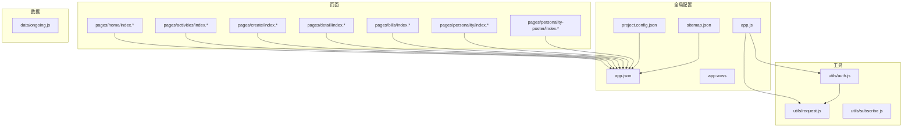
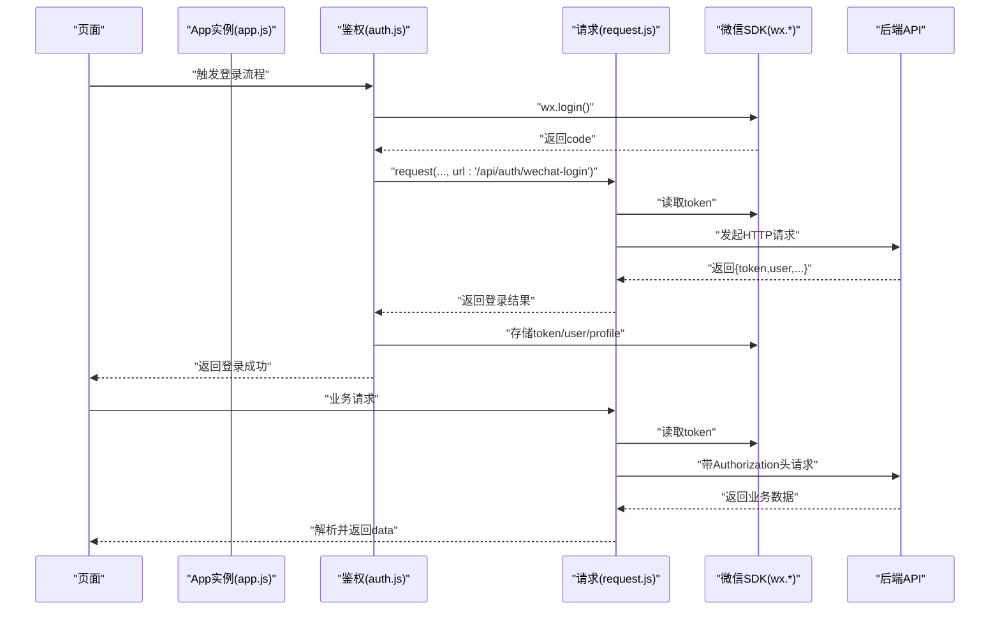
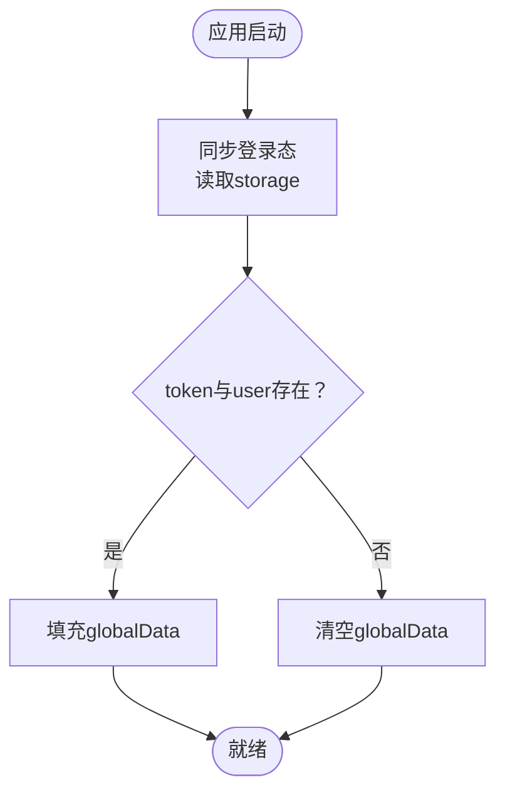
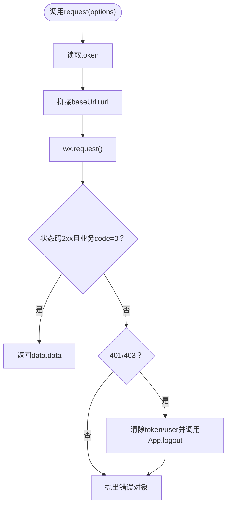
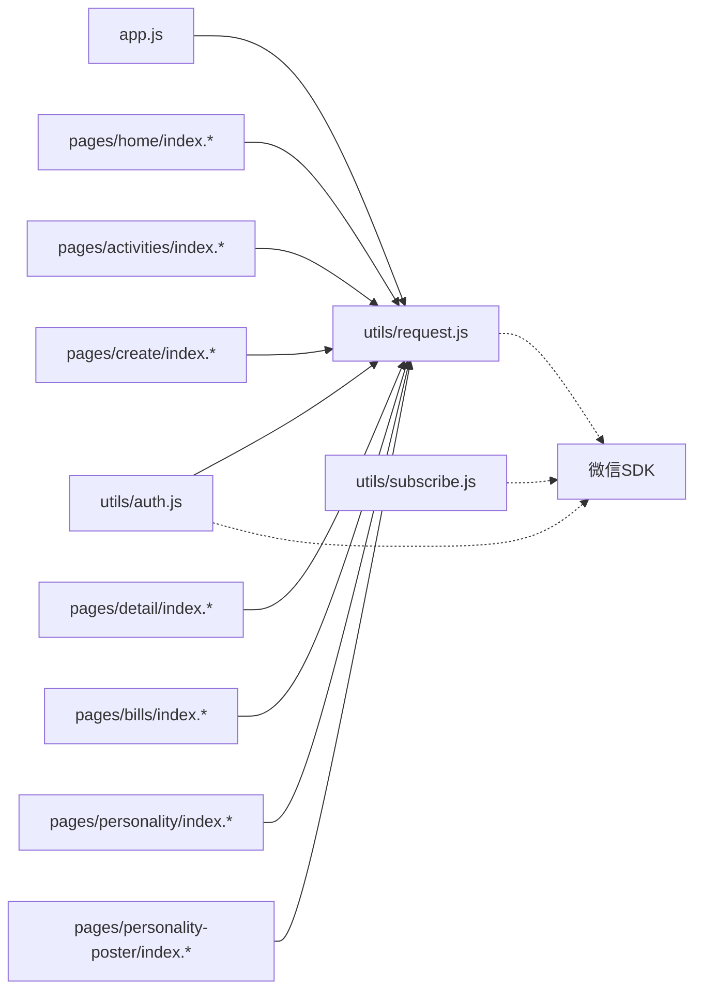

# 项目结构与配置

<cite>
**本文引用的文件**
- [frontend/app.json](file://frontend/app.json)
- [frontend/app.wxss](file://frontend/app.wxss)
- [frontend/project.config.json](file://frontend/project.config.json)
- [frontend/sitemap.json](file://frontend/sitemap.json)
- [frontend/app.js](file://frontend/app.js)
- [frontend/utils/request.js](file://frontend/utils/request.js)
- [frontend/utils/auth.js](file://frontend/utils/auth.js)
- [frontend/utils/subscribe.js](file://frontend/utils/subscribe.js)
- [frontend/pages/home/index.json](file://frontend/pages/home/index.json)
- [frontend/pages/activities/index.json](file://frontend/pages/activities/index.json)
- [frontend/pages/create/index.json](file://frontend/pages/create/index.json)
- [frontend/pages/detail/index.json](file://frontend/pages/detail/index.json)
- [frontend/pages/bills/index.json](file://frontend/pages/bills/index.json)
- [frontend/pages/personality/index.json](file://frontend/pages/personality/index.json)
- [frontend/data/ongoing.js](file://frontend/data/ongoing.js)
</cite>

## 目录
1. [简介](#简介)
2. [项目结构](#项目结构)
3. [核心组件](#核心组件)
4. [架构总览](#架构总览)
5. [详细组件分析](#详细组件分析)
6. [依赖关系分析](#依赖关系分析)
7. [性能考虑](#性能考虑)
8. [故障排查指南](#故障排查指南)
9. [结论](#结论)
10. [附录](#附录)

## 简介
本文件面向PlayMiniPro前端项目，系统性梳理小程序的全局配置、样式组织、开发工具配置、搜索引擎映射以及页面路由与生命周期管理。文档同时总结了全局状态管理与跨页面通信机制的实现路径，帮助开发者快速理解并高效维护项目。

## 项目结构
前端代码位于frontend目录，采用“页面(pages)+工具(utils)+数据(data)+全局配置(app.*、project.config.json、sitemap.json)”的分层组织方式。页面按功能域划分（如home、activities、create、detail、bills、personality、personality-poster），每个页面包含标准的js/json/wxml/wxss四件套；工具模块封装通用能力（请求、鉴权、订阅消息）；全局配置文件集中定义小程序运行期行为。

图表来源
- [frontend/app.json:1-30](file://frontend/app.json#L1-L30)
- [frontend/app.js:1-46](file://frontend/app.js#L1-L46)
- [frontend/project.config.json:1-25](file://frontend/project.config.json#L1-L25)
- [frontend/sitemap.json:1-9](file://frontend/sitemap.json#L1-L9)
- [frontend/utils/request.js:1-107](file://frontend/utils/request.js#L1-L107)
- [frontend/utils/auth.js:1-56](file://frontend/utils/auth.js#L1-L56)
- [frontend/utils/subscribe.js:1-31](file://frontend/utils/subscribe.js#L1-L31)
- [frontend/pages/home/index.json:1-3](file://frontend/pages/home/index.json#L1-L3)
- [frontend/pages/activities/index.json:1-3](file://frontend/pages/activities/index.json#L1-L3)
- [frontend/pages/create/index.json:1-3](file://frontend/pages/create/index.json#L1-L3)
- [frontend/pages/detail/index.json:1-3](file://frontend/pages/detail/index.json#L1-L3)
- [frontend/pages/bills/index.json:1-3](file://frontend/pages/bills/index.json#L1-L3)
- [frontend/pages/personality/index.json:1-3](file://frontend/pages/personality/index.json#L1-L3)
- [frontend/data/ongoing.js:1-37](file://frontend/data/ongoing.js#L1-L37)

章节来源
- [frontend/app.json:1-30](file://frontend/app.json#L1-L30)
- [frontend/app.js:1-46](file://frontend/app.js#L1-L46)
- [frontend/project.config.json:1-25](file://frontend/project.config.json#L1-L25)
- [frontend/sitemap.json:1-9](file://frontend/sitemap.json#L1-L9)

## 核心组件
- 全局配置
  - app.json：声明页面路由、窗口表现、权限与私有信息、懒加载策略、样式体系与sitemap位置。
  - app.wxss：全局样式入口，定义page根容器与通用卡片、按钮、网格等基础样式类。
  - project.config.json：编译与打包设置、appid、编辑器配置等。
  - sitemap.json：搜索引擎收录规则。
- 生命周期与全局状态
  - app.js：定义globalData、onLaunch钩子、登录态同步与登出逻辑。
- 工具模块
  - utils/request.js：统一请求封装、环境切换、鉴权头注入、鉴权失效处理。
  - utils/auth.js：微信登录流程与本地存储写入。
  - utils/subscribe.js：一次性订阅消息权限引导。
- 页面配置
  - 各页面index.json：覆盖导航栏标题等页面级配置。
- 数据与示例
  - data/ongoing.js：示例数据集合与查询方法。

章节来源
- [frontend/app.json:1-30](file://frontend/app.json#L1-L30)
- [frontend/app.wxss:1-125](file://frontend/app.wxss#L1-L125)
- [frontend/project.config.json:1-25](file://frontend/project.config.json#L1-L25)
- [frontend/sitemap.json:1-9](file://frontend/sitemap.json#L1-L9)
- [frontend/app.js:1-46](file://frontend/app.js#L1-L46)
- [frontend/utils/request.js:1-107](file://frontend/utils/request.js#L1-L107)
- [frontend/utils/auth.js:1-56](file://frontend/utils/auth.js#L1-L56)
- [frontend/utils/subscribe.js:1-31](file://frontend/utils/subscribe.js#L1-L31)
- [frontend/pages/home/index.json:1-3](file://frontend/pages/home/index.json#L1-L3)
- [frontend/pages/activities/index.json:1-3](file://frontend/pages/activities/index.json#L1-L3)
- [frontend/pages/create/index.json:1-3](file://frontend/pages/create/index.json#L1-L3)
- [frontend/pages/detail/index.json:1-3](file://frontend/pages/detail/index.json#L1-L3)
- [frontend/pages/bills/index.json:1-3](file://frontend/pages/bills/index.json#L1-L3)
- [frontend/pages/personality/index.json:1-3](file://frontend/pages/personality/index.json#L1-L3)
- [frontend/data/ongoing.js:1-37](file://frontend/data/ongoing.js#L1-L37)

## 架构总览
下图展示从页面到工具再到后端的整体调用链路，突出请求拦截、鉴权头注入与登录态同步的关键节点。

图表来源
- [frontend/app.js:1-46](file://frontend/app.js#L1-L46)
- [frontend/utils/auth.js:1-56](file://frontend/utils/auth.js#L1-L56)
- [frontend/utils/request.js:1-107](file://frontend/utils/request.js#L1-L107)

## 详细组件分析

### 全局配置：app.json
- 页面路由(pages)
  - 集中声明所有页面路径，确保小程序启动时可正确加载。
- 窗口表现(window)
  - 导航栏标题、背景色、文字颜色；页面背景色与文字风格。
- 权限与私有信息(permission、requiredPrivateInfos)
  - 声明地理位置使用场景与必要性，提升授权通过率。
- 运行与样式(lazyCodeLoading、style)
  - 按需加载组件以优化首屏；v2样式体系提升兼容性。
- 搜索引擎(sitemapLocation)
  - 指定sitemap.json路径，便于搜索引擎收录。

章节来源
- [frontend/app.json:1-30](file://frontend/app.json#L1-L30)

### 全局样式：app.wxss
- page根容器
  - 定义渐变背景、字体族与文本颜色，奠定整体视觉基调。
- 卡片与布局
  - 提供多种卡片容器类（如hero-card、panel、activity-card等），统一圆角、阴影与边框风格。
- 组件化样式
  - 按钮（主按钮、幽灵按钮）、标签（chip）、网格（grid-two）等复用类，保证一致性。
- 规范建议
  - 建议为每类UI元素定义稳定类名，避免在页面内重复定义相同样式，提高可维护性。

章节来源
- [frontend/app.wxss:1-125](file://frontend/app.wxss#L1-L125)

### 开发工具配置：project.config.json
- 编译与压缩(setting)
  - es6、postcss、minified、uglifyFileName、enhance、minifyWXML等，确保产物体积与兼容性。
- 包选项(packOptions)
  - 可配置打包忽略与包含规则，减少无关资源进入包体。
- 应用标识(appid)
  - 对应当前小程序的唯一标识，影响预览与上传。
- 编辑器设置(editorSetting)
  - 可扩展IDE相关行为。

章节来源
- [frontend/project.config.json:1-25](file://frontend/project.config.json#L1-L25)

### 搜索引擎配置：sitemap.json
- 规则描述(desc)与收录规则(rules)
  - 当前配置为允许收录全部页面（通配符），便于SEO初期抓取。
- 建议
  - 随着页面增多，可细化规则，屏蔽不对外展示或动态生成的页面。

章节来源
- [frontend/sitemap.json:1-9](file://frontend/sitemap.json#L1-L9)

### 生命周期与全局状态：app.js
- globalData
  - 存放品牌名、用户信息与token等全局共享数据。
- onLaunch
  - 应用初始化时同步登录态，确保后续请求可用。
- 登录态同步(syncLoginState)
  - 从本地缓存读取token与user，若存在则填充globalData，否则清空。
- 登录(loginWithConfirm)
  - 触发微信登录并写入缓存与globalData。
- 登出(logout)
  - 清除本地存储与globalData，配合请求层鉴权失效清理。

图表来源
- [frontend/app.js:1-46](file://frontend/app.js#L1-L46)

章节来源
- [frontend/app.js:1-46](file://frontend/app.js#L1-L46)

### 请求与鉴权：utils/request.js
- 环境与基地址
  - 支持local与prod两套基地址，可通过storage切换；支持自定义基地址。
- 请求封装
  - 自动拼接baseUrl与相对url；根据是否需要鉴权注入Authorization头。
- 错误处理
  - 统一解析响应码与业务code；当401/403时触发鉴权失效清理逻辑。
- 与App协作
  - 在鉴权失效时调用App.logout，确保全局状态一致。

图表来源
- [frontend/utils/request.js:1-107](file://frontend/utils/request.js#L1-L107)
- [frontend/app.js:1-46](file://frontend/app.js#L1-L46)

章节来源
- [frontend/utils/request.js:1-107](file://frontend/utils/request.js#L1-L107)
- [frontend/app.js:1-46](file://frontend/app.js#L1-L46)

### 微信登录：utils/auth.js
- 流程
  - 调用微信登录获取code；向后端换取token与用户信息；写入storage与globalData。
- 参数
  - 支持传入昵称、头像、手机号等资料，兼容远程头像URL判断。
- 失败处理
  - 任何环节失败均向上抛错，由调用方处理。

章节来源
- [frontend/utils/auth.js:1-56](file://frontend/utils/auth.js#L1-L56)

### 订阅消息：utils/subscribe.js
- 一次性订阅
  - 从storage读取模板ID列表与提示标记；若满足条件则弹窗请求订阅。
- 结果持久化
  - 成功或失败均写入storage，避免重复打扰用户。
- 默认跳过
  - 若无模板ID或已提示，则直接跳过。

章节来源
- [frontend/utils/subscribe.js:1-31](file://frontend/utils/subscribe.js#L1-L31)

### 页面级配置：各页面index.json
- home/activities/create/detail/bills/personality
  - 各自设置navigationBarTitleText，保持页面标题一致性与可读性。
- 扩展
  - 可进一步在各页面json中配置导航栏样式、是否显示分享按钮等。

章节来源
- [frontend/pages/home/index.json:1-3](file://frontend/pages/home/index.json#L1-L3)
- [frontend/pages/activities/index.json:1-3](file://frontend/pages/activities/index.json#L1-L3)
- [frontend/pages/create/index.json:1-3](file://frontend/pages/create/index.json#L1-L3)
- [frontend/pages/detail/index.json:1-3](file://frontend/pages/detail/index.json#L1-L3)
- [frontend/pages/bills/index.json:1-3](file://frontend/pages/bills/index.json#L1-L3)
- [frontend/pages/personality/index.json:1-3](file://frontend/pages/personality/index.json#L1-L3)

### 示例数据：data/ongoing.js
- 数据模型
  - ongoingItems数组包含活动条目，字段覆盖标签、标题、模式、时间、地点、状态、人数、成员、备注与清单。
- 查询方法
  - 提供按id查找的方法，便于页面按需渲染。
- 使用建议
  - 将真实数据源替换为后端接口后，可保留该模块作为本地演示或离线兜底。

章节来源
- [frontend/data/ongoing.js:1-37](file://frontend/data/ongoing.js#L1-L37)

## 依赖关系分析
- 模块耦合
  - app.js为全局状态中心，被request.js在鉴权失效时调用logout，形成弱耦合的清理通道。
  - auth.js依赖request.js完成登录请求；二者通过工具模块解耦。
  - 各页面仅依赖工具模块与全局配置，不直接耦合后端细节。
- 外部依赖
  - 依赖微信SDK提供的wx.login、wx.request、wx.requestSubscribeMessage等API。
- 潜在风险
  - 若未在app.js中同步登录态，可能导致请求层反复触发鉴权清理。
  - 若sitemap.json规则过于宽松，可能暴露内部页面。

图表来源
- [frontend/app.js:1-46](file://frontend/app.js#L1-L46)
- [frontend/utils/request.js:1-107](file://frontend/utils/request.js#L1-L107)
- [frontend/utils/auth.js:1-56](file://frontend/utils/auth.js#L1-L56)
- [frontend/utils/subscribe.js:1-31](file://frontend/utils/subscribe.js#L1-L31)
- [frontend/pages/home/index.json:1-3](file://frontend/pages/home/index.json#L1-L3)
- [frontend/pages/activities/index.json:1-3](file://frontend/pages/activities/index.json#L1-L3)
- [frontend/pages/create/index.json:1-3](file://frontend/pages/create/index.json#L1-L3)
- [frontend/pages/detail/index.json:1-3](file://frontend/pages/detail/index.json#L1-L3)
- [frontend/pages/bills/index.json:1-3](file://frontend/pages/bills/index.json#L1-L3)
- [frontend/pages/personality/index.json:1-3](file://frontend/pages/personality/index.json#L1-L3)
- [frontend/pages/personality-poster/index.json:1-3](file://frontend/pages/personality-poster/index.json#L1-L3)

章节来源
- [frontend/app.js:1-46](file://frontend/app.js#L1-L46)
- [frontend/utils/request.js:1-107](file://frontend/utils/request.js#L1-L107)
- [frontend/utils/auth.js:1-56](file://frontend/utils/auth.js#L1-L56)
- [frontend/utils/subscribe.js:1-31](file://frontend/utils/subscribe.js#L1-L31)

## 性能考虑
- 代码分割与懒加载
  - 利用lazyCodeLoading策略按需加载组件，降低首屏包体与渲染压力。
- 编译优化
  - 启用压缩、WXML压缩与postcss，减小产物体积。
- 网络请求
  - 统一请求封装与鉴权头注入，避免重复逻辑；对401/403及时清理，防止无效重试。
- 样式复用
  - 通过全局样式类统一卡片、按钮与网格，减少重复定义，提升维护效率。

## 故障排查指南
- 登录后仍提示未登录
  - 检查app.js的syncLoginState是否正确读取storage并填充globalData。
  - 确认auth.js成功写入token与user，并在request.js中被读取。
- 请求报401/403
  - 查看request.js的鉴权清理逻辑是否触发App.logout；检查storage中的token是否被清除。
- 订阅消息弹窗不出现
  - 检查storage中的模板ID列表与提示标记；确认设备支持且未被永久拒绝。
- 页面标题未生效
  - 确认页面index.json中的navigationBarTitleText是否正确设置。

章节来源
- [frontend/app.js:1-46](file://frontend/app.js#L1-L46)
- [frontend/utils/request.js:1-107](file://frontend/utils/request.js#L1-L107)
- [frontend/utils/subscribe.js:1-31](file://frontend/utils/subscribe.js#L1-L31)
- [frontend/pages/home/index.json:1-3](file://frontend/pages/home/index.json#L1-L3)

## 结论
本项目通过清晰的全局配置、统一的工具模块与规范化的页面结构，实现了良好的可维护性与扩展性。建议在后续迭代中：
- 明确sitemap规则，逐步精细化收录范围；
- 将示例数据替换为真实接口，增强数据驱动能力；
- 在页面间通信上引入事件总线或轻量状态库，降低耦合度；
- 持续优化编译与打包策略，保障包体与性能。

## 附录
- 文件命名与目录组织最佳实践
  - 页面：pages/<功能>/index.[js,json,wxml,wxss]，保持四件套齐全。
  - 工具：utils/*.js，职责单一、可复用。
  - 数据：data/*.js，提供简单数据与查询方法。
  - 全局：app.js、app.json、app.wxss、project.config.json、sitemap.json。
- 配置项速查
  - app.json：pages、window、permission、requiredPrivateInfos、lazyCodeLoading、style、sitemapLocation。
  - project.config.json：setting（es6/postcss/minified等）、packOptions、appid。
  - sitemap.json：desc、rules（allow/deny与page匹配）。