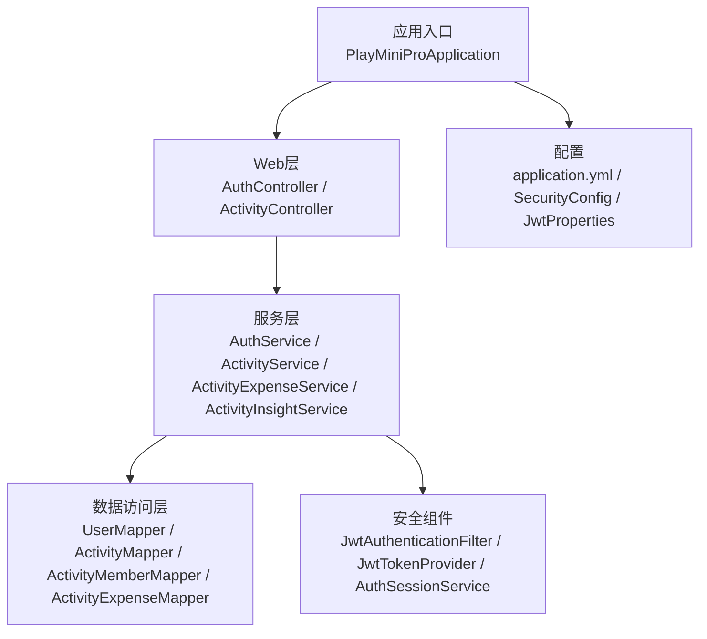
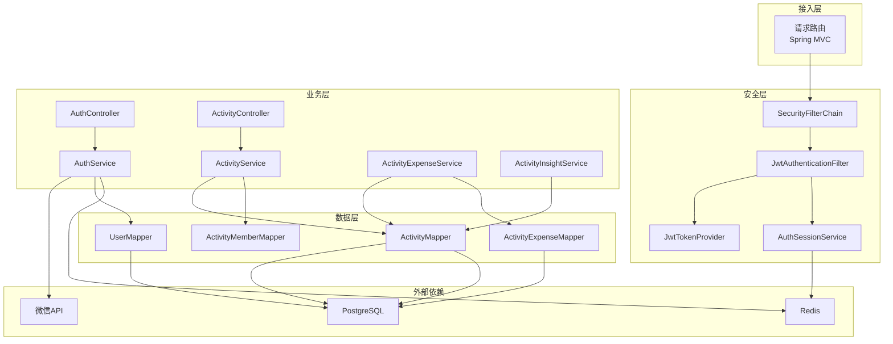
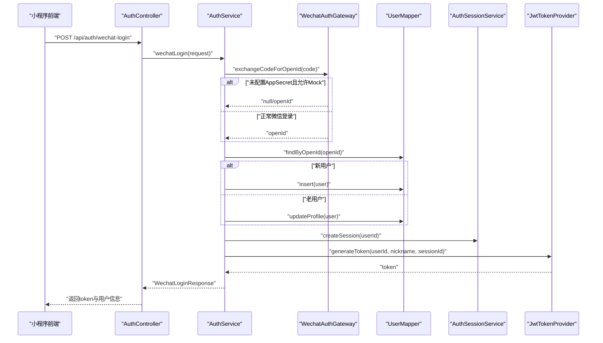
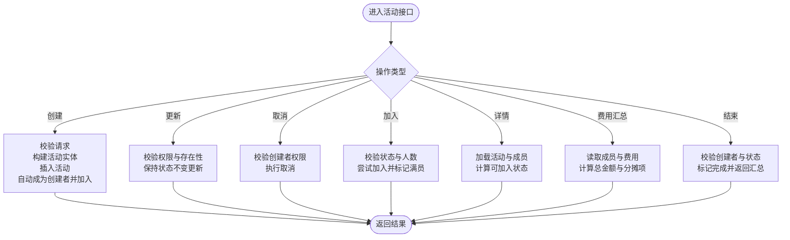
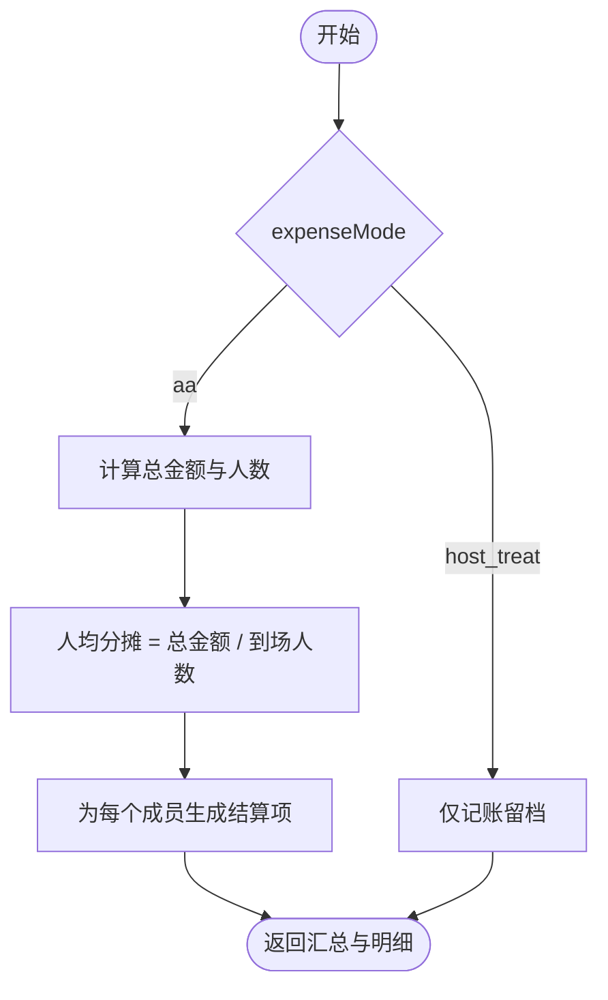
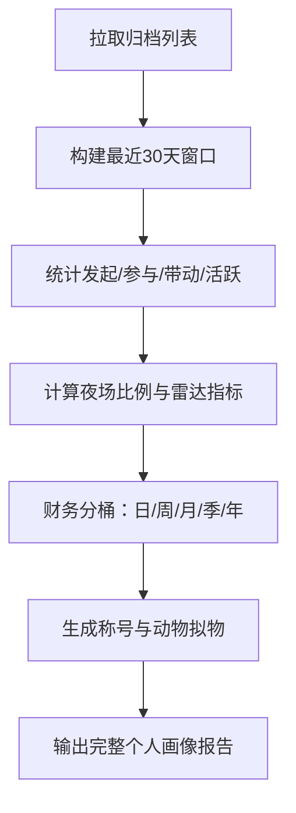
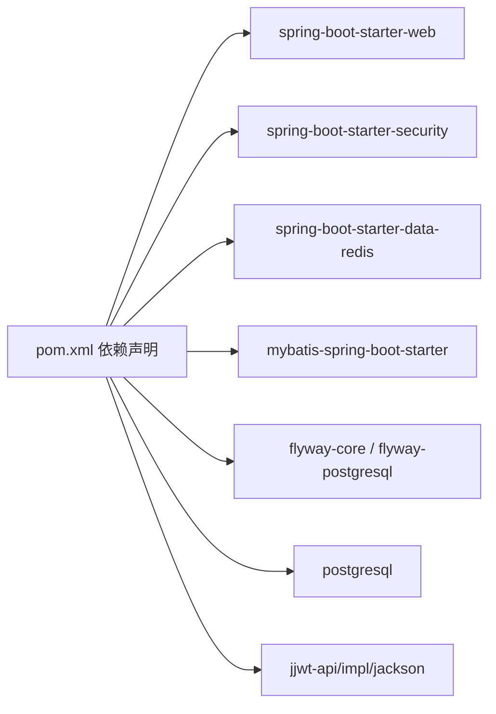

# 后端开发

<cite>
**本文引用的文件**
- [PlayMiniProApplication.java](file://backend/src/main/java/com/playminipro/PlayMiniProApplication.java)
- [application.yml](file://backend/src/main/resources/application.yml)
- [pom.xml](file://backend/pom.xml)
- [SecurityConfig.java](file://backend/src/main/java/com/playminipro/common/config/SecurityConfig.java)
- [JwtProperties.java](file://backend/src/main/java/com/playminipro/common/config/JwtProperties.java)
- [JwtAuthenticationFilter.java](file://backend/src/main/java/com/playminipro/common/security/JwtAuthenticationFilter.java)
- [JwtTokenProvider.java](file://backend/src/main/java/com/playminipro/common/security/JwtTokenProvider.java)
- [AuthController.java](file://backend/src/main/java/com/playminipro/auth/controller/AuthController.java)
- [AuthService.java](file://backend/src/main/java/com/playminipro/auth/service/AuthService.java)
- [WechatAuthGateway.java](file://backend/src/main/java/com/playminipro/auth/service/WechatAuthGateway.java)
- [ActivityController.java](file://backend/src/main/java/com/playminipro/activity/controller/ActivityController.java)
- [ActivityService.java](file://backend/src/main/java/com/playminipro/activity/service/ActivityService.java)
- [ActivityExpenseService.java](file://backend/src/main/java/com/playminipro/activity/service/ActivityExpenseService.java)
- [ActivityInsightService.java](file://backend/src/main/java/com/playminipro/activity/service/ActivityInsightService.java)
- [AuthSessionService.java](file://backend/src/main/java/com/playminipro/common/security/AuthSessionService.java)
</cite>

## 目录
1. [简介](#简介)
2. [项目结构](#项目结构)
3. [核心组件](#核心组件)
4. [架构总览](#架构总览)
5. [详细组件分析](#详细组件分析)
6. [依赖分析](#依赖分析)
7. [性能考虑](#性能考虑)
8. [故障排查指南](#故障排查指南)
9. [结论](#结论)
10. [附录](#附录)

## 简介
本指南面向PlayMiniPro后端开发，围绕Spring Boot应用的开发模式（MVC架构、MyBatis ORM、RESTful API设计）展开，深入解析认证授权（微信登录、JWT令牌管理、安全过滤器）、活动管理（CRUD、状态管理、成员招募）、费用管理（AA制分摊、结算生成）、个人画像（数据分析与报表）等模块，并提供代码规范、最佳实践与测试指南。

## 项目结构
后端采用标准Spring Boot多模块分层结构：
- 应用入口与配置：启动类、配置文件、依赖声明
- 认证授权：控制器、服务、网关、安全组件
- 活动域：控制器、服务、实体、映射器、DTO
- 通用模块：安全配置、异常处理、响应封装、安全工具

图表来源
- [PlayMiniProApplication.java:11-20](file://backend/src/main/java/com/playminipro/PlayMiniProApplication.java#L11-L20)
- [application.yml:1-53](file://backend/src/main/resources/application.yml#L1-L53)
- [SecurityConfig.java:17-55](file://backend/src/main/java/com/playminipro/common/config/SecurityConfig.java#L17-L55)
- [JwtAuthenticationFilter.java:16-56](file://backend/src/main/java/com/playminipro/common/security/JwtAuthenticationFilter.java#L16-L56)
- [JwtTokenProvider.java:13-60](file://backend/src/main/java/com/playminipro/common/security/JwtTokenProvider.java#L13-L60)
- [AuthController.java:13-27](file://backend/src/main/java/com/playminipro/auth/controller/AuthController.java#L13-L27)
- [ActivityController.java:27-112](file://backend/src/main/java/com/playminipro/activity/controller/ActivityController.java#L27-L112)

章节来源
- [PlayMiniProApplication.java:11-20](file://backend/src/main/java/com/playminipro/PlayMiniProApplication.java#L11-L20)
- [application.yml:1-53](file://backend/src/main/resources/application.yml#L1-L53)
- [pom.xml:1-102](file://backend/pom.xml#L1-L102)

## 核心组件
- 启动类与扫描：启用Mapper扫描、调度、配置属性绑定，统一入口启动
- 安全配置：禁用CSRF/表单登录，基于JWT的无状态会话，CORS跨域
- JWT令牌：签发与校验，携带用户标识与会话标识
- 认证服务：微信登录、用户资料更新、会话创建与令牌发放
- 活动服务：活动CRUD、状态机、成员招募、费用汇总与结算
- 个人画像：归档统计、雷达图指标、财务分桶、荣誉与标签

章节来源
- [PlayMiniProApplication.java:11-20](file://backend/src/main/java/com/playminipro/PlayMiniProApplication.java#L11-L20)
- [SecurityConfig.java:26-55](file://backend/src/main/java/com/playminipro/common/config/SecurityConfig.java#L26-L55)
- [JwtTokenProvider.java:26-60](file://backend/src/main/java/com/playminipro/common/security/JwtTokenProvider.java#L26-L60)
- [AuthService.java:41-101](file://backend/src/main/java/com/playminipro/auth/service/AuthService.java#L41-L101)
- [ActivityService.java:41-232](file://backend/src/main/java/com/playminipro/activity/service/ActivityService.java#L41-L232)
- [ActivityExpenseService.java:37-167](file://backend/src/main/java/com/playminipro/activity/service/ActivityExpenseService.java#L37-L167)
- [ActivityInsightService.java:47-111](file://backend/src/main/java/com/playminipro/activity/service/ActivityInsightService.java#L47-L111)

## 架构总览
整体采用MVC+分层架构，RESTful API对外暴露，MyBatis负责数据持久化，Spring Security + JWT实现无状态认证，Redis存储会话以支持令牌刷新校验。

图表来源
- [SecurityConfig.java:26-55](file://backend/src/main/java/com/playminipro/common/config/SecurityConfig.java#L26-L55)
- [JwtAuthenticationFilter.java:29-56](file://backend/src/main/java/com/playminipro/common/security/JwtAuthenticationFilter.java#L29-L56)
- [JwtTokenProvider.java:13-60](file://backend/src/main/java/com/playminipro/common/security/JwtTokenProvider.java#L13-L60)
- [AuthController.java:13-27](file://backend/src/main/java/com/playminipro/auth/controller/AuthController.java#L13-L27)
- [AuthService.java:29-39](file://backend/src/main/java/com/playminipro/auth/service/AuthService.java#L29-L39)
- [ActivityController.java:27-112](file://backend/src/main/java/com/playminipro/activity/controller/ActivityController.java#L27-L112)
- [ActivityService.java:29-39](file://backend/src/main/java/com/playminipro/activity/service/ActivityService.java#L29-L39)
- [ActivityExpenseService.java:29-35](file://backend/src/main/java/com/playminipro/activity/service/ActivityExpenseService.java#L29-L35)
- [ActivityInsightService.java:31-39](file://backend/src/main/java/com/playminipro/activity/service/ActivityInsightService.java#L31-L39)

## 详细组件分析

### 认证授权模块
- 微信登录流程：前端传入code，后端调用微信JS-Code换取openId，可选获取手机号，用户不存在则创建，存在则更新资料；创建会话并签发JWT
- JWT令牌管理：令牌包含用户ID、昵称、会话ID；过期时间由配置控制
- 安全过滤器：从Authorization头解析Bearer Token，校验令牌与会话有效性，注入认证上下文

图表来源
- [AuthController.java:23-26](file://backend/src/main/java/com/playminipro/auth/controller/AuthController.java#L23-L26)
- [AuthService.java:41-76](file://backend/src/main/java/com/playminipro/auth/service/AuthService.java#L41-L76)
- [WechatAuthGateway.java:39-72](file://backend/src/main/java/com/playminipro/auth/service/WechatAuthGateway.java#L39-L72)
- [AuthSessionService.java:25-44](file://backend/src/main/java/com/playminipro/common/security/AuthSessionService.java#L25-L44)
- [JwtTokenProvider.java:26-38](file://backend/src/main/java/com/playminipro/common/security/JwtTokenProvider.java#L26-L38)

章节来源
- [AuthController.java:13-27](file://backend/src/main/java/com/playminipro/auth/controller/AuthController.java#L13-L27)
- [AuthService.java:29-76](file://backend/src/main/java/com/playminipro/auth/service/AuthService.java#L29-L76)
- [WechatAuthGateway.java:16-171](file://backend/src/main/java/com/playminipro/auth/service/WechatAuthGateway.java#L16-L171)
- [JwtAuthenticationFilter.java:29-56](file://backend/src/main/java/com/playminipro/common/security/JwtAuthenticationFilter.java#L29-L56)
- [JwtTokenProvider.java:13-60](file://backend/src/main/java/com/playminipro/common/security/JwtTokenProvider.java#L13-L60)
- [AuthSessionService.java:10-53](file://backend/src/main/java/com/playminipro/common/security/AuthSessionService.java#L10-L53)

### 活动管理模块
- 控制器提供活动CRUD、加入/拒绝、取消、详情查询、费用汇总、结束等接口
- 服务层实现：
  - 创建/更新/取消：权限校验、规则校验（类型、模式、地址）
  - 加入/拒绝：状态与人数限制、满员标记、通知记录
  - 详情：聚合成员、状态判断、是否可加入
- 数据模型：活动、成员、费用三张核心表，通过Mapper访问

图表来源
- [ActivityController.java:45-112](file://backend/src/main/java/com/playminipro/activity/controller/ActivityController.java#L45-L112)
- [ActivityService.java:41-232](file://backend/src/main/java/com/playminipro/activity/service/ActivityService.java#L41-L232)
- [ActivityExpenseService.java:37-167](file://backend/src/main/java/com/playminipro/activity/service/ActivityExpenseService.java#L37-L167)

章节来源
- [ActivityController.java:27-112](file://backend/src/main/java/com/playminipro/activity/controller/ActivityController.java#L27-L112)
- [ActivityService.java:29-232](file://backend/src/main/java/com/playminipro/activity/service/ActivityService.java#L29-L232)
- [ActivityExpenseService.java:29-167](file://backend/src/main/java/com/playminipro/activity/service/ActivityExpenseService.java#L29-L167)

### 费用管理与结算
- 支持两种模式：
  - 发起人请客：仅记账留档，不进行AA分摊
  - AA制：按实际到场人数均摊，生成结算明细
- 结算生成逻辑：
  - 统计总金额与人数，计算人均分摊
  - 非创建者的成员获得应付金额，创建者为0或请客模式下的应收
  - 活动结束后生成“已结清”或“待最终结算”提示

图表来源
- [ActivityExpenseService.java:108-167](file://backend/src/main/java/com/playminipro/activity/service/ActivityExpenseService.java#L108-L167)

章节来源
- [ActivityExpenseService.java:29-167](file://backend/src/main/java/com/playminipro/activity/service/ActivityExpenseService.java#L29-L167)

### 个人画像与数据分析
- 时间窗口：默认最近30天，若无数据则取近期若干条
- 指标计算：
  - 发起/参与/带动到场/连续活跃天数
  - 夜场比例、落地率、雷达图指标
- 报表生成：
  - 财务分桶：日/周/月/季/年累计花费与活动次数
  - 称号与动物拟物：根据行为特征判定
  - 荣誉标签：夜场出勤、组局发电机、补位救场王等

图表来源
- [ActivityInsightService.java:47-111](file://backend/src/main/java/com/playminipro/activity/service/ActivityInsightService.java#L47-L111)
- [ActivityInsightService.java:164-196](file://backend/src/main/java/com/playminipro/activity/service/ActivityInsightService.java#L164-L196)

章节来源
- [ActivityInsightService.java:26-489](file://backend/src/main/java/com/playminipro/activity/service/ActivityInsightService.java#L26-L489)

## 依赖分析
- Spring Boot Starter：Web、Security、Actuator、Redis、MyBatis、Flyway
- JWT：jjwt-api/impl/jackson
- 数据库：PostgreSQL + Flyway迁移
- 缓存：Redis用于会话存储

图表来源
- [pom.xml:26-91](file://backend/pom.xml#L26-L91)

章节来源
- [pom.xml:1-102](file://backend/pom.xml#L1-L102)

## 性能考虑
- 无状态认证：JWT减少数据库查询，结合Redis会话校验降低重复校验成本
- MyBatis驼峰映射与缓存关闭策略：提升字段映射一致性，避免不必要的二级缓存干扰
- 分页与窗口：个人画像默认30天窗口，必要时可扩展为可配置参数
- 并发与幂等：加入/取消/结束等写操作使用事务与唯一约束，防止并发冲突
- Redis TTL：与JWT过期时间一致，避免悬挂会话

## 故障排查指南
- 微信登录失败
  - 检查AppId/AppSecret配置与Mock开关
  - 核对JS-Code是否过期或为空
  - 参考：[WechatAuthGateway.java:39-72](file://backend/src/main/java/com/playminipro/auth/service/WechatAuthGateway.java#L39-L72)
- 令牌无效或过期
  - 确认Authorization头格式与签名密钥
  - 校验会话是否仍有效（Redis键是否存在且未过期）
  - 参考：[JwtAuthenticationFilter.java:33-52](file://backend/src/main/java/com/playminipro/common/security/JwtAuthenticationFilter.java#L33-L52)，[AuthSessionService.java:31-44](file://backend/src/main/java/com/playminipro/common/security/AuthSessionService.java#L31-L44)
- 活动操作权限错误
  - 创建者才能更新/取消/结束
  - 参考：[ActivityService.java:64-98](file://backend/src/main/java/com/playminipro/activity/service/ActivityService.java#L64-L98)，[ActivityExpenseService.java:90-106](file://backend/src/main/java/com/playminipro/activity/service/ActivityExpenseService.java#L90-L106)
- 费用编辑受限
  - 已结束/已取消活动不可编辑
  - 仅线下活动支持费用录入
  - 参考：[ActivityExpenseService.java:96-106](file://backend/src/main/java/com/playminipro/activity/service/ActivityExpenseService.java#L96-L106)

章节来源
- [WechatAuthGateway.java:39-171](file://backend/src/main/java/com/playminipro/auth/service/WechatAuthGateway.java#L39-L171)
- [JwtAuthenticationFilter.java:29-56](file://backend/src/main/java/com/playminipro/common/security/JwtAuthenticationFilter.java#L29-L56)
- [AuthSessionService.java:10-53](file://backend/src/main/java/com/playminipro/common/security/AuthSessionService.java#L10-L53)
- [ActivityService.java:64-106](file://backend/src/main/java/com/playminipro/activity/service/ActivityService.java#L64-L106)
- [ActivityExpenseService.java:90-106](file://backend/src/main/java/com/playminipro/activity/service/ActivityExpenseService.java#L90-L106)

## 结论
本项目以清晰的分层与模块划分实现了完整的活动社交与费用结算能力，配合JWT与Redis保障了认证与会话的可靠性。建议后续在以下方面持续优化：接口版本化、参数校验增强、日志与监控完善、测试覆盖扩展。

## 附录

### 代码规范与最佳实践
- 命名规范
  - 包名小写，类名帕斯卡，方法/变量驼峰
  - DTO统一以XxxResponse/XxxRequest结尾
- 接口设计
  - 使用RESTful路径与HTTP动词语义化
  - 统一响应体封装，错误码与消息明确
- 安全
  - 所有受保护接口需认证；敏感操作（取消/结束/费用编辑）需权限校验
  - 令牌过期时间与会话TTL保持一致
- 数据访问
  - MyBatis映射开启驼峰，避免手动转换
  - Mapper方法职责单一，复杂查询拆分或使用XML
- 事务
  - 写操作使用@Transactional，异常统一抛出业务异常

### 单元测试与集成测试指南
- 单元测试
  - 使用Spring Boot Test与Mock组件，验证服务层逻辑（如活动状态机、费用分摊）
  - 示例场景：加入/满员/拒绝、AA分摊边界条件、Mock微信登录分支
- 集成测试
  - 使用Testcontainers或本地容器运行PostgreSQL与Redis
  - 测试端到端流程：微信登录→创建活动→加入→记账→结束→结算
- 断言建议
  - 关注业务语义而非实现细节（如“应返回可加入状态”优于“应调用某方法”）