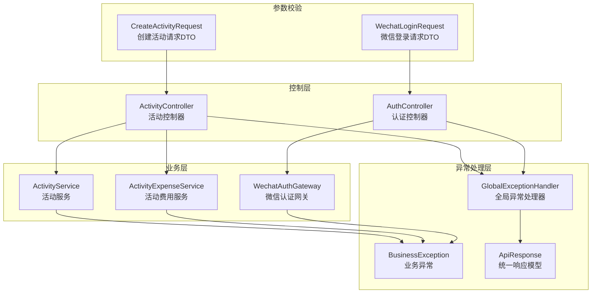
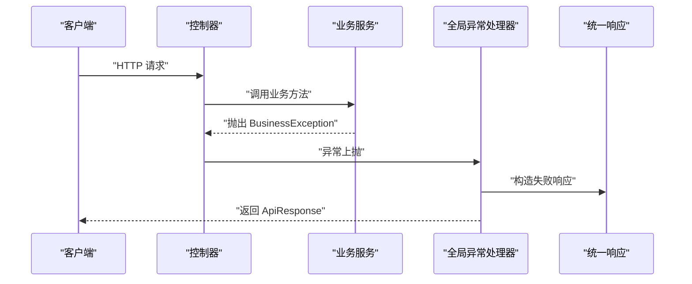
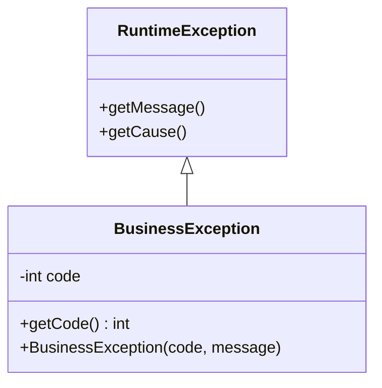
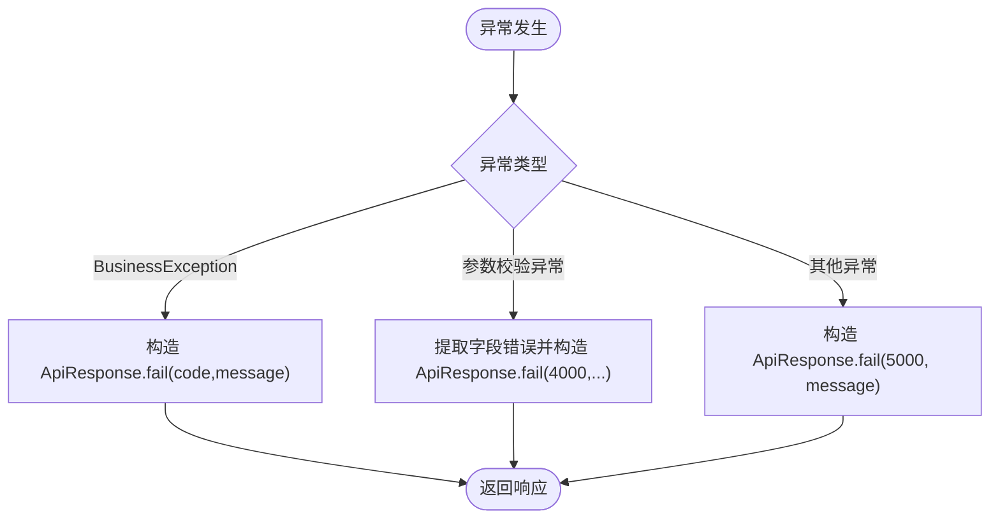
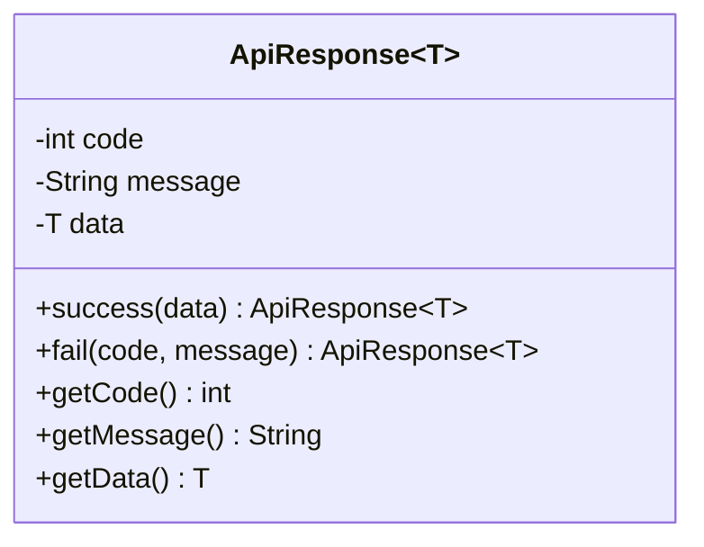
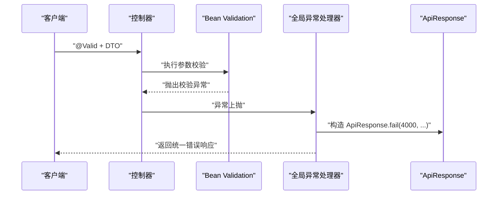
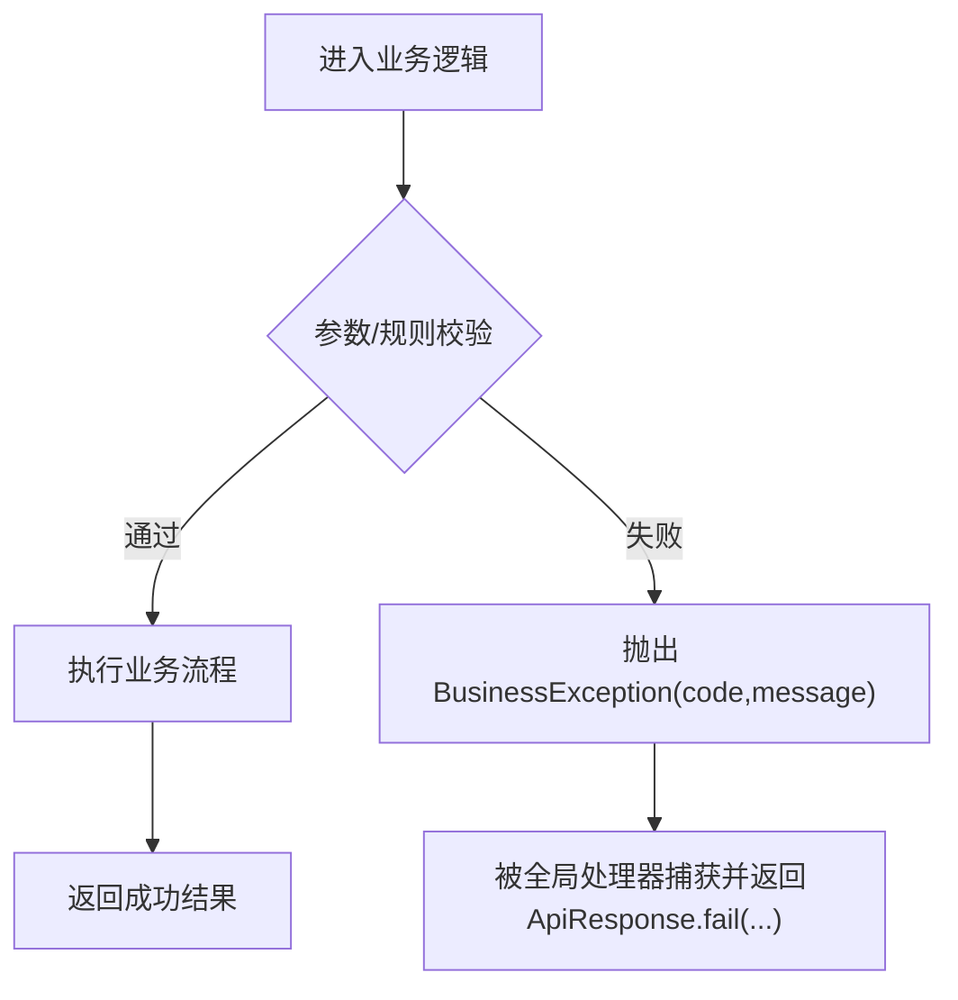
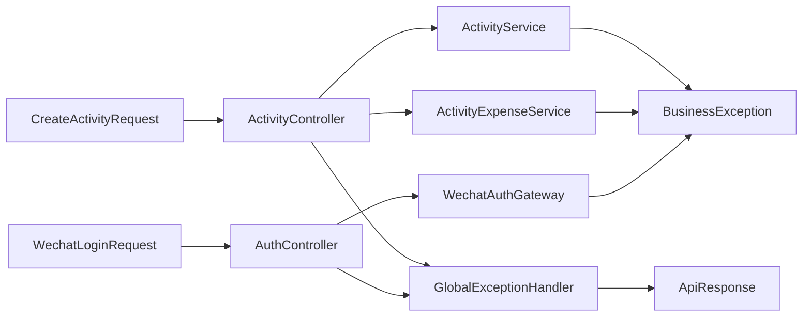

# 异常处理机制

<cite>
**本文档引用的文件**
- [BusinessException.java](file://backend/src/main/java/com/playminipro/common/exception/BusinessException.java)
- [GlobalExceptionHandler.java](file://backend/src/main/java/com/playminipro/common/exception/GlobalExceptionHandler.java)
- [ApiResponse.java](file://backend/src/main/java/com/playminipro/common/response/ApiResponse.java)
- [application.yml](file://backend/src/main/resources/application.yml)
- [ActivityService.java](file://backend/src/main/java/com/playminipro/activity/service/ActivityService.java)
- [ActivityExpenseService.java](file://backend/src/main/java/com/playminipro/activity/service/ActivityExpenseService.java)
- [WechatAuthGateway.java](file://backend/src/main/java/com/playminipro/auth/service/WechatAuthGateway.java)
- [ActivityController.java](file://backend/src/main/java/com/playminipro/activity/controller/ActivityController.java)
- [AuthController.java](file://backend/src/main/java/com/playminipro/auth/controller/AuthController.java)
- [CreateActivityRequest.java](file://backend/src/main/java/com/playminipro/activity/dto/CreateActivityRequest.java)
- [WechatLoginRequest.java](file://backend/src/main/java/com/playminipro/auth/dto/WechatLoginRequest.java)
</cite>

## 目录
1. [引言](#引言)
2. [项目结构](#项目结构)
3. [核心组件](#核心组件)
4. [架构总览](#架构总览)
5. [详细组件分析](#详细组件分析)
6. [依赖分析](#依赖分析)
7. [性能考虑](#性能考虑)
8. [故障排查指南](#故障排查指南)
9. [结论](#结论)
10. [附录](#附录)

## 引言
本文件系统性梳理并阐述本项目的异常处理机制，覆盖异常分类与错误码设计、国际化支持现状与扩展建议、全局异常处理器的实现原理（异常捕获、错误响应格式化、日志记录策略）、统一响应格式的设计（成功/失败响应、数据包装、元数据处理），以及异常链传递、堆栈追踪与调试信息收集的最佳实践。同时给出常见异常场景的处理策略（参数验证异常、业务规则异常、系统异常）及异常监控与性能影响分析。

## 项目结构
围绕异常处理的相关模块主要分布在以下位置：
- 异常定义：common.exception 包含业务异常与全局异常处理器
- 统一响应：common.response 包含 ApiResponse 统一响应模型
- 业务服务：activity.service 与 auth.service 中广泛抛出业务异常
- 控制器层：activity.controller 与 auth.controller 接收并返回统一响应
- 参数校验：DTO 层通过 Jakarta Bean Validation 注解进行参数约束
- 配置：application.yml 提供基础日志级别等运行时配置

图表来源
- [BusinessException.java:1-15](file://backend/src/main/java/com/playminipro/common/exception/BusinessException.java#L1-L15)
- [GlobalExceptionHandler.java:1-41](file://backend/src/main/java/com/playminipro/common/exception/GlobalExceptionHandler.java#L1-L41)
- [ApiResponse.java:1-51](file://backend/src/main/java/com/playminipro/common/response/ApiResponse.java#L1-L51)
- [ActivityService.java:100-232](file://backend/src/main/java/com/playminipro/activity/service/ActivityService.java#L100-L232)
- [ActivityExpenseService.java:64-103](file://backend/src/main/java/com/playminipro/activity/service/ActivityExpenseService.java#L64-L103)
- [WechatAuthGateway.java:43-68](file://backend/src/main/java/com/playminipro/auth/service/WechatAuthGateway.java#L43-L68)
- [ActivityController.java:40-112](file://backend/src/main/java/com/playminipro/activity/controller/ActivityController.java#L40-L112)
- [AuthController.java:20-27](file://backend/src/main/java/com/playminipro/auth/controller/AuthController.java#L20-L27)
- [CreateActivityRequest.java:1-30](file://backend/src/main/java/com/playminipro/activity/dto/CreateActivityRequest.java#L1-L30)
- [WechatLoginRequest.java:1-12](file://backend/src/main/java/com/playminipro/auth/dto/WechatLoginRequest.java#L1-L12)

章节来源
- [BusinessException.java:1-15](file://backend/src/main/java/com/playminipro/common/exception/BusinessException.java#L1-L15)
- [GlobalExceptionHandler.java:1-41](file://backend/src/main/java/com/playminipro/common/exception/GlobalExceptionHandler.java#L1-L41)
- [ApiResponse.java:1-51](file://backend/src/main/java/com/playminipro/common/response/ApiResponse.java#L1-L51)
- [ActivityService.java:100-232](file://backend/src/main/java/com/playminipro/activity/service/ActivityService.java#L100-L232)
- [ActivityExpenseService.java:64-103](file://backend/src/main/java/com/playminipro/activity/service/ActivityExpenseService.java#L64-L103)
- [WechatAuthGateway.java:43-68](file://backend/src/main/java/com/playminipro/auth/service/WechatAuthGateway.java#L43-L68)
- [ActivityController.java:40-112](file://backend/src/main/java/com/playminipro/activity/controller/ActivityController.java#L40-L112)
- [AuthController.java:20-27](file://backend/src/main/java/com/playminipro/auth/controller/AuthController.java#L20-L27)
- [CreateActivityRequest.java:1-30](file://backend/src/main/java/com/playminipro/activity/dto/CreateActivityRequest.java#L1-L30)
- [WechatLoginRequest.java:1-12](file://backend/src/main/java/com/playminipro/auth/dto/WechatLoginRequest.java#L1-L12)

## 核心组件
- 业务异常 BusinessException：继承 RuntimeException，携带业务错误码与消息，用于表达可预期的业务失败。
- 全局异常处理器 GlobalExceptionHandler：基于 Spring MVC 的 @RestControllerAdvice，统一捕获各类异常并转换为 ApiResponse。
- 统一响应模型 ApiResponse：标准化响应结构，包含 code、message、data 字段，提供 success/fail 工厂方法。

章节来源
- [BusinessException.java:1-15](file://backend/src/main/java/com/playminipro/common/exception/BusinessException.java#L1-L15)
- [GlobalExceptionHandler.java:14-40](file://backend/src/main/java/com/playminipro/common/exception/GlobalExceptionHandler.java#L14-L40)
- [ApiResponse.java:20-26](file://backend/src/main/java/com/playminipro/common/response/ApiResponse.java#L20-L26)

## 架构总览
全局异常处理遵循“控制器抛异常 → 全局处理器捕获 → 统一响应返回”的闭环，结合 DTO 参数校验在进入业务逻辑前拦截非法输入。

图表来源
- [ActivityController.java:46-56](file://backend/src/main/java/com/playminipro/activity/controller/ActivityController.java#L46-L56)
- [ActivityService.java:100-115](file://backend/src/main/java/com/playminipro/activity/service/ActivityService.java#L100-L115)
- [GlobalExceptionHandler.java:14-18](file://backend/src/main/java/com/playminipro/common/exception/GlobalExceptionHandler.java#L14-L18)
- [ApiResponse.java:24-26](file://backend/src/main/java/com/playminipro/common/response/ApiResponse.java#L24-L26)

## 详细组件分析

### 业务异常 BusinessException
- 设计理念：以错误码与消息明确区分业务失败类型，便于前端与监控系统识别与处理。
- 关键点：错误码由业务方自定义，建议按模块/功能域划分区间，避免冲突；消息面向用户或系统日志，需保持简洁一致。

图表来源
- [BusinessException.java:3-14](file://backend/src/main/java/com/playminipro/common/exception/BusinessException.java#L3-L14)

章节来源
- [BusinessException.java:1-15](file://backend/src/main/java/com/playminipro/common/exception/BusinessException.java#L1-L15)

### 全局异常处理器 GlobalExceptionHandler
- 捕获范围：
  - 业务异常：BusinessException → 返回 400 系列错误码与业务消息
  - 参数校验异常：MethodArgumentNotValidException、ConstraintViolationException → 返回 4000 统一错误码
  - 未捕获异常：Exception → 返回 5000 统一错误码
- 响应格式：统一使用 ApiResponse.fail(code, message)，状态码由注解指定
- 日志策略：当前实现未直接输出日志，建议在处理器中增加结构化日志记录（含 traceId、异常摘要、请求上下文）

图表来源
- [GlobalExceptionHandler.java:14-40](file://backend/src/main/java/com/playminipro/common/exception/GlobalExceptionHandler.java#L14-L40)

章节来源
- [GlobalExceptionHandler.java:1-41](file://backend/src/main/java/com/playminipro/common/exception/GlobalExceptionHandler.java#L1-L41)

### 统一响应模型 ApiResponse
- 成功响应：ApiResponse.success(data) → code=0, message="ok"
- 失败响应：ApiResponse.fail(code, message) → data=null
- 数据包装：泛型承载业务数据，便于前后端契约稳定
- 元数据处理：当前仅包含 code/message/data；建议扩展 traceId、timestamp、path 等

图表来源
- [ApiResponse.java:3-50](file://backend/src/main/java/com/playminipro/common/response/ApiResponse.java#L3-L50)

章节来源
- [ApiResponse.java:1-51](file://backend/src/main/java/com/playminipro/common/response/ApiResponse.java#L1-L51)

### 参数校验与 DTO 设计
- 使用 Jakarta Bean Validation 注解在 DTO 层声明约束，触发 MethodArgumentNotValidException 或 ConstraintViolationException
- 控制器方法参数使用 @Valid 开启校验
- 全局处理器统一捕获并转换为 ApiResponse.fail(4000, ...)

图表来源
- [ActivityController.java:46-56](file://backend/src/main/java/com/playminipro/activity/controller/ActivityController.java#L46-L56)
- [AuthController.java:23-26](file://backend/src/main/java/com/playminipro/auth/controller/AuthController.java#L23-L26)
- [CreateActivityRequest.java:12-29](file://backend/src/main/java/com/playminipro/activity/dto/CreateActivityRequest.java#L12-L29)
- [WechatLoginRequest.java:6-11](file://backend/src/main/java/com/playminipro/auth/dto/WechatLoginRequest.java#L6-L11)
- [GlobalExceptionHandler.java:20-34](file://backend/src/main/java/com/playminipro/common/exception/GlobalExceptionHandler.java#L20-L34)

章节来源
- [ActivityController.java:46-56](file://backend/src/main/java/com/playminipro/activity/controller/ActivityController.java#L46-L56)
- [AuthController.java:23-26](file://backend/src/main/java/com/playminipro/auth/controller/AuthController.java#L23-L26)
- [CreateActivityRequest.java:1-30](file://backend/src/main/java/com/playminipro/activity/dto/CreateActivityRequest.java#L1-L30)
- [WechatLoginRequest.java:1-12](file://backend/src/main/java/com/playminipro/auth/dto/WechatLoginRequest.java#L1-L12)
- [GlobalExceptionHandler.java:20-34](file://backend/src/main/java/com/playminipro/common/exception/GlobalExceptionHandler.java#L20-L34)

### 业务异常使用场景与最佳实践
- 场景一：参数不合法或业务规则不满足（如活动创建参数校验失败）
- 场景二：资源不存在或权限不足（如活动不存在、禁止操作）
- 场景三：外部依赖异常（如微信登录失败）
- 最佳实践：
  - 错误码分段管理（如 4001-4009 业务规则，4004 资源不存在，4005/4006 外部依赖）
  - 消息保持简洁且可翻译，便于国际化
  - 在业务层尽早校验并抛出 BusinessException，避免无效计算
  - 对于敏感信息（如密码、令牌）不要写入日志

图表来源
- [ActivityService.java:100-115](file://backend/src/main/java/com/playminipro/activity/service/ActivityService.java#L100-L115)
- [ActivityExpenseService.java:64-103](file://backend/src/main/java/com/playminipro/activity/service/ActivityExpenseService.java#L64-L103)
- [WechatAuthGateway.java:43-68](file://backend/src/main/java/com/playminipro/auth/service/WechatAuthGateway.java#L43-L68)
- [GlobalExceptionHandler.java:14-18](file://backend/src/main/java/com/playminipro/common/exception/GlobalExceptionHandler.java#L14-L18)

章节来源
- [ActivityService.java:100-232](file://backend/src/main/java/com/playminipro/activity/service/ActivityService.java#L100-L232)
- [ActivityExpenseService.java:64-103](file://backend/src/main/java/com/playminipro/activity/service/ActivityExpenseService.java#L64-L103)
- [WechatAuthGateway.java:43-68](file://backend/src/main/java/com/playminipro/auth/service/WechatAuthGateway.java#L43-L68)

## 依赖分析
- 控制器依赖业务服务，业务服务依赖 DAO/网关，最终可能抛出 BusinessException
- 全局异常处理器依赖 ApiResponse 进行统一响应
- DTO 层通过注解驱动参数校验，触发控制器层异常

图表来源
- [ActivityController.java:40-112](file://backend/src/main/java/com/playminipro/activity/controller/ActivityController.java#L40-L112)
- [AuthController.java:20-27](file://backend/src/main/java/com/playminipro/auth/controller/AuthController.java#L20-L27)
- [ActivityService.java:100-232](file://backend/src/main/java/com/playminipro/activity/service/ActivityService.java#L100-L232)
- [ActivityExpenseService.java:64-103](file://backend/src/main/java/com/playminipro/activity/service/ActivityExpenseService.java#L64-L103)
- [WechatAuthGateway.java:43-68](file://backend/src/main/java/com/playminipro/auth/service/WechatAuthGateway.java#L43-L68)
- [GlobalExceptionHandler.java:1-41](file://backend/src/main/java/com/playminipro/common/exception/GlobalExceptionHandler.java#L1-L41)
- [ApiResponse.java:1-51](file://backend/src/main/java/com/playminipro/common/response/ApiResponse.java#L1-L51)
- [CreateActivityRequest.java:1-30](file://backend/src/main/java/com/playminipro/activity/dto/CreateActivityRequest.java#L1-L30)
- [WechatLoginRequest.java:1-12](file://backend/src/main/java/com/playminipro/auth/dto/WechatLoginRequest.java#L1-L12)

章节来源
- [ActivityController.java:40-112](file://backend/src/main/java/com/playminipro/activity/controller/ActivityController.java#L40-L112)
- [AuthController.java:20-27](file://backend/src/main/java/com/playminipro/auth/controller/AuthController.java#L20-L27)
- [ActivityService.java:100-232](file://backend/src/main/java/com/playminipro/activity/service/ActivityService.java#L100-L232)
- [ActivityExpenseService.java:64-103](file://backend/src/main/java/com/playminipro/activity/service/ActivityExpenseService.java#L64-L103)
- [WechatAuthGateway.java:43-68](file://backend/src/main/java/com/playminipro/auth/service/WechatAuthGateway.java#L43-L68)
- [GlobalExceptionHandler.java:1-41](file://backend/src/main/java/com/playminipro/common/exception/GlobalExceptionHandler.java#L1-L41)
- [ApiResponse.java:1-51](file://backend/src/main/java/com/playminipro/common/response/ApiResponse.java#L1-L51)
- [CreateActivityRequest.java:1-30](file://backend/src/main/java/com/playminipro/activity/dto/CreateActivityRequest.java#L1-L30)
- [WechatLoginRequest.java:1-12](file://backend/src/main/java/com/playminipro/auth/dto/WechatLoginRequest.java#L1-L12)

## 性能考虑
- 异常路径通常伴随额外的对象创建与序列化开销，应尽量在业务层减少不必要的异常抛出
- 对高频校验异常（如参数缺失）可在网关层快速拒绝，降低后续处理成本
- 统一响应与异常处理器为轻量级逻辑，对整体性能影响有限
- 建议引入异步日志与采样打点，避免异常风暴导致的性能雪崩

## 故障排查指南
- 快速定位
  - 查看控制器是否正确使用 @Valid 与 DTO 注解
  - 检查业务服务是否在边界条件处抛出 BusinessException
  - 确认全局异常处理器是否覆盖了相应异常类型
- 常见问题
  - 参数校验异常未被捕获：检查控制器方法是否缺少 @Valid 或 DTO 注解
  - 业务异常未返回统一格式：确认业务层抛出 BusinessException 并包含合理错误码
  - 未捕获异常：确保 Exception 分支存在并返回 5000
- 日志与追踪
  - 当前未内置结构化日志，建议在 GlobalExceptionHandler 中记录异常摘要、traceId、请求路径与参数摘要
  - 可结合分布式追踪（如 TraceId）在请求链路中串联异常信息

章节来源
- [GlobalExceptionHandler.java:14-40](file://backend/src/main/java/com/playminipro/common/exception/GlobalExceptionHandler.java#L14-L40)
- [ActivityController.java:46-56](file://backend/src/main/java/com/playminipro/activity/controller/ActivityController.java#L46-L56)
- [ActivityService.java:100-115](file://backend/src/main/java/com/playminipro/activity/service/ActivityService.java#L100-L115)

## 结论
本项目的异常处理机制以 BusinessException 为核心，配合 GlobalExceptionHandler 实现了参数校验、业务规则与系统异常的统一捕获与响应。通过 ApiResponse 统一了前后端交互格式，提升了可观测性与可维护性。建议后续完善日志记录、国际化支持与异常监控告警，进一步提升生产环境的稳定性与可运维性。

## 附录

### 异常分类与错误码建议
- 4000：参数校验失败（统一错误码，便于前端统一处理）
- 4001：业务规则不满足（如活动状态不允许、人数超限）
- 4002：数据格式非法（如 JSON 解析失败）
- 4003：权限不足或禁止操作
- 4004：资源不存在
- 4005：外部依赖配置缺失
- 4006：外部依赖调用失败
- 5000：系统未知错误

### 国际化支持建议
- 将错误消息从代码中抽离到消息源（messages.properties），按语言环境加载
- 在 GlobalExceptionHandler 中根据 Accept-Language 返回对应语言的错误消息
- 保留 code 字段不变，保证监控与告警系统的兼容性

### 日志与监控
- 在 GlobalExceptionHandler 中记录结构化日志（含 traceId、异常类型、请求路径、参数摘要）
- 对高频错误码进行统计与告警阈值设置
- 结合 APM 工具采集异常指标（错误率、耗时、线程池状态）

### 性能与安全
- 对敏感参数（密码、令牌）在日志中脱敏或过滤
- 对异常风暴进行限流与熔断，避免级联故障
- 统一响应中的 data 字段仅包含必要信息，避免大对象传输