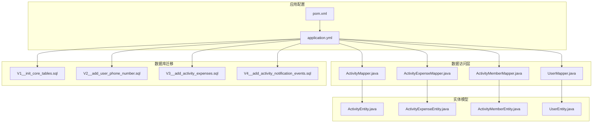
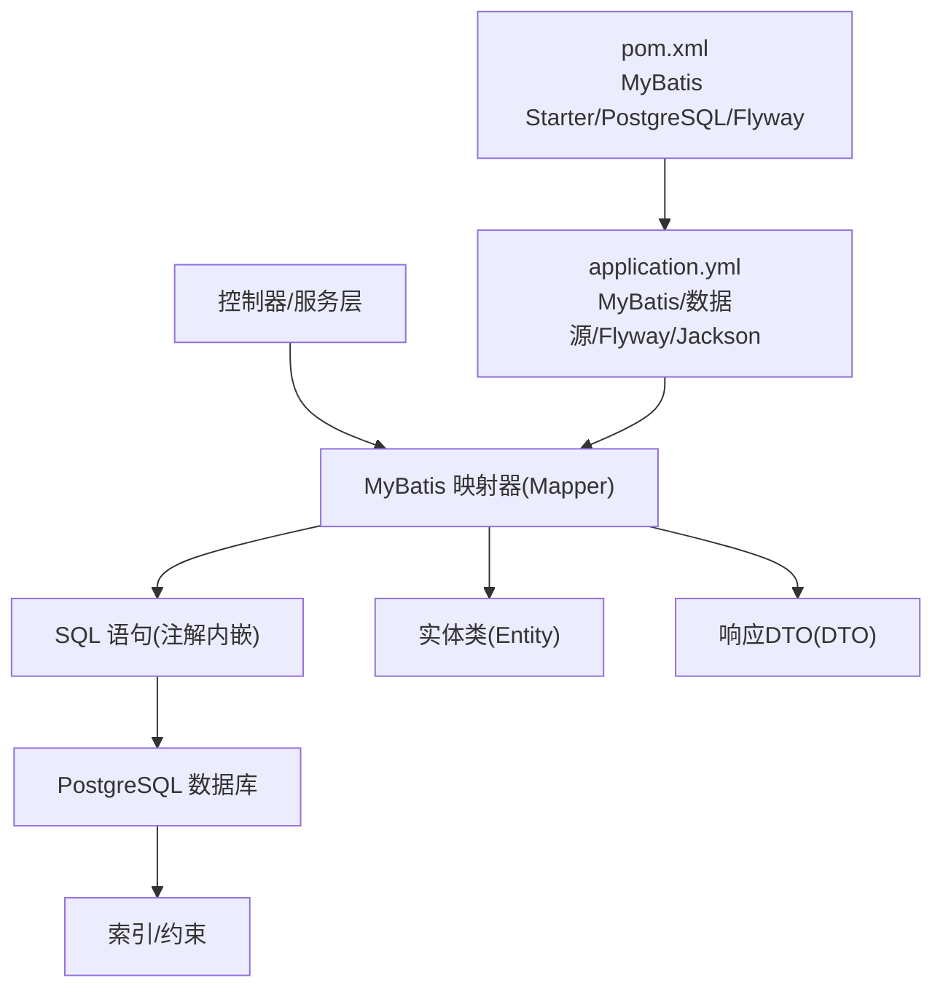
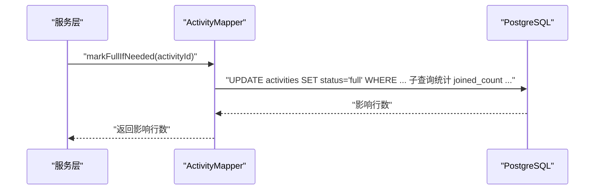
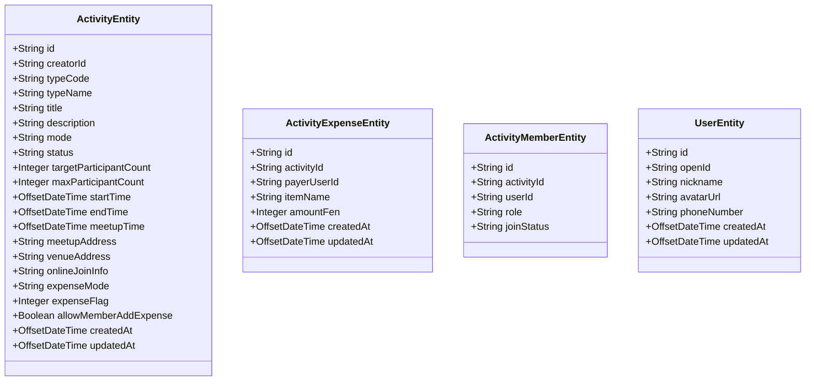
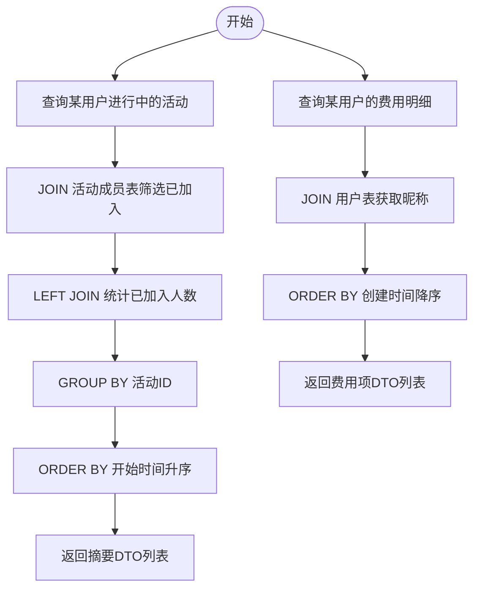
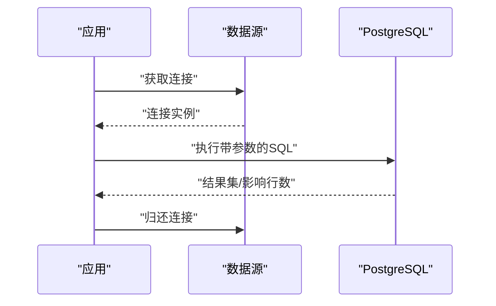
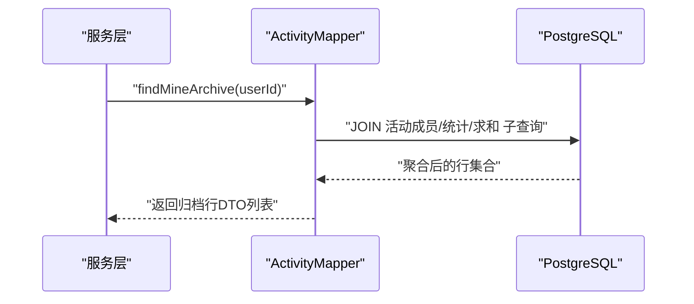
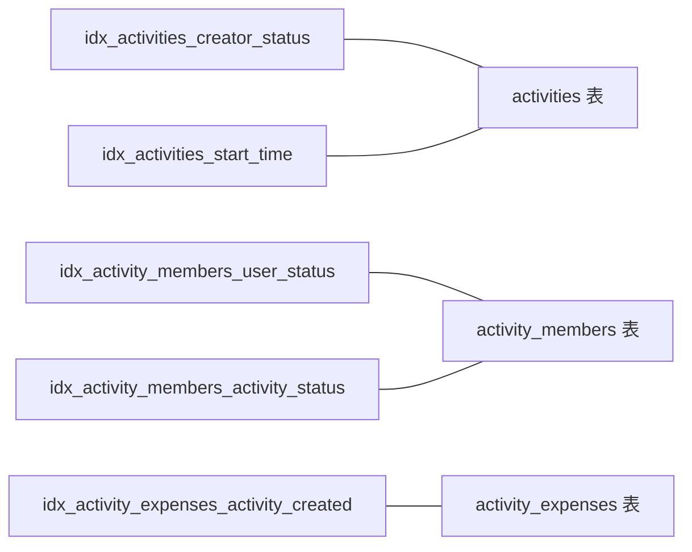
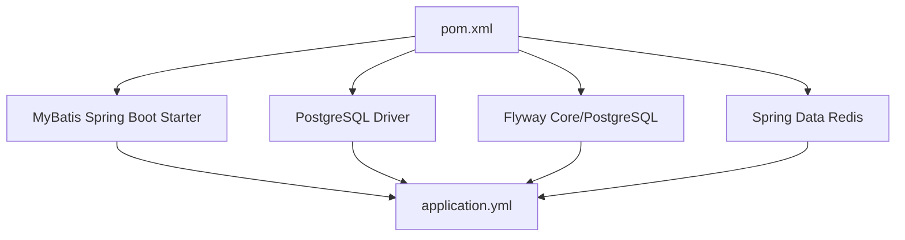

# 数据访问层

<cite>
**本文引用的文件**
- [application.yml](file://backend/src/main/resources/application.yml)
- [pom.xml](file://backend/pom.xml)
- [V1__init_core_tables.sql](file://backend/src/main/resources/db/migration/V1__init_core_tables.sql)
- [V2__add_user_phone_number.sql](file://backend/src/main/resources/db/migration/V2__add_user_phone_number.sql)
- [V3__add_activity_expenses.sql](file://backend/src/main/resources/db/migration/V3__add_activity_expenses.sql)
- [V4__add_activity_notification_events.sql](file://backend/src/main/resources/db/migration/V4__add_activity_notification_events.sql)
- [ActivityMapper.java](file://backend/src/main/java/com/playminipro/activity/mapper/ActivityMapper.java)
- [ActivityExpenseMapper.java](file://backend/src/main/java/com/playminipro/activity/mapper/ActivityExpenseMapper.java)
- [ActivityMemberMapper.java](file://backend/src/main/java/com/playminipro/activity/mapper/ActivityMemberMapper.java)
- [UserMapper.java](file://backend/src/main/java/com/playminipro/auth/mapper/UserMapper.java)
- [ActivityEntity.java](file://backend/src/main/java/com/playminipro/activity/entity/ActivityEntity.java)
- [ActivityExpenseEntity.java](file://backend/src/main/java/com/playminipro/activity/entity/ActivityExpenseEntity.java)
- [ActivityMemberEntity.java](file://backend/src/main/java/com/playminipro/activity/entity/ActivityMemberEntity.java)
- [UserEntity.java](file://backend/src/main/java/com/playminipro/auth/entity/UserEntity.java)
</cite>

## 目录
1. [简介](#简介)
2. [项目结构](#项目结构)
3. [核心组件](#核心组件)
4. [架构总览](#架构总览)
5. [组件详解](#组件详解)
6. [依赖关系分析](#依赖关系分析)
7. [性能考量](#性能考量)
8. [故障排查指南](#故障排查指南)
9. [结论](#结论)
10. [附录](#附录)

## 简介
本文件面向后端数据访问层（DAO）的开发与维护，系统性阐述基于 MyBatis 的数据访问实现，涵盖 Mapper 接口设计、XML 映射文件、动态 SQL 构建；实体类设计原则（字段映射、注解、关系映射、序列化处理）；DAO 实现模式（CRUD 封装、批量优化、结果集映射）；数据库连接池与事务管理、SQL 注入防护；复杂查询（多表联接、子查询、聚合函数）；以及性能优化策略、缓存与分页实践。本文所有技术细节均来自仓库现有源码与配置。

## 项目结构
数据访问层位于后端模块中，采用按功能域划分的包结构：activity 与 auth 分别承载活动与用户相关的实体、DTO、Mapper 与服务层。MyBatis 配置通过 Spring Boot 自动装配启用，数据库连接、Flyway 迁移与 Jackson 序列化等在应用配置中集中管理。

**图表来源**
- [application.yml:1-53](file://backend/src/main/resources/application.yml#L1-L53)
- [pom.xml:34-69](file://backend/pom.xml#L34-L69)
- [ActivityMapper.java:1-222](file://backend/src/main/java/com/playminipro/activity/mapper/ActivityMapper.java#L1-L222)
- [ActivityExpenseMapper.java:1-41](file://backend/src/main/java/com/playminipro/activity/mapper/ActivityExpenseMapper.java#L1-L41)
- [ActivityMemberMapper.java:1-73](file://backend/src/main/java/com/playminipro/activity/mapper/ActivityMemberMapper.java#L1-L73)
- [UserMapper.java:1-41](file://backend/src/main/java/com/playminipro/auth/mapper/UserMapper.java#L1-L41)
- [ActivityEntity.java:1-91](file://backend/src/main/java/com/playminipro/activity/entity/ActivityEntity.java#L1-L91)
- [ActivityExpenseEntity.java:1-35](file://backend/src/main/java/com/playminipro/activity/entity/ActivityExpenseEntity.java#L1-L35)
- [ActivityMemberEntity.java:1-25](file://backend/src/main/java/com/playminipro/activity/entity/ActivityMemberEntity.java#L1-L25)
- [UserEntity.java:1-76](file://backend/src/main/java/com/playminipro/auth/entity/UserEntity.java#L1-L76)
- [V1__init_core_tables.sql:1-58](file://backend/src/main/resources/db/migration/V1__init_core_tables.sql#L1-L58)
- [V2__add_user_phone_number.sql:1-2](file://backend/src/main/resources/db/migration/V2__add_user_phone_number.sql#L1-L2)
- [V3__add_activity_expenses.sql:1-12](file://backend/src/main/resources/db/migration/V3__add_activity_expenses.sql#L1-L12)
- [V4__add_activity_notification_events.sql:1-21](file://backend/src/main/resources/db/migration/V4__add_activity_notification_events.sql#L1-L21)

**章节来源**
- [application.yml:1-53](file://backend/src/main/resources/application.yml#L1-L53)
- [pom.xml:34-69](file://backend/pom.xml#L34-L69)

## 核心组件
- MyBatis 启用与配置：通过 Spring Boot Starter 自动装配启用，MyBatis 配置开启下划线到驼峰映射，禁用二级缓存。
- 数据源与 Flyway：数据源由环境变量驱动，Flyway 自动执行迁移脚本，确保数据库结构一致性。
- Mapper 接口：每个领域（活动、成员、费用、用户）提供对应的 Mapper 接口，覆盖 CRUD 与复杂查询。
- 实体类：对应数据库表结构，时间类型统一为带时区的时间戳，JSON 字段以文本形式返回以便序列化。
- DTO：用于对外响应的数据传输对象，避免直接暴露持久化实体。

**章节来源**
- [application.yml:28-32](file://backend/src/main/resources/application.yml#L28-L32)
- [application.yml:9-22](file://backend/src/main/resources/application.yml#L9-L22)
- [ActivityMapper.java:13-222](file://backend/src/main/java/com/playminipro/activity/mapper/ActivityMapper.java#L13-L222)
- [ActivityExpenseMapper.java:10-41](file://backend/src/main/java/com/playminipro/activity/mapper/ActivityExpenseMapper.java#L10-L41)
- [ActivityMemberMapper.java:11-73](file://backend/src/main/java/com/playminipro/activity/mapper/ActivityMemberMapper.java#L11-L73)
- [UserMapper.java:9-41](file://backend/src/main/java/com/playminipro/auth/mapper/UserMapper.java#L9-L41)
- [ActivityEntity.java:1-91](file://backend/src/main/java/com/playminipro/activity/entity/ActivityEntity.java#L1-L91)
- [ActivityExpenseEntity.java:1-35](file://backend/src/main/java/com/playminipro/activity/entity/ActivityExpenseEntity.java#L1-L35)
- [ActivityMemberEntity.java:1-25](file://backend/src/main/java/com/playminipro/activity/entity/ActivityMemberEntity.java#L1-L25)
- [UserEntity.java:1-76](file://backend/src/main/java/com/playminipro/auth/entity/UserEntity.java#L1-L76)

## 架构总览
数据访问层围绕 MyBatis 执行器与映射器工作，结合 Spring 管理的事务与连接，遵循“接口即映射”的约定式 SQL 设计。实体类与 DTO 作为数据载体，配合数据库迁移脚本保证结构稳定。

**图表来源**
- [application.yml:28-32](file://backend/src/main/resources/application.yml#L28-L32)
- [application.yml:9-22](file://backend/src/main/resources/application.yml#L9-L22)
- [pom.xml:34-69](file://backend/pom.xml#L34-L69)
- [ActivityMapper.java:16-222](file://backend/src/main/java/com/playminipro/activity/mapper/ActivityMapper.java#L16-L222)
- [ActivityExpenseMapper.java:13-41](file://backend/src/main/java/com/playminipro/activity/mapper/ActivityExpenseMapper.java#L13-L41)
- [ActivityMemberMapper.java:14-73](file://backend/src/main/java/com/playminipro/activity/mapper/ActivityMemberMapper.java#L14-L73)
- [UserMapper.java:12-41](file://backend/src/main/java/com/playminipro/auth/mapper/UserMapper.java#L12-L41)

## 组件详解

### Mapper 接口设计与动态 SQL
- 注解式 SQL：所有 SQL 均以内嵌字符串形式定义于注解中，便于集中管理与版本控制。
- 动态 SQL：通过条件分支与子查询实现状态更新、统计汇总与联接筛选，例如自动取消、满员标记、参与人数统计等。
- 参数绑定：UUID 类型参数统一转换，JSONB 字段以文本形式返回，确保序列化兼容。

**图表来源**
- [ActivityMapper.java:72-85](file://backend/src/main/java/com/playminipro/activity/mapper/ActivityMapper.java#L72-L85)

**章节来源**
- [ActivityMapper.java:16-222](file://backend/src/main/java/com/playminipro/activity/mapper/ActivityMapper.java#L16-L222)
- [ActivityExpenseMapper.java:13-41](file://backend/src/main/java/com/playminipro/activity/mapper/ActivityExpenseMapper.java#L13-L41)
- [ActivityMemberMapper.java:14-73](file://backend/src/main/java/com/playminipro/activity/mapper/ActivityMemberMapper.java#L14-L73)
- [UserMapper.java:12-41](file://backend/src/main/java/com/playminipro/auth/mapper/UserMapper.java#L12-L41)

### 实体类设计原则
- 字段映射：实体类属性与数据库列名通过 MyBatis 下划线到驼峰映射自动对齐。
- 时间类型：统一使用带时区的时间戳类型，确保时区一致与排序稳定。
- JSON 字段：JSONB 在查询时以文本形式返回，避免二进制序列化问题。
- 关系映射：外键关系在数据库层面通过约束与索引保障，实体类仅保留必要字段。
- 序列化处理：Jackson 配置写入本地时间戳，避免默认时间戳格式导致的歧义。

**图表来源**
- [ActivityEntity.java:1-91](file://backend/src/main/java/com/playminipro/activity/entity/ActivityEntity.java#L1-L91)
- [ActivityExpenseEntity.java:1-35](file://backend/src/main/java/com/playminipro/activity/entity/ActivityExpenseEntity.java#L1-L35)
- [ActivityMemberEntity.java:1-25](file://backend/src/main/java/com/playminipro/activity/entity/ActivityMemberEntity.java#L1-L25)
- [UserEntity.java:1-76](file://backend/src/main/java/com/playminipro/auth/entity/UserEntity.java#L1-L76)

**章节来源**
- [application.yml:23-27](file://backend/src/main/resources/application.yml#L23-L27)
- [ActivityEntity.java:1-91](file://backend/src/main/java/com/playminipro/activity/entity/ActivityEntity.java#L1-L91)
- [ActivityExpenseEntity.java:1-35](file://backend/src/main/java/com/playminipro/activity/entity/ActivityExpenseEntity.java#L1-L35)
- [ActivityMemberEntity.java:1-25](file://backend/src/main/java/com/playminipro/activity/entity/ActivityMemberEntity.java#L1-L25)
- [UserEntity.java:1-76](file://backend/src/main/java/com/playminipro/auth/entity/UserEntity.java#L1-L76)

### DAO 实现模式与结果集映射
- CRUD 封装：每个 Mapper 提供标准的增删改查方法，参数与返回值清晰明确。
- 批量优化：使用 ON CONFLICT 与 UPSERT 模式减少重复插入开销。
- 结果集映射：通过注解 SQL 返回实体或 DTO 列表，避免手动映射。
- 复杂查询：使用子查询与联接实现统计与筛选，如参与人数、费用总额、归档列表等。

**图表来源**
- [ActivityMapper.java:106-122](file://backend/src/main/java/com/playminipro/activity/mapper/ActivityMapper.java#L106-L122)
- [ActivityExpenseMapper.java:22-33](file://backend/src/main/java/com/playminipro/activity/mapper/ActivityExpenseMapper.java#L22-L33)

**章节来源**
- [ActivityMapper.java:106-186](file://backend/src/main/java/com/playminipro/activity/mapper/ActivityMapper.java#L106-L186)
- [ActivityExpenseMapper.java:22-41](file://backend/src/main/java/com/playminipro/activity/mapper/ActivityExpenseMapper.java#L22-L41)
- [ActivityMemberMapper.java:31-73](file://backend/src/main/java/com/playminipro/activity/mapper/ActivityMemberMapper.java#L31-L73)
- [UserMapper.java:12-41](file://backend/src/main/java/com/playminipro/auth/mapper/UserMapper.java#L12-L41)

### 数据库连接池、事务与安全
- 连接池与驱动：数据源由环境变量配置，PostgreSQL 驱动在运行时加载。
- 事务管理：Spring Boot 默认启用声明式事务，DAO 层方法通常在服务层事务边界内调用。
- SQL 注入防护：参数化查询与类型转换（UUID、JSONB）有效降低注入风险；避免字符串拼接动态 SQL。
- Flyway 迁移：自动执行迁移脚本，确保表结构与索引约束一致。

**图表来源**
- [application.yml:9-13](file://backend/src/main/resources/application.yml#L9-L13)
- [pom.xml:61-64](file://backend/pom.xml#L61-L64)

**章节来源**
- [application.yml:9-13](file://backend/src/main/resources/application.yml#L9-L13)
- [pom.xml:61-64](file://backend/pom.xml#L61-L64)

### 复杂查询实现方案
- 多表联接：通过 JOIN 实现跨表数据整合，如活动与成员、费用与用户。
- 子查询：在 WHERE 或 SET 中使用子查询完成条件判断与统计，如满员标记、自动取消。
- 聚合函数：COUNT、SUM 等用于统计参与人数与费用总额。
- 排序与筛选：结合状态、时间、角色等维度进行排序与过滤。

**图表来源**
- [ActivityMapper.java:124-158](file://backend/src/main/java/com/playminipro/activity/mapper/ActivityMapper.java#L124-L158)

**章节来源**
- [ActivityMapper.java:124-186](file://backend/src/main/java/com/playminipro/activity/mapper/ActivityMapper.java#L124-L186)

### 性能优化策略、缓存与分页
- 索引与约束：迁移脚本中定义了多处索引与检查约束，提升查询与写入性能并保障数据完整性。
- 缓存：MyBatis 二级缓存在配置中关闭，避免复杂场景下的缓存不一致；Redis 已引入但未在 DAO 层启用。
- 分页：当前查询未见显式分页参数，建议在需要的查询中引入分页参数与 LIMIT/OFFSET。

**图表来源**
- [V1__init_core_tables.sql:40-58](file://backend/src/main/resources/db/migration/V1__init_core_tables.sql#L40-L58)
- [V3__add_activity_expenses.sql:12-12](file://backend/src/main/resources/db/migration/V3__add_activity_expenses.sql#L12-L12)

**章节来源**
- [application.yml:28-32](file://backend/src/main/resources/application.yml#L28-L32)
- [pom.xml:44-46](file://backend/pom.xml#L44-L46)
- [V1__init_core_tables.sql:40-58](file://backend/src/main/resources/db/migration/V1__init_core_tables.sql#L40-L58)
- [V3__add_activity_expenses.sql:12-12](file://backend/src/main/resources/db/migration/V3__add_activity_expenses.sql#L12-L12)

## 依赖关系分析
- MyBatis 启动器与 PostgreSQL 驱动：通过 Maven 依赖引入，确保 ORM 与数据库驱动可用。
- Flyway：负责数据库迁移，确保表结构与索引随版本演进。
- Redis：引入但未在 DAO 层使用，可作为未来缓存与会话存储扩展点。

**图表来源**
- [pom.xml:34-69](file://backend/pom.xml#L34-L69)
- [application.yml:9-22](file://backend/src/main/resources/application.yml#L9-L22)

**章节来源**
- [pom.xml:34-69](file://backend/pom.xml#L34-L69)

## 性能考量
- 查询路径优化：优先利用迁移脚本中定义的索引，避免全表扫描。
- 写入路径优化：使用 UPSERT 与批量插入减少往返次数。
- 序列化成本：JSON 文本返回与 Jackson 配置有助于减少序列化开销。
- 缓存策略：当前未启用 MyBatis 二级缓存与 Redis 缓存，建议对热点只读数据引入缓存层。

## 故障排查指南
- SQL 执行异常：检查参数类型转换（UUID、JSONB）是否正确，确认表结构与迁移脚本一致。
- 查询性能问题：核对索引是否存在，评估查询计划；必要时引入分页与限制返回字段。
- 连接与驱动：确认数据源配置与驱动版本匹配，排查连接超时与认证错误。
- 迁移失败：查看 Flyway 版本与日志，确保迁移脚本顺序与依赖满足。

**章节来源**
- [application.yml:9-22](file://backend/src/main/resources/application.yml#L9-L22)
- [V1__init_core_tables.sql:1-58](file://backend/src/main/resources/db/migration/V1__init_core_tables.sql#L1-L58)
- [V2__add_user_phone_number.sql:1-2](file://backend/src/main/resources/db/migration/V2__add_user_phone_number.sql#L1-L2)
- [V3__add_activity_expenses.sql:1-12](file://backend/src/main/resources/db/migration/V3__add_activity_expenses.sql#L1-L12)
- [V4__add_activity_notification_events.sql:1-21](file://backend/src/main/resources/db/migration/V4__add_activity_notification_events.sql#L1-L21)

## 结论
本数据访问层以 MyBatis 注解式 SQL 为核心，结合 Spring Boot 自动装配与 Flyway 迁移，实现了清晰的领域隔离与稳定的数据库契约。通过合理的索引、参数化查询与 DTO 输出，兼顾了可维护性与性能。建议后续引入 Redis 缓存与分页参数，进一步完善缓存与高并发场景下的数据访问体验。

## 附录
- 数据库表结构概览（依据迁移脚本）
  - users：用户主表，含唯一 open_id 与基础信息。
  - activities：活动主表，含状态、时间、地址、费用模式等字段，并有多种检查约束。
  - activity_members：活动成员表，记录角色与加入状态，含唯一约束。
  - activity_expenses：活动费用表，记录费用明细与金额。
  - activity_notification_events：活动通知事件表，支持 JSONB 负载与发送状态。

**章节来源**
- [V1__init_core_tables.sql:1-58](file://backend/src/main/resources/db/migration/V1__init_core_tables.sql#L1-L58)
- [V2__add_user_phone_number.sql:1-2](file://backend/src/main/resources/db/migration/V2__add_user_phone_number.sql#L1-L2)
- [V3__add_activity_expenses.sql:1-12](file://backend/src/main/resources/db/migration/V3__add_activity_expenses.sql#L1-L12)
- [V4__add_activity_notification_events.sql:1-21](file://backend/src/main/resources/db/migration/V4__add_activity_notification_events.sql#L1-L21)