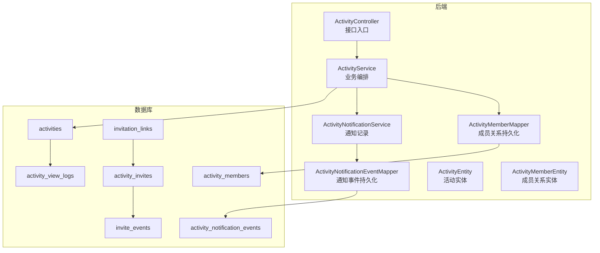
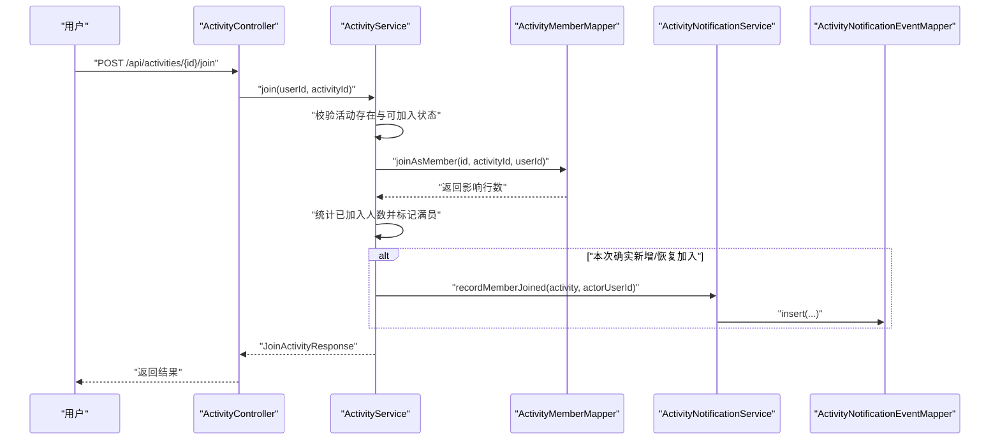
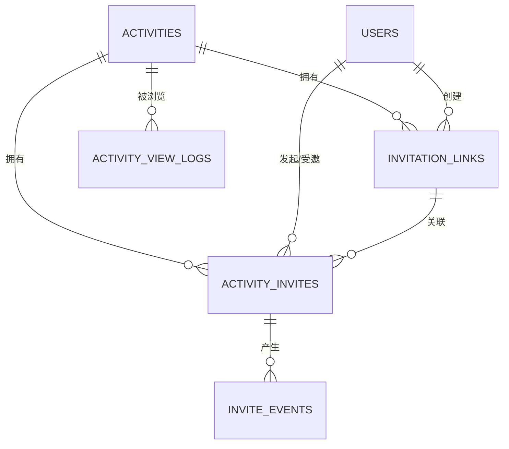
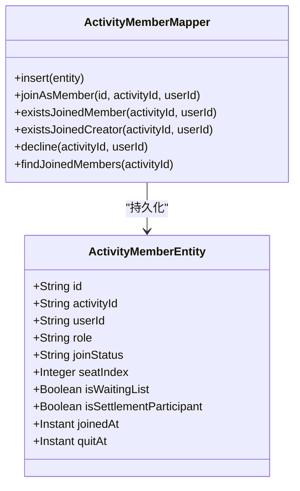
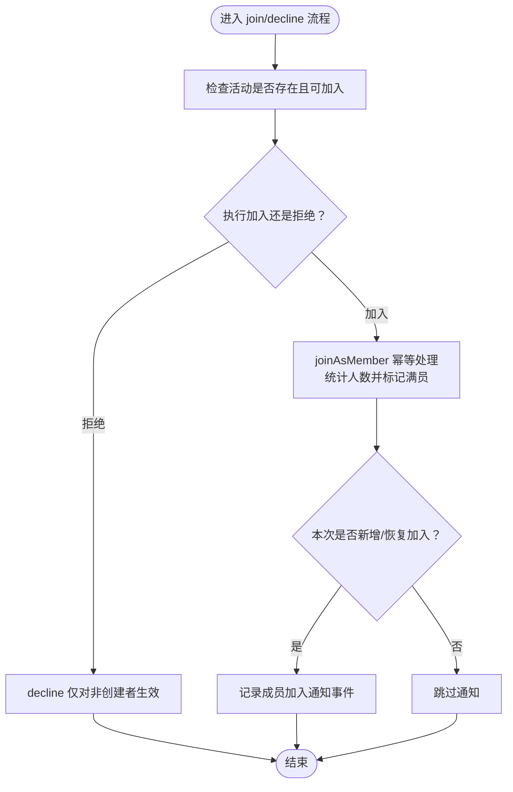
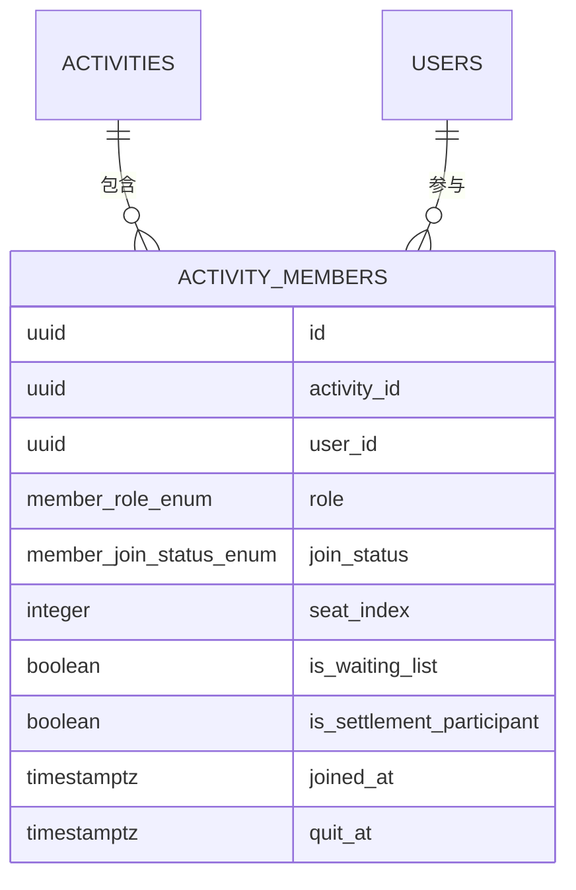
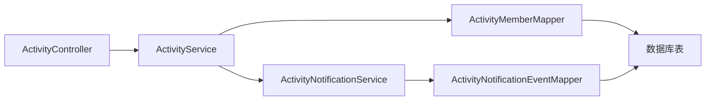

# 成员招募系统

<cite>
**本文引用的文件**
- [ActivityMemberEntity.java](file://backend/src/main/java/com/playminipro/activity/entity/ActivityMemberEntity.java)
- [ActivityMemberMapper.java](file://backend/src/main/java/com/playminipro/activity/mapper/ActivityMemberMapper.java)
- [ActivityService.java](file://backend/src/main/java/com/playminipro/activity/service/ActivityService.java)
- [ActivityNotificationService.java](file://backend/src/main/java/com/playminipro/activity/service/ActivityNotificationService.java)
- [ActivityNotificationEventMapper.java](file://backend/src/main/java/com/playminipro/activity/mapper/ActivityNotificationEventMapper.java)
- [V4__add_activity_notification_events.sql](file://backend/src/main/resources/db/migration/V4__add_activity_notification_events.sql)
- [05-PostgreSQL建表.sql](file://doc/05-PostgreSQL建表.sql)
- [202606021041工程改进设计与调试说明.md](file://doc/改进文档/202606021041工程改进设计与调试说明.md)
- [ActivityController.java](file://backend/src/main/java/com/playminipro/activity/controller/ActivityController.java)
- [ActivityMemberResponse.java](file://backend/src/main/java/com/playminipro/activity/dto/ActivityMemberResponse.java)
</cite>

## 目录
1. [引言](#引言)
2. [项目结构](#项目结构)
3. [核心组件](#核心组件)
4. [架构总览](#架构总览)
5. [详细组件分析](#详细组件分析)
6. [依赖分析](#依赖分析)
7. [性能考虑](#性能考虑)
8. [故障排查指南](#故障排查指南)
9. [结论](#结论)
10. [附录](#附录)

## 引言
本文件面向成员招募系统的技术实现，围绕邀请机制、邀请链接、状态跟踪、角色管理、成员状态、关系维护、API 设计以及用户体验与一致性保障进行系统化梳理。目标是帮助开发者快速理解并扩展该模块，同时为产品与测试同学提供清晰的参考。

## 项目结构
成员招募相关能力主要位于后端 activity 子域，涉及实体、映射、服务与控制器层，并配套数据库迁移脚本与通知事件表。前端通过轮询与微信订阅消息配合实现成员动态展示与通知。

图表来源
- [ActivityController.java](file://backend/src/main/java/com/playminipro/activity/controller/ActivityController.java)
- [ActivityService.java](file://backend/src/main/java/com/playminipro/activity/service/ActivityService.java)
- [ActivityMemberMapper.java](file://backend/src/main/java/com/playminipro/activity/mapper/ActivityMemberMapper.java)
- [ActivityNotificationEventMapper.java](file://backend/src/main/java/com/playminipro/activity/mapper/ActivityNotificationEventMapper.java)
- [05-PostgreSQL建表.sql](file://doc/05-PostgreSQL建表.sql)

章节来源
- [ActivityController.java](file://backend/src/main/java/com/playminipro/activity/controller/ActivityController.java)
- [ActivityService.java](file://backend/src/main/java/com/playminipro/activity/service/ActivityService.java)
- [ActivityMemberMapper.java](file://backend/src/main/java/com/playminipro/activity/mapper/ActivityMemberMapper.java)
- [ActivityNotificationEventMapper.java](file://backend/src/main/java/com/playminipro/activity/mapper/ActivityNotificationEventMapper.java)
- [05-PostgreSQL建表.sql](file://doc/05-PostgreSQL建表.sql)

## 核心组件
- 成员关系实体与映射
  - 实体：ActivityMemberEntity，承载活动成员的核心字段（角色、加入状态、座位索引、是否候补、结算参与等）。
  - 映射：ActivityMemberMapper 提供成员加入、查询已加入成员、是否存在加入关系、拒绝加入等操作。
- 业务服务
  - ActivityService：封装活动生命周期与成员招募流程，包括创建活动、加入/拒绝、统计人数、标记满员、触发通知等。
  - ActivityNotificationService：记录“成员加入”通知事件，支持后续对接微信订阅消息。
  - ActivityNotificationEventMapper：持久化通知事件、查询除操作者外的其他成员、去重判断与状态更新。
- 数据模型
  - 活动表、成员关系表、邀请链接表、邀请事件表、浏览日志表、通知事件表等，支撑邀请、状态跟踪与通知。

章节来源
- [ActivityMemberEntity.java](file://backend/src/main/java/com/playminipro/activity/entity/ActivityMemberEntity.java)
- [ActivityMemberMapper.java](file://backend/src/main/java/com/playminipro/activity/mapper/ActivityMemberMapper.java)
- [ActivityService.java](file://backend/src/main/java/com/playminipro/activity/service/ActivityService.java)
- [ActivityNotificationService.java](file://backend/src/main/java/com/playminipro/activity/service/ActivityNotificationService.java)
- [ActivityNotificationEventMapper.java](file://backend/src/main/java/com/playminipro/activity/mapper/ActivityNotificationEventMapper.java)
- [V4__add_activity_notification_events.sql](file://backend/src/main/resources/db/migration/V4__add_activity_notification_events.sql)
- [05-PostgreSQL建表.sql](file://doc/05-PostgreSQL建表.sql)

## 架构总览
成员招募系统遵循分层架构：控制器负责接口编排，服务层组织业务规则，映射层完成数据持久化，数据库层承载状态与历史。通知事件作为异步扩展点，便于接入微信订阅消息。

图表来源
- [ActivityController.java](file://backend/src/main/java/com/playminipro/activity/controller/ActivityController.java)
- [ActivityService.java](file://backend/src/main/java/com/playminipro/activity/service/ActivityService.java)
- [ActivityMemberMapper.java](file://backend/src/main/java/com/playminipro/activity/mapper/ActivityMemberMapper.java)
- [ActivityNotificationService.java](file://backend/src/main/java/com/playminipro/activity/service/ActivityNotificationService.java)
- [ActivityNotificationEventMapper.java](file://backend/src/main/java/com/playminipro/activity/mapper/ActivityNotificationEventMapper.java)

## 详细组件分析

### 邀请机制与邀请链接
- 邀请链接表（invitation_links）
  - 字段：活动引用、创建者、分享渠道、场景、唯一令牌、过期时间、创建时间。
  - 约束：share_token 唯一，索引覆盖活动与创建者。
- 邀请事件表（activity_invites 与 invite_events）
  - 记录邀请发起、查看、响应（接受/拒绝）、原因码与文本、时间戳等。
  - 关联：可关联 invitation_links 与具体用户，支持按活动与状态检索。
- 浏览日志（activity_view_logs）
  - 记录匿名或登录用户的访问轨迹，便于统计与审计。

图表来源
- [05-PostgreSQL建表.sql](file://doc/05-PostgreSQL建表.sql)

章节来源
- [05-PostgreSQL建表.sql](file://doc/05-PostgreSQL建表.sql)

### 邀请链接生成与状态跟踪
- 生成策略
  - 由活动创建者在后台或前端生成邀请链接，存储 invitation_links 并下发给潜在成员。
- 状态跟踪
  - activity_invites 记录当前状态（如 invited、accepted、declined），invite_events 记录事件明细（类型、值、IP、UA、时间）。
- 用户体验
  - 小程序端通过轮询刷新详情页，确保成员列表与状态实时可见；接受邀请前请求微信订阅消息授权，提升通知可达性。

章节来源
- [202606021041工程改进设计与调试说明.md](file://doc/改进文档/202606021041工程改进设计与调试说明.md)
- [05-PostgreSQL建表.sql](file://doc/05-PostgreSQL建表.sql)

### 成员角色管理
- 角色定义
  - 成员角色枚举默认为 member，创建者角色为 creator。
- 权限控制
  - 拒绝加入仅允许非创建者的成员关系被标记为 quit，避免创建者自我撤销。
- 角色转换机制
  - 当前代码未提供显式角色转换接口；可通过扩展在服务层增加变更逻辑并更新映射。

图表来源
- [ActivityMemberEntity.java](file://backend/src/main/java/com/playminipro/activity/entity/ActivityMemberEntity.java)
- [ActivityMemberMapper.java](file://backend/src/main/java/com/playminipro/activity/mapper/ActivityMemberMapper.java)

章节来源
- [ActivityMemberEntity.java](file://backend/src/main/java/com/playminipro/activity/entity/ActivityMemberEntity.java)
- [ActivityMemberMapper.java](file://backend/src/main/java/com/playminipro/activity/mapper/ActivityMemberMapper.java)

### 成员状态管理
- 状态枚举
  - join_status 默认 joined，支持 quit（拒绝/退出）等状态。
- 处理逻辑
  - 加入：幂等插入或更新为 joined，刷新加入时间；当人数达上限标记活动为 full。
  - 拒绝：仅允许非创建者成员关系被标记为 quit；若无关系也返回成功，保证幂等。
  - 查询：仅返回 join_status = joined 的成员，按加入时间排序。

图表来源
- [ActivityService.java](file://backend/src/main/java/com/playminipro/activity/service/ActivityService.java)
- [ActivityMemberMapper.java](file://backend/src/main/java/com/playminipro/activity/mapper/ActivityMemberMapper.java)
- [ActivityNotificationService.java](file://backend/src/main/java/com/playminipro/activity/service/ActivityNotificationService.java)
- [ActivityNotificationEventMapper.java](file://backend/src/main/java/com/playminipro/activity/mapper/ActivityNotificationEventMapper.java)

章节来源
- [ActivityService.java](file://backend/src/main/java/com/playminipro/activity/service/ActivityService.java)
- [ActivityMemberMapper.java](file://backend/src/main/java/com/playminipro/activity/mapper/ActivityMemberMapper.java)
- [ActivityNotificationService.java](file://backend/src/main/java/com/playminipro/activity/service/ActivityNotificationService.java)
- [ActivityNotificationEventMapper.java](file://backend/src/main/java/com/playminipro/activity/mapper/ActivityNotificationEventMapper.java)

### 成员关系维护
- 实体设计
  - ActivityMemberEntity 包含角色、加入状态、座位索引、候补标识、结算参与标识、加入/退出时间等。
- 多对多关系映射
  - 通过 activity_members 表实现活动与用户之间的多对多关系，UNIQUE(activity_id, user_id) 保证同一活动下用户唯一。
- 关联数据同步
  - 加入/拒绝后，统计人数并更新活动状态；通知事件按“除操作者外”的已加入成员批量落库，便于后续推送。

图表来源
- [05-PostgreSQL建表.sql](file://doc/05-PostgreSQL建表.sql)
- [ActivityMemberEntity.java](file://backend/src/main/java/com/playminipro/activity/entity/ActivityMemberEntity.java)

章节来源
- [05-PostgreSQL建表.sql](file://doc/05-PostgreSQL建表.sql)
- [ActivityMemberEntity.java](file://backend/src/main/java/com/playminipro/activity/entity/ActivityMemberEntity.java)

### 成员管理 API 设计
- 邀请发送
  - 生成邀请链接：创建 invitation_links 记录，返回 share_token 给前端。
  - 发起邀请：创建 activity_invites 记录，写入邀请事件 invite_events。
- 接受/拒绝
  - 加入：POST /api/activities/{id}/join，幂等处理，人数达标则标记活动为 full。
  - 拒绝：POST /api/activities/{id}/decline，仅允许非创建者成员关系被标记为 quit。
- 成员列表查询
  - GET /api/activities/{id} 返回已加入成员列表（join_status=joined），并包含当前用户是否已加入、是否为创建者、是否可加入等上下文。
- 成员移除
  - 当前未提供直接移除接口；可通过扩展在服务层增加移除逻辑并更新映射。

章节来源
- [ActivityService.java](file://backend/src/main/java/com/playminipro/activity/service/ActivityService.java)
- [ActivityMemberMapper.java](file://backend/src/main/java/com/playminipro/activity/mapper/ActivityMemberMapper.java)
- [ActivityMemberResponse.java](file://backend/src/main/java/com/playminipro/activity/dto/ActivityMemberResponse.java)
- [202606021041工程改进设计与调试说明.md](file://doc/改进文档/202606021041工程改进设计与调试说明.md)

### 用户体验与通知机制
- 轮询刷新
  - 小程序详情页每 10 秒轮询一次，拉取最新成员列表与活动状态，保证界面实时性。
- 微信订阅消息
  - 接受邀请前请求初始订阅权限；通知事件落库后，可在 ActivityNotificationService 中按 event_type 分发至微信 sendMessage API。
- 数据一致性
  - 使用数据库唯一约束与事务保证幂等与原子性；通知事件表支持去重与状态追踪。

章节来源
- [202606021041工程改进设计与调试说明.md](file://doc/改进文档/202606021041工程改进设计与调试说明.md)
- [ActivityNotificationService.java](file://backend/src/main/java/com/playminipro/activity/service/ActivityNotificationService.java)
- [ActivityNotificationEventMapper.java](file://backend/src/main/java/com/playminipro/activity/mapper/ActivityNotificationEventMapper.java)
- [V4__add_activity_notification_events.sql](file://backend/src/main/resources/db/migration/V4__add_activity_notification_events.sql)

## 依赖分析
- 控制器依赖服务，服务依赖映射与通知服务，映射依赖数据库表。
- 通知事件依赖成员关系与用户信息，形成“除操作者外”的广播式通知。
- 邀请链路依赖活动与用户表，支持按活动维度聚合统计与审计。

图表来源
- [ActivityController.java](file://backend/src/main/java/com/playminipro/activity/controller/ActivityController.java)
- [ActivityService.java](file://backend/src/main/java/com/playminipro/activity/service/ActivityService.java)
- [ActivityMemberMapper.java](file://backend/src/main/java/com/playminipro/activity/mapper/ActivityMemberMapper.java)
- [ActivityNotificationService.java](file://backend/src/main/java/com/playminipro/activity/service/ActivityNotificationService.java)
- [ActivityNotificationEventMapper.java](file://backend/src/main/java/com/playminipro/activity/mapper/ActivityNotificationEventMapper.java)

章节来源
- [ActivityController.java](file://backend/src/main/java/com/playminipro/activity/controller/ActivityController.java)
- [ActivityService.java](file://backend/src/main/java/com/playminipro/activity/service/ActivityService.java)
- [ActivityMemberMapper.java](file://backend/src/main/java/com/playminipro/activity/mapper/ActivityMemberMapper.java)
- [ActivityNotificationService.java](file://backend/src/main/java/com/playminipro/activity/service/ActivityNotificationService.java)
- [ActivityNotificationEventMapper.java](file://backend/src/main/java/com/playminipro/activity/mapper/ActivityNotificationEventMapper.java)

## 性能考虑
- 索引优化
  - 活动表：按创建者+状态、开始时间、类型编码建立索引，加速筛选与排序。
  - 成员表：按活动+加入状态建立索引，加速成员查询与统计。
  - 邀请/通知/浏览表：按活动、用户、事件类型建立索引，提升查询效率。
- 幂等与冲突处理
  - 使用 UNIQUE(activity_id, user_id) 与 ON CONFLICT 更新，避免重复加入与状态抖动。
- 事务边界
  - 加入/拒绝、人数统计、满员标记与通知写入在单事务内完成，保证一致性。
- 批量通知
  - 通知事件按“除操作者外”的成员批量落库，减少重复计算与网络开销。

## 故障排查指南
- 常见错误与定位
  - 活动不存在：抛出业务异常，检查活动 ID 与权限。
  - 活动不可加入：检查活动状态（recruiting/full）与最大人数限制。
  - 重复加入：利用唯一约束与幂等逻辑，确认是否已存在 join_status=joined 的关系。
  - 拒绝无效：确认操作者不是创建者，否则不会生效。
- 日志与审计
  - invite_events 与 activity_view_logs 记录事件与访问轨迹，便于回溯。
  - activity_notification_events 记录通知事件与发送状态，便于排查推送问题。
- 前端轮询
  - 若成员列表不刷新，检查定时器启动/停止逻辑与接口返回字段。

章节来源
- [ActivityService.java](file://backend/src/main/java/com/playminipro/activity/service/ActivityService.java)
- [ActivityMemberMapper.java](file://backend/src/main/java/com/playminipro/activity/mapper/ActivityMemberMapper.java)
- [ActivityNotificationEventMapper.java](file://backend/src/main/java/com/playminipro/activity/mapper/ActivityNotificationEventMapper.java)
- [V4__add_activity_notification_events.sql](file://backend/src/main/resources/db/migration/V4__add_activity_notification_events.sql)
- [202606021041工程改进设计与调试说明.md](file://doc/改进文档/202606021041工程改进设计与调试说明.md)

## 结论
成员招募系统以活动为中心，通过邀请链路、成员关系与通知事件三部分协同，实现了从邀请到加入/拒绝再到通知的完整闭环。系统采用幂等与事务保障一致性，结合数据库索引与轮询机制提升可用性。未来可在角色转换、成员移除、邀请批量发送等方面进一步扩展。

## 附录
- 数据库迁移与表结构
  - 活动、成员、邀请、事件、浏览与通知事件等表结构与索引定义。
- 文档与规范
  - 工程改进与调试说明文档提供了邀请接受、婉拒、实时可见等流程细节。

章节来源
- [05-PostgreSQL建表.sql](file://doc/05-PostgreSQL建表.sql)
- [V4__add_activity_notification_events.sql](file://backend/src/main/resources/db/migration/V4__add_activity_notification_events.sql)
- [202606021041工程改进设计与调试说明.md](file://doc/改进文档/202606021041工程改进设计与调试说明.md)