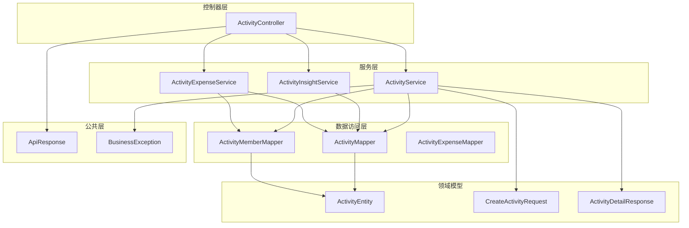
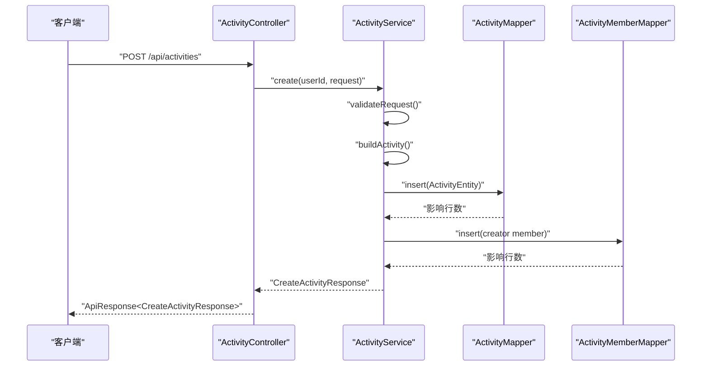
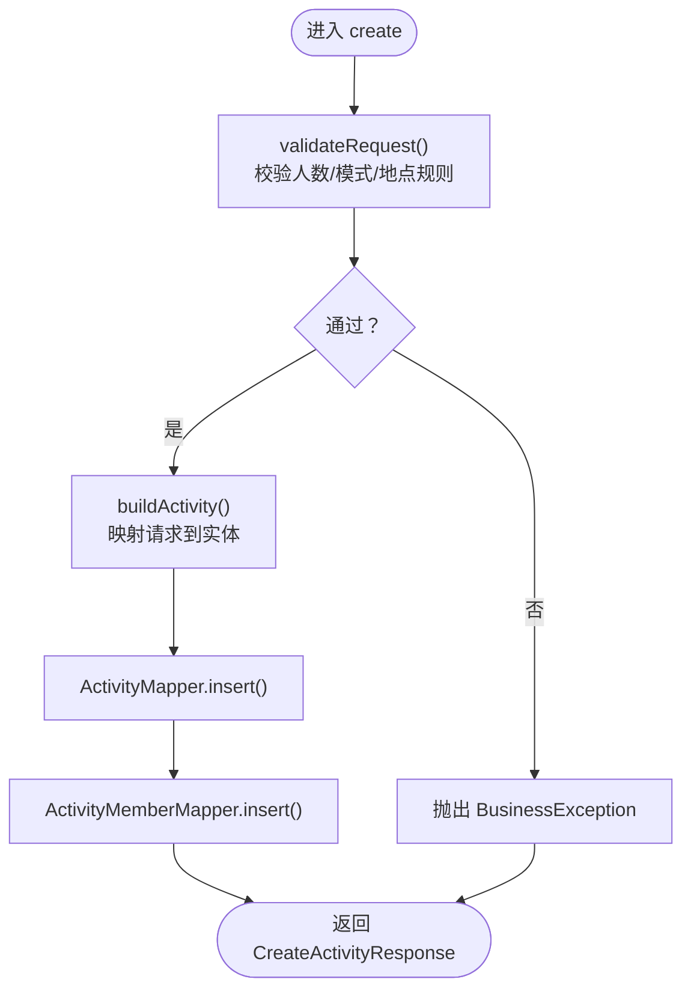
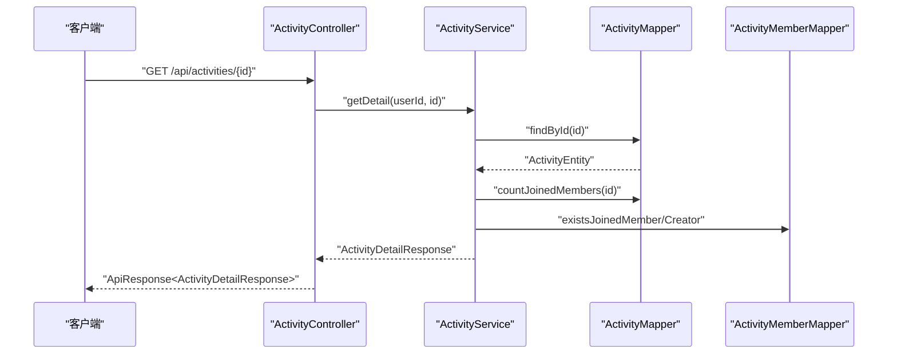
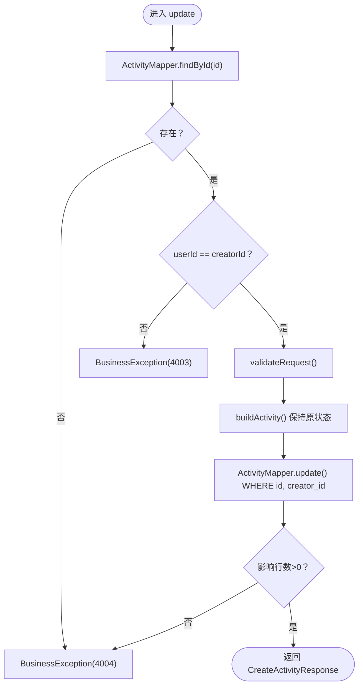
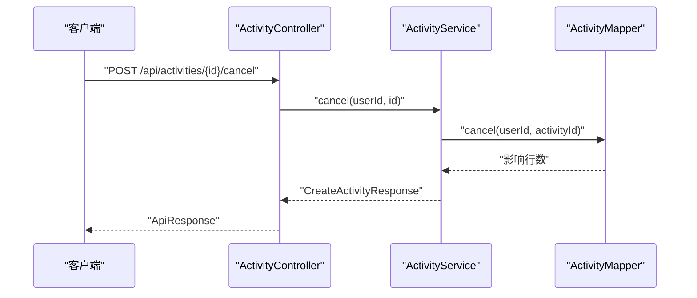
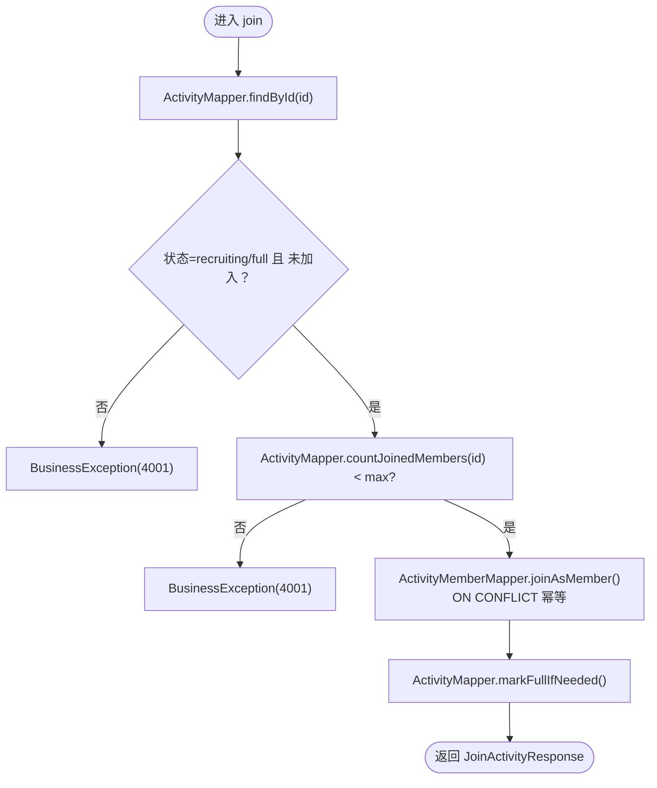
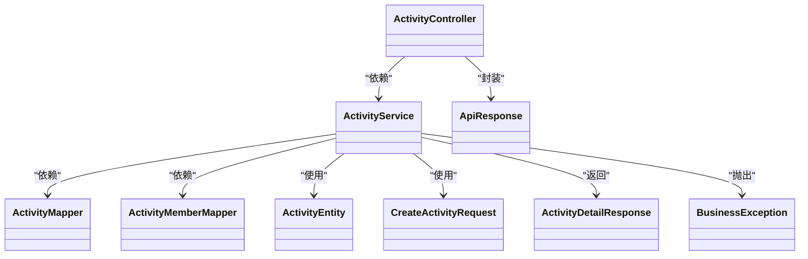

# 活动CRUD操作

<cite>
**本文引用的文件**
- [ActivityController.java](file://backend/src/main/java/com/playminipro/activity/controller/ActivityController.java)
- [CreateActivityRequest.java](file://backend/src/main/java/com/playminipro/activity/dto/CreateActivityRequest.java)
- [ActivityEntity.java](file://backend/src/main/java/com/playminipro/activity/entity/ActivityEntity.java)
- [ActivityMapper.java](file://backend/src/main/java/com/playminipro/activity/mapper/ActivityMapper.java)
- [ActivityService.java](file://backend/src/main/java/com/playminipro/activity/service/ActivityService.java)
- [ActivityMemberMapper.java](file://backend/src/main/java/com/playminipro/activity/mapper/ActivityMemberMapper.java)
- [ActivityTypeRuleSet.java](file://backend/src/main/java/com/playminipro/activity/service/ActivityTypeRuleSet.java)
- [ApiResponse.java](file://backend/src/main/java/com/playminipro/common/response/ApiResponse.java)
- [BusinessException.java](file://backend/src/main/java/com/playminipro/common/exception/BusinessException.java)
- [V1__init_core_tables.sql](file://backend/src/main/resources/db/migration/V1__init_core_tables.sql)
- [06-后端接口详细文档.md](file://doc/06-后端接口详细文档.md)
</cite>

## 目录
1. [引言](#引言)
2. [项目结构](#项目结构)
3. [核心组件](#核心组件)
4. [架构总览](#架构总览)
5. [详细组件分析](#详细组件分析)
6. [依赖分析](#依赖分析)
7. [性能考量](#性能考量)
8. [故障排查指南](#故障排查指南)
9. [结论](#结论)
10. [附录](#附录)

## 引言
本文件聚焦于“活动”模块的CRUD（创建、读取、更新、删除）操作，系统性梳理从请求参数校验、实体映射、数据持久化、查询与筛选、更新与并发控制，到删除与关联清理的完整链路。同时提供API接口规范、错误处理机制与最佳实践，帮助开发者快速理解与扩展功能。

## 项目结构
活动模块采用典型的分层架构：控制器层负责HTTP路由与鉴权上下文注入；服务层承载业务逻辑与事务边界；数据访问层通过MyBatis映射器执行SQL；DTO与实体分别承担请求/响应与持久化模型；公共层提供统一响应与异常体系。

图表来源
- [ActivityController.java:27-112](file://backend/src/main/java/com/playminipro/activity/controller/ActivityController.java#L27-L112)
- [ActivityService.java:20-232](file://backend/src/main/java/com/playminipro/activity/service/ActivityService.java#L20-L232)
- [ActivityMapper.java:13-222](file://backend/src/main/java/com/playminipro/activity/mapper/ActivityMapper.java#L13-L222)
- [ActivityMemberMapper.java:11-73](file://backend/src/main/java/com/playminipro/activity/mapper/ActivityMemberMapper.java#L11-L73)
- [ActivityEntity.java:5-91](file://backend/src/main/java/com/playminipro/activity/entity/ActivityEntity.java#L5-L91)
- [CreateActivityRequest.java:12-30](file://backend/src/main/java/com/playminipro/activity/dto/CreateActivityRequest.java#L12-L30)
- [ActivityDetailResponse.java:6-30](file://backend/src/main/java/com/playminipro/activity/dto/ActivityDetailResponse.java#L6-L30)
- [ApiResponse.java:3-51](file://backend/src/main/java/com/playminipro/common/response/ApiResponse.java#L3-L51)
- [BusinessException.java:3-15](file://backend/src/main/java/com/playminipro/common/exception/BusinessException.java#L3-L15)

章节来源
- [ActivityController.java:27-112](file://backend/src/main/java/com/playminipro/activity/controller/ActivityController.java#L27-L112)
- [ActivityService.java:20-232](file://backend/src/main/java/com/playminipro/activity/service/ActivityService.java#L20-L232)
- [ActivityMapper.java:13-222](file://backend/src/main/java/com/playminipro/activity/mapper/ActivityMapper.java#L13-L222)
- [ActivityMemberMapper.java:11-73](file://backend/src/main/java/com/playminipro/activity/mapper/ActivityMemberMapper.java#L11-L73)
- [ActivityEntity.java:5-91](file://backend/src/main/java/com/playminipro/activity/entity/ActivityEntity.java#L5-L91)
- [CreateActivityRequest.java:12-30](file://backend/src/main/java/com/playminipro/activity/dto/CreateActivityRequest.java#L12-L30)
- [ActivityDetailResponse.java:6-30](file://backend/src/main/java/com/playminipro/activity/dto/ActivityDetailResponse.java#L6-L30)
- [ApiResponse.java:3-51](file://backend/src/main/java/com/playminipro/common/response/ApiResponse.java#L3-L51)
- [BusinessException.java:3-15](file://backend/src/main/java/com/playminipro/common/exception/BusinessException.java#L3-L15)

## 核心组件
- 控制器：对外暴露REST接口，接收鉴权上下文，转发至服务层并封装统一响应。
- 请求DTO：对创建/更新请求进行参数约束与格式校验。
- 实体：与数据库activities表字段一一对应，承载持久化属性。
- 映射器：定义SQL语句，完成插入、更新、查询、状态变更等操作。
- 服务：编排业务规则、事务控制、跨表一致性处理。
- 公共响应与异常：统一返回结构与错误码体系。

章节来源
- [ActivityController.java:27-112](file://backend/src/main/java/com/playminipro/activity/controller/ActivityController.java#L27-L112)
- [CreateActivityRequest.java:12-30](file://backend/src/main/java/com/playminipro/activity/dto/CreateActivityRequest.java#L12-L30)
- [ActivityEntity.java:5-91](file://backend/src/main/java/com/playminipro/activity/entity/ActivityEntity.java#L5-L91)
- [ActivityMapper.java:13-222](file://backend/src/main/java/com/playminipro/activity/mapper/ActivityMapper.java#L13-L222)
- [ActivityService.java:20-232](file://backend/src/main/java/com/playminipro/activity/service/ActivityService.java#L20-L232)
- [ApiResponse.java:3-51](file://backend/src/main/java/com/playminipro/common/response/ApiResponse.java#L3-L51)
- [BusinessException.java:3-15](file://backend/src/main/java/com/playminipro/common/exception/BusinessException.java#L3-L15)

## 架构总览
活动CRUD遵循“控制器-服务-映射器-实体”的分层设计，事务在服务层以方法为粒度控制，确保业务一致性与原子性。

图表来源
- [ActivityController.java:45-49](file://backend/src/main/java/com/playminipro/activity/controller/ActivityController.java#L45-L49)
- [ActivityService.java:41-58](file://backend/src/main/java/com/playminipro/activity/service/ActivityService.java#L41-L58)
- [ActivityMapper.java:16-29](file://backend/src/main/java/com/playminipro/activity/mapper/ActivityMapper.java#L16-L29)
- [ActivityMemberMapper.java:14-18](file://backend/src/main/java/com/playminipro/activity/mapper/ActivityMemberMapper.java#L14-L18)

## 详细组件分析

### 创建活动（Create）
- 请求参数验证
  - 使用Jakarta Bean Validation注解对必填字段、长度、枚举值、数值范围进行约束。
  - 自定义业务校验：最大参与人数不得小于目标人数；根据活动类型规则限制模式与地点必填。
- 实体映射
  - 将请求对象映射为ActivityEntity，JSON字段序列化为字符串存入online_join_info。
- 数据持久化
  - 插入activities表，初始状态为“recruiting”。
  - 同步插入活动成员记录，角色为“creator”，状态为“joined”。

图表来源
- [ActivityService.java:100-115](file://backend/src/main/java/com/playminipro/activity/service/ActivityService.java#L100-L115)
- [ActivityService.java:117-138](file://backend/src/main/java/com/playminipro/activity/service/ActivityService.java#L117-L138)
- [ActivityMapper.java:16-29](file://backend/src/main/java/com/playminipro/activity/mapper/ActivityMapper.java#L16-L29)
- [ActivityMemberMapper.java:14-18](file://backend/src/main/java/com/playminipro/activity/mapper/ActivityMemberMapper.java#L14-L18)

章节来源
- [CreateActivityRequest.java:12-30](file://backend/src/main/java/com/playminipro/activity/dto/CreateActivityRequest.java#L12-L30)
- [ActivityService.java:100-115](file://backend/src/main/java/com/playminipro/activity/service/ActivityService.java#L100-L115)
- [ActivityService.java:117-138](file://backend/src/main/java/com/playminipro/activity/service/ActivityService.java#L117-L138)
- [ActivityMapper.java:16-29](file://backend/src/main/java/com/playminipro/activity/mapper/ActivityMapper.java#L16-L29)
- [ActivityMemberMapper.java:14-18](file://backend/src/main/java/com/playminipro/activity/mapper/ActivityMemberMapper.java#L14-L18)

### 查询活动（Read）
- 详情查询
  - 根据活动ID查询，计算已加入人数、当前用户是否加入/创建者、是否可加入。
- 我的进行中列表
  - 查询当前用户作为已加入成员且状态为“进行中”的活动，按开始时间升序。
- 归档列表
  - 查询当前用户参与的所有活动，按角色时间降序与开始时间降序。

图表来源
- [ActivityController.java:79-82](file://backend/src/main/java/com/playminipro/activity/controller/ActivityController.java#L79-L82)
- [ActivityService.java:144-181](file://backend/src/main/java/com/playminipro/activity/service/ActivityService.java#L144-L181)
- [ActivityMapper.java:31-39](file://backend/src/main/java/com/playminipro/activity/mapper/ActivityMapper.java#L31-L39)
- [ActivityMapper.java:198-204](file://backend/src/main/java/com/playminipro/activity/mapper/ActivityMapper.java#L198-L204)
- [ActivityMemberMapper.java:31-48](file://backend/src/main/java/com/playminipro/activity/mapper/ActivityMemberMapper.java#L31-L48)

章节来源
- [ActivityController.java:64-82](file://backend/src/main/java/com/playminipro/activity/controller/ActivityController.java#L64-L82)
- [ActivityService.java:140-181](file://backend/src/main/java/com/playminipro/activity/service/ActivityService.java#L140-L181)
- [ActivityMapper.java:106-122](file://backend/src/main/java/com/playminipro/activity/mapper/ActivityMapper.java#L106-L122)
- [ActivityMapper.java:124-158](file://backend/src/main/java/com/playminipro/activity/mapper/ActivityMapper.java#L124-L158)

### 更新活动（Update）
- 权限校验：仅活动创建者可更新。
- 参数校验：沿用创建时的校验规则。
- 实体构建：保持原状态不变，仅更新可变字段。
- 并发控制：通过WHERE子句限定id与creator_id，避免越权更新。

图表来源
- [ActivityService.java:61-80](file://backend/src/main/java/com/playminipro/activity/service/ActivityService.java#L61-L80)
- [ActivityMapper.java:41-61](file://backend/src/main/java/com/playminipro/activity/mapper/ActivityMapper.java#L41-L61)

章节来源
- [ActivityService.java:61-80](file://backend/src/main/java/com/playminipro/activity/service/ActivityService.java#L61-L80)
- [ActivityMapper.java:41-61](file://backend/src/main/java/com/playminipro/activity/mapper/ActivityMapper.java#L41-L61)

### 删除/取消活动（Delete/Cancel）
- 取消流程：仅创建者可取消，支持状态为“草稿/招募中/已满/即将开始”的活动。
- 并发控制：通过WHERE子句限定id与creator_id。
- 状态变更：将status置为“cancelled”。

图表来源
- [ActivityController.java:58-62](file://backend/src/main/java/com/playminipro/activity/controller/ActivityController.java#L58-L62)
- [ActivityService.java:82-98](file://backend/src/main/java/com/playminipro/activity/service/ActivityService.java#L82-L98)
- [ActivityMapper.java:63-70](file://backend/src/main/java/com/playminipro/activity/mapper/ActivityMapper.java#L63-L70)

章节来源
- [ActivityController.java:58-62](file://backend/src/main/java/com/playminipro/activity/controller/ActivityController.java#L58-L62)
- [ActivityService.java:82-98](file://backend/src/main/java/com/playminipro/activity/service/ActivityService.java#L82-L98)
- [ActivityMapper.java:63-70](file://backend/src/main/java/com/playminipro/activity/mapper/ActivityMapper.java#L63-L70)

### 加入/退出活动（Join/Decline）
- 加入规则：活动状态为“招募中/已满”且未加入，且当前已加入人数小于最大人数时允许加入。
- 加入流程：通过ON CONFLICT实现幂等加入，成功后检查是否达到满员并标记状态。
- 退出流程：仅非创建者可退出，状态置为“quit”。

图表来源
- [ActivityService.java:183-206](file://backend/src/main/java/com/playminipro/activity/service/ActivityService.java#L183-L206)
- [ActivityMemberMapper.java:20-29](file://backend/src/main/java/com/playminipro/activity/mapper/ActivityMemberMapper.java#L20-L29)
- [ActivityMapper.java:72-85](file://backend/src/main/java/com/playminipro/activity/mapper/ActivityMapper.java#L72-L85)

章节来源
- [ActivityService.java:183-206](file://backend/src/main/java/com/playminipro/activity/service/ActivityService.java#L183-L206)
- [ActivityMemberMapper.java:20-29](file://backend/src/main/java/com/playminipro/activity/mapper/ActivityMemberMapper.java#L20-L29)
- [ActivityMapper.java:72-85](file://backend/src/main/java/com/playminipro/activity/mapper/ActivityMapper.java#L72-L85)

### API接口文档
- 统一响应结构
  - 成功：code=0，message="ok"，data为具体结果。
  - 失败：code为业务错误码，message为友好提示，data=null。
- 错误码建议
  - 4001：参数/业务校验失败。
  - 4003：非活动创建者。
  - 4004：活动不存在。
  - 4010：登录失效（通用）。
- 接口清单
  - 创建活动
    - 方法：POST
    - 路径：/api/activities
    - 请求体：CreateActivityRequest
    - 响应体：ApiResponse<CreateActivityResponse>
  - 更新活动
    - 方法：PUT
    - 路径：/api/activities/{id}
    - 请求体：CreateActivityRequest
    - 响应体：ApiResponse<CreateActivityResponse>
  - 取消活动
    - 方法：POST
    - 路径：/api/activities/{id}/cancel
    - 请求体：空
    - 响应体：ApiResponse<CreateActivityResponse>
  - 我的进行中列表
    - 方法：GET
    - 路径：/api/activities/mine/ongoing
    - 响应体：ApiResponse<List<ActivitySummaryResponse>>
  - 我的归档列表
    - 方法：GET
    - 路径：/api/activities/mine/archive
    - 响应体：ApiResponse<List<ActivityArchiveItemResponse>>
  - 活动详情
    - 方法：GET
    - 路径：/api/activities/{id}
    - 响应体：ApiResponse<ActivityDetailResponse>
  - 加入活动
    - 方法：POST
    - 路径：/api/activities/{id}/join
    - 请求体：空
    - 响应体：ApiResponse<JoinActivityResponse>
  - 退出活动
    - 方法：POST
    - 路径：/api/activities/{id}/decline
    - 请求体：空
    - 响应体：ApiResponse<CreateActivityResponse>

章节来源
- [ActivityController.java:45-112](file://backend/src/main/java/com/playminipro/activity/controller/ActivityController.java#L45-L112)
- [ApiResponse.java:20-26](file://backend/src/main/java/com/playminipro/common/response/ApiResponse.java#L20-L26)
- [06-后端接口详细文档.md:108-255](file://doc/06-后端接口详细文档.md#L108-L255)

## 依赖分析
- 控制器依赖服务层，服务层依赖映射器与领域模型。
- 映射器依赖数据库表结构与索引。
- 服务层内部通过成员映射器与活动映射器协作，保证成员与活动的一致性。
- DTO与实体之间通过服务层的buildActivity完成转换。

图表来源
- [ActivityController.java:31-43](file://backend/src/main/java/com/playminipro/activity/controller/ActivityController.java#L31-L43)
- [ActivityService.java:23-39](file://backend/src/main/java/com/playminipro/activity/service/ActivityService.java#L23-L39)
- [ActivityMapper.java:13-14](file://backend/src/main/java/com/playminipro/activity/mapper/ActivityMapper.java#L13-L14)
- [ActivityMemberMapper.java:11-12](file://backend/src/main/java/com/playminipro/activity/mapper/ActivityMemberMapper.java#L11-L12)
- [ActivityEntity.java:5-91](file://backend/src/main/java/com/playminipro/activity/entity/ActivityEntity.java#L5-L91)
- [CreateActivityRequest.java:12-30](file://backend/src/main/java/com/playminipro/activity/dto/CreateActivityRequest.java#L12-L30)
- [ActivityDetailResponse.java:6-30](file://backend/src/main/java/com/playminipro/activity/dto/ActivityDetailResponse.java#L6-L30)
- [ApiResponse.java:3-51](file://backend/src/main/java/com/playminipro/common/response/ApiResponse.java#L3-L51)
- [BusinessException.java:3-15](file://backend/src/main/java/com/playminipro/common/exception/BusinessException.java#L3-L15)

章节来源
- [ActivityController.java:31-43](file://backend/src/main/java/com/playminipro/activity/controller/ActivityController.java#L31-L43)
- [ActivityService.java:23-39](file://backend/src/main/java/com/playminipro/activity/service/ActivityService.java#L23-L39)
- [ActivityMapper.java:13-14](file://backend/src/main/java/com/playminipro/activity/mapper/ActivityMapper.java#L13-L14)
- [ActivityMemberMapper.java:11-12](file://backend/src/main/java/com/playminipro/activity/mapper/ActivityMemberMapper.java#L11-L12)
- [ActivityEntity.java:5-91](file://backend/src/main/java/com/playminipro/activity/entity/ActivityEntity.java#L5-L91)
- [CreateActivityRequest.java:12-30](file://backend/src/main/java/com/playminipro/activity/dto/CreateActivityRequest.java#L12-L30)
- [ActivityDetailResponse.java:6-30](file://backend/src/main/java/com/playminipro/activity/dto/ActivityDetailResponse.java#L6-L30)
- [ApiResponse.java:3-51](file://backend/src/main/java/com/playminipro/common/response/ApiResponse.java#L3-L51)
- [BusinessException.java:3-15](file://backend/src/main/java/com/playminipro/common/exception/BusinessException.java#L3-L15)

## 性能考量
- 索引优化：activities表按(creator_id, status)与start_time建立索引，有利于“我的进行中/归档”查询。
- 幂等写入：加入成员使用ON CONFLICT，减少重复请求带来的副作用。
- 分页与排序：查询接口按时间字段排序，建议结合分页参数避免一次性加载过多数据。
- 事务边界：创建与加入等关键流程置于事务内，确保一致性但需注意锁竞争与超时。

## 故障排查指南
- 参数校验失败
  - 现象：返回4001，message为具体校验失败原因。
  - 排查：检查请求体字段长度、枚举值、数值范围与JSON格式。
- 权限不足
  - 现象：返回4003，message为“forbidden”。
  - 排查：确认当前用户是否为活动创建者。
- 资源不存在
  - 现象：返回4004，message为“activity not found”。
  - 排查：确认活动ID是否存在，是否被删除或状态异常。
- 活动状态异常
  - 现象：加入失败或无法更新。
  - 排查：确认活动状态是否为“recruiting/full”或是否已被取消/结束。

章节来源
- [ActivityService.java:66-77](file://backend/src/main/java/com/playminipro/activity/service/ActivityService.java#L66-L77)
- [ActivityService.java:85-95](file://backend/src/main/java/com/playminipro/activity/service/ActivityService.java#L85-L95)
- [ActivityService.java:189-195](file://backend/src/main/java/com/playminipro/activity/service/ActivityService.java#L189-L195)
- [BusinessException.java:3-15](file://backend/src/main/java/com/playminipro/common/exception/BusinessException.java#L3-L15)

## 结论
活动CRUD围绕“参数校验—实体映射—事务持久化—状态管理—幂等处理”形成闭环，通过明确的权限与状态约束保障数据一致性。建议在后续迭代中补充分页查询接口、条件筛选与排序的统一规范，并完善软删除与级联清理策略。

## 附录
- 数据库表结构要点
  - activities：UUID主键、状态枚举、金额与布尔字段约束、索引覆盖常用查询。
  - activity_members：外键约束与唯一性约束，保证成员唯一性与级联删除。
- 类型规则
  - 通过ActivityTypeRuleSet对特定类型强制线下与地点必填，提升数据质量。

章节来源
- [V1__init_core_tables.sql:12-58](file://backend/src/main/resources/db/migration/V1__init_core_tables.sql#L12-L58)
- [ActivityTypeRuleSet.java:5-26](file://backend/src/main/java/com/playminipro/activity/service/ActivityTypeRuleSet.java#L5-L26)