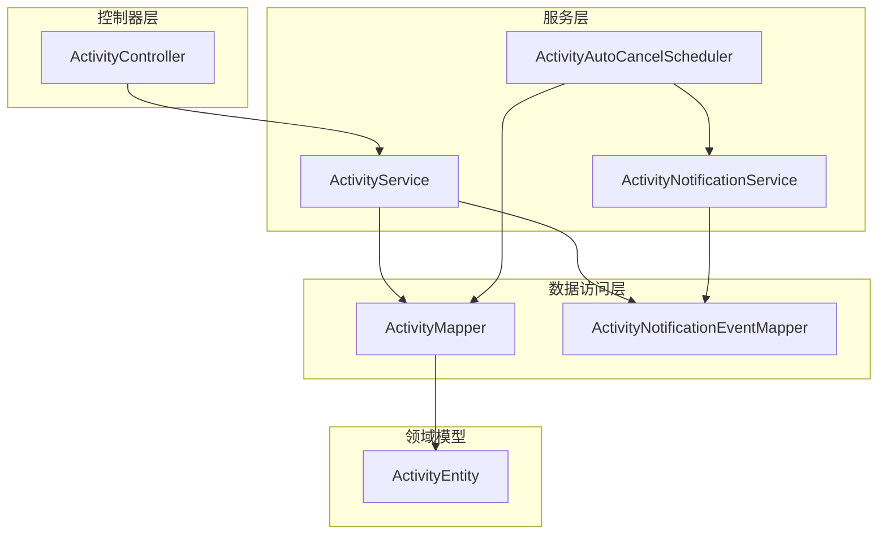
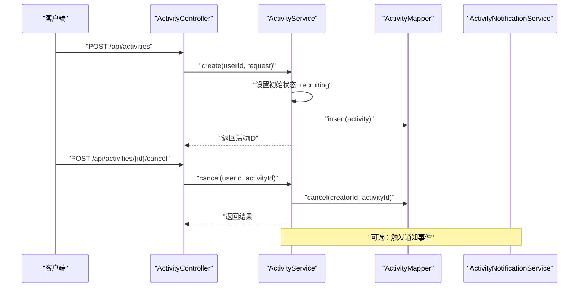
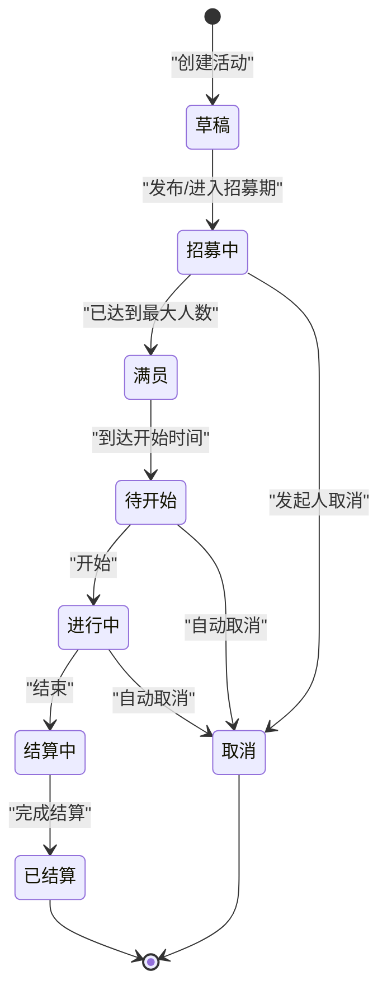
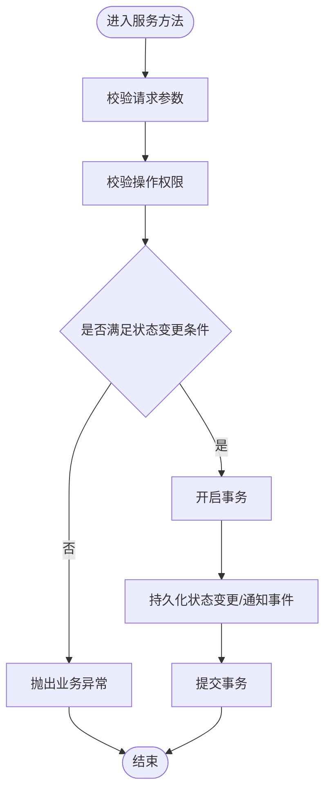
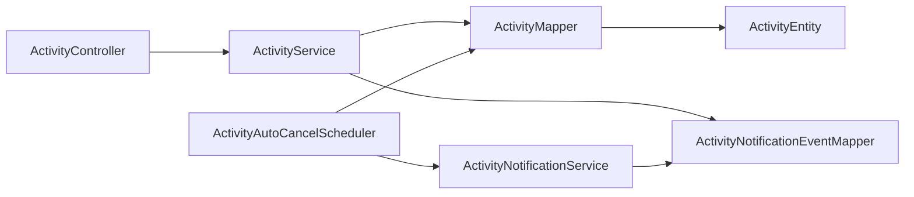

# 活动状态管理

<cite>
**本文引用的文件**
- [ActivityEntity.java](file://backend/src/main/java/com/playminipro/activity/entity/ActivityEntity.java)
- [ActivityMapper.java](file://backend/src/main/java/com/playminipro/activity/mapper/ActivityMapper.java)
- [ActivityService.java](file://backend/src/main/java/com/playminipro/activity/service/ActivityService.java)
- [ActivityAutoCancelScheduler.java](file://backend/src/main/java/com/playminipro/activity/service/ActivityAutoCancelScheduler.java)
- [ActivityNotificationService.java](file://backend/src/main/java/com/playminipro/activity/service/ActivityNotificationService.java)
- [ActivityNotificationEventMapper.java](file://backend/src/main/java/com/playminipro/activity/mapper/ActivityNotificationEventMapper.java)
- [ActivityController.java](file://backend/src/main/java/com/playminipro/activity/controller/ActivityController.java)
- [05-PostgreSQL建表.sql](file://doc/05-PostgreSQL建表.sql)
- [202606021041工程改进设计与调试说明.md](file://doc/改进文档/202606021041工程改进设计与调试说明.md)
</cite>

## 目录
1. [简介](#简介)
2. [项目结构](#项目结构)
3. [核心组件](#核心组件)
4. [架构总览](#架构总览)
5. [详细组件分析](#详细组件分析)
6. [依赖分析](#依赖分析)
7. [性能考虑](#性能考虑)
8. [故障排查指南](#故障排查指南)
9. [结论](#结论)
10. [附录](#附录)

## 简介
本文件聚焦于活动状态管理的技术实现，系统性梳理状态机设计、状态转换规则、触发条件、验证机制、持久化策略、监控与审计、异常处理与恢复回滚等关键主题。当前系统采用数据库枚举型状态字段与服务层状态控制相结合的方式，辅以定时调度器实现自动取消流程，并通过通知事件表实现状态变更的审计与后续推送。

## 项目结构
围绕活动状态管理的关键代码分布在以下模块：
- 实体与映射：活动实体、活动映射、通知事件映射
- 服务层：活动服务、自动取消调度器、通知服务
- 控制器：活动控制器（暴露创建、更新、取消等接口）
- 数据库：PostgreSQL 枚举类型定义与迁移脚本

图表来源
- [ActivityController.java:37-56](file://backend/src/main/java/com/playminipro/activity/controller/ActivityController.java#L37-L56)
- [ActivityService.java:41-93](file://backend/src/main/java/com/playminipro/activity/service/ActivityService.java#L41-L93)
- [ActivityAutoCancelScheduler.java:25-39](file://backend/src/main/java/com/playminipro/activity/service/ActivityAutoCancelScheduler.java#L25-L39)
- [ActivityNotificationService.java:25-69](file://backend/src/main/java/com/playminipro/activity/service/ActivityNotificationService.java#L25-L69)
- [ActivityMapper.java:63-92](file://backend/src/main/java/com/playminipro/activity/mapper/ActivityMapper.java#L63-L92)
- [ActivityNotificationEventMapper.java:12-53](file://backend/src/main/java/com/playminipro/activity/mapper/ActivityNotificationEventMapper.java#L12-L53)
- [ActivityEntity.java:21-21](file://backend/src/main/java/com/playminipro/activity/entity/ActivityEntity.java#L21-L21)

章节来源
- [ActivityController.java:37-56](file://backend/src/main/java/com/playminipro/activity/controller/ActivityController.java#L37-L56)
- [ActivityService.java:41-93](file://backend/src/main/java/com/playminipro/activity/service/ActivityService.java#L41-L93)
- [ActivityAutoCancelScheduler.java:25-39](file://backend/src/main/java/com/playminipro/activity/service/ActivityAutoCancelScheduler.java#L25-L39)
- [ActivityNotificationService.java:25-69](file://backend/src/main/java/com/playminipro/activity/service/ActivityNotificationService.java#L25-L69)
- [ActivityMapper.java:63-92](file://backend/src/main/java/com/playminipro/activity/mapper/ActivityMapper.java#L63-L92)
- [ActivityNotificationEventMapper.java:12-53](file://backend/src/main/java/com/playminipro/activity/mapper/ActivityNotificationEventMapper.java#L12-L53)
- [ActivityEntity.java:21-21](file://backend/src/main/java/com/playminipro/activity/entity/ActivityEntity.java#L21-L21)

## 核心组件
- 活动实体：承载活动状态字段及业务属性
- 活动映射：封装状态更新、自动取消、满员标记等数据库操作
- 活动服务：负责状态创建、更新、取消、请求校验与通知触发
- 自动取消调度器：基于固定周期扫描孤活动并触发状态变更与通知
- 通知服务：记录成员加入、自动取消提醒、自动取消等事件
- 通知事件映射：持久化通知事件并支持去重与状态更新

章节来源
- [ActivityEntity.java:21-21](file://backend/src/main/java/com/playminipro/activity/entity/ActivityEntity.java#L21-L21)
- [ActivityMapper.java:63-92](file://backend/src/main/java/com/playminipro/activity/mapper/ActivityMapper.java#L63-L92)
- [ActivityService.java:41-93](file://backend/src/main/java/com/playminipro/activity/service/ActivityService.java#L41-L93)
- [ActivityAutoCancelScheduler.java:25-39](file://backend/src/main/java/com/playminipro/activity/service/ActivityAutoCancelScheduler.java#L25-L39)
- [ActivityNotificationService.java:25-69](file://backend/src/main/java/com/playminipro/activity/service/ActivityNotificationService.java#L25-L69)
- [ActivityNotificationEventMapper.java:12-53](file://backend/src/main/java/com/playminipro/activity/mapper/ActivityNotificationEventMapper.java#L12-L53)

## 架构总览
活动状态管理由“控制器-服务-映射-实体-调度-通知”的链路构成，状态变更通过服务层统一入口进行，数据库层面通过枚举类型保障一致性，定时任务在服务层触发状态变更与通知落库。

图表来源
- [ActivityController.java:37-56](file://backend/src/main/java/com/playminipro/activity/controller/ActivityController.java#L37-L56)
- [ActivityService.java:41-93](file://backend/src/main/java/com/playminipro/activity/service/ActivityService.java#L41-L93)
- [ActivityMapper.java:63-92](file://backend/src/main/java/com/playminipro/activity/mapper/ActivityMapper.java#L63-L92)
- [ActivityNotificationService.java:25-69](file://backend/src/main/java/com/playminipro/activity/service/ActivityNotificationService.java#L25-L69)

## 详细组件分析

### 状态机设计与转换规则
- 状态枚举（数据库侧）：包含 draft、recruiting、full、pending_start、in_progress、finished、pending_settlement、settled、cancelled 等
- 初始状态：创建活动时设置为 recruiting
- 手动操作：
  - 发起人主动取消：调用取消接口，映射层将状态更新为 cancelled
- 自动调度：
  - 定时扫描孤活动（仅1名已加入成员且开始时间早于阈值），超过3小时则自动取消
  - 2.5小时窗口内仅记录一次“即将自动取消”提醒
- 系统事件：
  - 成员加入：记录 member_joined 通知事件
  - 自动取消：记录 auto_cancelled 通知事件

图表来源
- [05-PostgreSQL建表.sql:14-25](file://doc/05-PostgreSQL建表.sql#L14-L25)
- [ActivityService.java:46-46](file://backend/src/main/java/com/playminipro/activity/service/ActivityService.java#L46-L46)
- [ActivityMapper.java:63-92](file://backend/src/main/java/com/playminipro/activity/mapper/ActivityMapper.java#L63-L92)
- [ActivityAutoCancelScheduler.java:25-39](file://backend/src/main/java/com/playminipro/activity/service/ActivityAutoCancelScheduler.java#L25-L39)

章节来源
- [05-PostgreSQL建表.sql:14-25](file://doc/05-PostgreSQL建表.sql#L14-L25)
- [ActivityService.java:46-46](file://backend/src/main/java/com/playminipro/activity/service/ActivityService.java#L46-L46)
- [ActivityMapper.java:63-92](file://backend/src/main/java/com/playminipro/activity/mapper/ActivityMapper.java#L63-L92)
- [ActivityAutoCancelScheduler.java:25-39](file://backend/src/main/java/com/playminipro/activity/service/ActivityAutoCancelScheduler.java#L25-L39)

### 触发条件与转换来源
- 手动操作
  - 发起人取消：通过控制器接口触发服务层取消逻辑，映射层更新状态为 cancelled
- 自动调度
  - 定时任务扫描孤活动，根据开始时间与阈值判断是否记录提醒或执行自动取消
- 系统事件
  - 成员加入：服务层在成员加入后记录 member_joined 通知事件
  - 自动取消：调度器在满足条件时记录 auto_cancelled 通知事件

章节来源
- [ActivityController.java:50-54](file://backend/src/main/java/com/playminipro/activity/controller/ActivityController.java#L50-L54)
- [ActivityService.java:77-93](file://backend/src/main/java/com/playminipro/activity/service/ActivityService.java#L77-L93)
- [ActivityAutoCancelScheduler.java:25-39](file://backend/src/main/java/com/playminipro/activity/service/ActivityAutoCancelScheduler.java#L25-L39)
- [ActivityNotificationService.java:25-69](file://backend/src/main/java/com/playminipro/activity/service/ActivityNotificationService.java#L25-L69)

### 状态验证机制
- 请求参数校验：目标人数不得大于最大人数
- 权限校验：取消操作要求当前用户为活动创建者
- 并发安全：状态更新与通知落库均在事务中执行，避免中间态

图表来源
- [ActivityService.java:95-99](file://backend/src/main/java/com/playminipro/activity/service/ActivityService.java#L95-L99)
- [ActivityService.java:63-85](file://backend/src/main/java/com/playminipro/activity/service/ActivityService.java#L63-L85)
- [ActivityNotificationEventMapper.java:12-27](file://backend/src/main/java/com/playminipro/activity/mapper/ActivityNotificationEventMapper.java#L12-L27)

章节来源
- [ActivityService.java:95-99](file://backend/src/main/java/com/playminipro/activity/service/ActivityService.java#L95-L99)
- [ActivityService.java:63-85](file://backend/src/main/java/com/playminipro/activity/service/ActivityService.java#L63-L85)
- [ActivityNotificationEventMapper.java:12-27](file://backend/src/main/java/com/playminipro/activity/mapper/ActivityNotificationEventMapper.java#L12-L27)

### 状态持久化策略
- 状态字段设计：数据库定义枚举类型，确保状态值域一致
- 事务处理：服务层方法标注事务，保证状态与通知事件的一致性
- 并发安全：数据库层通过条件更新与唯一性约束（如通知事件去重）降低并发冲突风险

章节来源
- [05-PostgreSQL建表.sql:14-25](file://doc/05-PostgreSQL建表.sql#L14-L25)
- [ActivityService.java:41-93](file://backend/src/main/java/com/playminipro/activity/service/ActivityService.java#L41-L93)
- [ActivityNotificationEventMapper.java:38-45](file://backend/src/main/java/com/playminipro/activity/mapper/ActivityNotificationEventMapper.java#L38-L45)

### 监控与审计
- 通知事件表：记录事件类型、接收者、状态、创建与发送时间，支持按活动与事件类型检索
- 去重策略：针对自动取消提醒，按活动、接收者、事件类型去重，避免重复提醒
- 调试与追踪：通过 SQL 查询通知事件与活动状态，验证自动取消流程

章节来源
- [ActivityNotificationEventMapper.java:12-53](file://backend/src/main/java/com/playminipro/activity/mapper/ActivityNotificationEventMapper.java#L12-L53)
- [ActivityNotificationService.java:40-56](file://backend/src/main/java/com/playminipro/activity/service/ActivityNotificationService.java#L40-L56)
- [202606021041工程改进设计与调试说明.md:225-244](file://doc/改进文档/202606021041工程改进设计与调试说明.md#L225-L244)

### 异常状态处理与恢复回滚
- 异常处理：服务层捕获业务异常并返回统一错误码
- 回滚策略：事务方法在异常时自动回滚，确保状态与数据一致性
- 恢复机制：调度器定期扫描孤活动，若状态异常（如长时间处于待开始），可触发自动取消

章节来源
- [ActivityService.java:77-93](file://backend/src/main/java/com/playminipro/activity/service/ActivityService.java#L77-L93)
- [ActivityAutoCancelScheduler.java:25-39](file://backend/src/main/java/com/playminipro/activity/service/ActivityAutoCancelScheduler.java#L25-L39)

## 依赖分析
- 控制器依赖服务层；服务层依赖映射层与通知服务；调度器依赖映射层与通知服务；通知事件映射依赖数据库表
- 状态变更路径清晰，权限与事务贯穿关键流程

图表来源
- [ActivityController.java:31-35](file://backend/src/main/java/com/playminipro/activity/controller/ActivityController.java#L31-L35)
- [ActivityService.java:32-39](file://backend/src/main/java/com/playminipro/activity/service/ActivityService.java#L32-L39)
- [ActivityAutoCancelScheduler.java:16-19](file://backend/src/main/java/com/playminipro/activity/service/ActivityAutoCancelScheduler.java#L16-L19)
- [ActivityNotificationService.java:16-19](file://backend/src/main/java/com/playminipro/activity/service/ActivityNotificationService.java#L16-L19)
- [ActivityMapper.java:63-92](file://backend/src/main/java/com/playminipro/activity/mapper/ActivityMapper.java#L63-L92)
- [ActivityNotificationEventMapper.java:12-27](file://backend/src/main/java/com/playminipro/activity/mapper/ActivityNotificationEventMapper.java#L12-L27)
- [ActivityEntity.java:21-21](file://backend/src/main/java/com/playminipro/activity/entity/ActivityEntity.java#L21-L21)

章节来源
- [ActivityController.java:31-35](file://backend/src/main/java/com/playminipro/activity/controller/ActivityController.java#L31-L35)
- [ActivityService.java:32-39](file://backend/src/main/java/com/playminipro/activity/service/ActivityService.java#L32-L39)
- [ActivityAutoCancelScheduler.java:16-19](file://backend/src/main/java/com/playminipro/activity/service/ActivityAutoCancelScheduler.java#L16-L19)
- [ActivityNotificationService.java:16-19](file://backend/src/main/java/com/playminipro/activity/service/ActivityNotificationService.java#L16-L19)
- [ActivityMapper.java:63-92](file://backend/src/main/java/com/playminipro/activity/mapper/ActivityMapper.java#L63-L92)
- [ActivityNotificationEventMapper.java:12-27](file://backend/src/main/java/com/playminipro/activity/mapper/ActivityNotificationEventMapper.java#L12-L27)
- [ActivityEntity.java:21-21](file://backend/src/main/java/com/playminipro/activity/entity/ActivityEntity.java#L21-L21)

## 性能考虑
- 定时扫描频率：默认每5分钟扫描一次孤活动，可根据并发量调整
- 数据库索引：通知事件表按接收者与状态建立索引，提升查询效率
- 事务范围：将状态更新与通知落库置于同一事务，减少锁竞争与中间态

## 故障排查指南
- 自动取消未生效
  - 检查活动状态是否仍在允许取消范围内
  - 核对开始时间与当前时间差是否超过阈值
  - 查看通知事件表是否存在 auto_cancel_reminder/auto_cancelled
- 重复提醒
  - 确认通知事件去重逻辑是否生效
- 无法取消
  - 核对调用方是否为活动创建者
  - 检查接口返回与异常日志

章节来源
- [ActivityAutoCancelScheduler.java:25-39](file://backend/src/main/java/com/playminipro/activity/service/ActivityAutoCancelScheduler.java#L25-L39)
- [ActivityNotificationEventMapper.java:38-45](file://backend/src/main/java/com/playminipro/activity/mapper/ActivityNotificationEventMapper.java#L38-L45)
- [ActivityService.java:77-93](file://backend/src/main/java/com/playminipro/activity/service/ActivityService.java#L77-L93)
- [202606021041工程改进设计与调试说明.md:225-244](file://doc/改进文档/202606021041工程改进设计与调试说明.md#L225-L244)

## 结论
活动状态管理通过数据库枚举与服务层统一控制实现了清晰的状态流转，结合定时调度与通知事件表构建了完善的监控与审计能力。权限校验与事务保证了状态变更的安全性与一致性。未来可在通知推送、并发扩展等方面进一步增强。

## 附录
- 状态枚举定义参考数据库脚本
- 自动取消流程调试步骤参考改进文档

章节来源
- [05-PostgreSQL建表.sql:14-25](file://doc/05-PostgreSQL建表.sql#L14-L25)
- [202606021041工程改进设计与调试说明.md:53-61](file://doc/改进文档/202606021041工程改进设计与调试说明.md#L53-L61)