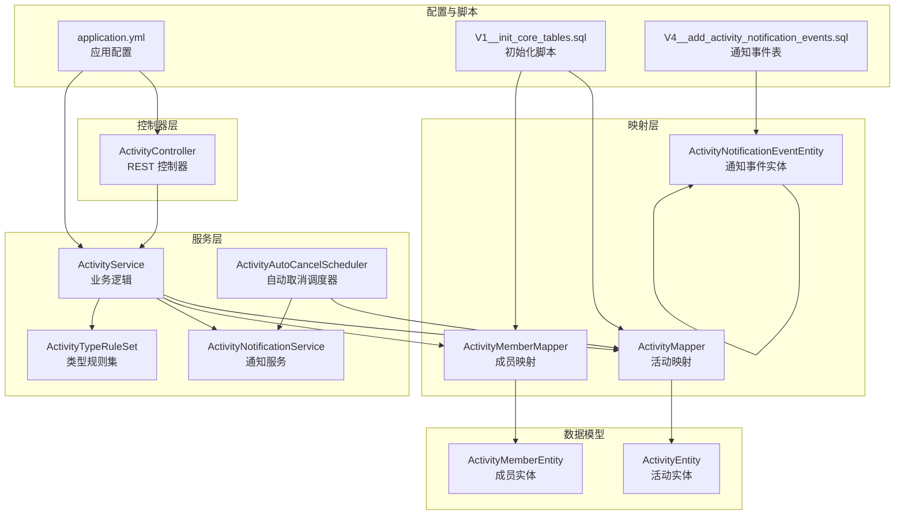
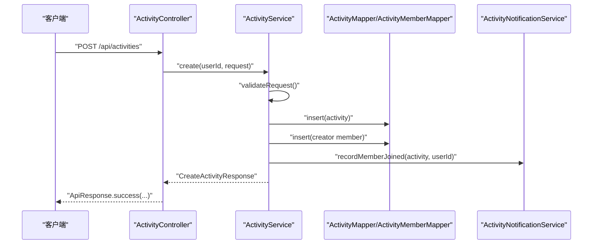
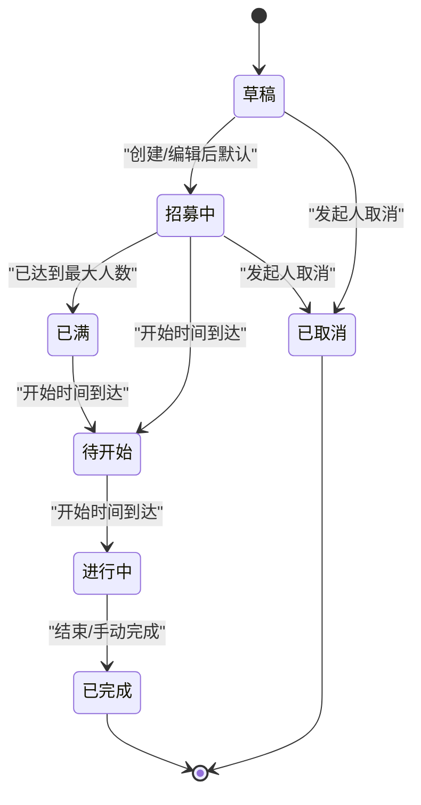
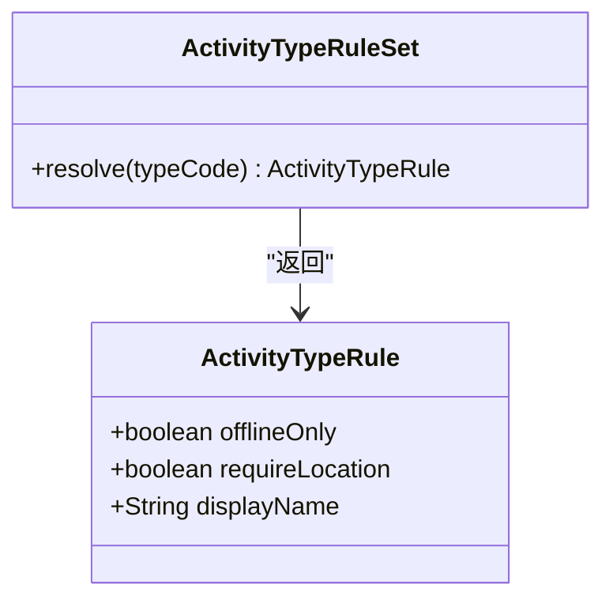
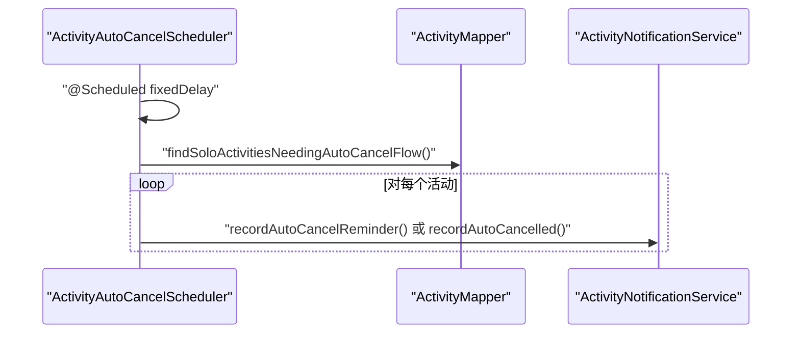
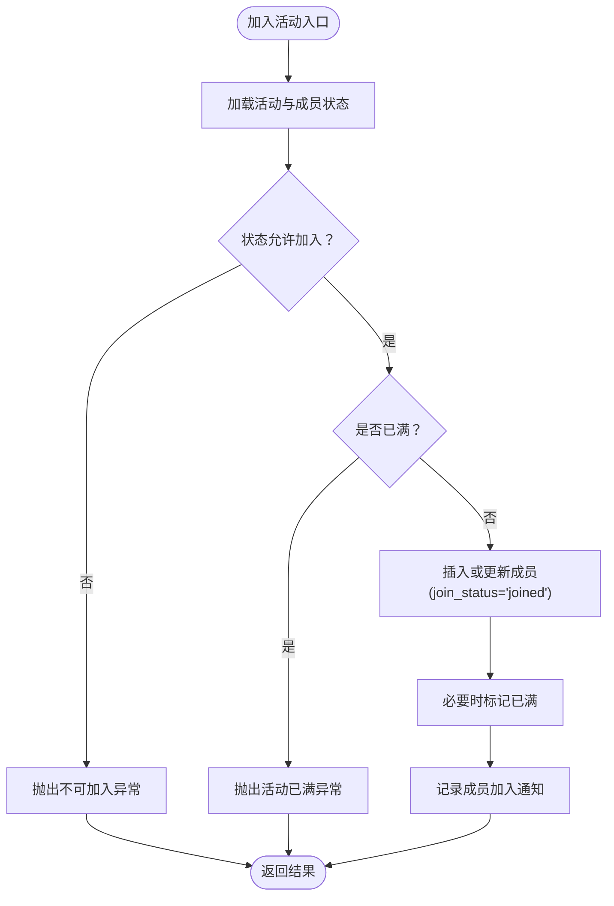
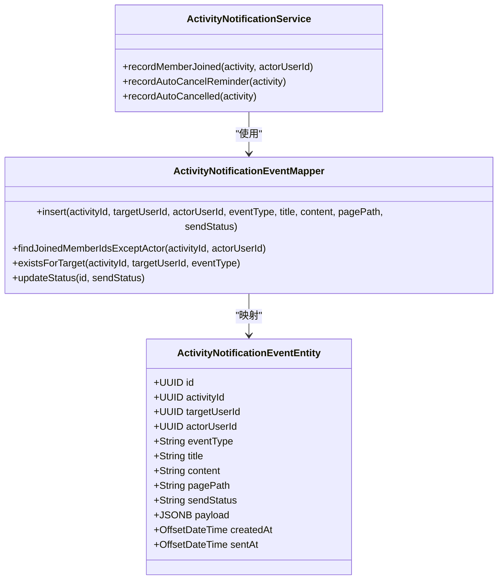
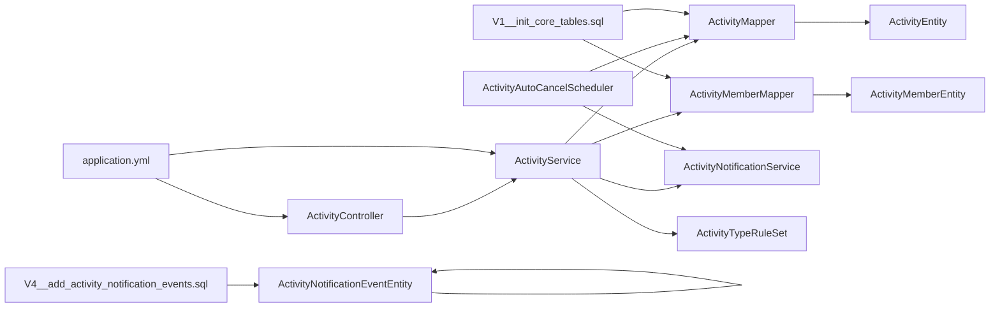
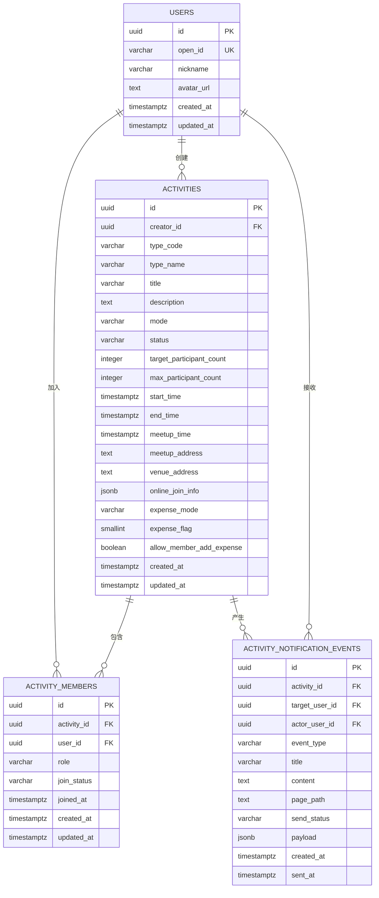

# 活动管理模块

<cite>
**本文引用的文件**
- [ActivityController.java](file://backend/src/main/java/com/playminipro/activity/controller/ActivityController.java)
- [ActivityService.java](file://backend/src/main/java/com/playminipro/activity/service/ActivityService.java)
- [ActivityTypeRuleSet.java](file://backend/src/main/java/com/playminipro/activity/service/ActivityTypeRuleSet.java)
- [ActivityAutoCancelScheduler.java](file://backend/src/main/java/com/playminipro/activity/service/ActivityAutoCancelScheduler.java)
- [ActivityNotificationService.java](file://backend/src/main/java/com/playminipro/activity/service/ActivityNotificationService.java)
- [ActivityNotificationEventMapper.java](file://backend/src/main/java/com/playminipro/activity/mapper/ActivityNotificationEventMapper.java)
- [ActivityMapper.java](file://backend/src/main/java/com/playminipro/activity/mapper/ActivityMapper.java)
- [ActivityMemberMapper.java](file://backend/src/main/java/com/playminipro/activity/mapper/ActivityMemberMapper.java)
- [ActivityEntity.java](file://backend/src/main/java/com/playminipro/activity/entity/ActivityEntity.java)
- [ActivityMemberEntity.java](file://backend/src/main/java/com/playminipro/activity/entity/ActivityMemberEntity.java)
- [CreateActivityRequest.java](file://backend/src/main/java/com/playminipro/activity/dto/CreateActivityRequest.java)
- [ActivityDetailResponse.java](file://backend/src/main/java/com/playminipro/activity/dto/ActivityDetailResponse.java)
- [ActivitySummaryResponse.java](file://backend/src/main/java/com/playminipro/activity/dto/ActivitySummaryResponse.java)
- [application.yml](file://backend/src/main/resources/application.yml)
- [V1__init_core_tables.sql](file://backend/src/main/resources/db/migration/V1__init_core_tables.sql)
- [V4__add_activity_notification_events.sql](file://backend/src/main/resources/db/migration/V4__add_activity_notification_events.sql)
</cite>

## 更新摘要
**所做更改**
- 新增完整通知事件系统集成章节，涵盖通知事件表结构、事件类型与状态管理
- 更新活动成员招募机制，增加邀请流程与成员状态管理
- 新增自动化活动管理系统章节，详细说明自动取消调度器的工作原理
- 更新API设计，增加邀请相关接口与通知事件查询接口
- 完善数据模型，新增活动通知事件实体与映射关系

## 目录
1. [简介](#简介)
2. [项目结构](#项目结构)
3. [核心组件](#核心组件)
4. [架构总览](#架构总览)
5. [详细组件分析](#详细组件分析)
6. [依赖关系分析](#依赖关系分析)
7. [性能考虑](#性能考虑)
8. [故障排查指南](#故障排查指南)
9. [结论](#结论)
10. [附录](#附录)

## 简介
本文件为"活动管理模块"的详细开发文档，覆盖活动生命周期管理（创建、编辑、取消、状态转换）、活动类型规则集设计、自动取消调度器实现、活动成员招募机制、通知事件系统集成、活动 CRUD API 设计与校验、以及搜索/分页/排序与性能优化方案。文档面向开发者与产品/测试人员，既提供代码级分析也提供概念性说明。

## 项目结构
活动管理模块位于后端 Java 工程的 activity 包下，采用分层架构：控制器层负责 API 入口与参数绑定；服务层承载业务规则与状态机；映射层封装数据库访问；实体与 DTO 描述数据模型与对外响应结构；配置文件定义应用与数据库初始化脚本。

**图表来源**
- [ActivityController.java:28-44](file://backend/src/main/java/com/playminipro/activity/controller/ActivityController.java#L28-L44)
- [ActivityService.java:21-39](file://backend/src/main/java/com/playminipro/activity/service/ActivityService.java#L21-L39)
- [ActivityAutoCancelScheduler.java:10-19](file://backend/src/main/java/com/playminipro/activity/service/ActivityAutoCancelScheduler.java#L10-L19)
- [ActivityNotificationService.java:9-19](file://backend/src/main/java/com/playminipro/activity/service/ActivityNotificationService.java#L9-L19)
- [ActivityNotificationEventMapper.java:9-54](file://backend/src/main/java/com/playminipro/activity/mapper/ActivityNotificationEventMapper.java#L9-L54)
- [ActivityMapper.java:13-29](file://backend/src/main/java/com/playminipro/activity/mapper/ActivityMapper.java#L13-L29)
- [ActivityMemberMapper.java:11-18](file://backend/src/main/java/com/playminipro/activity/mapper/ActivityMemberMapper.java#L11-L18)
- [ActivityEntity.java:5-48](file://backend/src/main/java/com/playminipro/activity/entity/ActivityEntity.java#L5-L48)
- [ActivityMemberEntity.java:3-24](file://backend/src/main/java/com/playminipro/activity/entity/ActivityMemberEntity.java#L3-L24)
- [application.yml:1-53](file://backend/src/main/resources/application.yml#L1-L53)
- [V1__init_core_tables.sql:12-58](file://backend/src/main/resources/db/migration/V1__init_core_tables.sql#L12-L58)
- [V4__add_activity_notification_events.sql:1-21](file://backend/src/main/resources/db/migration/V4__add_activity_notification_events.sql#L1-L21)

**章节来源**
- [ActivityController.java:28-44](file://backend/src/main/java/com/playminipro/activity/controller/ActivityController.java#L28-L44)
- [ActivityService.java:21-39](file://backend/src/main/java/com/playminipro/activity/service/ActivityService.java#L21-L39)
- [ActivityNotificationEventMapper.java:9-54](file://backend/src/main/java/com/playminipro/activity/mapper/ActivityNotificationEventMapper.java#L9-L54)
- [application.yml:1-53](file://backend/src/main/resources/application.yml#L1-L53)
- [V4__add_activity_notification_events.sql:1-21](file://backend/src/main/resources/db/migration/V4__add_activity_notification_events.sql#L1-L21)

## 核心组件
- **控制器层**：集中暴露活动相关 REST 接口，统一返回包装格式。
- **服务层**：实现业务规则、状态机转换、成员招募、通知记录与自动取消调度。
- **映射层**：MyBatis Mapper，封装活动与成员的增删改查及复杂查询。
- **数据模型**：实体类与 DTO，描述活动、成员与对外响应结构。
- **通知事件系统**：完整的事件记录与管理机制，支持多种事件类型与状态流转。
- **配置与脚本**：应用配置与数据库初始化迁移脚本。

**章节来源**
- [ActivityController.java:28-44](file://backend/src/main/java/com/playminipro/activity/controller/ActivityController.java#L28-L44)
- [ActivityService.java:21-39](file://backend/src/main/java/com/playminipro/activity/service/ActivityService.java#L21-L39)
- [ActivityNotificationService.java:9-70](file://backend/src/main/java/com/playminipro/activity/service/ActivityNotificationService.java#L9-L70)
- [ActivityNotificationEventMapper.java:9-54](file://backend/src/main/java/com/playminipro/activity/mapper/ActivityNotificationEventMapper.java#L9-L54)

## 架构总览
活动管理模块遵循典型的 MVC + 分层架构，控制器接收请求并调用服务层，服务层协调映射层与通知服务，最终持久化到 PostgreSQL 并通过 Redis 进行缓存或消息队列（由配置项体现）。数据库层面通过 Flyway 初始化核心表与索引，并在活动表上建立复合索引以支持常见查询。

**图表来源**
- [ActivityController.java:46-50](file://backend/src/main/java/com/playminipro/activity/controller/ActivityController.java#L46-L50)
- [ActivityService.java:41-58](file://backend/src/main/java/com/playminipro/activity/service/ActivityService.java#L41-L58)
- [ActivityNotificationService.java:25-35](file://backend/src/main/java/com/playminipro/activity/service/ActivityNotificationService.java#L25-L35)

## 详细组件分析

### 活动生命周期与状态机
活动状态包括草稿、招募中、已满、待开始、进行中、已完成、已取消。状态转换由服务层与映射层共同控制，确保业务一致性与原子性。

**图表来源**
- [ActivityMapper.java:72-94](file://backend/src/main/java/com/playminipro/activity/mapper/ActivityMapper.java#L72-L94)
- [ActivityMapper.java:86-86](file://backend/src/main/java/com/playminipro/activity/mapper/ActivityMapper.java#L86-L86)
- [ActivityMapper.java:96-104](file://backend/src/main/java/com/playminipro/activity/mapper/ActivityMapper.java#L96-L104)

**章节来源**
- [ActivityService.java:41-98](file://backend/src/main/java/com/playminipro/activity/service/ActivityService.java#L41-L98)
- [ActivityMapper.java:72-104](file://backend/src/main/java/com/playminipro/activity/mapper/ActivityMapper.java#L72-L104)

### 活动类型规则集
类型规则集用于约束活动模式与地点要求，例如某些类型仅限线下且必须填写地点。规则解析基于 typeCode，若未指定或未知则采用默认规则。

**图表来源**
- [ActivityTypeRuleSet.java:5-26](file://backend/src/main/java/com/playminipro/activity/service/ActivityTypeRuleSet.java#L5-L26)

**章节来源**
- [ActivityTypeRuleSet.java:5-26](file://backend/src/main/java/com/playminipro/activity/service/ActivityTypeRuleSet.java#L5-L26)
- [ActivityService.java:100-115](file://backend/src/main/java/com/playminipro/activity/service/ActivityService.java#L100-115)

### 自动化活动管理系统
自动化活动管理系统通过定时调度器扫描孤活动（仅发起人加入），在特定时间窗口内发送提醒或执行取消。系统包含完整的事件记录与状态管理机制。

**图表来源**
- [ActivityAutoCancelScheduler.java:25-39](file://backend/src/main/java/com/playminipro/activity/service/ActivityAutoCancelScheduler.java#L25-L39)
- [ActivityNotificationService.java:40-69](file://backend/src/main/java/com/playminipro/activity/service/ActivityNotificationService.java#L40-L69)

**章节来源**
- [ActivityAutoCancelScheduler.java:10-39](file://backend/src/main/java/com/playminipro/activity/service/ActivityAutoCancelScheduler.java#L10-L39)
- [ActivityNotificationService.java:9-69](file://backend/src/main/java/com/playminipro/activity/service/ActivityNotificationService.java#L9-L69)
- [ActivityMapper.java:206-221](file://backend/src/main/java/com/playminipro/activity/mapper/ActivityMapper.java#L206-L221)
- [application.yml:25-25](file://backend/src/main/resources/application.yml#L25-L25)

### 活动成员招募机制
成员招募包含加入与拒绝两种路径，加入时检查活动状态与人数上限，成功后记录通知事件并可能标记"已满"。拒绝仅更新成员状态。

**图表来源**
- [ActivityService.java:184-207](file://backend/src/main/java/com/playminipro/activity/service/ActivityService.java#L184-L207)
- [ActivityMemberMapper.java:20-29](file://backend/src/main/java/com/playminipro/activity/mapper/ActivityMemberMapper.java#L20-L29)

**章节来源**
- [ActivityService.java:184-217](file://backend/src/main/java/com/playminipro/activity/service/ActivityService.java#L184-L217)
- [ActivityMemberMapper.java:20-58](file://backend/src/main/java/com/playminipro/activity/mapper/ActivityMemberMapper.java#L20-L58)

### 通知事件系统集成
通知事件系统提供完整的事件记录与管理机制，支持多种事件类型与状态流转。系统包含事件表结构、事件类型定义、状态管理与去重机制。

**图表来源**
- [ActivityNotificationService.java:21-70](file://backend/src/main/java/com/playminipro/activity/service/ActivityNotificationService.java#L21-L70)
- [ActivityNotificationEventMapper.java:12-54](file://backend/src/main/java/com/playminipro/activity/mapper/ActivityNotificationEventMapper.java#L12-L54)

**章节来源**
- [ActivityNotificationService.java:21-70](file://backend/src/main/java/com/playminipro/activity/service/ActivityNotificationService.java#L21-L70)
- [ActivityNotificationEventMapper.java:12-54](file://backend/src/main/java/com/playminipro/activity/mapper/ActivityNotificationEventMapper.java#L12-L54)
- [V4__add_activity_notification_events.sql:1-21](file://backend/src/main/resources/db/migration/V4__add_activity_notification_events.sql#L1-L21)

### 活动 CRUD API 设计
控制器提供完整的活动 CRUD 与成员相关操作，所有请求均通过 Spring MVC 参数校验，响应统一包装为 ApiResponse。

- **创建活动**
  - 方法与路径：POST /api/activities
  - 请求体：CreateActivityRequest（含类型、标题、模式、时间、费用等字段）
  - 响应体：CreateActivityResponse（活动 ID）
  - 权限：登录用户
  - 校验：目标人数不得大于最大人数；根据类型规则限制模式与地点必填

- **编辑活动**
  - 方法与路径：PUT /api/activities/{id}
  - 请求体：CreateActivityRequest
  - 响应体：CreateActivityResponse
  - 权限：仅活动发起人

- **取消活动**
  - 方法与路径：POST /api/activities/{id}/cancel
  - 响应体：CreateActivityResponse
  - 权限：仅活动发起人

- **查询详情**
  - 方法与路径：GET /api/activities/{id}
  - 响应体：ActivityDetailResponse（含成员列表、是否可加入等）

- **成员相关**
  - 加入：POST /api/activities/{id}/join
  - 拒绝：POST /api/activities/{id}/decline

- **归档与个人报告**
  - 我的进行中：GET /api/activities/mine/ongoing
  - 我的归档：GET /api/activities/mine/archive
  - 个性报告：GET /api/activities/mine/personality-report

- **费用相关**
  - 费用汇总：GET /api/activities/{id}/expenses/summary
  - 添加费用：POST /api/activities/{id}/expenses
  - 完成活动：POST /api/activities/{id}/finish

**章节来源**
- [ActivityController.java:46-114](file://backend/src/main/java/com/playminipro/activity/controller/ActivityController.java#L46-L114)
- [CreateActivityRequest.java:12-30](file://backend/src/main/java/com/playminipro/activity/dto/CreateActivityRequest.java#L12-L30)
- [ActivityDetailResponse.java:6-30](file://backend/src/main/java/com/playminipro/activity/dto/ActivityDetailResponse.java#L6-L30)

### 搜索、分页、排序与性能优化
- **搜索与筛选**
  - 我的进行中：按用户过滤，状态集合限定，按开始时间升序。
  - 我的归档：按用户过滤，排除已取消，按创建/加入时间降序。
- **分页**
  - 当前实现未显式分页参数，如需扩展可在控制器增加分页参数并在 Mapper 中实现分页查询。
- **排序**
  - 进行中列表按开始时间升序；归档列表按角色时间/加入时间降序。
- **性能优化建议**
  - 为 activities 表的 creator_id+status、start_time 建立复合索引（已有）。
  - 为 activity_members 的 user_id+join_status、activity_id+join_status 建立索引（已有）。
  - 为 activity_notification_events 的 target_user_id+send_status、activity_id+event_type 建立索引（新增）。
  - 对高频查询（如详情、成员列表）使用 JOIN 与 LIMIT 控制结果集大小。
  - 合理拆分查询：详情与成员列表可分离为独立查询以降低单次查询复杂度。

**章节来源**
- [ActivityMapper.java:106-158](file://backend/src/main/java/com/playminipro/activity/mapper/ActivityMapper.java#L106-L158)
- [V1__init_core_tables.sql:40-58](file://backend/src/main/resources/db/migration/V1__init_core_tables.sql#L40-L58)
- [V4__add_activity_notification_events.sql:17-21](file://backend/src/main/resources/db/migration/V4__add_activity_notification_events.sql#L17-L21)

## 依赖关系分析
- 控制器依赖服务层；服务层依赖映射层、通知服务与类型规则集。
- 映射层依赖实体类；实体类映射至数据库表。
- 通知事件系统独立于核心业务，通过事件映射器与数据库交互。
- 应用配置驱动数据源、Redis、调度器扫描间隔等运行时行为。

**图表来源**
- [ActivityController.java:32-44](file://backend/src/main/java/com/playminipro/activity/controller/ActivityController.java#L32-L44)
- [ActivityService.java:23-39](file://backend/src/main/java/com/playminipro/activity/service/ActivityService.java#L23-L39)
- [ActivityAutoCancelScheduler.java:12-19](file://backend/src/main/java/com/playminipro/activity/service/ActivityAutoCancelScheduler.java#L12-L19)
- [ActivityNotificationEventMapper.java:9-54](file://backend/src/main/java/com/playminipro/activity/mapper/ActivityNotificationEventMapper.java#L9-L54)
- [ActivityEntity.java:5-48](file://backend/src/main/java/com/playminipro/activity/entity/ActivityEntity.java#L5-L48)
- [ActivityMemberEntity.java:3-24](file://backend/src/main/java/com/playminipro/activity/entity/ActivityMemberEntity.java#L3-L24)
- [application.yml:1-53](file://backend/src/main/resources/application.yml#L1-L53)
- [V1__init_core_tables.sql:12-58](file://backend/src/main/resources/db/migration/V1__init_core_tables.sql#L12-L58)
- [V4__add_activity_notification_events.sql:1-21](file://backend/src/main/resources/db/migration/V4__add_activity_notification_events.sql#L1-L21)

## 性能考虑
- **数据库层面**
  - 利用现有索引：creator_id+status、start_time、user_id+join_status、activity_id+join_status。
  - 新增通知事件索引：target_user_id+send_status、activity_id+event_type。
  - 使用 LIMIT 与分页避免大结果集。
  - 复杂聚合查询（如归档统计）建议拆分为多步查询或物化视图。
- **应用层面**
  - 批量写入/更新时尽量合并事务，减少往返。
  - 对热点数据（如活动详情）可结合 Redis 缓存，注意缓存失效策略。
  - 通知事件采用异步处理，避免阻塞主业务流程。
- **定时任务**
  - 调度间隔可配置，默认 5 分钟扫描一次，可根据业务量调整。
  - 通知事件去重机制避免重复发送。

**章节来源**
- [V1__init_core_tables.sql:40-58](file://backend/src/main/resources/db/migration/V1__init_core_tables.sql#L40-L58)
- [V4__add_activity_notification_events.sql:17-21](file://backend/src/main/resources/db/migration/V4__add_activity_notification_events.sql#L17-L21)
- [ActivityAutoCancelScheduler.java:25-25](file://backend/src/main/java/com/playminipro/activity/service/ActivityAutoCancelScheduler.java#L25-L25)
- [application.yml:25-25](file://backend/src/main/resources/application.yml#L25-L25)

## 故障排查指南
- **常见业务异常**
  - 活动不存在：在编辑、取消、详情、加入等场景中，若活动不存在抛出相应异常。
  - 权限不足：仅活动发起人可编辑/取消。
  - 不可加入：非招募中或已满状态无法加入。
  - 类型规则不满足：线下类型必须填写地点，模式需符合类型规则。
- **通知事件异常**
  - 事件重复：系统内置去重机制，避免同一事件重复发送。
  - 事件丢失：检查数据库连接与事务配置，确认事件表存在且可写。
  - 发送失败：通知服务支持失败重试机制，可在配置中调整重试策略。
- **日志与监控**
  - 应用日志级别已在配置中设置，便于定位问题。
  - 定时任务扫描失败或异常可在通知服务中查看事件记录。
- **数据一致性**
  - 所有写操作使用事务，确保状态变更与成员变更原子性。
  - 自动取消仅作用于特定状态与时间窗口内的孤活动。
  - 通知事件与业务操作在同一事务中提交，保证一致性。

**章节来源**
- [ActivityService.java:64-95](file://backend/src/main/java/com/playminipro/activity/service/ActivityService.java#L64-L95)
- [ActivityService.java:184-217](file://backend/src/main/java/com/playminipro/activity/service/ActivityService.java#L184-L217)
- [ActivityService.java:100-115](file://backend/src/main/java/com/playminipro/activity/service/ActivityService.java#L100-115)
- [ActivityNotificationService.java:21-69](file://backend/src/main/java/com/playminipro/activity/service/ActivityNotificationService.java#L21-L69)
- [application.yml:51-53](file://backend/src/main/resources/application.yml#L51-L53)

## 结论
活动管理模块通过清晰的分层设计与严格的业务规则实现了完整的生命周期管理。类型规则集提供了可扩展的规则引擎基础，自动取消调度器保障了孤活动的治理，成员招募机制与通知服务完善了社交闭环。新增的通知事件系统为未来的微信订阅消息推送奠定了基础，支持多种事件类型与状态管理。建议后续在查询性能与分页能力上进一步增强，并完善费用结算与账单模块的集成。

## 附录

### 数据模型与约束

**图表来源**
- [V1__init_core_tables.sql:12-58](file://backend/src/main/resources/db/migration/V1__init_core_tables.sql#L12-L58)
- [V4__add_activity_notification_events.sql:1-21](file://backend/src/main/resources/db/migration/V4__add_activity_notification_events.sql#L1-L21)

### 通知事件类型定义
- **member_joined**：新成员加入活动
- **auto_cancel_reminder**：自动取消提醒（半小时前）
- **auto_cancelled**：活动已自动取消

**章节来源**
- [ActivityNotificationService.java:25-69](file://backend/src/main/java/com/playminipro/activity/service/ActivityNotificationService.java#L25-L69)
- [ActivityNotificationEventMapper.java:38-45](file://backend/src/main/java/com/playminipro/activity/mapper/ActivityNotificationEventMapper.java#L38-L45)