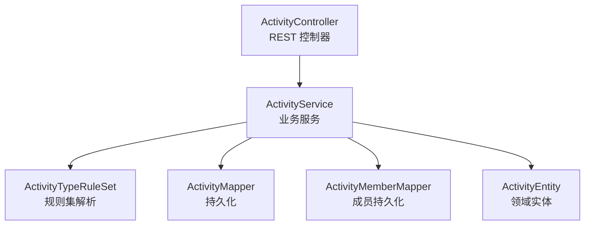
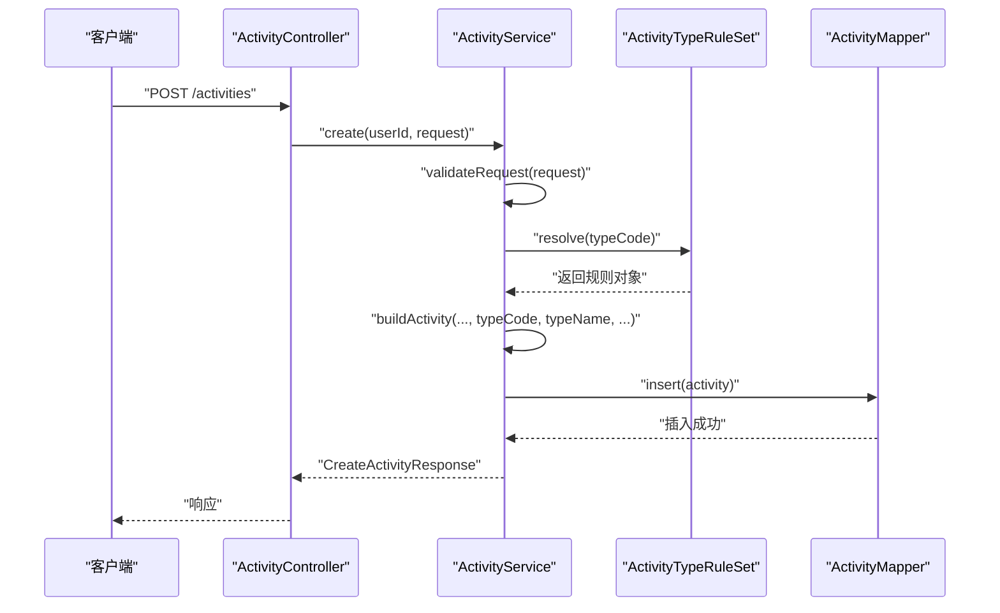
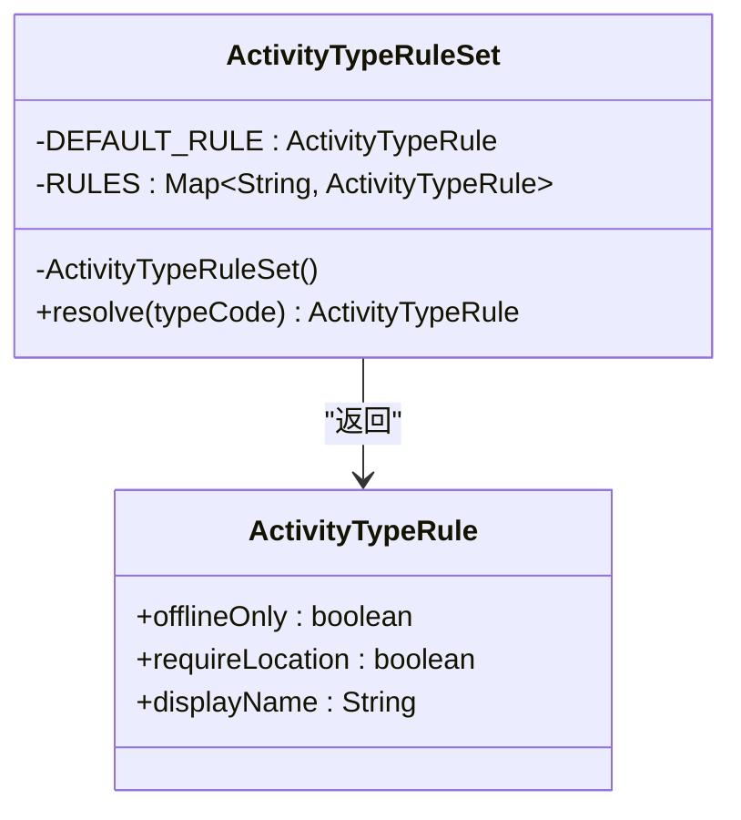
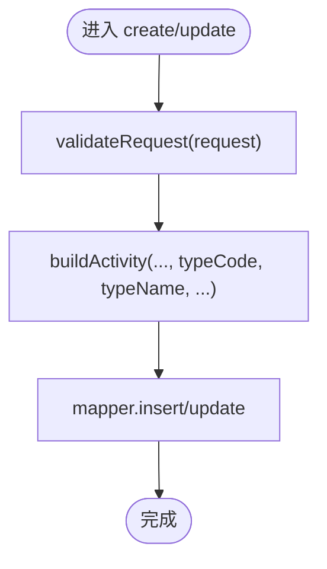
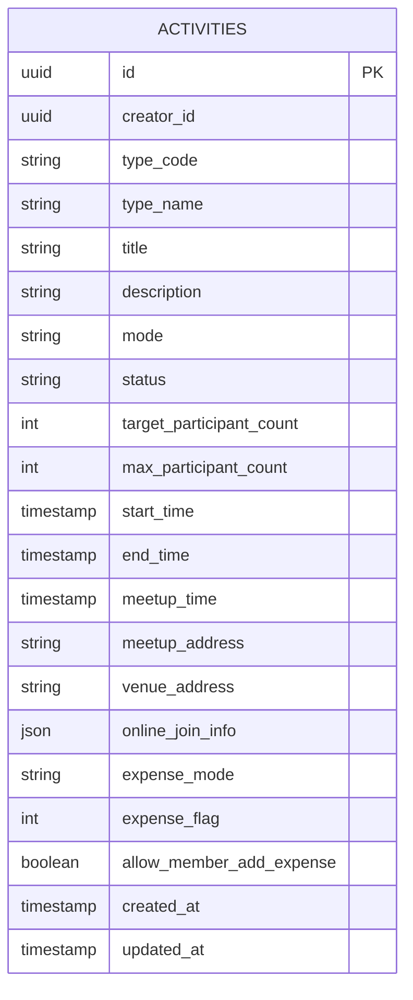
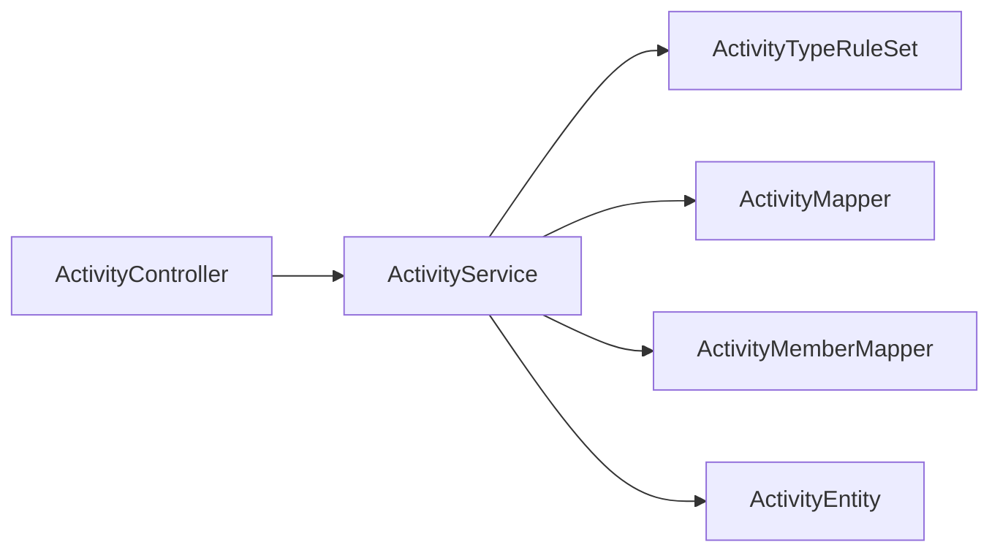

# 活动类型规则集

<cite>
**本文引用的文件**
- [ActivityTypeRuleSet.java](file://backend/src/main/java/com/playminipro/activity/service/ActivityTypeRuleSet.java)
- [ActivityService.java](file://backend/src/main/java/com/playminipro/activity/service/ActivityService.java)
- [ActivityEntity.java](file://backend/src/main/java/com/playminipro/activity/entity/ActivityEntity.java)
- [ActivityMapper.java](file://backend/src/main/java/com/playminipro/activity/mapper/ActivityMapper.java)
- [ActivityMemberMapper.java](file://backend/src/main/java/com/playminipro/activity/mapper/ActivityMemberMapper.java)
- [ActivityController.java](file://backend/src/main/java/com/playminipro/activity/controller/ActivityController.java)
- [CreateActivityRequest.java](file://backend/src/main/java/com/playminipro/activity/dto/CreateActivityRequest.java)
- [CreateActivityResponse.java](file://backend/src/main/java/com/playminipro/activity/dto/CreateActivityResponse.java)
- [ActivityAutoCancelScheduler.java](file://backend/src/main/java/com/playminipro/activity/service/ActivityAutoCancelScheduler.java)
</cite>

## 目录
1. [简介](#简介)
2. [项目结构](#项目结构)
3. [核心组件](#核心组件)
4. [架构总览](#架构总览)
5. [详细组件分析](#详细组件分析)
6. [依赖关系分析](#依赖关系分析)
7. [性能考虑](#性能考虑)
8. [故障排查指南](#故障排查指南)
9. [结论](#结论)
10. [附录](#附录)

## 简介
本文件围绕“活动类型规则集”展开，系统化梳理 ActivityTypeRuleSet 的设计与实现，解释其在活动生命周期中的作用边界、与服务层的协作方式、以及可扩展性与性能优化策略。当前仓库中，活动类型规则集以静态规则映射的形式存在，用于根据活动类型代码（typeCode）解析出该类型的业务规则（如是否仅线下、是否需要定位等），并为后续的权限控制、状态约束与前端展示提供依据。

## 项目结构
活动类型规则集位于活动域的服务层，与控制器、实体、映射器、服务实现共同构成完整的活动功能模块。下图展示了与“活动类型规则集”直接相关的组件与交互关系：

图表来源
- [ActivityController.java:37-54](file://backend/src/main/java/com/playminipro/activity/controller/ActivityController.java#L37-L54)
- [ActivityService.java:41-58](file://backend/src/main/java/com/playminipro/activity/service/ActivityService.java#L41-L58)
- [ActivityTypeRuleSet.java:17-22](file://backend/src/main/java/com/playminipro/activity/service/ActivityTypeRuleSet.java#L17-L22)
- [ActivityMapper.java:55-68](file://backend/src/main/java/com/playminipro/activity/mapper/ActivityMapper.java#L55-L68)
- [ActivityMemberMapper.java:14-18](file://backend/src/main/java/com/playminipro/activity/mapper/ActivityMemberMapper.java#L14-L18)
- [ActivityEntity.java:11-13](file://backend/src/main/java/com/playminipro/activity/entity/ActivityEntity.java#L11-L13)

章节来源
- [ActivityController.java:37-54](file://backend/src/main/java/com/playminipro/activity/controller/ActivityController.java#L37-L54)
- [ActivityService.java:41-58](file://backend/src/main/java/com/playminipro/activity/service/ActivityService.java#L41-L58)
- [ActivityTypeRuleSet.java:17-22](file://backend/src/main/java/com/playminipro/activity/service/ActivityTypeRuleSet.java#L17-L22)

## 核心组件
- 规则集解析器：负责根据活动类型代码解析出对应的规则对象，包含默认规则与已知类型规则映射。
- 规则数据模型：使用 Java 记录类封装规则字段（是否仅线下、是否需要定位、显示名）。
- 服务层集成点：服务层在创建/更新活动时，从请求中提取 typeCode，并调用规则集解析器获取规则，作为后续流程的输入。
- 实体与映射：活动实体保存 typeCode 与 typeName；映射器负责持久化与查询。

章节来源
- [ActivityTypeRuleSet.java:5-26](file://backend/src/main/java/com/playminipro/activity/service/ActivityTypeRuleSet.java#L5-L26)
- [ActivityService.java:101-119](file://backend/src/main/java/com/playminipro/activity/service/ActivityService.java#L101-L119)
- [ActivityEntity.java:11-13](file://backend/src/main/java/com/playminipro/activity/entity/ActivityEntity.java#L11-L13)
- [ActivityMapper.java:55-68](file://backend/src/main/java/com/playminipro/activity/mapper/ActivityMapper.java#L55-L68)

## 架构总览
活动类型规则集在整个活动生命周期中的位置如下：

图表来源
- [ActivityController.java:37-41](file://backend/src/main/java/com/playminipro/activity/controller/ActivityController.java#L37-L41)
- [ActivityService.java:41-58](file://backend/src/main/java/com/playminipro/activity/service/ActivityService.java#L41-L58)
- [ActivityTypeRuleSet.java:17-22](file://backend/src/main/java/com/playminipro/activity/service/ActivityTypeRuleSet.java#L17-L22)
- [ActivityMapper.java:55-59](file://backend/src/main/java/com/playminipro/activity/mapper/ActivityMapper.java#L55-L59)

## 详细组件分析

### 规则集解析器（ActivityTypeRuleSet）
- 设计要点
  - 使用不可变的静态规则映射，键为活动类型代码字符串，值为规则记录对象。
  - 提供默认规则，当传入空或空白类型代码时返回默认规则。
  - 解析方法采用 O(1) 哈希查找，具备良好性能。
- 数据结构与复杂度
  - 规则映射为常量初始化，解析为 O(1) 查找。
  - 规则记录类包含布尔标志位与显示名，占用空间小，拷贝成本低。
- 错误处理
  - 对空/空白类型代码进行显式分支，避免 NPE 并保证稳定行为。
- 可扩展性
  - 当前为静态映射，新增类型需修改源码并重新编译；可通过引入外部配置或 SPI 扩展。

图表来源
- [ActivityTypeRuleSet.java:5-26](file://backend/src/main/java/com/playminipro/activity/service/ActivityTypeRuleSet.java#L5-L26)

章节来源
- [ActivityTypeRuleSet.java:5-26](file://backend/src/main/java/com/playminipro/activity/service/ActivityTypeRuleSet.java#L5-L26)

### 服务层集成点（ActivityService）
- 创建与更新流程
  - 在创建/更新活动前进行通用参数校验。
  - 从请求中提取 typeCode 与 typeName，并写入活动实体。
  - 创建流程设置初始状态为“招募中”，并自动成为创建者。
- 与规则集的关系
  - 服务层通过解析 typeCode 获取规则，作为后续流程的输入；当前仓库未见服务层直接使用规则进行权限或状态约束的逻辑，但规则已作为输入准备。
- 权限控制
  - 更新与取消操作会校验当前用户是否为活动创建者，违反则抛出业务异常。

图表来源
- [ActivityService.java:41-58](file://backend/src/main/java/com/playminipro/activity/service/ActivityService.java#L41-L58)
- [ActivityService.java:60-93](file://backend/src/main/java/com/playminipro/activity/service/ActivityService.java#L60-L93)

章节来源
- [ActivityService.java:41-93](file://backend/src/main/java/com/playminipro/activity/service/ActivityService.java#L41-L93)
- [ActivityService.java:101-119](file://backend/src/main/java/com/playminipro/activity/service/ActivityService.java#L101-L119)

### 实体与映射（ActivityEntity 与 ActivityMapper）
- 实体字段
  - 保存 typeCode 与 typeName，便于后续规则解析与展示。
- 映射器职责
  - 提供插入、更新、取消、完成等操作的 SQL 映射。
  - 提供自动取消调度相关的查询，用于定时任务扫描长时间无人参与的活动。

图表来源
- [ActivityEntity.java:7-47](file://backend/src/main/java/com/playminipro/activity/entity/ActivityEntity.java#L7-L47)
- [ActivityMapper.java:55-78](file://backend/src/main/java/com/playminipro/activity/mapper/ActivityMapper.java#L55-L78)

章节来源
- [ActivityEntity.java:11-13](file://backend/src/main/java/com/playminipro/activity/entity/ActivityEntity.java#L11-L13)
- [ActivityMapper.java:55-78](file://backend/src/main/java/com/playminipro/activity/mapper/ActivityMapper.java#L55-L78)
- [ActivityMapper.java:208-222](file://backend/src/main/java/com/playminipro/activity/mapper/ActivityMapper.java#L208-L222)

### 自动取消调度（ActivityAutoCancelScheduler）
- 功能概述
  - 定时扫描满足条件的单人活动（仅创建者加入），若超过阈值时间未有其他成员加入，则触发自动取消流程。
- 规则集关联
  - 当前实现基于活动状态与成员数量判断，未直接使用活动类型规则；未来可结合规则集对不同类型的活动设定差异化的时间阈值或策略。

章节来源
- [ActivityAutoCancelScheduler.java](file://backend/src/main/java/com/playminipro/activity/service/ActivityAutoCancelScheduler.java)

## 依赖关系分析
- 组件耦合
  - ActivityService 依赖 ActivityTypeRuleSet 进行类型规则解析；依赖 ActivityMapper 与 ActivityMemberMapper 进行持久化。
  - ActivityController 仅通过 ActivityService 调用业务能力，不直接依赖规则集。
- 外部依赖
  - MyBatis 注解驱动的映射器访问数据库。
  - Spring MVC 控制器接收请求并返回统一响应包装。

图表来源
- [ActivityController.java:31-35](file://backend/src/main/java/com/playminipro/activity/controller/ActivityController.java#L31-L35)
- [ActivityService.java:32-39](file://backend/src/main/java/com/playminipro/activity/service/ActivityService.java#L32-L39)
- [ActivityTypeRuleSet.java:5-26](file://backend/src/main/java/com/playminipro/activity/service/ActivityTypeRuleSet.java#L5-L26)
- [ActivityMapper.java:55-68](file://backend/src/main/java/com/playminipro/activity/mapper/ActivityMapper.java#L55-L68)
- [ActivityMemberMapper.java:14-18](file://backend/src/main/java/com/playminipro/activity/mapper/ActivityMemberMapper.java#L14-L18)

章节来源
- [ActivityController.java:31-35](file://backend/src/main/java/com/playminipro/activity/controller/ActivityController.java#L31-L35)
- [ActivityService.java:32-39](file://backend/src/main/java/com/playminipro/activity/service/ActivityService.java#L32-L39)

## 性能考虑
- 规则解析性能
  - 规则集采用静态不可变映射与哈希查找，解析为 O(1)，开销极低。
- 缓存策略建议
  - 当前规则集为 JVM 内存常量，无需额外缓存。
  - 若规则来源来自外部配置，可在服务启动时加载并缓存，避免重复解析。
- 数据库访问
  - 映射器使用注解 SQL，建议在高频查询上建立合适索引（如按状态、开始时间、创建者等）以提升扫描效率。
- 定时任务
  - 自动取消调度应合理设置扫描周期，避免频繁全表扫描；可结合分页或游标策略降低负载。

## 故障排查指南
- 类型代码为空或空白
  - 现象：返回默认规则，可能导致后续流程不符合预期。
  - 排查：检查请求参数 typeCode 是否正确传递；服务层在构建实体时会写入该字段。
- 权限相关错误
  - 现象：更新或取消活动时报错“禁止访问”。
  - 排查：确认当前用户是否为活动创建者；服务层在更新与取消前会进行校验。
- 参数校验失败
  - 现象：创建/更新时报错“目标人数不得大于最大人数”。
  - 排查：检查请求中的目标人数与最大人数关系，确保满足约束。
- 自动取消未生效
  - 现象：单人活动长时间无人加入未被取消。
  - 排查：确认调度任务是否运行、扫描条件是否匹配、活动状态是否处于允许取消的状态。

章节来源
- [ActivityService.java:63-93](file://backend/src/main/java/com/playminipro/activity/service/ActivityService.java#L63-L93)
- [ActivityService.java:95-98](file://backend/src/main/java/com/playminipro/activity/service/ActivityService.java#L95-L98)
- [ActivityMapper.java:208-222](file://backend/src/main/java/com/playminipro/activity/mapper/ActivityMapper.java#L208-L222)

## 结论
当前活动类型规则集以静态映射形式提供基础的类型规则解析能力，满足创建/更新流程对 typeCode 的使用需求。服务层尚未直接利用规则进行权限与状态约束，但规则已作为输入准备，为后续扩展提供了清晰的接入点。建议在保持现有解析性能的基础上，逐步将规则纳入权限与状态控制流程，并引入可配置的规则来源以增强扩展性与可维护性。

## 附录
- 关键 DTO 与响应
  - 请求体：CreateActivityRequest（包含 typeCode、typeName、标题、描述、模式、人数、时间、地址、费用模式与标记等）
  - 响应体：CreateActivityResponse（包含活动 ID）

章节来源
- [CreateActivityRequest.java](file://backend/src/main/java/com/playminipro/activity/dto/CreateActivityRequest.java)
- [CreateActivityResponse.java](file://backend/src/main/java/com/playminipro/activity/dto/CreateActivityResponse.java)