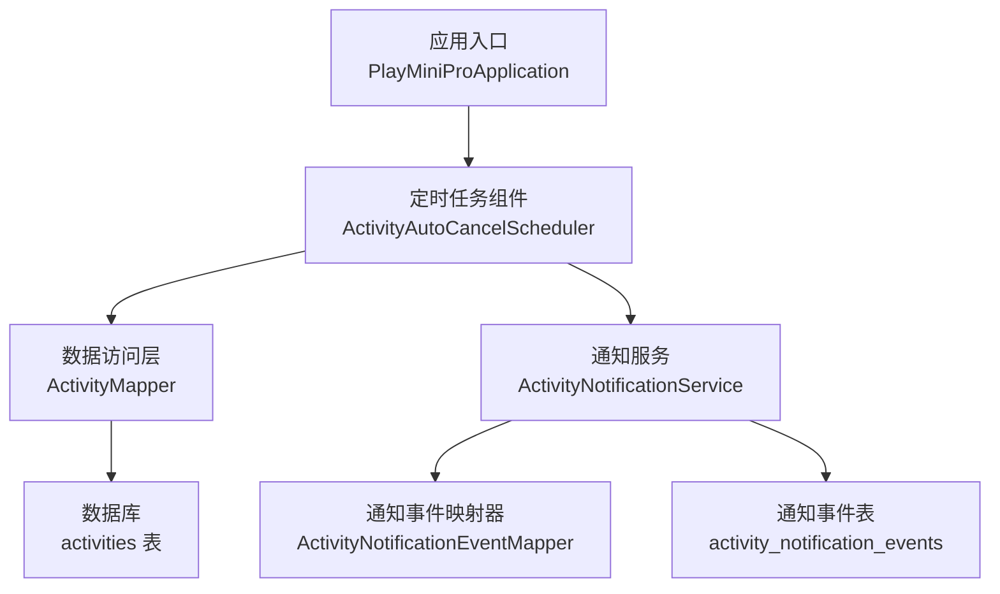
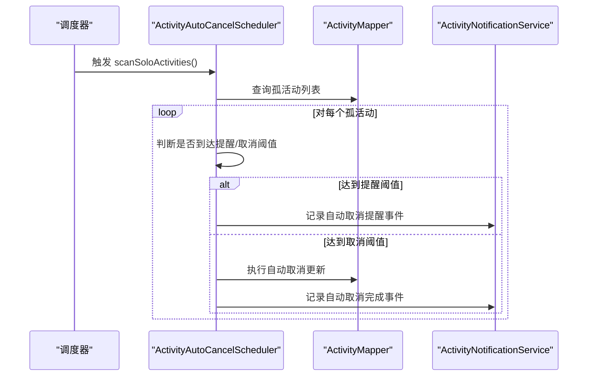
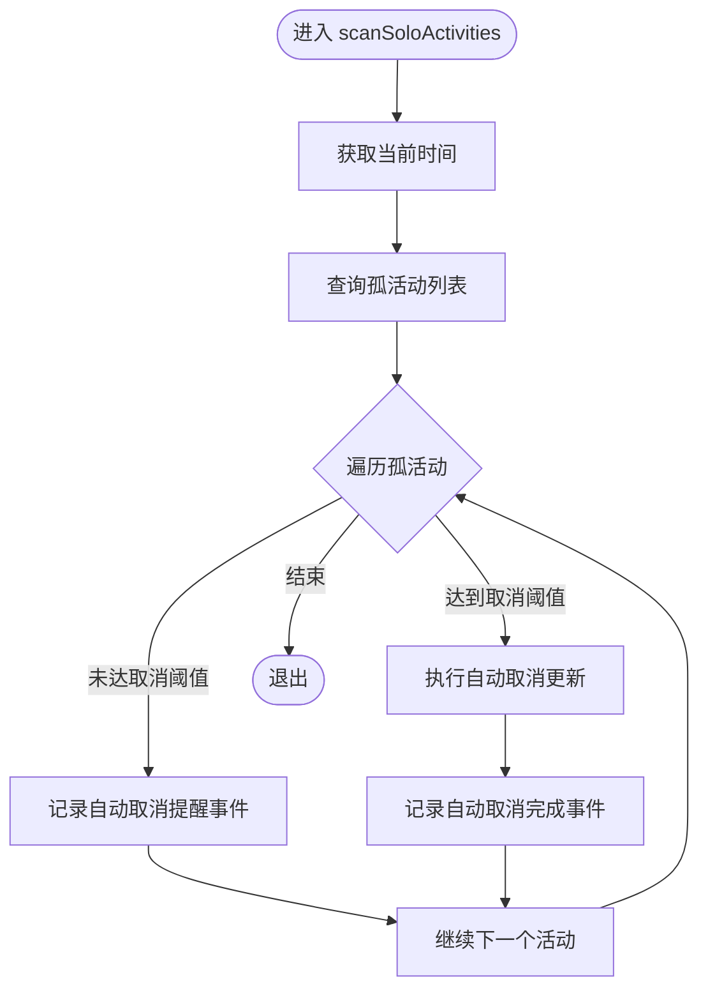
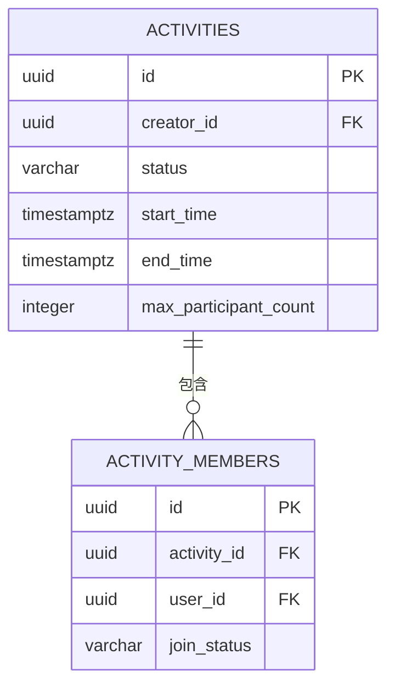
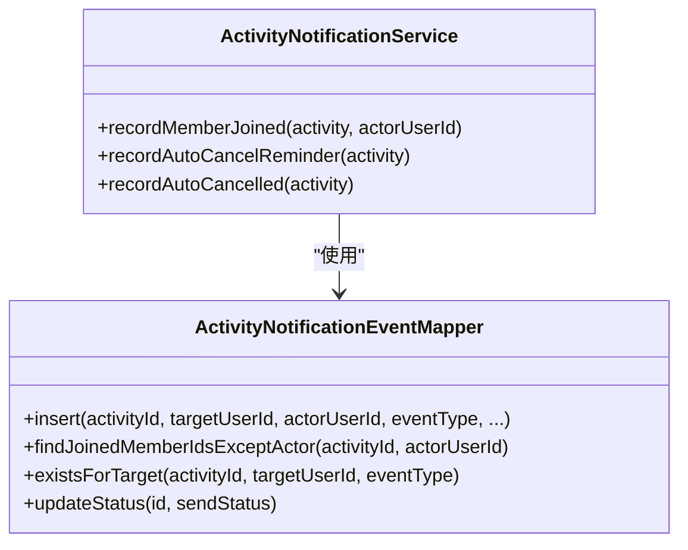
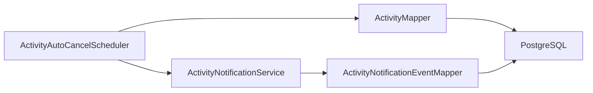

# 自动取消调度器

<cite>
**本文档引用的文件**
- [ActivityAutoCancelScheduler.java](file://backend/src/main/java/com/playminipro/activity/service/ActivityAutoCancelScheduler.java)
- [ActivityNotificationService.java](file://backend/src/main/java/com/playminipro/activity/service/ActivityNotificationService.java)
- [ActivityMapper.java](file://backend/src/main/java/com/playminipro/activity/mapper/ActivityMapper.java)
- [ActivityNotificationEventMapper.java](file://backend/src/main/java/com/playminipro/activity/mapper/ActivityNotificationEventMapper.java)
- [PlayMiniProApplication.java](file://backend/src/main/java/com/playminipro/PlayMiniProApplication.java)
- [application.yml](file://backend/src/main/resources/application.yml)
- [V1__init_core_tables.sql](file://backend/src/main/resources/db/migration/V1__init_core_tables.sql)
- [V4__add_activity_notification_events.sql](file://backend/src/main/resources/db/migration/V4__add_activity_notification_events.sql)
- [local-secrets.yml](file://backend/local-secrets.yml)
- [202606021041工程改进设计与调试说明.md](file://doc/改进文档/202606021041工程改进设计与调试说明.md)
</cite>

## 目录
1. [简介](#简介)
2. [项目结构](#项目结构)
3. [核心组件](#核心组件)
4. [架构总览](#架构总览)
5. [详细组件分析](#详细组件分析)
6. [依赖关系分析](#依赖关系分析)
7. [性能考虑](#性能考虑)
8. [故障排查指南](#故障排查指南)
9. [结论](#结论)
10. [附录](#附录)

## 简介
本文件面向自动取消调度器（ActivityAutoCancelScheduler）的技术文档，围绕定时任务设计原理、调度器配置、任务触发机制、执行频率控制、超时检测算法、状态更新机制、批量更新策略、事务处理与并发安全、性能优化、监控与告警等方面进行深入解析。同时提供配置参数说明、部署注意事项与故障排查指南，帮助开发者在生产环境中稳定运行该调度器。

## 项目结构
自动取消调度器位于后端模块的活动域中，采用 Spring Boot + MyBatis 的典型分层架构：
- 应用入口启用调度功能
- 定时任务组件负责扫描孤活动并执行提醒或取消
- Mapper 层负责数据库访问与批量状态更新
- NotificationService 负责通知事件记录与去重
- 数据库迁移脚本定义核心表结构与索引

图表来源
- [PlayMiniProApplication.java:11-14](file://backend/src/main/java/com/playminipro/PlayMiniProApplication.java#L11-L14)
- [ActivityAutoCancelScheduler.java:10-19](file://backend/src/main/java/com/playminipro/activity/service/ActivityAutoCancelScheduler.java#L10-L19)
- [ActivityMapper.java:13-14](file://backend/src/main/java/com/playminipro/activity/mapper/ActivityMapper.java#L13-L14)
- [ActivityNotificationService.java:9-19](file://backend/src/main/java/com/playminipro/activity/service/ActivityNotificationService.java#L9-L19)
- [ActivityNotificationEventMapper.java:9-10](file://backend/src/main/java/com/playminipro/activity/mapper/ActivityNotificationEventMapper.java#L9-L10)
- [V1__init_core_tables.sql:12-38](file://backend/src/main/resources/db/migration/V1__init_core_tables.sql#L12-L38)
- [V4__add_activity_notification_events.sql:1-15](file://backend/src/main/resources/db/migration/V4__add_activity_notification_events.sql#L1-L15)

章节来源
- [PlayMiniProApplication.java:11-14](file://backend/src/main/java/com/playminipro/PlayMiniProApplication.java#L11-L14)
- [application.yml:1-53](file://backend/src/main/resources/application.yml#L1-L53)

## 核心组件
- 定时任务组件：负责周期性扫描孤活动，根据时间阈值触发提醒或取消，并记录通知事件。
- 数据访问层：提供孤活动查询、状态更新（提醒/取消）、满员标记等能力。
- 通知服务：封装通知事件记录逻辑，支持去重与批量写入。
- 应用入口：启用调度功能，确保定时任务生效。

章节来源
- [ActivityAutoCancelScheduler.java:10-19](file://backend/src/main/java/com/playminipro/activity/service/ActivityAutoCancelScheduler.java#L10-L19)
- [ActivityMapper.java:13-14](file://backend/src/main/java/com/playminipro/activity/mapper/ActivityMapper.java#L13-L14)
- [ActivityNotificationService.java:9-19](file://backend/src/main/java/com/playminipro/activity/service/ActivityNotificationService.java#L9-L19)
- [PlayMiniProApplication.java:11-14](file://backend/src/main/java/com/playminipro/PlayMiniProApplication.java#L11-L14)

## 架构总览
自动取消调度器通过 Spring 定时任务框架驱动，周期性扫描满足条件的孤活动，结合数据库侧约束与服务层逻辑，实现“提醒—取消”的闭环。整体流程如下：

图表来源
- [ActivityAutoCancelScheduler.java:25-39](file://backend/src/main/java/com/playminipro/activity/service/ActivityAutoCancelScheduler.java#L25-L39)
- [ActivityMapper.java](file://backend/src/main/java/com/playminipro/activity/mapper/ActivityMapper.java#L221)
- [ActivityNotificationService.java:40-69](file://backend/src/main/java/com/playminipro/activity/service/ActivityNotificationService.java#L40-L69)

## 详细组件分析

### 定时任务组件：ActivityAutoCancelScheduler
- 触发机制：基于固定延迟的调度注解，延迟时长可通过配置项动态调整。
- 执行频率：默认每 5 分钟扫描一次孤活动。
- 业务逻辑：
  - 获取当前时间点
  - 遍历孤活动集合
  - 若尚未到达取消阈值，则记录提醒事件
  - 若已到达取消阈值，则执行取消并记录完成事件
- 事务控制：对单次扫描过程进行事务包裹，确保状态更新与通知写入的一致性。

图表来源
- [ActivityAutoCancelScheduler.java:27-39](file://backend/src/main/java/com/playminipro/activity/service/ActivityAutoCancelScheduler.java#L27-L39)

章节来源
- [ActivityAutoCancelScheduler.java:21-39](file://backend/src/main/java/com/playminipro/activity/service/ActivityAutoCancelScheduler.java#L21-L39)

### 数据访问层：ActivityMapper
- 孤活动查询：筛选处于特定状态、开始时间已过去 150 分钟且仅有一个已加入成员的活动。
- 自动取消更新：将满足条件的活动状态更新为取消。
- 其他相关操作：满员标记、活动更新、成员统计等。

图表来源
- [V1__init_core_tables.sql:12-55](file://backend/src/main/resources/db/migration/V1__init_core_tables.sql#L12-L55)
- [ActivityMapper.java:206-221](file://backend/src/main/java/com/playminipro/activity/mapper/ActivityMapper.java#L206-L221)

章节来源
- [ActivityMapper.java:206-221](file://backend/src/main/java/com/playminipro/activity/mapper/ActivityMapper.java#L206-L221)
- [V1__init_core_tables.sql:12-55](file://backend/src/main/resources/db/migration/V1__init_core_tables.sql#L12-L55)

### 通知服务：ActivityNotificationService
- 提醒事件去重：针对目标用户与事件类型进行存在性检查，避免重复发送。
- 事件记录：将提醒与取消两类事件写入通知事件表，供后续发送或审计使用。
- 扩展点：预留微信订阅消息发送逻辑，便于接入真实推送。

图表来源
- [ActivityNotificationService.java:21-69](file://backend/src/main/java/com/playminipro/activity/service/ActivityNotificationService.java#L21-L69)
- [ActivityNotificationEventMapper.java:12-53](file://backend/src/main/java/com/playminipro/activity/mapper/ActivityNotificationEventMapper.java#L12-L53)

章节来源
- [ActivityNotificationService.java:21-69](file://backend/src/main/java/com/playminipro/activity/service/ActivityNotificationService.java#L21-L69)
- [ActivityNotificationEventMapper.java:12-53](file://backend/src/main/java/com/playminipro/activity/mapper/ActivityNotificationEventMapper.java#L12-L53)

### 应用入口与调度启用
- 应用入口类启用调度功能，确保定时任务组件被容器管理并可被触发。
- 通过配置文件可调整扫描间隔等参数。

章节来源
- [PlayMiniProApplication.java:11-14](file://backend/src/main/java/com/playminipro/PlayMiniProApplication.java#L11-L14)
- [application.yml:42-53](file://backend/src/main/resources/application.yml#L42-L53)

## 依赖关系分析
- 组件耦合度：调度器依赖 Mapper 与通知服务，二者相对独立，便于扩展与测试。
- 数据依赖：调度器依赖数据库中的活动状态与成员数量约束，确保业务规则在 SQL 层得到保障。
- 外部集成：通知服务预留微信订阅消息发送接口，便于后续接入。

图表来源
- [ActivityAutoCancelScheduler.java:13-18](file://backend/src/main/java/com/playminipro/activity/service/ActivityAutoCancelScheduler.java#L13-L18)
- [ActivityMapper.java:13-14](file://backend/src/main/java/com/playminipro/activity/mapper/ActivityMapper.java#L13-L14)
- [ActivityNotificationService.java:12-18](file://backend/src/main/java/com/playminipro/activity/service/ActivityNotificationService.java#L12-L18)
- [ActivityNotificationEventMapper.java:9-10](file://backend/src/main/java/com/playminipro/activity/mapper/ActivityNotificationEventMapper.java#L9-L10)

## 性能考虑
- 任务队列与扫描频率
  - 当前采用固定延迟扫描，适合低至中等规模的活动量。若活动数增长，建议评估扫描频率与数据库负载。
- 内存使用控制
  - 扫描过程逐条处理孤活动，内存占用主要受活动列表大小影响。建议在 Mapper 层使用分页或游标方式（如需扩展）。
- CPU 资源分配
  - 单线程扫描，事务粒度适中。若并发压力增大，可考虑拆分为多个子任务或引入外部调度中间件。
- 数据库索引与查询
  - 建议确保活动表的起始时间与状态索引有效，减少扫描范围与排序成本。
- 通知事件写入
  - 通知事件采用批量写入，注意在高并发场景下对通知事件表的写入压力，必要时可引入异步发送或队列化处理。

## 故障排查指南
- 调度器未启动
  - 确认应用入口已启用调度功能。
  - 检查配置文件中的扫描间隔参数是否存在拼写错误。
- 扫描结果异常
  - 使用提供的 SQL 检查孤活动查询结果与活动状态变化。
  - 核对活动起始时间与当前时间差是否符合预期。
- 通知事件缺失
  - 检查通知事件表中是否存在重复事件导致的去重逻辑生效。
  - 确认通知事件写入是否成功，以及后续发送流程是否按预期执行。
- 取消阈值不生效
  - 核对数据库中活动状态更新逻辑与业务规则是否一致。
  - 检查时间计算逻辑与时区设置，确保与业务期望一致。

章节来源
- [202606021041工程改进设计与调试说明.md:225-244](file://doc/改进文档/202606021041工程改进设计与调试说明.md#L225-L244)

## 结论
自动取消调度器通过“固定延迟扫描 + 数据库约束 + 通知事件记录”的组合，实现了对孤活动的自动化提醒与取消。其设计简洁、边界清晰，具备良好的可扩展性。建议在生产环境中结合监控指标与告警策略，持续优化扫描频率与数据库性能，确保在高并发场景下的稳定性与一致性。

## 附录

### 配置参数说明
- 扫描间隔（毫秒）
  - 参数名：app.activity.auto-cancel-scan-delay-ms
  - 默认值：300000（5 分钟）
  - 作用：控制定时任务的固定延迟，决定扫描频率
- JWT 与微信配置
  - 参数名：app.jwt.*、app.wechat.*
  - 作用：用于认证与微信相关能力的配置（与调度器直接关联较小）

章节来源
- [application.yml:42-53](file://backend/src/main/resources/application.yml#L42-L53)
- [local-secrets.yml:1-4](file://backend/local-secrets.yml#L1-L4)

### 部署注意事项
- 启用调度功能
  - 确保应用入口启用调度注解，使定时任务组件生效。
- 数据库准备
  - 确保活动表与通知事件表存在且索引完善，满足查询与写入性能要求。
- 时区与时钟
  - 确保数据库与应用服务器时区一致，避免时间计算偏差。
- 密钥与环境变量
  - 正确配置本地密钥文件与环境变量，避免启动失败。

章节来源
- [PlayMiniProApplication.java:11-14](file://backend/src/main/java/com/playminipro/PlayMiniProApplication.java#L11-L14)
- [V1__init_core_tables.sql:12-38](file://backend/src/main/resources/db/migration/V1__init_core_tables.sql#L12-L38)
- [V4__add_activity_notification_events.sql:1-15](file://backend/src/main/resources/db/migration/V4__add_activity_notification_events.sql#L1-L15)
- [local-secrets.yml:1-4](file://backend/local-secrets.yml#L1-L4)

### 监控与告警
- 任务执行统计
  - 建议在调度器方法上增加执行耗时与处理数量的埋点，便于观察扫描效率。
- 失败重试机制
  - 对于通知事件发送失败的情况，建议引入重试队列或补偿机制，避免遗漏。
- 异常告警
  - 对扫描过程中出现的异常（如数据库连接失败、事务回滚）进行统一捕获与告警。

### 关键流程验证步骤
- 验证提醒事件
  - 将活动起始时间设置为当前时间 2.5 小时前，等待调度执行后检查通知事件表中是否存在提醒事件。
- 验证取消事件
  - 将活动起始时间设置为当前时间 3 小时 1 分钟前，等待调度执行后检查活动状态是否变更为取消，并确认取消事件已记录。

章节来源
- [202606021041工程改进设计与调试说明.md:225-244](file://doc/改进文档/202606021041工程改进设计与调试说明.md#L225-L244)