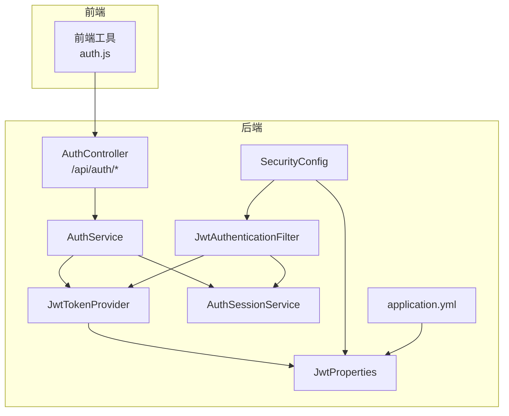
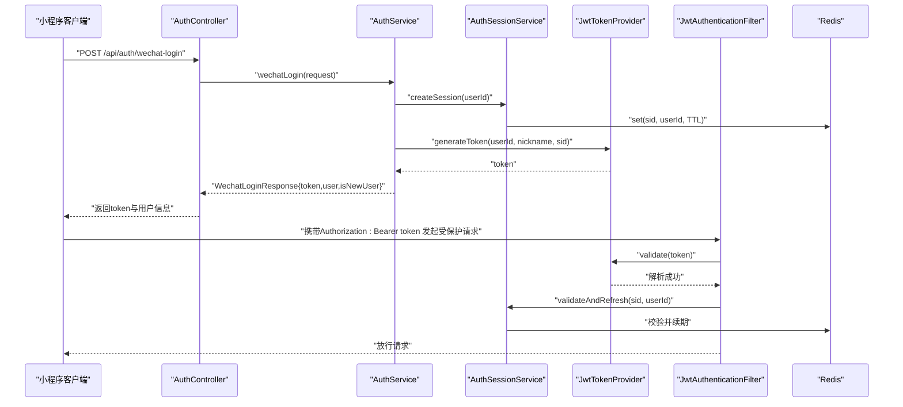
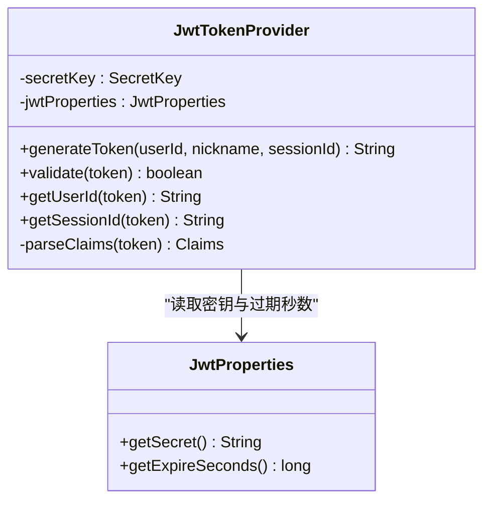
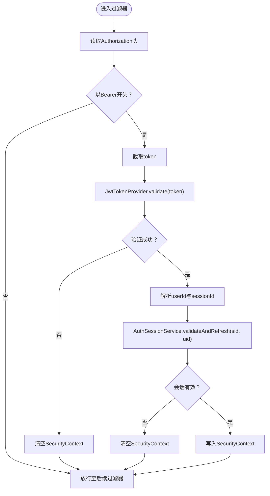
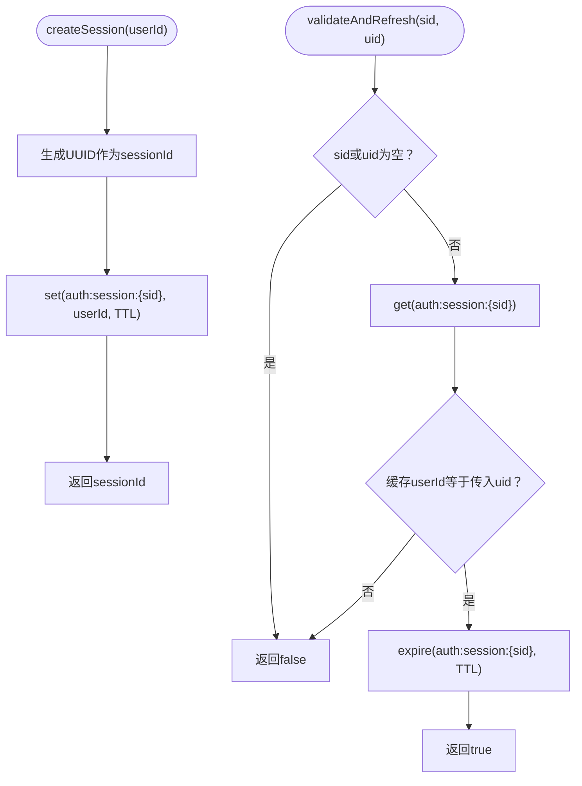
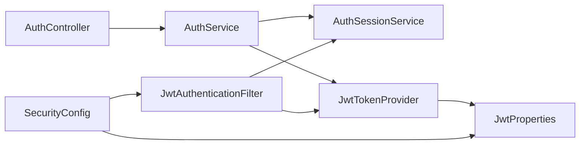

# JWT令牌管理

<cite>
**本文档引用的文件**
- [JwtTokenProvider.java](file://backend/src/main/java/com/playminipro/common/security/JwtTokenProvider.java)
- [JwtAuthenticationFilter.java](file://backend/src/main/java/com/playminipro/common/security/JwtAuthenticationFilter.java)
- [JwtProperties.java](file://backend/src/main/java/com/playminipro/common/config/JwtProperties.java)
- [SecurityConfig.java](file://backend/src/main/java/com/playminipro/common/config/SecurityConfig.java)
- [AuthService.java](file://backend/src/main/java/com/playminipro/auth/service/AuthService.java)
- [AuthSessionService.java](file://backend/src/main/java/com/playminipro/common/security/AuthSessionService.java)
- [application.yml](file://backend/src/main/resources/application.yml)
- [auth.js](file://frontend/utils/auth.js)
- [AuthController.java](file://backend/src/main/java/com/playminipro/auth/controller/AuthController.java)
- [WechatLoginRequest.java](file://backend/src/main/java/com/playminipro/auth/dto/WechatLoginRequest.java)
- [WechatLoginResponse.java](file://backend/src/main/java/com/playminipro/auth/dto/WechatLoginResponse.java)
- [AuthUserResponse.java](file://backend/src/main/java/com/playminipro/auth/dto/AuthUserResponse.java)
- [GlobalExceptionHandler.java](file://backend/src/main/java/com/playminipro/common/exception/GlobalExceptionHandler.java)
- [ApiResponse.java](file://backend/src/main/java/com/playminipro/common/response/ApiResponse.java)
</cite>

## 目录
1. [引言](#引言)
2. [项目结构](#项目结构)
3. [核心组件](#核心组件)
4. [架构总览](#架构总览)
5. [详细组件分析](#详细组件分析)
6. [依赖关系分析](#依赖关系分析)
7. [性能考虑](#性能考虑)
8. [故障排除指南](#故障排除指南)
9. [结论](#结论)
10. [附录](#附录)

## 引言
本文件系统性梳理Play Mini Pro项目的JWT令牌管理实现，覆盖令牌生成算法、签名机制、有效期设置、解析验证流程、负载结构、配置参数、HTTP传递方式、前端存储策略、后端验证机制、刷新策略、黑名单管理、安全风险防范等主题。同时给出令牌生成示例、验证流程图、错误处理机制以及多设备登录、令牌吊销、并发访问控制等高级功能的实现细节与最佳实践。

## 项目结构
后端采用Spring Boot + Spring Security + MyBatis Plus架构，JWT安全模块位于common/security包中，认证入口在auth模块，配置集中在common/config与application.yml中，前端通过小程序API完成登录并将令牌持久化到本地存储。

**图表来源**
- [AuthController.java:1-27](file://backend/src/main/java/com/playminipro/auth/controller/AuthController.java#L1-L27)
- [AuthService.java:1-101](file://backend/src/main/java/com/playminipro/auth/service/AuthService.java#L1-L101)
- [JwtTokenProvider.java:1-60](file://backend/src/main/java/com/playminipro/common/security/JwtTokenProvider.java#L1-L60)
- [AuthSessionService.java:1-53](file://backend/src/main/java/com/playminipro/common/security/AuthSessionService.java#L1-L53)
- [JwtAuthenticationFilter.java:1-56](file://backend/src/main/java/com/playminipro/common/security/JwtAuthenticationFilter.java#L1-L56)
- [SecurityConfig.java:1-55](file://backend/src/main/java/com/playminipro/common/config/SecurityConfig.java#L1-L55)
- [JwtProperties.java:1-27](file://backend/src/main/java/com/playminipro/common/config/JwtProperties.java#L1-L27)
- [application.yml:1-53](file://backend/src/main/resources/application.yml#L1-L53)

**章节来源**
- [AuthController.java:1-27](file://backend/src/main/java/com/playminipro/auth/controller/AuthController.java#L1-L27)
- [application.yml:1-53](file://backend/src/main/resources/application.yml#L1-L53)

## 核心组件
- JwtTokenProvider：负责JWT生成与解析，使用对称HMAC-SHA密钥进行签名与验证。
- JwtAuthenticationFilter：拦截HTTP请求，从Authorization头提取Bearer令牌，调用JwtTokenProvider校验并结合会话服务进行会话有效性检查。
- AuthSessionService：基于Redis的会话管理，为每个登录用户生成sessionId并设置过期时间，支持会话续期。
- JwtProperties：读取JWT密钥与过期秒数配置。
- SecurityConfig：配置无状态会话策略、CORS、放行路径及JWT过滤器链。
- AuthService：微信登录流程编排，创建会话并签发JWT。
- 前端auth.js：小程序登录流程，调用后端接口获取token并写入本地存储。

**章节来源**
- [JwtTokenProvider.java:1-60](file://backend/src/main/java/com/playminipro/common/security/JwtTokenProvider.java#L1-L60)
- [JwtAuthenticationFilter.java:1-56](file://backend/src/main/java/com/playminipro/common/security/JwtAuthenticationFilter.java#L1-L56)
- [AuthSessionService.java:1-53](file://backend/src/main/java/com/playminipro/common/security/AuthSessionService.java#L1-L53)
- [JwtProperties.java:1-27](file://backend/src/main/java/com/playminipro/common/config/JwtProperties.java#L1-L27)
- [SecurityConfig.java:1-55](file://backend/src/main/java/com/playminipro/common/config/SecurityConfig.java#L1-L55)
- [AuthService.java:1-101](file://backend/src/main/java/com/playminipro/auth/service/AuthService.java#L1-L101)
- [auth.js:1-56](file://frontend/utils/auth.js#L1-L56)

## 架构总览
下图展示从用户登录到请求鉴权的整体流程，包括令牌生成、存储与验证的关键节点。

**图表来源**
- [AuthController.java:1-27](file://backend/src/main/java/com/playminipro/auth/controller/AuthController.java#L1-L27)
- [AuthService.java:1-101](file://backend/src/main/java/com/playminipro/auth/service/AuthService.java#L1-L101)
- [AuthSessionService.java:1-53](file://backend/src/main/java/com/playminipro/common/security/AuthSessionService.java#L1-L53)
- [JwtTokenProvider.java:1-60](file://backend/src/main/java/com/playminipro/common/security/JwtTokenProvider.java#L1-L60)
- [JwtAuthenticationFilter.java:1-56](file://backend/src/main/java/com/playminipro/common/security/JwtAuthenticationFilter.java#L1-L56)

## 详细组件分析

### 组件一：JwtTokenProvider（令牌生成与解析）
- 生成算法：使用HS256对称密钥，构建包含sub、iat、exp、nickname、sid等声明的JWT。
- 签名机制：从配置读取密钥字节数组，构造HMAC-SHA密钥，使用该密钥对JWT进行签名。
- 有效期设置：基于JwtProperties中的expireSeconds计算过期时间。
- 解析验证：使用相同密钥验证签名并解析载荷；当前实现仅执行解析与签名验证，未显式检查过期时间。
- 载荷结构：主体字段包含用户标识、昵称、会话ID；可扩展加入角色、权限等声明。

**图表来源**
- [JwtTokenProvider.java:1-60](file://backend/src/main/java/com/playminipro/common/security/JwtTokenProvider.java#L1-L60)
- [JwtProperties.java:1-27](file://backend/src/main/java/com/playminipro/common/config/JwtProperties.java#L1-L27)

**章节来源**
- [JwtTokenProvider.java:1-60](file://backend/src/main/java/com/playminipro/common/security/JwtTokenProvider.java#L1-L60)
- [JwtProperties.java:1-27](file://backend/src/main/java/com/playminipro/common/config/JwtProperties.java#L1-L27)

### 组件二：JwtAuthenticationFilter（请求拦截与鉴权）
- 请求拦截：从Authorization头提取Bearer令牌。
- 验证流程：调用JwtTokenProvider.validate进行签名验证；解析出userId与sessionId。
- 会话校验：调用AuthSessionService.validateAndRefresh校验sessionId与userId一致性并续期。
- 安全上下文：通过UsernamePasswordAuthenticationToken将用户身份写入SecurityContextHolder。
- 错误处理：捕获异常并清空SecurityContext，确保未授权请求被拒绝。

**图表来源**
- [JwtAuthenticationFilter.java:1-56](file://backend/src/main/java/com/playminipro/common/security/JwtAuthenticationFilter.java#L1-L56)
- [JwtTokenProvider.java:1-60](file://backend/src/main/java/com/playminipro/common/security/JwtTokenProvider.java#L1-L60)
- [AuthSessionService.java:1-53](file://backend/src/main/java/com/playminipro/common/security/AuthSessionService.java#L1-L53)

**章节来源**
- [JwtAuthenticationFilter.java:1-56](file://backend/src/main/java/com/playminipro/common/security/JwtAuthenticationFilter.java#L1-L56)

### 组件三：AuthSessionService（会话管理与续期）
- 会话创建：为用户生成随机sessionId，写入Redis并设置TTL为JWT过期时间。
- 会话校验与续期：根据sessionId读取缓存中的userId，若一致则更新过期时间并返回true。
- Redis键空间：统一前缀“auth:session:”便于清理与运维。

**图表来源**
- [AuthSessionService.java:1-53](file://backend/src/main/java/com/playminipro/common/security/AuthSessionService.java#L1-L53)

**章节来源**
- [AuthSessionService.java:1-53](file://backend/src/main/java/com/playminipro/common/security/AuthSessionService.java#L1-L53)

### 组件四：SecurityConfig（安全配置）
- 无状态会话：禁用会话管理，确保API幂等与可伸缩性。
- CORS：允许所有源、头与方法，生产环境建议收紧。
- 放行规则：健康检查与认证接口无需鉴权。
- 过滤器链：在标准用户名密码过滤器之前插入JWT过滤器。

**章节来源**
- [SecurityConfig.java:1-55](file://backend/src/main/java/com/playminipro/common/config/SecurityConfig.java#L1-L55)

### 组件五：AuthService（微信登录与令牌发放）
- 微信授权：通过网关交换openId，支持模拟openId用于测试。
- 用户档案：昵称、头像URL、手机号按优先级解析与更新。
- 会话与令牌：创建会话并生成JWT，返回给前端。

**章节来源**
- [AuthService.java:1-101](file://backend/src/main/java/com/playminipro/auth/service/AuthService.java#L1-L101)

### 组件六：前端auth.js（登录与存储）
- 登录流程：调用后端微信登录接口，接收token与用户信息。
- 存储策略：使用小程序本地存储将token、用户信息与简档写入本地。

**章节来源**
- [auth.js:1-56](file://frontend/utils/auth.js#L1-L56)

### 组件七：配置参数与环境变量
- JWT配置：密钥secret与过期秒数expire-seconds，均来自环境变量。
- Redis配置：主机、端口、密码、超时等连接参数。
- 微信配置：AppId、AppSecret与模拟登录开关。

**章节来源**
- [application.yml:1-53](file://backend/src/main/resources/application.yml#L1-L53)
- [JwtProperties.java:1-27](file://backend/src/main/java/com/playminipro/common/config/JwtProperties.java#L1-L27)

## 依赖关系分析
- JwtTokenProvider依赖JwtProperties提供密钥与过期时间。
- JwtAuthenticationFilter依赖JwtTokenProvider与AuthSessionService完成令牌验证与会话校验。
- SecurityConfig装配JwtAuthenticationFilter并配置全局安全策略。
- AuthService协调AuthSessionService与JwtTokenProvider完成登录与令牌发放。
- 前端auth.js依赖后端AuthController提供的登录接口。

**图表来源**
- [AuthController.java:1-27](file://backend/src/main/java/com/playminipro/auth/controller/AuthController.java#L1-L27)
- [AuthService.java:1-101](file://backend/src/main/java/com/playminipro/auth/service/AuthService.java#L1-L101)
- [JwtAuthenticationFilter.java:1-56](file://backend/src/main/java/com/playminipro/common/security/JwtAuthenticationFilter.java#L1-L56)
- [JwtTokenProvider.java:1-60](file://backend/src/main/java/com/playminipro/common/security/JwtTokenProvider.java#L1-L60)
- [AuthSessionService.java:1-53](file://backend/src/main/java/com/playminipro/common/security/AuthSessionService.java#L1-L53)
- [SecurityConfig.java:1-55](file://backend/src/main/java/com/playminipro/common/config/SecurityConfig.java#L1-L55)
- [JwtProperties.java:1-27](file://backend/src/main/java/com/playminipro/common/config/JwtProperties.java#L1-L27)

**章节来源**
- [AuthController.java:1-27](file://backend/src/main/java/com/playminipro/auth/controller/AuthController.java#L1-L27)
- [AuthService.java:1-101](file://backend/src/main/java/com/playminipro/auth/service/AuthService.java#L1-L101)
- [JwtAuthenticationFilter.java:1-56](file://backend/src/main/java/com/playminipro/common/security/JwtAuthenticationFilter.java#L1-L56)
- [JwtTokenProvider.java:1-60](file://backend/src/main/java/com/playminipro/common/security/JwtTokenProvider.java#L1-L60)
- [AuthSessionService.java:1-53](file://backend/src/main/java/com/playminipro/common/security/AuthSessionService.java#L1-L53)
- [SecurityConfig.java:1-55](file://backend/src/main/java/com/playminipro/common/config/SecurityConfig.java#L1-L55)
- [JwtProperties.java:1-27](file://backend/src/main/java/com/playminipro/common/config/JwtProperties.java#L1-L27)

## 性能考虑
- 无状态设计：通过STATELESS策略避免会话粘性，利于横向扩展。
- Redis会话：会话校验与续期在Redis完成，延迟低且可共享。
- 密钥与签名：HMAC-SHA算法开销小，适合高并发场景。
- 建议优化：
  - 将JWT过期时间与Redis TTL解耦，支持独立的滑动过期策略。
  - 对频繁校验的用户引入本地缓存（如Caffeine）降低Redis压力。
  - 在网关层增加令牌预检与限流，防止暴力破解与重放攻击。

## 故障排除指南
- 认证失败：
  - 检查Authorization头格式是否为“Bearer {token}”。
  - 确认JWT密钥与过期时间配置正确，且前后端一致。
  - 排查Redis连接与会话键是否存在。
- 业务异常：
  - 使用全局异常处理器返回标准化错误码与消息。
- 前端问题：
  - 确认小程序登录流程已正确存储token并随请求携带。
  - 检查网络请求头是否包含Authorization。

**章节来源**
- [JwtAuthenticationFilter.java:1-56](file://backend/src/main/java/com/playminipro/common/security/JwtAuthenticationFilter.java#L1-L56)
- [GlobalExceptionHandler.java:1-41](file://backend/src/main/java/com/playminipro/common/exception/GlobalExceptionHandler.java#L1-L41)
- [ApiResponse.java:1-51](file://backend/src/main/java/com/playminipro/common/response/ApiResponse.java#L1-L51)
- [auth.js:1-56](file://frontend/utils/auth.js#L1-L56)

## 结论
本项目采用对称密钥JWT与Redis会话相结合的方式实现了轻量级、可扩展的认证体系。通过无状态过滤器链与严格的放行策略，既保证了安全性又具备良好的性能表现。建议在生产环境中进一步完善黑名单、滑动过期、并发控制与审计日志等能力，以满足更严格的安全要求。

## 附录

### JWT配置参数清单
- app.jwt.secret：JWT签名密钥（建议使用足够熵的随机字符串）
- app.jwt.expire-seconds：令牌有效期（秒）
- spring.data.redis.*：Redis连接参数
- app.wechat.*：微信小程序应用配置

**章节来源**
- [application.yml:1-53](file://backend/src/main/resources/application.yml#L1-L53)
- [JwtProperties.java:1-27](file://backend/src/main/java/com/playminipro/common/config/JwtProperties.java#L1-L27)

### 令牌生成示例（步骤说明）
- 步骤1：调用后端“/api/auth/wechat-login”，传入小程序code与可选资料。
- 步骤2：后端创建会话并生成JWT，返回token与用户信息。
- 步骤3：前端将token保存到本地存储，并在后续请求头中携带。

**章节来源**
- [AuthController.java:1-27](file://backend/src/main/java/com/playminipro/auth/controller/AuthController.java#L1-L27)
- [AuthService.java:1-101](file://backend/src/main/java/com/playminipro/auth/service/AuthService.java#L1-L101)
- [auth.js:1-56](file://frontend/utils/auth.js#L1-L56)

### 令牌验证流程（代码级）
- 过滤器读取Authorization头，提取token。
- 调用JwtTokenProvider.validate进行签名验证。
- 解析userId与sessionId，调用AuthSessionService.validateAndRefresh校验并续期。
- 成功后将用户身份写入SecurityContext，继续请求处理。

**章节来源**
- [JwtAuthenticationFilter.java:1-56](file://backend/src/main/java/com/playminipro/common/security/JwtAuthenticationFilter.java#L1-L56)
- [JwtTokenProvider.java:1-60](file://backend/src/main/java/com/playminipro/common/security/JwtTokenProvider.java#L1-L60)
- [AuthSessionService.java:1-53](file://backend/src/main/java/com/playminipro/common/security/AuthSessionService.java#L1-L53)

### HTTP请求传递与前端存储
- 传递方式：Authorization: Bearer {token}
- 前端存储：小程序本地存储token、用户信息与简档

**章节来源**
- [auth.js:1-56](file://frontend/utils/auth.js#L1-L56)

### 刷新策略与黑名单管理
- 刷新策略：当前实现通过AuthSessionService在每次请求时续期会话TTL，配合JWT过期时间实现滑动过期效果。
- 黑名单管理：建议引入Redis集合维护已吊销的sid或jti，过滤器在验证前先检查黑名单。
- 并发访问控制：可在AuthSessionService中记录并发登录数与设备指纹，超过阈值自动吊销旧会话。

[本节为概念性建议，不直接对应具体源码文件]

### 安全风险与防范
- 密钥泄露：定期轮换app.jwt.secret，限制其可见范围。
- 中间人攻击：强制HTTPS传输，避免明文存储token。
- 点击劫持与XSS：前端对敏感操作二次确认，后端对关键接口增加CSRF防护。
- 暴力破解：限制登录尝试频率，增加验证码或风控策略。

[本节为通用安全建议，不直接对应具体源码文件]