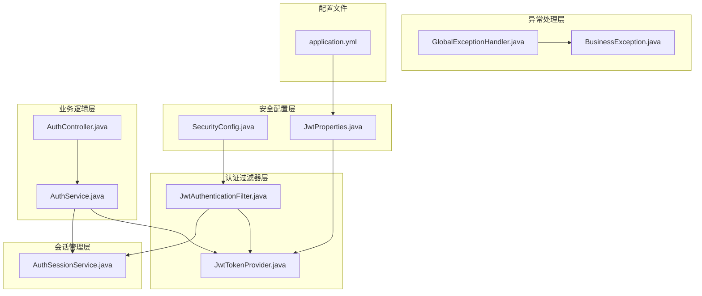
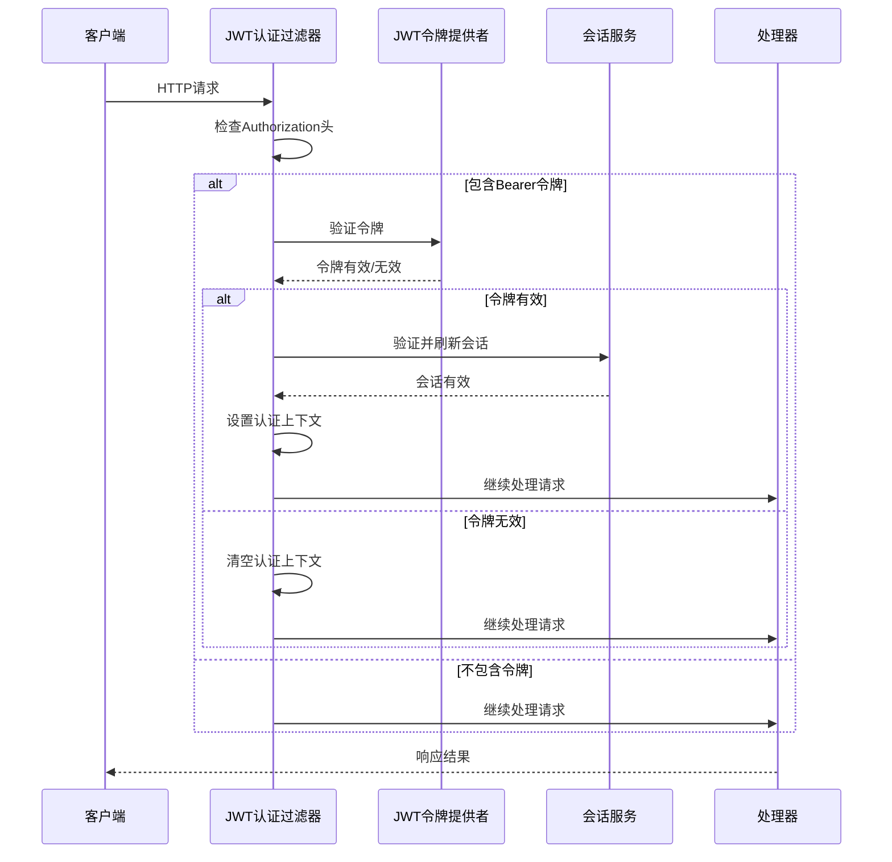
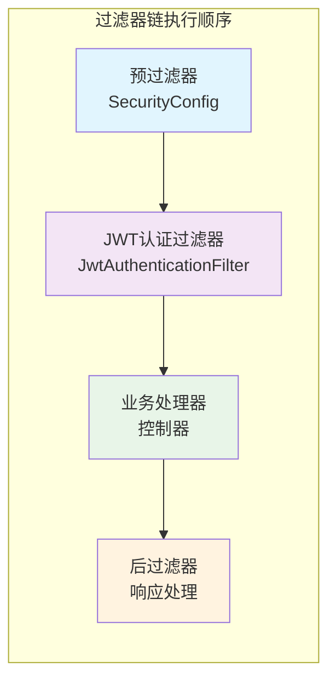
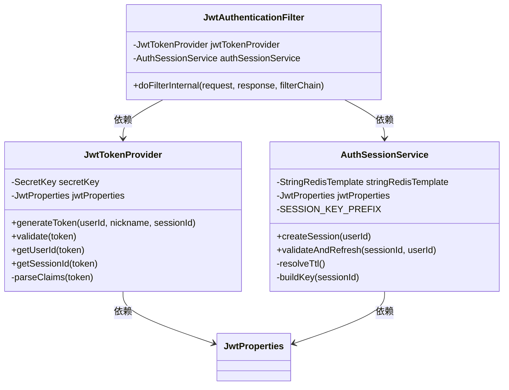
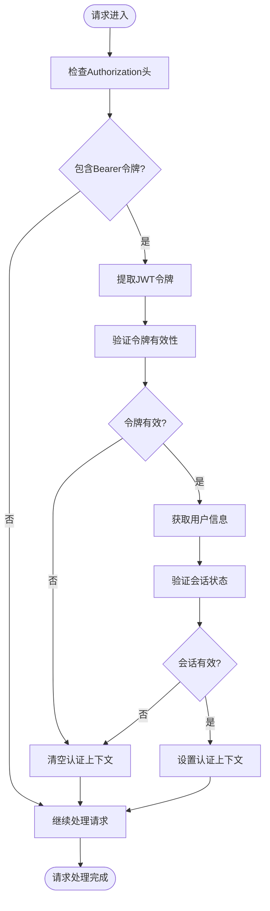
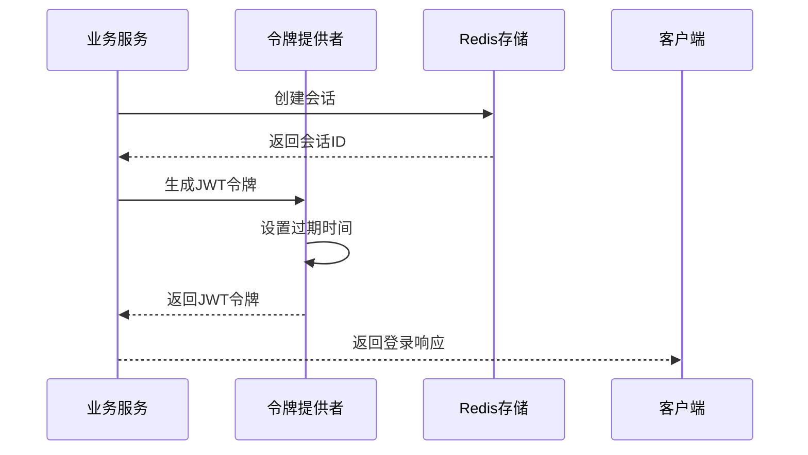
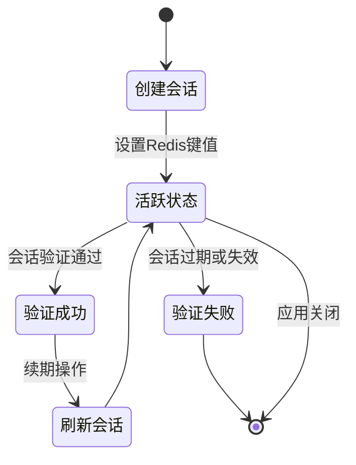
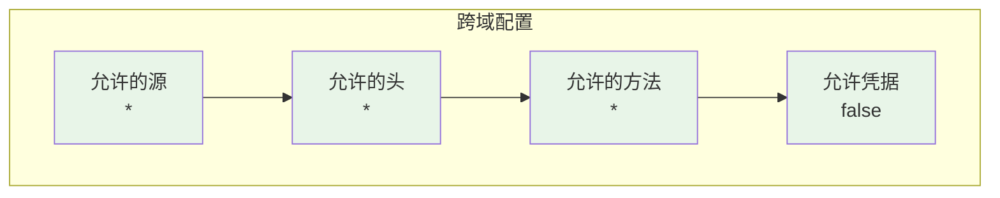
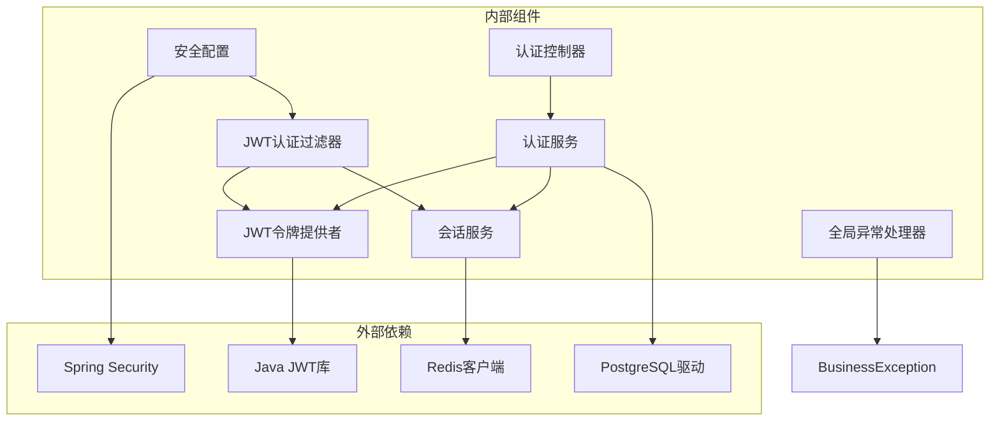

# 安全过滤器系统

<cite>
**本文档引用的文件**
- [JwtAuthenticationFilter.java](file://backend/src/main/java/com/playminipro/common/security/JwtAuthenticationFilter.java)
- [JwtTokenProvider.java](file://backend/src/main/java/com/playminipro/common/security/JwtTokenProvider.java)
- [AuthSessionService.java](file://backend/src/main/java/com/playminipro/common/security/AuthSessionService.java)
- [SecurityConfig.java](file://backend/src/main/java/com/playminipro/common/config/SecurityConfig.java)
- [JwtProperties.java](file://backend/src/main/java/com/playminipro/common/config/JwtProperties.java)
- [application.yml](file://backend/src/main/resources/application.yml)
- [GlobalExceptionHandler.java](file://backend/src/main/java/com/playminipro/common/exception/GlobalExceptionHandler.java)
- [BusinessException.java](file://backend/src/main/java/com/playminipro/common/exception/BusinessException.java)
- [AuthService.java](file://backend/src/main/java/com/playminipro/auth/service/AuthService.java)
- [AuthController.java](file://backend/src/main/java/com/playminipro/auth/controller/AuthController.java)
- [ApiResponse.java](file://backend/src/main/java/com/playminipro/common/response/ApiResponse.java)
</cite>

## 目录
1. [简介](#简介)
2. [项目结构](#项目结构)
3. [核心组件](#核心组件)
4. [架构概览](#架构概览)
5. [详细组件分析](#详细组件分析)
6. [依赖关系分析](#依赖关系分析)
7. [性能考虑](#性能考虑)
8. [故障排除指南](#故障排除指南)
9. [结论](#结论)

## 简介

本项目采用基于JWT（JSON Web Token）的无状态认证机制，通过Spring Security构建完整的安全过滤器系统。该系统实现了以下核心功能：

- **JWT认证过滤器**：拦截HTTP请求，提取并验证JWT令牌
- **会话服务管理**：基于Redis的用户会话管理，支持会话超时和续期
- **安全配置**：无状态会话策略，跨域配置，URL模式匹配
- **异常处理**：统一的业务异常和全局异常处理机制

系统采用分层架构设计，确保安全性、可维护性和扩展性。

## 项目结构

安全相关的核心文件组织如下：



**图表来源**
- [SecurityConfig.java:1-55](file://backend/src/main/java/com/playminipro/common/config/SecurityConfig.java#L1-L55)
- [JwtAuthenticationFilter.java:1-56](file://backend/src/main/java/com/playminipro/common/security/JwtAuthenticationFilter.java#L1-L56)
- [JwtTokenProvider.java:1-60](file://backend/src/main/java/com/playminipro/common/security/JwtTokenProvider.java#L1-L60)
- [AuthSessionService.java:1-53](file://backend/src/main/java/com/playminipro/common/security/AuthSessionService.java#L1-L53)

**章节来源**
- [SecurityConfig.java:1-55](file://backend/src/main/java/com/playminipro/common/config/SecurityConfig.java#L1-L55)
- [application.yml:1-53](file://backend/src/main/resources/application.yml#L1-L53)

## 核心组件

### JWT认证过滤器

JWT认证过滤器是整个安全系统的核心组件，负责拦截所有HTTP请求并进行身份验证。

**主要职责：**
- 提取Authorization头中的Bearer令牌
- 验证JWT令牌的有效性
- 校验用户会话状态
- 设置Spring Security的认证上下文

**实现特点：**
- 继承自OncePerRequestFilter，确保每个请求只处理一次
- 使用线程安全的单例模式
- 异常处理机制完善，避免影响正常请求流程

### JWT令牌提供者

负责JWT令牌的生成、验证和解析工作。

**核心功能：**
- 基于HMAC-SHA算法的对称加密
- 自定义声明字段（用户ID、昵称、会话ID）
- 令牌过期时间管理
- Claims解析和验证

### 会话服务

基于Redis实现的分布式会话管理系统。

**主要特性：**
- UUID生成的唯一会话ID
- Redis键值存储会话信息
- 自动过期时间管理
- 会话状态验证和续期

**章节来源**
- [JwtAuthenticationFilter.java:16-56](file://backend/src/main/java/com/playminipro/common/security/JwtAuthenticationFilter.java#L16-L56)
- [JwtTokenProvider.java:13-60](file://backend/src/main/java/com/playminipro/common/security/JwtTokenProvider.java#L13-L60)
- [AuthSessionService.java:10-53](file://backend/src/main/java/com/playminipro/common/security/AuthSessionService.java#L10-L53)

## 架构概览

系统采用分层架构，各层职责明确，耦合度低：



**图表来源**
- [JwtAuthenticationFilter.java:29-55](file://backend/src/main/java/com/playminipro/common/security/JwtAuthenticationFilter.java#L29-L55)
- [JwtTokenProvider.java:40-60](file://backend/src/main/java/com/playminipro/common/security/JwtTokenProvider.java#L40-L60)
- [AuthSessionService.java:31-44](file://backend/src/main/java/com/playminipro/common/security/AuthSessionService.java#L31-L44)

### 过滤器链执行顺序

系统中过滤器的执行顺序严格按照以下规则：



**执行流程：**
1. **预过滤器**：应用全局安全配置
2. **JWT认证过滤器**：执行身份验证逻辑
3. **业务处理器**：执行具体业务逻辑
4. **后过滤器**：处理响应数据

**章节来源**
- [SecurityConfig.java:26-41](file://backend/src/main/java/com/playminipro/common/config/SecurityConfig.java#L26-L41)

## 详细组件分析

### JWT认证过滤器详细分析

#### 类结构图



**图表来源**
- [JwtAuthenticationFilter.java:16-27](file://backend/src/main/java/com/playminipro/common/security/JwtAuthenticationFilter.java#L16-L27)
- [JwtTokenProvider.java:13-24](file://backend/src/main/java/com/playminipro/common/security/JwtTokenProvider.java#L13-L24)
- [AuthSessionService.java:10-23](file://backend/src/main/java/com/playminipro/common/security/AuthSessionService.java#L10-L23)

#### 认证流程详解



**图表来源**
- [JwtAuthenticationFilter.java:30-55](file://backend/src/main/java/com/playminipro/common/security/JwtAuthenticationFilter.java#L30-L55)

#### 异常处理策略

过滤器采用"优雅降级"策略：
- **令牌解析异常**：清空认证上下文，继续处理请求
- **会话验证失败**：清空认证上下文，继续处理请求
- **网络异常**：清空认证上下文，继续处理请求

这种设计确保了系统的稳定性和可靠性。

**章节来源**
- [JwtAuthenticationFilter.java:33-51](file://backend/src/main/java/com/playminipro/common/security/JwtAuthenticationFilter.java#L33-L51)

### JWT令牌提供者分析

#### 令牌结构设计

JWT令牌包含以下关键信息：

| Claim名称 | 数据类型 | 描述 | 必需性 |
|-----------|----------|------|--------|
| sub | String | 用户ID | 必需 |
| nickname | String | 用户昵称 | 可选 |
| sid | String | 会话ID | 必需 |
| iat | Number | 发布时间 | 必需 |
| exp | Number | 过期时间 | 必需 |

#### 令牌生成流程



**图表来源**
- [AuthService.java:72-75](file://backend/src/main/java/com/playminipro/auth/service/AuthService.java#L72-L75)
- [JwtTokenProvider.java:26-38](file://backend/src/main/java/com/playminipro/common/security/JwtTokenProvider.java#L26-L38)

**章节来源**
- [JwtTokenProvider.java:26-51](file://backend/src/main/java/com/playminipro/common/security/JwtTokenProvider.java#L26-L51)

### 会话服务设计模式

#### 会话生命周期管理



**图表来源**
- [AuthSessionService.java:25-44](file://backend/src/main/java/com/playminipro/common/security/AuthSessionService.java#L25-L44)

#### 会话超时处理机制

会话超时采用"懒加载"策略：
- **读取时检查**：每次访问会话时验证过期状态
- **自动续期**：验证通过后自动延长过期时间
- **统一管理**：使用相同的过期时间配置

**章节来源**
- [AuthSessionService.java:31-44](file://backend/src/main/java/com/playminipro/common/security/AuthSessionService.java#L31-L44)

### 安全配置详解

#### URL模式匹配策略

系统采用灵活的URL模式匹配机制：

| URL模式 | HTTP方法 | 权限要求 | 用途 |
|---------|----------|----------|------|
| `/actuator/health` | 所有 | 允许访问 | 健康检查 |
| `/error` | 所有 | 允许访问 | 错误页面 |
| `/api/auth/**` | POST | 允许访问 | 用户认证 |
| 其他所有请求 | 所有 | 需要认证 | 业务接口 |

#### 跨域配置



**配置特点：**
- **宽松策略**：允许所有源、头、方法
- **安全性考虑**：禁用凭据传递
- **开发友好**：便于前端调试

**章节来源**
- [SecurityConfig.java:26-55](file://backend/src/main/java/com/playminipro/common/config/SecurityConfig.java#L26-L55)

## 依赖关系分析

### 组件依赖图



**图表来源**
- [SecurityConfig.java:3,20:3-24](file://backend/src/main/java/com/playminipro/common/config/SecurityConfig.java#L3-L24)
- [JwtAuthenticationFilter.java:19,21:19-27](file://backend/src/main/java/com/playminipro/common/security/JwtAuthenticationFilter.java#L19-L27)
- [JwtTokenProvider.java:3,18:3-24](file://backend/src/main/java/com/playminipro/common/security/JwtTokenProvider.java#L3-L24)

### 关键依赖关系

1. **配置依赖**：SecurityConfig依赖JwtAuthenticationFilter
2. **业务依赖**：AuthService依赖JwtTokenProvider和AuthSessionService
3. **异常依赖**：GlobalExceptionHandler依赖BusinessException
4. **数据依赖**：AuthSessionService依赖Redis存储

**章节来源**
- [AuthService.java:29-39](file://backend/src/main/java/com/playminipro/auth/service/AuthService.java#L29-L39)

## 性能考虑

### 缓存策略

系统采用多层缓存优化：

1. **Redis会话缓存**：会话状态存储在Redis中，支持分布式部署
2. **JWT令牌缓存**：令牌验证结果可缓存，减少重复计算
3. **配置缓存**：JWT配置参数缓存，避免频繁读取

### 性能优化建议

1. **连接池配置**：合理配置Redis连接池大小
2. **超时设置**：设置合理的请求超时时间
3. **日志级别**：生产环境降低安全相关日志级别
4. **监控指标**：添加安全相关指标监控

## 故障排除指南

### 常见问题及解决方案

#### 1. JWT令牌验证失败

**可能原因：**
- 令牌格式不正确
- 密钥不匹配
- 令牌过期
- 会话ID无效

**排查步骤：**
1. 检查Authorization头格式是否为"Bearer {token}"
2. 验证JWT密钥配置
3. 检查令牌过期时间
4. 确认会话ID存在且有效

#### 2. 会话验证失败

**可能原因：**
- Redis连接异常
- 会话过期
- 用户ID不匹配
- 会话ID为空

**排查步骤：**
1. 检查Redis服务状态
2. 验证会话过期时间配置
3. 确认用户ID与会话ID匹配
4. 检查会话ID格式

#### 3. 跨域问题

**可能原因：**
- CORS配置不正确
- 预检请求未通过
- 凭据设置冲突

**排查步骤：**
1. 检查CORS配置是否启用
2. 验证允许的源列表
3. 确认预检请求的OPTIONS方法
4. 检查凭据设置

### 调试技巧

#### 日志配置

在`application.yml`中添加以下配置：

```yaml
logging:
  level:
    com.playminipro.common.security: debug
    org.springframework.security: debug
```

#### 关键调试点

1. **过滤器执行**：在`doFilterInternal`方法中添加日志
2. **令牌验证**：在`validate`方法中添加详细日志
3. **会话管理**：在`validateAndRefresh`方法中添加状态日志
4. **异常处理**：在全局异常处理器中添加详细错误信息

**章节来源**
- [GlobalExceptionHandler.java:14-40](file://backend/src/main/java/com/playminipro/common/exception/GlobalExceptionHandler.java#L14-L40)

## 结论

本安全过滤器系统采用现代化的无状态认证架构，具有以下优势：

### 技术优势

1. **安全性高**：基于JWT的无状态认证，避免会话状态泄露
2. **扩展性强**：模块化设计，易于扩展新功能
3. **性能优秀**：Redis缓存支持，高并发场景表现良好
4. **配置灵活**：支持多种配置方式，适应不同部署环境

### 最佳实践

1. **密钥管理**：使用环境变量管理JWT密钥
2. **会话超时**：合理设置会话过期时间
3. **异常处理**：完善的异常处理机制
4. **监控告警**：建立安全事件监控体系

### 改进建议

1. **CSRF防护**：在需要的状态下启用CSRF保护
2. **XSS防护**：添加输入验证和输出编码
3. **SQL注入防护**：使用ORM框架的参数绑定
4. **审计日志**：记录重要的安全事件

该系统为微服务架构提供了坚实的安全基础，能够有效保护应用程序免受常见Web攻击。