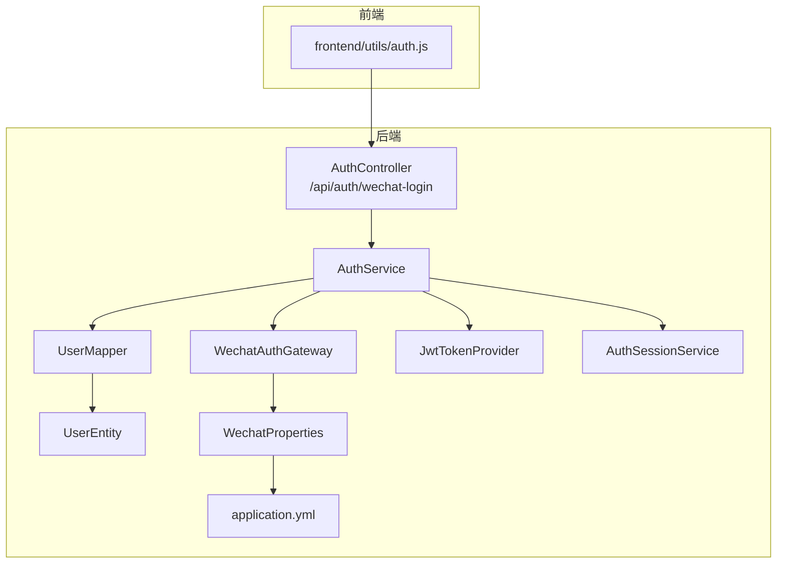
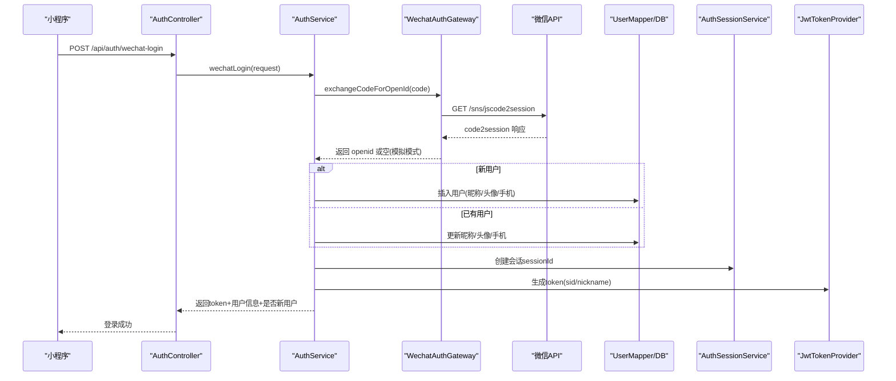
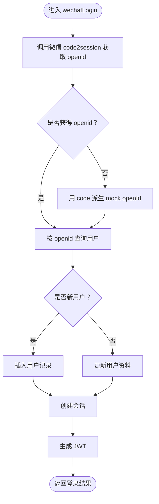
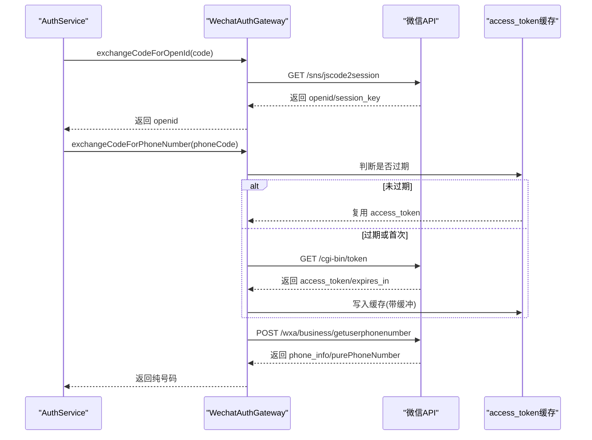
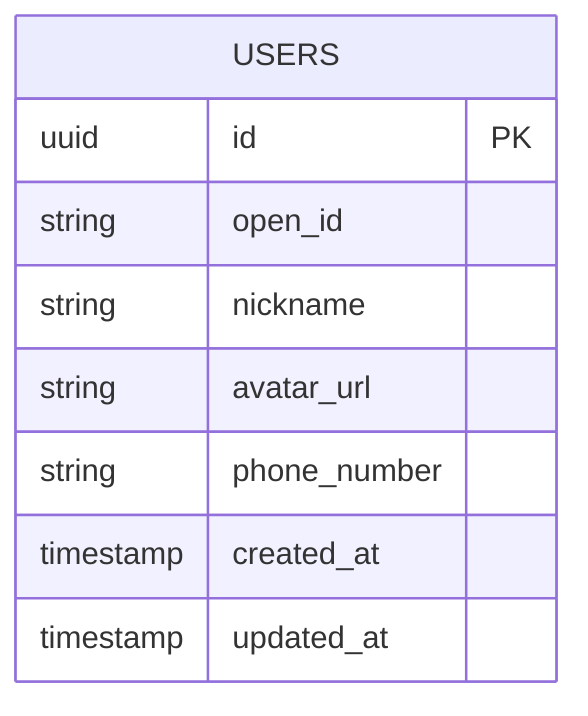
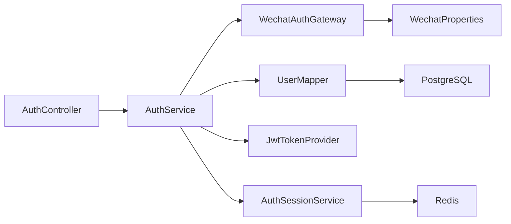

# 微信登录集成

<cite>
**本文引用的文件**
- [AuthController.java](file://backend/src/main/java/com/playminipro/auth/controller/AuthController.java)
- [AuthService.java](file://backend/src/main/java/com/playminipro/auth/service/AuthService.java)
- [WechatAuthGateway.java](file://backend/src/main/java/com/playminipro/auth/service/WechatAuthGateway.java)
- [WechatLoginRequest.java](file://backend/src/main/java/com/playminipro/auth/dto/WechatLoginRequest.java)
- [WechatCode2SessionResponse.java](file://backend/src/main/java/com/playminipro/auth/dto/WechatCode2SessionResponse.java)
- [WechatAccessTokenResponse.java](file://backend/src/main/java/com/playminipro/auth/dto/WechatAccessTokenResponse.java)
- [WechatPhoneNumberResponse.java](file://backend/src/main/java/com/playminipro/auth/dto/WechatPhoneNumberResponse.java)
- [WechatLoginResponse.java](file://backend/src/main/java/com/playminipro/auth/dto/WechatLoginResponse.java)
- [WechatProperties.java](file://backend/src/main/java/com/playminipro/common/config/WechatProperties.java)
- [UserEntity.java](file://backend/src/main/java/com/playminipro/auth/entity/UserEntity.java)
- [UserMapper.java](file://backend/src/main/java/com/playminipro/auth/mapper/UserMapper.java)
- [JwtTokenProvider.java](file://backend/src/main/java/com/playminipro/common/security/JwtTokenProvider.java)
- [AuthSessionService.java](file://backend/src/main/java/com/playminipro/common/security/AuthSessionService.java)
- [application.yml](file://backend/src/main/resources/application.yml)
- [auth.js](file://frontend/utils/auth.js)
</cite>

## 目录
1. [简介](#简介)
2. [项目结构](#项目结构)
3. [核心组件](#核心组件)
4. [架构总览](#架构总览)
5. [详细组件分析](#详细组件分析)
6. [依赖分析](#依赖分析)
7. [性能考虑](#性能考虑)
8. [故障排查指南](#故障排查指南)
9. [结论](#结论)
10. [附录](#附录)

## 简介
本文件面向后端与前端开发者，系统化阐述微信授权登录在本项目中的完整实现：从小程序前端获取临时登录凭证（code），到后端通过 code2session 获取 openid，再到 access_token 的缓存与手机号解密，最终完成用户信息入库与会话签发。文档覆盖参数校验、响应处理、用户信息同步策略、安全配置与回调地址设置、错误码与重试机制、以及手机号绑定、头像与昵称更新等扩展能力。

## 项目结构
后端采用 Spring Boot + MyBatis 架构，认证模块位于 com.playminipro.auth 包下，通用安全与配置位于 common.* 包下；前端位于 frontend/utils 下，负责小程序端登录流程与数据提交。

**图表来源**
- [AuthController.java:1-27](file://backend/src/main/java/com/playminipro/auth/controller/AuthController.java#L1-L27)
- [AuthService.java:1-101](file://backend/src/main/java/com/playminipro/auth/service/AuthService.java#L1-L101)
- [WechatAuthGateway.java:1-171](file://backend/src/main/java/com/playminipro/auth/service/WechatAuthGateway.java#L1-L171)
- [UserMapper.java:1-41](file://backend/src/main/java/com/playminipro/auth/mapper/UserMapper.java#L1-L41)
- [UserEntity.java:1-76](file://backend/src/main/java/com/playminipro/auth/entity/UserEntity.java#L1-L76)
- [JwtTokenProvider.java:1-60](file://backend/src/main/java/com/playminipro/common/security/JwtTokenProvider.java#L1-L60)
- [AuthSessionService.java:1-53](file://backend/src/main/java/com/playminipro/common/security/AuthSessionService.java#L1-L53)
- [WechatProperties.java:1-37](file://backend/src/main/java/com/playminipro/common/config/WechatProperties.java#L1-L37)
- [application.yml:1-53](file://backend/src/main/resources/application.yml#L1-L53)

**章节来源**
- [AuthController.java:1-27](file://backend/src/main/java/com/playminipro/auth/controller/AuthController.java#L1-L27)
- [application.yml:1-53](file://backend/src/main/resources/application.yml#L1-L53)

## 核心组件
- 接口控制器：接收前端登录请求，转发至业务服务层。
- 业务服务：协调微信网关、用户映射、JWT 与会话服务，完成登录与用户资料同步。
- 微信网关：封装微信 API 调用，含 code2session、access_token 缓存与手机号解密。
- 数据模型与持久层：用户实体与 MyBatis 映射。
- 安全组件：JWT 签发与校验、基于 Redis 的会话管理。
- 配置中心：读取微信 AppID/AppSecret 与开关项。

**章节来源**
- [AuthService.java:1-101](file://backend/src/main/java/com/playminipro/auth/service/AuthService.java#L1-L101)
- [WechatAuthGateway.java:1-171](file://backend/src/main/java/com/playminipro/auth/service/WechatAuthGateway.java#L1-L171)
- [UserMapper.java:1-41](file://backend/src/main/java/com/playminipro/auth/mapper/UserMapper.java#L1-L41)
- [JwtTokenProvider.java:1-60](file://backend/src/main/java/com/playminipro/common/security/JwtTokenProvider.java#L1-L60)
- [AuthSessionService.java:1-53](file://backend/src/main/java/com/playminipro/common/security/AuthSessionService.java#L1-L53)
- [WechatProperties.java:1-37](file://backend/src/main/java/com/playminipro/common/config/WechatProperties.java#L1-L37)

## 架构总览
微信登录整体流程分为三步：前端获取 code → 后端 code2session 获取 openid → 可选手机号解密 → 用户信息入库/更新 → 生成会话与 JWT。

**图表来源**
- [AuthController.java:23-26](file://backend/src/main/java/com/playminipro/auth/controller/AuthController.java#L23-L26)
- [AuthService.java:42-76](file://backend/src/main/java/com/playminipro/auth/service/AuthService.java#L42-L76)
- [WechatAuthGateway.java:39-72](file://backend/src/main/java/com/playminipro/auth/service/WechatAuthGateway.java#L39-L72)
- [UserMapper.java:12-40](file://backend/src/main/java/com/playminipro/auth/mapper/UserMapper.java#L12-L40)
- [AuthSessionService.java:25-28](file://backend/src/main/java/com/playminipro/common/security/AuthSessionService.java#L25-L28)
- [JwtTokenProvider.java:26-38](file://backend/src/main/java/com/playminipro/common/security/JwtTokenProvider.java#L26-L38)

## 详细组件分析

### 接口与请求参数
- 接口路径：/api/auth/wechat-login（POST）
- 请求体 DTO：WechatLoginRequest
  - 字段：code（必填）、phoneCode（可选）、nickname（可选）、avatarUrl（可选）
  - 校验：非空与长度限制
- 响应体 DTO：WechatLoginResponse
  - 字段：token、user（包含 id、nickname、avatarUrl）、isNewUser

前端调用示例（参考）：
- 小程序 wx.login 成功后携带 code 发起请求
- 可选携带 nickname、avatarUrl、phoneCode

**章节来源**
- [AuthController.java:23-26](file://backend/src/main/java/com/playminipro/auth/controller/AuthController.java#L23-L26)
- [WechatLoginRequest.java:6-11](file://backend/src/main/java/com/playminipro/auth/dto/WechatLoginRequest.java#L6-L11)
- [WechatLoginResponse.java:3-7](file://backend/src/main/java/com/playminipro/auth/dto/WechatLoginResponse.java#L3-L7)
- [auth.js:3-48](file://frontend/utils/auth.js#L3-L48)

### 业务逻辑与用户同步策略
- openid 解析：优先通过微信 code2session 获取；若未配置 AppSecret 且开启模拟登录，则走模拟逻辑（返回空 openid，后续以 code 派生 mock openId）。
- 新用户创建：生成随机 UUID 作为本地用户 id，写入 openId、昵称、头像、手机号。
- 资料更新：已存在用户仅更新昵称、头像与手机号（以传入值优先，否则保留旧值）。
- 会话与令牌：创建 Redis 会话，生成 JWT 并下发。

**图表来源**
- [AuthService.java:42-76](file://backend/src/main/java/com/playminipro/auth/service/AuthService.java#L42-L76)
- [AuthService.java:92-100](file://backend/src/main/java/com/playminipro/auth/service/AuthService.java#L92-L100)

**章节来源**
- [AuthService.java:41-101](file://backend/src/main/java/com/playminipro/auth/service/AuthService.java#L41-L101)

### 微信授权登录与手机号解密
- code2session：调用 https://api.weixin.qq.com/sns/jscode2session，参数包含 appid、secret、js_code、grant_type=authorization_code。
- access_token 缓存：调用 https://api.weixin.qq.com/cgi-bin/token 获取全局访问令牌，带过期时间，刷新前缓冲 300 秒。
- 手机号解密：调用 https://api.weixin.qq.com/wxa/business/getuserphonenumber，需携带 access_token 与加密 code。

**图表来源**
- [WechatAuthGateway.java:39-72](file://backend/src/main/java/com/playminipro/auth/service/WechatAuthGateway.java#L39-L72)
- [WechatAuthGateway.java:113-158](file://backend/src/main/java/com/playminipro/auth/service/WechatAuthGateway.java#L113-L158)
- [WechatAuthGateway.java:78-111](file://backend/src/main/java/com/playminipro/auth/service/WechatAuthGateway.java#L78-L111)

**章节来源**
- [WechatAuthGateway.java:19-171](file://backend/src/main/java/com/playminipro/auth/service/WechatAuthGateway.java#L19-L171)

### 数据模型与数据库交互
- 用户实体：包含 id、openId、nickname、avatarUrl、phoneNumber、createdAt、updatedAt。
- MyBatis 映射：按 openId 查找用户、按 id 查找、插入、更新资料。
- 数据库迁移：包含 users 表及字段（含手机号列）。

**图表来源**
- [UserEntity.java:5-76](file://backend/src/main/java/com/playminipro/auth/entity/UserEntity.java#L5-L76)
- [UserMapper.java:12-40](file://backend/src/main/java/com/playminipro/auth/mapper/UserMapper.java#L12-L40)

**章节来源**
- [UserEntity.java:1-76](file://backend/src/main/java/com/playminipro/auth/entity/UserEntity.java#L1-L76)
- [UserMapper.java:1-41](file://backend/src/main/java/com/playminipro/auth/mapper/UserMapper.java#L1-L41)

### 安全与会话
- JWT 签发：使用对称密钥（配置项）签名，载荷包含用户 id、昵称、会话 id，过期时间由配置控制。
- 会话管理：Redis 存储 sessionId -> userId，过期时间与 JWT 一致；支持续期。
- 认证过滤：JWT 校验与解析（当前登录接口为匿名入口，后续可接入过滤器）。

**章节来源**
- [JwtTokenProvider.java:26-59](file://backend/src/main/java/com/playminipro/common/security/JwtTokenProvider.java#L26-L59)
- [AuthSessionService.java:25-44](file://backend/src/main/java/com/playminipro/common/security/AuthSessionService.java#L25-L44)

### 配置与环境变量
- 应用配置：JWT 密钥、过期秒数、微信 AppID、AppSecret、是否启用模拟登录。
- 环境变量：WECHAT_MINI_APP_ID、WECHAT_MINI_APP_SECRET、WECHAT_MOCK_LOGIN_ENABLED。
- 回调地址：本项目后端未直接使用微信回调地址，小程序端通过 wx.login 获取 code 并提交至 /api/auth/wechat-login。

**章节来源**
- [application.yml:42-49](file://backend/src/main/resources/application.yml#L42-L49)
- [WechatProperties.java:6-37](file://backend/src/main/java/com/playminipro/common/config/WechatProperties.java#L6-L37)

## 依赖分析
- 组件耦合
  - AuthController 仅负责路由与参数校验，依赖 AuthService。
  - AuthService 依赖 WechatAuthGateway、UserMapper、JwtTokenProvider、AuthSessionService。
  - WechatAuthGateway 依赖 WechatProperties、ObjectMapper、RestClient。
  - UserMapper 依赖 MyBatis 注解与数据库。
  - JwtTokenProvider 依赖 JwtProperties。
  - AuthSessionService 依赖 Redis。
- 外部依赖
  - 微信 API：code2session、access_token、手机号解密。
  - Redis：会话存储。
  - PostgreSQL：用户数据持久化。

**图表来源**
- [AuthController.java:17-21](file://backend/src/main/java/com/playminipro/auth/controller/AuthController.java#L17-L21)
- [AuthService.java:31-39](file://backend/src/main/java/com/playminipro/auth/service/AuthService.java#L31-L39)
- [WechatAuthGateway.java:31-37](file://backend/src/main/java/com/playminipro/auth/service/WechatAuthGateway.java#L31-L37)
- [UserMapper.java:9-41](file://backend/src/main/java/com/playminipro/auth/mapper/UserMapper.java#L9-L41)
- [AuthSessionService.java:19-23](file://backend/src/main/java/com/playminipro/common/security/AuthSessionService.java#L19-L23)

**章节来源**
- [AuthService.java:21-39](file://backend/src/main/java/com/playminipro/auth/service/AuthService.java#L21-L39)
- [WechatAuthGateway.java:16-37](file://backend/src/main/java/com/playminipro/auth/service/WechatAuthGateway.java#L16-L37)

## 性能考虑
- access_token 缓存：避免频繁拉取全局访问令牌，减少外部依赖抖动带来的延迟。
- 会话存储：Redis 异步写入与过期续期，降低数据库压力。
- 事务边界：用户创建/更新在单事务中执行，保证一致性。
- 响应体精简：仅返回必要字段，减少序列化开销。

[本节为通用指导，无需特定文件引用]

## 故障排查指南
- 常见错误码与含义
  - 4005：微信 AppSecret 未配置或无效
  - 4006：微信登录失败（code2session 错误）
  - 4007：手机号解密失败（phoneCode 为空或微信返回错误）
  - 4008：access_token 获取失败（AppSecret 未配置或微信返回错误）
- 典型问题定位
  - code2session 返回 errcode 非 0：检查小程序端 wx.login 是否成功、后端是否正确传递 code。
  - openid 为空：确认 AppSecret 是否配置；如未配置且模拟登录开启，将走 mock 流程。
  - 手机号为空：确认 phoneCode 是否传入、微信授权是否同意、access_token 是否可用。
  - access_token 过期：自动刷新，但需确保 AppSecret 正确配置。
- 重试建议
  - 对于网络波动导致的微信接口超时，可在前端重试一次；后端不重复消费微信 code。
  - 若 access_token 获取失败，检查 AppSecret 与网络连通性。

**章节来源**
- [WechatAuthGateway.java:40-45](file://backend/src/main/java/com/playminipro/auth/service/WechatAuthGateway.java#L40-L45)
- [WechatAuthGateway.java:65-71](file://backend/src/main/java/com/playminipro/auth/service/WechatAuthGateway.java#L65-L71)
- [WechatAuthGateway.java:82-84](file://backend/src/main/java/com/playminipro/auth/service/WechatAuthGateway.java#L82-L84)
- [WechatAuthGateway.java:102-111](file://backend/src/main/java/com/playminipro/auth/service/WechatAuthGateway.java#L102-L111)
- [WechatAuthGateway.java:125-127](file://backend/src/main/java/com/playminipro/auth/service/WechatAuthGateway.java#L125-L127)
- [WechatAuthGateway.java:146-151](file://backend/src/main/java/com/playminipro/auth/service/WechatAuthGateway.java#L146-L151)

## 结论
本方案以清晰的分层与职责分离实现了微信登录：前端专注获取 code，后端通过网关统一对接微信 API，业务层负责用户资料同步与会话签发。通过 access_token 缓存与 Redis 会话，兼顾了性能与安全性。建议在生产环境严格管理 AppSecret，完善日志与监控，并在前端做好失败重试与降级策略。

[本节为总结，无需特定文件引用]

## 附录

### API 定义与调用示例
- 登录接口
  - 方法：POST
  - 路径：/api/auth/wechat-login
  - 请求体字段：code、phoneCode、nickname、avatarUrl
  - 响应体字段：token、user(id,nickname,avatarUrl)、isNewUser
- 示例（请求）
  - code: "临时登录凭证"
  - phoneCode: "手机号解密凭证（可选）"
  - nickname: "昵称（可选）"
  - avatarUrl: "头像URL（可选）"
- 示例（响应）
  - token: "JWT 令牌"
  - user: 包含 id、nickname、avatarUrl
  - isNewUser: 是否新用户

**章节来源**
- [AuthController.java:23-26](file://backend/src/main/java/com/playminipro/auth/controller/AuthController.java#L23-L26)
- [WechatLoginRequest.java:6-11](file://backend/src/main/java/com/playminipro/auth/dto/WechatLoginRequest.java#L6-L11)
- [WechatLoginResponse.java:3-7](file://backend/src/main/java/com/playminipro/auth/dto/WechatLoginResponse.java#L3-L7)
- [auth.js:13-23](file://frontend/utils/auth.js#L13-L23)

### 数据结构定义
- WechatCode2SessionResponse：包含 openid、session_key、unionid、errcode、errmsg
- WechatAccessTokenResponse：包含 access_token、expires_in、errcode、errmsg
- WechatPhoneNumberResponse：包含 phone_info（含 phoneNumber、purePhoneNumber、countryCode）、errcode、errmsg
- WechatLoginRequest：包含 code、phoneCode、nickname、avatarUrl
- WechatLoginResponse：包含 token、user、isNewUser
- UserEntity：包含 id、openId、nickname、avatarUrl、phoneNumber、createdAt、updatedAt

**章节来源**
- [WechatCode2SessionResponse.java:5-24](file://backend/src/main/java/com/playminipro/auth/dto/WechatCode2SessionResponse.java#L5-L24)
- [WechatAccessTokenResponse.java:5-27](file://backend/src/main/java/com/playminipro/auth/dto/WechatAccessTokenResponse.java#L5-L27)
- [WechatPhoneNumberResponse.java:5-33](file://backend/src/main/java/com/playminipro/auth/dto/WechatPhoneNumberResponse.java#L5-L33)
- [WechatLoginRequest.java:6-11](file://backend/src/main/java/com/playminipro/auth/dto/WechatLoginRequest.java#L6-L11)
- [WechatLoginResponse.java:3-7](file://backend/src/main/java/com/playminipro/auth/dto/WechatLoginResponse.java#L3-L7)
- [UserEntity.java:5-76](file://backend/src/main/java/com/playminipro/auth/entity/UserEntity.java#L5-L76)

### 异常处理策略
- 参数校验：前端传参长度与必填约束；后端 DTO 校验。
- 微信接口异常：捕获 errcode 并转换为业务异常码；对空响应进行兜底。
- 会话与令牌：JWT 过期或篡改时，客户端重新登录；服务端校验失败返回 401。

**章节来源**
- [WechatAuthGateway.java:160-170](file://backend/src/main/java/com/playminipro/auth/service/WechatAuthGateway.java#L160-L170)
- [JwtTokenProvider.java:40-59](file://backend/src/main/java/com/playminipro/common/security/JwtTokenProvider.java#L40-L59)

### 扩展功能实现要点
- 手机号绑定：通过 phoneCode 调用微信手机号解密接口，优先使用解密结果，否则保留旧值。
- 头像与昵称同步：传入则更新；未传入则保留历史值。
- 模拟登录：未配置 AppSecret 且开启模拟登录时，使用 code 派生 mock openId，便于本地联调。

**章节来源**
- [AuthService.java:48-70](file://backend/src/main/java/com/playminipro/auth/service/AuthService.java#L48-L70)
- [AuthService.java:78-90](file://backend/src/main/java/com/playminipro/auth/service/AuthService.java#L78-L90)
- [AuthService.java:92-100](file://backend/src/main/java/com/playminipro/auth/service/AuthService.java#L92-L100)
- [WechatAuthGateway.java:74-76](file://backend/src/main/java/com/playminipro/auth/service/WechatAuthGateway.java#L74-L76)
- [WechatAuthGateway.java:82-84](file://backend/src/main/java/com/playminipro/auth/service/WechatAuthGateway.java#L82-L84)