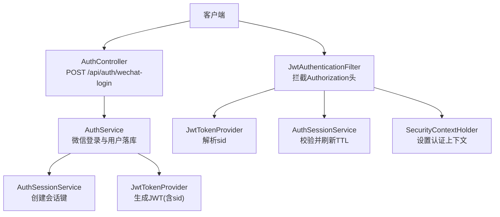
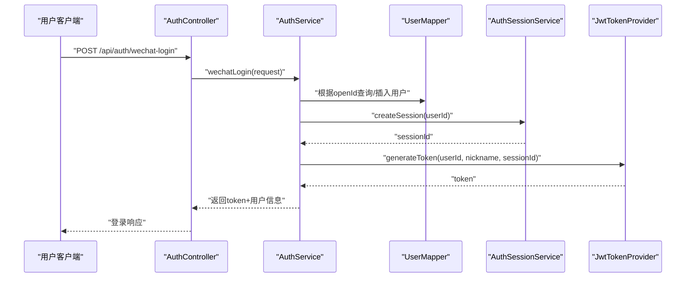
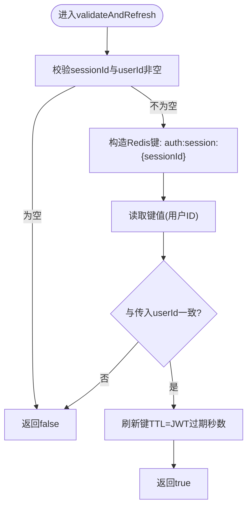
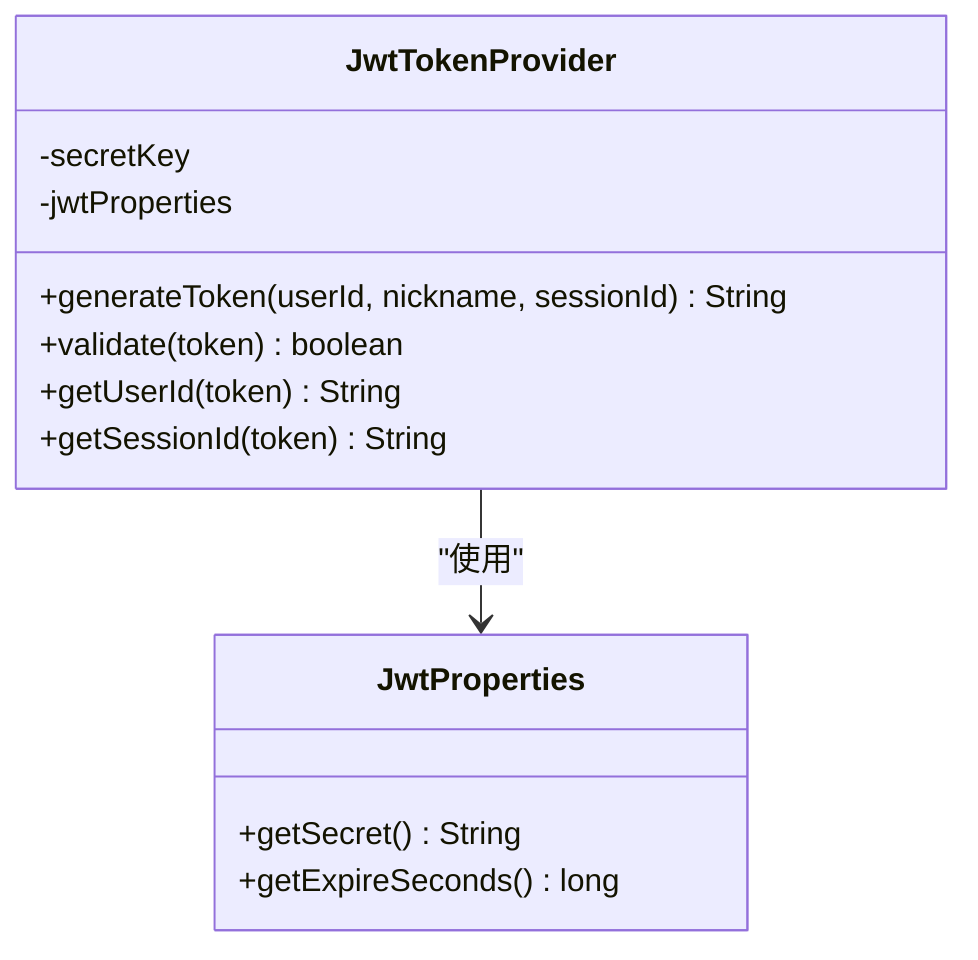
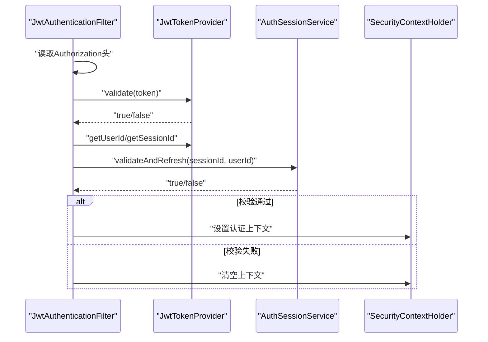
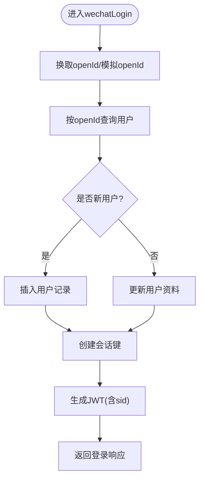
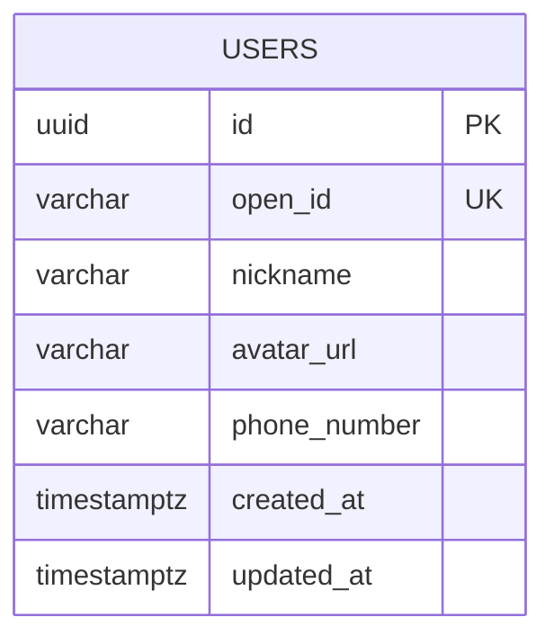
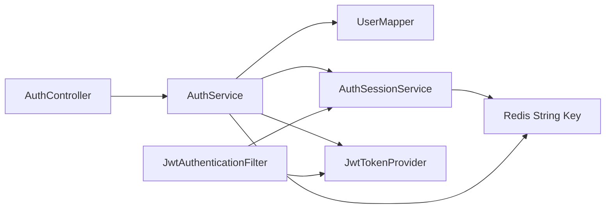

# 用户会话管理

<cite>
**本文引用的文件**
- [AuthSessionService.java](file://backend/src/main/java/com/playminipro/common/security/AuthSessionService.java)
- [JwtAuthenticationFilter.java](file://backend/src/main/java/com/playminipro/common/security/JwtAuthenticationFilter.java)
- [JwtTokenProvider.java](file://backend/src/main/java/com/playminipro/common/security/JwtTokenProvider.java)
- [AuthService.java](file://backend/src/main/java/com/playminipro/auth/service/AuthService.java)
- [SecurityConfig.java](file://backend/src/main/java/com/playminipro/common/config/SecurityConfig.java)
- [JwtProperties.java](file://backend/src/main/java/com/playminipro/common/config/JwtProperties.java)
- [application.yml](file://backend/src/main/resources/application.yml)
- [AuthController.java](file://backend/src/main/java/com/playminipro/auth/controller/AuthController.java)
- [WechatLoginRequest.java](file://backend/src/main/java/com/playminipro/auth/dto/WechatLoginRequest.java)
- [WechatLoginResponse.java](file://backend/src/main/java/com/playminipro/auth/dto/WechatLoginResponse.java)
- [AuthUserResponse.java](file://backend/src/main/java/com/playminipro/auth/dto/AuthUserResponse.java)
- [UserEntity.java](file://backend/src/main/java/com/playminipro/auth/entity/UserEntity.java)
- [UserMapper.java](file://backend/src/main/java/com/playminipro/auth/mapper/UserMapper.java)
</cite>

## 目录
1. [简介](#简介)
2. [项目结构](#项目结构)
3. [核心组件](#核心组件)
4. [架构总览](#架构总览)
5. [详细组件分析](#详细组件分析)
6. [依赖分析](#依赖分析)
7. [性能考虑](#性能考虑)
8. [故障排查指南](#故障排查指南)
9. [结论](#结论)
10. [附录](#附录)

## 简介
本文件围绕用户会话管理进行系统性技术文档整理，重点覆盖以下方面：
- 在线状态跟踪：通过会话键与用户ID绑定，结合JWT中携带的会话标识实现在线校验与续期。
- 会话持久化：使用Redis存储会话键与用户ID映射，并设置与JWT相同的过期时间，确保会话生命周期与令牌一致。
- 超时处理：服务端在每次请求校验时刷新Redis键的TTL，避免因空闲导致的“幽灵会话”。
- Redis缓存设计：定义统一前缀的会话键空间，采用字符串类型存储用户ID，过期策略与JWT过期保持同步。
- 用户信息缓存策略：当前实现未对用户信息做独立缓存；可基于业务扩展热点用户信息的本地或Redis缓存。
- 安全措施：会话固定攻击防护（JWT中sid与Redis键绑定）、并发登录控制（单设备登录策略）、强制下线机制（撤销会话键）。
- 监控与统计：可基于Redis键空间扫描与指标埋点实现在线用户统计、活跃度分析与异常登录检测。

## 项目结构
后端采用Spring Boot + Spring Security + MyBatis + PostgreSQL + Redis的组合。认证流程从HTTP请求进入，经由JWT过滤器解析令牌，再通过会话服务校验会话有效性并刷新TTL，最终将认证上下文写入SecurityContext。

图示来源
- [AuthController.java:1-27](file://backend/src/main/java/com/playminipro/auth/controller/AuthController.java#L1-L27)
- [AuthService.java:1-101](file://backend/src/main/java/com/playminipro/auth/service/AuthService.java#L1-L101)
- [AuthSessionService.java:1-53](file://backend/src/main/java/com/playminipro/common/security/AuthSessionService.java#L1-L53)
- [JwtTokenProvider.java:1-60](file://backend/src/main/java/com/playminipro/common/security/JwtTokenProvider.java#L1-L60)
- [JwtAuthenticationFilter.java:1-56](file://backend/src/main/java/com/playminipro/common/security/JwtAuthenticationFilter.java#L1-L56)

章节来源
- [application.yml:1-53](file://backend/src/main/resources/application.yml#L1-L53)
- [SecurityConfig.java:1-55](file://backend/src/main/java/com/playminipro/common/config/SecurityConfig.java#L1-L55)

## 核心组件
- 会话服务：负责会话创建、校验与续期，使用Redis字符串键存储用户ID并设置TTL。
- JWT提供者：负责签发与解析JWT，令牌中包含用户ID与会话ID(sid)，用于会话绑定。
- 认证过滤器：拦截请求头中的Authorization，解析Bearer令牌，调用会话服务校验并刷新，成功则写入认证上下文。
- 安全配置：禁用CSRF/表单登录，开启无状态会话策略，注册JWT过滤器。
- 登录服务：完成微信授权、用户落库/更新、会话创建与JWT签发。

章节来源
- [AuthSessionService.java:1-53](file://backend/src/main/java/com/playminipro/common/security/AuthSessionService.java#L1-L53)
- [JwtTokenProvider.java:1-60](file://backend/src/main/java/com/playminipro/common/security/JwtTokenProvider.java#L1-L60)
- [JwtAuthenticationFilter.java:1-56](file://backend/src/main/java/com/playminipro/common/security/JwtAuthenticationFilter.java#L1-L56)
- [SecurityConfig.java:1-55](file://backend/src/main/java/com/playminipro/common/config/SecurityConfig.java#L1-L55)
- [AuthService.java:1-101](file://backend/src/main/java/com/playminipro/auth/service/AuthService.java#L1-L101)

## 架构总览
整体认证链路如下：

图示来源
- [AuthController.java:1-27](file://backend/src/main/java/com/playminipro/auth/controller/AuthController.java#L1-L27)
- [AuthService.java:1-101](file://backend/src/main/java/com/playminipro/auth/service/AuthService.java#L1-L101)
- [UserMapper.java:1-41](file://backend/src/main/java/com/playminipro/auth/mapper/UserMapper.java#L1-L41)
- [AuthSessionService.java:1-53](file://backend/src/main/java/com/playminipro/common/security/AuthSessionService.java#L1-L53)
- [JwtTokenProvider.java:1-60](file://backend/src/main/java/com/playminipro/common/security/JwtTokenProvider.java#L1-L60)

## 详细组件分析

### 会话服务（AuthSessionService）
- 角色与职责
  - 创建会话：生成随机sessionId并以“auth:session:{sessionId}”为键存储用户ID，TTL与JWT一致。
  - 校验与续期：校验传入sessionId与userId是否匹配，若匹配则刷新该键的TTL，否则拒绝。
- 键空间设计
  - 前缀：auth:session:
  - 类型：字符串
  - 值：用户ID
  - 过期：与JWT过期秒数一致
- 并发与一致性
  - 单实例Redis下，GET/SET/EXPIRE为原子性操作，满足基本一致性。
  - 若部署多实例，需确保Redis高可用与网络延迟可控，避免跨实例会话抖动。
- 复杂度
  - 每次请求O(1)读取与一次TTL刷新。

图示来源
- [AuthSessionService.java:1-53](file://backend/src/main/java/com/playminipro/common/security/AuthSessionService.java#L1-L53)

章节来源
- [AuthSessionService.java:1-53](file://backend/src/main/java/com/playminipro/common/security/AuthSessionService.java#L1-L53)

### JWT提供者（JwtTokenProvider）
- 角色与职责
  - 使用对称密钥签发JWT，载荷包含用户ID(subject)、昵称(nickname)、会话ID(sid)、签发时间与过期时间。
  - 提供校验、提取用户ID与会话ID的能力。
- 安全要点
  - 密钥来源于配置中心环境变量，建议定期轮换。
  - sid与Redis会话键绑定，防止会话固定攻击。
- 过期策略
  - 过期秒数来自JwtProperties，与会话键TTL保持一致。

图示来源
- [JwtTokenProvider.java:1-60](file://backend/src/main/java/com/playminipro/common/security/JwtTokenProvider.java#L1-L60)
- [JwtProperties.java:1-27](file://backend/src/main/java/com/playminipro/common/config/JwtProperties.java#L1-L27)

章节来源
- [JwtTokenProvider.java:1-60](file://backend/src/main/java/com/playminipro/common/security/JwtTokenProvider.java#L1-L60)
- [JwtProperties.java:1-27](file://backend/src/main/java/com/playminipro/common/config/JwtProperties.java#L1-L27)

### 认证过滤器（JwtAuthenticationFilter）
- 角色与职责
  - 从Authorization头解析Bearer令牌，验证JWT有效性。
  - 从JWT中提取用户ID与会话ID，调用会话服务校验并刷新。
  - 成功则在SecurityContext中设置认证对象，失败则清空上下文。
- 无状态策略
  - 配置为STATELESS，所有认证逻辑由JWT与Redis会话键共同保障。

图示来源
- [JwtAuthenticationFilter.java:1-56](file://backend/src/main/java/com/playminipro/common/security/JwtAuthenticationFilter.java#L1-L56)
- [JwtTokenProvider.java:1-60](file://backend/src/main/java/com/playminipro/common/security/JwtTokenProvider.java#L1-L60)
- [AuthSessionService.java:1-53](file://backend/src/main/java/com/playminipro/common/security/AuthSessionService.java#L1-L53)

章节来源
- [JwtAuthenticationFilter.java:1-56](file://backend/src/main/java/com/playminipro/common/security/JwtAuthenticationFilter.java#L1-L56)
- [SecurityConfig.java:1-55](file://backend/src/main/java/com/playminipro/common/config/SecurityConfig.java#L1-L55)

### 登录服务（AuthService）
- 角色与职责
  - 微信授权换取openId，若失败则回退到基于code的模拟openId。
  - 用户落库或更新资料，随后创建会话并签发JWT。
- 关键流程
  - 查询/插入用户 → 创建会话 → 生成JWT → 返回登录响应。

图示来源
- [AuthService.java:1-101](file://backend/src/main/java/com/playminipro/auth/service/AuthService.java#L1-L101)
- [UserMapper.java:1-41](file://backend/src/main/java/com/playminipro/auth/mapper/UserMapper.java#L1-L41)
- [AuthSessionService.java:1-53](file://backend/src/main/java/com/playminipro/common/security/AuthSessionService.java#L1-L53)
- [JwtTokenProvider.java:1-60](file://backend/src/main/java/com/playminipro/common/security/JwtTokenProvider.java#L1-L60)

章节来源
- [AuthService.java:1-101](file://backend/src/main/java/com/playminipro/auth/service/AuthService.java#L1-L101)
- [UserMapper.java:1-41](file://backend/src/main/java/com/playminipro/auth/mapper/UserMapper.java#L1-L41)

### 数据模型与持久层
- 用户实体与映射
  - 实体包含基础字段与时间戳。
  - Mapper提供按openId与id的查询、插入与更新操作。

图示来源
- [UserEntity.java:1-76](file://backend/src/main/java/com/playminipro/auth/entity/UserEntity.java#L1-L76)
- [UserMapper.java:1-41](file://backend/src/main/java/com/playminipro/auth/mapper/UserMapper.java#L1-L41)

章节来源
- [UserEntity.java:1-76](file://backend/src/main/java/com/playminipro/auth/entity/UserEntity.java#L1-L76)
- [UserMapper.java:1-41](file://backend/src/main/java/com/playminipro/auth/mapper/UserMapper.java#L1-L41)

## 依赖分析
- 组件耦合
  - JwtAuthenticationFilter依赖JwtTokenProvider与AuthSessionService。
  - AuthService依赖UserMapper、JwtTokenProvider、AuthSessionService与微信网关。
  - AuthSessionService依赖StringRedisTemplate与JwtProperties。
- 外部依赖
  - Redis：会话键存储与TTL刷新。
  - PostgreSQL：用户数据持久化。
  - Spring Security：无状态认证链路与过滤器注册。

图示来源
- [AuthController.java:1-27](file://backend/src/main/java/com/playminipro/auth/controller/AuthController.java#L1-L27)
- [AuthService.java:1-101](file://backend/src/main/java/com/playminipro/auth/service/AuthService.java#L1-L101)
- [AuthSessionService.java:1-53](file://backend/src/main/java/com/playminipro/common/security/AuthSessionService.java#L1-L53)
- [JwtAuthenticationFilter.java:1-56](file://backend/src/main/java/com/playminipro/common/security/JwtAuthenticationFilter.java#L1-L56)
- [JwtTokenProvider.java:1-60](file://backend/src/main/java/com/playminipro/common/security/JwtTokenProvider.java#L1-L60)
- [UserMapper.java:1-41](file://backend/src/main/java/com/playminipro/auth/mapper/UserMapper.java#L1-L41)

章节来源
- [SecurityConfig.java:1-55](file://backend/src/main/java/com/playminipro/common/config/SecurityConfig.java#L1-L55)
- [application.yml:1-53](file://backend/src/main/resources/application.yml#L1-L53)

## 性能考虑
- Redis键访问
  - 会话键为字符串类型，读写均为O(1)，适合高频请求场景。
  - TTL刷新为单命令，开销极低。
- JWT过期与会话同步
  - 通过保持JWT与会话键过期秒数一致，避免“令牌有效但会话无效”的边界问题。
- 缓存策略建议
  - 当前未对用户信息做独立缓存。对于高频读取的用户昵称、头像等字段，可在Redis中增加二级缓存，结合热点数据淘汰策略与失效通知机制。
- 并发登录控制
  - 可在会话键上引入版本号或时间戳，实现“先到先得”的单设备登录策略；或在JWT中加入设备指纹，实现多设备登录但互斥策略。
- 异常登录检测
  - 可基于IP/UA/设备指纹与登录时间序列建立规则引擎，触发告警或二次校验。

## 故障排查指南
- 常见问题与定位
  - 会话校验失败：检查Authorization头格式、JWT签名与有效期、Redis键是否存在且值匹配。
  - 会话过早失效：核对JWT过期秒数与Redis TTL是否一致，确认网络抖动未导致TTL刷新失败。
  - 登录成功但无法鉴权：确认JwtAuthenticationFilter已注册并处于过滤链首位。
- 排查步骤
  - 启用Spring Security与Redis日志，观察过滤器链执行与Redis命令。
  - 使用Redis客户端检查会话键是否存在、值是否为用户ID、剩余TTL是否正确。
  - 校验JWT载荷中的sid与Redis键是否一致。

章节来源
- [JwtAuthenticationFilter.java:1-56](file://backend/src/main/java/com/playminipro/common/security/JwtAuthenticationFilter.java#L1-L56)
- [AuthSessionService.java:1-53](file://backend/src/main/java/com/playminipro/common/security/AuthSessionService.java#L1-L53)
- [application.yml:1-53](file://backend/src/main/resources/application.yml#L1-L53)

## 结论
本系统采用“JWT + Redis会话键”的无状态认证方案，通过sid将令牌与会话绑定，实现了会话固定攻击防护、会话超时续期与并发登录控制的基础能力。建议后续在用户信息缓存、多设备登录策略、异常登录检测与在线统计等方面进一步增强，以满足生产级稳定性与可观测性要求。

## 附录

### 会话操作示例（路径指引）
- 用户登录
  - 请求：POST /api/auth/wechat-login
  - 参数：WechatLoginRequest
  - 响应：WechatLoginResponse
  - 流程路径：[AuthController.java:1-27](file://backend/src/main/java/com/playminipro/auth/controller/AuthController.java#L1-L27) → [AuthService.java:1-101](file://backend/src/main/java/com/playminipro/auth/service/AuthService.java#L1-L101)
- 请求鉴权
  - 头部：Authorization: Bearer <token>
  - 过滤链：JwtAuthenticationFilter → AuthSessionService校验 → SecurityContext设置
  - 流程路径：[JwtAuthenticationFilter.java:1-56](file://backend/src/main/java/com/playminipro/common/security/JwtAuthenticationFilter.java#L1-L56) → [AuthSessionService.java:1-53](file://backend/src/main/java/com/playminipro/common/security/AuthSessionService.java#L1-L53)

章节来源
- [AuthController.java:1-27](file://backend/src/main/java/com/playminipro/auth/controller/AuthController.java#L1-L27)
- [WechatLoginRequest.java:1-12](file://backend/src/main/java/com/playminipro/auth/dto/WechatLoginRequest.java#L1-L12)
- [WechatLoginResponse.java:1-8](file://backend/src/main/java/com/playminipro/auth/dto/WechatLoginResponse.java#L1-L8)
- [JwtAuthenticationFilter.java:1-56](file://backend/src/main/java/com/playminipro/common/security/JwtAuthenticationFilter.java#L1-L56)
- [AuthSessionService.java:1-53](file://backend/src/main/java/com/playminipro/common/security/AuthSessionService.java#L1-L53)

### 配置参数清单
- JWT配置
  - app.jwt.secret：JWT对称密钥（建议来自环境变量）
  - app.jwt.expire-seconds：JWT过期秒数（与会话键TTL一致）
- Redis配置
  - spring.data.redis.host/port/password/timeout：连接参数
- 应用端口与数据库
  - server.port：服务端口
  - spring.datasource.*：PostgreSQL连接信息
  - mybatis.configuration.cache-enabled：MyBatis二级缓存开关

章节来源
- [application.yml:1-53](file://backend/src/main/resources/application.yml#L1-L53)
- [JwtProperties.java:1-27](file://backend/src/main/java/com/playminipro/common/config/JwtProperties.java#L1-L27)