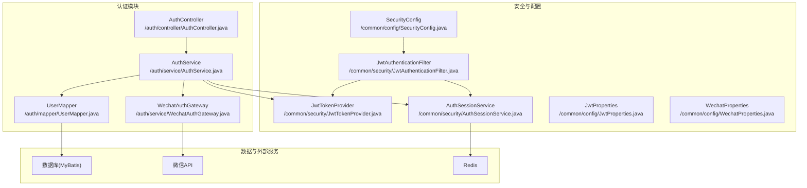
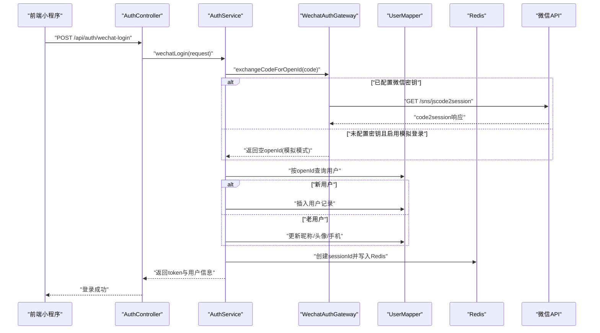
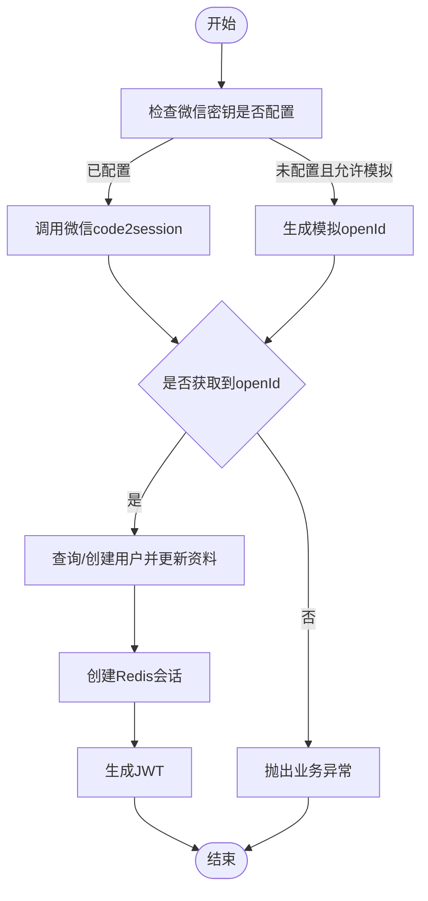
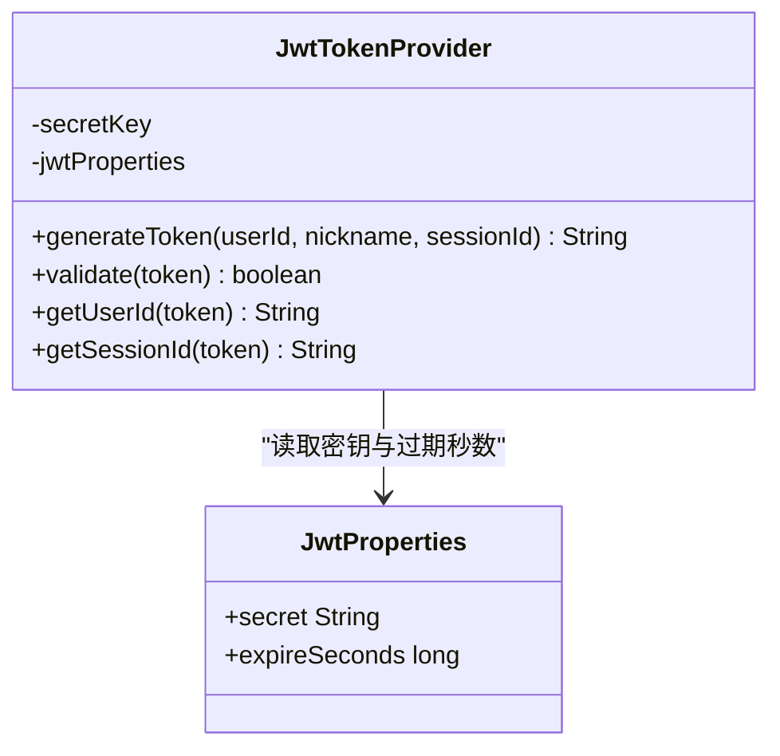
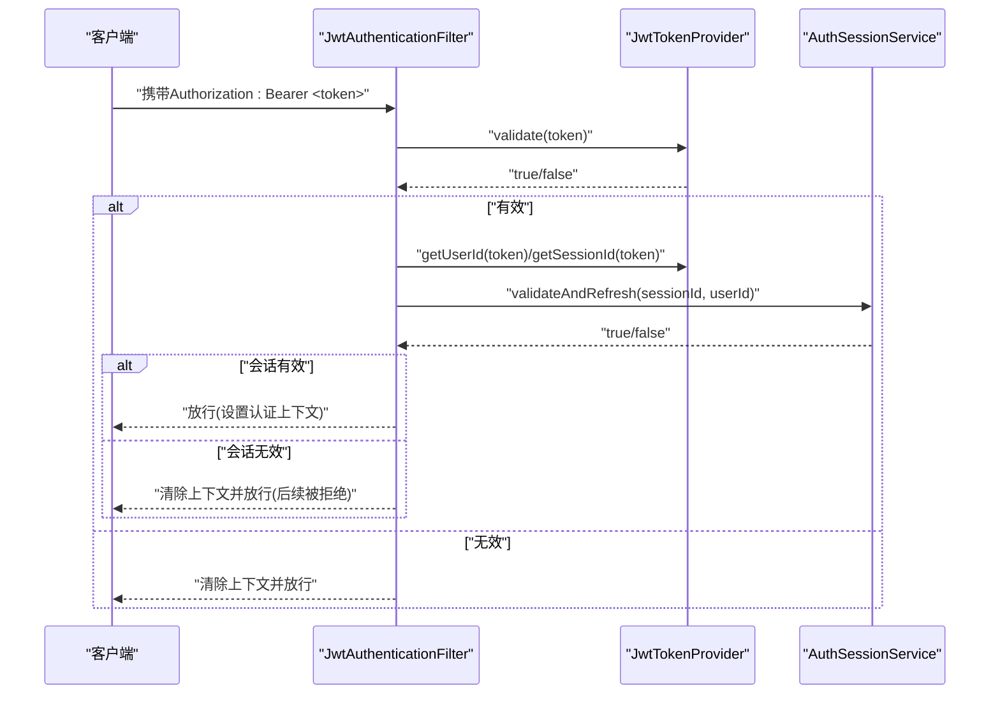
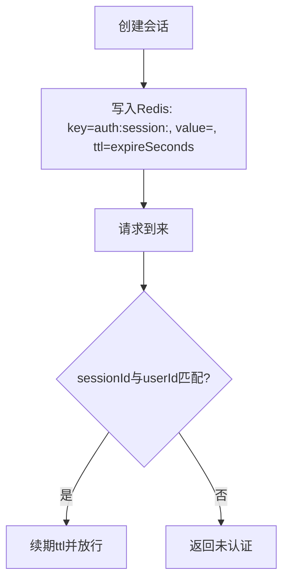
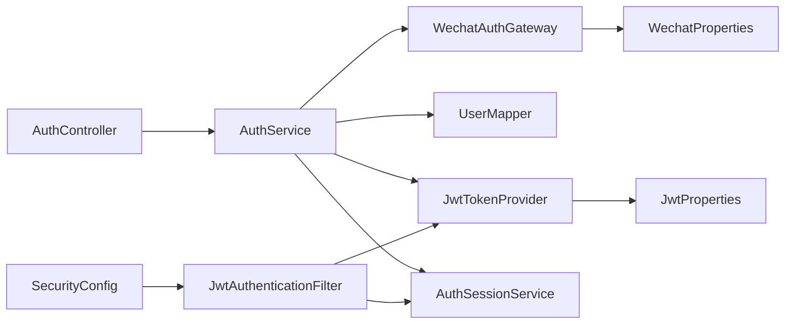

# 认证授权模块

<cite>
**本文引用的文件**
- [AuthController.java](file://backend/src/main/java/com/playminipro/auth/controller/AuthController.java)
- [AuthService.java](file://backend/src/main/java/com/playminipro/auth/service/AuthService.java)
- [WechatAuthGateway.java](file://backend/src/main/java/com/playminipro/auth/service/WechatAuthGateway.java)
- [JwtTokenProvider.java](file://backend/src/main/java/com/playminipro/common/security/JwtTokenProvider.java)
- [JwtAuthenticationFilter.java](file://backend/src/main/java/com/playminipro/common/security/JwtAuthenticationFilter.java)
- [AuthSessionService.java](file://backend/src/main/java/com/playminipro/common/security/AuthSessionService.java)
- [SecurityConfig.java](file://backend/src/main/java/com/playminipro/common/config/SecurityConfig.java)
- [JwtProperties.java](file://backend/src/main/java/com/playminipro/common/config/JwtProperties.java)
- [WechatProperties.java](file://backend/src/main/java/com/playminipro/common/config/WechatProperties.java)
- [WechatLoginRequest.java](file://backend/src/main/java/com/playminipro/auth/dto/WechatLoginRequest.java)
- [WechatLoginResponse.java](file://backend/src/main/java/com/playminipro/auth/dto/WechatLoginResponse.java)
- [WechatCode2SessionResponse.java](file://backend/src/main/java/com/playminipro/auth/dto/WechatCode2SessionResponse.java)
- [WechatAccessTokenResponse.java](file://backend/src/main/java/com/playminipro/auth/dto/WechatAccessTokenResponse.java)
- [WechatPhoneNumberResponse.java](file://backend/src/main/java/com/playminipro/auth/dto/WechatPhoneNumberResponse.java)
- [AuthUserResponse.java](file://backend/src/main/java/com/playminipro/auth/dto/AuthUserResponse.java)
- [UserEntity.java](file://backend/src/main/java/com/playminipro/auth/entity/UserEntity.java)
- [application.yml](file://backend/src/main/resources/application.yml)
</cite>

## 目录
1. [简介](#简介)
2. [项目结构](#项目结构)
3. [核心组件](#核心组件)
4. [架构总览](#架构总览)
5. [详细组件分析](#详细组件分析)
6. [依赖关系分析](#依赖关系分析)
7. [性能考量](#性能考量)
8. [故障排查指南](#故障排查指南)
9. [结论](#结论)
10. [附录](#附录)

## 简介
本文件为认证授权模块的综合开发文档，覆盖微信小程序登录集成（code2session、手机号解密）、用户信息获取与状态管理、JWT令牌生成与校验、安全过滤器实现、以及基于Redis的会话管理策略。文档提供时序图、流程图、类图与依赖关系图，并给出错误处理策略与安全最佳实践，帮助开发者快速理解与扩展系统。

## 项目结构
认证授权相关代码主要分布在以下包与文件中：
- 控制层：/auth/controller/AuthController.java
- 业务层：/auth/service/AuthService.java、/auth/service/WechatAuthGateway.java
- 数据模型：/auth/dto/*、/auth/entity/UserEntity.java
- 安全与配置：/common/security/*、/common/config/*
- 配置文件：/resources/application.yml

图表来源
- [AuthController.java:1-27](file://backend/src/main/java/com/playminipro/auth/controller/AuthController.java#L1-L27)
- [AuthService.java:1-101](file://backend/src/main/java/com/playminipro/auth/service/AuthService.java#L1-L101)
- [WechatAuthGateway.java:1-171](file://backend/src/main/java/com/playminipro/auth/service/WechatAuthGateway.java#L1-L171)
- [JwtTokenProvider.java:1-60](file://backend/src/main/java/com/playminipro/common/security/JwtTokenProvider.java#L1-L60)
- [JwtAuthenticationFilter.java:1-56](file://backend/src/main/java/com/playminipro/common/security/JwtAuthenticationFilter.java#L1-L56)
- [AuthSessionService.java:1-53](file://backend/src/main/java/com/playminipro/common/security/AuthSessionService.java#L1-L53)
- [SecurityConfig.java:1-55](file://backend/src/main/java/com/playminipro/common/config/SecurityConfig.java#L1-L55)
- [JwtProperties.java:1-27](file://backend/src/main/java/com/playminipro/common/config/JwtProperties.java#L1-L27)
- [WechatProperties.java:1-37](file://backend/src/main/java/com/playminipro/common/config/WechatProperties.java#L1-L37)

章节来源
- [AuthController.java:1-27](file://backend/src/main/java/com/playminipro/auth/controller/AuthController.java#L1-L27)
- [application.yml:1-53](file://backend/src/main/resources/application.yml#L1-L53)

## 核心组件
- 微信登录网关：封装微信code2session与手机号解密调用，内置access_token缓存与过期刷新逻辑。
- 用户服务：整合微信登录、用户信息同步、会话创建与JWT令牌签发。
- JWT提供者：负责令牌生成、解析与校验。
- 安全过滤器：从请求头提取Bearer令牌，校验并绑定认证上下文。
- 会话服务：基于Redis的sessionId存储与续期，实现会话持久化与失效控制。
- 安全配置：无状态会话策略、白名单路径放行、CORS配置。

章节来源
- [WechatAuthGateway.java:1-171](file://backend/src/main/java/com/playminipro/auth/service/WechatAuthGateway.java#L1-L171)
- [AuthService.java:1-101](file://backend/src/main/java/com/playminipro/auth/service/AuthService.java#L1-L101)
- [JwtTokenProvider.java:1-60](file://backend/src/main/java/com/playminipro/common/security/JwtTokenProvider.java#L1-L60)
- [JwtAuthenticationFilter.java:1-56](file://backend/src/main/java/com/playminipro/common/security/JwtAuthenticationFilter.java#L1-L56)
- [AuthSessionService.java:1-53](file://backend/src/main/java/com/playminipro/common/security/AuthSessionService.java#L1-L53)
- [SecurityConfig.java:1-55](file://backend/src/main/java/com/playminipro/common/config/SecurityConfig.java#L1-L55)

## 架构总览
整体采用“无状态+会话持久化”的认证模式：
- 前端通过微信授权获得临时code，提交至后端。
- 后端调用微信code2session获取openId或在未配置密钥时进入模拟登录。
- 若需要手机号，后端调用微信手机号接口并缓存access_token。
- 用户信息不存在则创建，存在则更新；随后创建Redis会话并签发JWT。
- 请求到达时由安全过滤器解析JWT并校验会话有效性，注入认证上下文。

图表来源
- [AuthController.java:23-26](file://backend/src/main/java/com/playminipro/auth/controller/AuthController.java#L23-L26)
- [AuthService.java:42-76](file://backend/src/main/java/com/playminipro/auth/service/AuthService.java#L42-L76)
- [WechatAuthGateway.java:39-72](file://backend/src/main/java/com/playminipro/auth/service/WechatAuthGateway.java#L39-L72)
- [application.yml:42-49](file://backend/src/main/resources/application.yml#L42-L49)

## 详细组件分析

### 微信登录流程与DTO
- 入口控制器接收微信登录请求，参数包含code、可选phoneCode、昵称与头像URL。
- 业务层根据是否配置微信密钥决定走真实code2session还是模拟登录。
- 手机号解密依赖access_token，若未配置密钥则在模拟模式下返回固定号码。
- 登录成功后返回JWT与用户信息，并标记是否新用户。

图表来源
- [AuthService.java:42-76](file://backend/src/main/java/com/playminipro/auth/service/AuthService.java#L42-L76)
- [WechatAuthGateway.java:39-72](file://backend/src/main/java/com/playminipro/auth/service/WechatAuthGateway.java#L39-L72)
- [WechatLoginRequest.java:1-12](file://backend/src/main/java/com/playminipro/auth/dto/WechatLoginRequest.java#L1-L12)

章节来源
- [AuthController.java:23-26](file://backend/src/main/java/com/playminipro/auth/controller/AuthController.java#L23-L26)
- [WechatLoginRequest.java:1-12](file://backend/src/main/java/com/playminipro/auth/dto/WechatLoginRequest.java#L1-L12)
- [WechatLoginResponse.java:1-8](file://backend/src/main/java/com/playminipro/auth/dto/WechatLoginResponse.java#L1-L8)
- [WechatCode2SessionResponse.java:1-24](file://backend/src/main/java/com/playminipro/auth/dto/WechatCode2SessionResponse.java#L1-L24)
- [WechatAccessTokenResponse.java:1-27](file://backend/src/main/java/com/playminipro/auth/dto/WechatAccessTokenResponse.java#L1-L27)
- [WechatPhoneNumberResponse.java:1-33](file://backend/src/main/java/com/playminipro/auth/dto/WechatPhoneNumberResponse.java#L1-L33)

### JWT令牌生成与校验
- 使用HMAC密钥对JWT进行签名，载荷包含用户ID、昵称与sessionId。
- 提供validate、getUserId、getSessionId等方法用于解析与校验。
- 过期时间由配置项控制，默认一周。

图表来源
- [JwtTokenProvider.java:26-59](file://backend/src/main/java/com/playminipro/common/security/JwtTokenProvider.java#L26-L59)
- [JwtProperties.java:1-27](file://backend/src/main/java/com/playminipro/common/config/JwtProperties.java#L1-L27)

章节来源
- [JwtTokenProvider.java:1-60](file://backend/src/main/java/com/playminipro/common/security/JwtTokenProvider.java#L1-L60)
- [JwtProperties.java:1-27](file://backend/src/main/java/com/playminipro/common/config/JwtProperties.java#L1-L27)

### 安全过滤器与权限验证
- 从Authorization头解析Bearer令牌。
- 校验JWT有效性，解析用户ID与sessionId。
- 通过会话服务校验并续期Redis中的会话。
- 将认证信息写入SecurityContext，后续接口按需鉴权。

图表来源
- [JwtAuthenticationFilter.java:33-52](file://backend/src/main/java/com/playminipro/common/security/JwtAuthenticationFilter.java#L33-L52)
- [JwtTokenProvider.java:40-51](file://backend/src/main/java/com/playminipro/common/security/JwtTokenProvider.java#L40-L51)
- [AuthSessionService.java:31-44](file://backend/src/main/java/com/playminipro/common/security/AuthSessionService.java#L31-L44)

章节来源
- [JwtAuthenticationFilter.java:1-56](file://backend/src/main/java/com/playminipro/common/security/JwtAuthenticationFilter.java#L1-L56)
- [SecurityConfig.java:26-41](file://backend/src/main/java/com/playminipro/common/config/SecurityConfig.java#L26-L41)

### 会话管理与Redis缓存
- 会话ID在登录成功后创建并写入Redis，键名带前缀，过期时间与JWT一致。
- 每次请求校验并自动续期，确保活跃会话不被提前淘汰。
- 会话与用户ID绑定，防止跨会话冒用。

图表来源
- [AuthSessionService.java:25-44](file://backend/src/main/java/com/playminipro/common/security/AuthSessionService.java#L25-L44)
- [JwtProperties.java:20-26](file://backend/src/main/java/com/playminipro/common/config/JwtProperties.java#L20-L26)

章节来源
- [AuthSessionService.java:1-53](file://backend/src/main/java/com/playminipro/common/security/AuthSessionService.java#L1-L53)
- [JwtProperties.java:1-27](file://backend/src/main/java/com/playminipro/common/config/JwtProperties.java#L1-L27)

### 微信授权回调与用户信息同步
- code2session：根据配置决定真实调用或模拟openId。
- 手机号解密：缓存access_token，避免频繁拉取；失败时抛出业务异常。
- 用户信息同步：优先使用传入参数，否则保留旧值；手机号与头像均支持回退策略。

章节来源
- [WechatAuthGateway.java:39-111](file://backend/src/main/java/com/playminipro/auth/service/WechatAuthGateway.java#L39-L111)
- [AuthService.java:48-90](file://backend/src/main/java/com/playminipro/auth/service/AuthService.java#L48-L90)

## 依赖关系分析
- 控制器依赖业务服务；业务服务依赖微信网关、用户映射、JWT提供者与会话服务。
- 安全过滤器依赖JWT提供者与会话服务；安全配置注入过滤器并设置无状态策略。
- 配置类提供JWT与微信参数，应用配置文件提供运行时参数。

图表来源
- [AuthController.java:17-21](file://backend/src/main/java/com/playminipro/auth/controller/AuthController.java#L17-L21)
- [AuthService.java:31-39](file://backend/src/main/java/com/playminipro/auth/service/AuthService.java#L31-L39)
- [JwtAuthenticationFilter.java:23-27](file://backend/src/main/java/com/playminipro/common/security/JwtAuthenticationFilter.java#L23-L27)
- [SecurityConfig.java:20-24](file://backend/src/main/java/com/playminipro/common/config/SecurityConfig.java#L20-L24)
- [JwtTokenProvider.java:20-24](file://backend/src/main/java/com/playminipro/common/security/JwtTokenProvider.java#L20-L24)
- [WechatAuthGateway.java:31-37](file://backend/src/main/java/com/playminipro/auth/service/WechatAuthGateway.java#L31-L37)

章节来源
- [AuthService.java:1-101](file://backend/src/main/java/com/playminipro/auth/service/AuthService.java#L1-L101)
- [SecurityConfig.java:1-55](file://backend/src/main/java/com/playminipro/common/config/SecurityConfig.java#L1-L55)

## 性能考量
- 微信access_token缓存：在过期前一定缓冲时间内复用，减少不必要的拉取。
- Redis会话续期：每次请求续期，降低高频访问下的会话抖动。
- 无状态认证：移除服务器端会话开销，适合水平扩展。
- 建议
  - 将Redis与数据库置于内网高可用环境。
  - 对微信接口增加超时与重试策略（当前实现未显式设置）。
  - 对高频接口开启限流与熔断，防止上游波动影响。

## 故障排查指南
- 微信登录失败
  - 检查微信密钥配置与小程序appId是否正确。
  - 观察code2session返回的错误码与错误信息。
  - 若未配置密钥，确认模拟登录开关已启用。
- 手机号解密失败
  - 确认phoneCode有效且在有效期内。
  - 检查access_token缓存是否过期，必要时等待自动刷新。
- JWT校验失败
  - 检查JWT密钥与过期时间配置。
  - 确认请求头格式为“Bearer <token>”。
- 会话无效
  - 检查Redis连通性与键空间。
  - 确认sessionId与userId匹配且未过期。

章节来源
- [WechatAuthGateway.java:40-71](file://backend/src/main/java/com/playminipro/auth/service/WechatAuthGateway.java#L40-L71)
- [WechatAuthGateway.java:78-111](file://backend/src/main/java/com/playminipro/auth/service/WechatAuthGateway.java#L78-L111)
- [JwtTokenProvider.java:40-59](file://backend/src/main/java/com/playminipro/common/security/JwtTokenProvider.java#L40-L59)
- [AuthSessionService.java:31-44](file://backend/src/main/java/com/playminipro/common/security/AuthSessionService.java#L31-L44)

## 结论
该认证授权模块以“无状态+Redis会话”为核心，结合微信code2session与手机号解密能力，实现了完整的用户登录与权限控制链路。通过清晰的分层设计与配置化参数，具备良好的可维护性与扩展性。建议在生产环境中进一步完善超时与重试、限流与监控策略，并持续优化会话与令牌生命周期管理。

## 附录
- 关键配置项
  - JWT密钥与过期时间：app.jwt.secret、app.jwt.expire-seconds
  - 微信小程序appId与密钥：app.wechat.app-id、app.wechat.app-secret
  - 是否启用模拟登录：app.wechat.mock-login-enabled
- 接口定义
  - POST /api/auth/wechat-login：微信登录，返回token与用户信息

章节来源
- [application.yml:42-49](file://backend/src/main/resources/application.yml#L42-L49)
- [AuthController.java:23-26](file://backend/src/main/java/com/playminipro/auth/controller/AuthController.java#L23-L26)