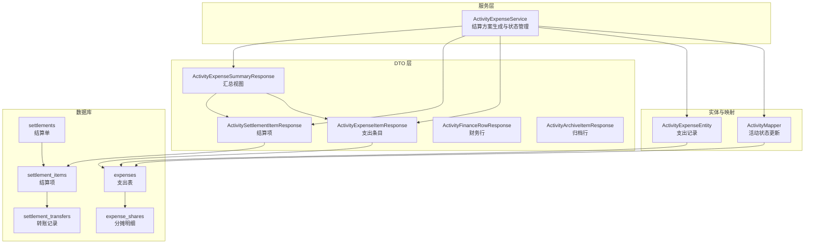
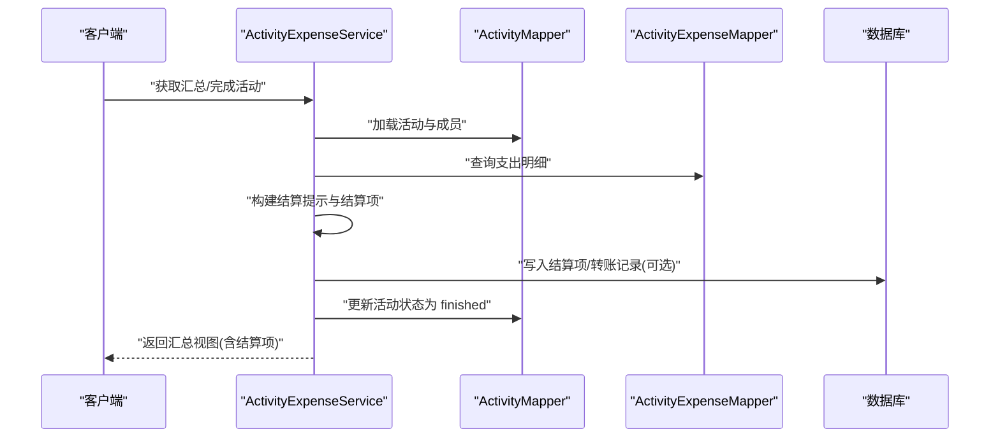
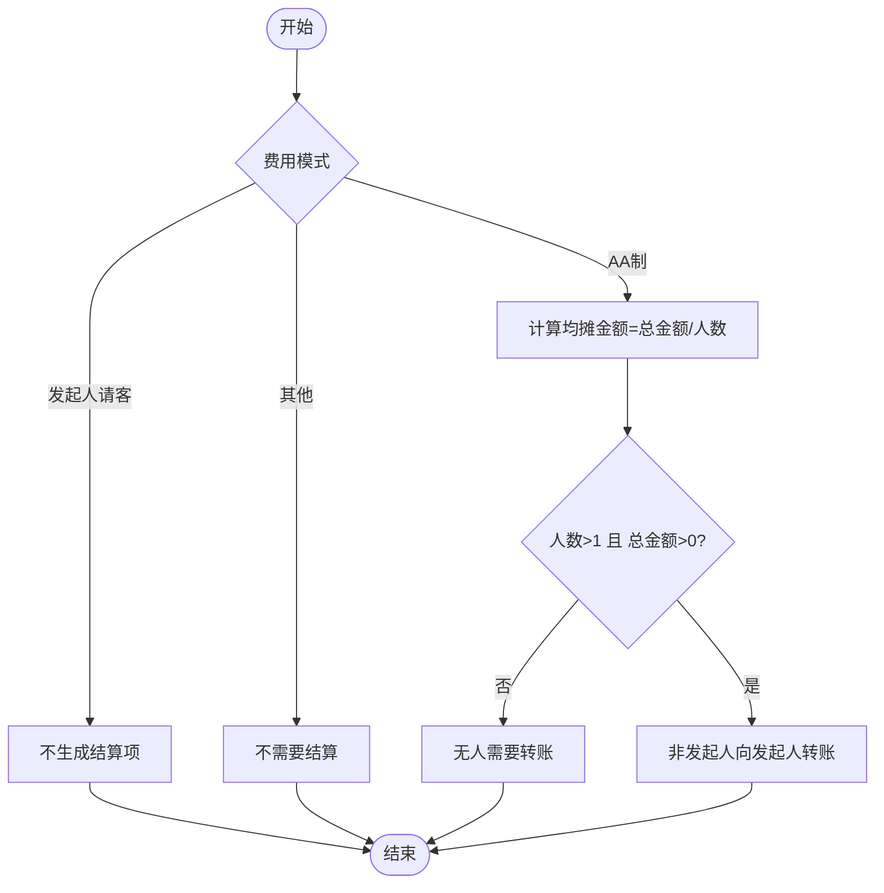
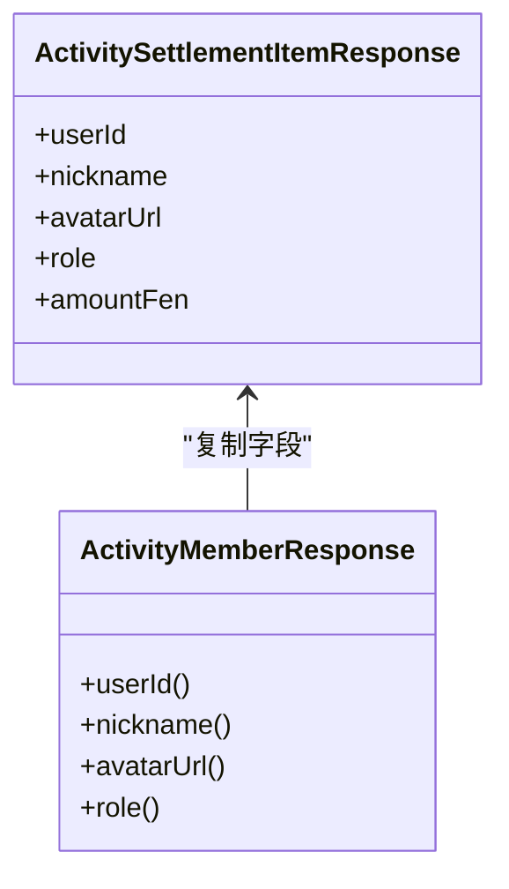
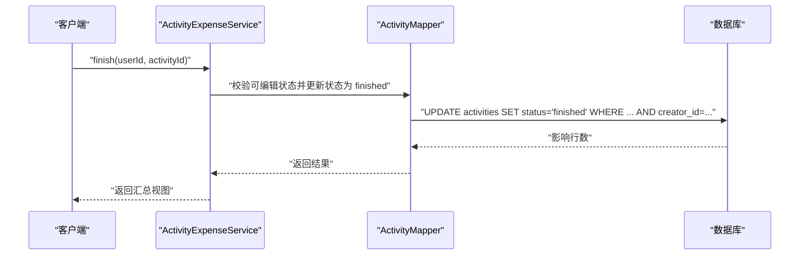
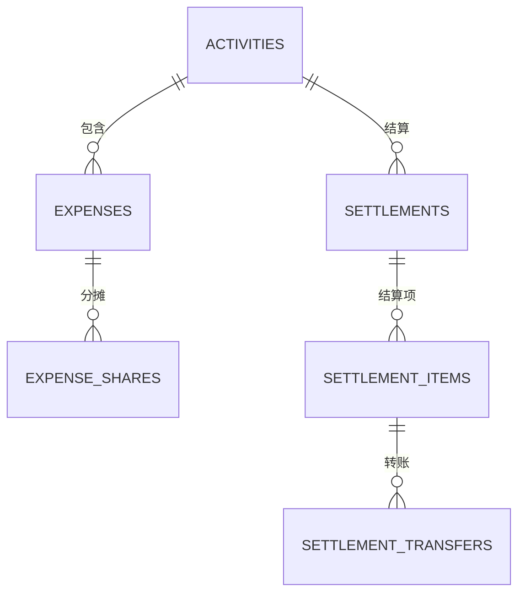
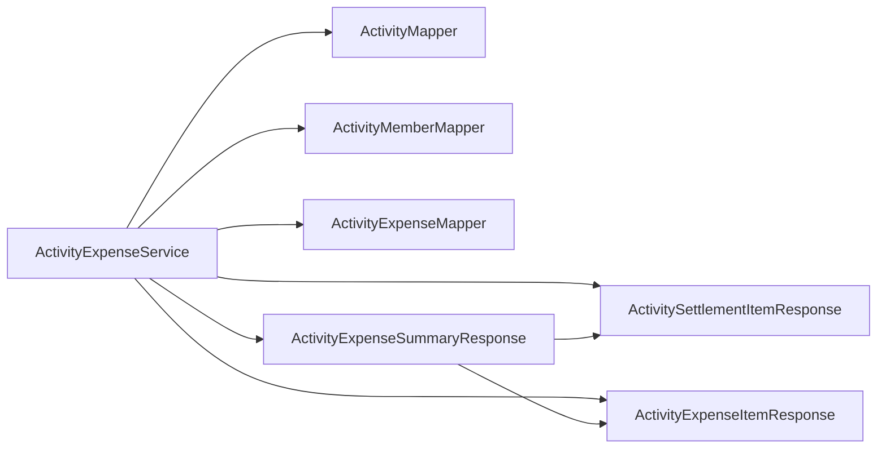

# 结算生成机制

<cite>
**本文引用的文件**
- [ActivityExpenseService.java](file://backend/src/main/java/com/playminipro/activity/service/ActivityExpenseService.java)
- [ActivityExpenseSummaryResponse.java](file://backend/src/main/java/com/playminipro/activity/dto/ActivityExpenseSummaryResponse.java)
- [ActivitySettlementItemResponse.java](file://backend/src/main/java/com/playminipro/activity/dto/ActivitySettlementItemResponse.java)
- [ActivityExpenseItemResponse.java](file://backend/src/main/java/com/playminipro/activity/dto/ActivityExpenseItemResponse.java)
- [ActivityFinanceRowResponse.java](file://backend/src/main/java/com/playminipro/activity/dto/ActivityFinanceRowResponse.java)
- [ActivityArchiveItemResponse.java](file://backend/src/main/java/com/playminipro/activity/dto/ActivityArchiveItemResponse.java)
- [ActivityExpenseEntity.java](file://backend/src/main/java/com/playminipro/activity/entity/ActivityExpenseEntity.java)
- [ActivityMapper.java](file://backend/src/main/java/com/playminipro/activity/mapper/ActivityMapper.java)
- [V3__add_activity_expenses.sql](file://backend/src/main/resources/db/migration/V3__add_activity_expenses.sql)
- [05-PostgreSQL建表.sql](file://doc/05-PostgreSQL建表.sql)
</cite>

## 目录
1. [引言](#引言)
2. [项目结构](#项目结构)
3. [核心组件](#核心组件)
4. [架构总览](#架构总览)
5. [详细组件分析](#详细组件分析)
6. [依赖关系分析](#依赖关系分析)
7. [性能考虑](#性能考虑)
8. [故障排查指南](#故障排查指南)
9. [结论](#结论)
10. [附录](#附录)

## 引言
本文件系统性阐述“结算生成机制”的技术实现，覆盖以下要点：
- 结算方案生成算法：债务计算、净额统计、转账方向确定
- 不同费用模式下的结算逻辑：AA制等额分摊、发起人请客的特殊处理、无结算活动的状态判断
- 结算项构建流程：参与者遍历、金额计算、角色区分、头像昵称处理
- 活动完成状态管理：状态变更验证、并发控制、事务一致性保证
- 结算方案输出格式与数据结构设计：完整字段定义与示例路径
- 错误处理机制与边界条件

## 项目结构
围绕结算相关的核心模块与文件如下：
- 服务层：负责业务编排与结算方案生成
- DTO 层：承载对外输出的数据结构
- 实体与映射：持久化层支撑
- 数据库迁移脚本：定义结算相关表结构

图表来源
- [ActivityExpenseService.java:37-167](file://backend/src/main/java/com/playminipro/activity/service/ActivityExpenseService.java#L37-L167)
- [ActivityExpenseSummaryResponse.java:1-19](file://backend/src/main/java/com/playminipro/activity/dto/ActivityExpenseSummaryResponse.java#L1-L19)
- [ActivitySettlementItemResponse.java](file://backend/src/main/java/com/playminipro/activity/dto/ActivitySettlementItemResponse.java)
- [ActivityExpenseItemResponse.java:1-10](file://backend/src/main/java/com/playminipro/activity/dto/ActivityExpenseItemResponse.java#L1-L10)
- [ActivityFinanceRowResponse.java:1-14](file://backend/src/main/java/com/playminipro/activity/dto/ActivityFinanceRowResponse.java#L1-L14)
- [ActivityArchiveItemResponse.java:1-23](file://backend/src/main/java/com/playminipro/activity/dto/ActivityArchiveItemResponse.java#L1-L23)
- [ActivityExpenseEntity.java:1-35](file://backend/src/main/java/com/playminipro/activity/entity/ActivityExpenseEntity.java#L1-L35)
- [ActivityMapper.java:56-90](file://backend/src/main/java/com/playminipro/activity/mapper/ActivityMapper.java#L56-L90)
- [V3__add_activity_expenses.sql](file://backend/src/main/resources/db/migration/V3__add_activity_expenses.sql)
- [05-PostgreSQL建表.sql:255-315](file://doc/05-PostgreSQL建表.sql#L255-L315)

章节来源
- [ActivityExpenseService.java:37-167](file://backend/src/main/java/com/playminipro/activity/service/ActivityExpenseService.java#L37-L167)
- [ActivityExpenseSummaryResponse.java:1-19](file://backend/src/main/java/com/playminipro/activity/dto/ActivityExpenseSummaryResponse.java#L1-L19)
- [ActivitySettlementItemResponse.java](file://backend/src/main/java/com/playminipro/activity/dto/ActivitySettlementItemResponse.java)
- [ActivityExpenseItemResponse.java:1-10](file://backend/src/main/java/com/playminipro/activity/dto/ActivityExpenseItemResponse.java#L1-L10)
- [ActivityFinanceRowResponse.java:1-14](file://backend/src/main/java/com/playminipro/activity/dto/ActivityFinanceRowResponse.java#L1-L14)
- [ActivityArchiveItemResponse.java:1-23](file://backend/src/main/java/com/playminipro/activity/dto/ActivityArchiveItemResponse.java#L1-L23)
- [ActivityExpenseEntity.java:1-35](file://backend/src/main/java/com/playminipro/activity/entity/ActivityExpenseEntity.java#L1-L35)
- [ActivityMapper.java:56-90](file://backend/src/main/java/com/playminipro/activity/mapper/ActivityMapper.java#L56-L90)
- [V3__add_activity_expenses.sql](file://backend/src/main/resources/db/migration/V3__add_activity_expenses.sql)
- [05-PostgreSQL建表.sql:255-315](file://doc/05-PostgreSQL建表.sql#L255-L315)

## 核心组件
- 结算服务（ActivityExpenseService）
  - 职责：生成结算方案、构建结算项、拼装汇总响应、驱动活动状态变更
  - 关键方法：getSummary、finish、buildSettlementNote、buildSettlementItems
- DTO 集合
  - ActivityExpenseSummaryResponse：汇总视图，包含活动基础信息、费用模式、参与人数、总金额、可编辑性、结算提示、支出条目列表、结算项列表
  - ActivitySettlementItemResponse：单个结算项，包含用户标识、昵称、头像、角色、应付金额
  - ActivityExpenseItemResponse：单笔支出条目，包含名称、金额、付款人信息
  - ActivityFinanceRowResponse：财务行展示，用于列表页或报表
  - ActivityArchiveItemResponse：归档项展示，包含结算标签与高亮信息
- 实体与映射
  - ActivityExpenseEntity：支出记录实体
  - ActivityMapper：活动状态更新（取消、完成）等

章节来源
- [ActivityExpenseService.java:37-167](file://backend/src/main/java/com/playminipro/activity/service/ActivityExpenseService.java#L37-L167)
- [ActivityExpenseSummaryResponse.java:1-19](file://backend/src/main/java/com/playminipro/activity/dto/ActivityExpenseSummaryResponse.java#L1-L19)
- [ActivitySettlementItemResponse.java](file://backend/src/main/java/com/playminipro/activity/dto/ActivitySettlementItemResponse.java)
- [ActivityExpenseItemResponse.java:1-10](file://backend/src/main/java/com/playminipro/activity/dto/ActivityExpenseItemResponse.java#L1-L10)
- [ActivityFinanceRowResponse.java:1-14](file://backend/src/main/java/com/playminipro/activity/dto/ActivityFinanceRowResponse.java#L1-L14)
- [ActivityArchiveItemResponse.java:1-23](file://backend/src/main/java/com/playminipro/activity/dto/ActivityArchiveItemResponse.java#L1-L23)
- [ActivityExpenseEntity.java:1-35](file://backend/src/main/java/com/playminipro/activity/entity/ActivityExpenseEntity.java#L1-L35)
- [ActivityMapper.java:56-90](file://backend/src/main/java/com/playminipro/activity/mapper/ActivityMapper.java#L56-L90)

## 架构总览
结算生成贯穿“查询—校验—计算—落库—状态推进”闭环，核心流程如下：

图表来源
- [ActivityExpenseService.java:37-167](file://backend/src/main/java/com/playminipro/activity/service/ActivityExpenseService.java#L37-L167)
- [ActivityMapper.java:56-90](file://backend/src/main/java/com/playminipro/activity/mapper/ActivityMapper.java#L56-L90)
- [V3__add_activity_expenses.sql](file://backend/src/main/resources/db/migration/V3__add_activity_expenses.sql)
- [05-PostgreSQL建表.sql:255-315](file://doc/05-PostgreSQL建表.sql#L255-L315)

## 详细组件分析

### 结算方案生成算法
- 债务计算
  - AA 制：每人均摊 = 总金额 / 参与人数；仅非发起人承担分摊金额
  - 发起人请客：不产生净债务，仅记录记账
  - 无结算：当费用模式非 AA 且非发起人请客时，不生成结算项
- 净额统计
  - 对每个成员，累计其应收款（被他人代付）与应付款（自己代付），最终得到净额
  - 当前实现中，AA 制直接按均摊金额填充结算项，未进行跨成员抵消
- 转账方向确定
  - AA 制：非发起人向发起人转账；若无人需转账则提示“无人需要转账”
  - 发起人请客：提示“由发起人请客，记账只做留档”
  - 无结算：提示“当前活动不需要结算”

图表来源
- [ActivityExpenseService.java:130-167](file://backend/src/main/java/com/playminipro/activity/service/ActivityExpenseService.java#L130-L167)

章节来源
- [ActivityExpenseService.java:130-167](file://backend/src/main/java/com/playminipro/activity/service/ActivityExpenseService.java#L130-L167)

### 结算项构建过程
- 参与者遍历：从已加入成员集合中逐个处理
- 金额计算：AA 制下，非发起人承担均摊金额；发起人承担 0
- 角色区分：通过成员角色字段区分发起人与普通成员
- 头像昵称处理：从成员信息中提取头像与昵称，用于前端展示
- 输出结构：ActivitySettlementItemResponse 包含用户标识、昵称、头像、角色、应付金额

图表来源
- [ActivitySettlementItemResponse.java](file://backend/src/main/java/com/playminipro/activity/dto/ActivitySettlementItemResponse.java)
- [ActivityExpenseService.java:143-166](file://backend/src/main/java/com/playminipro/activity/service/ActivityExpenseService.java#L143-L166)

章节来源
- [ActivityExpenseService.java:143-166](file://backend/src/main/java/com/playminipro/activity/service/ActivityExpenseService.java#L143-L166)
- [ActivitySettlementItemResponse.java](file://backend/src/main/java/com/playminipro/activity/dto/ActivitySettlementItemResponse.java)

### 活动完成状态管理
- 状态变更验证
  - 仅活动处于可编辑状态时允许完成
  - 完成操作由活动创建者触发
- 并发控制
  - 使用数据库层面的条件更新（WHERE 条件匹配）降低并发冲突概率
- 事务一致性保证
  - 完成操作在事务内执行，确保状态更新与后续结算生成原子性

图表来源
- [ActivityExpenseService.java:60-80](file://backend/src/main/java/com/playminipro/activity/service/ActivityExpenseService.java#L60-L80)
- [ActivityMapper.java:70-78](file://backend/src/main/java/com/playminipro/activity/mapper/ActivityMapper.java#L70-L78)

章节来源
- [ActivityExpenseService.java:60-80](file://backend/src/main/java/com/playminipro/activity/service/ActivityExpenseService.java#L60-L80)
- [ActivityMapper.java:70-78](file://backend/src/main/java/com/playminipro/activity/mapper/ActivityMapper.java#L70-L78)

### 结算方案输出格式与数据结构设计
- 汇总视图（ActivityExpenseSummaryResponse）
  - 字段：活动 ID、标题、状态、费用模式、已参与人数、总金额（分）、是否创建者视角、是否可添加支出、是否可完成、结算提示、支出条目列表、结算项列表
  - 示例路径：[ActivityExpenseSummaryResponse.java:1-19](file://backend/src/main/java/com/playminipro/activity/dto/ActivityExpenseSummaryResponse.java#L1-L19)
- 结算项（ActivitySettlementItemResponse）
  - 字段：用户 ID、昵称、头像 URL、角色、应付金额（分）
  - 示例路径：[ActivitySettlementItemResponse.java](file://backend/src/main/java/com/playminipro/activity/dto/ActivitySettlementItemResponse.java)
- 支出条目（ActivityExpenseItemResponse）
  - 字段：条目 ID、名称、金额（分）、付款人用户 ID、付款人昵称
  - 示例路径：[ActivityExpenseItemResponse.java:1-10](file://backend/src/main/java/com/playminipro/activity/dto/ActivityExpenseItemResponse.java#L1-L10)
- 财务行（ActivityFinanceRowResponse）
  - 字段：活动 ID、角色、状态、开始时间、已参与人数、总金额（分）、费用模式
  - 示例路径：[ActivityFinanceRowResponse.java:1-14](file://backend/src/main/java/com/playminipro/activity/dto/ActivityFinanceRowResponse.java#L1-L14)
- 归档行（ActivityArchiveItemResponse）
  - 字段：活动 ID、标题、类型名、角色、状态、模式、开始时间、角色时间、地点、参与人数、最大人数、总金额（分）、费用模式、结算标签、高亮、概览
  - 示例路径：[ActivityArchiveItemResponse.java:1-23](file://backend/src/main/java/com/playminipro/activity/dto/ActivityArchiveItemResponse.java#L1-L23)

章节来源
- [ActivityExpenseSummaryResponse.java:1-19](file://backend/src/main/java/com/playminipro/activity/dto/ActivityExpenseSummaryResponse.java#L1-L19)
- [ActivitySettlementItemResponse.java](file://backend/src/main/java/com/playminipro/activity/dto/ActivitySettlementItemResponse.java)
- [ActivityExpenseItemResponse.java:1-10](file://backend/src/main/java/com/playminipro/activity/dto/ActivityExpenseItemResponse.java#L1-L10)
- [ActivityFinanceRowResponse.java:1-14](file://backend/src/main/java/com/playminipro/activity/dto/ActivityFinanceRowResponse.java#L1-L14)
- [ActivityArchiveItemResponse.java:1-23](file://backend/src/main/java/com/playminipro/activity/dto/ActivityArchiveItemResponse.java#L1-L23)

### 数据模型与持久化
- 支出与分摊
  - expenses：记录每笔支出
  - expense_shares：记录每笔支出的分摊明细
- 结算与转账
  - settlements：记录一次活动的结算单
  - settlement_items：记录结算项（每人应付/应收）
  - settlement_transfers：记录实际转账记录（可选）

图表来源
- [V3__add_activity_expenses.sql](file://backend/src/main/resources/db/migration/V3__add_activity_expenses.sql)
- [05-PostgreSQL建表.sql:255-315](file://doc/05-PostgreSQL建表.sql#L255-L315)

章节来源
- [V3__add_activity_expenses.sql](file://backend/src/main/resources/db/migration/V3__add_activity_expenses.sql)
- [05-PostgreSQL建表.sql:255-315](file://doc/05-PostgreSQL建表.sql#L255-L315)

## 依赖关系分析
- 服务层依赖
  - ActivityExpenseService 依赖 ActivityMapper、ActivityMemberMapper、ActivityExpenseMapper
  - 通过事务注解保证状态更新与结算生成的一致性
- DTO 依赖
  - 汇总视图聚合结算项与支出条目，作为对外统一输出
- 数据层依赖
  - 支出与分摊表、结算与转账表形成闭环，支持后续转账执行与审计

图表来源
- [ActivityExpenseService.java:31-40](file://backend/src/main/java/com/playminipro/activity/service/ActivityExpenseService.java#L31-L40)
- [ActivityExpenseSummaryResponse.java:1-19](file://backend/src/main/java/com/playminipro/activity/dto/ActivityExpenseSummaryResponse.java#L1-L19)
- [ActivitySettlementItemResponse.java](file://backend/src/main/java/com/playminipro/activity/dto/ActivitySettlementItemResponse.java)
- [ActivityExpenseItemResponse.java:1-10](file://backend/src/main/java/com/playminipro/activity/dto/ActivityExpenseItemResponse.java#L1-L10)

章节来源
- [ActivityExpenseService.java:31-40](file://backend/src/main/java/com/playminipro/activity/service/ActivityExpenseService.java#L31-L40)
- [ActivityExpenseSummaryResponse.java:1-19](file://backend/src/main/java/com/playminipro/activity/dto/ActivityExpenseSummaryResponse.java#L1-L19)
- [ActivitySettlementItemResponse.java](file://backend/src/main/java/com/playminipro/activity/dto/ActivitySettlementItemResponse.java)
- [ActivityExpenseItemResponse.java:1-10](file://backend/src/main/java/com/playminipro/activity/dto/ActivityExpenseItemResponse.java#L1-L10)

## 性能考虑
- 查询优化
  - 使用索引覆盖常见查询路径（如按活动 ID 查询支出、按用户查询分摊）
- 计算复杂度
  - 结算项构建为 O(n)，n 为参与人数；整体复杂度受成员数量限制
- 事务范围
  - 将状态更新与结算生成置于同一事务，避免中间态导致的重复计算
- 分页与缓存
  - 对于历史活动列表，建议结合分页与缓存策略减少重复计算

## 故障排查指南
- 常见问题
  - 无法完成活动：检查活动状态是否可编辑、调用者是否为创建者
  - 结算项为空：确认费用模式是否为 AA 制、参与人数与总金额是否满足条件
  - 金额异常：核对 AA 均摊计算与成员角色判定
- 排查步骤
  - 核对活动状态更新 SQL 的 WHERE 条件
  - 核对结算项构建逻辑中的角色与金额分支
  - 检查数据库索引是否存在缺失
- 错误处理
  - 在服务层捕获并转换为统一的业务异常，避免泄露底层细节
  - 对并发更新失败进行重试或提示用户重试

章节来源
- [ActivityExpenseService.java:60-80](file://backend/src/main/java/com/playminipro/activity/service/ActivityExpenseService.java#L60-L80)
- [ActivityMapper.java:70-78](file://backend/src/main/java/com/playminipro/activity/mapper/ActivityMapper.java#L70-L78)

## 结论
本结算生成机制以 AA 制为核心，辅以发起人请客与无结算场景，通过清晰的 DTO 输出与严谨的事务控制，实现了从数据到视图的完整闭环。当前实现采用直通式均摊，未引入跨成员抵消；未来可扩展为更复杂的净额算法与转账计划生成。

## 附录
- 示例路径参考
  - 结算提示构建：[ActivityExpenseService.java:130-141](file://backend/src/main/java/com/playminipro/activity/service/ActivityExpenseService.java#L130-L141)
  - 结算项构建：[ActivityExpenseService.java:143-166](file://backend/src/main/java/com/playminipro/activity/service/ActivityExpenseService.java#L143-L166)
  - 活动完成状态更新：[ActivityMapper.java:70-78](file://backend/src/main/java/com/playminipro/activity/mapper/ActivityMapper.java#L70-L78)
  - 数据库建表脚本：[05-PostgreSQL建表.sql:255-315](file://doc/05-PostgreSQL建表.sql#L255-L315)