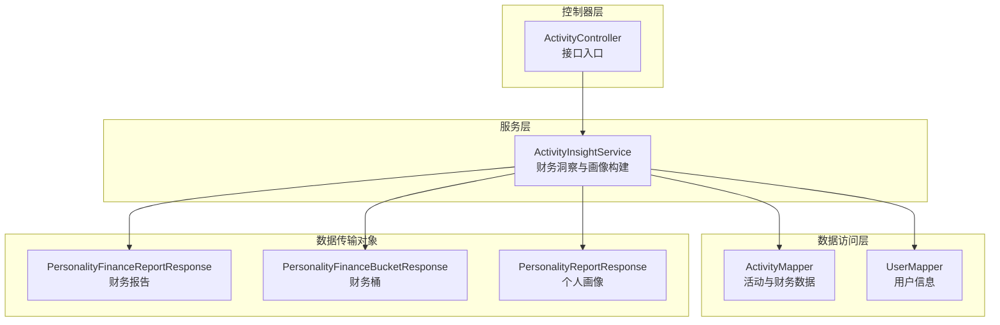
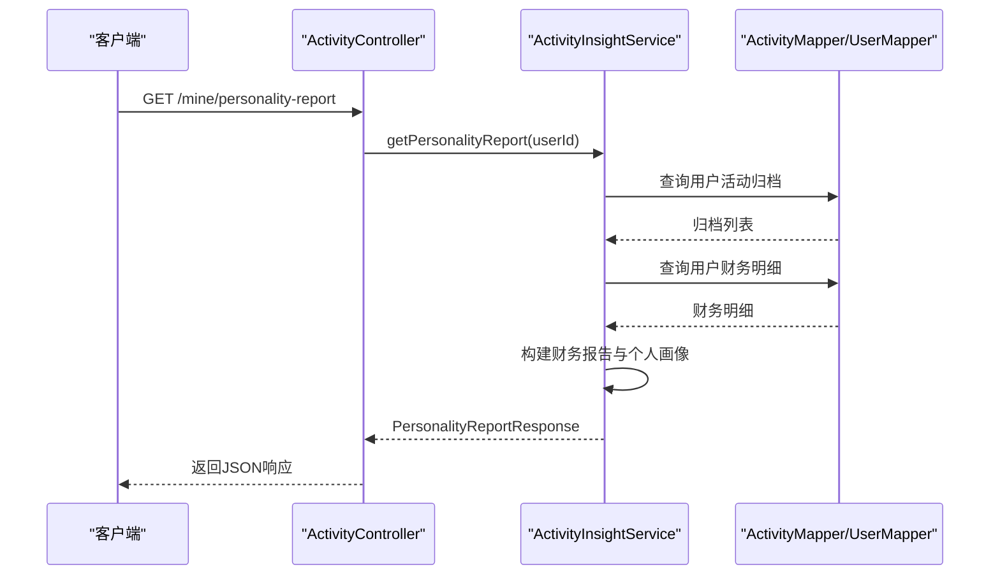
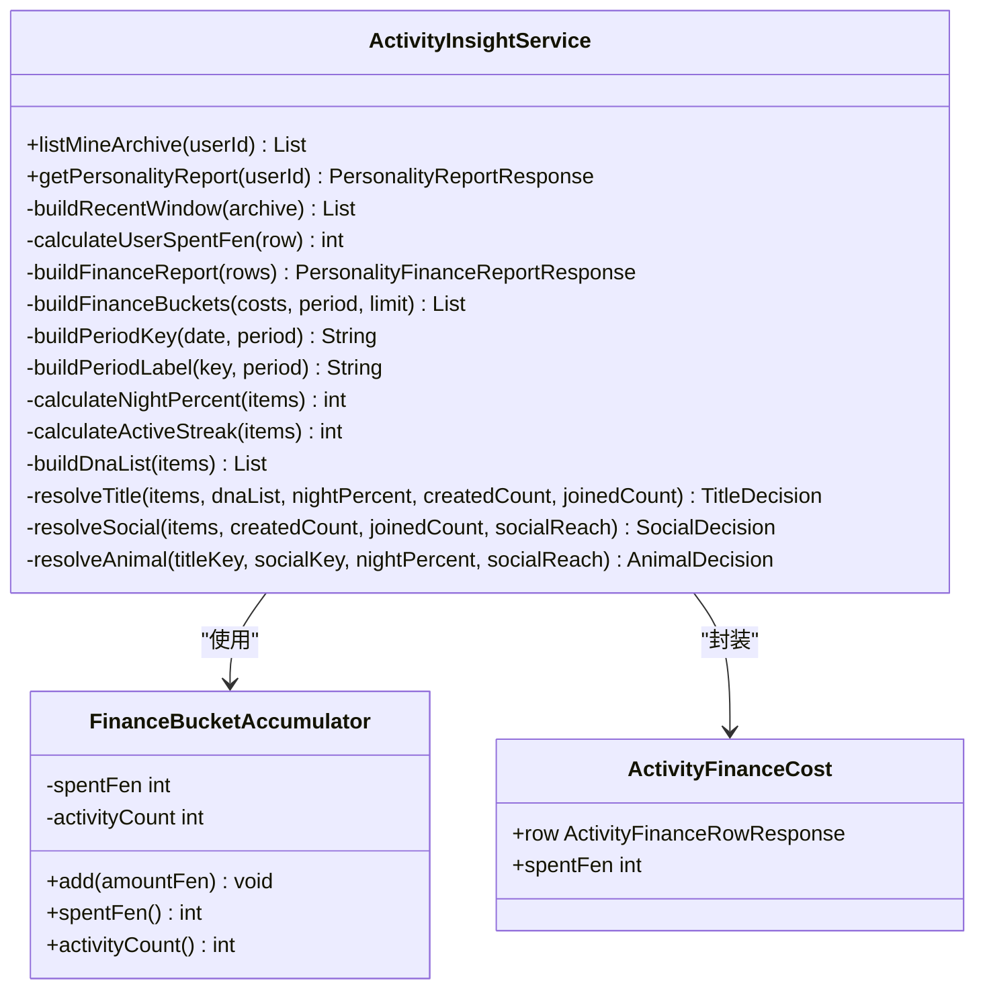
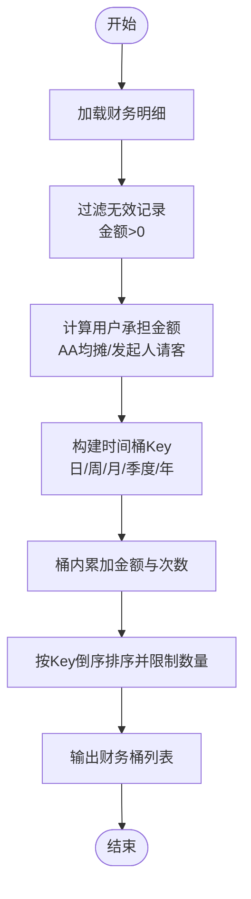
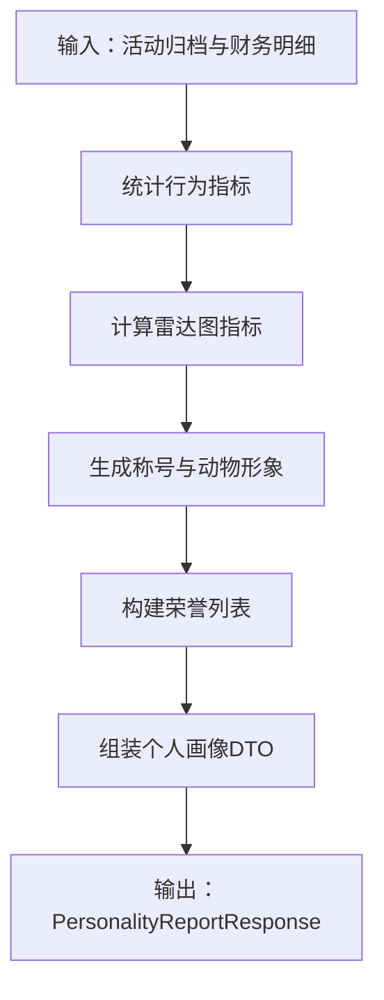
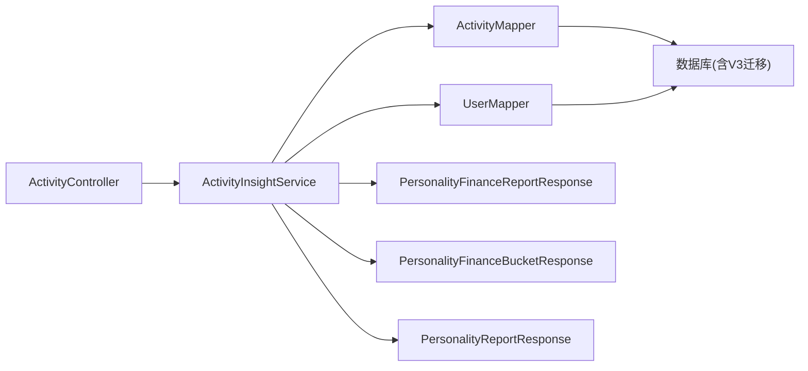

# 财务洞察分析

<cite>
**本文引用的文件**
- [ActivityInsightService.java](file://backend/src/main/java/com/playminipro/activity/service/ActivityInsightService.java)
- [PersonalityFinanceReportResponse.java](file://backend/src/main/java/com/playminipro/activity/dto/PersonalityFinanceReportResponse.java)
- [PersonalityFinanceBucketResponse.java](file://backend/src/main/java/com/playminipro/activity/dto/PersonalityFinanceBucketResponse.java)
- [PersonalityReportResponse.java](file://backend/src/main/java/com/playminipro/activity/dto/PersonalityReportResponse.java)
- [ActivityController.java](file://backend/src/main/java/com/playminipro/activity/controller/ActivityController.java)
- [ActivityMapper.java](file://backend/src/main/java/com/playminipro/activity/mapper/ActivityMapper.java)
- [UserMapper.java](file://backend/src/main/java/com/playminipro/auth/mapper/UserMapper.java)
- [V3__add_activity_expenses.sql](file://backend/src/main/resources/db/migration/V3__add_activity_expenses.sql)
- [application.yml](file://backend/src/main/resources/application.yml)
</cite>

## 目录
1. [简介](#简介)
2. [项目结构](#项目结构)
3. [核心组件](#核心组件)
4. [架构概览](#架构概览)
5. [详细组件分析](#详细组件分析)
6. [依赖分析](#依赖分析)
7. [性能考虑](#性能考虑)
8. [故障排除指南](#故障排除指南)
9. [结论](#结论)
10. [附录](#附录)

## 简介
本技术文档聚焦于财务洞察分析模块，围绕个人财务报告的生成逻辑展开，涵盖消费统计指标、支出趋势分析、社交影响评估，并深入阐述财务桶分析算法（消费分层分类、频次统计、金额分布计算）。同时，文档解释个人财务画像的构建过程（历史数据分析、行为模式识别、社交关系影响量化）、财务洞察的数据聚合策略（时间维度处理、参与度权重计算、排名算法实现），以及财务报告的输出格式与可视化指标。最后提供SQL查询示例与性能优化建议，包含大数据量处理的分页策略与缓存机制。

## 项目结构
财务洞察分析模块位于后端Java工程中，采用分层架构：
- 控制器层：对外暴露REST接口，负责接收请求与返回响应
- 服务层：核心业务逻辑，包括财务洞察与个人画像构建
- 数据访问层：通过Mapper访问数据库，提供活动与用户数据
- DTO层：定义前后端交互的数据结构

图表来源
- [ActivityController.java](file://backend/src/main/java/com/playminipro/activity/controller/ActivityController.java)
- [ActivityInsightService.java](file://backend/src/main/java/com/playminipro/activity/service/ActivityInsightService.java)
- [ActivityMapper.java](file://backend/src/main/java/com/playminipro/activity/mapper/ActivityMapper.java)
- [UserMapper.java](file://backend/src/main/java/com/playminipro/auth/mapper/UserMapper.java)
- [PersonalityFinanceReportResponse.java](file://backend/src/main/java/com/playminipro/activity/dto/PersonalityFinanceReportResponse.java)
- [PersonalityFinanceBucketResponse.java](file://backend/src/main/java/com/playminipro/activity/dto/PersonalityFinanceBucketResponse.java)
- [PersonalityReportResponse.java](file://backend/src/main/java/com/playminipro/activity/dto/PersonalityReportResponse.java)

章节来源
- [ActivityController.java:69-77](file://backend/src/main/java/com/playminipro/activity/controller/ActivityController.java#L69-L77)
- [ActivityInsightService.java:41-111](file://backend/src/main/java/com/playminipro/activity/service/ActivityInsightService.java#L41-L111)

## 核心组件
- 财务洞察服务（ActivityInsightService）：负责拉取用户活动归档、财务明细，构建财务报告与个人画像，执行时间窗口筛选、社交影响评估与桶分析。
- 财务报告DTO（PersonalityFinanceReportResponse）：封装总支出、AA支出、请客支出及多粒度时间桶（日/周/月/季度/年）。
- 财务桶DTO（PersonalityFinanceBucketResponse）：表示每个时间桶内的消费金额与活动次数。
- 个人画像DTO（PersonalityReportResponse）：整合昵称、评分、标签、雷达图、荣誉等综合画像。
- 控制器（ActivityController）：提供/mine/personality-report等接口，调用服务层生成报告。

章节来源
- [ActivityInsightService.java:47-111](file://backend/src/main/java/com/playminipro/activity/service/ActivityInsightService.java#L47-L111)
- [PersonalityFinanceReportResponse.java:5-19](file://backend/src/main/java/com/playminipro/activity/dto/PersonalityFinanceReportResponse.java#L5-L19)
- [PersonalityFinanceBucketResponse.java:3-10](file://backend/src/main/java/com/playminipro/activity/dto/PersonalityFinanceBucketResponse.java#L3-L10)
- [PersonalityReportResponse.java:5-30](file://backend/src/main/java/com/playminipro/activity/dto/PersonalityReportResponse.java#L5-L30)
- [ActivityController.java:69-77](file://backend/src/main/java/com/playminipro/activity/controller/ActivityController.java#L69-L77)

## 架构概览
财务洞察分析的端到端流程如下：

图表来源
- [ActivityController.java:74-77](file://backend/src/main/java/com/playminipro/activity/controller/ActivityController.java#L74-L77)
- [ActivityInsightService.java:47-111](file://backend/src/main/java/com/playminipro/activity/service/ActivityInsightService.java#L47-L111)
- [ActivityMapper.java](file://backend/src/main/java/com/playminipro/activity/mapper/ActivityMapper.java)
- [UserMapper.java](file://backend/src/main/java/com/playminipro/auth/mapper/UserMapper.java)

## 详细组件分析

### 财务洞察服务（ActivityInsightService）
- 时间窗口筛选：默认取最近30天的活动，若无数据则取最近若干条作为兜底。
- 财务明细处理：基于每笔活动的总金额、参与人数、角色与结算方式，计算用户实际承担金额。
- 财务报告生成：汇总总支出、AA支出、请客支出，并按日/周/月/季度/年构建消费桶。
- 社交影响评估：统计发起/参与数量、带动到场人次、连续活跃天数、夜场占比等。
- 个人画像构建：综合雷达图指标、称号与动物形象、荣誉等形成完整画像。

图表来源
- [ActivityInsightService.java:27-489](file://backend/src/main/java/com/playminipro/activity/service/ActivityInsightService.java#L27-L489)

章节来源
- [ActivityInsightService.java:134-144](file://backend/src/main/java/com/playminipro/activity/service/ActivityInsightService.java#L134-L144)
- [ActivityInsightService.java:164-196](file://backend/src/main/java/com/playminipro/activity/service/ActivityInsightService.java#L164-L196)
- [ActivityInsightService.java:212-233](file://backend/src/main/java/com/playminipro/activity/service/ActivityInsightService.java#L212-L233)
- [ActivityInsightService.java:235-260](file://backend/src/main/java/com/playminipro/activity/service/ActivityInsightService.java#L235-L260)
- [ActivityInsightService.java:262-295](file://backend/src/main/java/com/playminipro/activity/service/ActivityInsightService.java#L262-L295)
- [ActivityInsightService.java:297-315](file://backend/src/main/java/com/playminipro/activity/service/ActivityInsightService.java#L297-L315)
- [ActivityInsightService.java:317-366](file://backend/src/main/java/com/playminipro/activity/service/ActivityInsightService.java#L317-L366)

### 财务桶分析算法
- 输入：每笔活动的财务明细（总金额、参与人数、角色、结算方式、开始时间）。
- 计算用户承担金额：
  - AA模式：按参与人数均摊
  - 发起人请客/指定请客：由发起人承担整单
  - 其他情况：视为0
- 时间桶构建：
  - 日：以日期字符串为key
  - 周：ISO周标识（如2024-W01）
  - 月：年-月（如2024-01）
  - 季度：年-Qn（如2024-Q1）
  - 年：年份字符串
- 聚合规则：
  - 同一时间桶内累加消费金额与活动次数
  - 按key倒序排序并限制返回数量（不同粒度限制不同）

图表来源
- [ActivityInsightService.java:198-210](file://backend/src/main/java/com/playminipro/activity/service/ActivityInsightService.java#L198-L210)
- [ActivityInsightService.java:212-233](file://backend/src/main/java/com/playminipro/activity/service/ActivityInsightService.java#L212-L233)
- [ActivityInsightService.java:235-250](file://backend/src/main/java/com/playminipro/activity/service/ActivityInsightService.java#L235-L250)

章节来源
- [ActivityInsightService.java:198-210](file://backend/src/main/java/com/playminipro/activity/service/ActivityInsightService.java#L198-L210)
- [ActivityInsightService.java:212-233](file://backend/src/main/java/com/playminipro/activity/service/ActivityInsightService.java#L212-L233)
- [ActivityInsightService.java:235-250](file://backend/src/main/java/com/playminipro/activity/service/ActivityInsightService.java#L235-L250)

### 个人财务画像构建
- 行为指标：
  - 发起活动数、参与活动数、带动到场人次、连续活跃天数、夜场占比
- 雷达图指标：组局力、参与度、带动力、落地率、夜场热度、连续性
- 称号与动物形象：根据行为特征自动判定
- 荣誉体系：夜场出勤奖、组局发电机、补位救场王、大桌控场选手、稳定整活选手等

图表来源
- [ActivityInsightService.java:54-69](file://backend/src/main/java/com/playminipro/activity/service/ActivityInsightService.java#L54-L69)
- [ActivityInsightService.java:146-162](file://backend/src/main/java/com/playminipro/activity/service/ActivityInsightService.java#L146-L162)
- [ActivityInsightService.java:317-366](file://backend/src/main/java/com/playminipro/activity/service/ActivityInsightService.java#L317-L366)
- [ActivityInsightService.java:384-405](file://backend/src/main/java/com/playminipro/activity/service/ActivityInsightService.java#L384-L405)

章节来源
- [ActivityInsightService.java:54-69](file://backend/src/main/java/com/playminipro/activity/service/ActivityInsightService.java#L54-L69)
- [ActivityInsightService.java:146-162](file://backend/src/main/java/com/playminipro/activity/service/ActivityInsightService.java#L146-L162)
- [ActivityInsightService.java:317-366](file://backend/src/main/java/com/playminipro/activity/service/ActivityInsightService.java#L317-L366)
- [ActivityInsightService.java:384-405](file://backend/src/main/java/com/playminipro/activity/service/ActivityInsightService.java#L384-L405)

### 财务洞察数据聚合策略
- 时间维度处理：统一以活动开始时间为准，支持日/周/月/季度/年聚合
- 参与度权重：带动到场人次作为社交影响力权重
- 排名算法：综合指标加权计算得分，并转换为百分位

章节来源
- [ActivityInsightService.java:134-144](file://backend/src/main/java/com/playminipro/activity/service/ActivityInsightService.java#L134-L144)
- [ActivityInsightService.java:56-61](file://backend/src/main/java/com/playminipro/activity/service/ActivityInsightService.java#L56-L61)
- [ActivityInsightService.java:60-62](file://backend/src/main/java/com/playminipro/activity/service/ActivityInsightService.java#L60-L62)

### 财务报告输出格式与可视化指标
- 财务报告字段：
  - 总支出（元/分）、AA支出、请客支出
  - 日/周/月/季度/年消费桶列表，每项包含金额与活动次数
- 可视化指标：
  - 雷达图五维指标（组局力、参与度、带动力、落地率、夜场热度、连续性）
  - 称号、动物形象、荣誉、夜场占比、社交标签

章节来源
- [PersonalityFinanceReportResponse.java:5-19](file://backend/src/main/java/com/playminipro/activity/dto/PersonalityFinanceReportResponse.java#L5-L19)
- [PersonalityFinanceBucketResponse.java:3-10](file://backend/src/main/java/com/playminipro/activity/dto/PersonalityFinanceBucketResponse.java#L3-L10)
- [PersonalityReportResponse.java:5-30](file://backend/src/main/java/com/playminipro/activity/dto/PersonalityReportResponse.java#L5-L30)

## 依赖分析
- 控制器依赖服务层，服务层依赖Mapper与UserMapper
- 财务报告与财务桶为DTO，用于跨层传递
- 数据库迁移脚本新增活动费用相关表，支撑财务数据存储

图表来源
- [ActivityController.java](file://backend/src/main/java/com/playminipro/activity/controller/ActivityController.java)
- [ActivityInsightService.java](file://backend/src/main/java/com/playminipro/activity/service/ActivityInsightService.java)
- [ActivityMapper.java](file://backend/src/main/java/com/playminipro/activity/mapper/ActivityMapper.java)
- [UserMapper.java](file://backend/src/main/java/com/playminipro/auth/mapper/UserMapper.java)
- [V3__add_activity_expenses.sql](file://backend/src/main/resources/db/migration/V3__add_activity_expenses.sql)

章节来源
- [ActivityController.java:69-77](file://backend/src/main/java/com/playminipro/activity/controller/ActivityController.java#L69-L77)
- [ActivityInsightService.java:31-39](file://backend/src/main/java/com/playminipro/activity/service/ActivityInsightService.java#L31-L39)
- [V3__add_activity_expenses.sql](file://backend/src/main/resources/db/migration/V3__add_activity_expenses.sql)

## 性能考虑
- 内存一次性分桶：服务层在内存中对财务明细进行轻量分桶，避免多次数据库查询，提升响应速度
- 时间窗口限制：默认仅分析最近30天，减少数据量
- 分页策略：对于归档列表与财务桶，采用限制数量的方式控制输出规模
- 缓存机制：可结合应用配置启用Redis缓存，针对热点用户的个人画像与财务报告进行缓存，设置合理TTL

章节来源
- [ActivityInsightService.java:164-196](file://backend/src/main/java/com/playminipro/activity/service/ActivityInsightService.java#L164-L196)
- [ActivityInsightService.java:134-140](file://backend/src/main/java/com/playminipro/activity/service/ActivityInsightService.java#L134-L140)
- [application.yml](file://backend/src/main/resources/application.yml)

## 故障排除指南
- 权限校验失败：当用户非活动发起人或状态不允许编辑时，服务层抛出业务异常
- 结算模式不匹配：仅线下活动支持费用录入与结算
- 数据缺失：若用户昵称为空，默认显示“你”；若无活动数据，按兜底策略返回少量记录

章节来源
- [ActivityInsightService.java:48-52](file://backend/src/main/java/com/playminipro/activity/service/ActivityInsightService.java#L48-L52)
- [ActivityInsightService.java:91-106](file://backend/src/main/java/com/playminipro/activity/service/ActivityInsightService.java#L91-L106)

## 结论
财务洞察分析模块通过清晰的分层架构与高效的内存分桶算法，实现了对个人财务行为的全面洞察。模块以活动归档与财务明细为核心数据源，结合社交影响评估与时间维度聚合，输出包含消费统计、趋势分析与个人画像的综合报告。通过合理的分页与缓存策略，可在大数据量场景下保持良好性能与用户体验。

## 附录

### SQL查询示例（概念性说明）
以下为财务分析相关的典型查询思路（具体实现以Mapper为准）：
- 拉取用户活动归档与基础信息
- 拉取用户财务明细（按用户聚合）
- 统计AA与请客支出分布
- 按时间粒度（日/周/月/季度/年）聚合消费金额与活动次数

章节来源
- [ActivityInsightService.java:41-50](file://backend/src/main/java/com/playminipro/activity/service/ActivityInsightService.java#L41-L50)
- [ActivityInsightService.java:164-196](file://backend/src/main/java/com/playminipro/activity/service/ActivityInsightService.java#L164-L196)