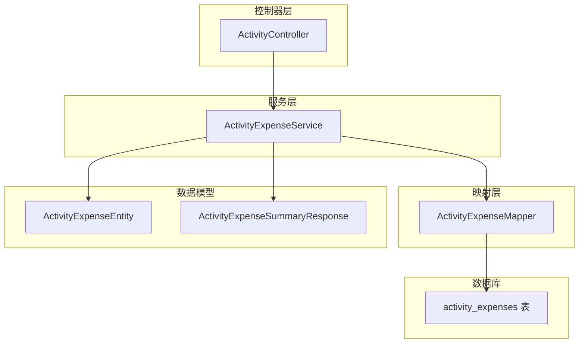
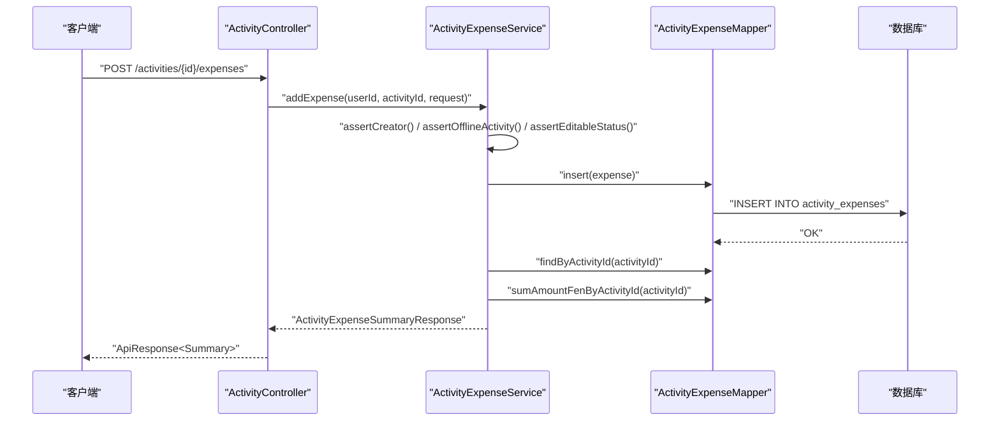
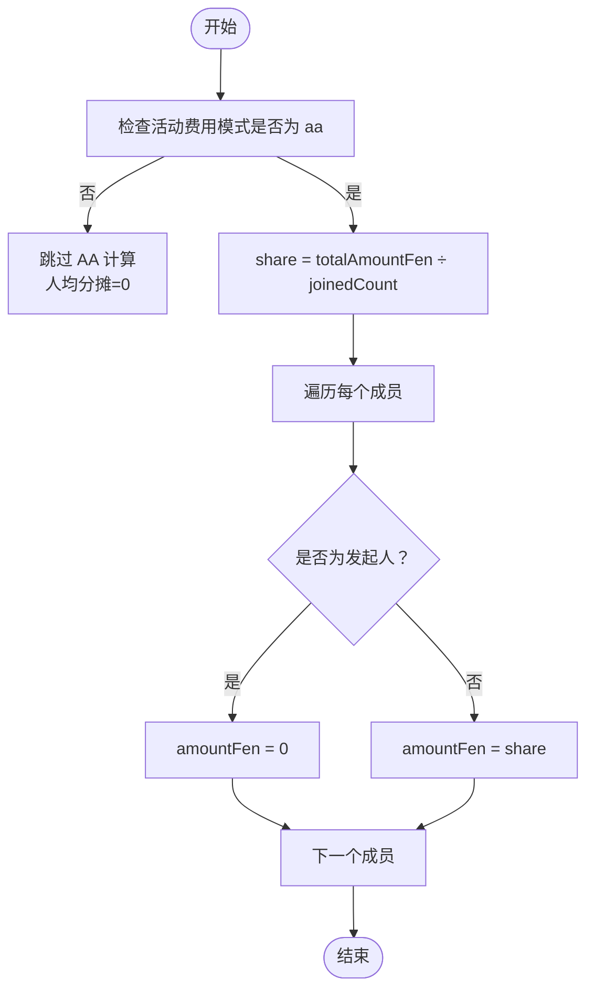
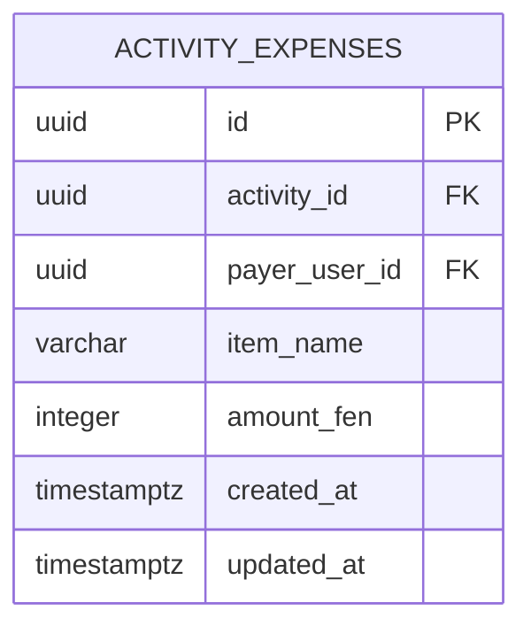
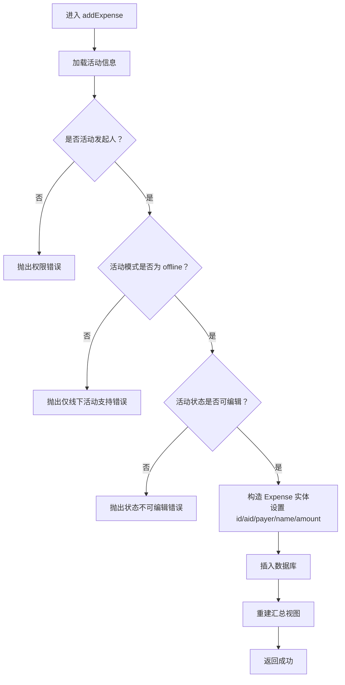
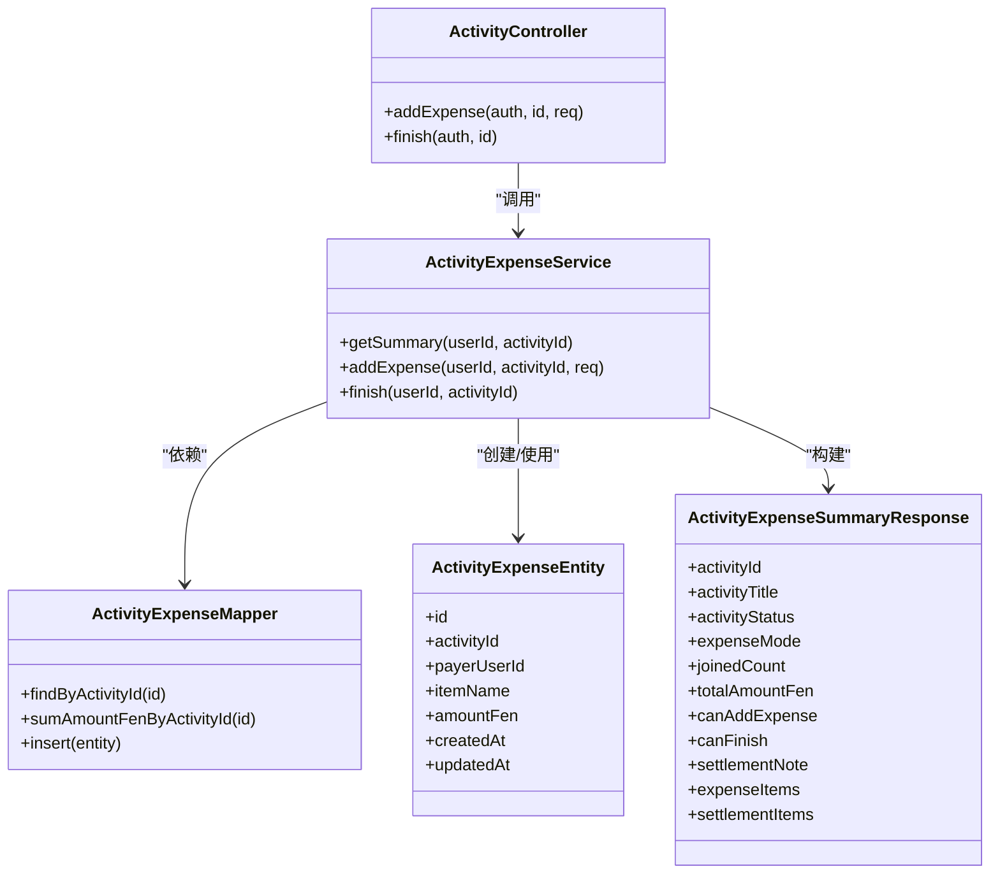

# 费用分摊算法

<cite>
**本文引用的文件**
- [ActivityExpenseService.java](file://backend/src/main/java/com/playminipro/activity/service/ActivityExpenseService.java)
- [ActivityExpenseEntity.java](file://backend/src/main/java/com/playminipro/activity/entity/ActivityExpenseEntity.java)
- [V3__add_activity_expenses.sql](file://backend/src/main/resources/db/migration/V3__add_activity_expenses.sql)
- [ActivityExpenseSummaryResponse.java](file://backend/src/main/java/com/playminipro/activity/dto/ActivityExpenseSummaryResponse.java)
- [ActivityExpenseMapper.java](file://backend/src/main/java/com/playminipro/activity/mapper/ActivityExpenseMapper.java)
- [ActivityController.java](file://backend/src/main/java/com/playminipro/activity/controller/ActivityController.java)
- [AddActivityExpenseRequest.java](file://backend/src/main/java/com/playminipro/activity/dto/AddActivityExpenseRequest.java)
- [202606012206工程改进设计.md](file://doc/改进文档/202606012206工程改进设计.md)
</cite>

## 目录
1. [简介](#简介)
2. [项目结构](#项目结构)
3. [核心组件](#核心组件)
4. [架构概览](#架构概览)
5. [详细组件分析](#详细组件分析)
6. [依赖关系分析](#依赖关系分析)
7. [性能考量](#性能考量)
8. [故障排查指南](#故障排查指南)
9. [结论](#结论)
10. [附录](#附录)

## 简介
本文件聚焦于“费用分摊算法”的技术实现，围绕 AA 制平分的数学计算、数据模型设计、业务规则校验与边界处理展开。系统采用“线下活动 + AA 分摊”的模式，所有金额以“分”为最小单位存储，前端统一格式化为“元”。AA 分摊的核心在于：
- 总金额除以参与人数的整除计算（单位为分）
- 余数处理策略（当前实现未显式处理余数分配）
- 成员权限与活动状态的严格校验
- 并发安全与事务一致性保障

## 项目结构
后端采用分层架构，费用相关能力集中在 activity 模块：
- 控制器层：接收请求并调用服务层
- 服务层：执行业务规则与分摊计算
- 映射层：访问数据库，聚合费用与成员信息
- 实体与 DTO：定义费用记录与对外响应结构
- 数据库迁移：定义费用表结构与约束

图表来源
- [ActivityController.java:103-112](file://backend/src/main/java/com/playminipro/activity/controller/ActivityController.java#L103-L112)
- [ActivityExpenseService.java:37-58](file://backend/src/main/java/com/playminipro/activity/service/ActivityExpenseService.java#L37-L58)
- [ActivityExpenseMapper.java](file://backend/src/main/java/com/playminipro/activity/mapper/ActivityExpenseMapper.java)
- [ActivityExpenseEntity.java:1-35](file://backend/src/main/java/com/playminipro/activity/entity/ActivityExpenseEntity.java#L1-L35)
- [V3__add_activity_expenses.sql:1-12](file://backend/src/main/resources/db/migration/V3__add_activity_expenses.sql#L1-L12)

章节来源
- [ActivityController.java:103-112](file://backend/src/main/java/com/playminipro/activity/controller/ActivityController.java#L103-L112)
- [ActivityExpenseService.java:37-58](file://backend/src/main/java/com/playminipro/activity/service/ActivityExpenseService.java#L37-L58)
- [V3__add_activity_expenses.sql:1-12](file://backend/src/main/resources/db/migration/V3__add_activity_expenses.sql#L1-L12)

## 核心组件
- 费用实体：封装费用记录的主键、活动关联、付款人、事项名称、金额（分）、时间戳
- 费用服务：负责费用添加的业务校验与汇总视图构建；AA 分摊的份额计算在汇总视图中完成
- 费用映射：提供按活动查询费用明细、求和、插入等操作
- 汇总响应：对外输出活动费用概览、可添加费用标识、是否可结束、结算说明、结算项列表等

章节来源
- [ActivityExpenseEntity.java:1-35](file://backend/src/main/java/com/playminipro/activity/entity/ActivityExpenseEntity.java#L1-L35)
- [ActivityExpenseService.java:108-167](file://backend/src/main/java/com/playminipro/activity/service/ActivityExpenseService.java#L108-L167)
- [ActivityExpenseMapper.java](file://backend/src/main/java/com/playminipro/activity/mapper/ActivityExpenseMapper.java)
- [ActivityExpenseSummaryResponse.java:1-19](file://backend/src/main/java/com/playminipro/activity/dto/ActivityExpenseSummaryResponse.java#L1-L19)

## 架构概览
费用分摊流程从控制器入口进入，经服务层进行权限与状态校验，随后写入费用记录并重新构建汇总视图。

图表来源
- [ActivityController.java:103-112](file://backend/src/main/java/com/playminipro/activity/controller/ActivityController.java#L103-L112)
- [ActivityExpenseService.java:42-58](file://backend/src/main/java/com/playminipro/activity/service/ActivityExpenseService.java#L42-L58)
- [ActivityExpenseMapper.java](file://backend/src/main/java/com/playminipro/activity/mapper/ActivityExpenseMapper.java)

## 详细组件分析

### AA 制平分算法实现
- 数学实现位置：汇总视图构建中的“人均分摊金额”计算
- 计算方式：总金额（分）整除参与人数（取整），不进行额外的四舍五入或余数分配
- 角色差异：仅非发起人（非 creator）获得应分摊金额，发起人不承担分摊

图表来源
- [ActivityExpenseService.java:143-166](file://backend/src/main/java/com/playminipro/activity/service/ActivityExpenseService.java#L143-L166)

章节来源
- [ActivityExpenseService.java:143-166](file://backend/src/main/java/com/playminipro/activity/service/ActivityExpenseService.java#L143-L166)

### 数据模型设计
- 主键：UUID 字符串，使用随机 UUID 生成
- 金额字段：整型“分”，数据库层约束金额必须大于 0
- 时间戳：创建与更新时间均为带时区的时间戳，默认值为当前时间
- 外键关系：活动与用户外键约束，删除级联保证数据一致性

图表来源
- [V3__add_activity_expenses.sql:1-12](file://backend/src/main/resources/db/migration/V3__add_activity_expenses.sql#L1-L12)

章节来源
- [ActivityExpenseEntity.java:1-35](file://backend/src/main/java/com/playminipro/activity/entity/ActivityExpenseEntity.java#L1-L35)
- [V3__add_activity_expenses.sql:1-12](file://backend/src/main/resources/db/migration/V3__add_activity_expenses.sql#L1-L12)

### 费用添加的业务规则验证
- 发起人权限：仅活动发起人可添加费用
- 活动类型限制：仅“线下活动”支持费用登记
- 活动状态限制：已结束或已取消的活动禁止编辑费用
- 请求参数：金额以“分”为单位，事项名称去除前后空白

图表来源
- [ActivityExpenseService.java:42-58](file://backend/src/main/java/com/playminipro/activity/service/ActivityExpenseService.java#L42-L58)
- [ActivityExpenseService.java:91-106](file://backend/src/main/java/com/playminipro/activity/service/ActivityExpenseService.java#L91-L106)

章节来源
- [ActivityExpenseService.java:42-58](file://backend/src/main/java/com/playminipro/activity/service/ActivityExpenseService.java#L42-L58)
- [ActivityExpenseService.java:91-106](file://backend/src/main/java/com/playminipro/activity/service/ActivityExpenseService.java#L91-L106)
- [AddActivityExpenseRequest.java](file://backend/src/main/java/com/playminipro/activity/dto/AddActivityExpenseRequest.java)

### 边界条件与异常处理
- 参与人数为 0 或总金额为 0：汇总视图中结算说明提示“无人需要转账”
- 非 aa 模式：人均分摊为 0，结算说明提示“当前活动不需要结算”
- 金额为负或 0：数据库层约束拒绝插入
- 已结束/已取消活动：禁止新增费用

章节来源
- [ActivityExpenseService.java:130-141](file://backend/src/main/java/com/playminipro/activity/service/ActivityExpenseService.java#L130-L141)
- [V3__add_activity_expenses.sql:9-9](file://backend/src/main/resources/db/migration/V3__add_activity_expenses.sql#L9-L9)

### 并发安全与事务控制
- 事务边界：费用添加与汇总重建在单事务内完成，确保一致性
- 并发冲突：数据库层面通过唯一索引与约束防止重复与非法数据
- 前端展示：汇总视图一次性拉取费用明细与总金额，避免多次查询带来的不一致

章节来源
- [ActivityExpenseService.java:42-58](file://backend/src/main/java/com/playminipro/activity/service/ActivityExpenseService.java#L42-L58)
- [202606012206工程改进设计.md:154-159](file://doc/改进文档/202606012206工程改进设计.md#L154-L159)

## 依赖关系分析
服务层依赖映射层进行数据访问，控制器依赖服务层提供业务能力；实体与 DTO 承载数据结构，数据库迁移脚本定义底层表结构。

图表来源
- [ActivityController.java:103-112](file://backend/src/main/java/com/playminipro/activity/controller/ActivityController.java#L103-L112)
- [ActivityExpenseService.java:37-58](file://backend/src/main/java/com/playminipro/activity/service/ActivityExpenseService.java#L37-L58)
- [ActivityExpenseMapper.java](file://backend/src/main/java/com/playminipro/activity/mapper/ActivityExpenseMapper.java)
- [ActivityExpenseEntity.java:1-35](file://backend/src/main/java/com/playminipro/activity/entity/ActivityExpenseEntity.java#L1-L35)
- [ActivityExpenseSummaryResponse.java:1-19](file://backend/src/main/java/com/playminipro/activity/dto/ActivityExpenseSummaryResponse.java#L1-L19)

## 性能考量
- 单次查询：汇总视图通过一次查询获取费用明细与总金额，避免多次往返
- 索引利用：按活动与创建时间倒序的复合索引，支持高效分页与排序
- 内存分桶：改进设计文档指出在内存中进行多维度分桶，减少多次聚合查询
- 返回裁剪：仅返回最近若干桶，避免长期用户一次性返回过多历史数据

章节来源
- [202606012206工程改进设计.md:154-159](file://doc/改进文档/202606012206工程改进设计.md#L154-L159)

## 故障排查指南
- 权限错误：仅活动发起人可添加费用
- 类型错误：仅“线下活动”支持费用登记
- 状态错误：已结束或已取消的活动无法编辑费用
- 参数错误：金额需为正整数（分），事项名称去除空白
- 数据库错误：违反金额约束或外键约束导致插入失败

章节来源
- [ActivityExpenseService.java:91-106](file://backend/src/main/java/com/playminipro/activity/service/ActivityExpenseService.java#L91-L106)
- [V3__add_activity_expenses.sql:9-9](file://backend/src/main/resources/db/migration/V3__add_activity_expenses.sql#L9-L9)

## 结论
本系统在“线下活动 + AA 分摊”场景下，提供了清晰的业务规则与稳定的算法实现。AA 分摊采用整除法计算人均金额，未引入余数分配机制；通过严格的权限与状态校验、事务与数据库约束保障数据一致性；通过索引与内存分桶优化提升查询性能。未来如需更精细的余数分配策略，可在汇总视图构建阶段引入余数分配逻辑，并保持金额总和与数据库校验的一致性。

## 附录
- 接口路径与方法
  - 添加费用：POST /activities/{id}/expenses
  - 结束活动并生成汇总：POST /activities/{id}/finish
- 关键字段说明
  - 金额单位：分（Integer）
  - 时间戳：带时区（OffsetDateTime）
  - 主键：UUID（String）

章节来源
- [ActivityController.java:103-112](file://backend/src/main/java/com/playminipro/activity/controller/ActivityController.java#L103-L112)
- [ActivityExpenseEntity.java:1-35](file://backend/src/main/java/com/playminipro/activity/entity/ActivityExpenseEntity.java#L1-L35)
- [V3__add_activity_expenses.sql:1-12](file://backend/src/main/resources/db/migration/V3__add_activity_expenses.sql#L1-L12)