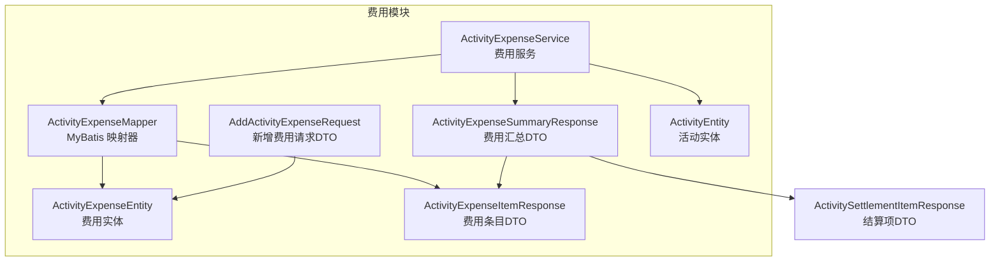
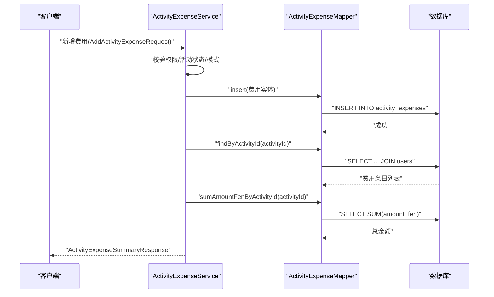
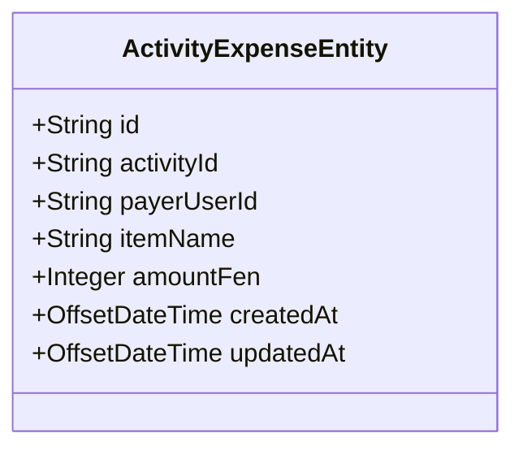
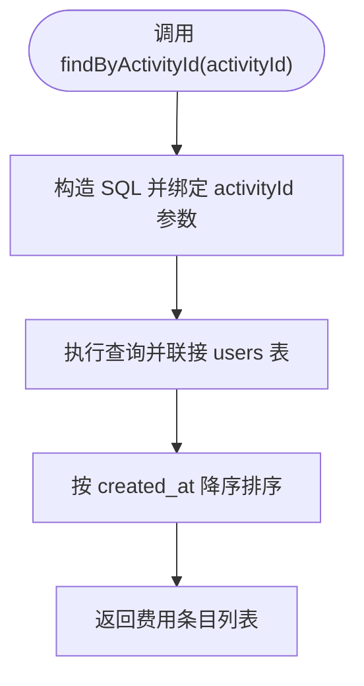
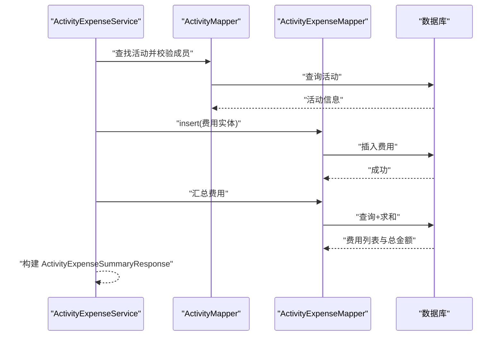
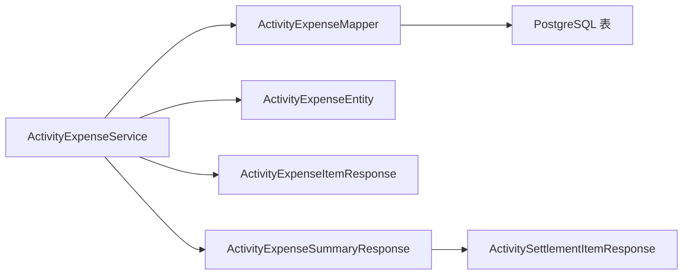
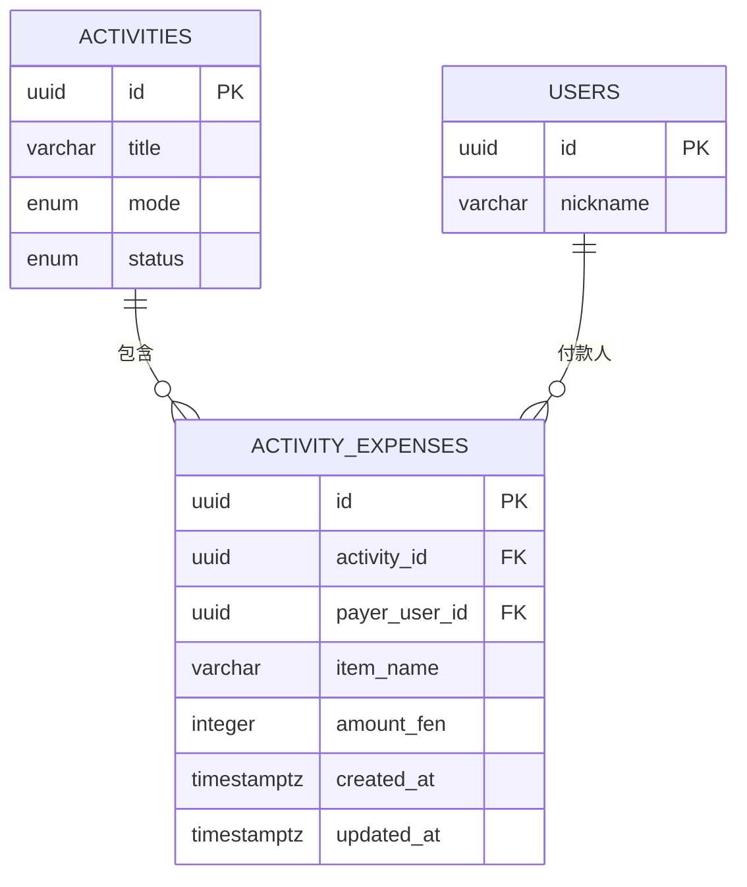

# 费用数据模型

<cite>
**本文引用的文件**
- [ActivityExpenseEntity.java](file://backend/src/main/java/com/playminipro/activity/entity/ActivityExpenseEntity.java)
- [ActivityExpenseMapper.java](file://backend/src/main/java/com/playminipro/activity/mapper/ActivityExpenseMapper.java)
- [ActivityExpenseItemResponse.java](file://backend/src/main/java/com/playminipro/activity/dto/ActivityExpenseItemResponse.java)
- [ActivityExpenseSummaryResponse.java](file://backend/src/main/java/com/playminipro/activity/dto/ActivityExpenseSummaryResponse.java)
- [AddActivityExpenseRequest.java](file://backend/src/main/java/com/playminipro/activity/dto/AddActivityExpenseRequest.java)
- [ActivityExpenseService.java](file://backend/src/main/java/com/playminipro/activity/service/ActivityExpenseService.java)
- [V3__add_activity_expenses.sql](file://backend/src/main/resources/db/migration/V3__add_activity_expenses.sql)
- [04-数据库设计文档.md](file://doc/04-数据库设计文档.md)
- [05-PostgreSQL建表.sql](file://doc/05-PostgreSQL建表.sql)
- [ActivitySettlementItemResponse.java](file://backend/src/main/java/com/playminipro/activity/dto/ActivitySettlementItemResponse.java)
- [ActivityEntity.java](file://backend/src/main/java/com/playminipro/activity/entity/ActivityEntity.java)
</cite>

## 目录
1. [简介](#简介)
2. [项目结构](#项目结构)
3. [核心组件](#核心组件)
4. [架构总览](#架构总览)
5. [详细组件分析](#详细组件分析)
6. [依赖分析](#依赖分析)
7. [性能考虑](#性能考虑)
8. [故障排查指南](#故障排查指南)
9. [结论](#结论)
10. [附录](#附录)

## 简介
本文件围绕“费用数据模型”进行系统性设计说明，覆盖费用实体的数据结构、映射器的数据库操作、响应DTO的数据传输格式、费用数据生命周期管理（创建/修改时间、软删除机制）、数据库表结构与索引策略，并给出事务边界与并发控制的最佳实践。文档同时提供数据库表结构图与ER关系图，以及DDL与索引优化建议，帮助开发者与运维人员准确理解与实施该模块。

## 项目结构
费用相关的核心代码位于后端模块的 activity 子包中，主要由以下层次组成：
- 实体层：ActivityExpenseEntity 定义费用实体的字段与Getter/Setter
- 映射层：ActivityExpenseMapper 使用 MyBatis 注解编写 SQL，完成插入、查询与汇总
- DTO 层：ActivityExpenseItemResponse、ActivityExpenseSummaryResponse、AddActivityExpenseRequest、ActivitySettlementItemResponse 定义数据传输格式与请求校验
- 服务层：ActivityExpenseService 提供费用汇总构建、新增费用、活动完结等业务逻辑，并通过事务保证一致性

**图表来源**
- [ActivityExpenseEntity.java:1-35](file://backend/src/main/java/com/playminipro/activity/entity/ActivityExpenseEntity.java#L1-L35)
- [ActivityExpenseMapper.java:1-41](file://backend/src/main/java/com/playminipro/activity/mapper/ActivityExpenseMapper.java#L1-L41)
- [ActivityExpenseItemResponse.java:1-10](file://backend/src/main/java/com/playminipro/activity/dto/ActivityExpenseItemResponse.java#L1-L10)
- [ActivityExpenseSummaryResponse.java:1-19](file://backend/src/main/java/com/playminipro/activity/dto/ActivityExpenseSummaryResponse.java#L1-L19)
- [AddActivityExpenseRequest.java:1-12](file://backend/src/main/java/com/playminipro/activity/dto/AddActivityExpenseRequest.java#L1-L12)
- [ActivityExpenseService.java:1-167](file://backend/src/main/java/com/playminipro/activity/service/ActivityExpenseService.java#L1-L167)
- [ActivitySettlementItemResponse.java:1-10](file://backend/src/main/java/com/playminipro/activity/dto/ActivitySettlementItemResponse.java#L1-L10)
- [ActivityEntity.java:1-91](file://backend/src/main/java/com/playminipro/activity/entity/ActivityEntity.java#L1-L91)

**章节来源**
- [ActivityExpenseEntity.java:1-35](file://backend/src/main/java/com/playminipro/activity/entity/ActivityExpenseEntity.java#L1-L35)
- [ActivityExpenseMapper.java:1-41](file://backend/src/main/java/com/playminipro/activity/mapper/ActivityExpenseMapper.java#L1-L41)
- [ActivityExpenseService.java:1-167](file://backend/src/main/java/com/playminipro/activity/service/ActivityExpenseService.java#L1-L167)

## 核心组件
- 费用实体（ActivityExpenseEntity）
  - 字段：id、activityId、payerUserId、itemName、amountFen、createdAt、updatedAt
  - 类型：id/activityId/payerUserId 为字符串；金额以“分”存储为整数；时间使用带时区的时间戳
- 费用映射器（ActivityExpenseMapper）
  - 插入：将实体写入 activity_expenses 表，字段与实体一一对应
  - 查询：按活动ID联接 users 表返回费用条目列表（含付款人昵称）
  - 汇总：按活动ID求和 amount_fen
- 费用响应DTO（ActivityExpenseItemResponse）
  - 字段：id、itemName、amountFen、payerUserId、payerNickname
  - 用途：对外返回单条费用明细
- 费用汇总DTO（ActivityExpenseSummaryResponse）
  - 字段：activityId、activityTitle、activityStatus、expenseMode、joinedCount、totalAmountFen、creatorView、canAddExpense、canFinish、settlementNote、expenseItems、settlementItems
  - 用途：对外返回活动费用与结算概览
- 新增费用请求DTO（AddActivityExpenseRequest）
  - 校验：itemName 非空且长度限制；amountFen 必填且大于0
- 结算项DTO（ActivitySettlementItemResponse）
  - 字段：userId、nickname、avatarUrl、role、amountFen
  - 用途：描述每位成员在结算中的应收/应付金额

**章节来源**
- [ActivityExpenseEntity.java:5-35](file://backend/src/main/java/com/playminipro/activity/entity/ActivityExpenseEntity.java#L5-L35)
- [ActivityExpenseMapper.java:13-40](file://backend/src/main/java/com/playminipro/activity/mapper/ActivityExpenseMapper.java#L13-L40)
- [ActivityExpenseItemResponse.java:3-9](file://backend/src/main/java/com/playminipro/activity/dto/ActivityExpenseItemResponse.java#L3-L9)
- [ActivityExpenseSummaryResponse.java:5-18](file://backend/src/main/java/com/playminipro/activity/dto/ActivityExpenseSummaryResponse.java#L5-L18)
- [AddActivityExpenseRequest.java:8-11](file://backend/src/main/java/com/playminipro/activity/dto/AddActivityExpenseRequest.java#L8-L11)
- [ActivitySettlementItemResponse.java:3-9](file://backend/src/main/java/com/playminipro/activity/dto/ActivitySettlementItemResponse.java#L3-L9)

## 架构总览
费用模块遵循“实体-映射器-服务-DTO”的分层设计，服务层负责业务规则与事务边界，映射器负责与数据库交互，DTO负责数据传输与序列化。

**图表来源**
- [ActivityExpenseService.java:42-58](file://backend/src/main/java/com/playminipro/activity/service/ActivityExpenseService.java#L42-L58)
- [ActivityExpenseMapper.java:13-40](file://backend/src/main/java/com/playminipro/activity/mapper/ActivityExpenseMapper.java#L13-L40)

## 详细组件分析

### 费用实体（ActivityExpenseEntity）
- 设计要点
  - 主键：id 使用字符串UUID
  - 外键：activityId 引用 activities.id；payerUserId 引用 users.id
  - 字段约束：amount_fen > 0；created_at/updated_at 默认当前时间
  - 时间字段：使用带时区的时间戳，确保跨时区一致性
- 生命周期
  - 创建时间：由数据库默认值填充
  - 修改时间：通过触发器自动更新（见下文“数据库表结构与索引”）

**图表来源**
- [ActivityExpenseEntity.java:5-35](file://backend/src/main/java/com/playminipro/activity/entity/ActivityExpenseEntity.java#L5-L35)

**章节来源**
- [ActivityExpenseEntity.java:5-35](file://backend/src/main/java/com/playminipro/activity/entity/ActivityExpenseEntity.java#L5-L35)

### 费用映射器（ActivityExpenseMapper）
- 插入（insert）
  - SQL 将实体字段映射到 activity_expenses 表，UUID 字段显式转换
- 查询（findByActivityId）
  - 按 activity_id 查询费用条目，并联接 users 表获取付款人昵称
  - 按创建时间倒序排列
- 汇总（sumAmountFenByActivityId）
  - 对 amount_fen 求和，未发生费用时返回 0

**图表来源**
- [ActivityExpenseMapper.java:22-33](file://backend/src/main/java/com/playminipro/activity/mapper/ActivityExpenseMapper.java#L22-L33)

**章节来源**
- [ActivityExpenseMapper.java:13-40](file://backend/src/main/java/com/playminipro/activity/mapper/ActivityExpenseMapper.java#L13-L40)

### 费用响应DTO（ActivityExpenseItemResponse）
- 字段定义与类型
  - id：字符串
  - itemName：字符串
  - amountFen：整数
  - payerUserId：字符串
  - payerNickname：字符串
- 序列化规则
  - 使用 Java record，具备不可变性与紧凑的序列化特性
  - 字段名称与JSON键一致，便于前端解析

**章节来源**
- [ActivityExpenseItemResponse.java:3-9](file://backend/src/main/java/com/playminipro/activity/dto/ActivityExpenseItemResponse.java#L3-L9)

### 费用汇总DTO（ActivityExpenseSummaryResponse）
- 字段定义与类型
  - activityId、activityTitle、activityStatus、expenseMode：字符串
  - joinedCount：整数
  - totalAmountFen：整数
  - creatorView、canAddExpense、canFinish：布尔
  - settlementNote：字符串
  - expenseItems：费用条目列表
  - settlementItems：结算项列表
- 用途
  - 作为服务层构建的统一输出，承载费用与结算概览

**章节来源**
- [ActivityExpenseSummaryResponse.java:5-18](file://backend/src/main/java/com/playminipro/activity/dto/ActivityExpenseSummaryResponse.java#L5-L18)

### 新增费用请求DTO（AddActivityExpenseRequest）
- 校验规则
  - itemName：非空且最大长度限制
  - amountFen：必填且大于0
- 作用
  - 在服务层新增费用前进行参数校验

**章节来源**
- [AddActivityExpenseRequest.java:8-11](file://backend/src/main/java/com/playminipro/activity/dto/AddActivityExpenseRequest.java#L8-L11)

### 服务层（ActivityExpenseService）与事务边界
- 事务注解：@Transactional
- 关键流程
  - 新增费用：校验权限、活动模式与状态，组装实体并插入，随后重新汇总返回
  - 汇总构建：查询成员、费用条目与总金额，拼装 DTO
  - 结算提示与分摊：根据活动模式与参与人数计算分摊金额
- 并发控制
  - 通过服务层事务包裹数据库操作，保证一致性
  - 可结合应用层锁或数据库层面的行级锁策略（如需要）

**图表来源**
- [ActivityExpenseService.java:37-58](file://backend/src/main/java/com/playminipro/activity/service/ActivityExpenseService.java#L37-L58)
- [ActivityExpenseMapper.java:13-40](file://backend/src/main/java/com/playminipro/activity/mapper/ActivityExpenseMapper.java#L13-L40)

**章节来源**
- [ActivityExpenseService.java:20-167](file://backend/src/main/java/com/playminipro/activity/service/ActivityExpenseService.java#L20-L167)

## 依赖分析
- 组件耦合
  - Service 依赖 Mapper 与 Entity，负责业务编排
  - Mapper 依赖数据库表结构，提供 CRUD 与聚合查询
  - DTO 仅用于数据传输，无持久化依赖
- 外部依赖
  - PostgreSQL（UUID、TIMESTAMPTZ、CHECK 约束、索引）
  - MyBatis（注解式 SQL）

**图表来源**
- [ActivityExpenseService.java:23-35](file://backend/src/main/java/com/playminipro/activity/service/ActivityExpenseService.java#L23-L35)
- [ActivityExpenseMapper.java:1-11](file://backend/src/main/java/com/playminipro/activity/mapper/ActivityExpenseMapper.java#L1-L11)
- [ActivityExpenseEntity.java:1-35](file://backend/src/main/java/com/playminipro/activity/entity/ActivityExpenseEntity.java#L1-L35)
- [ActivityExpenseItemResponse.java:1-10](file://backend/src/main/java/com/playminipro/activity/dto/ActivityExpenseItemResponse.java#L1-L10)
- [ActivityExpenseSummaryResponse.java:1-19](file://backend/src/main/java/com/playminipro/activity/dto/ActivityExpenseSummaryResponse.java#L1-L19)
- [ActivitySettlementItemResponse.java:1-10](file://backend/src/main/java/com/playminipro/activity/dto/ActivitySettlementItemResponse.java#L1-L10)

**章节来源**
- [ActivityExpenseService.java:23-35](file://backend/src/main/java/com/playminipro/activity/service/ActivityExpenseService.java#L23-L35)
- [ActivityExpenseMapper.java:1-11](file://backend/src/main/java/com/playminipro/activity/mapper/ActivityExpenseMapper.java#L1-L11)

## 性能考虑
- 索引策略
  - 按活动维度查询：在 activity_id 上建立复合索引，包含 created_at 降序，有利于按时间倒序分页与高频查询
  - 按付款人维度：在 payer_user_id 建立索引，便于按付款人统计
- 查询优化
  - 使用 LIMIT/offset 或基于 created_at 的游标分页，避免大偏移量扫描
  - 聚合查询尽量在数据库侧完成，减少网络往返
- 事务与并发
  - 将新增费用与后续汇总放在同一事务中，避免中间态
  - 对高并发场景可考虑行级锁或乐观锁策略（视具体需求）

**章节来源**
- [V3__add_activity_expenses.sql:12-12](file://backend/src/main/resources/db/migration/V3__add_activity_expenses.sql#L12-L12)
- [ActivityExpenseMapper.java:22-40](file://backend/src/main/java/com/playminipro/activity/mapper/ActivityExpenseMapper.java#L22-L40)

## 故障排查指南
- 常见错误与定位
  - 参数校验失败：检查 AddActivityExpenseRequest 的校验注解是否生效
  - 权限不足：确认调用者是否为活动成员或创建者
  - 活动状态不允许编辑：检查活动状态是否为 finished 或 cancelled
  - 外键约束失败：确认 activity_id 与 payerUserId 是否存在且合法
- 日志与监控
  - 记录服务层事务开始/结束与关键 SQL
  - 监控慢查询与索引命中情况

**章节来源**
- [ActivityExpenseService.java:79-106](file://backend/src/main/java/com/playminipro/activity/service/ActivityExpenseService.java#L79-L106)
- [AddActivityExpenseRequest.java:8-11](file://backend/src/main/java/com/playminipro/activity/dto/AddActivityExpenseRequest.java#L8-L11)

## 结论
费用数据模型以清晰的实体-映射器-服务-DTO 分层实现，结合数据库的 UUID 主键、外键约束与索引策略，满足了按活动维度的费用管理与汇总需求。通过服务层事务与严格的参数校验，保障了数据一致性与业务规则的正确执行。建议在生产环境中持续关注索引命中率与慢查询，必要时引入分页游标与缓存策略以进一步提升性能。

## 附录

### 数据库表结构设计与DDL
- 表：activity_expenses
  - 字段与约束
    - id：UUID 主键
    - activity_id：UUID，NOT NULL，REFERENCES activities(id) ON DELETE CASCADE
    - payer_user_id：UUID，NOT NULL，REFERENCES users(id)
    - item_name：VARCHAR(64)，NOT NULL
    - amount_fen：INTEGER，NOT NULL，CHECK(amount_fen > 0)
    - created_at：TIMESTAMPTZ，默认 NOW()
    - updated_at：TIMESTAMPTZ，默认 NOW()
  - 索引
    - idx_activity_expenses_activity_created(activity_id, created_at DESC)

**图表来源**
- [V3__add_activity_expenses.sql:1-12](file://backend/src/main/resources/db/migration/V3__add_activity_expenses.sql#L1-L12)

**章节来源**
- [V3__add_activity_expenses.sql:1-12](file://backend/src/main/resources/db/migration/V3__add_activity_expenses.sql#L1-L12)

### 数据库表结构与索引（参考完整建表脚本）
- 完整建表与索引参考（PostgreSQL）
  - users、activities、activity_members、invitation_links、activity_invites、invite_events、activity_view_logs、activity_rsvp_stats、expenses、expense_shares、settlements、settlement_items、settlement_transfers、user_stats、user_type_stats、user_relations、ranking_snapshots
  - 触发器：set_updated_at 自动更新 updated_at
  - 枚举类型：用户状态、活动模式、活动状态、费用模式、结算状态、成员角色、邀请状态、事件类型、拒绝原因、费用状态、结算角色、转账状态、排行类型、时间范围类型

**章节来源**
- [05-PostgreSQL建表.sql:1-411](file://doc/05-PostgreSQL建表.sql#L1-L411)

### 软删除机制说明
- 当前 activity_expenses 表未实现软删除字段（如 deleted_at 或 status），删除行为通过外键级联删除（ON DELETE CASCADE）实现
- 如需软删除，建议增加 deleted_at 或 status 字段，并在查询时过滤已删除记录

**章节来源**
- [V3__add_activity_expenses.sql:1-12](file://backend/src/main/resources/db/migration/V3__add_activity_expenses.sql#L1-L12)

### 数据完整性约束与并发控制最佳实践
- 数据完整性
  - 主键：UUID
  - 外键：activity_id → activities(id)、payer_user_id → users(id)
  - 检查约束：amount_fen > 0
- 并发控制
  - 服务层使用 @Transactional 保证事务边界
  - 高并发场景可引入行级锁或乐观锁
- 事务边界
  - 新增费用与汇总应在同一事务中执行，避免中间态
  - 活动状态变更与费用新增应保持原子性

**章节来源**
- [ActivityExpenseService.java:42-58](file://backend/src/main/java/com/playminipro/activity/service/ActivityExpenseService.java#L42-L58)
- [V3__add_activity_expenses.sql:1-12](file://backend/src/main/resources/db/migration/V3__add_activity_expenses.sql#L1-L12)