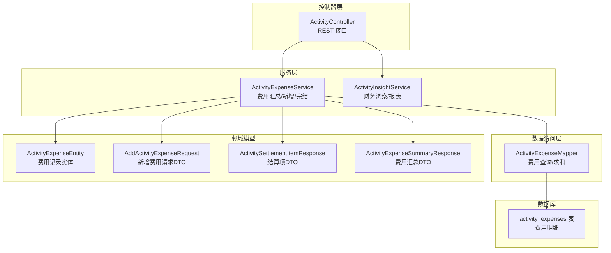
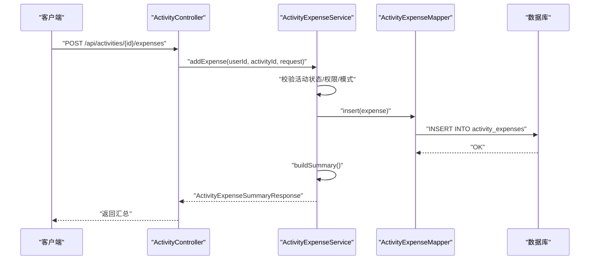
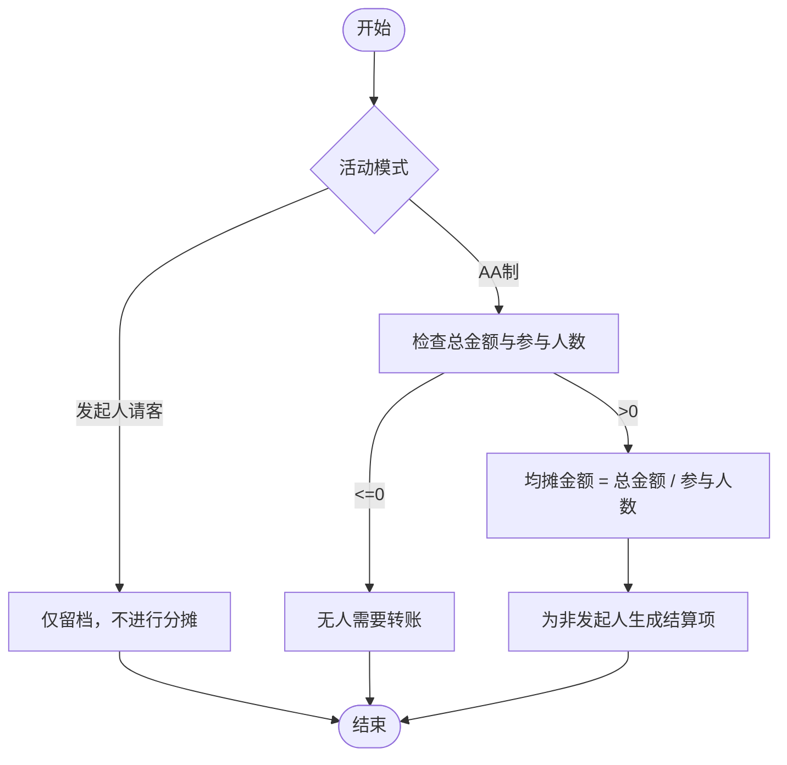
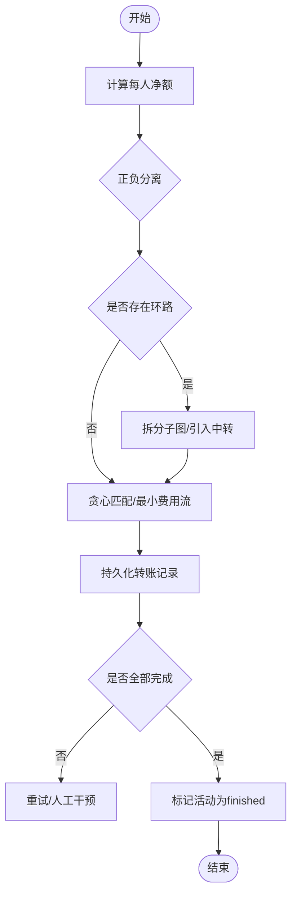
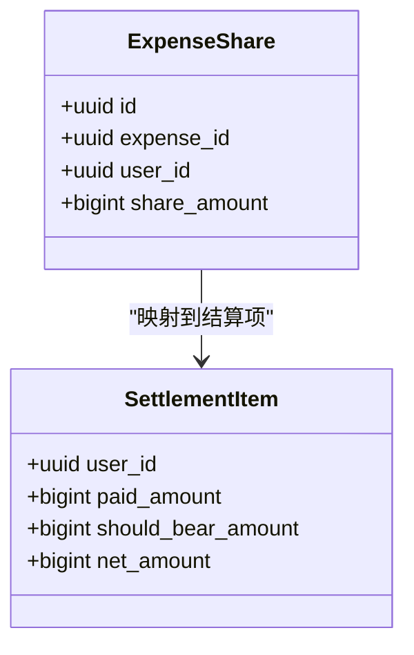
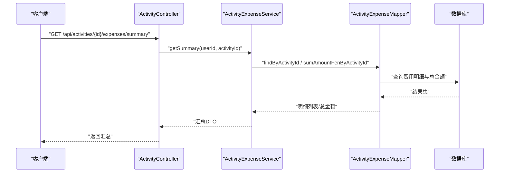
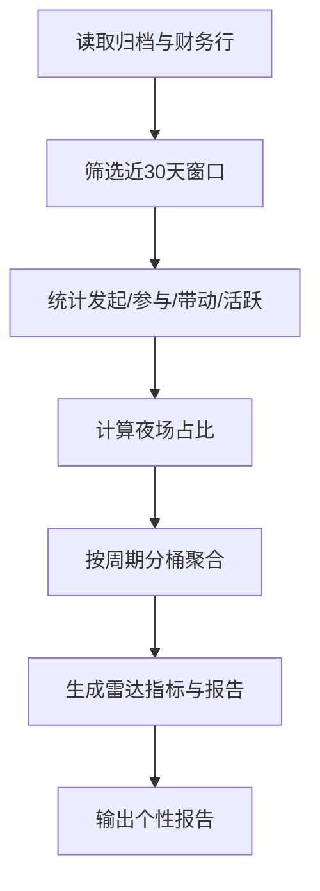
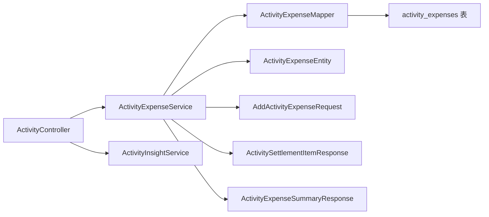

# 费用管理模块

<cite>
**本文引用的文件**
- [ActivityExpenseService.java](file://backend/src/main/java/com/playminipro/activity/service/ActivityExpenseService.java)
- [ActivityInsightService.java](file://backend/src/main/java/com/playminipro/activity/service/ActivityInsightService.java)
- [ActivityExpenseEntity.java](file://backend/src/main/java/com/playminipro/activity/entity/ActivityExpenseEntity.java)
- [AddActivityExpenseRequest.java](file://backend/src/main/java/com/playminipro/activity/dto/AddActivityExpenseRequest.java)
- [ActivityExpenseMapper.java](file://backend/src/main/java/com/playminipro/activity/mapper/ActivityExpenseMapper.java)
- [ActivitySettlementItemResponse.java](file://backend/src/main/java/com/playminipro/activity/dto/ActivitySettlementItemResponse.java)
- [ActivityExpenseSummaryResponse.java](file://backend/src/main/java/com/playminipro/activity/dto/ActivityExpenseSummaryResponse.java)
- [ActivityController.java](file://backend/src/main/java/com/playminipro/activity/controller/ActivityController.java)
- [V3__add_activity_expenses.sql](file://backend/src/main/resources/db/migration/V3__add_activity_expenses.sql)
- [05-PostgreSQL建表.sql](file://doc/05-PostgreSQL建表.sql)
</cite>

## 目录
1. [简介](#简介)
2. [项目结构](#项目结构)
3. [核心组件](#核心组件)
4. [架构总览](#架构总览)
5. [详细组件分析](#详细组件分析)
6. [依赖关系分析](#依赖关系分析)
7. [性能考虑](#性能考虑)
8. [故障排查指南](#故障排查指南)
9. [结论](#结论)
10. [附录](#附录)

## 简介
本文件为费用管理模块的专业开发文档，聚焦于以下目标：
- AA制费用分摊算法：费用平分、比例分摊、自定义分摊的数学模型与实现逻辑
- 最小转账方案生成：债务图构建、环路检测、最优转账路径选择
- 结算生成流程：结算方案计算、执行状态跟踪、完成标记处理
- 个人财务洞察：消费统计、支出排行、社交影响分析
- 费用记录的增删改查：数据校验、重复检查、状态同步
- 大数据量处理与并发控制：性能优化策略、事务管理最佳实践

当前仓库中已实现的费用管理能力以“活动费用”为核心，支持“AA制”和“发起人请客”两种模式，并提供基础的结算提示与汇总展示。最小转账方案、比例/自定义分摊等高级能力尚未在现有代码中实现，将在本文给出可落地的扩展设计与实现建议。

## 项目结构
费用管理模块位于后端 Java 工程的 activity 包内，采用分层架构：
- 控制器层：对外暴露 REST 接口，负责请求参数解析与响应封装
- 服务层：业务编排与规则校验，协调 Mapper 完成数据读写
- 数据访问层：MyBatis Mapper 映射数据库表，提供查询与插入
- 实体与 DTO：描述费用记录、结算项、汇总结果等数据结构
- 数据库迁移：定义费用相关表结构及索引

图表来源
- [ActivityController.java:94-111](file://backend/src/main/java/com/playminipro/activity/controller/ActivityController.java#L94-L111)
- [ActivityExpenseService.java:37-128](file://backend/src/main/java/com/playminipro/activity/service/ActivityExpenseService.java#L37-L128)
- [ActivityExpenseMapper.java:13-40](file://backend/src/main/java/com/playminipro/activity/mapper/ActivityExpenseMapper.java#L13-L40)
- [ActivityExpenseEntity.java:5-35](file://backend/src/main/java/com/playminipro/activity/entity/ActivityExpenseEntity.java#L5-L35)
- [AddActivityExpenseRequest.java:8-11](file://backend/src/main/java/com/playminipro/activity/dto/AddActivityExpenseRequest.java#L8-L11)
- [ActivitySettlementItemResponse.java:3-9](file://backend/src/main/java/com/playminipro/activity/dto/ActivitySettlementItemResponse.java#L3-L9)
- [ActivityExpenseSummaryResponse.java:5-18](file://backend/src/main/java/com/playminipro/activity/dto/ActivityExpenseSummaryResponse.java#L5-L18)
- [V3__add_activity_expenses.sql:1-12](file://backend/src/main/resources/db/migration/V3__add_activity_expenses.sql#L1-L12)

章节来源
- [ActivityController.java:27-112](file://backend/src/main/java/com/playminipro/activity/controller/ActivityController.java#L27-L112)
- [ActivityExpenseService.java:21-167](file://backend/src/main/java/com/playminipro/activity/service/ActivityExpenseService.java#L21-L167)
- [ActivityExpenseMapper.java:10-41](file://backend/src/main/java/com/playminipro/activity/mapper/ActivityExpenseMapper.java#L10-L41)
- [V3__add_activity_expenses.sql:1-12](file://backend/src/main/resources/db/migration/V3__add_activity_expenses.sql#L1-L12)

## 核心组件
- 费用汇总与结算提示：根据活动模式与参与人数，生成“AA待结算/已结清/无需结算”等提示文本
- 新增费用：校验活动状态与权限，写入费用明细并返回最新汇总
- 结束活动：将活动置为“finished”，触发后续结算流程
- 财务洞察：基于历史活动与费用行，生成个人财务报表（按日/周/月/季/年分桶）

章节来源
- [ActivityExpenseService.java:37-167](file://backend/src/main/java/com/playminipro/activity/service/ActivityExpenseService.java#L37-L167)
- [ActivityInsightService.java:164-233](file://backend/src/main/java/com/playminipro/activity/service/ActivityInsightService.java#L164-L233)
- [ActivityController.java:94-111](file://backend/src/main/java/com/playminipro/activity/controller/ActivityController.java#L94-L111)

## 架构总览
费用管理模块遵循典型的三层架构：控制器接收请求，服务层执行业务规则，数据访问层与数据库交互。费用相关的核心数据流如下：

图表来源
- [ActivityController.java:100-105](file://backend/src/main/java/com/playminipro/activity/controller/ActivityController.java#L100-L105)
- [ActivityExpenseService.java:42-58](file://backend/src/main/java/com/playminipro/activity/service/ActivityExpenseService.java#L42-L58)
- [ActivityExpenseMapper.java:13-20](file://backend/src/main/java/com/playminipro/activity/mapper/ActivityExpenseMapper.java#L13-L20)

## 详细组件分析

### 组件A：费用分摊与结算（AA制）
- 模式判定
  - “发起人请客”：仅留档，不进行分摊
  - “AA制”：结束活动后按到场人数均摊
- 均摊计算
  - 均摊金额 = 总金额 / 参与人数（向下取整或四舍五入取决于业务约定）
  - 非发起人向发起人转账，若无人需要转账则提示“无人需要转账”
- 结算项生成
  - 对每个成员生成结算项，包含用户标识、昵称、头像、角色与应转金额
- 提示文案
  - 根据模式与总金额、参与人数动态生成提示语

图表来源
- [ActivityExpenseService.java:130-166](file://backend/src/main/java/com/playminipro/activity/service/ActivityExpenseService.java#L130-L166)

章节来源
- [ActivityExpenseService.java:108-167](file://backend/src/main/java/com/playminipro/activity/service/ActivityExpenseService.java#L108-L167)
- [ActivityExpenseSummaryResponse.java:5-18](file://backend/src/main/java/com/playminipro/activity/dto/ActivityExpenseSummaryResponse.java#L5-L18)
- [ActivitySettlementItemResponse.java:3-9](file://backend/src/main/java/com/playminipro/activity/dto/ActivitySettlementItemResponse.java#L3-L9)

### 组件B：最小转账方案生成（扩展设计）
当前代码未实现最小转账方案生成。以下为可落地的扩展设计方案：
- 债务图构建
  - 从结算项中提取每个人的净额（paid - should_bear），得到正负净额集合
  - 将欠款方作为“借入者”，收款方作为“借出者”
- 环路检测
  - 使用有向边表示转账方向，检测是否存在环路导致无法收敛
  - 若存在环路，需拆分为多个独立子图或引入中转节点
- 最优转账路径选择
  - 使用贪心策略：每次从借出者中取最大值，从借入者中取最小值，构造转账
  - 或使用最小费用最大流算法，将转账次数与金额同时优化
- 执行状态与完成标记
  - 将转账记录持久化，维护转账状态（待确认/已完成）与确认时间戳
  - 完成后更新活动状态为“finished”，并生成结算完成通知

图表来源
- [05-PostgreSQL建表.sql:271-307](file://doc/05-PostgreSQL建表.sql#L271-L307)

章节来源
- [05-PostgreSQL建表.sql:271-307](file://doc/05-PostgreSQL建表.sql#L271-L307)

### 组件C：比例分摊与自定义分摊（扩展设计）
- 比例分摊
  - 为每位成员设置权重，按权重分配费用
  - 计算公式：某成员应付 = 总金额 × (该成员权重 / 权重总和)
- 自定义分摊
  - 允许发起人为每笔费用设置“分摊明细”，存储为“expense_shares”记录
  - 分摊明细表包含 expense_id、user_id、share_amount
- 与现有 AA 判定的集成
  - 在费用明细中增加“分摊类型”字段，区分“aa”、“proportion”、“custom”
  - 结算时根据类型选择不同的计算路径

图表来源
- [05-PostgreSQL建表.sql:262-269](file://doc/05-PostgreSQL建表.sql#L262-L269)
- [ActivitySettlementItemResponse.java:3-9](file://backend/src/main/java/com/playminipro/activity/dto/ActivitySettlementItemResponse.java#L3-L9)

章节来源
- [05-PostgreSQL建表.sql:262-269](file://doc/05-PostgreSQL建表.sql#L262-L269)

### 组件D：费用记录的增删改查
- 新增费用
  - 校验：仅线下活动允许费用；活动未完结且未取消；仅创建者可新增
  - 写入：插入 activity_expenses，返回最新汇总
- 查询汇总
  - 汇总：总金额、参与人数、结算提示、费用明细、结算项
- 结束活动
  - 校验：仅创建者可结束；已取消活动不可结束
  - 更新：将活动状态置为 finished
- 删除/修改
  - 当前代码未实现删除与修改接口；如需支持，应在服务层增加校验与幂等控制

图表来源
- [ActivityController.java:94-98](file://backend/src/main/java/com/playminipro/activity/controller/ActivityController.java#L94-L98)
- [ActivityExpenseService.java:37-40](file://backend/src/main/java/com/playminipro/activity/service/ActivityExpenseService.java#L37-L40)
- [ActivityExpenseMapper.java:22-40](file://backend/src/main/java/com/playminipro/activity/mapper/ActivityExpenseMapper.java#L22-L40)

章节来源
- [ActivityExpenseService.java:42-77](file://backend/src/main/java/com/playminipro/activity/service/ActivityExpenseService.java#L42-L77)
- [ActivityExpenseMapper.java:13-40](file://backend/src/main/java/com/playminipro/activity/mapper/ActivityExpenseMapper.java#L13-L40)
- [AddActivityExpenseRequest.java:8-11](file://backend/src/main/java/com/playminipro/activity/dto/AddActivityExpenseRequest.java#L8-L11)
- [V3__add_activity_expenses.sql:1-12](file://backend/src/main/resources/db/migration/V3__add_activity_expenses.sql#L1-L12)

### 组件E：个人财务洞察分析
- 数据来源
  - 历史活动归档：用于统计参与/发起次数、带动人数、活跃天数
  - 财务行：按活动维度聚合的费用信息
- 指标计算
  - 发起/参与/带动/连续活跃：基于归档数据统计
  - 夜场占比：统计夜间（22:00-05:00）活动占比
  - 财报分桶：按日/周/月/季/年聚合支出，计算总支出、AA支出、请客支出
- 展示内容
  - 评分与称号、雷达图、荣誉徽章、个性评论等

图表来源
- [ActivityInsightService.java:41-111](file://backend/src/main/java/com/playminipro/activity/service/ActivityInsightService.java#L41-L111)
- [ActivityInsightService.java:164-233](file://backend/src/main/java/com/playminipro/activity/service/ActivityInsightService.java#L164-L233)

章节来源
- [ActivityInsightService.java:47-111](file://backend/src/main/java/com/playminipro/activity/service/ActivityInsightService.java#L47-L111)
- [ActivityInsightService.java:164-233](file://backend/src/main/java/com/playminipro/activity/service/ActivityInsightService.java#L164-L233)

## 依赖关系分析
- 控制器依赖服务层；服务层依赖 Mapper 与实体；Mapper 依赖数据库表
- 费用汇总依赖参与人数与总金额；结算项依赖活动模式
- 财务洞察依赖历史归档与财务行，采用一次性内存分桶降低数据库压力

图表来源
- [ActivityController.java:37-43](file://backend/src/main/java/com/playminipro/activity/controller/ActivityController.java#L37-L43)
- [ActivityExpenseService.java:29-35](file://backend/src/main/java/com/playminipro/activity/service/ActivityExpenseService.java#L29-L35)
- [ActivityExpenseMapper.java:10-11](file://backend/src/main/java/com/playminipro/activity/mapper/ActivityExpenseMapper.java#L10-L11)
- [V3__add_activity_expenses.sql:1-12](file://backend/src/main/resources/db/migration/V3__add_activity_expenses.sql#L1-L12)

章节来源
- [ActivityController.java:27-43](file://backend/src/main/java/com/playminipro/activity/controller/ActivityController.java#L27-L43)
- [ActivityExpenseService.java:21-35](file://backend/src/main/java/com/playminipro/activity/service/ActivityExpenseService.java#L21-L35)
- [ActivityExpenseMapper.java:10-11](file://backend/src/main/java/com/playminipro/activity/mapper/ActivityExpenseMapper.java#L10-L11)

## 性能考虑
- 数据库层面
  - 为 activity_id 创建复合索引，加速费用明细查询与总金额聚合
  - 使用分区表或物化视图（视数据库版本而定）优化财务分桶
- 服务层层面
  - 财务洞察采用“一次性内存分桶”策略，减少多次数据库扫描
  - 对热点活动的费用查询使用缓存（如 Redis）降低数据库压力
- 并发控制
  - 费用新增与活动完结使用数据库事务，确保一致性
  - 对高并发场景下的转账生成，采用队列异步化，避免阻塞主流程
- 事务管理
  - 使用 Spring 声明式事务，保证新增费用与状态变更原子性
  - 对外部依赖（如支付网关）采用补偿机制与幂等设计

## 故障排查指南
- 常见错误与定位
  - 活动不存在/无权限：检查活动成员关系与创建者身份
  - 非线下活动不允许费用：确认活动模式为 offline
  - 活动已完结/已取消：禁止新增费用
  - 费用金额非法：校验金额大于 0
- 日志与监控
  - 记录关键业务事件（新增费用、结束活动、生成结算）
  - 对异常交易（重复提交、并发冲突）进行告警
- 回滚与修复
  - 对于误操作，提供“撤销费用”或“调整分摊”接口（扩展设计）

章节来源
- [ActivityExpenseService.java:79-106](file://backend/src/main/java/com/playminipro/activity/service/ActivityExpenseService.java#L79-L106)
- [AddActivityExpenseRequest.java:8-11](file://backend/src/main/java/com/playminipro/activity/dto/AddActivityExpenseRequest.java#L8-L11)

## 结论
当前费用管理模块已实现基础的“AA制”与“发起人请客”模式，具备费用新增、汇总与结束活动的能力，并提供个人财务洞察报表。为进一步提升用户体验与系统能力，建议优先实现：
- 最小转账方案生成：债务图构建、环路检测、最优路径选择
- 比例/自定义分摊：扩展费用分摊类型与明细表
- 完善 CRUD：新增删除/修改接口与状态同步
- 性能与并发：缓存、异步化、事务与幂等设计

## 附录
- 数据库表结构参考
  - 费用明细表：activity_expenses
  - 结算主表与明细：settlements、settlement_items
  - 转账记录：settlement_transfers
  - 费用分摊明细：expense_shares

章节来源
- [V3__add_activity_expenses.sql:1-12](file://backend/src/main/resources/db/migration/V3__add_activity_expenses.sql#L1-L12)
- [05-PostgreSQL建表.sql:262-307](file://doc/05-PostgreSQL建表.sql#L262-L307)