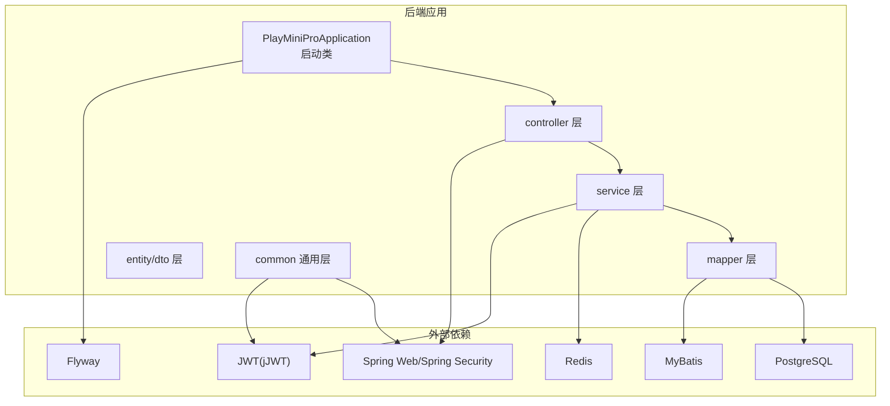
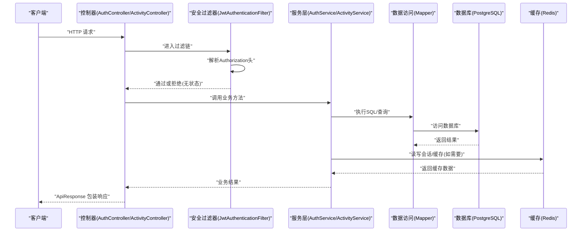
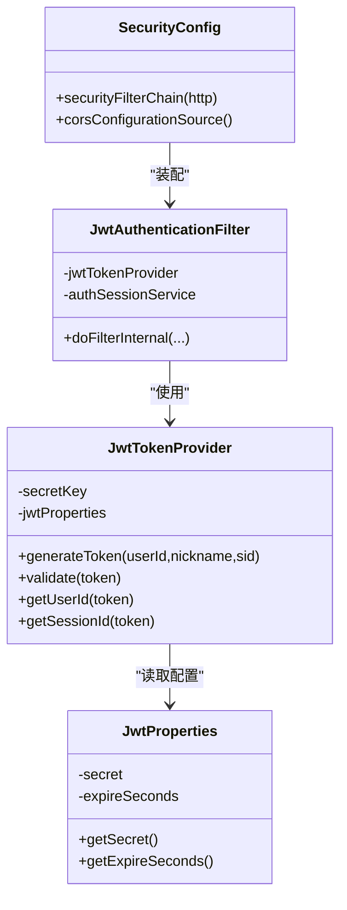
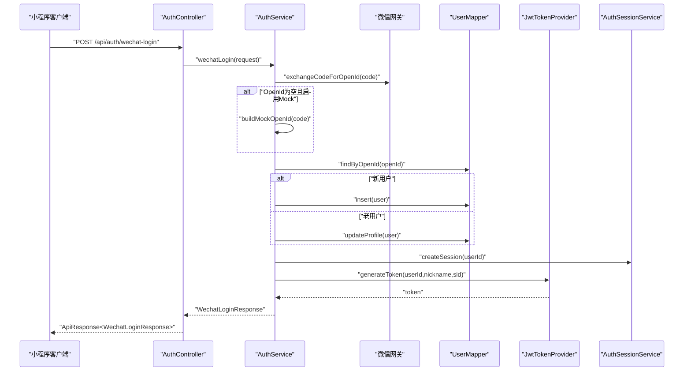
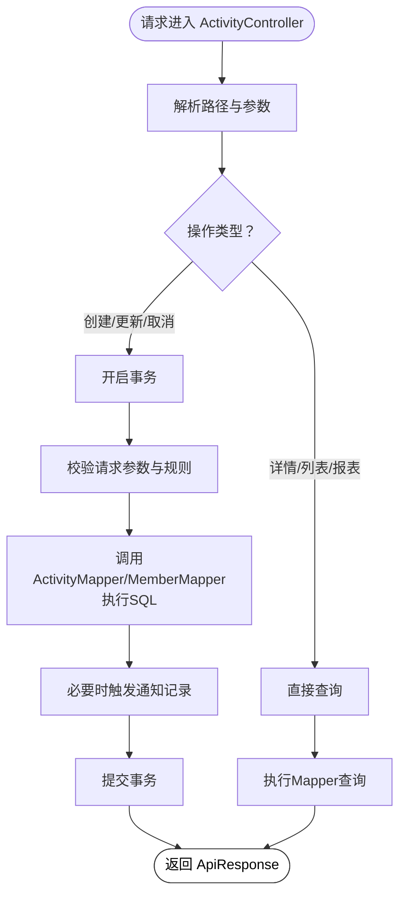
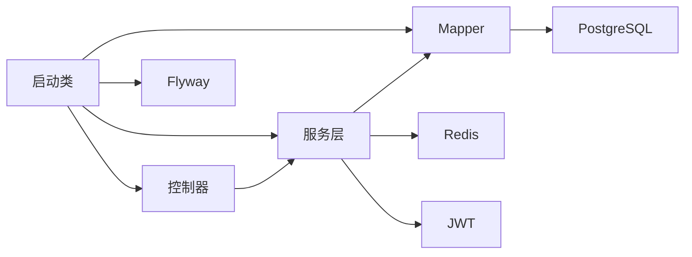

# 项目架构设计

<cite>
**本文引用的文件**
- [PlayMiniProApplication.java](file://backend/src/main/java/com/playminipro/PlayMiniProApplication.java)
- [application.yml](file://backend/src/main/resources/application.yml)
- [pom.xml](file://backend/pom.xml)
- [SecurityConfig.java](file://backend/src/main/java/com/playminipro/common/config/SecurityConfig.java)
- [JwtProperties.java](file://backend/src/main/java/com/playminipro/common/config/JwtProperties.java)
- [JwtAuthenticationFilter.java](file://backend/src/main/java/com/playminipro/common/security/JwtAuthenticationFilter.java)
- [JwtTokenProvider.java](file://backend/src/main/java/com/playminipro/common/security/JwtTokenProvider.java)
- [WechatProperties.java](file://backend/src/main/java/com/playminipro/common/config/WechatProperties.java)
- [AuthController.java](file://backend/src/main/java/com/playminipro/auth/controller/AuthController.java)
- [ActivityController.java](file://backend/src/main/java/com/playminipro/activity/controller/ActivityController.java)
- [AuthService.java](file://backend/src/main/java/com/playminipro/auth/service/AuthService.java)
- [ActivityService.java](file://backend/src/main/java/com/playminipro/activity/service/ActivityService.java)
- [UserMapper.java](file://backend/src/main/java/com/playminipro/auth/mapper/UserMapper.java)
- [ActivityMapper.java](file://backend/src/main/java/com/playminipro/activity/mapper/ActivityMapper.java)
- [GlobalExceptionHandler.java](file://backend/src/main/java/com/playminipro/common/exception/GlobalExceptionHandler.java)
</cite>

## 目录
1. [引言](#引言)
2. [项目结构](#项目结构)
3. [核心组件](#核心组件)
4. [架构总览](#架构总览)
5. [详细组件分析](#详细组件分析)
6. [依赖分析](#依赖分析)
7. [性能考量](#性能考量)
8. [故障排查指南](#故障排查指南)
9. [结论](#结论)
10. [附录](#附录)

## 引言
本文件面向PlayMiniPro后端（Spring Boot）项目的架构设计与实现进行系统化梳理，重点覆盖以下方面：
- MVC三层架构在本项目中的落地方式与分层职责
- 包结构组织与模块边界
- 安全体系（基于JWT的无状态认证）
- 配置文件设计（数据库、Redis、Flyway、Jackson、Actuator、业务配置）
- 启动流程、组件扫描与自动配置原理
- 技术选型与架构决策的技术背景与权衡

## 项目结构
后端采用按功能域分层的包结构组织，典型层次包括：
- controller：对外HTTP接口入口，负责参数接收、校验与响应封装
- service：业务逻辑编排与事务控制
- mapper：MyBatis映射接口，承载SQL与数据持久化
- entity：实体模型
- dto：请求/响应数据传输对象
- common：通用配置、异常处理、安全过滤器与工具
- auth与activity：按功能域划分的子模块

图表来源
- [PlayMiniProApplication.java:11-14](file://backend/src/main/java/com/playminipro/PlayMiniProApplication.java#L11-L14)
- [application.yml:20-22](file://backend/src/main/resources/application.yml#L20-L22)

章节来源
- [PlayMiniProApplication.java:11-14](file://backend/src/main/java/com/playminipro/PlayMiniProApplication.java#L11-L14)
- [application.yml:1-53](file://backend/src/main/resources/application.yml#L1-L53)

## 核心组件
- 启动类与自动配置
  - 使用@SpringBootApplication启用组件扫描与自动配置；@MapperScan启用MyBatis Mapper扫描；@EnableScheduling开启调度能力；@EnableConfigurationProperties注册业务配置类。
- 安全配置
  - 基于Spring Security构建无状态过滤链，禁用CSRF与表单登录，启用JWT过滤器，设置跨域策略，开放部分公开端点。
- JWT体系
  - JwtProperties读取密钥与过期时间；JwtTokenProvider生成与解析JWT；JwtAuthenticationFilter从请求头提取令牌并校验，写入Security上下文。
- 微信登录
  - WechatProperties读取小程序AppId/Secret与Mock开关；AuthService整合微信网关换取OpenId、更新/创建用户、发放JWT与会话。
- 控制器
  - AuthController与ActivityController分别提供认证与活动相关接口，统一返回ApiResponse包装。
- 全局异常处理
  - GlobalExceptionHandler集中捕获业务异常、参数校验异常与未预期异常，统一输出错误响应。

章节来源
- [PlayMiniProApplication.java:11-14](file://backend/src/main/java/com/playminipro/PlayMiniProApplication.java#L11-L14)
- [SecurityConfig.java:26-41](file://backend/src/main/java/com/playminipro/common/config/SecurityConfig.java#L26-L41)
- [JwtProperties.java:5-27](file://backend/src/main/java/com/playminipro/common/config/JwtProperties.java#L5-L27)
- [JwtTokenProvider.java:20-38](file://backend/src/main/java/com/playminipro/common/security/JwtTokenProvider.java#L20-L38)
- [JwtAuthenticationFilter.java:29-55](file://backend/src/main/java/com/playminipro/common/security/JwtAuthenticationFilter.java#L29-L55)
- [WechatProperties.java:5-37](file://backend/src/main/java/com/playminipro/common/config/WechatProperties.java#L5-L37)
- [AuthController.java:23-26](file://backend/src/main/java/com/playminipro/auth/controller/AuthController.java#L23-L26)
- [ActivityController.java:45-111](file://backend/src/main/java/com/playminipro/activity/controller/ActivityController.java#L45-L111)
- [GlobalExceptionHandler.java:14-40](file://backend/src/main/java/com/playminipro/common/exception/GlobalExceptionHandler.java#L14-L40)

## 架构总览
下图展示从客户端到服务端的典型调用路径，以及安全过滤与业务处理的交互关系。

图表来源
- [AuthController.java:23-26](file://backend/src/main/java/com/playminipro/auth/controller/AuthController.java#L23-L26)
- [ActivityController.java:45-111](file://backend/src/main/java/com/playminipro/activity/controller/ActivityController.java#L45-L111)
- [JwtAuthenticationFilter.java:29-55](file://backend/src/main/java/com/playminipro/common/security/JwtAuthenticationFilter.java#L29-L55)
- [AuthService.java:41-76](file://backend/src/main/java/com/playminipro/auth/service/AuthService.java#L41-L76)
- [ActivityService.java:41-98](file://backend/src/main/java/com/playminipro/activity/service/ActivityService.java#L41-L98)

## 详细组件分析

### 安全与认证子系统
- 过滤链与跨域
  - 禁用CSRF与表单登录，设置会话策略为STATELESS；对特定端点放行；注册全局CORS。
- JWT过滤器
  - 从Authorization头提取Bearer Token，校验有效性，解析用户ID与会话ID，调用会话服务验证并刷新，成功则写入Security上下文。
- JWT提供者
  - 基于配置的密钥与过期时长生成JWT，包含用户ID、昵称与会话ID等声明；提供校验与解析方法。
- 会话服务
  - 在认证流程中创建并校验/刷新会话ID，确保令牌与会话的一致性与安全性。

图表来源
- [SecurityConfig.java:26-54](file://backend/src/main/java/com/playminipro/common/config/SecurityConfig.java#L26-L54)
- [JwtAuthenticationFilter.java:23-27](file://backend/src/main/java/com/playminipro/common/security/JwtAuthenticationFilter.java#L23-L27)
- [JwtTokenProvider.java:20-24](file://backend/src/main/java/com/playminipro/common/security/JwtTokenProvider.java#L20-L24)
- [JwtProperties.java:8-26](file://backend/src/main/java/com/playminipro/common/config/JwtProperties.java#L8-L26)

章节来源
- [SecurityConfig.java:26-54](file://backend/src/main/java/com/playminipro/common/config/SecurityConfig.java#L26-L54)
- [JwtAuthenticationFilter.java:29-55](file://backend/src/main/java/com/playminipro/common/security/JwtAuthenticationFilter.java#L29-L55)
- [JwtTokenProvider.java:26-59](file://backend/src/main/java/com/playminipro/common/security/JwtTokenProvider.java#L26-L59)
- [JwtProperties.java:8-26](file://backend/src/main/java/com/playminipro/common/config/JwtProperties.java#L8-L26)

### 认证与微信登录流程
- 流程要点
  - 客户端提交小程序授权code；AuthService尝试通过微信网关换取OpenId；若失败且启用Mock，则以code派生模拟OpenId。
  - 根据传入的昵称、头像与电话号码，更新或创建用户记录；创建会话并签发JWT；返回登录结果与用户信息。
- 关键路径
  - 控制器接收请求并调用AuthService；AuthService协调UserMapper与微信网关；最终生成JWT与会话。

图表来源
- [AuthController.java:23-26](file://backend/src/main/java/com/playminipro/auth/controller/AuthController.java#L23-L26)
- [AuthService.java:41-76](file://backend/src/main/java/com/playminipro/auth/service/AuthService.java#L41-L76)
- [UserMapper.java:12-40](file://backend/src/main/java/com/playminipro/auth/mapper/UserMapper.java#L12-L40)
- [JwtTokenProvider.java:26-38](file://backend/src/main/java/com/playminipro/common/security/JwtTokenProvider.java#L26-L38)

章节来源
- [AuthController.java:23-26](file://backend/src/main/java/com/playminipro/auth/controller/AuthController.java#L23-L26)
- [AuthService.java:41-100](file://backend/src/main/java/com/playminipro/auth/service/AuthService.java#L41-L100)
- [UserMapper.java:12-40](file://backend/src/main/java/com/playminipro/auth/mapper/UserMapper.java#L12-L40)

### 活动管理与费用记账
- 控制器职责
  - 提供活动创建、更新、取消、加入、退出、详情查询、归档列表、个性报告、费用汇总与记账等接口。
- 服务层职责
  - ActivityService负责活动生命周期、成员关系、状态机与通知记录；包含请求校验、JSON在线加入信息序列化、参与者上限判断等。
- 数据访问层
  - ActivityMapper提供活动增删改查、状态变更、自动取消、统计聚合等SQL；UserMapper负责用户档案读写。

图表来源
- [ActivityController.java:45-111](file://backend/src/main/java/com/playminipro/activity/controller/ActivityController.java#L45-L111)
- [ActivityService.java:100-138](file://backend/src/main/java/com/playminipro/activity/service/ActivityService.java#L100-L138)
- [ActivityMapper.java:16-94](file://backend/src/main/java/com/playminipro/activity/mapper/ActivityMapper.java#L16-L94)
- [UserMapper.java:12-40](file://backend/src/main/java/com/playminipro/auth/mapper/UserMapper.java#L12-L40)

章节来源
- [ActivityController.java:45-111](file://backend/src/main/java/com/playminipro/activity/controller/ActivityController.java#L45-L111)
- [ActivityService.java:41-232](file://backend/src/main/java/com/playminipro/activity/service/ActivityService.java#L41-L232)
- [ActivityMapper.java:16-222](file://backend/src/main/java/com/playminipro/activity/mapper/ActivityMapper.java#L16-L222)

### 配置与基础设施
- 应用配置
  - application.yml集中定义服务器端口、数据源、Redis连接、Flyway迁移位置、Jackson时区与时戳格式、Actuator暴露端点、业务JWT与微信配置、日志级别等。
- Maven依赖
  - Spring Boot Starter Web/Security/Actuator/Data Redis/Validation；MyBatis Starter；PostgreSQL驱动；Flyway；jJWT相关依赖。
- 启动类
  - 开启组件扫描、Mapper扫描、定时任务、配置属性绑定。

章节来源
- [application.yml:1-53](file://backend/src/main/resources/application.yml#L1-L53)
- [pom.xml:26-91](file://backend/pom.xml#L26-L91)
- [PlayMiniProApplication.java:11-14](file://backend/src/main/java/com/playminipro/PlayMiniProApplication.java#L11-L14)

## 依赖分析
- 组件耦合与内聚
  - 控制器仅依赖服务接口，保持高内聚低耦合；服务层依赖Mapper与领域对象，事务边界清晰；Mapper依赖数据库方言与SQL。
- 外部依赖
  - PostgreSQL作为主存储；Redis用于会话/缓存；Flyway负责数据库版本治理；jJWT提供JWT能力；Spring Security提供安全框架。
- 可能的循环依赖
  - 当前结构按功能域拆分，控制器-服务-Mapper单向依赖，未见循环依赖迹象。

图表来源
- [PlayMiniProApplication.java:11-14](file://backend/src/main/java/com/playminipro/PlayMiniProApplication.java#L11-L14)
- [application.yml:20-22](file://backend/src/main/resources/application.yml#L20-L22)

章节来源
- [PlayMiniProApplication.java:11-14](file://backend/src/main/java/com/playminipro/PlayMiniProApplication.java#L11-L14)
- [application.yml:1-53](file://backend/src/main/resources/application.yml#L1-L53)

## 性能考量
- 无状态认证降低会话开销，结合Redis可扩展会话存储；建议合理设置JWT过期时间与刷新策略。
- MyBatis SQL需关注索引与聚合查询性能，必要时引入只读副本或缓存热点数据。
- Actuator暴露健康检查端点，便于运维监控与弹性伸缩。
- Jackson时区与时戳配置避免跨时区显示问题，减少前端转换成本。

## 故障排查指南
- 业务异常
  - 通过BusinessException抛出，由GlobalExceptionHandler统一拦截并返回标准错误码与消息。
- 参数校验异常
  - MethodArgumentNotValidException与ConstraintViolationException统一转为友好提示。
- 未预期异常
  - 捕获后返回5000错误码与异常信息，便于定位问题。
- 安全相关
  - 若出现鉴权失败，检查Authorization头格式、JWT签名与过期时间、会话有效性。

章节来源
- [GlobalExceptionHandler.java:14-40](file://backend/src/main/java/com/playminipro/common/exception/GlobalExceptionHandler.java#L14-L40)

## 结论
本项目采用清晰的MVC分层与功能域模块化组织，结合Spring Boot自动配置、MyBatis数据访问、JWT无状态认证与Redis缓存，形成轻量、可维护且易扩展的后端架构。通过Flyway进行数据库版本治理，配合Actuator与日志配置，满足生产环境可观测性与可运维性要求。未来可在以下方向持续优化：引入更细粒度的限流与熔断、增强审计与追踪、完善测试覆盖与API文档。

## 附录
- 技术栈选型理由
  - Spring Boot：快速开发与自动配置，生态完善。
  - MyBatis：灵活SQL与强事务控制，适合复杂查询与报表场景。
  - PostgreSQL：ACID、JSONB支持与成熟生态。
  - Redis：高性能缓存与会话存储。
  - jJWT：简洁可靠的JWT实现。
  - Flyway：数据库版本治理，降低部署风险。
- 架构决策与权衡
  - 无状态认证简化服务扩展，但需关注会话与令牌生命周期管理。
  - 功能域模块化提升可读性与协作效率，需注意跨域调用与共享组件的抽象。
  - DTO与Entity分离降低耦合，但需关注映射成本与一致性维护。