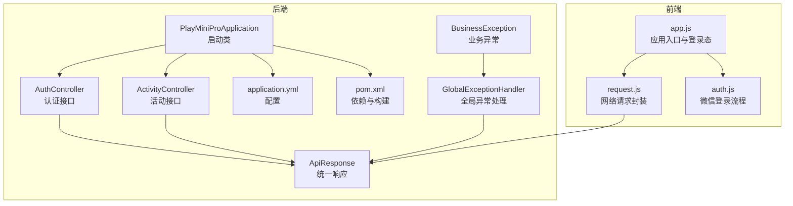
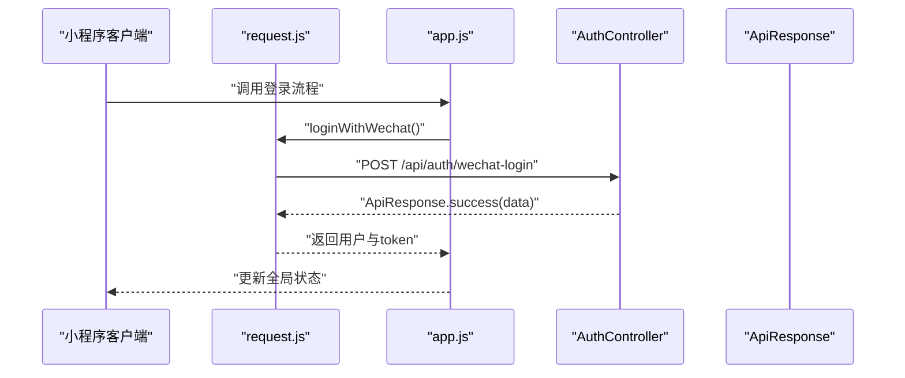
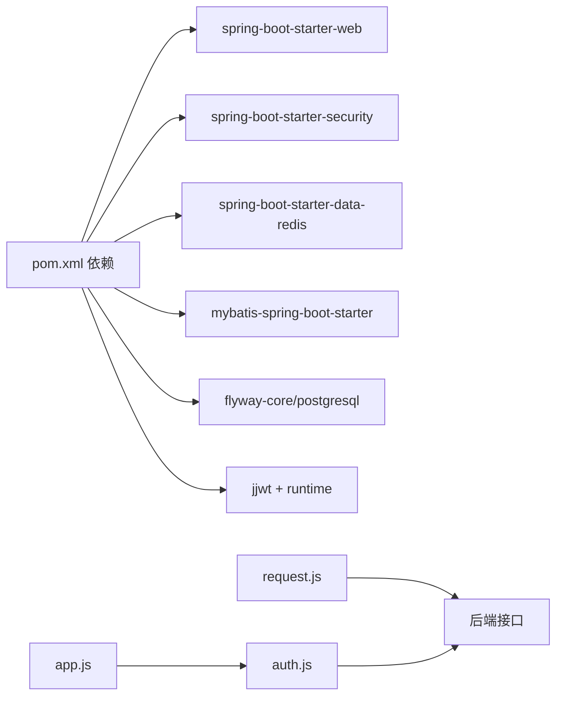

# 代码规范

<cite>
**本文引用的文件**
- [PlayMiniProApplication.java](file://backend/src/main/java/com/playminipro/PlayMiniProApplication.java)
- [BusinessException.java](file://backend/src/main/java/com/playminipro/common/exception/BusinessException.java)
- [GlobalExceptionHandler.java](file://backend/src/main/java/com/playminipro/common/exception/GlobalExceptionHandler.java)
- [ApiResponse.java](file://backend/src/main/java/com/playminipro/common/response/ApiResponse.java)
- [AuthController.java](file://backend/src/main/java/com/playminipro/auth/controller/AuthController.java)
- [ActivityController.java](file://backend/src/main/java/com/playminipro/activity/controller/ActivityController.java)
- [application.yml](file://backend/src/main/resources/application.yml)
- [pom.xml](file://backend/pom.xml)
- [CreateActivityRequest.java](file://backend/src/main/java/com/playminipro/activity/dto/CreateActivityRequest.java)
- [WechatLoginRequest.java](file://backend/src/main/java/com/playminipro/auth/dto/WechatLoginRequest.java)
- [ActivityEntity.java](file://backend/src/main/java/com/playminipro/activity/entity/ActivityEntity.java)
- [UserEntity.java](file://backend/src/main/java/com/playminipro/auth/entity/UserEntity.java)
- [app.js](file://frontend/app.js)
- [request.js](file://frontend/utils/request.js)
- [auth.js](file://frontend/utils/auth.js)
</cite>

## 目录
1. 引言
2. 项目结构
3. 核心组件
4. 架构总览
5. 详细组件分析
6. 依赖分析
7. 性能考虑
8. 故障排查指南
9. 结论
10. 附录

## 引言
本规范面向PlayMiniPro项目的Java后端与JavaScript前端，旨在统一命名约定、代码格式化、注释与文档、异常与日志处理、API设计与版本演进、Git提交与分支管理、以及代码评审清单。文档基于现有仓库中的真实实现进行提炼与扩展，既保证可执行性，也兼顾可读性与可维护性。

## 项目结构
后端采用Spring Boot三层分层：控制器层（Controller）、服务层（Service）、数据访问层（Mapper/Repository），配合通用响应体、全局异常处理与安全过滤器；前端采用小程序原生框架，通过工具模块封装请求与鉴权逻辑，并在应用入口集中管理登录态与全局状态。

图示来源
- [PlayMiniProApplication.java:1-20](file://backend/src/main/java/com/playminipro/PlayMiniProApplication.java#L1-L20)
- [AuthController.java:1-27](file://backend/src/main/java/com/playminipro/auth/controller/AuthController.java#L1-L27)
- [ActivityController.java:1-112](file://backend/src/main/java/com/playminipro/activity/controller/ActivityController.java#L1-L112)
- [ApiResponse.java:1-51](file://backend/src/main/java/com/playminipro/common/response/ApiResponse.java#L1-L51)
- [GlobalExceptionHandler.java:1-41](file://backend/src/main/java/com/playminipro/common/exception/GlobalExceptionHandler.java#L1-L41)
- [BusinessException.java:1-15](file://backend/src/main/java/com/playminipro/common/exception/BusinessException.java#L1-L15)
- [application.yml:1-53](file://backend/src/main/resources/application.yml#L1-L53)
- [pom.xml:1-102](file://backend/pom.xml#L1-L102)
- [app.js:1-46](file://frontend/app.js#L1-L46)
- [request.js:1-107](file://frontend/utils/request.js#L1-L107)
- [auth.js:1-56](file://frontend/utils/auth.js#L1-L56)

章节来源
- [PlayMiniProApplication.java:1-20](file://backend/src/main/java/com/playminipro/PlayMiniProApplication.java#L1-L20)
- [application.yml:1-53](file://backend/src/main/resources/application.yml#L1-L53)
- [pom.xml:1-102](file://backend/pom.xml#L1-L102)

## 核心组件
- 统一响应体：所有HTTP接口返回统一结构，包含状态码、消息与数据载体，便于前端一致处理与错误提示。
- 全局异常处理：对业务异常、校验异常、约束异常与未预期异常进行分类处理，映射到统一响应与合适的HTTP状态码。
- 业务异常：以错误码与消息表达业务失败原因，避免泄露内部细节。
- 控制器：REST风格接口，使用@RequestMapping与@RestController，参数校验使用@Valid与Jakarta Bean Validation。
- 配置与构建：Spring Boot配置集中于application.yml，Maven依赖与插件在pom.xml中管理。

章节来源
- [ApiResponse.java:1-51](file://backend/src/main/java/com/playminipro/common/response/ApiResponse.java#L1-L51)
- [GlobalExceptionHandler.java:1-41](file://backend/src/main/java/com/playminipro/common/exception/GlobalExceptionHandler.java#L1-L41)
- [BusinessException.java:1-15](file://backend/src/main/java/com/playminipro/common/exception/BusinessException.java#L1-L15)
- [AuthController.java:1-27](file://backend/src/main/java/com/playminipro/auth/controller/AuthController.java#L1-L27)
- [ActivityController.java:1-112](file://backend/src/main/java/com/playminipro/activity/controller/ActivityController.java#L1-L112)

## 架构总览
后端通过Spring Web MVC暴露REST接口，控制器直接返回统一响应体；全局异常处理器拦截并转换异常；前端通过封装的请求模块发起HTTP请求，自动携带Authorization头并处理鉴权失效场景。

图示来源
- [auth.js:1-56](file://frontend/utils/auth.js#L1-L56)
- [request.js:1-107](file://frontend/utils/request.js#L1-L107)
- [AuthController.java:1-27](file://backend/src/main/java/com/playminipro/auth/controller/AuthController.java#L1-L27)
- [ApiResponse.java:1-51](file://backend/src/main/java/com/playminipro/common/response/ApiResponse.java#L1-L51)

## 详细组件分析

### Java后端代码规范

- 命名约定
  - 包名：com.playminipro（小写、点分隔）
  - 类名：采用大驼峰，如ActivityController、ActivityEntity
  - 方法名：采用小驼峰，如wechatLogin、listMineOngoing
  - 变量名：采用小驼峰，如authentication、request
  - 常量名：全大写加下划线，如DEFAULT_API_ENV
  - DTO/实体类：使用名词短语或“XxxResponse/XxxRequest”后缀
  - 异常类：以Exception结尾，如BusinessException

- 代码格式化标准
  - 使用Spring Boot默认风格，保持缩进一致、空行合理、括号换行位置统一
  - 字段与方法之间保留空行，提升可读性
  - 导入顺序：第三方库优先，再是项目内包

- 注释规范
  - 类与公共方法需Javadoc说明用途、参数、返回值与异常
  - 复杂逻辑处添加行内注释，解释关键步骤与边界条件
  - TODO/FIXME使用统一标记并在后续迭代中清理

- 异常处理模式
  - 业务异常：抛出BusinessException，由全局异常处理器捕获并返回统一响应
  - 参数校验异常：MethodArgumentNotValidException与ConstraintViolationException统一转为4000错误码
  - 未预期异常：捕获并返回5000错误码，不泄露堆栈细节
  - 建议：在服务层明确区分业务异常与系统异常，避免误用RuntimeException

- 日志记录标准
  - 配置文件中设置根日志级别为info，避免生产环境输出过多debug日志
  - 使用结构化字段记录关键上下文（如用户ID、活动ID、请求路径），便于检索
  - 对敏感信息（如token、手机号）脱敏输出

- API接口设计规范（后端）
  - REST风格：资源名词复数形式，动词通过HTTP方法表达
  - 路径参数：使用{id}占位符，类型明确（如String）
  - 查询参数：使用查询字符串，避免复杂嵌套
  - 响应格式：统一使用ApiResponse，code=0表示成功，非0为错误码
  - 错误码定义：自定义业务错误从4001起，参数校验错误固定4000，未预期错误固定5000
  - 认证：使用Bearer Token，未授权时返回401/403并触发前端清除本地状态

- 数据模型与验证
  - DTO使用record承载不可变数据，配合Jakarta Validation注解进行参数校验
  - 实体类使用标准getter/setter，字段与数据库列保持一致命名风格
  - 时间字段统一使用OffsetDateTime，避免时区问题

- 安全与配置
  - JWT密钥与过期时间通过环境变量注入，避免硬编码
  - 微信小程序相关配置通过WechatProperties注入
  - Flyway迁移脚本启用，数据库初始化自动化

章节来源
- [BusinessException.java:1-15](file://backend/src/main/java/com/playminipro/common/exception/BusinessException.java#L1-L15)
- [GlobalExceptionHandler.java:1-41](file://backend/src/main/java/com/playminipro/common/exception/GlobalExceptionHandler.java#L1-L41)
- [ApiResponse.java:1-51](file://backend/src/main/java/com/playminipro/common/response/ApiResponse.java#L1-L51)
- [AuthController.java:1-27](file://backend/src/main/java/com/playminipro/auth/controller/AuthController.java#L1-L27)
- [ActivityController.java:1-112](file://backend/src/main/java/com/playminipro/activity/controller/ActivityController.java#L1-L112)
- [CreateActivityRequest.java:1-30](file://backend/src/main/java/com/playminipro/activity/dto/CreateActivityRequest.java#L1-L30)
- [WechatLoginRequest.java:1-12](file://backend/src/main/java/com/playminipro/auth/dto/WechatLoginRequest.java#L1-L12)
- [ActivityEntity.java:1-91](file://backend/src/main/java/com/playminipro/activity/entity/ActivityEntity.java#L1-L91)
- [UserEntity.java:1-76](file://backend/src/main/java/com/playminipro/auth/entity/UserEntity.java#L1-L76)
- [application.yml:1-53](file://backend/src/main/resources/application.yml#L1-L53)
- [pom.xml:1-102](file://backend/pom.xml#L1-L102)

### JavaScript前端代码规范

- 函数命名
  - 小程序页面与工具函数采用小驼峰，如syncLoginState、loginWithConfirm
  - 异步函数以async/await为主，避免深层回调链

- 变量声明
  - 优先使用const声明不可变引用，let声明可变引用
  - 常量统一大写加下划线，如API_ENV_KEY、BASE_URL_MAP

- 事件处理
  - 页面生命周期钩子（onLaunch等）集中于app.js，避免分散逻辑
  - 事件绑定尽量使用WXML中的事件绑定，减少JS重复绑定

- 异步编程模式
  - 网络请求封装为Promise，统一处理成功与失败分支
  - 在请求模块中根据HTTP状态码与响应体code判断是否成功
  - 对401/403错误自动清除本地token与用户信息，并调用应用logout

- 组件设计原则
  - 页面级逻辑集中在对应index.js中，工具函数拆分至utils目录
  - 避免在页面中直接操作全局状态，通过App实例方法统一管理
  - 配置项集中管理，支持本地与生产环境切换

- 请求与鉴权
  - request模块支持动态baseUrl切换，支持自定义baseUrl覆盖
  - 自动附加Authorization头，无token时不附加
  - 提供isAuthExpiredError辅助判断鉴权失效

- 登录流程
  - loginWithWechat封装微信登录与后端鉴权，合并用户资料与头像策略
  - 成功后持久化token与用户信息，并同步到全局状态

章节来源
- [app.js:1-46](file://frontend/app.js#L1-L46)
- [request.js:1-107](file://frontend/utils/request.js#L1-L107)
- [auth.js:1-56](file://frontend/utils/auth.js#L1-L56)

### API接口设计规范（后端）

- RESTful设计原则
  - 资源命名：使用名词复数，如/api/activities
  - 动作表达：使用HTTP方法表达动作，如POST创建、PUT更新、GET获取、DELETE删除
  - 路径参数：使用{id}，类型明确（如String）

- 参数命名
  - 路径参数：小驼峰，如{id}
  - 查询参数：小驼峰，避免特殊字符
  - 请求体：使用DTO对象，字段与数据库一致或语义清晰

- 响应格式
  - 统一使用ApiResponse，包含code、message、data
  - 成功：code=0；失败：code>0且message描述错误

- 错误码定义
  - 4000：参数校验失败
  - 4001及以上：业务错误码，按模块划分区间
  - 5000：未预期异常

- 认证与授权
  - Bearer Token，未授权时返回401/403
  - 前端收到401/403自动清除本地状态

章节来源
- [AuthController.java:1-27](file://backend/src/main/java/com/playminipro/auth/controller/AuthController.java#L1-L27)
- [ActivityController.java:1-112](file://backend/src/main/java/com/playminipro/activity/controller/ActivityController.java#L1-L112)
- [ApiResponse.java:1-51](file://backend/src/main/java/com/playminipro/common/response/ApiResponse.java#L1-L51)
- [GlobalExceptionHandler.java:1-41](file://backend/src/main/java/com/playminipro/common/exception/GlobalExceptionHandler.java#L1-L41)

### Git提交规范

- 提交信息格式
  - 标题：动宾短语，不超过50字符；首字母小写，末尾不加句号
  - 摘要：必要时补充说明，限制在72字符以内
  - 说明：解释动机与影响，必要时列出变更内容
  - 关联Issue：在末尾追加Fixes/Closes #编号

- 分支命名规则
  - feature/功能名称：新增功能
  - fix/问题描述：修复缺陷
  - docs/修改内容：文档更新
  - refactor/重构内容：重构但不改变行为
  - hotfix/紧急修复：线上紧急修复

- 合并策略
  - 使用squash合并，保持历史整洁
  - 合并前必须通过CI与代码评审

[本节为通用实践说明，无需文件引用]

### 代码审查检查清单

- 后端
  - 是否使用统一响应体与错误码？
  - 是否存在未捕获的异常？是否需要新增业务异常？
  - DTO与实体类字段是否与数据库一致？
  - 是否使用了必要的参数校验注解？
  - 是否有充足的单元测试覆盖？

- 前端
  - 是否统一使用request模块发起请求？
  - 是否正确处理401/403并清除本地状态？
  - 是否使用const/let合理声明变量？
  - 是否有必要的注释与JSDoc？

- 通用
  - 是否遵循命名约定与格式化标准？
  - 是否存在敏感信息泄露风险（如密钥、日志）？
  - 是否有重复代码与过度耦合？

[本节为通用实践说明，无需文件引用]

## 依赖分析
后端使用Spring Boot Starter与MyBatis、Redis、Flyway、Jackson等依赖，前端通过小程序原生能力与封装模块进行网络请求与鉴权。

图示来源
- [pom.xml:1-102](file://backend/pom.xml#L1-L102)
- [request.js:1-107](file://frontend/utils/request.js#L1-L107)
- [auth.js:1-56](file://frontend/utils/auth.js#L1-L56)
- [app.js:1-46](file://frontend/app.js#L1-L46)

章节来源
- [pom.xml:1-102](file://backend/pom.xml#L1-L102)

## 性能考虑
- 接口幂等与缓存：对只读接口考虑Redis缓存热点数据，注意缓存失效策略
- 数据库优化：合理索引、批量插入与分页查询，避免N+1查询
- 序列化性能：Jackson配置时区与时戳策略，避免不必要的日期转换
- 网络优化：前端请求模块统一管理baseUrl与超时，减少重复连接

[本节提供一般性指导，无需文件引用]

## 故障排查指南
- 后端
  - 统一响应体：检查code与message字段，定位业务错误
  - 全局异常：确认异常是否被正确捕获并返回
  - 配置：核对application.yml中的数据库、Redis、JWT配置
  - 日志：调整日志级别，增加关键上下文字段

- 前端
  - 请求失败：检查status与body.message，确认是否为401/403
  - 鉴权失效：确认token是否过期或被清除
  - 环境切换：确认API环境与自定义baseUrl设置

章节来源
- [GlobalExceptionHandler.java:1-41](file://backend/src/main/java/com/playminipro/common/exception/GlobalExceptionHandler.java#L1-L41)
- [request.js:1-107](file://frontend/utils/request.js#L1-L107)
- [application.yml:1-53](file://backend/src/main/resources/application.yml#L1-L53)

## 结论
本规范以现有代码为基础，结合最佳实践，形成前后端一致的开发标准。建议在团队内定期回顾与更新，确保规范与项目演进同步。

[本节为总结性内容，无需文件引用]

## 附录

### 常见反面案例与正向示例（路径指引）
- 反面案例：直接返回原始异常或未捕获异常
  - 参考：[GlobalExceptionHandler.java:1-41](file://backend/src/main/java/com/playminipro/common/exception/GlobalExceptionHandler.java#L1-L41)
- 正向示例：使用ApiResponse统一响应
  - 参考：[ApiResponse.java:1-51](file://backend/src/main/java/com/playminipro/common/response/ApiResponse.java#L1-L51)
- 反面案例：未校验输入参数
  - 参考：[CreateActivityRequest.java:1-30](file://backend/src/main/java/com/playminipro/activity/dto/CreateActivityRequest.java#L1-L30)
- 正向示例：使用@Valid与Bean Validation
  - 参考：[AuthController.java:1-27](file://backend/src/main/java/com/playminipro/auth/controller/AuthController.java#L1-L27)
- 反面案例：在页面中直接操作全局状态
  - 参考：[app.js:1-46](file://frontend/app.js#L1-L46)
- 正向示例：通过封装模块统一处理请求与鉴权
  - 参考：[request.js:1-107](file://frontend/utils/request.js#L1-L107), [auth.js:1-56](file://frontend/utils/auth.js#L1-L56)