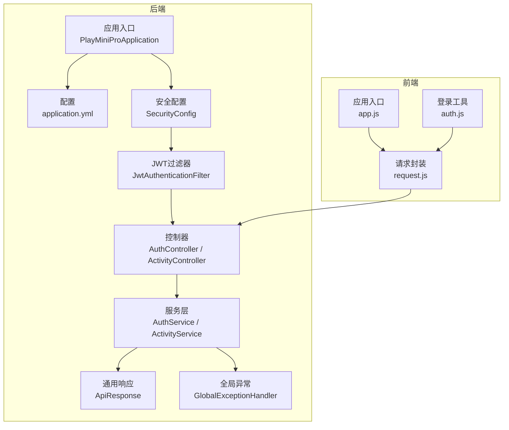
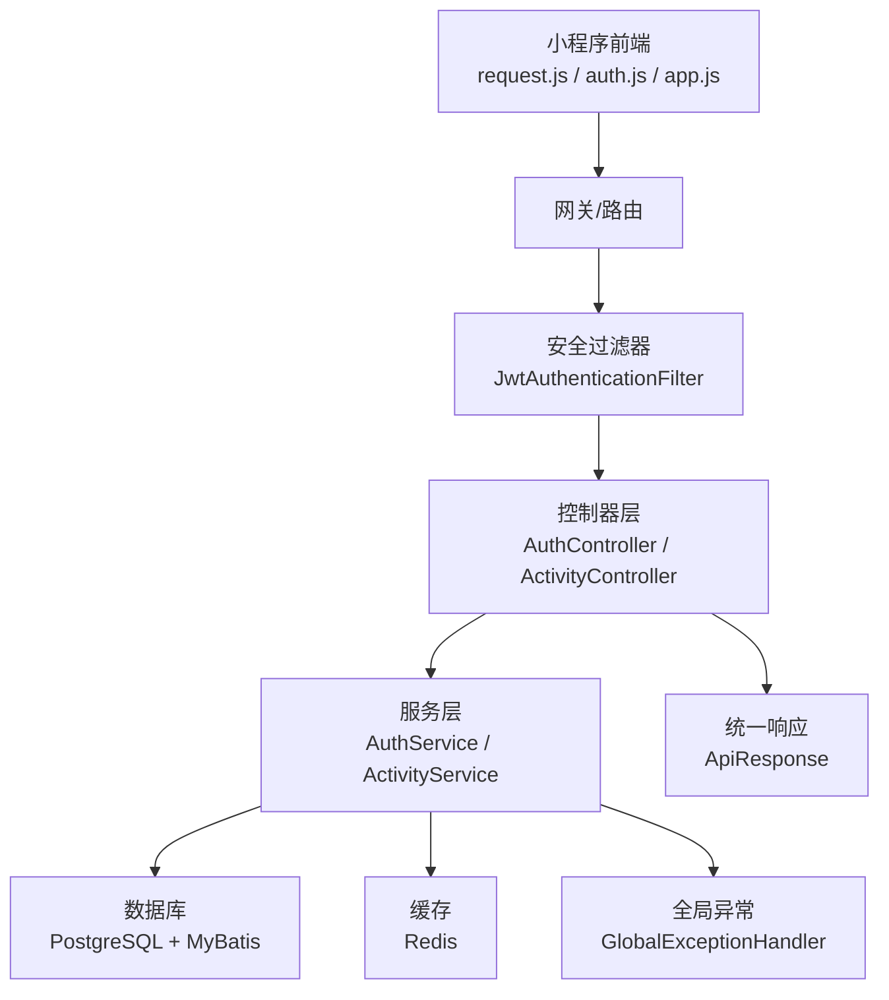
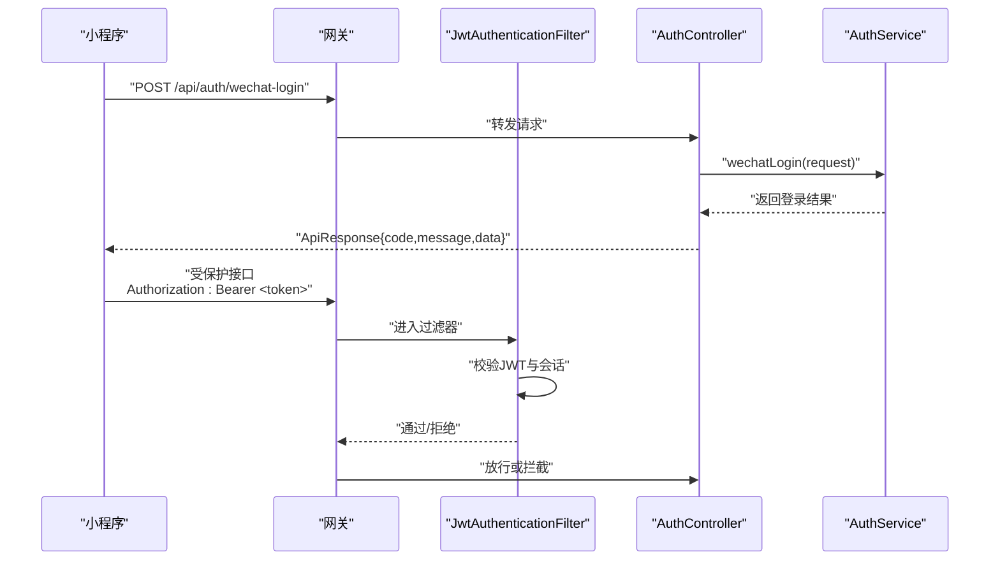
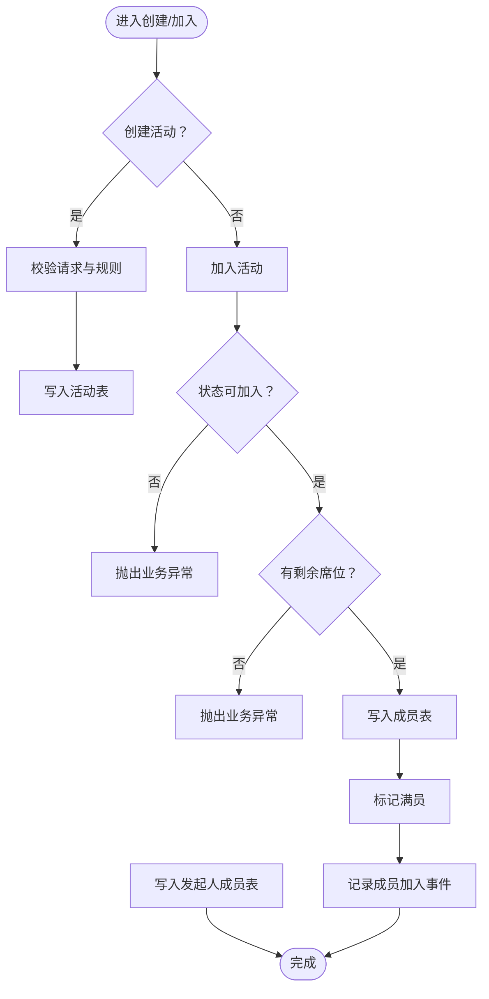
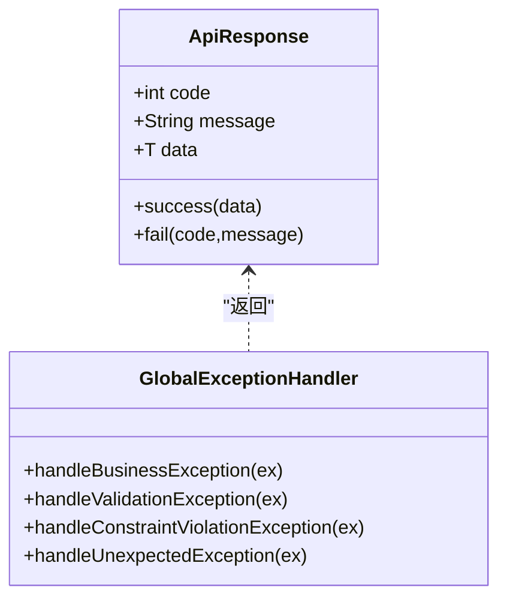
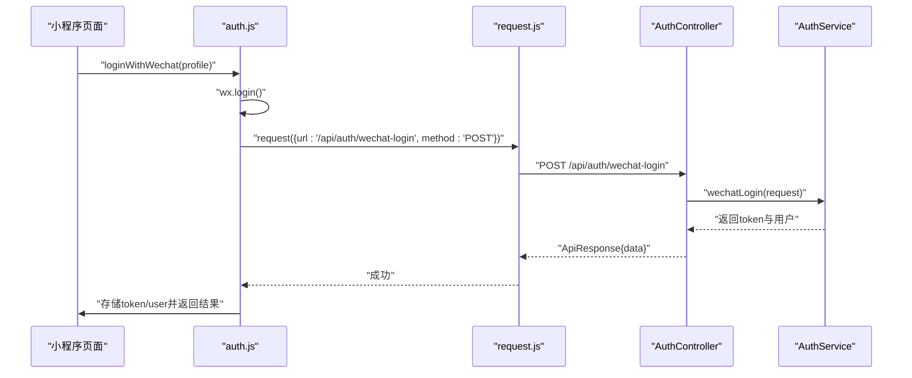
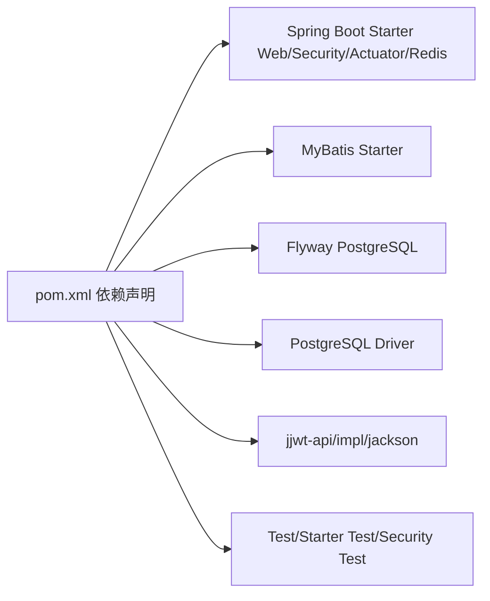

# 开发指南

<cite>
**本文引用的文件**
- [PlayMiniProApplication.java](file://backend/src/main/java/com/playminipro/PlayMiniProApplication.java)
- [pom.xml](file://backend/pom.xml)
- [README.md（后端）](file://backend/README.md)
- [application.yml](file://backend/src/main/resources/application.yml)
- [JwtProperties.java](file://backend/src/main/java/com/playminipro/common/config/JwtProperties.java)
- [SecurityConfig.java](file://backend/src/main/java/com/playminipro/common/config/SecurityConfig.java)
- [JwtAuthenticationFilter.java](file://backend/src/main/java/com/playminipro/common/security/JwtAuthenticationFilter.java)
- [AuthController.java](file://backend/src/main/java/com/playminipro/auth/controller/AuthController.java)
- [ActivityController.java](file://backend/src/main/java/com/playminipro/activity/controller/ActivityController.java)
- [AuthService.java](file://backend/src/main/java/com/playminipro/auth/service/AuthService.java)
- [ActivityService.java](file://backend/src/main/java/com/playminipro/activity/service/ActivityService.java)
- [ApiResponse.java](file://backend/src/main/java/com/playminipro/common/response/ApiResponse.java)
- [GlobalExceptionHandler.java](file://backend/src/main/java/com/playminipro/common/exception/GlobalExceptionHandler.java)
- [06-后端接口详细文档.md](file://doc/06-后端接口详细文档.md)
- [07-Java后端落地文档.md](file://doc/07-Java后端落地文档.md)
- [app.js（小程序前端）](file://frontend/app.js)
- [request.js（小程序前端）](file://frontend/utils/request.js)
- [auth.js（小程序前端）](file://frontend/utils/auth.js)
</cite>

## 目录
1. 引言
2. 项目结构
3. 核心组件
4. 架构总览
5. 详细组件分析
6. 依赖关系分析
7. 性能考量
8. 故障排查指南
9. 结论
10. 附录

## 引言
本开发指南面向PlayMiniPro项目团队，旨在统一开发规范与协作流程，覆盖Java与JavaScript代码规范、命名约定、注释标准；明确分支管理、代码评审、提交规范与版本控制；提供从需求到测试验证的功能开发流程；详述测试策略（单元、集成、端到端）；规范文档编写（技术文档、API文档、用户手册）；并给出常见问题的解决方案、调试技巧、性能优化建议、安全编码实践与代码重构指导，最终提升团队开发一致性与效率。

## 项目结构
后端采用Spring Boot 3 + Java 21 + MyBatis + PostgreSQL + Redis + Flyway的技术栈，遵循按领域模块划分的包结构，统一响应体与全局异常处理，前端为微信小程序，采用原生小程序框架与自研请求封装。

图表来源
- [PlayMiniProApplication.java:11-20](file://backend/src/main/java/com/playminipro/PlayMiniProApplication.java#L11-L20)
- [application.yml:1-53](file://backend/src/main/resources/application.yml#L1-L53)
- [SecurityConfig.java:26-41](file://backend/src/main/java/com/playminipro/common/config/SecurityConfig.java#L26-L41)
- [JwtAuthenticationFilter.java:29-55](file://backend/src/main/java/com/playminipro/common/security/JwtAuthenticationFilter.java#L29-L55)
- [AuthController.java:13-27](file://backend/src/main/java/com/playminipro/auth/controller/AuthController.java#L13-L27)
- [ActivityController.java:27-112](file://backend/src/main/java/com/playminipro/activity/controller/ActivityController.java#L27-L112)
- [AuthService.java:20-101](file://backend/src/main/java/com/playminipro/auth/service/AuthService.java#L20-L101)
- [ActivityService.java:20-232](file://backend/src/main/java/com/playminipro/activity/service/ActivityService.java#L20-L232)
- [ApiResponse.java:3-51](file://backend/src/main/java/com/playminipro/common/response/ApiResponse.java#L3-L51)
- [GlobalExceptionHandler.java:11-41](file://backend/src/main/java/com/playminipro/common/exception/GlobalExceptionHandler.java#L11-L41)
- [app.js:1-46](file://frontend/app.js#L1-L46)
- [request.js:50-107](file://frontend/utils/request.js#L50-L107)
- [auth.js:3-56](file://frontend/utils/auth.js#L3-L56)

章节来源
- [pom.xml:20-92](file://backend/pom.xml#L20-L92)
- [README.md（后端）:1-91](file://backend/README.md#L1-L91)
- [07-Java后端落地文档.md:36-87](file://doc/07-Java后端落地文档.md#L36-L87)

## 核心组件
- 应用入口与扫描：启用Spring Boot、Mapper扫描、定时任务、配置属性加载。
- 配置中心：数据库、Redis、Flyway、Jackson、Actuator、JWT与微信参数。
- 安全体系：无状态JWT过滤器 + Spring Security配置 + CORS。
- 控制器层：统一前缀与鉴权策略，返回统一响应体。
- 服务层：业务编排、事务边界、领域规则校验。
- 异常处理：业务异常、参数校验异常、未预期异常统一包装。
- 前端请求：环境切换、鉴权头注入、鉴权失效清理。

章节来源
- [PlayMiniProApplication.java:11-20](file://backend/src/main/java/com/playminipro/PlayMiniProApplication.java#L11-L20)
- [application.yml:1-53](file://backend/src/main/resources/application.yml#L1-L53)
- [SecurityConfig.java:26-55](file://backend/src/main/java/com/playminipro/common/config/SecurityConfig.java#L26-L55)
- [JwtAuthenticationFilter.java:29-55](file://backend/src/main/java/com/playminipro/common/security/JwtAuthenticationFilter.java#L29-L55)
- [AuthController.java:13-27](file://backend/src/main/java/com/playminipro/auth/controller/AuthController.java#L13-L27)
- [ActivityController.java:27-112](file://backend/src/main/java/com/playminipro/activity/controller/ActivityController.java#L27-L112)
- [ApiResponse.java:20-26](file://backend/src/main/java/com/playminipro/common/response/ApiResponse.java#L20-L26)
- [GlobalExceptionHandler.java:14-40](file://backend/src/main/java/com/playminipro/common/exception/GlobalExceptionHandler.java#L14-L40)
- [request.js:50-107](file://frontend/utils/request.js#L50-L107)

## 架构总览
后端采用分层架构：Web层（Controller）负责HTTP协议与参数绑定；Service层承载业务规则与事务；Mapper层负责SQL映射；Security层负责鉴权与CORS；配置层集中管理外部依赖。前端通过封装的请求库统一调用后端API，自动携带Authorization头并在鉴权失败时清理本地状态。

图表来源
- [JwtAuthenticationFilter.java:29-55](file://backend/src/main/java/com/playminipro/common/security/JwtAuthenticationFilter.java#L29-L55)
- [AuthController.java:13-27](file://backend/src/main/java/com/playminipro/auth/controller/AuthController.java#L13-L27)
- [ActivityController.java:27-112](file://backend/src/main/java/com/playminipro/activity/controller/ActivityController.java#L27-L112)
- [AuthService.java:20-101](file://backend/src/main/java/com/playminipro/auth/service/AuthService.java#L20-L101)
- [ActivityService.java:20-232](file://backend/src/main/java/com/playminipro/activity/service/ActivityService.java#L20-L232)
- [ApiResponse.java:3-51](file://backend/src/main/java/com/playminipro/common/response/ApiResponse.java#L3-L51)
- [GlobalExceptionHandler.java:11-41](file://backend/src/main/java/com/playminipro/common/exception/GlobalExceptionHandler.java#L11-L41)

## 详细组件分析

### 安全与鉴权流程
- 请求进入时，过滤器读取Authorization头，校验JWT有效性与会话有效性，通过则注入认证上下文。
- 未通过校验时清空上下文，交由后续拦截器或异常处理器处理。

图表来源
- [JwtAuthenticationFilter.java:29-55](file://backend/src/main/java/com/playminipro/common/security/JwtAuthenticationFilter.java#L29-L55)
- [AuthController.java:23-26](file://backend/src/main/java/com/playminipro/auth/controller/AuthController.java#L23-L26)
- [AuthService.java:41-76](file://backend/src/main/java/com/playminipro/auth/service/AuthService.java#L41-L76)

章节来源
- [SecurityConfig.java:26-41](file://backend/src/main/java/com/playminipro/common/config/SecurityConfig.java#L26-L41)
- [JwtAuthenticationFilter.java:29-55](file://backend/src/main/java/com/playminipro/common/security/JwtAuthenticationFilter.java#L29-L55)
- [AuthController.java:23-26](file://backend/src/main/java/com/playminipro/auth/controller/AuthController.java#L23-L26)
- [AuthService.java:41-76](file://backend/src/main/java/com/playminipro/auth/service/AuthService.java#L41-L76)

### 活动创建与加入流程
- 创建活动：校验请求参数与类型规则，写入活动表与发起人成员表。
- 加入活动：校验活动状态与席位，写入成员并标记满员，必要时触发通知。

图表来源
- [ActivityService.java:41-58](file://backend/src/main/java/com/playminipro/activity/service/ActivityService.java#L41-L58)
- [ActivityService.java:183-206](file://backend/src/main/java/com/playminipro/activity/service/ActivityService.java#L183-L206)

章节来源
- [ActivityService.java:100-115](file://backend/src/main/java/com/playminipro/activity/service/ActivityService.java#L100-L115)
- [ActivityService.java:183-206](file://backend/src/main/java/com/playminipro/activity/service/ActivityService.java#L183-L206)

### 统一响应与异常处理
- 统一响应体包含code/message/data三段式结构，成功code为0，失败使用业务错误码。
- 全局异常处理器捕获业务异常、参数校验异常与未预期异常，统一返回。

图表来源
- [ApiResponse.java:3-51](file://backend/src/main/java/com/playminipro/common/response/ApiResponse.java#L3-L51)
- [GlobalExceptionHandler.java:14-40](file://backend/src/main/java/com/playminipro/common/exception/GlobalExceptionHandler.java#L14-L40)

章节来源
- [ApiResponse.java:20-26](file://backend/src/main/java/com/playminipro/common/response/ApiResponse.java#L20-L26)
- [GlobalExceptionHandler.java:14-40](file://backend/src/main/java/com/playminipro/common/exception/GlobalExceptionHandler.java#L14-L40)

### 前端请求与登录流程
- 小程序通过wx.login获取code，调用后端登录接口，成功后持久化token与用户信息。
- 请求封装自动注入Authorization头，401/403时清理本地状态并回调应用登出。

图表来源
- [auth.js:3-48](file://frontend/utils/auth.js#L3-L48)
- [request.js:50-107](file://frontend/utils/request.js#L50-L107)
- [AuthController.java:23-26](file://backend/src/main/java/com/playminipro/auth/controller/AuthController.java#L23-L26)
- [AuthService.java:41-76](file://backend/src/main/java/com/playminipro/auth/service/AuthService.java#L41-L76)

章节来源
- [app.js:14-45](file://frontend/app.js#L14-L45)
- [auth.js:3-48](file://frontend/utils/auth.js#L3-L48)
- [request.js:50-107](file://frontend/utils/request.js#L50-L107)

## 依赖关系分析
- 技术栈：Spring Boot 3、MyBatis、PostgreSQL、Redis、Flyway、JWT。
- 运行与配置：application.yml集中管理数据库、Redis、JWT、微信参数与Jackson配置。
- 安全与CORS：SecurityConfig禁用CSRF与表单登录，设置无状态会话，开放特定路径，全局CORS。
- 依赖插件：Spring Boot Maven Plugin用于打包运行。

图表来源
- [pom.xml:26-92](file://backend/pom.xml#L26-L92)

章节来源
- [pom.xml:20-24](file://backend/pom.xml#L20-L24)
- [application.yml:10-18](file://backend/src/main/resources/application.yml#L10-L18)
- [application.yml:42-49](file://backend/src/main/resources/application.yml#L42-L49)

## 性能考量
- 数据访问：复杂统计与排行榜建议使用MyBatis自定义SQL，避免ORM过度抽象带来的性能损耗。
- 事务边界：涉及状态流转与多表写入的场景（创建活动、同意入局、发起结算）建议在Service层使用事务，减少跨层事务扩大。
- 异步处理：统计聚合、排行榜快照、通知推送等非强一致场景建议异步化，降低请求延迟。
- 缓存与会话：结合Redis会话与JWT，实现登录态控制与续期，减少鉴权开销。
- 排序与分页：遵循接口文档中的分页约定，避免一次性返回大列表。

章节来源
- [07-Java后端落地文档.md:149-185](file://doc/07-Java后端落地文档.md#L149-L185)
- [06-后端接口详细文档.md:520-551](file://doc/06-后端接口详细文档.md#L520-L551)

## 故障排查指南
- 登录与鉴权
  - 使用后端提供的健康检查端点确认服务可用。
  - 检查Authorization头格式与有效期，确认JWT签名与Redis会话均有效。
  - 如出现401/403，前端会自动清理本地token与用户信息，需重新登录。
- 数据库与迁移
  - Flyway启用且迁移脚本位于classpath:db/migration，确保脚本顺序正确。
  - 数据库连接参数可通过环境变量覆盖，默认地址、账号、密码见后端README。
- 参数校验与业务异常
  - 参数校验异常会被统一包装为业务错误码与提示。
  - 业务异常码参考接口文档中的建议错误码，便于定位问题。

章节来源
- [README.md（后端）:21-91](file://backend/README.md#L21-L91)
- [application.yml:20-22](file://backend/src/main/resources/application.yml#L20-L22)
- [GlobalExceptionHandler.java:14-40](file://backend/src/main/java/com/playminipro/common/exception/GlobalExceptionHandler.java#L14-L40)
- [06-后端接口详细文档.md:473-487](file://doc/06-后端接口详细文档.md#L473-L487)

## 结论
本指南基于现有代码与文档，明确了PlayMiniPro项目的开发规范、架构要点与协作流程。建议团队在日常开发中严格遵循统一的响应体、异常处理、安全策略与命名约定；在功能开发中坚持“需求-设计-实现-测试”的闭环；在测试层面覆盖单元、集成与端到端；在文档层面保持API与技术文档的一致性与可追溯性；在性能与安全方面持续优化与加固，从而保障项目的高质量交付与可持续演进。

## 附录

### 代码规范与最佳实践

- Java规范
  - 包结构：按领域模块划分（auth/activity/expense/settlement/stats/ranking/common），避免交叉耦合。
  - 类与方法：单一职责、短方法、清晰命名；Service层承担业务编排与事务边界；DTO与Entity分离。
  - 注解与配置：统一使用@RestControllerAdvice与@ControllerAdvice；@ConfigurationProperties集中配置。
  - 日志与异常：使用统一响应体与全局异常处理；业务异常抛出时附带明确错误码与消息。
- JavaScript规范（小程序）
  - 文件命名：utils目录下按功能拆分（request/auth/subscribe等），避免大而全文件。
  - 请求封装：统一注入Authorization头；对401/403进行本地状态清理；支持环境切换。
  - 页面与逻辑：页面逻辑尽量薄化，复用公共组件与工具函数。

章节来源
- [07-Java后端落地文档.md:36-87](file://doc/07-Java后端落地文档.md#L36-L87)
- [ApiResponse.java:20-26](file://backend/src/main/java/com/playminipro/common/response/ApiResponse.java#L20-L26)
- [GlobalExceptionHandler.java:14-40](file://backend/src/main/java/com/playminipro/common/exception/GlobalExceptionHandler.java#L14-L40)
- [request.js:50-107](file://frontend/utils/request.js#L50-L107)

### 开发流程与协作规范

- 分支管理
  - 主干：main（受保护），hotfix/feature/release分支从main切出，合并回main并打标签。
- 提交规范
  - 标题：type(scope): subject（如feat(auth): 添加微信登录接口）。
  - 描述：简述变更动机与影响范围，必要时附测试要点。
- 代码评审
  - PR必有评审，关注：安全性、可测试性、性能影响、文档一致性。
- 版本控制
  - 使用语义化版本，重要变更在CHANGELOG中记录；发布前确保集成测试通过。

章节来源
- [README.md（后端）:21-91](file://backend/README.md#L21-L91)
- [06-后端接口详细文档.md:488-551](file://doc/06-后端接口详细文档.md#L488-L551)

### 功能开发标准流程
- 需求分析：明确接口与业务规则，参考接口文档与落地文档。
- 设计讨论：确定DTO/Entity/Service/Controller职责与事务边界。
- 编码实现：遵循统一响应体与异常处理；完善参数校验与边界条件。
- 测试验证：单元测试覆盖关键分支；集成测试覆盖端到端流程；端到端测试覆盖核心用户路径。

章节来源
- [06-后端接口详细文档.md:12-30](file://doc/06-后端接口详细文档.md#L12-L30)
- [07-Java后端落地文档.md:169-185](file://doc/07-Java后端落地文档.md#L169-L185)

### 测试策略
- 单元测试：针对Service层事务边界与业务规则；使用嵌套事务隔离。
- 集成测试：覆盖Controller到Service到Mapper的完整链路；模拟外部依赖（如微信网关）。
- 端到端测试：小程序侧模拟用户登录、创建活动、加入活动、费用记账与结算全流程。

章节来源
- [pom.xml:84-91](file://backend/pom.xml#L84-L91)
- [06-后端接口详细文档.md:488-551](file://doc/06-后端接口详细文档.md#L488-L551)

### 文档编写规范
- 技术文档：描述模块职责、数据模型、事务边界与异步策略。
- API文档：接口前缀、鉴权方式、请求/响应结构、错误码与示例。
- 用户手册：小程序操作步骤、常见问题与截图说明。

章节来源
- [06-后端接口详细文档.md:1-551](file://doc/06-后端接口详细文档.md#L1-L551)
- [07-Java后端落地文档.md:1-231](file://doc/07-Java后端落地文档.md#L1-L231)

### 常见问题与调试技巧
- 登录失败：检查WECHAT_MINI_APP_SECRET与WECHAT_MOCK_LOGIN_ENABLED配置；确认后端日志与Redis会话。
- 鉴权失败：核对Authorization头格式；检查JWT签名与会话有效性；确认会话续期逻辑。
- 数据不一致：核对事务边界与幂等设计；检查异步任务执行情况。

章节来源
- [README.md（后端）:53-91](file://backend/README.md#L53-L91)
- [JwtAuthenticationFilter.java:33-51](file://backend/src/main/java/com/playminipro/common/security/JwtAuthenticationFilter.java#L33-L51)

### 性能优化建议
- SQL优化：复杂统计与排行榜使用索引与物化视图；避免N+1查询。
- 缓存策略：热点数据与会话缓存；合理设置TTL与失效策略。
- 并发控制：对高并发接口增加限流与降级预案。

章节来源
- [07-Java后端落地文档.md:149-185](file://doc/07-Java后端落地文档.md#L149-L185)

### 安全编码实践
- 输入校验：前后端双重校验；使用Spring Validation与DTO约束。
- 权限控制：JWT + 会话双因子校验；发起人权限在Service层二次校验。
- 敏感信息：JWT密钥与数据库凭据通过环境变量注入；避免硬编码。

章节来源
- [SecurityConfig.java:26-41](file://backend/src/main/java/com/playminipro/common/config/SecurityConfig.java#L26-L41)
- [JwtAuthenticationFilter.java:33-51](file://backend/src/main/java/com/playminipro/common/security/JwtAuthenticationFilter.java#L33-L51)
- [application.yml:42-49](file://backend/src/main/resources/application.yml#L42-L49)

### 代码重构指导
- 解耦与内聚：按领域拆分模块，避免跨模块循环依赖。
- 接口稳定性：对外接口保持向后兼容；变更时提供迁移指引。
- 可测试性：将业务逻辑从Controller剥离至Service；引入适配器与门面简化测试。

章节来源
- [07-Java后端落地文档.md:36-87](file://doc/07-Java后端落地文档.md#L36-L87)