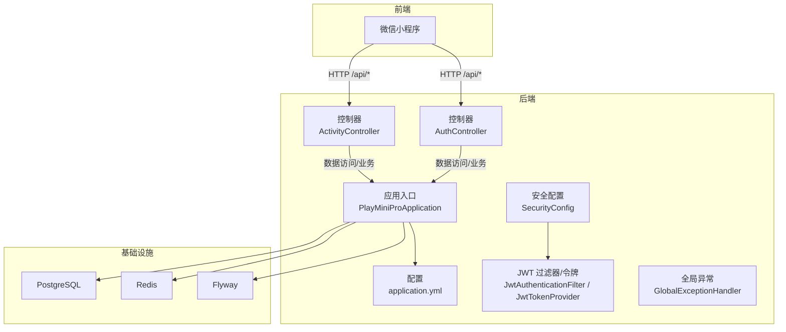
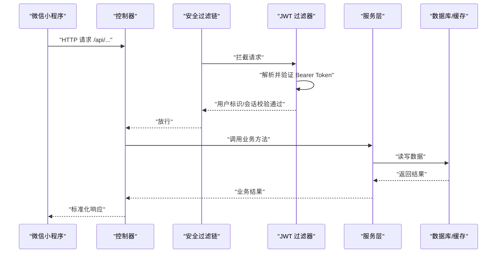
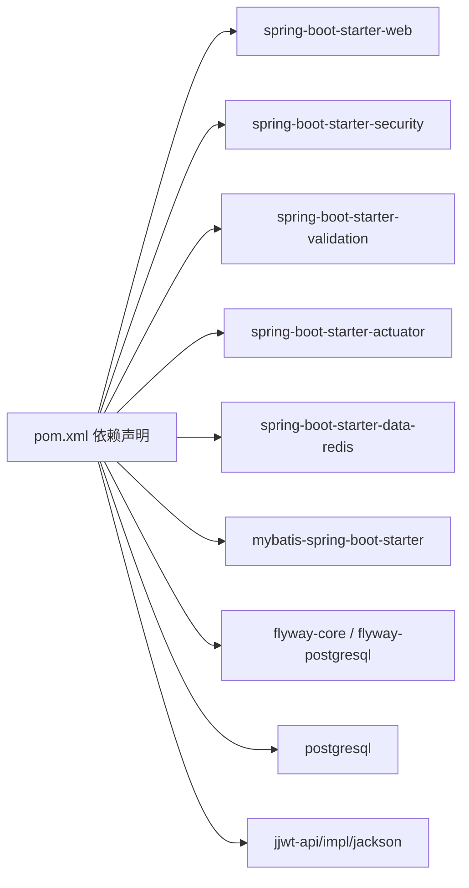

# 开发流程

<cite>
**本文引用的文件**
- [PlayMiniProApplication.java](file://backend/src/main/java/com/playminipro/PlayMiniProApplication.java)
- [pom.xml](file://backend/pom.xml)
- [application.yml](file://backend/src/main/resources/application.yml)
- [docker-compose.yml](file://backend/docker-compose.yml)
- [docker-compose.prod.yml](file://deploy/docker-compose.prod.yml)
- [08-部署发布指南.md](file://doc/08-部署发布指南.md)
- [07-Java后端落地文档.md](file://doc/07-Java后端落地文档.md)
- [06-后端接口详细文档.md](file://doc/06-后端接口详细文档.md)
- [04-数据库设计文档.md](file://doc/04-数据库设计文档.md)
- [SecurityConfig.java](file://backend/src/main/java/com/playminipro/common/config/SecurityConfig.java)
- [JwtProperties.java](file://backend/src/main/java/com/playminipro/common/config/JwtProperties.java)
- [JwtAuthenticationFilter.java](file://backend/src/main/java/com/playminipro/common/security/JwtAuthenticationFilter.java)
- [JwtTokenProvider.java](file://backend/src/main/java/com/playminipro/common/security/JwtTokenProvider.java)
- [GlobalExceptionHandler.java](file://backend/src/main/java/com/playminipro/common/exception/GlobalExceptionHandler.java)
- [ApiResponse.java](file://backend/src/main/java/com/playminipro/common/response/ApiResponse.java)
- [AuthController.java](file://backend/src/main/java/com/playminipro/auth/controller/AuthController.java)
- [ActivityController.java](file://backend/src/main/java/com/playminipro/activity/controller/ActivityController.java)
</cite>

## 目录
1. [简介](#简介)
2. [项目结构](#项目结构)
3. [核心组件](#核心组件)
4. [架构总览](#架构总览)
5. [详细组件分析](#详细组件分析)
6. [依赖分析](#依赖分析)
7. [性能考量](#性能考量)
8. [故障排查指南](#故障排查指南)
9. [结论](#结论)
10. [附录](#附录)

## 简介
本文件为 PlayMiniPro 项目制定标准化的开发流程文档，覆盖从需求分析到上线发布的全流程，包括需求评审、技术设计、任务分解、开发实施、测试验证、代码审查、部署上线等环节；制定分支管理策略（主分支保护、功能分支创建、特性分支合并、热修复分支处理）；建立代码审查流程（审查标准、审查清单、反馈处理、批准流程）；规范版本控制实践（标签管理、版本号规则、变更日志维护）；提供开发环境配置指南（IDE 设置、插件推荐、调试配置）；并包含团队协作规范（每日站会、迭代计划、回顾总结等敏捷实践）。

## 项目结构
项目采用前后端分离架构，后端基于 Spring Boot 3 + Java 21，数据库使用 PostgreSQL，通过 Flyway 管理数据库迁移，Redis 提供缓存，使用 Docker Compose 进行本地与生产环境编排。前端为微信小程序，接口统一走后端 /api 前缀并通过 JWT 鉴权。

图表来源
- [PlayMiniProApplication.java:11-20](file://backend/src/main/java/com/playminipro/PlayMiniProApplication.java#L11-L20)
- [application.yml:10-49](file://backend/src/main/resources/application.yml#L10-L49)
- [SecurityConfig.java:26-41](file://backend/src/main/java/com/playminipro/common/config/SecurityConfig.java#L26-L41)
- [JwtAuthenticationFilter.java:29-55](file://backend/src/main/java/com/playminipro/common/security/JwtAuthenticationFilter.java#L29-L55)
- [AuthController.java:23-26](file://backend/src/main/java/com/playminipro/auth/controller/AuthController.java#L23-L26)
- [ActivityController.java:45-111](file://backend/src/main/java/com/playminipro/activity/controller/ActivityController.java#L45-L111)
- [GlobalExceptionHandler.java:14-40](file://backend/src/main/java/com/playminipro/common/exception/GlobalExceptionHandler.java#L14-L40)

章节来源
- [PlayMiniProApplication.java:11-20](file://backend/src/main/java/com/playminipro/PlayMiniProApplication.java#L11-L20)
- [pom.xml:26-92](file://backend/pom.xml#L26-L92)
- [application.yml:10-49](file://backend/src/main/resources/application.yml#L10-L49)
- [docker-compose.yml:1-36](file://backend/docker-compose.yml#L1-L36)
- [docker-compose.prod.yml:1-61](file://deploy/docker-compose.prod.yml#L1-L61)

## 核心组件
- 应用入口与扫描：应用入口启用组件扫描与定时任务，加载配置属性，暴露 Actuator 健康检查。
- 安全与鉴权：基于 Spring Security + JWT，无状态会话，开放登录接口，其余接口需认证。
- 控制器层：统一 /api 前缀，鉴权通过后由控制器调用服务层处理业务。
- 全局异常：统一捕获业务异常、参数校验异常与未预期异常，返回标准化响应。
- 配置与外部化：数据库、Redis、JWT、微信配置通过环境变量注入，支持本地与生产差异化。

章节来源
- [PlayMiniProApplication.java:11-20](file://backend/src/main/java/com/playminipro/PlayMiniProApplication.java#L11-L20)
- [SecurityConfig.java:26-41](file://backend/src/main/java/com/playminipro/common/config/SecurityConfig.java#L26-L41)
- [JwtAuthenticationFilter.java:29-55](file://backend/src/main/java/com/playminipro/common/security/JwtAuthenticationFilter.java#L29-L55)
- [JwtTokenProvider.java:26-38](file://backend/src/main/java/com/playminipro/common/security/JwtTokenProvider.java#L26-L38)
- [AuthController.java:23-26](file://backend/src/main/java/com/playminipro/auth/controller/AuthController.java#L23-L26)
- [ActivityController.java:45-111](file://backend/src/main/java/com/playminipro/activity/controller/ActivityController.java#L45-L111)
- [GlobalExceptionHandler.java:14-40](file://backend/src/main/java/com/playminipro/common/exception/GlobalExceptionHandler.java#L14-L40)
- [ApiResponse.java:20-26](file://backend/src/main/java/com/playminipro/common/response/ApiResponse.java#L20-L26)
- [application.yml:10-49](file://backend/src/main/resources/application.yml#L10-L49)

## 架构总览
后端采用分层架构：Controller → Service → Mapper/Repository → 数据库/缓存。JWT 过滤器在安全过滤链中解析并验证令牌，随后将用户标识放入安全上下文。Actuator 暴露健康检查端点，便于部署与运维监控。

图表来源
- [SecurityConfig.java:26-41](file://backend/src/main/java/com/playminipro/common/config/SecurityConfig.java#L26-L41)
- [JwtAuthenticationFilter.java:29-55](file://backend/src/main/java/com/playminipro/common/security/JwtAuthenticationFilter.java#L29-L55)
- [JwtTokenProvider.java:40-51](file://backend/src/main/java/com/playminipro/common/security/JwtTokenProvider.java#L40-L51)
- [AuthController.java:23-26](file://backend/src/main/java/com/playminipro/auth/controller/AuthController.java#L23-L26)
- [ActivityController.java:45-111](file://backend/src/main/java/com/playminipro/activity/controller/ActivityController.java#L45-L111)

## 详细组件分析

### 需求分析与评审
- 输入：产品需求、接口文档、数据库设计文档。
- 输出：需求评审结论、技术方案、风险评估。
- 关键点：明确接口前缀、鉴权方式、金额与时间单位、主键规范；确认邀请回执闭环、费用与结算流程、统计与排行榜的实现边界。

章节来源
- [06-后端接口详细文档.md:22-29](file://doc/06-后端接口详细文档.md#L22-L29)
- [04-数据库设计文档.md:11-17](file://doc/04-数据库设计文档.md#L11-L17)

### 技术设计与任务分解
- 技术栈：Spring Boot 3 + Java 21 + PostgreSQL + MyBatis/Flyway + Redis + Docker。
- 包结构：按领域划分模块（auth、activity 等），统一响应与异常处理。
- 任务分解：将接口清单拆解为控制器、服务、Mapper、DTO、Entity、单元测试任务；明确事务边界与异步处理点。

章节来源
- [07-Java后端落地文档.md:13-28](file://doc/07-Java后端落地文档.md#L13-L28)
- [07-Java后端落地文档.md:36-87](file://doc/07-Java后端落地文档.md#L36-L87)
- [06-后端接口详细文档.md:488-551](file://doc/06-后端接口详细文档.md#L488-L551)

### 开发实施与测试验证
- 开发流程：新建分支 → 编码 → 单测 → 本地联调 → 提交 PR。
- 测试策略：接口测试（Swagger/Postman）、集成测试（本地 Docker 环境）、端到端（小程序真机）。
- 代码质量：统一响应结构、异常处理、参数校验、日志级别。

章节来源
- [ApiResponse.java:20-26](file://backend/src/main/java/com/playminipro/common/response/ApiResponse.java#L20-L26)
- [GlobalExceptionHandler.java:14-40](file://backend/src/main/java/com/playminipro/common/exception/GlobalExceptionHandler.java#L14-L40)
- [docker-compose.yml:1-36](file://backend/docker-compose.yml#L1-L36)

### 代码审查流程
- 审查标准：接口一致性、鉴权与安全、事务边界、异常处理、可测试性、可维护性。
- 审查清单：是否遵循统一响应/异常；是否覆盖关键分支；是否新增依赖；是否影响数据库迁移；是否更新接口文档。
- 反馈处理：按审查意见修改并在 CI 通过后合并。
- 批准流程：至少一名 reviewer 同意，master 保护分支需通过 CI 与审查。

章节来源
- [06-后端接口详细文档.md:488-551](file://doc/06-后端接口详细文档.md#L488-L551)
- [SecurityConfig.java:26-41](file://backend/src/main/java/com/playminipro/common/config/SecurityConfig.java#L26-L41)

### 部署上线流程
- 后端发布：本地打包 → 上传 JAR/必要部署文件 → 服务器重建容器 → 健康检查 → 公网验证。
- 前端发布：使用开发者工具上传体验版 → 平台审核 → 真机扫码验证。
- 发布顺序：后端先于前端，确保接口与配置一致。

章节来源
- [08-部署发布指南.md:32-174](file://doc/08-部署发布指南.md#L32-L174)
- [08-部署发布指南.md:175-289](file://doc/08-部署发布指南.md#L175-L289)
- [docker-compose.prod.yml:32-58](file://deploy/docker-compose.prod.yml#L32-L58)

### 分支管理策略
- 主分支保护：master/main 保护，禁止直接推送，强制 PR 合并。
- 功能分支：feature/前缀，命名清晰，短期存在，随功能完成删除。
- 特性分支：enhancement/前缀，用于较大改动，合并后删除。
- 热修复分支：hotfix/前缀，紧急修复线上问题，修复后合并至 master 与 develop，并打标签。

章节来源
- [08-部署发布指南.md:32-174](file://doc/08-部署发布指南.md#L32-L174)

### 版本控制实践
- 标签管理：hotfix 修复打 vMAJOR.MINOR.PATCH；功能发布打 vMAJOR.MINOR.PATCH（语义化版本）。
- 版本号规则：MAJOR.MINOR.PATCH，遵循语义化版本。
- 变更日志：每次发布更新 CHANGELOG 或在 PR 描述中记录变更摘要。

章节来源
- [pom.xml:16](file://backend/pom.xml#L16)

### 开发环境配置指南
- IDE 设置：启用 Lombok（如使用）、MapStruct（如使用）；配置代码风格（Google Style 或 Spring Boot 官方风格）。
- 插件推荐：Checkstyle/SpotBugs/PMD（可选）、GitLens、REST Client。
- 调试配置：本地运行 application.yml，设置 DB/Redis/JWT/微信配置；使用 docker-compose 启动依赖服务；通过 Actuator 健康检查验证。

章节来源
- [application.yml:10-49](file://backend/src/main/resources/application.yml#L10-L49)
- [docker-compose.yml:1-36](file://backend/docker-compose.yml#L1-L36)

### 团队协作规范
- 每日站会：同步进展、阻塞问题、当日计划。
- 迭代计划：确定迭代目标、任务分配、验收标准。
- 回顾总结：识别改进点，优化流程与技术债。

章节来源
- [08-部署发布指南.md:245-258](file://doc/08-部署发布指南.md#L245-L258)

## 依赖分析
后端依赖包括 Web、Security、MyBatis、Flyway、PostgreSQL、Redis、Actuator、jjwt 等。Maven 插件负责打包与测试。

图表来源
- [pom.xml:26-92](file://backend/pom.xml#L26-L92)

章节来源
- [pom.xml:26-92](file://backend/pom.xml#L26-L92)

## 性能考量
- 数据库：Flyway 管理迁移，PostgreSQL 使用索引与分区策略（按设计文档建议）；避免在高频页面做复杂聚合。
- 缓存：Redis 用于会话与热点数据；注意缓存一致性与过期策略。
- 接口：短轮询满足实时性需求，后续可引入 WebSocket/长轮询；避免在服务端做重型计算。
- 安全：无状态 JWT，减少会话存储压力；合理设置过期时间。

章节来源
- [07-Java后端落地文档.md:169-186](file://doc/07-Java后端落地文档.md#L169-L186)
- [06-后端接口详细文档.md:488-551](file://doc/06-后端接口详细文档.md#L488-L551)

## 故障排查指南
- 健康检查：通过 /actuator/health 验证后端状态。
- 登录失败：检查微信 AppSecret、mock 登录开关、前端域名配置。
- 体验版异常：真机严格校验 HTTPS 与合法域名，优先以真机结果为准。
- 上传新 JAR 未生效：确认使用 --build 重建镜像。

章节来源
- [08-部署发布指南.md:143-174](file://doc/08-部署发布指南.md#L143-L174)
- [08-部署发布指南.md:259-289](file://doc/08-部署发布指南.md#L259-L289)

## 结论
本流程文档明确了 PlayMiniPro 项目的标准化开发流程与协作规范，结合现有技术栈与部署实践，确保从需求到上线的可控、可追溯与高质量交付。建议持续完善自动化测试与 CI/CD，逐步引入可观测性与灰度发布策略。

## 附录

### 接口鉴权与安全要点
- 鉴权方式：Authorization: Bearer <token>。
- 登录接口：开放；其余接口需认证。
- 无状态：基于 JWT，禁用会话。

章节来源
- [06-后端接口详细文档.md:22-29](file://doc/06-后端接口详细文档.md#L22-L29)
- [SecurityConfig.java:35-37](file://backend/src/main/java/com/playminipro/common/config/SecurityConfig.java#L35-L37)

### 数据库迁移与版本管理
- 迁移脚本：Flyway 管理，位置 classpath:db/migration。
- 设计依据：数据库设计文档定义的核心表与关系。

章节来源
- [application.yml:20-22](file://backend/src/main/resources/application.yml#L20-L22)
- [04-数据库设计文档.md:29-537](file://doc/04-数据库设计文档.md#L29-L537)