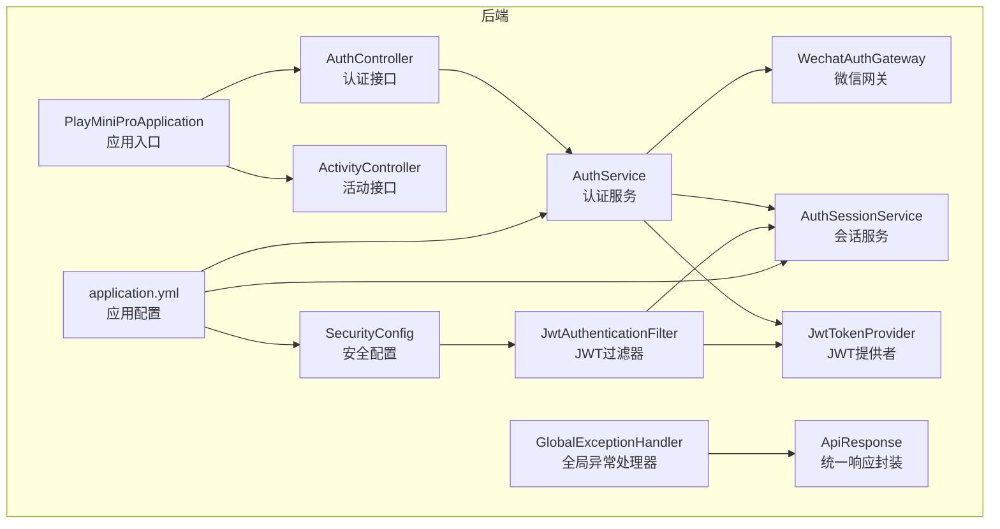
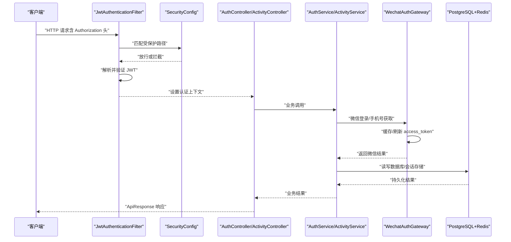
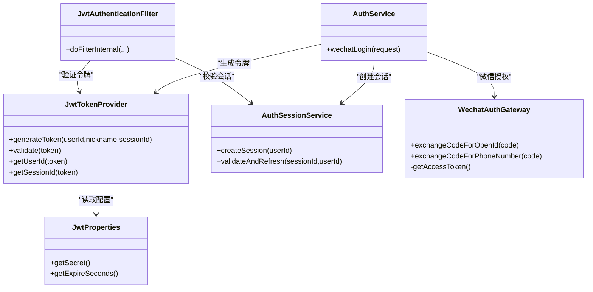
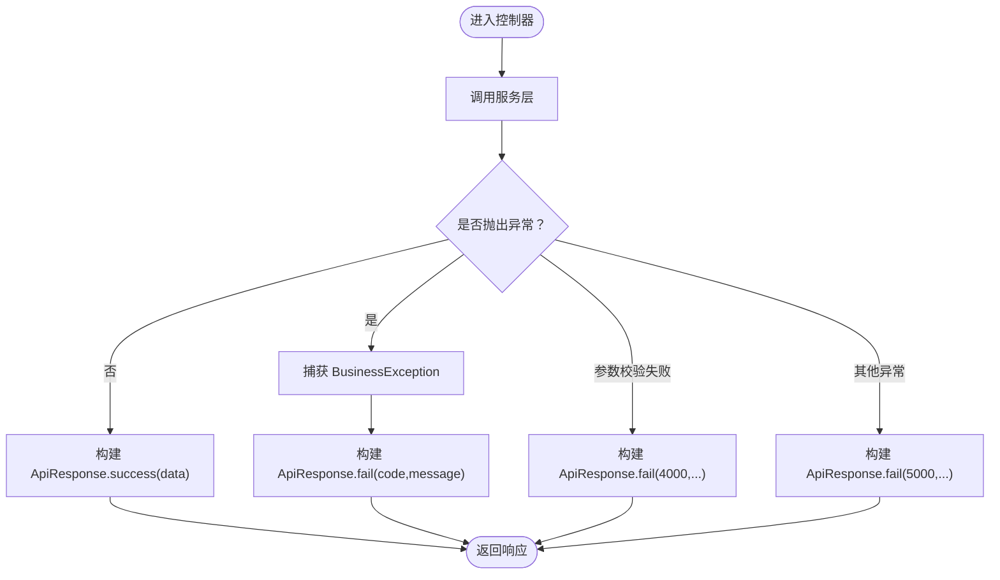
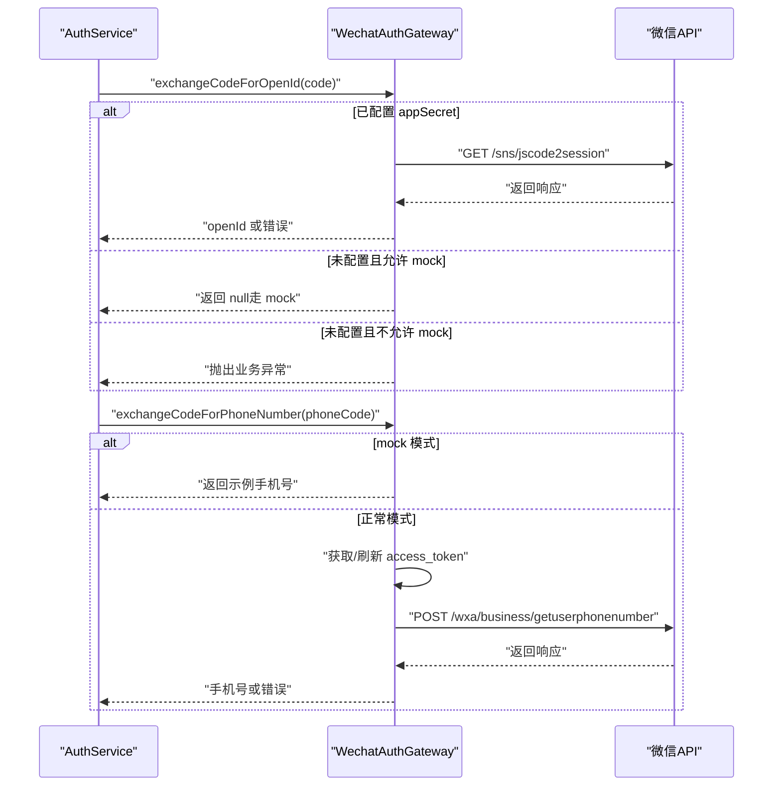
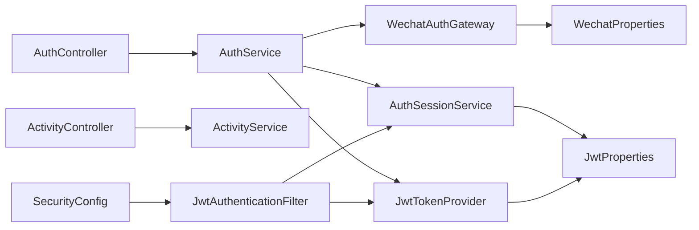

# 故障排查与调试

<cite>
**本文引用的文件**
- [后端应用入口](file://backend/src/main/java/com/playminipro/PlayMiniProApplication.java)
- [全局异常处理器](file://backend/src/main/java/com/playminipro/common/exception/GlobalExceptionHandler.java)
- [业务异常类](file://backend/src/main/java/com/playminipro/common/exception/BusinessException.java)
- [统一响应封装](file://backend/src/main/java/com/playminipro/common/response/ApiResponse.java)
- [JWT 配置](file://backend/src/main/java/com/playminipro/common/config/JwtProperties.java)
- [微信配置](file://backend/src/main/java/com/playminipro/common/config/WechatProperties.java)
- [安全配置](file://backend/src/main/java/com/playminipro/common/config/SecurityConfig.java)
- [JWT 过滤器](file://backend/src/main/java/com/playminipro/common/security/JwtAuthenticationFilter.java)
- [JWT 提供者](file://backend/src/main/java/com/playminipro/common/security/JwtTokenProvider.java)
- [会话服务](file://backend/src/main/java/com/playminipro/common/security/AuthSessionService.java)
- [认证控制器](file://backend/src/main/java/com/playminipro/auth/controller/AuthController.java)
- [认证服务](file://backend/src/main/java/com/playminipro/auth/service/AuthService.java)
- [微信认证网关](file://backend/src/main/java/com/playminipro/auth/service/WechatAuthGateway.java)
- [活动控制器](file://backend/src/main/java/com/playminipro/activity/controller/ActivityController.java)
- [应用配置](file://backend/src/main/resources/application.yml)
- [数据库迁移脚本（V1）](file://backend/src/main/resources/db/migration/V1__init_core_tables.sql)
- [数据库迁移脚本（V2）](file://backend/src/main/resources/db/migration/V2__add_user_phone_number.sql)
- [数据库迁移脚本（V3）](file://backend/src/main/resources/db/migration/V3__add_activity_expenses.sql)
- [数据库迁移脚本（V4）](file://backend/src/main/resources/db/migration/V4__add_activity_notification_events.sql)
</cite>

## 目录
1. [简介](#简介)
2. [项目结构](#项目结构)
3. [核心组件](#核心组件)
4. [架构总览](#架构总览)
5. [详细组件分析](#详细组件分析)
6. [依赖分析](#依赖分析)
7. [性能考虑](#性能考虑)
8. [故障排查指南](#故障排查指南)
9. [结论](#结论)
10. [附录](#附录)

## 简介
本指南面向 PlayMiniPro 后端团队与运维人员，提供系统化的故障排查与调试方法，覆盖编译错误、运行时异常、数据库连接问题、API 调用失败、JWT 认证问题、微信授权异常、数据库死锁与内存溢出等常见问题，并给出调试工具、日志策略、性能分析与安全检查建议。

## 项目结构
后端采用 Spring Boot + MyBatis 架构，模块按领域划分：auth（认证）、activity（活动）、common（通用：异常、响应、安全、配置）。配置集中在 application.yml，数据库迁移通过 Flyway 管理。

图表来源
- [后端应用入口](file://backend/src/main/java/com/playminipro/PlayMiniProApplication.java)
- [认证控制器](file://backend/src/main/java/com/playminipro/auth/controller/AuthController.java)
- [活动控制器](file://backend/src/main/java/com/playminipro/activity/controller/ActivityController.java)
- [认证服务](file://backend/src/main/java/com/playminipro/auth/service/AuthService.java)
- [微信认证网关](file://backend/src/main/java/com/playminipro/auth/service/WechatAuthGateway.java)
- [JWT 过滤器](file://backend/src/main/java/com/playminipro/common/security/JwtAuthenticationFilter.java)
- [JWT 提供者](file://backend/src/main/java/com/playminipro/common/security/JwtTokenProvider.java)
- [会话服务](file://backend/src/main/java/com/playminipro/common/security/AuthSessionService.java)
- [安全配置](file://backend/src/main/java/com/playminipro/common/config/SecurityConfig.java)
- [全局异常处理器](file://backend/src/main/java/com/playminipro/common/exception/GlobalExceptionHandler.java)
- [统一响应封装](file://backend/src/main/java/com/playminipro/common/response/ApiResponse.java)
- [应用配置](file://backend/src/main/resources/application.yml)

章节来源
- [应用配置:1-53](file://backend/src/main/resources/application.yml#L1-L53)

## 核心组件
- 统一响应封装：所有接口返回固定结构，便于前端与监控系统解析。
- 全局异常处理器：集中处理业务异常、参数校验异常与未预期异常，返回标准化错误码与消息。
- 安全与认证：基于 JWT 的无状态认证，结合 Redis 会话校验；微信登录通过网关对接微信 API。
- 数据访问：MyBatis Mapper + Flyway 迁移，PostgreSQL 作为主库。

章节来源
- [统一响应封装:1-51](file://backend/src/main/java/com/playminipro/common/response/ApiResponse.java#L1-L51)
- [全局异常处理器:1-41](file://backend/src/main/java/com/playminipro/common/exception/GlobalExceptionHandler.java#L1-L41)
- [安全配置:1-55](file://backend/src/main/java/com/playminipro/common/config/SecurityConfig.java#L1-L55)
- [JWT 过滤器:1-56](file://backend/src/main/java/com/playminipro/common/security/JwtAuthenticationFilter.java#L1-L56)
- [JWT 提供者:1-60](file://backend/src/main/java/com/playminipro/common/security/JwtTokenProvider.java#L1-L60)
- [会话服务:1-53](file://backend/src/main/java/com/playminipro/common/security/AuthSessionService.java#L1-L53)
- [微信认证网关:1-171](file://backend/src/main/java/com/playminipro/auth/service/WechatAuthGateway.java#L1-L171)

## 架构总览
下图展示请求从客户端到服务端的关键路径：鉴权过滤器、控制器、服务层、数据访问与外部微信 API。

图表来源
- [JWT 过滤器:29-55](file://backend/src/main/java/com/playminipro/common/security/JwtAuthenticationFilter.java#L29-L55)
- [安全配置:26-41](file://backend/src/main/java/com/playminipro/common/config/SecurityConfig.java#L26-L41)
- [认证控制器:23-26](file://backend/src/main/java/com/playminipro/auth/controller/AuthController.java#L23-L26)
- [活动控制器:45-111](file://backend/src/main/java/com/playminipro/activity/controller/ActivityController.java#L45-L111)
- [认证服务:41-76](file://backend/src/main/java/com/playminipro/auth/service/AuthService.java#L41-L76)
- [微信认证网关:39-111](file://backend/src/main/java/com/playminipro/auth/service/WechatAuthGateway.java#L39-L111)
- [会话服务:31-44](file://backend/src/main/java/com/playminipro/common/security/AuthSessionService.java#L31-L44)

## 详细组件分析

### 组件A：认证与会话（JWT + Redis）
- 关键职责：生成与验证 JWT，校验会话有效性，与微信 API 对接换取 openId/手机号。
- 异常点：JWT 秘钥不一致、过期、Redis 会话不存在或不匹配；微信 app secret 未配置、access_token 缓存失效。
- 排查要点：核对 JWT_SECRET、JWT_EXPIRE_SECONDS；确认 Redis 可达性与 TTL；检查微信 appid/appsecret 与 mock 登录开关。

图表来源
- [JWT 配置:1-27](file://backend/src/main/java/com/playminipro/common/config/JwtProperties.java#L1-L27)
- [JWT 过滤器:1-56](file://backend/src/main/java/com/playminipro/common/security/JwtAuthenticationFilter.java#L1-L56)
- [JWT 提供者:1-60](file://backend/src/main/java/com/playminipro/common/security/JwtTokenProvider.java#L1-L60)
- [会话服务:1-53](file://backend/src/main/java/com/playminipro/common/security/AuthSessionService.java#L1-L53)
- [微信认证网关:1-171](file://backend/src/main/java/com/playminipro/auth/service/WechatAuthGateway.java#L1-L171)
- [认证服务:1-101](file://backend/src/main/java/com/playminipro/auth/service/AuthService.java#L1-L101)

章节来源
- [JWT 配置:1-27](file://backend/src/main/java/com/playminipro/common/config/JwtProperties.java#L1-L27)
- [JWT 过滤器:1-56](file://backend/src/main/java/com/playminipro/common/security/JwtAuthenticationFilter.java#L1-L56)
- [JWT 提供者:1-60](file://backend/src/main/java/com/playminipro/common/security/JwtTokenProvider.java#L1-L60)
- [会话服务:1-53](file://backend/src/main/java/com/playminipro/common/security/AuthSessionService.java#L1-L53)
- [微信认证网关:1-171](file://backend/src/main/java/com/playminipro/auth/service/WechatAuthGateway.java#L1-L171)
- [认证服务:1-101](file://backend/src/main/java/com/playminipro/auth/service/AuthService.java#L1-L101)

### 组件B：全局异常处理与统一响应
- 统一响应：成功返回 code=0，失败返回自定义 code/message；便于前端与监控系统识别。
- 全局异常：业务异常、参数校验异常、约束异常、未预期异常分别映射到不同 HTTP 状态与错误码。
- 排查要点：关注错误码与 message 字段，结合日志定位具体异常类型与触发位置。

图表来源
- [全局异常处理器:14-40](file://backend/src/main/java/com/playminipro/common/exception/GlobalExceptionHandler.java#L14-L40)
- [业务异常类:1-15](file://backend/src/main/java/com/playminipro/common/exception/BusinessException.java#L1-L15)
- [统一响应封装:20-26](file://backend/src/main/java/com/playminipro/common/response/ApiResponse.java#L20-L26)

章节来源
- [全局异常处理器:1-41](file://backend/src/main/java/com/playminipro/common/exception/GlobalExceptionHandler.java#L1-L41)
- [业务异常类:1-15](file://backend/src/main/java/com/playminipro/common/exception/BusinessException.java#L1-L15)
- [统一响应封装:1-51](file://backend/src/main/java/com/playminipro/common/response/ApiResponse.java#L1-L51)

### 组件C：微信授权流程
- 关键步骤：jscode2session 换取 openId；手机号需 access_token；支持 mock 登录。
- 异常点：app secret 未配置、微信返回错误码、空 openId/手机号。
- 排查要点：核对 app-id/app-secret；检查 access_token 缓存与过期时间；确认 mock 开关。

图表来源
- [认证服务:41-76](file://backend/src/main/java/com/playminipro/auth/service/AuthService.java#L41-L76)
- [微信认证网关:39-111](file://backend/src/main/java/com/playminipro/auth/service/WechatAuthGateway.java#L39-L111)
- [微信配置:1-37](file://backend/src/main/java/com/playminipro/common/config/WechatProperties.java#L1-L37)

章节来源
- [认证服务:1-101](file://backend/src/main/java/com/playminipro/auth/service/AuthService.java#L1-L101)
- [微信认证网关:1-171](file://backend/src/main/java/com/playminipro/auth/service/WechatAuthGateway.java#L1-L171)
- [微信配置:1-37](file://backend/src/main/java/com/playminipro/common/config/WechatProperties.java#L1-L37)

## 依赖分析
- 组件内聚：认证模块内部闭环（控制器 → 服务 → 网关 → 会话/令牌），耦合度低。
- 外部依赖：PostgreSQL（Flyway 迁移）、Redis（会话存储）、微信 API（授权与手机号）。
- 风险点：Redis 不可用导致会话校验失败；微信接口不稳定影响登录；数据库连接池/慢查询影响整体性能。

图表来源
- [认证控制器:1-27](file://backend/src/main/java/com/playminipro/auth/controller/AuthController.java#L1-L27)
- [活动控制器:1-112](file://backend/src/main/java/com/playminipro/activity/controller/ActivityController.java#L1-L112)
- [认证服务:1-101](file://backend/src/main/java/com/playminipro/auth/service/AuthService.java#L1-L101)
- [微信认证网关:1-171](file://backend/src/main/java/com/playminipro/auth/service/WechatAuthGateway.java#L1-L171)
- [JWT 过滤器:1-56](file://backend/src/main/java/com/playminipro/common/security/JwtAuthenticationFilter.java#L1-L56)
- [JWT 提供者:1-60](file://backend/src/main/java/com/playminipro/common/security/JwtTokenProvider.java#L1-L60)
- [会话服务:1-53](file://backend/src/main/java/com/playminipro/common/security/AuthSessionService.java#L1-L53)
- [安全配置:1-55](file://backend/src/main/java/com/playminipro/common/config/SecurityConfig.java#L1-L55)
- [微信配置:1-37](file://backend/src/main/java/com/playminipro/common/config/WechatProperties.java#L1-L37)
- [JWT 配置:1-27](file://backend/src/main/java/com/playminipro/common/config/JwtProperties.java#L1-L27)

## 性能考虑
- 日志级别：生产环境建议 info，必要时临时提升到 debug 定位问题。
- 缓存与会话：合理设置 JWT 过期时间与 Redis TTL，避免频繁重建会话。
- 数据库：开启慢查询日志，定期分析热点 SQL；使用 Flyway 管理结构变更，避免线上直接改表。
- 并发与限流：对外部微信 API 增加超时与重试策略，避免阻塞线程池。
- 监控：启用 actuator 健康检查，结合日志与指标平台进行告警。

## 故障排查指南

### 一、编译错误
- 症状：Maven 编译失败、找不到符号、版本冲突。
- 排查步骤：
  - 检查 Java 版本与 Maven 配置，确保与项目要求一致。
  - 清理并重新构建：mvn clean install。
  - 核对 pom.xml 依赖版本，排除冲突。
  - 确认本地 secrets 文件存在且格式正确（如 local-secrets.yml）。

章节来源
- [应用配置](file://backend/src/main/resources/application.yml#L8)

### 二、运行时异常与 API 错误
- 统一响应结构：code=0 表示成功；非 0 为错误，结合 message 快速定位。
- 常见错误码：
  - 4000：参数校验失败（字段名 + 错误信息）。
  - 4005：微信 app secret 未配置。
  - 4006：微信登录失败（含错误码与错误信息）。
  - 4007：获取手机号失败（含错误码与错误信息）。
  - 4008：access_token 获取失败。
  - 5000：未预期异常（message 为异常描述）。
- 排查步骤：
  - 查看后端日志（application.yml 中 logging.level）。
  - 使用 curl/Postman 复现请求，观察响应体与状态码。
  - 结合全局异常处理器定位异常类型与触发点。

章节来源
- [全局异常处理器:14-40](file://backend/src/main/java/com/playminipro/common/exception/GlobalExceptionHandler.java#L14-L40)
- [统一响应封装:20-26](file://backend/src/main/java/com/playminipro/common/response/ApiResponse.java#L20-L26)
- [微信认证网关:40-71](file://backend/src/main/java/com/playminipro/auth/service/WechatAuthGateway.java#L40-L71)
- [微信认证网关:113-157](file://backend/src/main/java/com/playminipro/auth/service/WechatAuthGateway.java#L113-L157)
- [应用配置:51-53](file://backend/src/main/resources/application.yml#L51-L53)

### 三、数据库连接问题
- 症状：启动报错、SQL 执行失败、连接池耗尽。
- 排查步骤：
  - 检查 application.yml 中数据库连接参数（URL、用户名、密码、驱动）。
  - 确认数据库服务可达，防火墙与网络策略正常。
  - 查看 Flyway 是否成功执行迁移脚本。
  - 分析连接池配置与慢查询，必要时增加日志与监控。
- 数据库迁移参考：
  - V1：初始化核心表
  - V2：新增用户手机号
  - V3：新增活动费用相关表
  - V4：新增活动通知事件相关表

章节来源
- [应用配置:9-22](file://backend/src/main/resources/application.yml#L9-L22)
- [数据库迁移脚本（V1）](file://backend/src/main/resources/db/migration/V1__init_core_tables.sql)
- [数据库迁移脚本（V2）](file://backend/src/main/resources/db/migration/V2__add_user_phone_number.sql)
- [数据库迁移脚本（V3）](file://backend/src/main/resources/db/migration/V3__add_activity_expenses.sql)
- [数据库迁移脚本（V4）](file://backend/src/main/resources/db/migration/V4__add_activity_notification_events.sql)

### 四、API 调用失败
- 常见场景：认证失败、权限不足、参数缺失、微信接口异常。
- 排查步骤：
  - 确认 Authorization 头格式为 Bearer Token。
  - 校验 JWT 是否过期、签名是否有效、会话是否仍有效。
  - 检查受保护路径与白名单（/api/auth/** 允许匿名）。
  - 复现微信登录流程，查看微信返回的错误码与 message。

章节来源
- [安全配置:34-38](file://backend/src/main/java/com/playminipro/common/config/SecurityConfig.java#L34-L38)
- [JWT 过滤器:33-54](file://backend/src/main/java/com/playminipro/common/security/JwtAuthenticationFilter.java#L33-L54)
- [JWT 提供者:40-51](file://backend/src/main/java/com/playminipro/common/security/JwtTokenProvider.java#L40-L51)
- [会话服务:31-44](file://backend/src/main/java/com/playminipro/common/security/AuthSessionService.java#L31-L44)
- [认证控制器:23-26](file://backend/src/main/java/com/playminipro/auth/controller/AuthController.java#L23-L26)

### 五、JWT 认证问题
- 常见症状：401 未认证、Token 过期、会话不匹配。
- 排查步骤：
  - 检查 JWT_SECRET 与 JWT_EXPIRE_SECONDS 是否一致。
  - 核对客户端携带的 Authorization 头是否正确。
  - 检查 Redis 会话是否存在且未过期。
  - 若更换秘钥，需清理旧 Token 并提示用户重新登录。

章节来源
- [JWT 配置:1-27](file://backend/src/main/java/com/playminipro/common/config/JwtProperties.java#L1-L27)
- [JWT 过滤器:33-54](file://backend/src/main/java/com/playminipro/common/security/JwtAuthenticationFilter.java#L33-L54)
- [JWT 提供者:26-38](file://backend/src/main/java/com/playminipro/common/security/JwtTokenProvider.java#L26-L38)
- [会话服务:25-44](file://backend/src/main/java/com/playminipro/common/security/AuthSessionService.java#L25-L44)

### 六、微信授权异常
- 常见症状：微信登录失败、手机号为空、access_token 获取失败。
- 排查步骤：
  - 确认 app-id 与 app-secret 配置正确。
  - 检查微信返回的错误码与错误信息，按错误码处理。
  - 在未配置 app-secret 时，确认是否启用 mock 登录。
  - 观察 access_token 缓存是否过期，必要时强制刷新。

章节来源
- [微信配置:1-37](file://backend/src/main/java/com/playminipro/common/config/WechatProperties.java#L1-L37)
- [微信认证网关:39-72](file://backend/src/main/java/com/playminipro/auth/service/WechatAuthGateway.java#L39-L72)
- [微信认证网关:78-111](file://backend/src/main/java/com/playminipro/auth/service/WechatAuthGateway.java#L78-L111)
- [微信认证网关:113-157](file://backend/src/main/java/com/playminipro/auth/service/WechatAuthGateway.java#L113-L157)

### 七、数据库死锁与慢查询
- 症状：事务长时间等待、接口超时、数据库报死锁。
- 排查步骤：
  - 开启 PostgreSQL 慢查询日志，定位热点 SQL。
  - 检查事务边界与锁粒度，避免长事务与跨行锁竞争。
  - 使用 Flyway 管理索引与约束变更，避免在线DDL风险。
  - 评估连接池大小与超时配置，防止连接池耗尽。

章节来源
- [应用配置:9-22](file://backend/src/main/resources/application.yml#L9-L22)
- [数据库迁移脚本（V1）](file://backend/src/main/resources/db/migration/V1__init_core_tables.sql)
- [数据库迁移脚本（V2）](file://backend/src/main/resources/db/migration/V2__add_user_phone_number.sql)
- [数据库迁移脚本（V3）](file://backend/src/main/resources/db/migration/V3__add_activity_expenses.sql)
- [数据库迁移脚本（V4）](file://backend/src/main/resources/db/migration/V4__add_activity_notification_events.sql)

### 八、内存溢出与 GC 抖动
- 症状：频繁 Full GC、接口超时、OOM。
- 排查步骤：
  - 采集堆快照与 GC 日志，定位大对象与泄漏点。
  - 检查 Redis 缓存是否过大，调整 TTL 与淘汰策略。
  - 优化序列化与第三方 SDK 使用，避免大对象常驻老年代。
  - 调整 JVM 参数与容器资源限制，确保有足够的堆空间。

### 九、生产环境问题排查流程
- 日志收集：集中化日志（stdout → 日志采集器），保留至少 7 天。
- 性能分析：启用 actuator 指标，结合 APM 工具定位 CPU/内存/IO 瓶颈。
- 用户反馈：复现最小化步骤，抓取请求与响应，结合异常栈与日志。
- 回滚与热修复：快速回滚至上一个稳定版本，紧急修复后灰度发布。

章节来源
- [应用配置:33-40](file://backend/src/main/resources/application.yml#L33-L40)

### 十、调试工具与技巧
- IDE 调试：断点设置在控制器与服务层关键节点，观察入参、中间态与返回值。
- 日志分析：根据错误码与 message 快速定位异常类型；结合 traceId 追踪请求链路。
- 性能分析：使用 JVM 分析器与数据库 EXPLAIN，优化热点路径。
- 网络抓包：使用 Wireshark/Fiddler 抓取微信授权与 API 请求，核对参数与响应。
- 压力测试：使用 JMeter/LoadRunner 模拟并发，发现并发与资源瓶颈。

## 结论
通过统一响应、全局异常处理、JWT 无状态认证与 Redis 会话校验、以及完善的日志与监控策略，PlayMiniPro 后端具备了较强的可维护性与可观测性。建议在生产环境中持续完善日志分级、慢查询治理、外部依赖降级与限流策略，确保系统稳定性与用户体验。

## 附录

### 常见错误码速查
- 4000：参数校验失败
- 4005：微信 app secret 未配置
- 4006：微信登录失败
- 4007：获取手机号失败
- 4008：access_token 获取失败
- 5000：未预期异常

章节来源
- [全局异常处理器:14-40](file://backend/src/main/java/com/playminipro/common/exception/GlobalExceptionHandler.java#L14-L40)
- [微信认证网关:40-71](file://backend/src/main/java/com/playminipro/auth/service/WechatAuthGateway.java#L40-L71)
- [微信认证网关:113-157](file://backend/src/main/java/com/playminipro/auth/service/WechatAuthGateway.java#L113-L157)