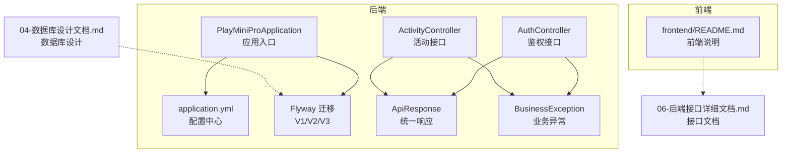
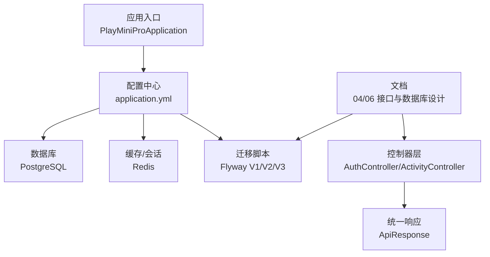
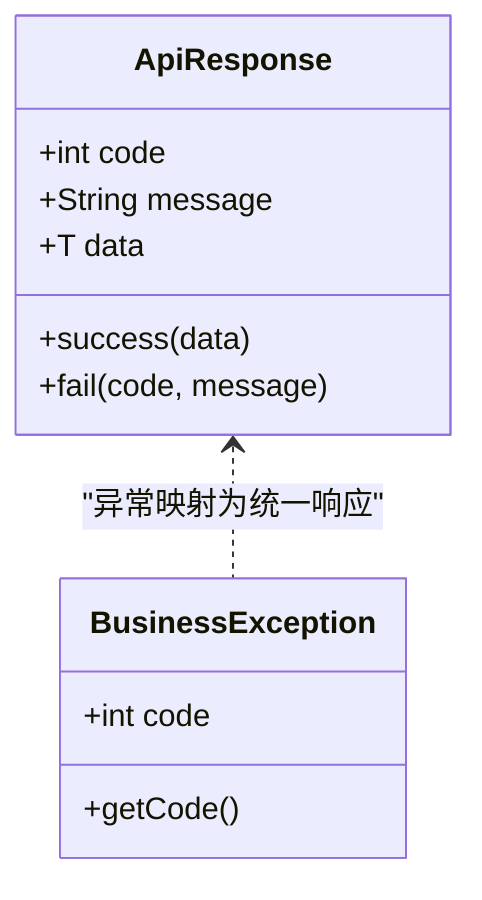
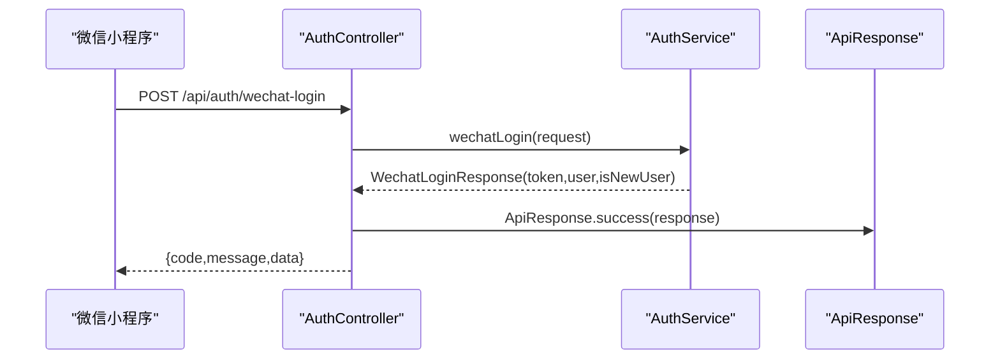
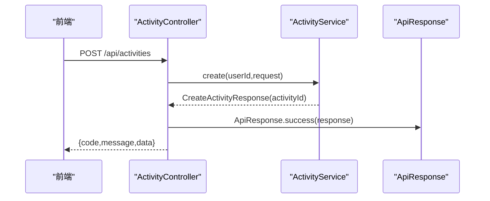
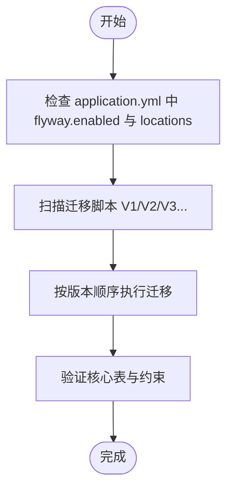
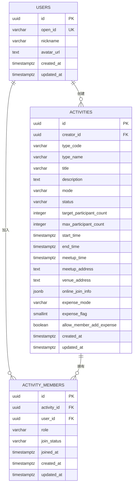
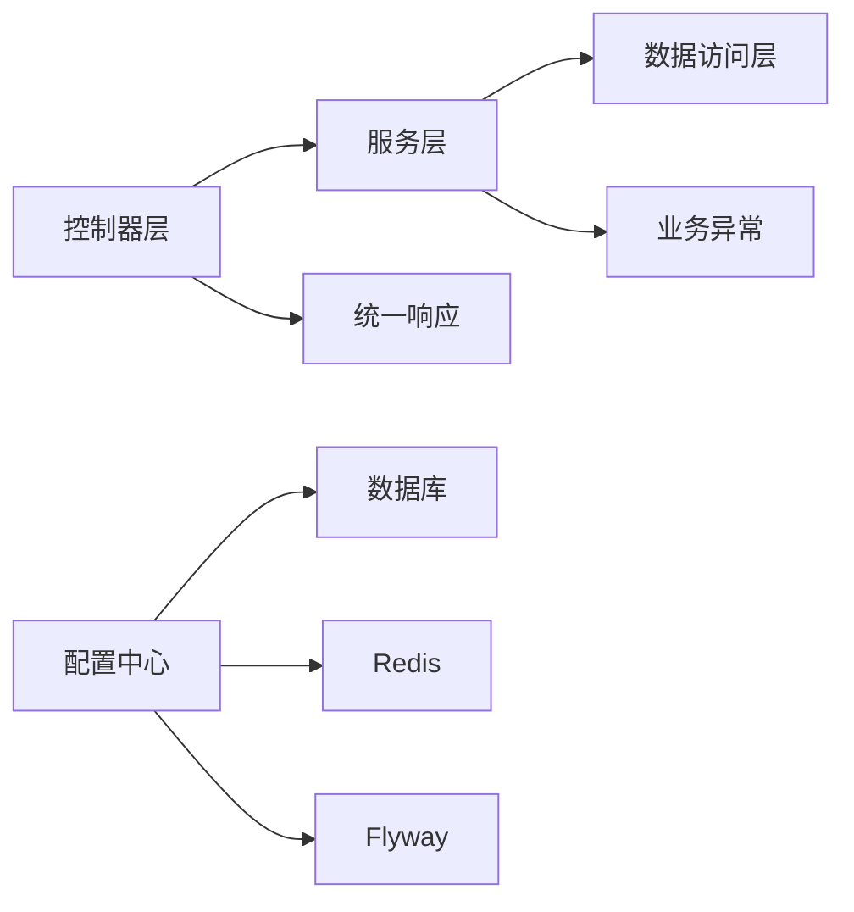

# 文档规范

<cite>
**本文引用的文件**   
- [PlayMiniProApplication.java](file://backend/src/main/java/com/playminipro/PlayMiniProApplication.java)
- [application.yml](file://backend/src/main/resources/application.yml)
- [V1__init_core_tables.sql](file://backend/src/main/resources/db/migration/V1__init_core_tables.sql)
- [V2__add_user_phone_number.sql](file://backend/src/main/resources/db/migration/V2__add_user_phone_number.sql)
- [V3__add_activity_expenses.sql](file://backend/src/main/resources/db/migration/V3__add_activity_expenses.sql)
- [ApiResponse.java](file://backend/src/main/java/com/playminipro/common/response/ApiResponse.java)
- [BusinessException.java](file://backend/src/main/java/com/playminipro/common/exception/BusinessException.java)
- [AuthController.java](file://backend/src/main/java/com/playminipro/auth/controller/AuthController.java)
- [ActivityController.java](file://backend/src/main/java/com/playminipro/activity/controller/ActivityController.java)
- [04-数据库设计文档.md](file://doc/04-数据库设计文档.md)
- [06-后端接口详细文档.md](file://doc/06-后端接口详细文档.md)
- [backend README.md](file://backend/README.md)
- [frontend README.md](file://frontend/README.md)
</cite>

## 目录
1. [简介](#简介)
2. [项目结构](#项目结构)
3. [核心组件](#核心组件)
4. [架构总览](#架构总览)
5. [详细组件分析](#详细组件分析)
6. [依赖分析](#依赖分析)
7. [性能考量](#性能考量)
8. [故障排查指南](#故障排查指南)
9. [结论](#结论)
10. [附录](#附录)

## 简介
本文件为 PlayMiniPro 项目制定标准化技术文档规范，涵盖文档结构与写作格式、术语定义、图表规范；API 文档规范（接口描述、参数说明、响应示例、错误码定义、版本管理）；数据库文档标准（ER 图绘制、字段说明、约束定义、索引策略、迁移文档）；用户手册编写规范（操作步骤、截图说明、FAQ 整理）；变更日志维护标准（版本记录、功能变更、破坏性修改标注）；以及文档审核流程与模板示例，帮助团队建立一致、可维护、可演进的文档体系。

## 项目结构
- 后端采用 Spring Boot 3 + Java 21 + PostgreSQL + MyBatis 架构，Flyway 管理数据库迁移，Redis 用于会话与缓存，应用通过统一响应包装与异常体系保障一致性。
- 前端为微信小程序工程，页面与工具模块清晰分离，便于逐步接入后端接口。
- 文档目录包含数据库设计、接口文档、部署指南等，为前后端协同提供依据。

**图表来源**
- [PlayMiniProApplication.java:1-20](file://backend/src/main/java/com/playminipro/PlayMiniProApplication.java#L1-L20)
- [application.yml:1-53](file://backend/src/main/resources/application.yml#L1-L53)
- [V1__init_core_tables.sql:1-58](file://backend/src/main/resources/db/migration/V1__init_core_tables.sql#L1-L58)
- [V2__add_user_phone_number.sql:1-2](file://backend/src/main/resources/db/migration/V2__add_user_phone_number.sql#L1-L2)
- [V3__add_activity_expenses.sql:1-12](file://backend/src/main/resources/db/migration/V3__add_activity_expenses.sql#L1-L12)
- [AuthController.java:1-27](file://backend/src/main/java/com/playminipro/auth/controller/AuthController.java#L1-L27)
- [ActivityController.java:1-112](file://backend/src/main/java/com/playminipro/activity/controller/ActivityController.java#L1-L112)
- [ApiResponse.java:1-51](file://backend/src/main/java/com/playminipro/common/response/ApiResponse.java#L1-L51)
- [BusinessException.java:1-15](file://backend/src/main/java/com/playminipro/common/exception/BusinessException.java#L1-L15)
- [frontend README.md:1-17](file://frontend/README.md#L1-L17)
- [04-数据库设计文档.md:1-537](file://doc/04-数据库设计文档.md#L1-L537)
- [06-后端接口详细文档.md:1-551](file://doc/06-后端接口详细文档.md#L1-L551)

**章节来源**
- [PlayMiniProApplication.java:1-20](file://backend/src/main/java/com/playminipro/PlayMiniProApplication.java#L1-L20)
- [application.yml:1-53](file://backend/src/main/resources/application.yml#L1-L53)
- [frontend README.md:1-17](file://frontend/README.md#L1-L17)
- [04-数据库设计文档.md:1-537](file://doc/04-数据库设计文档.md#L1-L537)
- [06-后端接口详细文档.md:1-551](file://doc/06-后端接口详细文档.md#L1-L551)

## 核心组件
- 应用入口与扫描：应用入口启用 Mapper 扫描与调度，加载配置属性类，保证模块装配与外部配置注入。
- 配置中心：集中管理数据库、Redis、JWT、微信小程序参数、Flyway 迁移位置等。
- 统一响应与异常：统一响应封装与业务异常定义，确保前后端交互的一致性与可读性。
- 控制器层：鉴权与活动控制器分别暴露微信登录、活动 CRUD、成员与费用相关接口，遵循统一前缀与鉴权头。

**章节来源**
- [PlayMiniProApplication.java:1-20](file://backend/src/main/java/com/playminipro/PlayMiniProApplication.java#L1-L20)
- [application.yml:1-53](file://backend/src/main/resources/application.yml#L1-L53)
- [ApiResponse.java:1-51](file://backend/src/main/java/com/playminipro/common/response/ApiResponse.java#L1-L51)
- [BusinessException.java:1-15](file://backend/src/main/java/com/playminipro/common/exception/BusinessException.java#L1-L15)
- [AuthController.java:1-27](file://backend/src/main/java/com/playminipro/auth/controller/AuthController.java#L1-L27)
- [ActivityController.java:1-112](file://backend/src/main/java/com/playminipro/activity/controller/ActivityController.java#L1-L112)

## 架构总览
下图展示后端应用、配置、数据库迁移、控制器与文档之间的关系，体现文档驱动开发与版本化演进。

**图表来源**
- [PlayMiniProApplication.java:1-20](file://backend/src/main/java/com/playminipro/PlayMiniProApplication.java#L1-L20)
- [application.yml:1-53](file://backend/src/main/resources/application.yml#L1-L53)
- [V1__init_core_tables.sql:1-58](file://backend/src/main/resources/db/migration/V1__init_core_tables.sql#L1-L58)
- [V2__add_user_phone_number.sql:1-2](file://backend/src/main/resources/db/migration/V2__add_user_phone_number.sql#L1-L2)
- [V3__add_activity_expenses.sql:1-12](file://backend/src/main/resources/db/migration/V3__add_activity_expenses.sql#L1-L12)
- [AuthController.java:1-27](file://backend/src/main/java/com/playminipro/auth/controller/AuthController.java#L1-L27)
- [ActivityController.java:1-112](file://backend/src/main/java/com/playminipro/activity/controller/ActivityController.java#L1-L112)
- [04-数据库设计文档.md:1-537](file://doc/04-数据库设计文档.md#L1-L537)
- [06-后端接口详细文档.md:1-551](file://doc/06-后端接口详细文档.md#L1-L551)

## 详细组件分析

### 统一响应与异常规范
- 统一响应结构：包含 code、message、data 字段，成功返回 code=0，失败返回具体错误码与消息。
- 业务异常：自定义 BusinessException，携带业务错误码，便于全局捕获与映射。
- 建议：所有控制器返回值均通过 ApiResponse 包装，异常通过全局处理器转换为统一响应。

**图表来源**
- [ApiResponse.java:1-51](file://backend/src/main/java/com/playminipro/common/response/ApiResponse.java#L1-L51)
- [BusinessException.java:1-15](file://backend/src/main/java/com/playminipro/common/exception/BusinessException.java#L1-L15)

**章节来源**
- [ApiResponse.java:1-51](file://backend/src/main/java/com/playminipro/common/response/ApiResponse.java#L1-L51)
- [BusinessException.java:1-15](file://backend/src/main/java/com/playminipro/common/exception/BusinessException.java#L1-L15)

### 鉴权与登录接口规范
- 接口前缀：/api
- 鉴权头：Authorization: Bearer <token>
- 登录流程：接收 code，调用微信 code2Session，创建或更新用户并签发业务 token。
- 响应结构：统一 ApiResponse，data 中包含 token 与用户信息。

**图表来源**
- [AuthController.java:1-27](file://backend/src/main/java/com/playminipro/auth/controller/AuthController.java#L1-L27)
- [06-后端接口详细文档.md:68-106](file://doc/06-后端接口详细文档.md#L68-L106)
- [ApiResponse.java:1-51](file://backend/src/main/java/com/playminipro/common/response/ApiResponse.java#L1-L51)

**章节来源**
- [AuthController.java:1-27](file://backend/src/main/java/com/playminipro/auth/controller/AuthController.java#L1-L27)
- [06-后端接口详细文档.md:68-106](file://doc/06-后端接口详细文档.md#L68-L106)

### 活动接口规范
- 接口覆盖：创建、编辑、取消、详情、成员、费用、结算、个人画像等。
- 请求/响应：统一使用 ApiResponse，分页场景包含 list、page、pageSize、total、hasMore。
- 错误码：建议至少覆盖活动不存在、人数已满、权限不足、状态不可重复提交等常见错误。

**图表来源**
- [ActivityController.java:1-112](file://backend/src/main/java/com/playminipro/activity/controller/ActivityController.java#L1-L112)
- [06-后端接口详细文档.md:108-150](file://doc/06-后端接口详细文档.md#L108-L150)
- [ApiResponse.java:1-51](file://backend/src/main/java/com/playminipro/common/response/ApiResponse.java#L1-L51)

**章节来源**
- [ActivityController.java:1-112](file://backend/src/main/java/com/playminipro/activity/controller/ActivityController.java#L1-L112)
- [06-后端接口详细文档.md:108-150](file://doc/06-后端接口详细文档.md#L108-L150)

### 数据库迁移与表结构规范
- 迁移管理：Flyway 启用，迁移脚本位于 classpath:db/migration，按版本号顺序执行。
- 核心表：users、activities、activity_members 等，包含主键、外键、约束与索引。
- 扩展脚本：V2/V3 为用户手机号与活动费用表的补充，遵循相同命名与注释规范。

**图表来源**
- [application.yml:20-22](file://backend/src/main/resources/application.yml#L20-L22)
- [V1__init_core_tables.sql:1-58](file://backend/src/main/resources/db/migration/V1__init_core_tables.sql#L1-L58)
- [V2__add_user_phone_number.sql:1-2](file://backend/src/main/resources/db/migration/V2__add_user_phone_number.sql#L1-L2)
- [V3__add_activity_expenses.sql:1-12](file://backend/src/main/resources/db/migration/V3__add_activity_expenses.sql#L1-L12)

**章节来源**
- [application.yml:20-22](file://backend/src/main/resources/application.yml#L20-L22)
- [V1__init_core_tables.sql:1-58](file://backend/src/main/resources/db/migration/V1__init_core_tables.sql#L1-L58)
- [V2__add_user_phone_number.sql:1-2](file://backend/src/main/resources/db/migration/V2__add_user_phone_number.sql#L1-L2)
- [V3__add_activity_expenses.sql:1-12](file://backend/src/main/resources/db/migration/V3__add_activity_expenses.sql#L1-L12)

### 数据库 ER 图与字段规范
- ER 图绘制：基于数据库设计文档的表与关系，绘制实体-关系图，标注主键、外键、基数与弱实体。
- 字段说明：明确字段含义、类型、长度、是否可空、默认值、约束条件与索引建议。
- 约束与索引：在迁移脚本中显式声明约束与索引，确保查询性能与数据一致性。
- 迁移文档：每次变更以独立迁移脚本记录，包含变更目的、影响范围与回滚策略。

**图表来源**
- [V1__init_core_tables.sql:3-38](file://backend/src/main/resources/db/migration/V1__init_core_tables.sql#L3-L38)
- [V1__init_core_tables.sql:43-55](file://backend/src/main/resources/db/migration/V1__init_core_tables.sql#L43-L55)
- [04-数据库设计文档.md:65-126](file://doc/04-数据库设计文档.md#L65-L126)
- [04-数据库设计文档.md:127-155](file://doc/04-数据库设计文档.md#L127-L155)

**章节来源**
- [04-数据库设计文档.md:65-155](file://doc/04-数据库设计文档.md#L65-L155)
- [V1__init_core_tables.sql:3-55](file://backend/src/main/resources/db/migration/V1__init_core_tables.sql#L3-L55)

### 用户手册编写规范
- 操作步骤：按“前置条件—登录—创建活动—邀请成员—记账与结算”的主线流程编写，每步给出截图说明。
- 截图说明：标注关键按钮、输入框、提示信息，突出状态变化（如“已同意”、“待确认”）。
- FAQ 整理：围绕登录失败、活动人数上限、费用分摊争议、结算转账确认等高频问题提供解答与排查步骤。

[本节为通用规范说明，无需特定文件引用]

### 变更日志维护标准
- 版本记录：以语义化版本管理，记录 major.minor.patch 与发布日期。
- 功能变更：区分新增、优化、修复三类，简述影响范围与升级建议。
- 破坏性修改：明确标记接口变更、字段删除、迁移脚本破坏性改动，提供迁移指引与兼容方案。

[本节为通用规范说明，无需特定文件引用]

### 文档审核流程
- 编写阶段：明确文档模板与评审清单，确保结构完整、术语统一、示例可复现。
- 审核阶段：指定文档负责人与技术负责人双审，关注一致性、准确性与可维护性。
- 发布与追踪：文档随版本发布，建立变更追踪机制，定期回顾与更新。

[本节为通用规范说明，无需特定文件引用]

## 依赖分析
- 组件耦合：控制器依赖服务层，服务层依赖数据访问层与配置；统一响应与异常贯穿各层，提升一致性。
- 外部依赖：PostgreSQL、Redis、Flyway、JWT、微信登录网关等，均通过配置中心集中管理。
- 潜在循环依赖：当前结构为单向依赖（Controller → Service → Mapper/Repository），无明显循环。

**图表来源**
- [application.yml:1-53](file://backend/src/main/resources/application.yml#L1-L53)
- [ApiResponse.java:1-51](file://backend/src/main/java/com/playminipro/common/response/ApiResponse.java#L1-L51)
- [BusinessException.java:1-15](file://backend/src/main/java/com/playminipro/common/exception/BusinessException.java#L1-L15)

**章节来源**
- [application.yml:1-53](file://backend/src/main/resources/application.yml#L1-L53)
- [ApiResponse.java:1-51](file://backend/src/main/java/com/playminipro/common/response/ApiResponse.java#L1-L51)
- [BusinessException.java:1-15](file://backend/src/main/java/com/playminipro/common/exception/BusinessException.java#L1-L15)

## 性能考量
- 查询性能：在高频查询字段上建立索引（如活动创建者与状态、成员用户与状态），避免全表扫描。
- 聚合与缓存：排行榜与统计采用异步聚合与缓存，减少热点页面的实时计算压力。
- 事务边界：涉及状态流转的关键接口（创建活动、同意入局、发起结算）置于事务中，保证一致性。
- 迁移与上线：使用 Flyway 管理数据库版本，避免手工修改线上库带来的风险。

[本节为通用指导，无需特定文件引用]

## 故障排查指南
- 登录问题：检查 WECHAT_MINI_APP_SECRET 与 WECHAT_MOCK_LOGIN_ENABLED 配置，确认后端是否按微信官方流程调用 code2Session。
- 鉴权失败：确认 Authorization 头格式与 JWT 有效期，检查 Redis 会话是否存在与续期逻辑。
- 接口报错：对照统一响应与业务异常，定位具体错误码并结合接口文档进行排查。
- 数据库问题：核对 Flyway 迁移是否执行成功，检查约束与索引是否匹配设计文档。

**章节来源**
- [backend README.md:53-79](file://backend/README.md#L53-L79)
- [application.yml:42-49](file://backend/src/main/resources/application.yml#L42-L49)

## 结论
通过建立统一的文档规范与审核流程，PlayMiniPro 项目可在快速迭代的同时保持文档质量与一致性。建议以本文档为基线，结合实际开发实践持续优化，形成可复用、可演进的文档体系。

[本节为总结性内容，无需特定文件引用]

## 附录
- 文档模板与示例：参考接口文档与数据库设计文档的结构与示例，统一术语与格式。
- 最佳实践案例：围绕邀请回执闭环、费用与结算流程、排行榜与统计聚合等场景，沉淀可复用的设计与实现思路。

[本节为通用内容，无需特定文件引用]